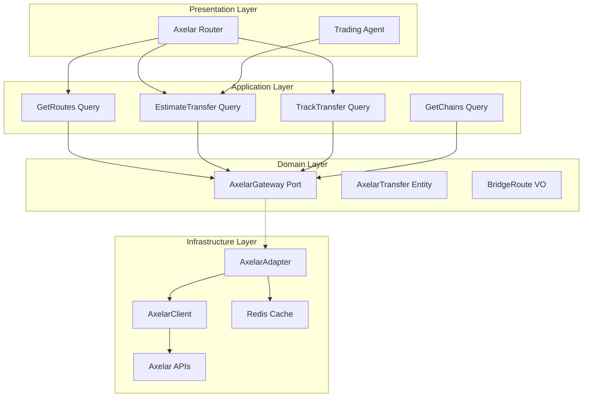

# Design Document: Axelar Network Integration

## Overview

This document defines the technical architecture for completing the Axelar Network integration into the Anvil Backend. The existing `AxelarClient` infrastructure adapter provides basic API connectivity. This design focuses on building the domain layer, application interactors, and HTTP endpoints for cross-chain bridging and GMP tracking.

The integration enables:
- Bridge route discovery and comparison
- Transfer cost estimation with express support
- Cross-chain transfer status tracking
- GMP (General Message Passing) transaction monitoring

## Steering Document Alignment

### Technical Standards (tech.md)

- **Hexagonal Architecture**: AxelarAdapter implements domain-defined port
- **Dependency Injection**: Adapter registered in Dishka container
- **Async-First**: All API calls use async HTTP client
- **Caching**: Appropriate caching for route and chain data
- **Error Handling**: Domain exceptions for bridge errors

### Project Structure (structure.md)

```
src/app/
├── domain/
│   ├── entities/
│   │   └── bridge/
│   │       ├── axelar_transfer.py         # Transfer entity (NEW)
│   │       └── gmp_transaction.py         # GMP tx entity (NEW)
│   ├── value_objects/
│   │   └── bridge/
│   │       ├── bridge_route.py            # Route VO (NEW)
│   │       ├── transfer_estimate.py       # Estimate VO (NEW)
│   │       └── transfer_status.py         # Status enum (NEW)
│   └── ports/
│       └── axelar_gateway.py              # Port interface (NEW)
├── application/
│   ├── queries/
│   │   └── axelar/
│   │       ├── get_routes.py              # Route discovery (NEW)
│   │       ├── estimate_transfer.py       # Cost estimation (NEW)
│   │       ├── track_transfer.py          # Status tracking (NEW)
│   │       └── get_chains.py              # Chain info (NEW)
├── infrastructure/
│   └── adapters/
│       └── external/
│           ├── axelar_client.py           # Existing ✅
│           └── axelar_adapter.py          # Gateway impl (NEW)
└── presentation/
    └── http/
        └── controllers/
            └── defi/
                └── axelar_router.py       # HTTP endpoints (NEW)
```

## Code Reuse Analysis

### Existing Components to Leverage

| Component | Location | Integration |
|-----------|----------|-------------|
| **AxelarClient** | `src/app/infrastructure/adapters/external/axelar_client.py` | Wrap with adapter |
| **ExternalAPICache** | `src/app/infrastructure/cache/external_api_cache.py` | Cache routes/chains |
| **LI.FI Integration** | Cross-Chain Gateway | Compare routes |

---

## Architecture

### High-Level Architecture



---

## Components and Interfaces

### Component 1: AxelarGateway Port

- **Purpose:** Define domain interface for Axelar operations
- **Interfaces:**
  ```python
  class AxelarGateway(Protocol):
      """Port for Axelar cross-chain operations"""
      
      async def get_routes(
          self,
          source_chain: str,
          destination_chain: str,
          token: str = "USDC",
      ) -> list[BridgeRoute]:
          """Get available bridge routes"""
          ...
      
      async def estimate_transfer(
          self,
          source_chain: str,
          destination_chain: str,
          token: str,
          amount: str,
          express: bool = False,
      ) -> TransferEstimate:
          """Estimate transfer costs"""
          ...
      
      async def track_transfer(
          self,
          tx_hash: str,
      ) -> AxelarTransfer | None:
          """Track transfer status"""
          ...
      
      async def get_chains(self) -> list[AxelarChain]:
          """Get supported chains"""
          ...
      
      async def get_tokens(
          self,
          chain: str,
      ) -> list[AxelarToken]:
          """Get supported tokens for chain"""
          ...
  ```
- **Location:** `src/app/domain/ports/axelar_gateway.py`

### Component 2: AxelarAdapter

- **Purpose:** Implement AxelarGateway using AxelarClient
- **Interfaces:**
  ```python
  class AxelarAdapter(AxelarGateway):
      """Axelar implementation of AxelarGateway"""
      
      def __init__(
          self,
          client: AxelarClient,
          cache: ExternalAPICache,
          route_cache_ttl: int = 300,      # 5 minutes
          chain_cache_ttl: int = 3600,     # 1 hour
          transfer_cache_ttl: int = 15,    # 15 seconds
      ):
          self._client = client
          self._cache = cache
      
      async def get_routes(
          self,
          source_chain: str,
          destination_chain: str,
          token: str = "USDC",
      ) -> list[BridgeRoute]:
          """Get routes with caching"""
          cache_key = f"axelar:routes:{source_chain}:{destination_chain}:{token}"
          cached = await self._cache.get(cache_key)
          if cached:
              return [BridgeRoute.from_dict(r) for r in cached]
          
          raw_routes = await self._client.get_bridge_routes(
              source_chain=source_chain,
              destination_chain=destination_chain,
              token=token,
          )
          routes = [self._transform_route(r) for r in raw_routes]
          await self._cache.set(cache_key, [r.to_dict() for r in routes], self._route_cache_ttl)
          return routes
      
      async def estimate_transfer(
          self,
          source_chain: str,
          destination_chain: str,
          token: str,
          amount: str,
          express: bool = False,
      ) -> TransferEstimate:
          """Estimate transfer with express option"""
          raw_estimate = await self._client.estimate_transfer(
              source_chain=source_chain,
              destination_chain=destination_chain,
              token=token,
              amount=amount,
          )
          
          estimate = self._transform_estimate(raw_estimate)
          
          # Add express premium if requested
          if express:
              estimate = self._apply_express_premium(estimate)
          
          return estimate
      
      def _apply_express_premium(self, estimate: TransferEstimate) -> TransferEstimate:
          """Apply express service premium"""
          express_multiplier = Decimal("2.0")  # 2x fee for express
          return TransferEstimate(
              source_chain=estimate.source_chain,
              destination_chain=estimate.destination_chain,
              token=estimate.token,
              amount=estimate.amount,
              fee_usd=estimate.fee_usd * express_multiplier,
              gas_estimate_usd=estimate.gas_estimate_usd,
              total_cost_usd=estimate.fee_usd * express_multiplier + estimate.gas_estimate_usd,
              estimated_time_seconds=estimate.estimated_time_seconds // 3,  # 3x faster
              is_express=True,
          )
  ```
- **Location:** `src/app/infrastructure/adapters/external/axelar_adapter.py`

### Component 3: EstimateTransfer Query

- **Purpose:** Estimate transfer costs with options
- **Interfaces:**
  ```python
  @dataclass
  class EstimateTransferRequest:
      source_chain: str
      destination_chain: str
      token: str
      amount: str
      include_express: bool = True
  
  class EstimateTransfer:
      """Estimate Axelar transfer costs"""
      
      def __init__(self, gateway: AxelarGateway):
          self._gateway = gateway
      
      async def execute(self, request: EstimateTransferRequest) -> TransferEstimateResponse:
          # Standard estimate
          standard = await self._gateway.estimate_transfer(
              source_chain=request.source_chain,
              destination_chain=request.destination_chain,
              token=request.token,
              amount=request.amount,
              express=False,
          )
          
          response = TransferEstimateResponse(
              standard=standard,
              express=None,
              recommendation=None,
          )
          
          # Express estimate if requested
          if request.include_express:
              express = await self._gateway.estimate_transfer(
                  source_chain=request.source_chain,
                  destination_chain=request.destination_chain,
                  token=request.token,
                  amount=request.amount,
                  express=True,
              )
              response.express = express
              response.recommendation = self._recommend(standard, express)
          
          return response
      
      def _recommend(
          self,
          standard: TransferEstimate,
          express: TransferEstimate,
      ) -> str:
          """Recommend standard or express based on trade-offs"""
          time_savings = standard.estimated_time_seconds - express.estimated_time_seconds
          cost_diff = express.total_cost_usd - standard.total_cost_usd
          
          # If time savings > 10 min and cost < $5, recommend express
          if time_savings > 600 and cost_diff < 5:
              return "EXPRESS"
          return "STANDARD"
  ```
- **Location:** `src/app/application/queries/axelar/estimate_transfer.py`

### Component 4: TrackTransfer Query

- **Purpose:** Track transfer status
- **Interfaces:**
  ```python
  @dataclass
  class TrackTransferRequest:
      tx_hash: str
  
  class TrackTransfer:
      """Track Axelar transfer status"""
      
      def __init__(self, gateway: AxelarGateway):
          self._gateway = gateway
      
      async def execute(self, request: TrackTransferRequest) -> TransferTrackingResponse:
          transfer = await self._gateway.track_transfer(request.tx_hash)
          
          if not transfer:
              raise TransferNotFoundError(f"Transfer not found: {request.tx_hash}")
          
          return TransferTrackingResponse(
              transfer=transfer,
              progress_pct=self._calculate_progress(transfer),
              next_step=self._get_next_step(transfer),
              estimated_completion=self._estimate_completion(transfer),
          )
      
      def _calculate_progress(self, transfer: AxelarTransfer) -> int:
          """Calculate progress percentage"""
          status_progress = {
              TransferStatus.PENDING: 10,
              TransferStatus.CONFIRMED: 30,
              TransferStatus.EXECUTING: 70,
              TransferStatus.EXECUTED: 100,
              TransferStatus.FAILED: 0,
          }
          return status_progress.get(transfer.status, 0)
      
      def _get_next_step(self, transfer: AxelarTransfer) -> str:
          """Get human-readable next step"""
          next_steps = {
              TransferStatus.PENDING: "Waiting for source chain confirmation",
              TransferStatus.CONFIRMED: "Relaying to destination chain",
              TransferStatus.EXECUTING: "Executing on destination chain",
              TransferStatus.EXECUTED: "Transfer complete",
              TransferStatus.FAILED: "Transfer failed - check error message",
          }
          return next_steps.get(transfer.status, "Unknown")
  ```
- **Location:** `src/app/application/queries/axelar/track_transfer.py`

### Component 5: Axelar Router

- **Purpose:** HTTP endpoints for Axelar operations
- **Interfaces:**
  ```python
  router = APIRouter(prefix="/defi/axelar", tags=["defi", "bridge"])
  
  @router.get("/routes")
  async def get_routes(
      source_chain: str,
      destination_chain: str,
      token: str = "USDC",
      query: GetRoutes = Depends(),
  ) -> RoutesResponse:
      """Get bridge routes"""
      ...
  
  @router.get("/estimate")
  async def estimate_transfer(
      source_chain: str,
      destination_chain: str,
      token: str,
      amount: str,
      include_express: bool = True,
      query: EstimateTransfer = Depends(),
  ) -> TransferEstimateResponse:
      """Estimate transfer costs"""
      ...
  
  @router.get("/transfer/{tx_hash}")
  async def track_transfer(
      tx_hash: str,
      query: TrackTransfer = Depends(),
  ) -> TransferTrackingResponse:
      """Track transfer status"""
      ...
  
  @router.get("/chains")
  async def get_chains(
      query: GetChains = Depends(),
  ) -> ChainsResponse:
      """Get supported chains"""
      ...
  
  @router.get("/tokens/{chain}")
  async def get_tokens(
      chain: str,
      query: GetTokens = Depends(),
  ) -> TokensResponse:
      """Get supported tokens for chain"""
      ...
  ```
- **Location:** `src/app/presentation/http/controllers/defi/axelar_router.py`

---

## Data Models

### AxelarTransfer Entity

```python
@dataclass
class AxelarTransfer:
    """Axelar transfer entity"""
    tx_hash: str
    source_chain: str
    destination_chain: str
    token: str
    amount: Decimal
    status: TransferStatus
    source_tx_hash: str | None
    destination_tx_hash: str | None
    created_at: datetime
    completed_at: datetime | None
    error_message: str | None = None
    is_express: bool = False
```

### TransferStatus Enum

```python
class TransferStatus(Enum):
    """Transfer status"""
    PENDING = "pending"
    CONFIRMED = "confirmed"
    EXECUTING = "executing"
    EXECUTED = "executed"
    FAILED = "failed"
```

### BridgeRoute Value Object

```python
@dataclass(frozen=True)
class BridgeRoute:
    """Bridge route value object"""
    source_chain: str
    destination_chain: str
    token: str
    estimated_time_seconds: int
    fee_usd: Decimal
    fee_native: Decimal
    security_score: int        # 0-100
    is_express: bool = False
```

### TransferEstimate Value Object

```python
@dataclass(frozen=True)
class TransferEstimate:
    """Transfer estimate value object"""
    source_chain: str
    destination_chain: str
    token: str
    amount: Decimal
    fee_usd: Decimal
    gas_estimate_usd: Decimal
    total_cost_usd: Decimal
    estimated_time_seconds: int
    is_express: bool = False
```

---

## Error Handling

### Error Mapping

| Error | HTTP Status | Domain Exception |
|-------|-------------|------------------|
| Transfer not found | 404 | `TransferNotFoundError` |
| Chain not supported | 400 | `UnsupportedChainError` |
| Token not supported | 400 | `UnsupportedTokenError` |
| API error | 502 | `AxelarAPIError` |

### Exception Classes

```python
# src/app/domain/exceptions/axelar.py
class AxelarError(DomainError):
    """Base exception for Axelar operations"""
    pass

class TransferNotFoundError(AxelarError):
    """Transfer not found by tx hash"""
    pass

class UnsupportedChainError(AxelarError):
    """Chain not supported by Axelar"""
    pass

class UnsupportedTokenError(AxelarError):
    """Token not supported on chain"""
    pass
```

---

## Caching Strategy

| Data Type | Cache Key | TTL | Notes |
|-----------|-----------|-----|-------|
| Chains | `axelar:chains` | 1 hour | Static data |
| Tokens | `axelar:tokens:{chain}` | 1 hour | Per-chain |
| Routes | `axelar:routes:{src}:{dst}:{token}` | 5 min | Route discovery |
| Transfer (active) | `axelar:transfer:{tx_hash}` | 15s | Fast refresh |
| Transfer (complete) | `axelar:transfer:{tx_hash}` | 24h | Permanent |
| Estimate | Not cached | N/A | Real-time |

---

## API Endpoints Summary

| Method | Endpoint | Description |
|--------|----------|-------------|
| GET | `/api/v1/defi/axelar/routes` | Bridge routes |
| GET | `/api/v1/defi/axelar/estimate` | Cost estimation |
| GET | `/api/v1/defi/axelar/transfer/{tx_hash}` | Track transfer |
| GET | `/api/v1/defi/axelar/chains` | Supported chains |
| GET | `/api/v1/defi/axelar/tokens/{chain}` | Tokens per chain |

---

## Configuration

```toml
# config/local/config.toml
[axelar]
enabled = true
testnet = false
cache_route_ttl = 300
cache_chain_ttl = 3600
cache_transfer_ttl = 15

[axelar.express]
enabled = true
fee_multiplier = 2.0
time_divisor = 3

[axelar.endpoints]
mainnet = "https://api.axelarscan.io"
gmp = "https://api.gmp.axelarscan.io"
```

---

## Testing Strategy

### Unit Testing

- **AxelarAdapter**: Mock client, test transformations
- **Express Premium**: Test fee calculations
- **Status Tracking**: Test progress calculations

### Integration Testing

- **Route Discovery**: Test chain pair coverage
- **Transfer Tracking**: Test with real tx hashes
