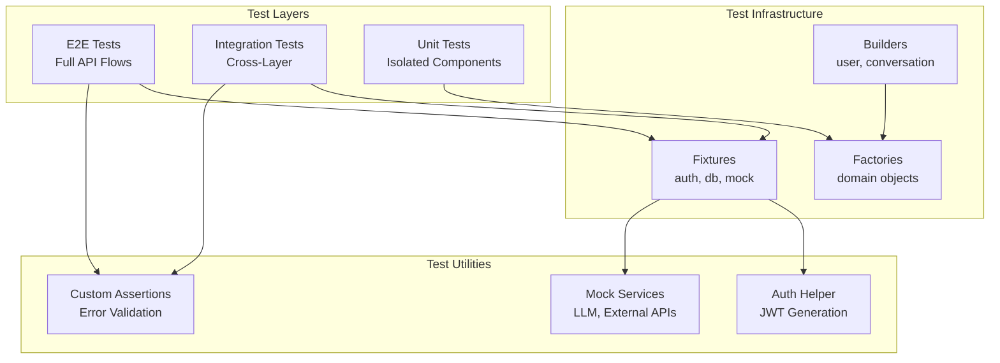

# Design Document: Comprehensive API Testing Suite

## Overview

This design document outlines the technical architecture for a comprehensive API testing suite covering the entire Anvil Backend platform. The suite includes authentication flow tests using the internal JWT-based auth system (not Privy), chat functionality with LLM content verification, admin endpoints, and all user-facing features. The testing framework leverages pytest with pytest-asyncio, FastAPI TestClient, and proper dependency injection mocking through Dishka.

## Steering Document Alignment

### Technical Standards (tech.md)
- **Hexagonal Architecture**: Tests are organized by layer (domain, application, infrastructure, presentation)
- **CQRS Pattern**: Separate test paths for command vs query operations
- **Dependency Injection**: Uses Dishka container overrides for test isolation
- **Error Handling**: Tests verify standardized error responses with i18n keys

### Project Structure (structure.md)
- Tests mirror source structure in `tests/` directory
- Fixtures centralized in `tests/fixtures/`
- Builders pattern for test data in `tests/builders/`
- Integration tests use actual database with transaction rollback

## Code Reuse Analysis

### Existing Components to Leverage

- **`tests/conftest.py`**: Base pytest configuration with markers and session fixtures
- **`tests/fixtures/auth_fixtures.py`**: JWT token generation and auth headers
- **`tests/fixtures/database_fixtures.py`**: Database session and cleanup
- **`tests/fixtures/mock_services.py`**: Mock external services
- **`tests/builders/user_builder.py`**: Fluent user test data builder
- **`tests/builders/conversation_builder.py`**: Conversation test data builder
- **`tests/builders/message_builder.py`**: Message test data builder

### Integration Points

- **FastAPI TestClient**: HTTP request simulation via `fastapi.testclient.TestClient`
- **Dishka Container**: Override providers for test isolation
- **SQLAlchemy Session**: Transaction-based test isolation
- **Redis Mock**: For session storage testing
- **LLM Mock**: For chat response verification

## Architecture

The testing architecture follows a layered approach that mirrors the application architecture:



### Modular Design Principles

- **Single File Responsibility**: Each test file tests one endpoint or feature module
- **Component Isolation**: Test fixtures are independent and composable
- **Service Layer Separation**: Mock boundaries align with architectural layers
- **Utility Modularity**: Shared assertions and helpers in dedicated modules

## Components and Interfaces

### Component 1: Authentication Test Helper

- **Purpose**: Generate valid JWT tokens and sessions for testing
- **File**: `tests/helpers/auth_helper.py`
- **Interfaces**:
  - `create_test_user(role: str) -> Tuple[User, str]` - Create user with JWT
  - `get_auth_headers(token: str) -> dict` - Generate auth headers
  - `create_admin_session() -> Tuple[User, str]` - Create admin with session
  - `invalidate_session(session_id: str) -> None` - Clean up session
- **Dependencies**: `app.infrastructure.auth.session.service`, `app.domain.entities.user`
- **Reuses**: `tests/fixtures/auth_fixtures.py`, `tests/builders/user_builder.py`

### Component 2: LLM Response Verifier

- **Purpose**: Validate LLM responses meet quality and format standards
- **File**: `tests/helpers/llm_verifier.py`
- **Interfaces**:
  - `verify_response_structure(response: dict) -> bool` - Check response format
  - `verify_content_relevance(query: str, response: str) -> float` - Measure relevance
  - `verify_risk_disclaimers(response: str) -> bool` - Check for required disclaimers
  - `verify_defi_data_format(data: dict) -> bool` - Validate DeFi data structure
- **Dependencies**: None (pure validation logic)
- **Reuses**: None (new component)

### Component 3: Error Response Validator

- **Purpose**: Validate standardized error responses
- **File**: `tests/helpers/error_validator.py`
- **Interfaces**:
  - `validate_error_response(response: Response, expected_code: str) -> None`
  - `validate_i18n_key(error: dict) -> bool`
  - `validate_http_status_match(error: dict, status: int) -> bool`
- **Dependencies**: `app.domain.exceptions.error_codes`
- **Reuses**: `app.presentation.http.errors.models`

### Component 4: API Test Client Wrapper

- **Purpose**: Provide authenticated test client with session management
- **File**: `tests/helpers/api_client.py`
- **Interfaces**:
  - `AuthenticatedClient.login(email: str, password: str) -> None`
  - `AuthenticatedClient.get(path: str) -> Response`
  - `AuthenticatedClient.post(path: str, json: dict) -> Response`
  - `AuthenticatedClient.as_admin() -> AuthenticatedClient`
- **Dependencies**: `fastapi.testclient.TestClient`
- **Reuses**: `tests/fixtures/auth_fixtures.py`

### Component 5: Database Test Manager

- **Purpose**: Manage test database state and transactions
- **File**: `tests/helpers/db_manager.py`
- **Interfaces**:
  - `setup_test_db() -> AsyncSession`
  - `rollback_transaction() -> None`
  - `seed_test_data(fixtures: list) -> None`
  - `cleanup() -> None`
- **Dependencies**: `sqlalchemy.ext.asyncio`, `app.infrastructure.persistence_sqla`
- **Reuses**: `tests/fixtures/database_fixtures.py`

## Data Models

### TestUser Model
```python
@dataclass
class TestUser:
    id: UUID
    email: str
    password: str  # Plain text for testing
    role: UserRole
    is_active: bool = True
    is_verified: bool = True
    access_token: str | None = None
    refresh_token: str | None = None
    session_id: str | None = None
```

### TestConversation Model
```python
@dataclass
class TestConversation:
    id: UUID
    user_id: UUID
    title: str | None = None
    messages: list[TestMessage] = field(default_factory=list)
    created_at: datetime = field(default_factory=datetime.utcnow)
```

### TestMessage Model
```python
@dataclass
class TestMessage:
    id: UUID
    conversation_id: UUID
    role: MessageRole  # USER, AGENT, SYSTEM
    content: str
    agent_type: AgentType | None = None
    created_at: datetime = field(default_factory=datetime.utcnow)
```

### ErrorTestCase Model
```python
@dataclass
class ErrorTestCase:
    name: str
    endpoint: str
    method: str
    request_data: dict | None
    expected_status: int
    expected_error_code: str
    expected_i18n_key: str
    auth_required: bool = True
    admin_required: bool = False
```

## Error Handling

### Error Scenarios

1. **Authentication Failure**
   - **Handling:** Test verifies 401 response with `AUTH_001` code
   - **User Impact:** User sees "Invalid credentials" message

2. **Authorization Denied**
   - **Handling:** Test verifies 403 response with `AUTH_005` or `ADMIN_001` code
   - **User Impact:** User sees "Access denied" message

3. **Resource Not Found**
   - **Handling:** Test verifies 404 response with appropriate error code
   - **User Impact:** User sees "Resource not found" message

4. **Validation Error**
   - **Handling:** Test verifies 400/422 response with field details
   - **User Impact:** User sees field-specific validation messages

5. **Rate Limit Exceeded**
   - **Handling:** Test verifies 429 response with `RATE_001` code
   - **User Impact:** User sees "Too many requests" with retry-after

6. **Service Unavailable**
   - **Handling:** Test verifies 503 response with `SVC_001` code
   - **User Impact:** User sees "Service temporarily unavailable"

## Testing Strategy

### Unit Testing

**Approach**: Test individual components in isolation with mocked dependencies

**Key Components to Test**:
- Domain entities: `Conversation`, `Message`, `User`
- Value objects: `Email`, `Password`, `AgentType`
- Application interactors: `CreateConversation`, `SendMessage`
- Error translators: `StandardizedErrorTranslator`, `AuthErrorTranslator`

**Example Structure**:
```
tests/unit/
├── domain/
│   ├── entities/
│   │   ├── test_conversation.py
│   │   └── test_message.py
│   └── value_objects/
│       └── test_message_role.py
├── application/
│   ├── commands/
│   │   └── test_create_conversation.py
│   └── queries/
│       └── test_get_conversation.py
└── presentation/
    └── test_error_translators.py
```

### Integration Testing

**Approach**: Test cross-layer interactions with real database and mocked external services

**Key Flows to Test**:
1. **Authentication Flow**:
   - Register → Verify Email → Login → Access Protected → Refresh → Logout
   
2. **Chat Flow**:
   - Create Conversation → Send Message → Receive Response → List History
   
3. **Admin Flow**:
   - Admin Login → List Users → Grant Admin → Revoke Admin
   
4. **Subscription Flow**:
   - List Plans → Create Subscription → Verify Status → Cancel

**Example Structure**:
```
tests/integration/
├── auth/
│   ├── test_login_flow.py
│   ├── test_registration_flow.py
│   └── test_password_reset_flow.py
├── chat/
│   ├── test_conversation_lifecycle.py
│   └── test_message_routing.py
├── admin/
│   ├── test_user_management.py
│   └── test_llm_configuration.py
└── subscription/
    └── test_subscription_lifecycle.py
```

### End-to-End Testing

**Approach**: Test complete user workflows with minimal mocking

**User Scenarios to Test**:
1. **New User Journey**: Sign up → Verify → Login → Create Chat → Get Response
2. **Power User Journey**: Login → Multiple Conversations → Different Agents
3. **Admin Journey**: Login → Manage Users → Configure LLM → View Metrics
4. **Subscription Journey**: Login → View Plans → Subscribe → Access Premium

**Example Structure**:
```
tests/e2e/
├── user/
│   ├── test_new_user_journey.py
│   ├── test_chat_workflow.py
│   └── test_portfolio_workflow.py
├── admin/
│   ├── test_user_management_workflow.py
│   └── test_system_configuration.py
└── subscription/
    └── test_subscription_workflow.py
```

## Test File Organization

### Directory Structure
```
tests/
├── conftest.py                    # Global fixtures and configuration
├── helpers/
│   ├── __init__.py
│   ├── auth_helper.py             # JWT and session management
│   ├── api_client.py              # Authenticated test client
│   ├── db_manager.py              # Database test utilities
│   ├── error_validator.py         # Error response validation
│   └── llm_verifier.py            # LLM response verification
├── fixtures/
│   ├── __init__.py
│   ├── auth_fixtures.py           # Auth-related fixtures
│   ├── database_fixtures.py       # DB session fixtures
│   ├── domain_factories.py        # Domain object factories
│   ├── graphrag_fixtures.py       # GraphRAG test data
│   ├── ml_fixtures.py             # ML prediction fixtures
│   └── mock_services.py           # External service mocks
├── builders/
│   ├── __init__.py
│   ├── user_builder.py            # User test data builder
│   ├── conversation_builder.py   # Conversation builder
│   └── message_builder.py         # Message builder
├── unit/                          # Unit tests by layer
├── integration/                   # Integration tests by feature
├── e2e/                           # End-to-end tests by workflow
├── load/                          # Load and stress tests
└── security/                      # Security-focused tests
```

### Naming Conventions
- Test files: `test_<feature>_<aspect>.py`
- Test classes: `Test<Feature><Aspect>`
- Test methods: `test_<scenario>_<expected_outcome>`

Example:
```python
# tests/integration/auth/test_login_flow.py
class TestLoginFlow:
    def test_valid_credentials_returns_tokens(self):
        ...
    
    def test_invalid_password_returns_auth_error(self):
        ...
    
    def test_inactive_account_returns_forbidden(self):
        ...
```

## Endpoint Coverage Matrix

| Module | Endpoint | Unit | Integration | E2E | Security |
|--------|----------|------|-------------|-----|----------|
| **Auth** | POST /login | ✓ | ✓ | ✓ | ✓ |
| | POST /signup | ✓ | ✓ | ✓ | ✓ |
| | POST /logout | ✓ | ✓ | ✓ | |
| | POST /refresh-token | ✓ | ✓ | ✓ | |
| | POST /password-reset/request | ✓ | ✓ | | |
| | POST /password-reset/confirm | ✓ | ✓ | | |
| | PUT /email-verification | ✓ | ✓ | ✓ | |
| **User** | GET /me | ✓ | ✓ | ✓ | |
| | PUT /me | ✓ | ✓ | | |
| | PUT /password | ✓ | ✓ | | |
| **Chat** | POST /conversations | ✓ | ✓ | ✓ | |
| | GET /conversations | ✓ | ✓ | ✓ | |
| | GET /conversations/{id} | ✓ | ✓ | | |
| | POST /conversations/{id}/messages | ✓ | ✓ | ✓ | |
| | WebSocket /ws/chat | | ✓ | ✓ | |
| **Admin User** | GET /users | ✓ | ✓ | ✓ | ✓ |
| | PATCH /users/{email}/grant-admin | ✓ | ✓ | ✓ | ✓ |
| | PATCH /users/{email}/revoke-admin | ✓ | ✓ | ✓ | ✓ |
| | PATCH /users/{email}/activate | ✓ | ✓ | | ✓ |
| | PATCH /users/{email}/deactivate | ✓ | ✓ | | ✓ |
| | PATCH /users/{email}/password | ✓ | ✓ | | ✓ |
| **Admin LLM** | GET /providers | ✓ | ✓ | | |
| | POST /providers/health | | ✓ | | |
| | GET /models | ✓ | ✓ | | |
| | PUT /models/{id} | ✓ | ✓ | | |
| **Subscription** | GET / | ✓ | ✓ | ✓ | |
| | POST / | ✓ | ✓ | ✓ | |
| | POST /cancel | ✓ | ✓ | | |
| **GraphRAG** | POST /search/hybrid | ✓ | ✓ | | |
| | POST /search/similar | ✓ | ✓ | | |
| **ML** | POST /prediction/risk | ✓ | ✓ | | |
| | POST /prediction/batch | ✓ | ✓ | | |
| **Telemetry** | GET /metrics | ✓ | ✓ | | ✓ |
| | GET /traces | ✓ | ✓ | | ✓ |

## LLM Content Verification Strategy

### Response Structure Validation
```python
def verify_llm_response(response: dict) -> bool:
    """Verify LLM response structure and content."""
    required_fields = ["content", "agent_type", "confidence"]
    
    # Check required fields
    for field in required_fields:
        if field not in response:
            return False
    
    # Check content is non-empty
    if not response["content"] or len(response["content"]) < 10:
        return False
    
    # Check agent type is valid
    valid_agents = ["trading", "research", "portfolio", "risk"]
    if response["agent_type"] not in valid_agents:
        return False
    
    return True
```

### Content Quality Checks
1. **Relevance**: Response addresses the user query
2. **Accuracy**: DeFi data is properly formatted (numbers, percentages)
3. **Safety**: Risk disclaimers present for financial advice
4. **Completeness**: Response includes necessary context

### Mock LLM for Testing
```python
class MockLLMProvider:
    """Mock LLM provider for deterministic testing."""
    
    responses = {
        "trading": "Based on current market conditions, the trading signal indicates...",
        "research": "Analysis of the protocol shows the following metrics...",
        "portfolio": "Your portfolio allocation suggests...",
        "risk": "Risk assessment indicates a score of 3.2 out of 10...",
    }
    
    async def generate(self, prompt: str, agent_type: str) -> str:
        return self.responses.get(agent_type, "Default response")
```
