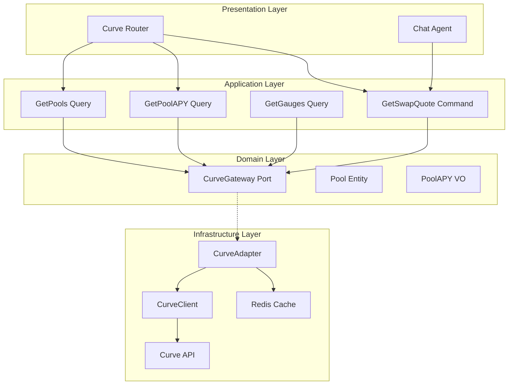
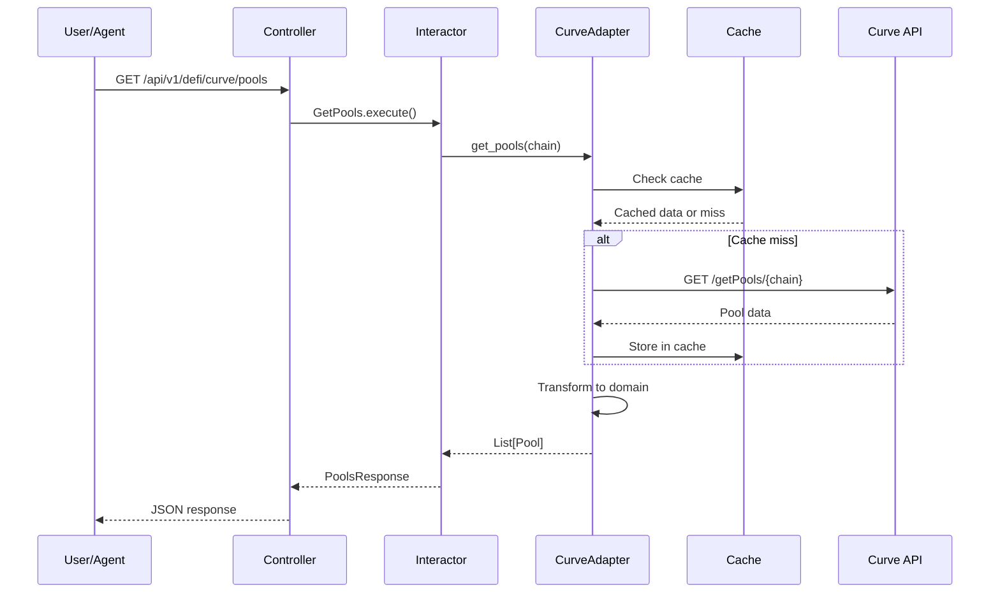

# Design Document: Curve Finance Integration

## Overview

This document defines the technical architecture for completing the Curve Finance integration into the Anvil Backend. The existing `CurveClient` infrastructure adapter provides basic API connectivity. This design focuses on building the domain layer, application interactors, and HTTP endpoints following hexagonal architecture principles.

The integration enables:
- Pool discovery and APY tracking for yield farming
- Stablecoin swap quotes with best execution
- Gauge and reward data for yield optimization
- Multi-chain support across 7 networks

## Steering Document Alignment

### Technical Standards (tech.md)

The design follows documented technical patterns:

- **Hexagonal Architecture**: CurveAdapter implements domain-defined port
- **Dependency Injection**: Adapter registered in Dishka container
- **Async-First**: All API calls use async HTTP client (existing httpx)
- **Caching**: Redis-backed cache for pool/APY data
- **Error Handling**: Domain exceptions translated from API errors

### Project Structure (structure.md)

Implementation follows project organization conventions:

```
src/app/
├── domain/
│   ├── entities/
│   │   └── curve/
│   │       ├── pool.py                    # Pool entity (NEW)
│   │       └── gauge.py                   # Gauge entity (NEW)
│   ├── value_objects/
│   │   └── curve/
│   │       ├── pool_apy.py                # APY breakdown VO (NEW)
│   │       └── swap_quote.py              # Quote VO (NEW)
│   └── ports/
│       └── curve_gateway.py               # Port interface (NEW)
├── application/
│   ├── queries/
│   │   └── curve/
│   │       ├── get_pools.py               # Pool listing (NEW)
│   │       ├── get_pool_apy.py            # APY breakdown (NEW)
│   │       ├── get_gauges.py              # Gauge data (NEW)
│   │       └── get_tvl.py                 # TVL analytics (NEW)
│   └── commands/
│       └── curve/
│           └── get_swap_quote.py          # Swap quoting (NEW)
├── infrastructure/
│   └── adapters/
│       └── external/
│           ├── curve_client.py            # Existing client ✅
│           ├── curve_adapter.py           # Gateway impl (NEW)
│           └── instrumented/
│               └── instrumented_curve_client.py  # Existing ✅
└── presentation/
    └── http/
        └── controllers/
            └── defi/
                └── curve_router.py        # HTTP endpoints (NEW)
```

## Code Reuse Analysis

### Existing Components to Leverage

| Component | Location | Integration |
|-----------|----------|-------------|
| **CurveClient** | `src/app/infrastructure/adapters/external/curve_client.py` | Wrap with adapter |
| **InstrumentedCurveClient** | `src/app/infrastructure/adapters/external/instrumented/` | Use for telemetry |
| **ExternalAPICache** | `src/app/infrastructure/cache/external_api_cache.py` | Cache pool/APY data |
| **Error Translators** | `src/app/presentation/http/errors/translators.py` | Translate errors |

### Integration Points

| System | Integration Method |
|--------|-------------------|
| **Redis Cache** | Use existing cache infrastructure |
| **Telemetry** | Use instrumented client wrapper |
| **Error Handling** | Use fastapi-error-map |
| **DI Container** | Register via Dishka provider |

---

## Architecture

### High-Level Architecture



### Request Flow



---

## Components and Interfaces

### Component 1: CurveGateway Port

- **Purpose:** Define domain interface for Curve operations
- **Interfaces:**
  ```python
  class CurveGateway(Protocol):
      """Port for Curve Finance operations"""
      
      async def get_pools(
          self,
          chain: str = "ethereum",
      ) -> list[Pool]:
          """Get all pools on specified chain"""
          ...
      
      async def get_pool_by_address(
          self,
          pool_address: str,
          chain: str = "ethereum",
      ) -> Pool:
          """Get specific pool by address"""
          ...
      
      async def get_pool_apy(
          self,
          pool_address: str,
          chain: str = "ethereum",
      ) -> PoolAPY:
          """Get APY breakdown for pool"""
          ...
      
      async def get_swap_quote(
          self,
          from_token: str,
          to_token: str,
          amount: str,
          chain: str = "ethereum",
      ) -> SwapQuote:
          """Get swap quote for stablecoin exchange"""
          ...
      
      async def get_gauges(
          self,
          chain: str = "ethereum",
      ) -> list[Gauge]:
          """Get all gauge data"""
          ...
      
      async def get_tvl(
          self,
          chain: str = "ethereum",
      ) -> TVLData:
          """Get TVL data"""
          ...
  ```
- **Dependencies:** None (pure interface)
- **Location:** `src/app/domain/ports/curve_gateway.py`

### Component 2: CurveAdapter

- **Purpose:** Implement CurveGateway port using CurveClient
- **Interfaces:**
  ```python
  class CurveAdapter(CurveGateway):
      """Curve implementation of CurveGateway"""
      
      def __init__(
          self,
          client: CurveClient,
          cache: ExternalAPICache,
          pool_cache_ttl: int = 300,     # 5 minutes
          apy_cache_ttl: int = 60,        # 1 minute
          gauge_cache_ttl: int = 600,     # 10 minutes
      ):
          self._client = client
          self._cache = cache
          self._pool_cache_ttl = pool_cache_ttl
          self._apy_cache_ttl = apy_cache_ttl
          self._gauge_cache_ttl = gauge_cache_ttl
      
      async def get_pools(self, chain: str = "ethereum") -> list[Pool]:
          """Get pools with caching"""
          cache_key = f"curve:pools:{chain}"
          cached = await self._cache.get(cache_key)
          if cached:
              return [Pool.from_dict(p) for p in cached]
          
          raw_pools = await self._client.get_pools()
          pools = [self._transform_pool(p) for p in raw_pools]
          await self._cache.set(cache_key, [p.to_dict() for p in pools], self._pool_cache_ttl)
          return pools
      
      def _transform_pool(self, raw: CurvePool) -> Pool:
          """Transform client model to domain entity"""
          ...
  ```
- **Dependencies:** CurveClient, ExternalAPICache
- **Location:** `src/app/infrastructure/adapters/external/curve_adapter.py`

### Component 3: GetPools Query

- **Purpose:** Application query for pool listing
- **Interfaces:**
  ```python
  @dataclass
  class GetPoolsRequest:
      chain: str = "ethereum"
      sort_by: str = "tvl"  # tvl, apy, volume
      limit: int = 50
  
  class GetPools:
      """Get Curve pools query"""
      
      def __init__(self, gateway: CurveGateway):
          self._gateway = gateway
      
      async def execute(self, request: GetPoolsRequest) -> list[Pool]:
          pools = await self._gateway.get_pools(chain=request.chain)
          
          # Sort pools
          if request.sort_by == "tvl":
              pools.sort(key=lambda p: p.tvl_usd, reverse=True)
          elif request.sort_by == "apy":
              pools.sort(key=lambda p: p.apy, reverse=True)
          
          return pools[:request.limit]
  ```
- **Dependencies:** CurveGateway port
- **Location:** `src/app/application/queries/curve/get_pools.py`

### Component 4: GetSwapQuote Command

- **Purpose:** Get swap quote for stablecoin exchange
- **Interfaces:**
  ```python
  @dataclass
  class SwapQuoteRequest:
      from_token: str
      to_token: str
      amount: str
      chain: str = "ethereum"
  
  class GetSwapQuote:
      """Get Curve swap quote"""
      
      def __init__(self, gateway: CurveGateway):
          self._gateway = gateway
      
      async def execute(self, request: SwapQuoteRequest) -> SwapQuote:
          quote = await self._gateway.get_swap_quote(
              from_token=request.from_token,
              to_token=request.to_token,
              amount=request.amount,
              chain=request.chain,
          )
          
          # Add warnings if needed
          if quote.price_impact > 0.5:
              quote.warnings.append("High price impact detected")
          
          return quote
  ```
- **Dependencies:** CurveGateway port
- **Location:** `src/app/application/commands/curve/get_swap_quote.py`

### Component 5: Curve Router

- **Purpose:** HTTP endpoints for Curve operations
- **Interfaces:**
  ```python
  router = APIRouter(prefix="/defi/curve", tags=["defi", "curve"])
  
  @router.get("/pools")
  async def get_pools(
      chain: str = "ethereum",
      sort_by: str = "tvl",
      limit: int = 50,
      query: GetPools = Depends(),
  ) -> PoolsResponse:
      """Get all Curve pools"""
      ...
  
  @router.get("/pools/{pool_address}")
  async def get_pool(
      pool_address: str,
      chain: str = "ethereum",
      query: GetPoolByAddress = Depends(),
  ) -> PoolResponse:
      """Get specific pool details"""
      ...
  
  @router.get("/pools/{pool_address}/apy")
  async def get_pool_apy(
      pool_address: str,
      chain: str = "ethereum",
      query: GetPoolAPY = Depends(),
  ) -> PoolAPYResponse:
      """Get pool APY breakdown"""
      ...
  
  @router.post("/quote")
  async def get_swap_quote(
      request: SwapQuoteRequest,
      command: GetSwapQuote = Depends(),
  ) -> SwapQuoteResponse:
      """Get swap quote"""
      ...
  
  @router.get("/gauges")
  async def get_gauges(
      chain: str = "ethereum",
      query: GetGauges = Depends(),
  ) -> GaugesResponse:
      """Get gauge data"""
      ...
  
  @router.get("/tvl")
  async def get_tvl(
      chain: str = "ethereum",
      query: GetTVL = Depends(),
  ) -> TVLResponse:
      """Get TVL data"""
      ...
  ```
- **Dependencies:** Interactors via Dishka DI
- **Location:** `src/app/presentation/http/controllers/defi/curve_router.py`

---

## Data Models

### Pool Entity

```python
@dataclass
class Pool:
    """Curve pool entity"""
    id: str                    # Pool address
    name: str
    symbol: str
    chain: str
    coins: list[str]           # Token addresses
    coin_names: list[str]      # Token symbols
    tvl_usd: Decimal
    apy: Decimal               # Total APY
    volume_24h_usd: Decimal
    fee_percentage: Decimal
    is_factory: bool = False
    
    def to_dict(self) -> dict:
        ...
    
    @classmethod
    def from_dict(cls, data: dict) -> "Pool":
        ...
```

### PoolAPY Value Object

```python
@dataclass(frozen=True)
class PoolAPY:
    """Pool APY breakdown value object"""
    pool_address: str
    base_apy: Decimal          # From trading fees
    crv_apy: Decimal           # CRV rewards
    reward_apy: Decimal        # Extra rewards
    total_apy: Decimal         # Combined
    boost_range: tuple[Decimal, Decimal]  # (1x, 2.5x)
```

### SwapQuote Value Object

```python
@dataclass(frozen=True)
class SwapQuote:
    """Swap quote value object"""
    from_token: str
    to_token: str
    amount_in: Decimal
    amount_out: Decimal
    price_impact: Decimal      # Percentage
    fee_amount: Decimal
    exchange_rate: Decimal
    pool_address: str
    warnings: list[str] = field(default_factory=list)
```

### Gauge Entity

```python
@dataclass
class Gauge:
    """Curve gauge entity"""
    address: str
    pool_address: str
    crv_emissions_per_day: Decimal
    relative_weight: Decimal
    total_staked: Decimal
    apy: Decimal
```

---

## Error Handling

### Error Mapping

| Curve Error | HTTP Status | Domain Exception |
|-------------|-------------|------------------|
| Pool not found | 404 | `PoolNotFoundError` |
| Invalid token | 400 | `InvalidTokenError` |
| API error | 502 | `CurveAPIError` |
| Rate limit | 429 | `RateLimitError` |

### Exception Classes

```python
# src/app/domain/exceptions/curve.py
class CurveError(DomainError):
    """Base exception for Curve operations"""
    pass

class PoolNotFoundError(CurveError):
    """Pool address not found"""
    pass

class InvalidTokenError(CurveError):
    """Token not supported on Curve"""
    pass

class CurveAPIError(CurveError):
    """Curve API error"""
    pass
```

---

## Caching Strategy

| Data Type | Cache Key | TTL | Notes |
|-----------|-----------|-----|-------|
| Pool List | `curve:pools:{chain}` | 5 min | Refresh on demand |
| Pool APY | `curve:apy:{chain}:{address}` | 1 min | Volatile data |
| Gauge Data | `curve:gauges:{chain}` | 10 min | Less frequent updates |
| TVL | `curve:tvl:{chain}` | 5 min | Global metric |
| Swap Quote | Not cached | N/A | Real-time only |

---

## API Endpoints Summary

| Method | Endpoint | Description |
|--------|----------|-------------|
| GET | `/api/v1/defi/curve/pools` | List all pools |
| GET | `/api/v1/defi/curve/pools/{address}` | Get pool details |
| GET | `/api/v1/defi/curve/pools/{address}/apy` | Get APY breakdown |
| POST | `/api/v1/defi/curve/quote` | Get swap quote |
| GET | `/api/v1/defi/curve/gauges` | List gauges |
| GET | `/api/v1/defi/curve/tvl` | Get TVL data |

---

## Testing Strategy

### Unit Testing

- **CurveAdapter**: Mock CurveClient, test transformation logic
- **Interactors**: Mock gateway, test business logic
- **Controllers**: Mock interactors, test HTTP handling

### Integration Testing

- **Cache Integration**: Test cache hit/miss behavior
- **Full Flow**: Test pool → APY → quote flow

### Test Fixtures

```python
@pytest.fixture
def mock_curve_client():
    """Mock Curve client for testing"""
    client = AsyncMock(spec=CurveClient)
    client.get_pools.return_value = MOCK_POOLS
    return client

@pytest.fixture
def curve_gateway(mock_curve_client):
    """Mock gateway for testing"""
    return CurveAdapter(
        client=mock_curve_client,
        cache=MockCache(),
    )
```

---

## Configuration

```toml
# config/local/config.toml
[curve]
enabled = true
default_chain = "ethereum"
cache_pool_ttl = 300
cache_apy_ttl = 60
cache_gauge_ttl = 600

[curve.chains]
ethereum = "ethereum"
arbitrum = "arbitrum"
optimism = "optimism"
polygon = "polygon"
base = "base"
```

---

## Dependency Injection

```python
# src/app/setup/ioc/curve.py
from dishka import Provider, provide, Scope

class CurveProvider(Provider):
    
    @provide(scope=Scope.APP)
    def get_curve_client(self, settings: Settings) -> CurveClient:
        return CurveClient(chain=settings.curve.default_chain)
    
    @provide(scope=Scope.APP)
    def get_curve_gateway(
        self,
        client: CurveClient,
        cache: ExternalAPICache,
        settings: Settings,
    ) -> CurveGateway:
        return CurveAdapter(
            client=client,
            cache=cache,
            pool_cache_ttl=settings.curve.cache_pool_ttl,
            apy_cache_ttl=settings.curve.cache_apy_ttl,
        )
```
