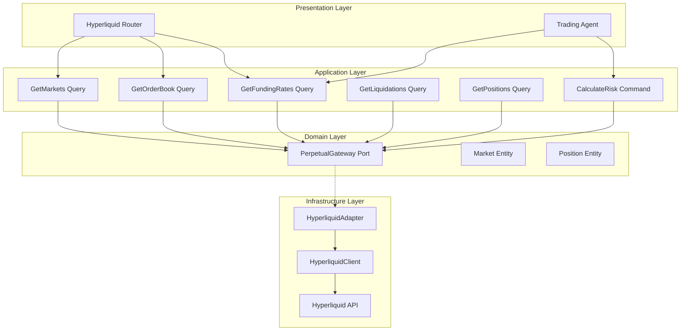

# Design Document: Hyperliquid Integration

## Overview

This document defines the technical architecture for completing the Hyperliquid integration into the Anvil Backend. The existing `HyperliquidClient` infrastructure adapter provides basic API connectivity. This design focuses on building the domain layer, application interactors, and HTTP endpoints for perpetual futures data.

The integration enables:
- Real-time market data and order books
- Funding rate analysis and arbitrage opportunities
- Liquidation monitoring and market stress detection
- Position tracking and risk calculations

## Steering Document Alignment

### Technical Standards (tech.md)

- **Hexagonal Architecture**: HyperliquidAdapter implements domain-defined port
- **Dependency Injection**: Adapter registered in Dishka container
- **Async-First**: All API calls use async HTTP client
- **Low Latency**: Minimal caching for real-time trading data
- **Error Handling**: Domain exceptions for trading errors

### Project Structure (structure.md)

```
src/app/
├── domain/
│   ├── entities/
│   │   └── perpetual/
│   │       ├── market.py                  # Market entity (NEW)
│   │       ├── position.py                # Position entity (NEW)
│   │       └── liquidation.py             # Liquidation entity (NEW)
│   ├── value_objects/
│   │   └── perpetual/
│   │       ├── funding_rate.py            # Funding VO (NEW)
│   │       ├── order_book.py              # OrderBook VO (NEW)
│   │       └── risk_metrics.py            # Risk VO (NEW)
│   └── ports/
│       └── perpetual_gateway.py           # Port interface (NEW)
├── application/
│   ├── queries/
│   │   └── perpetual/
│   │       ├── get_markets.py             # Market listing (NEW)
│   │       ├── get_order_book.py          # Order book (NEW)
│   │       ├── get_funding_rates.py       # Funding data (NEW)
│   │       ├── get_liquidations.py        # Liquidation events (NEW)
│   │       └── get_positions.py           # User positions (NEW)
│   └── commands/
│       └── perpetual/
│           └── calculate_risk.py          # Risk calculation (NEW)
├── infrastructure/
│   └── adapters/
│       └── external/
│           ├── hyperliquid_client.py      # Existing ✅
│           ├── hyperliquid_adapter.py     # Gateway impl (NEW)
│           └── instrumented/
│               └── instrumented_hyperliquid_client.py  # Existing ✅
└── presentation/
    └── http/
        └── controllers/
            └── defi/
                └── hyperliquid_router.py  # HTTP endpoints (NEW)
```

## Code Reuse Analysis

### Existing Components to Leverage

| Component | Location | Integration |
|-----------|----------|-------------|
| **HyperliquidClient** | `src/app/infrastructure/adapters/external/hyperliquid_client.py` | Wrap with adapter |
| **InstrumentedHyperliquidClient** | `src/app/infrastructure/adapters/external/instrumented/` | Telemetry |
| **ExternalAPICache** | `src/app/infrastructure/cache/external_api_cache.py` | Limited caching |
| **Error Translators** | `src/app/presentation/http/errors/translators.py` | Error handling |

---

## Architecture

### High-Level Architecture



---

## Components and Interfaces

### Component 1: PerpetualGateway Port

- **Purpose:** Define domain interface for perpetual futures operations
- **Interfaces:**
  ```python
  class PerpetualGateway(Protocol):
      """Port for perpetual futures operations"""
      
      async def get_markets(self) -> list[PerpMarket]:
          """Get all perpetual markets"""
          ...
      
      async def get_order_book(
          self,
          symbol: str,
          depth: int = 20,
      ) -> OrderBook:
          """Get order book for symbol"""
          ...
      
      async def get_funding_rate(
          self,
          symbol: str,
      ) -> FundingRate:
          """Get current funding rate"""
          ...
      
      async def get_funding_rates(self) -> list[FundingRate]:
          """Get all funding rates"""
          ...
      
      async def get_liquidations(
          self,
          symbol: str | None = None,
          hours: int = 24,
      ) -> list[Liquidation]:
          """Get recent liquidations"""
          ...
      
      async def get_positions(
          self,
          address: str,
      ) -> list[Position]:
          """Get user positions"""
          ...
      
      async def calculate_liquidation_price(
          self,
          entry_price: Decimal,
          leverage: Decimal,
          side: str,
          maintenance_margin: Decimal = Decimal("0.005"),
      ) -> Decimal:
          """Calculate liquidation price"""
          ...
  ```
- **Location:** `src/app/domain/ports/perpetual_gateway.py`

### Component 2: HyperliquidAdapter

- **Purpose:** Implement PerpetualGateway using HyperliquidClient
- **Interfaces:**
  ```python
  class HyperliquidAdapter(PerpetualGateway):
      """Hyperliquid implementation of PerpetualGateway"""
      
      def __init__(
          self,
          client: HyperliquidClient,
          cache: ExternalAPICache,
          market_cache_ttl: int = 5,      # 5 seconds
          funding_cache_ttl: int = 30,    # 30 seconds
      ):
          self._client = client
          self._cache = cache
      
      async def get_markets(self) -> list[PerpMarket]:
          """Get markets with short caching"""
          cache_key = "hyperliquid:markets"
          cached = await self._cache.get(cache_key)
          if cached:
              return [PerpMarket.from_dict(m) for m in cached]
          
          data = await self._client._client.post(
              "/info",
              json={"type": "metaAndAssetCtxs"}
          )
          markets = self._transform_markets(data.json())
          await self._cache.set(cache_key, [m.to_dict() for m in markets], self._market_cache_ttl)
          return markets
      
      async def get_order_book(self, symbol: str, depth: int = 20) -> OrderBook:
          """Get order book (no caching - real-time)"""
          raw = await self._client.get_order_book(symbol, depth)
          return self._transform_order_book(raw)
      
      async def get_funding_rate(self, symbol: str) -> FundingRate:
          """Get funding rate with short caching"""
          raw = await self._client.get_funding_rate(symbol)
          return self._transform_funding_rate(raw)
  ```
- **Location:** `src/app/infrastructure/adapters/external/hyperliquid_adapter.py`

### Component 3: GetFundingRates Query

- **Purpose:** Get funding rates with analysis
- **Interfaces:**
  ```python
  @dataclass
  class GetFundingRatesRequest:
      sort_by: str = "absolute"  # absolute, positive, negative
      min_rate: float | None = None
  
  class GetFundingRates:
      """Get funding rates with analysis"""
      
      def __init__(self, gateway: PerpetualGateway):
          self._gateway = gateway
      
      async def execute(self, request: GetFundingRatesRequest) -> FundingRatesResponse:
          rates = await self._gateway.get_funding_rates()
          
          # Filter by minimum rate if specified
          if request.min_rate:
              rates = [r for r in rates if abs(r.rate) >= request.min_rate]
          
          # Sort
          if request.sort_by == "absolute":
              rates.sort(key=lambda r: abs(r.rate), reverse=True)
          elif request.sort_by == "positive":
              rates = [r for r in rates if r.rate > 0]
              rates.sort(key=lambda r: r.rate, reverse=True)
          elif request.sort_by == "negative":
              rates = [r for r in rates if r.rate < 0]
              rates.sort(key=lambda r: r.rate)
          
          return FundingRatesResponse(
              rates=rates,
              opportunities=self._identify_opportunities(rates),
          )
      
      def _identify_opportunities(self, rates: list[FundingRate]) -> list[FundingOpportunity]:
          """Identify funding arbitrage opportunities"""
          opportunities = []
          for rate in rates:
              if abs(rate.annualized_rate) > 50:  # >50% annualized
                  opportunities.append(FundingOpportunity(
                      symbol=rate.symbol,
                      rate=rate.rate,
                      direction="short" if rate.rate > 0 else "long",
                      annualized_return=abs(rate.annualized_rate),
                  ))
          return opportunities
  ```
- **Location:** `src/app/application/queries/perpetual/get_funding_rates.py`

### Component 4: CalculateRisk Command

- **Purpose:** Calculate position risk metrics
- **Interfaces:**
  ```python
  @dataclass
  class CalculateRiskRequest:
      entry_price: Decimal
      size: Decimal
      leverage: Decimal
      side: str  # "long" or "short"
      account_balance: Decimal | None = None
  
  class CalculateRisk:
      """Calculate position risk metrics"""
      
      def __init__(self, gateway: PerpetualGateway):
          self._gateway = gateway
      
      async def execute(self, request: CalculateRiskRequest) -> RiskMetrics:
          liquidation_price = await self._gateway.calculate_liquidation_price(
              entry_price=request.entry_price,
              leverage=request.leverage,
              side=request.side,
          )
          
          position_value = request.entry_price * request.size
          margin_required = position_value / request.leverage
          max_loss = margin_required
          
          # Distance to liquidation
          if request.side == "long":
              distance_pct = (request.entry_price - liquidation_price) / request.entry_price * 100
          else:
              distance_pct = (liquidation_price - request.entry_price) / request.entry_price * 100
          
          return RiskMetrics(
              liquidation_price=liquidation_price,
              margin_required=margin_required,
              max_loss=max_loss,
              distance_to_liquidation_pct=distance_pct,
              risk_level=self._assess_risk_level(distance_pct),
          )
      
      def _assess_risk_level(self, distance_pct: Decimal) -> str:
          if distance_pct < 5:
              return "EXTREME"
          elif distance_pct < 10:
              return "HIGH"
          elif distance_pct < 20:
              return "MEDIUM"
          return "LOW"
  ```
- **Location:** `src/app/application/commands/perpetual/calculate_risk.py`

### Component 5: Hyperliquid Router

- **Purpose:** HTTP endpoints for perpetual data
- **Interfaces:**
  ```python
  router = APIRouter(prefix="/defi/hyperliquid", tags=["defi", "perpetuals"])
  
  @router.get("/markets")
  async def get_markets(
      query: GetMarkets = Depends(),
  ) -> MarketsResponse:
      """Get all perpetual markets"""
      ...
  
  @router.get("/markets/{symbol}/orderbook")
  async def get_order_book(
      symbol: str,
      depth: int = 20,
      query: GetOrderBook = Depends(),
  ) -> OrderBookResponse:
      """Get order book"""
      ...
  
  @router.get("/funding")
  async def get_funding_rates(
      sort_by: str = "absolute",
      min_rate: float | None = None,
      query: GetFundingRates = Depends(),
  ) -> FundingRatesResponse:
      """Get funding rates with opportunities"""
      ...
  
  @router.get("/liquidations")
  async def get_liquidations(
      symbol: str | None = None,
      hours: int = 24,
      query: GetLiquidations = Depends(),
  ) -> LiquidationsResponse:
      """Get recent liquidations"""
      ...
  
  @router.get("/positions/{address}")
  async def get_positions(
      address: str,
      query: GetPositions = Depends(),
  ) -> PositionsResponse:
      """Get user positions"""
      ...
  
  @router.post("/risk/calculate")
  async def calculate_risk(
      request: CalculateRiskRequest,
      command: CalculateRisk = Depends(),
  ) -> RiskMetricsResponse:
      """Calculate position risk"""
      ...
  ```
- **Location:** `src/app/presentation/http/controllers/defi/hyperliquid_router.py`

---

## Data Models

### PerpMarket Entity

```python
@dataclass
class PerpMarket:
    """Perpetual market entity"""
    symbol: str                # e.g., "ETH-PERP"
    mark_price: Decimal
    index_price: Decimal
    funding_rate: Decimal
    open_interest: Decimal
    volume_24h: Decimal
    price_change_24h: Decimal
    max_leverage: int
```

### FundingRate Value Object

```python
@dataclass(frozen=True)
class FundingRate:
    """Funding rate value object"""
    symbol: str
    rate: Decimal              # 8-hour rate
    annualized_rate: Decimal   # Annual rate
    next_funding_time: datetime
    timestamp: datetime
    
    @property
    def direction_bias(self) -> str:
        """Market bias based on funding"""
        if self.rate > Decimal("0.0001"):
            return "BULLISH"
        elif self.rate < Decimal("-0.0001"):
            return "BEARISH"
        return "NEUTRAL"
```

### OrderBook Value Object

```python
@dataclass(frozen=True)
class OrderBook:
    """Order book value object"""
    symbol: str
    bids: list[tuple[Decimal, Decimal]]  # (price, size)
    asks: list[tuple[Decimal, Decimal]]
    timestamp: datetime
    
    @property
    def spread(self) -> Decimal:
        """Bid-ask spread"""
        if self.bids and self.asks:
            return self.asks[0][0] - self.bids[0][0]
        return Decimal("0")
    
    @property
    def spread_pct(self) -> Decimal:
        """Spread as percentage"""
        if self.bids and self.asks:
            mid = (self.asks[0][0] + self.bids[0][0]) / 2
            return self.spread / mid * 100
        return Decimal("0")
```

### Position Entity

```python
@dataclass
class Position:
    """User position entity"""
    symbol: str
    side: str                  # "long" or "short"
    size: Decimal
    entry_price: Decimal
    mark_price: Decimal
    unrealized_pnl: Decimal
    leverage: Decimal
    liquidation_price: Decimal
    margin_ratio: Decimal
    
    @property
    def pnl_pct(self) -> Decimal:
        """PnL as percentage"""
        if self.side == "long":
            return (self.mark_price - self.entry_price) / self.entry_price * 100
        return (self.entry_price - self.mark_price) / self.entry_price * 100
```

### RiskMetrics Value Object

```python
@dataclass(frozen=True)
class RiskMetrics:
    """Position risk metrics"""
    liquidation_price: Decimal
    margin_required: Decimal
    max_loss: Decimal
    distance_to_liquidation_pct: Decimal
    risk_level: str  # LOW, MEDIUM, HIGH, EXTREME
```

---

## Error Handling

### Error Mapping

| Error | HTTP Status | Domain Exception |
|-------|-------------|------------------|
| Symbol not found | 404 | `SymbolNotFoundError` |
| Invalid address | 400 | `InvalidAddressError` |
| API error | 502 | `HyperliquidAPIError` |
| Rate limit | 429 | `RateLimitError` |

### Exception Classes

```python
# src/app/domain/exceptions/perpetual.py
class PerpetualError(DomainError):
    """Base exception for perpetual operations"""
    pass

class SymbolNotFoundError(PerpetualError):
    """Symbol not found"""
    pass

class InvalidAddressError(PerpetualError):
    """Invalid wallet address"""
    pass

class HyperliquidAPIError(PerpetualError):
    """Hyperliquid API error"""
    pass
```

---

## Caching Strategy

| Data Type | Cache Key | TTL | Notes |
|-----------|-----------|-----|-------|
| Markets | `hl:markets` | 5s | Fast refresh |
| Funding Rates | `hl:funding:{symbol}` | 30s | Semi-volatile |
| Order Book | Not cached | N/A | Real-time only |
| Positions | `hl:positions:{address}` | 10s | User-specific |
| Liquidations | `hl:liquidations` | 60s | Historical data |

---

## API Endpoints Summary

| Method | Endpoint | Description |
|--------|----------|-------------|
| GET | `/api/v1/defi/hyperliquid/markets` | List markets |
| GET | `/api/v1/defi/hyperliquid/markets/{symbol}/orderbook` | Order book |
| GET | `/api/v1/defi/hyperliquid/funding` | Funding rates |
| GET | `/api/v1/defi/hyperliquid/liquidations` | Liquidations |
| GET | `/api/v1/defi/hyperliquid/positions/{address}` | User positions |
| POST | `/api/v1/defi/hyperliquid/risk/calculate` | Risk calculation |

---

## Configuration

```toml
# config/local/config.toml
[hyperliquid]
enabled = true
testnet = false
cache_market_ttl = 5
cache_funding_ttl = 30
cache_position_ttl = 10

[hyperliquid.risk]
default_maintenance_margin = 0.005
max_leverage = 50
```

---

## Testing Strategy

### Unit Testing

- **HyperliquidAdapter**: Mock client, test transformations
- **Risk Calculations**: Test liquidation price formulas
- **Funding Analysis**: Test opportunity identification

### Integration Testing

- **Real-time Data**: Test order book freshness
- **Position Flow**: Test address → positions flow
