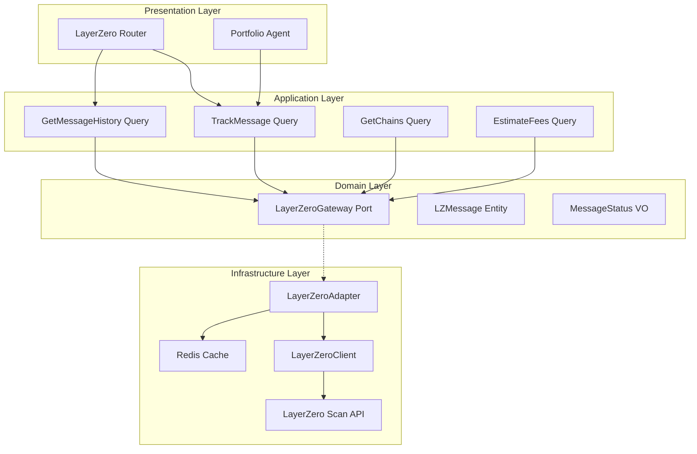

# Design Document: LayerZero Integration

## Overview

This document defines the technical architecture for completing the LayerZero integration into the Anvil Backend. The existing `LayerZeroClient` infrastructure adapter provides basic API connectivity. This design focuses on building the domain layer, application interactors, and HTTP endpoints for cross-chain message tracking.

The integration enables:
- Cross-chain message status tracking
- OFT transfer monitoring
- Fee estimation for cross-chain operations
- Complementing LI.FI with protocol-level tracking

## Steering Document Alignment

### Technical Standards (tech.md)

- **Hexagonal Architecture**: LayerZeroAdapter implements domain-defined port
- **Dependency Injection**: Adapter registered in Dishka container
- **Async-First**: All API calls use async HTTP client
- **Caching**: Appropriate caching for message status
- **Error Handling**: Domain exceptions for tracking errors

### Project Structure (structure.md)

```
src/app/
├── domain/
│   ├── entities/
│   │   └── cross_chain/
│   │       ├── lz_message.py              # Message entity (NEW)
│   │       └── oft_transfer.py            # OFT transfer entity (NEW)
│   ├── value_objects/
│   │   └── cross_chain/
│   │       ├── message_status.py          # Status enum (NEW)
│   │       ├── lz_chain.py                # Chain VO (NEW)
│   │       └── message_fee.py             # Fee estimate VO (NEW)
│   └── ports/
│       └── layerzero_gateway.py           # Port interface (NEW)
├── application/
│   ├── queries/
│   │   └── layerzero/
│   │       ├── track_message.py           # Message tracking (NEW)
│   │       ├── get_message_history.py     # History query (NEW)
│   │       ├── get_chains.py              # Chain info (NEW)
│   │       └── estimate_fees.py           # Fee estimation (NEW)
├── infrastructure/
│   └── adapters/
│       └── external/
│           ├── layerzero_client.py        # Existing ✅
│           └── layerzero_adapter.py       # Gateway impl (NEW)
└── presentation/
    └── http/
        └── controllers/
            └── defi/
                └── layerzero_router.py    # HTTP endpoints (NEW)
```

## Code Reuse Analysis

### Existing Components to Leverage

| Component | Location | Integration |
|-----------|----------|-------------|
| **LayerZeroClient** | `src/app/infrastructure/adapters/external/layerzero_client.py` | Wrap with adapter |
| **ExternalAPICache** | `src/app/infrastructure/cache/external_api_cache.py` | Cache chain data |
| **LI.FI Integration** | Planned | Complement for tracking |

---

## Architecture

### High-Level Architecture



---

## Components and Interfaces

### Component 1: LayerZeroGateway Port

- **Purpose:** Define domain interface for LayerZero operations
- **Interfaces:**
  ```python
  class LayerZeroGateway(Protocol):
      """Port for LayerZero cross-chain operations"""
      
      async def track_message(
          self,
          tx_hash: str,
      ) -> LZMessage | None:
          """Track message by source tx hash"""
          ...
      
      async def get_message_history(
          self,
          address: str,
          limit: int = 50,
      ) -> list[LZMessage]:
          """Get message history for address"""
          ...
      
      async def get_chains(self) -> list[LZChain]:
          """Get supported chains"""
          ...
      
      async def estimate_fees(
          self,
          source_chain: str,
          destination_chain: str,
          payload_size: int = 100,
      ) -> MessageFee:
          """Estimate message fees"""
          ...
      
      async def get_oft_transfers(
          self,
          address: str,
          limit: int = 50,
      ) -> list[OFTTransfer]:
          """Get OFT transfers for address"""
          ...
  ```
- **Location:** `src/app/domain/ports/layerzero_gateway.py`

### Component 2: LayerZeroAdapter

- **Purpose:** Implement LayerZeroGateway using LayerZeroClient
- **Interfaces:**
  ```python
  class LayerZeroAdapter(LayerZeroGateway):
      """LayerZero implementation of LayerZeroGateway"""
      
      def __init__(
          self,
          client: LayerZeroClient,
          cache: ExternalAPICache,
          chain_cache_ttl: int = 3600,    # 1 hour
          message_cache_ttl: int = 10,     # 10 seconds
      ):
          self._client = client
          self._cache = cache
      
      async def track_message(self, tx_hash: str) -> LZMessage | None:
          """Track message with short caching"""
          cache_key = f"lz:message:{tx_hash}"
          cached = await self._cache.get(cache_key)
          
          if cached:
              msg = LZMessage.from_dict(cached)
              # Don't cache DELIVERED messages expiration
              if msg.status == MessageStatus.DELIVERED:
                  return msg
          
          raw = await self._client.get_message_status(tx_hash)
          if not raw:
              return None
          
          message = self._transform_message(raw)
          
          # Permanent cache for delivered, short for others
          ttl = 86400 if message.status == MessageStatus.DELIVERED else self._message_cache_ttl
          await self._cache.set(cache_key, message.to_dict(), ttl)
          
          return message
      
      def _transform_message(self, raw: CrossChainMessage) -> LZMessage:
          """Transform client model to domain entity"""
          return LZMessage(
              src_tx_hash=raw.src_tx_hash,
              src_chain_id=raw.src_chain_id,
              dst_chain_id=raw.dst_chain_id,
              status=MessageStatus(raw.status.value),
              src_address=raw.src_ua_address,
              dst_address=raw.dst_ua_address,
              dst_tx_hash=raw.dst_tx_hash,
              message_type=raw.message_type.value,
              created_at=raw.src_block_timestamp,
              completed_at=raw.dst_block_timestamp,
          )
  ```
- **Location:** `src/app/infrastructure/adapters/external/layerzero_adapter.py`

### Component 3: TrackMessage Query

- **Purpose:** Track cross-chain message status
- **Interfaces:**
  ```python
  @dataclass
  class TrackMessageRequest:
      tx_hash: str
  
  class TrackMessage:
      """Track LayerZero message status"""
      
      def __init__(self, gateway: LayerZeroGateway):
          self._gateway = gateway
      
      async def execute(self, request: TrackMessageRequest) -> MessageTrackingResponse:
          message = await self._gateway.track_message(request.tx_hash)
          
          if not message:
              raise MessageNotFoundError(f"Message not found: {request.tx_hash}")
          
          # Calculate estimated completion
          estimated_completion = None
          if message.status == MessageStatus.INFLIGHT:
              estimated_completion = self._estimate_completion(message)
          
          return MessageTrackingResponse(
              message=message,
              estimated_completion=estimated_completion,
              progress_pct=self._calculate_progress(message),
          )
      
      def _estimate_completion(self, message: LZMessage) -> datetime:
          """Estimate completion time based on chain pair"""
          # Average times per chain pair
          base_time = 300  # 5 minutes default
          return message.created_at + timedelta(seconds=base_time)
      
      def _calculate_progress(self, message: LZMessage) -> int:
          """Calculate progress percentage"""
          status_progress = {
              MessageStatus.INFLIGHT: 50,
              MessageStatus.DELIVERED: 100,
              MessageStatus.FAILED: 0,
              MessageStatus.BLOCKED: 25,
          }
          return status_progress.get(message.status, 0)
  ```
- **Location:** `src/app/application/queries/layerzero/track_message.py`

### Component 4: LayerZero Router

- **Purpose:** HTTP endpoints for LayerZero tracking
- **Interfaces:**
  ```python
  router = APIRouter(prefix="/defi/layerzero", tags=["defi", "cross-chain"])
  
  @router.get("/message/{tx_hash}")
  async def track_message(
      tx_hash: str,
      query: TrackMessage = Depends(),
  ) -> MessageTrackingResponse:
      """Track cross-chain message"""
      ...
  
  @router.get("/messages/{address}")
  async def get_message_history(
      address: str,
      limit: int = 50,
      query: GetMessageHistory = Depends(),
  ) -> MessageHistoryResponse:
      """Get message history for address"""
      ...
  
  @router.get("/chains")
  async def get_chains(
      query: GetChains = Depends(),
  ) -> ChainsResponse:
      """Get supported chains"""
      ...
  
  @router.get("/fees/estimate")
  async def estimate_fees(
      source_chain: str,
      destination_chain: str,
      payload_size: int = 100,
      query: EstimateFees = Depends(),
  ) -> FeeEstimateResponse:
      """Estimate message fees"""
      ...
  
  @router.get("/oft/{address}")
  async def get_oft_transfers(
      address: str,
      limit: int = 50,
      query: GetOFTTransfers = Depends(),
  ) -> OFTTransfersResponse:
      """Get OFT transfers"""
      ...
  ```
- **Location:** `src/app/presentation/http/controllers/defi/layerzero_router.py`

---

## Data Models

### LZMessage Entity

```python
@dataclass
class LZMessage:
    """LayerZero message entity"""
    src_tx_hash: str
    src_chain_id: int
    dst_chain_id: int
    status: MessageStatus
    src_address: str
    dst_address: str
    dst_tx_hash: str | None
    message_type: str          # "oft", "onft", "generic"
    created_at: datetime
    completed_at: datetime | None
    nonce: int | None = None
    
    def to_dict(self) -> dict:
        ...
    
    @classmethod
    def from_dict(cls, data: dict) -> "LZMessage":
        ...
```

### MessageStatus Enum

```python
class MessageStatus(Enum):
    """Cross-chain message status"""
    INFLIGHT = "INFLIGHT"      # In transit
    DELIVERED = "DELIVERED"    # Successfully delivered
    FAILED = "FAILED"          # Failed to deliver
    BLOCKED = "BLOCKED"        # Blocked by security
```

### LZChain Value Object

```python
@dataclass(frozen=True)
class LZChain:
    """LayerZero chain value object"""
    endpoint_id: int           # LayerZero endpoint ID
    name: str
    network: str
    native_chain_id: int
    is_evm: bool = True
```

### MessageFee Value Object

```python
@dataclass(frozen=True)
class MessageFee:
    """Message fee estimate value object"""
    source_chain_id: int
    destination_chain_id: int
    native_fee: Decimal        # In wei
    native_fee_usd: Decimal
    zro_fee: Decimal | None    # ZRO token fee if available
```

### OFTTransfer Entity

```python
@dataclass
class OFTTransfer:
    """OFT transfer entity"""
    tx_hash: str
    src_chain_id: int
    dst_chain_id: int
    token_address: str
    token_symbol: str
    amount: Decimal
    from_address: str
    to_address: str
    status: MessageStatus
    timestamp: datetime
```

---

## Error Handling

### Error Mapping

| Error | HTTP Status | Domain Exception |
|-------|-------------|------------------|
| Message not found | 404 | `MessageNotFoundError` |
| Invalid tx hash | 400 | `InvalidTxHashError` |
| API error | 502 | `LayerZeroAPIError` |
| Chain not supported | 400 | `UnsupportedChainError` |

### Exception Classes

```python
# src/app/domain/exceptions/layerzero.py
class LayerZeroError(DomainError):
    """Base exception for LayerZero operations"""
    pass

class MessageNotFoundError(LayerZeroError):
    """Message not found by tx hash"""
    pass

class InvalidTxHashError(LayerZeroError):
    """Invalid transaction hash format"""
    pass

class UnsupportedChainError(LayerZeroError):
    """Chain not supported by LayerZero"""
    pass
```

---

## Caching Strategy

| Data Type | Cache Key | TTL | Notes |
|-----------|-----------|-----|-------|
| Chains | `lz:chains` | 1 hour | Static data |
| Message (INFLIGHT) | `lz:message:{tx_hash}` | 10s | Fast refresh |
| Message (DELIVERED) | `lz:message:{tx_hash}` | 24h | Permanent |
| Fee Estimate | `lz:fees:{src}:{dst}` | 30s | Semi-volatile |
| History | `lz:history:{address}` | 1 min | User data |

---

## API Endpoints Summary

| Method | Endpoint | Description |
|--------|----------|-------------|
| GET | `/api/v1/defi/layerzero/message/{tx_hash}` | Track message |
| GET | `/api/v1/defi/layerzero/messages/{address}` | Message history |
| GET | `/api/v1/defi/layerzero/chains` | Supported chains |
| GET | `/api/v1/defi/layerzero/fees/estimate` | Fee estimation |
| GET | `/api/v1/defi/layerzero/oft/{address}` | OFT transfers |

---

## Configuration

```toml
# config/local/config.toml
[layerzero]
enabled = true
api_key = ""  # Optional
cache_chain_ttl = 3600
cache_message_ttl = 10
cache_delivered_ttl = 86400

[layerzero.endpoints]
mainnet = "https://api-mainnet.layerzero-scan.com"
```

---

## Testing Strategy

### Unit Testing

- **LayerZeroAdapter**: Mock client, test transformations
- **Status Tracking**: Test progress calculations
- **Caching**: Test TTL variations by status

### Integration Testing

- **Real Message Tracking**: Test with actual tx hashes
- **History Query**: Test pagination
