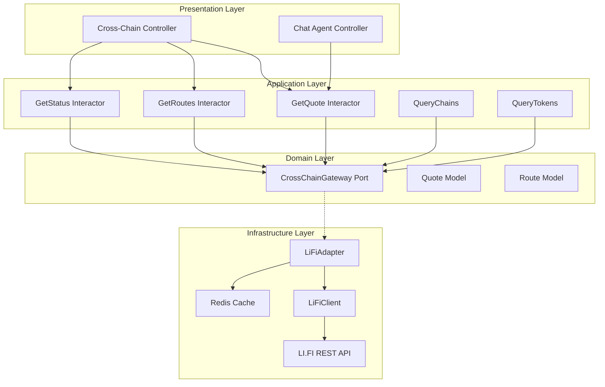
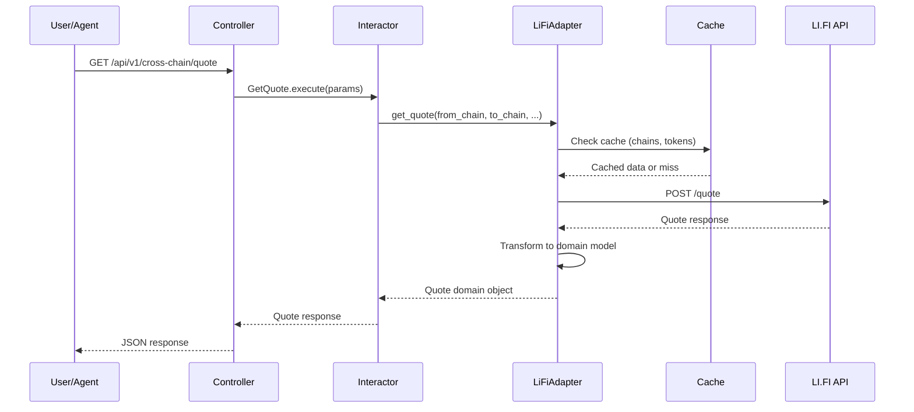
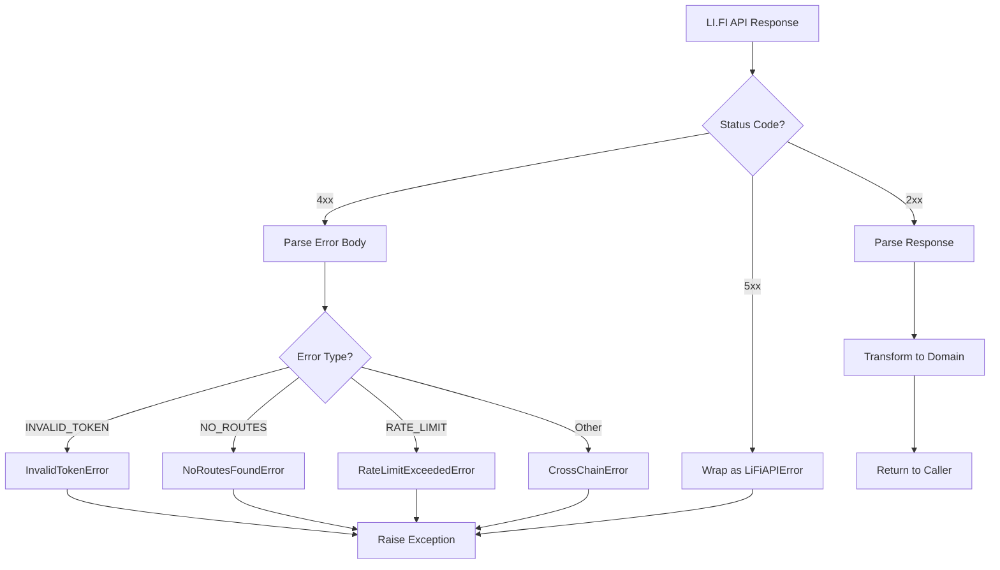

# Design Document: LI.FI SDK Integration

## Overview

This document defines the technical architecture for integrating the LI.FI SDK into the Anvil Backend to enable cross-chain swap and bridge functionality. The integration provides a Python adapter layer that communicates with the LI.FI REST API, enabling DeFi agents to recommend optimal swap routes, retrieve quotes, and track transaction status across 20+ blockchain networks.

The design follows hexagonal architecture principles, with the LI.FI integration implemented as an infrastructure adapter behind a domain-defined port.

## Steering Document Alignment

### Technical Standards (tech.md)

The design follows documented technical patterns:

- **Hexagonal Architecture**: LI.FI adapter implements domain-defined port interfaces
- **Dependency Injection**: Adapter registered in Dishka container
- **Async-First**: All API calls use async HTTP client (httpx)
- **Caching**: Redis-backed cache for chain/token data with configurable TTL
- **Error Handling**: Domain exceptions translated from API errors

### Project Structure (structure.md)

Implementation follows project organization conventions:

```
src/app/
├── domain/
│   └── ports/
│       └── cross_chain_gateway.py       # Port interface (NEW)
├── application/
│   ├── commands/
│   │   └── cross_chain/
│   │       ├── get_quote.py             # Quote interactor (NEW)
│   │       ├── get_routes.py            # Routes interactor (NEW)
│   │       └── get_status.py            # Status interactor (NEW)
│   └── queries/
│       └── cross_chain/
│           ├── get_chains.py            # Chain query (NEW)
│           ├── get_tokens.py            # Token query (NEW)
│           └── get_token_balance.py     # Balance query (NEW)
├── infrastructure/
│   └── adapters/
│       └── external/
│           └── lifi/
│               ├── __init__.py          # Module exports (NEW)
│               ├── client.py            # HTTP client wrapper (NEW)
│               ├── adapter.py           # CrossChainGateway impl (NEW)
│               ├── models.py            # Response models (NEW)
│               ├── exceptions.py        # LI.FI-specific errors (NEW)
│               └── cache.py             # Caching layer (NEW)
├── presentation/
│   └── http/
│       └── controllers/
│           └── cross_chain/
│               ├── router.py            # API routes (NEW)
│               ├── quotes.py            # Quote endpoints (NEW)
│               ├── routes.py            # Route endpoints (NEW)
│               ├── chains.py            # Chain endpoints (NEW)
│               └── status.py            # Status endpoints (NEW)
└── setup/
    └── ioc/
        └── lifi.py                      # DI registration (NEW)
```

## Code Reuse Analysis

### Existing Components to Leverage

| Component | Location | Integration |
|-----------|----------|-------------|
| **ExternalAPICache** | `src/app/infrastructure/cache/external_api_cache.py` | Cache chain/token data |
| **InstrumentedAdapter** | `src/app/infrastructure/adapters/external/instrumented/` | Add telemetry |
| **Error Translators** | `src/app/presentation/http/errors/translators.py` | Translate LI.FI errors |
| **HTTPClient patterns** | `src/app/infrastructure/adapters/external/` | HTTP client structure |

### Integration Points

| System | Integration Method |
|--------|-------------------|
| **Redis Cache** | Use existing cache infrastructure for chain/token data |
| **Telemetry** | Wrap adapter with instrumentation for metrics |
| **Error Handling** | Use fastapi-error-map for consistent error responses |
| **DI Container** | Register adapter via Dishka provider |

---

## Architecture

### High-Level Architecture



### Request Flow



### Modular Design Principles

- **Single File Responsibility**: Each file handles one aspect (client, adapter, cache)
- **Component Isolation**: LI.FI integration isolated in `infrastructure/adapters/external/lifi/`
- **Service Layer Separation**: Domain port defines interface, adapter implements
- **Utility Modularity**: Caching, error handling as separate utilities

---

## Components and Interfaces

### Component 1: CrossChainGateway Port

- **Purpose:** Define domain interface for cross-chain operations
- **Interfaces:**
  ```python
  class CrossChainGateway(Protocol):
      """Port for cross-chain swap/bridge operations"""
      
      async def get_quote(
          self,
          from_chain: int,
          to_chain: int,
          from_token: str,
          to_token: str,
          from_amount: str,
          from_address: str,
          slippage: float = 0.5,
      ) -> Quote:
          """Get best quote for cross-chain transfer"""
          ...
      
      async def get_routes(
          self,
          from_chain: int,
          to_chain: int,
          from_token: str,
          to_token: str,
          from_amount: str,
          from_address: str,
          options: RouteOptions | None = None,
      ) -> list[Route]:
          """Get all available routes"""
          ...
      
      async def get_chains(self) -> list[Chain]:
          """Get all supported chains"""
          ...
      
      async def get_tokens(self, chain_id: int) -> list[Token]:
          """Get tokens for specific chain"""
          ...
      
      async def get_token_balance(
          self,
          address: str,
          chain_id: int,
          token_address: str,
      ) -> TokenBalance:
          """Get token balance for address"""
          ...
      
      async def get_status(
          self,
          tx_hash: str,
          from_chain: int,
          to_chain: int,
      ) -> TransactionStatus:
          """Get cross-chain transaction status"""
          ...
  ```
- **Dependencies:** None (pure interface)
- **Reuses:** None (new port definition)

### Component 2: LiFiClient

- **Purpose:** Low-level HTTP client for LI.FI REST API
- **Interfaces:**
  ```python
  class LiFiClient:
      """HTTP client for LI.FI API"""
      
      def __init__(
          self,
          base_url: str = "https://li.quest/v1",
          integrator: str = "anvil",
          timeout: float = 30.0,
      ):
          ...
      
      async def request(
          self,
          method: str,
          endpoint: str,
          params: dict | None = None,
          json: dict | None = None,
      ) -> dict:
          """Make HTTP request to LI.FI API"""
          ...
      
      async def get_quote(self, params: QuoteParams) -> dict:
          """GET /quote"""
          ...
      
      async def get_routes(self, params: RoutesParams) -> dict:
          """POST /advanced/routes"""
          ...
      
      async def get_chains(self) -> dict:
          """GET /chains"""
          ...
      
      async def get_tokens(self, chains: list[int] | None = None) -> dict:
          """GET /tokens"""
          ...
      
      async def get_status(self, params: StatusParams) -> dict:
          """GET /status"""
          ...
      
      async def close(self) -> None:
          """Close HTTP client"""
          ...
  ```
- **Dependencies:** httpx, tenacity (retry)
- **Reuses:** HTTP patterns from existing adapters

### Component 3: LiFiAdapter

- **Purpose:** Implement CrossChainGateway port with LI.FI API
- **Interfaces:**
  ```python
  class LiFiAdapter(CrossChainGateway):
      """LI.FI implementation of CrossChainGateway"""
      
      def __init__(
          self,
          client: LiFiClient,
          cache: ExternalAPICache,
          chain_cache_ttl: int = 3600,  # 1 hour
          token_cache_ttl: int = 900,   # 15 minutes
      ):
          ...
      
      async def get_quote(self, ...) -> Quote:
          """Get quote, transform to domain model"""
          ...
      
      async def get_routes(self, ...) -> list[Route]:
          """Get routes, transform to domain models"""
          ...
      
      async def get_chains(self) -> list[Chain]:
          """Get chains with caching"""
          ...
      
      async def get_tokens(self, chain_id: int) -> list[Token]:
          """Get tokens with caching"""
          ...
      
      async def get_status(self, ...) -> TransactionStatus:
          """Get transaction status"""
          ...
      
      def _transform_quote(self, data: dict) -> Quote:
          """Transform API response to domain Quote"""
          ...
      
      def _transform_route(self, data: dict) -> Route:
          """Transform API response to domain Route"""
          ...
  ```
- **Dependencies:** LiFiClient, ExternalAPICache, domain models
- **Reuses:** Cache patterns from `external_api_cache.py`

### Component 4: GetQuote Interactor

- **Purpose:** Application use case for retrieving swap quotes
- **Interfaces:**
  ```python
  @dataclass
  class GetQuoteRequest:
      from_chain_id: int
      to_chain_id: int
      from_token: str
      to_token: str
      from_amount: str
      from_address: str
      slippage: float = 0.5
  
  class GetQuote:
      """Get cross-chain quote use case"""
      
      def __init__(self, gateway: CrossChainGateway):
          self._gateway = gateway
      
      async def execute(self, request: GetQuoteRequest) -> Quote:
          """Execute quote retrieval"""
          return await self._gateway.get_quote(
              from_chain=request.from_chain_id,
              to_chain=request.to_chain_id,
              from_token=request.from_token,
              to_token=request.to_token,
              from_amount=request.from_amount,
              from_address=request.from_address,
              slippage=request.slippage,
          )
  ```
- **Dependencies:** CrossChainGateway port
- **Reuses:** Interactor patterns from application layer

### Component 5: Cross-Chain Controller

- **Purpose:** HTTP endpoints for cross-chain operations
- **Interfaces:**
  ```python
  router = APIRouter(prefix="/cross-chain", tags=["cross-chain"])
  
  @router.get("/quote")
  async def get_quote(
      from_chain: int,
      to_chain: int,
      from_token: str,
      to_token: str,
      from_amount: str,
      from_address: str,
      slippage: float = 0.5,
      interactor: GetQuote = Depends(),
  ) -> QuoteResponse:
      """Get best quote for cross-chain transfer"""
      ...
  
  @router.post("/routes")
  async def get_routes(
      request: RoutesRequest,
      interactor: GetRoutes = Depends(),
  ) -> RoutesResponse:
      """Get all available routes"""
      ...
  
  @router.get("/chains")
  async def get_chains(
      interactor: QueryChains = Depends(),
  ) -> ChainsResponse:
      """Get supported chains"""
      ...
  
  @router.get("/tokens/{chain_id}")
  async def get_tokens(
      chain_id: int,
      interactor: QueryTokens = Depends(),
  ) -> TokensResponse:
      """Get tokens for chain"""
      ...
  
  @router.get("/status")
  async def get_status(
      tx_hash: str,
      from_chain: int,
      to_chain: int,
      interactor: GetStatus = Depends(),
  ) -> StatusResponse:
      """Get transaction status"""
      ...
  ```
- **Dependencies:** Interactors via Dishka DI
- **Reuses:** Controller patterns from presentation layer

---

## Data Models

### Quote (Domain Model)

```python
@dataclass
class Quote:
    """Cross-chain quote domain model"""
    id: str
    from_chain_id: int
    to_chain_id: int
    from_token: Token
    to_token: Token
    from_amount: Decimal
    to_amount: Decimal
    to_amount_min: Decimal
    slippage: float
    gas_estimate: GasEstimate
    fee_costs: list[FeeCost]
    execution_duration: int  # seconds
    tool: str  # bridge/DEX name
    steps: list[Step]
```

### Route (Domain Model)

```python
@dataclass
class Route:
    """Cross-chain route domain model"""
    id: str
    from_chain_id: int
    to_chain_id: int
    from_token: Token
    to_token: Token
    from_amount: Decimal
    to_amount: Decimal
    gas_estimate: GasEstimate
    steps: list[Step]
    tags: list[str]  # CHEAPEST, FASTEST, etc.
```

### Chain (Domain Model)

```python
@dataclass
class Chain:
    """Blockchain chain model"""
    id: int
    name: str
    key: str  # e.g., "eth", "arb", "opt"
    logo_uri: str
    native_token: Token
    rpc_urls: list[str]
    explorer_url: str
    is_testnet: bool = False
```

### Token (Domain Model)

```python
@dataclass
class Token:
    """Token model"""
    address: str
    symbol: str
    name: str
    decimals: int
    chain_id: int
    logo_uri: str | None = None
    price_usd: Decimal | None = None
```

### TransactionStatus (Domain Model)

```python
@dataclass
class TransactionStatus:
    """Cross-chain transaction status"""
    status: TransactionState  # PENDING, IN_PROGRESS, COMPLETED, FAILED
    from_chain_id: int
    to_chain_id: int
    from_tx_hash: str
    to_tx_hash: str | None
    from_amount: Decimal
    to_amount: Decimal | None
    bridge: str
    substatus: str | None  # e.g., "WAIT_SOURCE_CONFIRMATIONS"
    error_message: str | None
```

### API Response Models

```python
@dataclass
class QuoteResponse:
    """API response for quote"""
    quote: Quote
    
    @classmethod
    def from_domain(cls, quote: Quote) -> "QuoteResponse":
        ...

@dataclass  
class RoutesResponse:
    """API response for routes"""
    routes: list[Route]
    
@dataclass
class ChainsResponse:
    """API response for chains"""
    chains: list[Chain]
```

---

## Error Handling

### LI.FI Error Mapping

| LI.FI Error | HTTP Status | Domain Exception |
|-------------|-------------|------------------|
| `INVALID_TOKEN` | 400 | `InvalidTokenError` |
| `CHAIN_NOT_SUPPORTED` | 400 | `UnsupportedChainError` |
| `NO_ROUTES_FOUND` | 404 | `NoRoutesFoundError` |
| `INSUFFICIENT_LIQUIDITY` | 400 | `InsufficientLiquidityError` |
| `RATE_LIMIT` | 429 | `RateLimitExceededError` |
| `API_ERROR` | 502 | `LiFiAPIError` |

### Exception Classes

```python
# src/app/domain/exceptions/cross_chain.py
class CrossChainError(DomainError):
    """Base exception for cross-chain operations"""
    pass

class InvalidTokenError(CrossChainError):
    """Token address is invalid or not supported"""
    pass

class UnsupportedChainError(CrossChainError):
    """Chain ID is not supported"""
    pass

class NoRoutesFoundError(CrossChainError):
    """No routes available for the requested transfer"""
    pass

class InsufficientLiquidityError(CrossChainError):
    """Insufficient liquidity for the requested amount"""
    pass

class RateLimitExceededError(CrossChainError):
    """LI.FI API rate limit exceeded"""
    pass

class LiFiAPIError(CrossChainError):
    """Generic LI.FI API error"""
    pass
```

### Error Handling Flow



---

## Caching Strategy

### Cache Configuration

| Data Type | Cache Key Pattern | TTL | Invalidation |
|-----------|-------------------|-----|--------------|
| Chains | `lifi:chains` | 1 hour | Manual refresh |
| Tokens | `lifi:tokens:{chain_id}` | 15 minutes | Auto-expire |
| Quotes | Not cached | N/A | Real-time only |
| Status | Not cached | N/A | Real-time only |

### Cache Implementation

```python
class LiFiCache:
    """Caching layer for LI.FI data"""
    
    def __init__(self, cache: ExternalAPICache):
        self._cache = cache
    
    async def get_chains(self) -> list[Chain] | None:
        """Get cached chains"""
        data = await self._cache.get("lifi:chains")
        if data:
            return [Chain(**c) for c in data]
        return None
    
    async def set_chains(self, chains: list[Chain], ttl: int = 3600) -> None:
        """Cache chains"""
        await self._cache.set(
            "lifi:chains",
            [asdict(c) for c in chains],
            ttl=ttl,
        )
    
    async def get_tokens(self, chain_id: int) -> list[Token] | None:
        """Get cached tokens for chain"""
        data = await self._cache.get(f"lifi:tokens:{chain_id}")
        if data:
            return [Token(**t) for t in data]
        return None
    
    async def set_tokens(
        self,
        chain_id: int,
        tokens: list[Token],
        ttl: int = 900,
    ) -> None:
        """Cache tokens for chain"""
        await self._cache.set(
            f"lifi:tokens:{chain_id}",
            [asdict(t) for t in tokens],
            ttl=ttl,
        )
```

---

## Agent Integration

### Trading Agent Integration

```python
class TradingAgent:
    """DeFi Trading Agent with LI.FI integration"""
    
    def __init__(self, cross_chain_gateway: CrossChainGateway):
        self._gateway = cross_chain_gateway
    
    async def recommend_swap(
        self,
        user_query: str,
        portfolio: Portfolio,
    ) -> SwapRecommendation:
        """Analyze user query and recommend optimal swap"""
        
        # Parse intent from query
        intent = self._parse_swap_intent(user_query)
        
        # Get quote from LI.FI
        quote = await self._gateway.get_quote(
            from_chain=intent.from_chain,
            to_chain=intent.to_chain,
            from_token=intent.from_token,
            to_token=intent.to_token,
            from_amount=intent.amount,
            from_address=portfolio.address,
        )
        
        # Build recommendation with explanation
        return SwapRecommendation(
            quote=quote,
            explanation=self._format_recommendation(quote),
            risks=self._assess_risks(quote),
        )
```

### Portfolio Agent Integration

```python
class PortfolioAgent:
    """DeFi Portfolio Agent with LI.FI integration"""
    
    async def get_cross_chain_balances(
        self,
        address: str,
        chains: list[int] | None = None,
    ) -> dict[int, list[TokenBalance]]:
        """Get token balances across all chains"""
        
        if chains is None:
            chains_list = await self._gateway.get_chains()
            chains = [c.id for c in chains_list]
        
        balances = {}
        for chain_id in chains:
            tokens = await self._gateway.get_tokens(chain_id)
            chain_balances = []
            for token in tokens:
                balance = await self._gateway.get_token_balance(
                    address=address,
                    chain_id=chain_id,
                    token_address=token.address,
                )
                if balance.amount > 0:
                    chain_balances.append(balance)
            balances[chain_id] = chain_balances
        
        return balances
```

---

## Configuration

### Environment Configuration

```toml
# config/local/config.toml
[lifi]
enabled = true
base_url = "https://li.quest/v1"
integrator = "anvil"
timeout = 30.0
cache_chains_ttl = 3600
cache_tokens_ttl = 900

[lifi.retry]
max_attempts = 3
backoff_base = 1.0
backoff_max = 10.0
```

### Dependency Injection

```python
# src/app/setup/ioc/lifi.py
from dishka import Provider, provide, Scope
from app.infrastructure.adapters.external.lifi import LiFiClient, LiFiAdapter
from app.domain.ports.cross_chain_gateway import CrossChainGateway

class LiFiProvider(Provider):
    
    @provide(scope=Scope.APP)
    def get_lifi_client(self, settings: Settings) -> LiFiClient:
        return LiFiClient(
            base_url=settings.lifi.base_url,
            integrator=settings.lifi.integrator,
            timeout=settings.lifi.timeout,
        )
    
    @provide(scope=Scope.APP)
    def get_cross_chain_gateway(
        self,
        client: LiFiClient,
        cache: ExternalAPICache,
        settings: Settings,
    ) -> CrossChainGateway:
        return LiFiAdapter(
            client=client,
            cache=cache,
            chain_cache_ttl=settings.lifi.cache_chains_ttl,
            token_cache_ttl=settings.lifi.cache_tokens_ttl,
        )
```

---

## Testing Strategy

### Unit Testing

- **LiFiClient**: Mock HTTP responses, test request formatting
- **LiFiAdapter**: Mock client, test transformation logic
- **Interactors**: Mock gateway, test business logic
- **Controllers**: Mock interactors, test HTTP handling

### Integration Testing

- **Cache Integration**: Test cache hit/miss behavior
- **Error Handling**: Test error translation end-to-end
- **Full Flow**: Test quote → route → status flow

### Mock Fixtures

```python
@pytest.fixture
def mock_lifi_client():
    """Mock LI.FI client for testing"""
    client = AsyncMock(spec=LiFiClient)
    client.get_quote.return_value = MOCK_QUOTE_RESPONSE
    client.get_routes.return_value = MOCK_ROUTES_RESPONSE
    client.get_chains.return_value = MOCK_CHAINS_RESPONSE
    return client

@pytest.fixture
def mock_cross_chain_gateway(mock_lifi_client):
    """Mock gateway for testing"""
    return LiFiAdapter(
        client=mock_lifi_client,
        cache=MockCache(),
    )
```

---

## Performance Considerations

| Aspect | Target | Implementation |
|--------|--------|----------------|
| Quote Latency | < 2s | Direct API call, no caching |
| Chain List | < 100ms | Cached for 1 hour |
| Token List | < 200ms | Cached for 15 minutes |
| Concurrent Requests | 100+ | Connection pooling via httpx |
| Rate Limiting | Handled | Exponential backoff retry |

---

## Security Considerations

- **No Private Keys**: Backend never handles user private keys
- **Input Validation**: All addresses validated before API calls
- **Rate Limiting**: Per-user rate limits on quote requests
- **Audit Logging**: All swap quotes logged for compliance
- **HTTPS Only**: All LI.FI API calls over HTTPS
