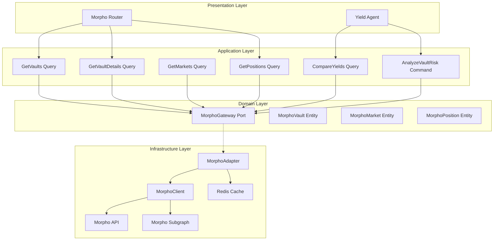
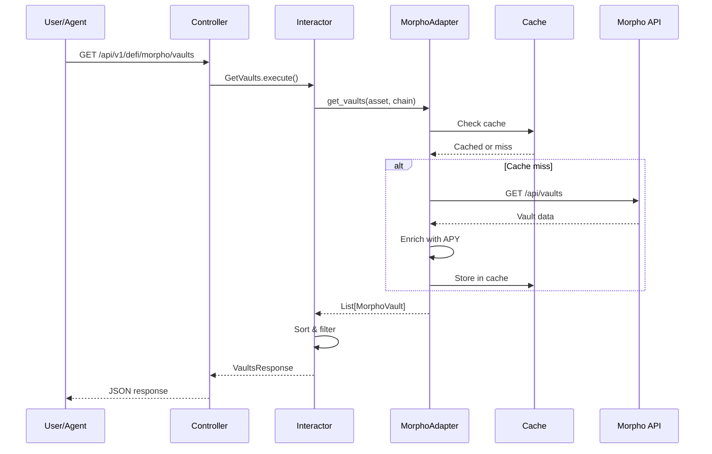

# Design Document: Morpho Protocol Integration

## Overview

This document defines the technical architecture for integrating Morpho Protocol into the Anvil Backend. This is a **new integration** requiring development from scratch, including the infrastructure adapter, domain layer, application interactors, and HTTP endpoints.

The integration enables:
- MetaMorpho vault discovery and analysis
- APY tracking and performance comparison
- User position tracking and earnings
- Risk assessment and vault comparison

## Steering Document Alignment

### Technical Standards (tech.md)

- **Hexagonal Architecture**: MorphoAdapter implements domain-defined port
- **Dependency Injection**: Adapter registered in Dishka container
- **Async-First**: All API calls use async HTTP client
- **Caching**: Appropriate caching for vault data
- **Error Handling**: Domain exceptions for lending errors

### Project Structure (structure.md)

```
src/app/
├── domain/
│   ├── entities/
│   │   └── lending/
│   │       ├── morpho_vault.py            # Vault entity (NEW)
│   │       ├── morpho_market.py           # Market entity (NEW)
│   │       └── morpho_position.py         # Position entity (NEW)
│   ├── value_objects/
│   │   └── lending/
│   │       ├── vault_apy.py               # APY VO (NEW)
│   │       ├── risk_tier.py               # Risk tier enum (NEW)
│   │       └── market_allocation.py       # Allocation VO (NEW)
│   └── ports/
│       └── morpho_gateway.py              # Port interface (NEW)
├── application/
│   ├── queries/
│   │   └── morpho/
│   │       ├── get_vaults.py              # Vault listing (NEW)
│   │       ├── get_vault_details.py       # Vault details (NEW)
│   │       ├── get_markets.py             # Blue markets (NEW)
│   │       ├── get_positions.py           # User positions (NEW)
│   │       └── compare_yields.py          # Protocol comparison (NEW)
│   └── commands/
│       └── morpho/
│           └── analyze_vault_risk.py      # Risk analysis (NEW)
├── infrastructure/
│   └── adapters/
│       └── external/
│           ├── morpho_client.py           # API client (NEW)
│           ├── morpho_adapter.py          # Gateway impl (NEW)
│           └── instrumented/
│               └── instrumented_morpho_client.py  # Telemetry (NEW)
└── presentation/
    └── http/
        └── controllers/
            └── defi/
                └── morpho_router.py       # HTTP endpoints (NEW)
```

## Code Reuse Analysis

### Existing Components to Leverage

| Component | Location | Integration |
|-----------|----------|-------------|
| **ExternalAPICache** | `src/app/infrastructure/cache/external_api_cache.py` | Cache vault data |
| **InstrumentedAdapter** | Pattern from other clients | Add telemetry |
| **AaveClient** | Similar lending protocol | Reference pattern |
| **DefiLlamaClient** | TVL verification | Cross-reference |

### New Components Required

| Component | Purpose |
|-----------|---------|
| **MorphoClient** | HTTP client for Morpho API/subgraph |
| **MorphoAdapter** | Gateway implementation |
| **MorphoVault Entity** | Domain model for vaults |
| **MorphoPosition Entity** | User position tracking |

---

## Architecture

### High-Level Architecture



### Request Flow



---

## Components and Interfaces

### Component 1: MorphoGateway Port

- **Purpose:** Define domain interface for Morpho operations
- **Interfaces:**
  ```python
  class MorphoGateway(Protocol):
      """Port for Morpho Protocol operations"""
      
      async def get_vaults(
          self,
          asset: str | None = None,
          chain: str = "ethereum",
      ) -> list[MorphoVault]:
          """Get MetaMorpho vaults"""
          ...
      
      async def get_vault_details(
          self,
          vault_address: str,
          chain: str = "ethereum",
      ) -> MorphoVault:
          """Get vault details including strategy"""
          ...
      
      async def get_vault_apy(
          self,
          vault_address: str,
          chain: str = "ethereum",
      ) -> VaultAPY:
          """Get vault APY with history"""
          ...
      
      async def get_markets(
          self,
          chain: str = "ethereum",
      ) -> list[MorphoMarket]:
          """Get Morpho Blue markets"""
          ...
      
      async def get_user_positions(
          self,
          address: str,
          chain: str = "ethereum",
      ) -> list[MorphoPosition]:
          """Get user vault positions"""
          ...
      
      async def get_vault_risk_profile(
          self,
          vault_address: str,
          chain: str = "ethereum",
      ) -> VaultRiskProfile:
          """Get vault risk assessment"""
          ...
  ```
- **Location:** `src/app/domain/ports/morpho_gateway.py`

### Component 2: MorphoClient

- **Purpose:** HTTP client for Morpho API/subgraph
- **Interfaces:**
  ```python
  class MorphoClient:
      """HTTP client for Morpho Protocol"""
      
      # API endpoints
      MORPHO_API = "https://api.morpho.org/graphql"  # Placeholder
      MORPHO_SUBGRAPH = "https://api.thegraph.com/subgraphs/name/morpho-labs/morpho-blue"
      
      def __init__(
          self,
          api_key: str | None = None,
          chain: str = "ethereum",
      ):
          self._api_key = api_key
          self._chain = chain
          self._client = httpx.AsyncClient(
              timeout=30.0,
              headers={"Content-Type": "application/json"},
          )
      
      async def close(self):
          """Close HTTP client"""
          await self._client.aclose()
      
      async def get_vaults(self) -> list[dict]:
          """Get all MetaMorpho vaults"""
          query = """
          query GetVaults {
              metaMorphoVaults(first: 100) {
                  id
                  name
                  asset { symbol, decimals, address }
                  totalAssets
                  totalSupply
                  performanceFee
                  curator { id }
                  allocations {
                      market { id, lltv, collateralAsset { symbol } }
                      assets
                  }
              }
          }
          """
          response = await self._client.post(
              self.MORPHO_SUBGRAPH,
              json={"query": query}
          )
          response.raise_for_status()
          return response.json()["data"]["metaMorphoVaults"]
      
      async def get_vault_apy(self, vault_address: str) -> dict:
          """Get vault APY data"""
          # APY calculation from subgraph or API
          ...
      
      async def get_markets(self) -> list[dict]:
          """Get Morpho Blue markets"""
          query = """
          query GetMarkets {
              markets(first: 100) {
                  id
                  lltv
                  collateralAsset { symbol, address }
                  loanAsset { symbol, address }
                  totalSupplyAssets
                  totalBorrowAssets
                  supplyRate
                  borrowRate
                  oracle { id }
              }
          }
          """
          response = await self._client.post(
              self.MORPHO_SUBGRAPH,
              json={"query": query}
          )
          response.raise_for_status()
          return response.json()["data"]["markets"]
      
      async def get_user_positions(self, address: str) -> list[dict]:
          """Get user vault positions"""
          query = """
          query GetPositions($user: String!) {
              metaMorphoPositions(where: { user: $user }) {
                  vault { id, name, asset { symbol } }
                  shares
                  assets
              }
          }
          """
          response = await self._client.post(
              self.MORPHO_SUBGRAPH,
              json={"query": query, "variables": {"user": address.lower()}}
          )
          response.raise_for_status()
          return response.json()["data"]["metaMorphoPositions"]
  ```
- **Location:** `src/app/infrastructure/adapters/external/morpho_client.py`

### Component 3: MorphoAdapter

- **Purpose:** Implement MorphoGateway using MorphoClient
- **Interfaces:**
  ```python
  class MorphoAdapter(MorphoGateway):
      """Morpho implementation of MorphoGateway"""
      
      def __init__(
          self,
          client: MorphoClient,
          cache: ExternalAPICache,
          vault_cache_ttl: int = 300,      # 5 minutes
          apy_cache_ttl: int = 60,          # 1 minute
          position_cache_ttl: int = 30,     # 30 seconds
      ):
          self._client = client
          self._cache = cache
      
      async def get_vaults(
          self,
          asset: str | None = None,
          chain: str = "ethereum",
      ) -> list[MorphoVault]:
          """Get vaults with caching"""
          cache_key = f"morpho:vaults:{chain}"
          cached = await self._cache.get(cache_key)
          if cached:
              vaults = [MorphoVault.from_dict(v) for v in cached]
          else:
              raw_vaults = await self._client.get_vaults()
              vaults = [self._transform_vault(v) for v in raw_vaults]
              await self._cache.set(cache_key, [v.to_dict() for v in vaults], self._vault_cache_ttl)
          
          # Filter by asset if specified
          if asset:
              vaults = [v for v in vaults if v.asset_symbol.upper() == asset.upper()]
          
          return vaults
      
      async def get_vault_apy(
          self,
          vault_address: str,
          chain: str = "ethereum",
      ) -> VaultAPY:
          """Get APY with short caching"""
          cache_key = f"morpho:apy:{chain}:{vault_address}"
          cached = await self._cache.get(cache_key)
          if cached:
              return VaultAPY.from_dict(cached)
          
          raw_apy = await self._client.get_vault_apy(vault_address)
          apy = self._transform_apy(raw_apy)
          await self._cache.set(cache_key, apy.to_dict(), self._apy_cache_ttl)
          return apy
      
      async def get_vault_risk_profile(
          self,
          vault_address: str,
          chain: str = "ethereum",
      ) -> VaultRiskProfile:
          """Calculate vault risk profile"""
          vault = await self.get_vault_details(vault_address, chain)
          
          # Analyze allocations
          risk_factors = []
          for alloc in vault.allocations:
              if alloc.lltv > Decimal("0.90"):
                  risk_factors.append(f"High LLTV ({alloc.lltv}%) in {alloc.collateral_symbol}")
          
          # Determine risk tier
          if len(risk_factors) == 0:
              tier = RiskTier.CONSERVATIVE
          elif len(risk_factors) <= 2:
              tier = RiskTier.MODERATE
          else:
              tier = RiskTier.AGGRESSIVE
          
          return VaultRiskProfile(
              vault_address=vault_address,
              risk_tier=tier,
              risk_factors=risk_factors,
              collateral_exposure=self._calculate_exposure(vault),
          )
      
      def _transform_vault(self, raw: dict) -> MorphoVault:
          """Transform subgraph data to domain entity"""
          return MorphoVault(
              address=raw["id"],
              name=raw["name"],
              asset_address=raw["asset"]["address"],
              asset_symbol=raw["asset"]["symbol"],
              asset_decimals=int(raw["asset"]["decimals"]),
              total_assets=Decimal(raw["totalAssets"]),
              total_supply=Decimal(raw["totalSupply"]),
              performance_fee=Decimal(raw["performanceFee"]) / 10000,  # Basis points
              curator=raw["curator"]["id"] if raw["curator"] else None,
              allocations=[self._transform_allocation(a) for a in raw["allocations"]],
          )
  ```
- **Location:** `src/app/infrastructure/adapters/external/morpho_adapter.py`

### Component 4: GetVaults Query

- **Purpose:** Get vaults with filtering and sorting
- **Interfaces:**
  ```python
  @dataclass
  class GetVaultsRequest:
      asset: str | None = None
      chain: str = "ethereum"
      sort_by: str = "apy"       # apy, tvl, risk
      risk_tier: str | None = None
      limit: int = 50
  
  class GetVaults:
      """Get Morpho vaults"""
      
      def __init__(self, gateway: MorphoGateway):
          self._gateway = gateway
      
      async def execute(self, request: GetVaultsRequest) -> VaultsResponse:
          vaults = await self._gateway.get_vaults(
              asset=request.asset,
              chain=request.chain,
          )
          
          # Enrich with APY
          enriched = []
          for vault in vaults:
              apy = await self._gateway.get_vault_apy(vault.address, request.chain)
              vault.current_apy = apy.net_apy
              vault.apy_7d_avg = apy.avg_7d
              enriched.append(vault)
          
          # Filter by risk tier
          if request.risk_tier:
              risk_tier = RiskTier(request.risk_tier)
              enriched = [v for v in enriched if self._assess_risk(v) == risk_tier]
          
          # Sort
          if request.sort_by == "apy":
              enriched.sort(key=lambda v: v.current_apy or 0, reverse=True)
          elif request.sort_by == "tvl":
              enriched.sort(key=lambda v: v.tvl_usd or 0, reverse=True)
          
          return VaultsResponse(
              vaults=enriched[:request.limit],
              total_count=len(enriched),
          )
      
      def _assess_risk(self, vault: MorphoVault) -> RiskTier:
          """Quick risk assessment"""
          high_lltv_count = sum(1 for a in vault.allocations if a.lltv > Decimal("0.90"))
          if high_lltv_count == 0:
              return RiskTier.CONSERVATIVE
          elif high_lltv_count <= 2:
              return RiskTier.MODERATE
          return RiskTier.AGGRESSIVE
  ```
- **Location:** `src/app/application/queries/morpho/get_vaults.py`

### Component 5: CompareYields Query

- **Purpose:** Compare Morpho yields with other protocols
- **Interfaces:**
  ```python
  @dataclass
  class CompareYieldsRequest:
      asset: str
      amount: Decimal | None = None
  
  class CompareYields:
      """Compare lending yields across protocols"""
      
      def __init__(
          self,
          morpho_gateway: MorphoGateway,
          aave_gateway: AaveGateway,  # Existing
      ):
          self._morpho = morpho_gateway
          self._aave = aave_gateway
      
      async def execute(self, request: CompareYieldsRequest) -> YieldComparisonResponse:
          # Get Morpho vaults for asset
          morpho_vaults = await self._morpho.get_vaults(asset=request.asset)
          
          # Get Aave rate
          aave_rate = await self._aave.get_supply_rate(request.asset)
          
          # Build comparison
          comparisons = []
          for vault in morpho_vaults[:5]:  # Top 5 vaults
              apy = await self._morpho.get_vault_apy(vault.address)
              diff = apy.net_apy - aave_rate
              
              comparisons.append(YieldComparison(
                  protocol="Morpho",
                  vault_name=vault.name,
                  apy=apy.net_apy,
                  diff_vs_aave=diff,
                  risk_tier=self._assess_risk(vault),
                  annual_extra_yield=(
                      diff * request.amount / 100 if request.amount else None
                  ),
              ))
          
          # Add Aave as baseline
          comparisons.append(YieldComparison(
              protocol="Aave v3",
              vault_name="Direct Supply",
              apy=aave_rate,
              diff_vs_aave=Decimal("0"),
              risk_tier=RiskTier.CONSERVATIVE,
          ))
          
          # Sort by APY
          comparisons.sort(key=lambda c: c.apy, reverse=True)
          
          return YieldComparisonResponse(
              asset=request.asset,
              comparisons=comparisons,
              best_option=comparisons[0],
          )
  ```
- **Location:** `src/app/application/queries/morpho/compare_yields.py`

### Component 6: Morpho Router

- **Purpose:** HTTP endpoints for Morpho operations
- **Interfaces:**
  ```python
  router = APIRouter(prefix="/defi/morpho", tags=["defi", "lending"])
  
  @router.get("/vaults")
  async def get_vaults(
      asset: str | None = None,
      chain: str = "ethereum",
      sort_by: str = "apy",
      risk_tier: str | None = None,
      limit: int = 50,
      query: GetVaults = Depends(),
  ) -> VaultsResponse:
      """Get MetaMorpho vaults"""
      ...
  
  @router.get("/vaults/{vault_address}")
  async def get_vault_details(
      vault_address: str,
      chain: str = "ethereum",
      query: GetVaultDetails = Depends(),
  ) -> VaultDetailsResponse:
      """Get vault details"""
      ...
  
  @router.get("/vaults/{vault_address}/apy")
  async def get_vault_apy(
      vault_address: str,
      chain: str = "ethereum",
      query: GetVaultAPY = Depends(),
  ) -> VaultAPYResponse:
      """Get vault APY history"""
      ...
  
  @router.get("/vaults/{vault_address}/risk")
  async def get_vault_risk(
      vault_address: str,
      chain: str = "ethereum",
      query: GetVaultRisk = Depends(),
  ) -> VaultRiskResponse:
      """Get vault risk profile"""
      ...
  
  @router.get("/markets")
  async def get_markets(
      chain: str = "ethereum",
      query: GetMarkets = Depends(),
  ) -> MarketsResponse:
      """Get Morpho Blue markets"""
      ...
  
  @router.get("/positions/{address}")
  async def get_positions(
      address: str,
      chain: str = "ethereum",
      query: GetPositions = Depends(),
  ) -> PositionsResponse:
      """Get user positions"""
      ...
  
  @router.get("/compare")
  async def compare_yields(
      asset: str,
      amount: Decimal | None = None,
      query: CompareYields = Depends(),
  ) -> YieldComparisonResponse:
      """Compare yields across protocols"""
      ...
  ```
- **Location:** `src/app/presentation/http/controllers/defi/morpho_router.py`

---

## Data Models

### MorphoVault Entity

```python
@dataclass
class MorphoVault:
    """Morpho vault entity"""
    address: str
    name: str
    asset_address: str
    asset_symbol: str
    asset_decimals: int
    total_assets: Decimal      # Total deposited
    total_supply: Decimal      # Shares outstanding
    performance_fee: Decimal   # Percentage
    curator: str | None
    allocations: list[MarketAllocation]
    current_apy: Decimal | None = None
    apy_7d_avg: Decimal | None = None
    tvl_usd: Decimal | None = None
    
    def to_dict(self) -> dict:
        ...
    
    @classmethod
    def from_dict(cls, data: dict) -> "MorphoVault":
        ...
```

### MorphoMarket Entity

```python
@dataclass
class MorphoMarket:
    """Morpho Blue market entity"""
    id: str
    collateral_address: str
    collateral_symbol: str
    loan_address: str
    loan_symbol: str
    lltv: Decimal              # Liquidation LTV (e.g., 0.86)
    total_supply: Decimal
    total_borrow: Decimal
    supply_apy: Decimal
    borrow_apy: Decimal
    utilization: Decimal
    oracle: str | None
```

### MorphoPosition Entity

```python
@dataclass
class MorphoPosition:
    """User position entity"""
    vault_address: str
    vault_name: str
    asset_symbol: str
    shares: Decimal
    assets: Decimal            # Current value
    deposited_assets: Decimal  # Original deposit
    earnings: Decimal          # assets - deposited
    earnings_usd: Decimal
    share_price: Decimal
```

### VaultAPY Value Object

```python
@dataclass(frozen=True)
class VaultAPY:
    """Vault APY value object"""
    vault_address: str
    gross_apy: Decimal         # Before fees
    net_apy: Decimal           # After fees
    avg_7d: Decimal
    avg_30d: Decimal
    apy_by_market: list[dict]  # Breakdown
```

### RiskTier Enum

```python
class RiskTier(Enum):
    """Vault risk tier"""
    CONSERVATIVE = "conservative"
    MODERATE = "moderate"
    AGGRESSIVE = "aggressive"
```

### MarketAllocation Value Object

```python
@dataclass(frozen=True)
class MarketAllocation:
    """Market allocation value object"""
    market_id: str
    collateral_symbol: str
    lltv: Decimal
    allocation_pct: Decimal    # % of vault allocated
    assets: Decimal
```

---

## Error Handling

### Error Mapping

| Error | HTTP Status | Domain Exception |
|-------|-------------|------------------|
| Vault not found | 404 | `VaultNotFoundError` |
| Invalid address | 400 | `InvalidAddressError` |
| API error | 502 | `MorphoAPIError` |
| Subgraph error | 502 | `SubgraphError` |

### Exception Classes

```python
# src/app/domain/exceptions/morpho.py
class MorphoError(DomainError):
    """Base exception for Morpho operations"""
    pass

class VaultNotFoundError(MorphoError):
    """Vault not found"""
    pass

class MorphoAPIError(MorphoError):
    """Morpho API error"""
    pass

class SubgraphError(MorphoError):
    """Subgraph query error"""
    pass
```

---

## Caching Strategy

| Data Type | Cache Key | TTL | Notes |
|-----------|-----------|-----|-------|
| Vaults | `morpho:vaults:{chain}` | 5 min | List metadata |
| Vault APY | `morpho:apy:{chain}:{address}` | 1 min | Volatile |
| Markets | `morpho:markets:{chain}` | 2 min | Market data |
| Positions | `morpho:positions:{chain}:{address}` | 30s | User data |
| Risk Profile | `morpho:risk:{chain}:{address}` | 5 min | Calculated |

---

## API Endpoints Summary

| Method | Endpoint | Description |
|--------|----------|-------------|
| GET | `/api/v1/defi/morpho/vaults` | List vaults |
| GET | `/api/v1/defi/morpho/vaults/{address}` | Vault details |
| GET | `/api/v1/defi/morpho/vaults/{address}/apy` | Vault APY |
| GET | `/api/v1/defi/morpho/vaults/{address}/risk` | Risk profile |
| GET | `/api/v1/defi/morpho/markets` | Blue markets |
| GET | `/api/v1/defi/morpho/positions/{address}` | User positions |
| GET | `/api/v1/defi/morpho/compare` | Yield comparison |

---

## Configuration

```toml
# config/local/config.toml
[morpho]
enabled = true
chain = "ethereum"
cache_vault_ttl = 300
cache_apy_ttl = 60
cache_position_ttl = 30

[morpho.endpoints]
api = "https://api.morpho.org/graphql"
subgraph = "https://api.thegraph.com/subgraphs/name/morpho-labs/morpho-blue"
```

---

## Testing Strategy

### Unit Testing

- **MorphoClient**: Mock HTTP, test GraphQL queries
- **MorphoAdapter**: Mock client, test transformations
- **Risk Assessment**: Test tier calculations
- **APY Calculations**: Test fee deductions

### Integration Testing

- **Subgraph Queries**: Test with real subgraph
- **Position Tracking**: Test with test addresses
- **Yield Comparison**: Test against Aave
