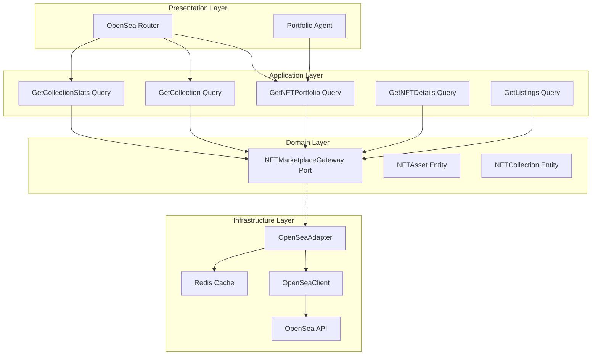

# Design Document: OpenSea Integration

## Overview

This document defines the technical architecture for completing the OpenSea integration into the Anvil Backend. The existing `OpenSeaClient` infrastructure adapter provides basic API connectivity. This design focuses on building the domain layer, application interactors, and HTTP endpoints for NFT portfolio tracking and market data.

The integration enables:
- NFT portfolio retrieval and valuation
- Collection statistics and floor prices
- NFT details with traits and rarity
- Multi-chain NFT support

## Steering Document Alignment

### Technical Standards (tech.md)

- **Hexagonal Architecture**: OpenSeaAdapter implements domain-defined port
- **Dependency Injection**: Adapter registered in Dishka container
- **Async-First**: All API calls use async HTTP client
- **Caching**: Appropriate caching for collection data
- **Error Handling**: Domain exceptions for NFT errors

### Project Structure (structure.md)

```
src/app/
├── domain/
│   ├── entities/
│   │   └── nft/
│   │       ├── nft_asset.py               # NFT entity (NEW)
│   │       └── nft_collection.py          # Collection entity (NEW)
│   ├── value_objects/
│   │   └── nft/
│   │       ├── collection_stats.py        # Stats VO (NEW)
│   │       ├── nft_traits.py              # Traits VO (NEW)
│   │       └── nft_listing.py             # Listing VO (NEW)
│   └── ports/
│       └── nft_marketplace_gateway.py     # Port interface (NEW)
├── application/
│   ├── queries/
│   │   └── nft/
│   │       ├── get_nft_portfolio.py       # Portfolio query (NEW)
│   │       ├── get_collection.py          # Collection info (NEW)
│   │       ├── get_collection_stats.py    # Market stats (NEW)
│   │       ├── get_nft_details.py         # NFT details (NEW)
│   │       └── get_listings.py            # Active listings (NEW)
├── infrastructure/
│   └── adapters/
│       └── external/
│           ├── opensea_client.py          # Existing ✅
│           └── opensea_adapter.py         # Gateway impl (NEW)
└── presentation/
    └── http/
        └── controllers/
            └── nft/
                └── opensea_router.py      # HTTP endpoints (NEW)
```

## Code Reuse Analysis

### Existing Components to Leverage

| Component | Location | Integration |
|-----------|----------|-------------|
| **OpenSeaClient** | `src/app/infrastructure/adapters/external/opensea_client.py` | Wrap with adapter |
| **ExternalAPICache** | `src/app/infrastructure/cache/external_api_cache.py` | Cache collection data |

---

## Architecture

### High-Level Architecture



---

## Components and Interfaces

### Component 1: NFTMarketplaceGateway Port

- **Purpose:** Define domain interface for NFT marketplace operations
- **Interfaces:**
  ```python
  class NFTMarketplaceGateway(Protocol):
      """Port for NFT marketplace operations"""
      
      async def get_nfts_by_owner(
          self,
          address: str,
          chain: str = "ethereum",
          limit: int = 50,
      ) -> list[NFTAsset]:
          """Get NFTs owned by address"""
          ...
      
      async def get_collection(
          self,
          collection_slug: str,
      ) -> NFTCollection | None:
          """Get collection information"""
          ...
      
      async def get_collection_stats(
          self,
          collection_slug: str,
      ) -> CollectionStats | None:
          """Get collection statistics"""
          ...
      
      async def get_nft(
          self,
          contract_address: str,
          token_id: str,
          chain: str = "ethereum",
      ) -> NFTAsset | None:
          """Get single NFT details"""
          ...
      
      async def get_listings(
          self,
          collection_slug: str,
          limit: int = 50,
      ) -> list[NFTListing]:
          """Get active listings"""
          ...
      
      async def get_floor_price(
          self,
          collection_slug: str,
      ) -> Decimal | None:
          """Get collection floor price"""
          ...
  ```
- **Location:** `src/app/domain/ports/nft_marketplace_gateway.py`

### Component 2: OpenSeaAdapter

- **Purpose:** Implement NFTMarketplaceGateway using OpenSeaClient
- **Interfaces:**
  ```python
  class OpenSeaAdapter(NFTMarketplaceGateway):
      """OpenSea implementation of NFTMarketplaceGateway"""
      
      def __init__(
          self,
          client: OpenSeaClient,
          cache: ExternalAPICache,
          collection_cache_ttl: int = 900,    # 15 minutes
          stats_cache_ttl: int = 300,          # 5 minutes
          portfolio_cache_ttl: int = 600,      # 10 minutes
      ):
          self._client = client
          self._cache = cache
      
      async def get_nfts_by_owner(
          self,
          address: str,
          chain: str = "ethereum",
          limit: int = 50,
      ) -> list[NFTAsset]:
          """Get NFTs with caching"""
          cache_key = f"opensea:portfolio:{chain}:{address}"
          cached = await self._cache.get(cache_key)
          if cached:
              return [NFTAsset.from_dict(n) for n in cached]
          
          raw_nfts = await self._client.get_nfts_by_account(
              address=address,
              chain=Chain(chain),
              limit=limit,
          )
          nfts = [self._transform_nft(n) for n in raw_nfts]
          await self._cache.set(cache_key, [n.to_dict() for n in nfts], self._portfolio_cache_ttl)
          return nfts
      
      async def get_collection_stats(
          self,
          collection_slug: str,
      ) -> CollectionStats | None:
          """Get stats with short caching"""
          cache_key = f"opensea:stats:{collection_slug}"
          cached = await self._cache.get(cache_key)
          if cached:
              return CollectionStats.from_dict(cached)
          
          raw_stats = await self._client.get_collection_stats(collection_slug)
          if not raw_stats:
              return None
          
          stats = self._transform_stats(raw_stats)
          await self._cache.set(cache_key, stats.to_dict(), self._stats_cache_ttl)
          return stats
      
      def _transform_nft(self, raw: NFTAsset) -> NFTAsset:
          """Transform client model to domain entity"""
          return NFTAsset(
              identifier=raw.identifier,
              collection_slug=raw.collection,
              contract_address=raw.contract,
              name=raw.name,
              description=raw.description,
              image_url=raw.image_url,
              animation_url=raw.animation_url,
              traits=[NFTTrait.from_dict(t) for t in raw.traits],
              rarity_rank=raw.rarity_rank,
          )
  ```
- **Location:** `src/app/infrastructure/adapters/external/opensea_adapter.py`

### Component 3: GetNFTPortfolio Query

- **Purpose:** Get NFT portfolio with valuation
- **Interfaces:**
  ```python
  @dataclass
  class GetNFTPortfolioRequest:
      address: str
      chain: str = "ethereum"
      include_valuation: bool = True
  
  class GetNFTPortfolio:
      """Get NFT portfolio with valuation"""
      
      def __init__(self, gateway: NFTMarketplaceGateway):
          self._gateway = gateway
      
      async def execute(self, request: GetNFTPortfolioRequest) -> NFTPortfolioResponse:
          nfts = await self._gateway.get_nfts_by_owner(
              address=request.address,
              chain=request.chain,
          )
          
          # Group by collection
          by_collection: dict[str, list[NFTAsset]] = {}
          for nft in nfts:
              if nft.collection_slug not in by_collection:
                  by_collection[nft.collection_slug] = []
              by_collection[nft.collection_slug].append(nft)
          
          # Calculate valuation if requested
          total_value_eth = Decimal("0")
          total_value_usd = Decimal("0")
          collection_values = []
          
          if request.include_valuation:
              for slug, collection_nfts in by_collection.items():
                  floor_price = await self._gateway.get_floor_price(slug)
                  if floor_price:
                      collection_value = floor_price * len(collection_nfts)
                      total_value_eth += collection_value
                      collection_values.append(CollectionValue(
                          slug=slug,
                          count=len(collection_nfts),
                          floor_price_eth=floor_price,
                          total_value_eth=collection_value,
                      ))
              
              # Convert to USD (would use price oracle)
              total_value_usd = total_value_eth * Decimal("2500")  # Placeholder
          
          return NFTPortfolioResponse(
              address=request.address,
              chain=request.chain,
              nfts=nfts,
              total_count=len(nfts),
              collection_count=len(by_collection),
              total_value_eth=total_value_eth,
              total_value_usd=total_value_usd,
              by_collection=collection_values,
          )
  ```
- **Location:** `src/app/application/queries/nft/get_nft_portfolio.py`

### Component 4: GetCollectionStats Query

- **Purpose:** Get collection market statistics
- **Interfaces:**
  ```python
  @dataclass
  class GetCollectionStatsRequest:
      collection_slug: str
  
  class GetCollectionStats:
      """Get collection statistics"""
      
      def __init__(self, gateway: NFTMarketplaceGateway):
          self._gateway = gateway
      
      async def execute(self, request: GetCollectionStatsRequest) -> CollectionStatsResponse:
          stats = await self._gateway.get_collection_stats(request.collection_slug)
          
          if not stats:
              raise CollectionNotFoundError(f"Collection not found: {request.collection_slug}")
          
          # Add market analysis
          market_sentiment = self._analyze_sentiment(stats)
          
          return CollectionStatsResponse(
              stats=stats,
              market_sentiment=market_sentiment,
              floor_change_alert=self._check_floor_alert(stats),
          )
      
      def _analyze_sentiment(self, stats: CollectionStats) -> str:
          """Analyze market sentiment"""
          if stats.one_day_change > 10:
              return "BULLISH"
          elif stats.one_day_change < -10:
              return "BEARISH"
          return "NEUTRAL"
      
      def _check_floor_alert(self, stats: CollectionStats) -> str | None:
          """Check for floor price alerts"""
          if stats.one_day_change < -20:
              return "SIGNIFICANT_DROP"
          elif stats.one_day_change > 30:
              return "SIGNIFICANT_RISE"
          return None
  ```
- **Location:** `src/app/application/queries/nft/get_collection_stats.py`

### Component 5: OpenSea Router

- **Purpose:** HTTP endpoints for NFT operations
- **Interfaces:**
  ```python
  router = APIRouter(prefix="/nft", tags=["nft"])
  
  @router.get("/portfolio/{address}")
  async def get_portfolio(
      address: str,
      chain: str = "ethereum",
      include_valuation: bool = True,
      query: GetNFTPortfolio = Depends(),
  ) -> NFTPortfolioResponse:
      """Get NFT portfolio"""
      ...
  
  @router.get("/collections/{slug}")
  async def get_collection(
      slug: str,
      query: GetCollection = Depends(),
  ) -> CollectionResponse:
      """Get collection info"""
      ...
  
  @router.get("/collections/{slug}/stats")
  async def get_collection_stats(
      slug: str,
      query: GetCollectionStats = Depends(),
  ) -> CollectionStatsResponse:
      """Get collection statistics"""
      ...
  
  @router.get("/assets/{contract_address}/{token_id}")
  async def get_nft(
      contract_address: str,
      token_id: str,
      chain: str = "ethereum",
      query: GetNFTDetails = Depends(),
  ) -> NFTDetailsResponse:
      """Get NFT details"""
      ...
  
  @router.get("/collections/{slug}/listings")
  async def get_listings(
      slug: str,
      limit: int = 50,
      query: GetListings = Depends(),
  ) -> ListingsResponse:
      """Get active listings"""
      ...
  
  @router.get("/collections/{slug}/floor")
  async def get_floor_price(
      slug: str,
      query: GetFloorPrice = Depends(),
  ) -> FloorPriceResponse:
      """Get floor price"""
      ...
  ```
- **Location:** `src/app/presentation/http/controllers/nft/opensea_router.py`

---

## Data Models

### NFTAsset Entity

```python
@dataclass
class NFTAsset:
    """NFT asset entity"""
    identifier: str            # Token ID
    collection_slug: str
    contract_address: str
    name: str | None
    description: str | None
    image_url: str | None
    animation_url: str | None
    traits: list[NFTTrait]
    rarity_rank: int | None = None
    last_sale_price: Decimal | None = None
    last_sale_currency: str | None = None
    
    def to_dict(self) -> dict:
        ...
    
    @classmethod
    def from_dict(cls, data: dict) -> "NFTAsset":
        ...
```

### NFTCollection Entity

```python
@dataclass
class NFTCollection:
    """NFT collection entity"""
    slug: str
    name: str
    description: str | None
    image_url: str | None
    banner_image_url: str | None
    total_supply: int
    created_date: datetime | None
    contracts: list[dict]      # Chain contracts
    
    def to_dict(self) -> dict:
        ...
```

### CollectionStats Value Object

```python
@dataclass(frozen=True)
class CollectionStats:
    """Collection statistics value object"""
    slug: str
    floor_price: Decimal       # In ETH
    floor_price_usd: Decimal
    total_volume: Decimal
    total_sales: int
    num_owners: int
    average_price: Decimal
    market_cap: Decimal
    one_day_volume: Decimal
    one_day_change: Decimal    # Percentage
    seven_day_volume: Decimal
    seven_day_change: Decimal
```

### NFTTrait Value Object

```python
@dataclass(frozen=True)
class NFTTrait:
    """NFT trait value object"""
    trait_type: str
    value: str
    rarity_pct: Decimal | None = None  # Percentage of collection
```

### NFTListing Value Object

```python
@dataclass(frozen=True)
class NFTListing:
    """NFT listing value object"""
    order_hash: str
    token_id: str
    collection_slug: str
    price: Decimal             # In ETH
    price_usd: Decimal
    currency: str
    seller: str
    created_date: datetime
    expiration_date: datetime | None
```

---

## Error Handling

### Error Mapping

| Error | HTTP Status | Domain Exception |
|-------|-------------|------------------|
| Collection not found | 404 | `CollectionNotFoundError` |
| NFT not found | 404 | `NFTNotFoundError` |
| Invalid address | 400 | `InvalidAddressError` |
| API rate limit | 429 | `RateLimitError` |
| API error | 502 | `OpenSeaAPIError` |

### Exception Classes

```python
# src/app/domain/exceptions/nft.py
class NFTError(DomainError):
    """Base exception for NFT operations"""
    pass

class CollectionNotFoundError(NFTError):
    """Collection not found"""
    pass

class NFTNotFoundError(NFTError):
    """NFT not found"""
    pass

class InvalidAddressError(NFTError):
    """Invalid wallet address"""
    pass

class OpenSeaAPIError(NFTError):
    """OpenSea API error"""
    pass
```

---

## Caching Strategy

| Data Type | Cache Key | TTL | Notes |
|-----------|-----------|-----|-------|
| Collection | `opensea:collection:{slug}` | 15 min | Metadata |
| Stats | `opensea:stats:{slug}` | 5 min | Floor price volatile |
| Portfolio | `opensea:portfolio:{chain}:{address}` | 10 min | User data |
| NFT Details | `opensea:nft:{chain}:{contract}:{id}` | 15 min | Metadata |
| Listings | `opensea:listings:{slug}` | 1 min | Very volatile |

---

## API Endpoints Summary

| Method | Endpoint | Description |
|--------|----------|-------------|
| GET | `/api/v1/nft/portfolio/{address}` | Get portfolio |
| GET | `/api/v1/nft/collections/{slug}` | Collection info |
| GET | `/api/v1/nft/collections/{slug}/stats` | Collection stats |
| GET | `/api/v1/nft/assets/{contract}/{token_id}` | NFT details |
| GET | `/api/v1/nft/collections/{slug}/listings` | Active listings |
| GET | `/api/v1/nft/collections/{slug}/floor` | Floor price |

---

## Configuration

```toml
# config/local/config.toml
[opensea]
enabled = true
api_key = ""  # Required for production
cache_collection_ttl = 900
cache_stats_ttl = 300
cache_portfolio_ttl = 600
cache_listings_ttl = 60

[opensea.chains]
ethereum = "ethereum"
polygon = "matic"
arbitrum = "arbitrum"
optimism = "optimism"
base = "base"
```

---

## Testing Strategy

### Unit Testing

- **OpenSeaAdapter**: Mock client, test transformations
- **Portfolio Valuation**: Test floor price calculations
- **Stats Analysis**: Test sentiment detection

### Integration Testing

- **API Key Handling**: Test with/without API key
- **Multi-chain**: Test different chain support
