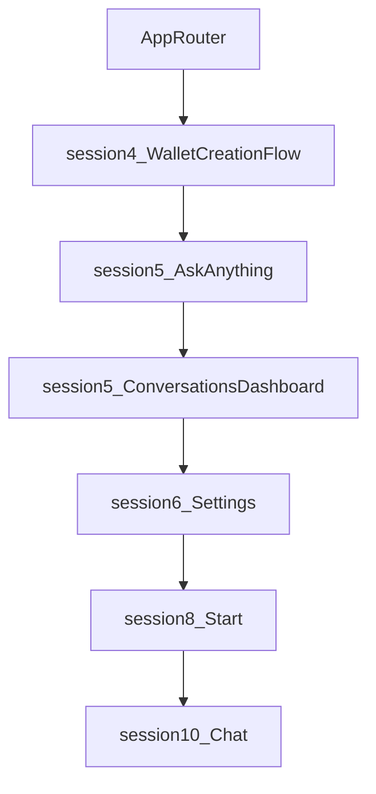

# Análisis de Patrones de Documentación - Complete Anvil

**Fecha:** 2026-01-22
**Autor:** Claude Code (Análisis solicitado por Jhordán)
**Propósito:** Documentar los patrones y prompts que tu compañero usa para crear documentación ordenada de investigación, resolución de problemas y arquitectura.

---

## 📋 Índice

1. [Resumen Ejecutivo](#resumen-ejecutivo)
2. [Estructura General de Documentación](#estructura-general-de-documentación)
3. [Patrones de Nomenclatura](#patrones-de-nomenclatura)
4. [Templates y Prompts Identificados](#templates-y-prompts-identificados)
5. [Tipos de Documentos](#tipos-de-documentos)
6. [Secciones Estándar por Tipo](#secciones-estándar-por-tipo)
7. [Formato y Convenciones](#formato-y-convenciones)
8. [Ejemplos Completos](#ejemplos-completos)
9. [Recomendaciones para Nuevos Documentos](#recomendaciones-para-nuevos-documentos)

---

## Resumen Ejecutivo

Tu compañero sigue una **metodología CTO altamente estructurada** para documentar el proyecto Complete Anvil. El sistema se basa en:

### Características Clave

- **450+ documentos** organizados modularmente (no por timeline)
- **Navegación por audiencia** (CEO, Developer, DevOps, Architect)
- **Templates reutilizables** para consistencia
- **Metadata headers** con version, fecha, status
- **Diagramas ASCII** para arquitectura visual
- **Tablas comparativas** para decisiones
- **Emojis temáticos** para navegación rápida
- **Reportes de sesión** con métricas cuantificables

### Organización Jerárquica

```
anvil_backend/docs/
├── README.md                      # Índice maestro por roles
├── DOCUMENTATION_INDEX.md         # Catálogo completo
├── STRUCTURE.md                   # Mapa de carpetas
├── getting-started/               # Onboarding
├── architecture/                  # ADRs y especificaciones
├── api/                          # Docs de API
├── guides/                       # Guías prácticas
├── features/                     # Docs de funcionalidades
├── operations/                   # Runbooks
├── deployment/                   # Despliegue
├── testing/                      # Testing
├── database/                     # Base de datos
├── security/                     # Seguridad
├── analysis/                     # Análisis técnicos
├── systematic-bug-fix/           # Bug fixing sessions
├── frontend/_templates/          # Templates
└── archive/                      # 450+ docs históricos
```

---

## Estructura General de Documentación

### Niveles de Organización

#### 1. Por Audiencia (README.md)
```markdown
# Complete Anvil Backend Documentation

## Navigation by Role

### 🆕 New Developer
→ [Getting Started Guide](getting-started/README.md)
→ [Project Structure](STRUCTURE.md)

### 👨‍💻 Backend Developer
→ [Development Guides](guides/README.md)
→ [API Documentation](api/README.md)

### 🔧 DevOps/SRE
→ [Operations](operations/README.md)
→ [Deployment Guides](deployment/README.md)

### 📊 Product Manager
→ [Features Overview](features/README.md)
→ [Product Requirements](product/README.md)

### 🏗️ Architect
→ [Architecture Decisions](architecture/ADRs/)
→ [System Design](architecture/specs/)
```

#### 2. Por Propósito
- **Learning**: getting-started/, guides/
- **Reference**: api/, reference/
- **Operations**: operations/, deployment/
- **Features**: features/
- **Historical**: archive/historical/

#### 3. Por Tipo de Contenido
- **Technical Specs**: architecture/
- **Business**: docs ejecutivos (CEO/CPO)
- **Implementation**: guides/, features/
- **Analysis**: analysis/
- **Session Reports**: systematic-bug-fix/

---

## Patrones de Nomenclatura

### Convención General

```
TIPO_DESCRIPTOR_AUDIENCIA.md
```

### Por Tipo de Documento

| Patrón | Ejemplo | Uso |
|--------|---------|-----|
| `UPPERCASE_MULTIPLE_WORDS.md` | `CHAT_ENDPOINTS_EXPLAINED.md` | Documentos principales/especificaciones |
| `lowercase-kebab-case.md` | `llm-based-intent-detection-proposal.md` | Análisis y propuestas técnicas |
| `SESSION_TYPE_SUMMARY.md` | `COMPREHENSIVE_SESSION_SUMMARY.md` | Reportes de sesiones de trabajo |
| `feature_purpose_descriptor.md` | `guest-chat-informational-queries-fix.md` | Fixes y mejoras específicas |
| `PHASE_STATUS_DESCRIPTOR.md` | `PHASE2_COMPLETE_SUMMARY.txt` | Documentos de estado/milestone |

### Sufijos Recurrentes

| Sufijo | Propósito | Ejemplo |
|--------|-----------|---------|
| `_PLAN` | Planificación de features | `WEEK6_SUMMARY.md`, `GUEST_CHAT_WEEK5_PLAN.md` |
| `_SUMMARY` | Resúmenes de trabajo | `COMPREHENSIVE_SESSION_SUMMARY.md` |
| `_SPEC` | Especificaciones técnicas | `AGNO_MULTISTEP_WORKFLOW_SPEC.md` |
| `_GUIDE` | Guías de uso | `GUEST_CHAT_USER_GUIDE.md`, `API_MIGRATION_GUIDE.md` |
| `_ANALYSIS` | Análisis profundos | `INTENT_FLOW_ANALYSIS_CTO.md` |
| `_REPORT` | Reportes de estado | `FINAL_SESSION_REPORT.md` |
| `_COMPLETE` | Features completadas | `REFACTOR_COMPLETE.md` |
| `_IMPLEMENTATION` | Implementaciones | `UNIFIED_ROUTING_IMPLEMENTATION_COMPLETE.md` |
| `_CEO` | Documentos ejecutivos | `CHAT_FUNCTIONALITIES_CEO.md` |
| `_CPO` | Documentos para CPO | `MODULES_REPORT_CPO.md` |
| `_CTO` | Documentos técnicos CTO | `INTENT_FLOW_ANALYSIS_CTO.md` |

---

## Templates y Prompts Identificados

### 1. Module Template (Frontend)

**Ubicación**: `docs/frontend/_templates/MODULE_TEMPLATE.md` (642 líneas)

**Estructura Completa**:

```markdown
# [Module Name] - Complete Specification

**Version:** 1.0.0
**Date:** YYYY-MM-DD
**Status:** 🟢 Complete | 🟡 In Progress | 🔴 Blocked
**Owner:** [Team/Person]
**Last Updated:** [Date]

---

## 📖 Overview & Key Capabilities

[Descripción general del módulo]

### Key Features
- Feature 1
- Feature 2
- Feature 3

---

## 🎨 UX/UI Specifications

### Color Palette
```typescript
const palette = {
  primary: '#HEXCODE',
  secondary: '#HEXCODE',
  // ...
} as const;
```

### Typography
- **Title**: Size, weight, line-height
- **Body**: Size, weight, line-height

### Responsive Design
- Mobile-first approach
- Breakpoints
- Safe-area insets

---

## 🔌 API Endpoints

### Endpoint 1: [Name]
```typescript
// Request
interface RequestType {
  field: string;
}

// Response
interface ResponseType {
  data: any;
}
```

**Usage:**
```typescript
const result = await api.endpoint(params);
```

---

## 📱 Component Structure

```
Module/
├── ModulePage.tsx          # Main container
├── components/
│   ├── ComponentA.tsx
│   └── ComponentB.tsx
├── hooks/
│   └── useModuleLogic.ts
└── module.css
```

---

## 🔄 User Flows & Use Cases

### Flow 1: [Name]
```
User → Action → System → Response
```

---

## 🧪 Testing Requirements

### Unit Tests
- [ ] Component renders correctly
- [ ] User interactions work
- [ ] Edge cases handled

### Integration Tests
- [ ] API calls succeed
- [ ] Error handling works

---

## 📚 References & Changelog

### Related Documents
- [Doc 1](link)
- [Doc 2](link)

### Changelog
- **v1.0.0** (YYYY-MM-DD): Initial version
```

---

### 2. Endpoint Template

**Ubicación**: `docs/frontend/_templates/critical/`, `low/`

```markdown
# FRONTEND API: [Endpoint Name]

**Priority:** CRITICAL | HIGH | MEDIUM | LOW
**Module:** [Module Name]
**Authentication:** Required | Optional | None

---

## 📋 Endpoint Details

**URL:** `POST /api/v1/resource`
**Method:** POST | GET | PUT | DELETE

### Request Schema
```typescript
interface RequestSchema {
  field: string;
}
```

### Response Schema
```typescript
interface ResponseSchema {
  data: any;
}
```

---

## 🔧 TypeScript Integration

```typescript
// API client method
export const endpointName = async (params: RequestSchema): Promise<ResponseSchema> => {
  const response = await httpClient.post('/api/v1/resource', params);
  return response.data;
};
```

---

## ⚛️ React Hook

```typescript
export const useEndpoint = () => {
  const [data, setData] = useState<ResponseSchema | null>(null);
  const [loading, setLoading] = useState(false);
  const [error, setError] = useState<Error | null>(null);

  const execute = async (params: RequestSchema) => {
    setLoading(true);
    try {
      const result = await api.endpointName(params);
      setData(result);
    } catch (err) {
      setError(err as Error);
    } finally {
      setLoading(false);
    }
  };

  return { data, loading, error, execute };
};
```

---

## ❌ Error Handling

| Status | Error | Action |
|--------|-------|--------|
| 400 | Bad Request | Show validation errors |
| 401 | Unauthorized | Redirect to login |
| 500 | Server Error | Show error toast |

---

## 💡 Use Cases

1. **Use Case 1**: Description
2. **Use Case 2**: Description

---

## 📚 References

- [Related Doc](link)
```

---

### 3. Session Report Template

**Patrón identificado en múltiples reportes**:

```markdown
# [Session Type] Session Report

**Date:** YYYY-MM-DD
**Status:** ✅ Complete | 🚧 In Progress | 🔴 Blocked
**Duration:** X hours
**Files Changed:** N files

---

## 📊 Overall Achievement Summary

### Starting Point
- Initial state description
- Known issues
- Blockers

### Current Status
- What was accomplished
- Current state

### Progress Metrics
- Tests: X/Y passing
- Coverage: Z%
- Files fixed: N

---

## 📁 Files Fixed/Changed (Detailed)

### Batch 1: [Category]
- **File #1**: `path/to/file.py`
  - **Instances**: X
  - **Result**: Y/Z PASSED
  - **Changes**: Description

- **File #2**: `path/to/file2.py`
  - **Instances**: X
  - **Result**: Y/Z PASSED
  - **Changes**: Description

### Batch 2: [Category]
[Repetir estructura]

---

## 🔧 Technical Details

### Module: [Name]
- Changes made
- Rationale
- Impact

### Module: [Name]
[Repetir]

---

## 📈 Impact & Metrics

### Before
- Metric 1: Value
- Metric 2: Value

### After
- Metric 1: **Improved Value**
- Metric 2: **Improved Value**

### Improvement
- Percentage improvement
- Absolute improvement

---

## 🚀 Next Steps / Remaining Work

### High Priority
1. Task 1
2. Task 2

### Medium Priority
1. Task 3
2. Task 4

### Blocked
1. Blocked item (reason)

---

## 🎉 Key Achievements

- ✅ Achievement 1
- ✅ Achievement 2
- ✅ Achievement 3

---

## 📚 References

- [Related Doc](link)
- [PR](link)
```

---

### 4. Analysis Document Template

**Patrón en `docs/analysis/`**:

```markdown
# [Analysis Topic]

**Date:** YYYY-MM-DD
**Author:** [Name]
**Status:** Draft | Review | Approved

---

## Problem Statement

### Current State
- Description of current implementation
- Limitations
- Pain points

### Root Cause
- Why does this problem exist?
- What factors contribute?

---

## Current Implementation

### Architecture
```
[Diagrama ASCII de arquitectura actual]
```

### Code
```python
# Ejemplo de código actual
```

### Limitations
- Limitation 1
- Limitation 2

---

## Proposed Solution

### Architecture
```
[Diagrama ASCII de arquitectura propuesta]
```

### Components
- Component 1: Description
- Component 2: Description

### Implementation
```python
# Ejemplo de código propuesto
```

---

## Detailed Analysis

### Component 1
- Analysis
- Pros/Cons
- Trade-offs

### Component 2
[Repetir]

---

## Comparison

| Aspect | Current | Proposed | Impact |
|--------|---------|----------|--------|
| Performance | X | Y | +Z% |
| Complexity | High | Medium | -30% |
| Maintainability | Low | High | Better |

---

## Code Examples

### Example 1: [Use Case]
```python
# Before
[Código antes]

# After
[Código después]
```

---

## Impact Assessment

### Benefits
- Benefit 1
- Benefit 2

### Risks
- Risk 1 (mitigation)
- Risk 2 (mitigation)

### Cost
- Development time
- Testing time
- Migration effort

---

## Implementation Plan

### Phase 1: Preparation
- Step 1
- Step 2

### Phase 2: Implementation
- Step 1
- Step 2

### Phase 3: Migration
- Step 1
- Step 2

---

## References

- [Related Analysis](link)
- [Technical Spec](link)
```

---

### 5. Documento Ejecutivo (CEO) Template

```markdown
# [Feature Name] - Reporte Ejecutivo

**Fecha:** YYYY-MM-DD
**Audiencia:** CEO | CPO
**Versión:** X.Y.Z

---

## 📊 Resumen Ejecutivo

[Párrafo de 2-3 oraciones describiendo qué es y por qué importa]

### Estadísticas Clave
- Métrica 1: Valor
- Métrica 2: Valor
- Métrica 3: Valor

### Estado Actual
🟢 Operacional | 🟡 En Desarrollo | 🔴 Planeado

---

## 💼 Funcionalidades Principales

### 1. [Feature Name]

**Activación:**
- Mensaje del usuario: "Example message"
- Comando: `/shortcut`

**Respuesta:**
- Descripción de lo que hace el sistema
- Output esperado

**Impacto:**
- Beneficio 1
- Beneficio 2
- **Impacto Financiero**: $X savings/month

---

### 2. [Feature Name 2]
[Repetir estructura]

---

## 📈 Comparativa / Benchmarks

| Feature | Anvil | Competidor A | Competidor B |
|---------|-------|--------------|--------------|
| Feature 1 | ✅ | ❌ | ✅ |
| Feature 2 | ✅ | ✅ | ❌ |
| Cost | $X | $Y | $Z |

---

## 💰 ROI / Business Impact

### Ahorro de Costos
- Item 1: $X/month
- Item 2: $Y/month
- **Total**: $Z/month

### Incremento de Revenue
- Revenue stream 1: $X/month
- Revenue stream 2: $Y/month

### Mejora de Métricas
- User retention: +X%
- Engagement: +Y%

---

## 🎯 Casos de Uso

### Caso 1: [Scenario]
**Problema:** Description
**Solución:** How our feature solves it
**Resultado:** Outcome

### Caso 2: [Scenario]
[Repetir]

---

## 🗓️ Roadmap

### Q1 2026
- Milestone 1
- Milestone 2

### Q2 2026
- Milestone 3
- Milestone 4

---

## 📚 Referencias

- [Technical Spec](link)
- [Implementation Doc](link)
```

---

## Tipos de Documentos

### 1. Documentos de Referencia/Índice
- **README.md**: Índice maestro con navegación por roles
- **DOCUMENTATION_INDEX.md**: Catálogo completo
- **STRUCTURE.md**: Mapa de carpetas

### 2. Documentos Técnicos Detallados
- Especificaciones de arquitectura (40KB+)
- Análisis de flujos con diagramas
- Documentación de APIs con ejemplos

### 3. Documentos de Análisis
- Propuestas de mejora
- Análisis de problemas
- Comparativas de soluciones

### 4. Documentos Ejecutivos
- CEO: Impacto financiero, ROI
- CPO: Features, roadmap
- CTO: Análisis técnico profundo

### 5. Reportes de Sesiones
- Resumen de trabajo realizado
- Métricas de progreso
- Estado actual vs inicial

### 6. Documentos de Resolución de Problemas
- Bug fix sessions
- Systematic fixes
- Post-mortems

### 7. Templates
- Módulos frontend
- Endpoints
- Componentes

---

## Secciones Estándar por Tipo

### Especificación Técnica/Arquitectura

```markdown
# [Title]
**[Metadata Block]**
---

## 🎯 Executive Summary / Overview
## 📋 Problem Statement / Current Situation
## 🏗️ Architecture / Solution Overview
## 📊 Comparison / Analysis
## 💻 Implementation Details
## 📈 Impact / Benefits
## 🚀 Migration / Deployment
## 🗓️ Timeline / Roadmap
## 📚 References
```

### Análisis de Problema

```markdown
# [Title]
---

## Problem Statement
## Current Implementation
## Proposed Solution
## Detailed Analysis
## Code Example / Implementation
## Impact Assessment
## References
```

### Reporte de Sesión

```markdown
# [Session Type] Session Report
**[Metadata]**
---

## 📊 Overall Achievement Summary
## 📁 Files Fixed/Changed (Detailed)
## 🔧 Technical Details
## 📈 Impact & Metrics
## 🚀 Next Steps / Remaining Work
## 🎉 Key Achievements
## 📚 References
```

### Documento Ejecutivo (CEO)

```markdown
# [Feature] - Reporte Ejecutivo
**[Metadata]**
---

## 📊 Resumen Ejecutivo
## 💼 Funcionalidades Principales
## 📈 Comparativa / Benchmarks
## 💰 ROI / Business Impact
## 🎯 Casos de Uso
## 🗓️ Roadmap
## 📚 Referencias
```

---

## Formato y Convenciones

### Metadata Headers

```markdown
**Version:** X.Y.Z
**Date:** YYYY-MM-DD (ISO format)
**Status:** 🟢 Complete | 🟡 In Progress | 🔴 Blocked
**Owner:** [Role/Name]
**Last Updated:** YYYY-MM-DD
**Priority:** CRITICAL | HIGH | MEDIUM | LOW
**Audience:** CEO | Developer | DevOps | Architect
```

### Indicadores de Estado

```
✅ Complete/Working
🚧 In Progress
⚠️ Warning/Deprecated
❌ Broken/Not Implemented
🟢 Ready/Active
🟡 Planning/WIP
🔴 Blocked/Critical
```

### Emojis Temáticos

```
📊 Resumen/Estadísticas
📖 Descripción/Overview
🎯 Objetivo/Meta
🎨 UI/UX/Design
🔌 API/Integration
📱 Frontend
🧪 Testing
🔧 Technical/Implementation
📝 Documentation
🔄 Workflow/Flow
🗂️ Estructura/Organization
⚙️ Configuración
🚀 Deployment
📈 Metrics/Analytics
🎉 Achievements
💰 Financial/ROI
💼 Business
🏗️ Architecture
```

### Tablas Estándar

```markdown
| Propiedad | Tipo | Descripción | Ejemplo |
|-----------|------|-------------|---------|
| campo1 | string | Descripción | `"valor"` |
| campo2 | integer | Descripción | `42` |
```

### Diagramas ASCII

```
┌──────────────────┐
│   Component A    │
└────────┬─────────┘
         │
         ▼
┌──────────────────┐
│   Component B    │
└────────┬─────────┘
         │
         ▼
┌──────────────────┐
│   Component C    │
└──────────────────┘
```

### Bloques de Código

```markdown
# Especificar lenguaje siempre
```python
def example():
    pass
```

# TypeScript para frontend
```typescript
interface Example {
  field: string;
}
```

# JSON para schemas
```json
{
  "field": "value"
}
```

# SQL para queries
```sql
SELECT * FROM table WHERE condition;
```

# Bash para comandos
```bash
npm run dev
```
```

### Links y Referencias

```markdown
# Archivos en el proyecto (links relativos)
[Filename](relative/path/to/file.md)
[Component](../src/component.tsx)

# Secciones del documento
[Section Name](#section-name)

# Links externos
[External Resource](https://example.com)
```

---

## Ejemplos Completos

### Ejemplo 1: Documento de Análisis Técnico

**Archivo**: `docs/analysis/agent-api-integration-gaps.md`

```markdown
# Agent API Integration Gaps Analysis

## Problem Statement (CTO Methodology - Phase 1)

### Current State
Agents are currently **LLM-only** with limited real-time data integration:
- Most agents rely on LLM knowledge (may be outdated)
- Only **HunterAIAgent** uses real-time API (CoinGecko for prices)
- Only **ResearchAgent** uses real-time API (Perplexity for web search)
- Other agents have **TODO comments** indicating missing integrations

### Root Cause
- Agents were designed with LLM-first approach
- External API clients exist but are **not injected** into agents
- Missing integration between available clients and agent implementations

## Current API Integrations

### ✅ Integrated APIs

| Agent | API | Status | Purpose |
|-------|-----|--------|---------|
| **HunterAIAgent** | CoinGecko | ✅ Active | Real-time prices, market data |
| **ResearchAgent** | Perplexity | ✅ Active | Real-time web search with citations |

### ❌ Missing Integrations (TODOs Found)

| Agent | Missing API | TODO Location | Impact |
|-------|-------------|---------------|--------|
| **DefiYieldAgent** | DeFiLlama | Line 62, 97-104 | No real APY data, relies on LLM estimates |
| **DefiYieldAgent** | Protocol APIs (Aave, Morpho, Compound) | Line 106 | No direct protocol data |

## Solution Design (CTO Methodology - Phase 2)

### Priority 1: High-Value Integrations (Immediate Impact)

#### 1. DefiYieldAgent + DeFiLlama
**Impact**: Provides **real APY data** instead of LLM estimates
- **Benefit**: Accurate yield opportunities with real numbers
- **Cost**: Low (DeFiLlama is free, client already exists)
- **Risk**: Low (read-only API)

**Implementation**:
```python
# In DefiYieldAgent.__init__
defi_llama_client: DefiLlamaClient | None = None

# In execute()
if self._defi_llama_client:
    pools = await self._defi_llama_client.get_yield_pools()
    # Add real APY data to prompt context
```

[Continúa con más secciones...]
```

**Características notables**:
- ✅ Metadata clara en el título
- ✅ Problem Statement con Current State y Root Cause
- ✅ Tablas comparativas (✅/❌ para status)
- ✅ Priority levels con impacto cuantificado
- ✅ Código de ejemplo de implementación
- ✅ Beneficios/Costos/Riesgos evaluados

---

### Ejemplo 2: Plan de Refactorización

**Archivo**: `tasks/movie/refactor.md`

```markdown
# Plan: Refactor sessions sin romper funcionamiento

## Objetivo

- Mantener el comportamiento actual (rutas `/wallet/*`, flujos de onboarding, chat, modales).
- Reducir "UI flows" monolíticos dentro de `presentation/pages/session*`.
- Dejar las sessions **totalmente aisladas y fáciles de borrar** (según tu decisión: `delete-all`).
- Mantener la estructura por capas existente (`domain/application/infrastructure/presentation`).

## Principios de seguridad (no romper nada)

- Cambios incrementales y reversibles: primero extraer componentes/hook compartidos, luego migrar cada session.
- Mantener APIs públicas (exports `index.ts`) y rutas intactas hasta el final.
- No tocar `domain/` si no es necesario; mover solo UI/UX cross-cutting a `presentation/components/*`.

## Paso 0 — Inventario y mapa de dependencias (solo lectura)

- Identificar acoplamientos entre sessions:
- `session8` renderiza `session10` directamente (`Session8StartPage -> Session10ChatScreen`).
- Redirecciones via `presentation/shared/onboardingRedirect.ts` usadas en `session4/session5/session6`.



## Paso 1 — Crear un "Session UI Kit" reutilizable dentro de `presentation/`

Extraer patrones duplicados (sin cambiar UI):

- **Bottom sheet** (overlay + focus/restore + Escape):
  - Nuevo: `anvil_frontend/src/presentation/components/ui/BottomSheet.tsx`
- **AvatarButton** (initial + online dot):
  - Nuevo: `anvil_frontend/src/presentation/components/ui/AvatarButton.tsx`

[Continúa con más pasos...]

## Archivos principales tocados

- `anvil_frontend/src/presentation/pages/session10/Session10ChatScreen.tsx`
- `anvil_frontend/src/presentation/pages/session8/Session8StartPage.tsx`
```

**Características notables**:
- ✅ Objetivo claro al inicio
- ✅ Principios de seguridad explícitos
- ✅ Pasos numerados e incrementales
- ✅ Diagramas de flujo (Mermaid)
- ✅ Links a archivos específicos del proyecto
- ✅ Lista de archivos afectados al final

---

### Ejemplo 3: Documentación de Pantalla (Session)

**Archivo**: `tasks/movie/session-1-welcome.md`

```markdown
# Welcome Safety Screen - Session 1

## Descripción General

Pantalla de bienvenida inicial que muestra información de seguridad antes de usar Anvil. Es la primera pantalla que ven los usuarios al entrar a la aplicación, diseñada para informar sobre las limitaciones y políticas de privacidad del servicio.

**Ruta:** `/` (pantalla principal)

**Archivo implementado:** `anvil_frontend/src/presentation/pages/welcome/WelcomeSafetyScreen.tsx`

---

## Estructura de la Pantalla

### 1. Header
- **Título:** "Welcome to Anvil"
  - Tamaño: `clamp(28px, 7vw, 34px)`
  - Peso: 700 (bold)
  - Color: `#1D2F52` (navy)
  - Letter-spacing: `-0.02em`

### 2. Tarjetas de Información

Dos tarjetas informativas con iconos SVG:

#### Tarjeta 1: Aviso de Precisión
- **Icono:** FlagIcon (SVG) - Icono de bandera de Tabler Icons
  - Tamaño: `24px`
  - Color: `#1D2F52` (navy)
- **Título:** "Responses can be inaccurate"

[Continúa con más detalles...]

## Paleta de Colores

```typescript
const palette = {
  white: '#ffffff',
  background: '#F2F4F7',
  navy: '#1D2F52',
  navyLight: 'rgba(29, 47, 82, 0.6)',
  button: '#2E4982',
} as const;
```

## Diseño Responsive

### Mobile-First Approach

- **Max-width del contenedor:** `428px` (centrado con `margin: 0 auto`)
- **Padding horizontal:** `max(24px, env(safe-area-inset-left/right))`

## Testing

### Verificaciones Realizadas

- ✅ **TypeScript:** `tsc --noEmit` - Sin errores
- ✅ **ESLint:** Sin warnings ni errores
- ✅ **Responsive:** Probado en viewports móviles (320px - 428px)

## Conclusión

La pantalla de bienvenida (Session 1) está **completamente implementada y funcional**.

**Estado:** ✅ Completado y listo para uso
```

**Características notables**:
- ✅ Descripción general con ruta y archivo
- ✅ Estructura visual detallada
- ✅ Paleta de colores con código TypeScript
- ✅ Especificaciones responsive precisas
- ✅ Checklist de testing
- ✅ Conclusión con estado claro

---

### Ejemplo 4: Prompt para Reparación de Sistema

**Archivo**: `tasks/chat-system/claude-code.md`

```markdown
# Reparación de Sistema de Chat IA - Arquitectura Simplificada

## Problema Actual

El sistema tiene **sobrediseño** con componentes innecesarios que agregan complejidad que hacen que no se ordene de forma adecuada.

## Objetivo de la Reparación

Simplificar el sistema al patrón que usan Claude.ai/ChatGPT/Perplexity:
- Frontend bloquea input mientras genera respuesta
- Backend valida con flag booleano simple
- WebSocket para streaming en tiempo real
- Solo 2 estados: IDLE y PROCESSING

## Paradigma Correcto

### Flujo Real de Sistemas de Chat IA

```
┌─────────────┐
│   Usuario   │
└──────┬──────┘
       │ Escribe mensaje
       ▼
┌─────────────────────────────┐
│  Frontend (React)           │
│  - isGenerating = false     │
│  - Input habilitado         │
└──────┬──────────────────────┘
       │ Click "Enviar"
       ▼
[Diagrama completo del flujo...]
```

## Modelo de Datos Simplificado

### Diagrama de Clases (Domain Layer)

```
┌─────────────────────────────┐
│      Conversation           │
├─────────────────────────────┤
│ - id: UUID                  │
│ - user_id: UUID             │
│ - is_processing: bool       │◄─── ÚNICO FLAG DE ESTADO
│ - created_at: datetime      │
│ - updated_at: datetime      │
├─────────────────────────────┤
│ + can_receive_message()     │
│ + start_processing()        │
│ + finish_processing()       │
└────────┬────────────────────┘
```

## Reglas de Negocio Críticas

### 1. Validación de Estado (Atómico)

```python
async def can_process_message(conversation_id: UUID) -> bool:
    """
    Verifica Y bloquea en una sola operación atómica.
    Previene race conditions a nivel de base de datos.
    """
    async with db.transaction():
        result = await db.execute(
            """
            SELECT is_processing
            FROM conversations
            WHERE id = $1
            FOR UPDATE NOWAIT
            """,
            conversation_id
        )
        return not result['is_processing']
```

---

**Instrucciones para Claude Code:**

1. Analiza la estructura actual del proyecto
2. Identifica componentes que coincidan con los patrones "a eliminar"
3. Refactoriza siguiendo la arquitectura simplificada
4. Preserva arquitectura hexagonal existente
5. Mantiene compatibilidad con Alembic migrations
6. Genera tests para validar el comportamiento correcto
```

**Características notables**:
- ✅ Problema claramente definido
- ✅ Objetivo específico con bullets
- ✅ Diagramas de flujo ASCII extensos
- ✅ Modelo de datos visual
- ✅ Código de ejemplo con comentarios
- ✅ Instrucciones explícitas para Claude Code al final

---

## Recomendaciones para Nuevos Documentos

### 1. Antes de Empezar

**Pregúntate**:
- ¿Quién es la audiencia? (Developer, CEO, DevOps)
- ¿Qué tipo de documento es? (Spec, Analysis, Report, Guide)
- ¿Existe un template similar?

**Busca templates**:
```bash
# Frontend templates
ls anvil_backend/docs/frontend/_templates/

# Busca ejemplos similares
grep -r "SIMILAR_TOPIC" anvil_backend/docs/
```

### 2. Elige la Nomenclatura Correcta

| Tipo de Documento | Nomenclatura | Ejemplo |
|-------------------|--------------|---------|
| Especificación técnica | `FEATURE_NAME_SPEC.md` | `CHAT_ENDPOINTS_SPEC.md` |
| Análisis/Propuesta | `feature-name-analysis.md` | `guest-chat-performance-analysis.md` |
| Reporte de sesión | `SESSION_TYPE_SUMMARY.md` | `COMPREHENSIVE_SESSION_SUMMARY.md` |
| Guía de usuario | `FEATURE_GUIDE.md` | `API_MIGRATION_GUIDE.md` |
| Documento ejecutivo | `FEATURE_NAME_CEO.md` | `CHAT_FUNCTIONALITIES_CEO.md` |

### 3. Usa el Template Apropiado

#### Para Especificaciones Técnicas:
```markdown
# [Feature Name] - Technical Specification

**Version:** 1.0.0
**Date:** 2026-01-22
**Status:** 🟡 In Progress
**Owner:** Team Backend
**Last Updated:** 2026-01-22

---

## 🎯 Executive Summary
[2-3 oraciones]

## 📋 Problem Statement
### Current State
### Root Cause

## 🏗️ Architecture
[Diagrama ASCII]

## 💻 Implementation
[Código de ejemplo]

## 📈 Impact
[Beneficios, métricas]

## 📚 References
```

#### Para Análisis:
```markdown
# [Topic] Analysis

**Date:** 2026-01-22
**Status:** Draft

---

## Problem Statement
## Current Implementation
## Proposed Solution
## Detailed Analysis
## Code Examples
## Impact Assessment
## References
```

#### Para Reportes de Sesión:
```markdown
# [Session Type] Session Report

**Date:** 2026-01-22
**Status:** ✅ Complete
**Files Changed:** 15 files

---

## 📊 Achievement Summary
### Starting Point
### Current Status
### Metrics

## 📁 Files Changed
### Batch 1: [Category]

## 🔧 Technical Details
## 📈 Impact & Metrics
## 🚀 Next Steps
## 🎉 Key Achievements
```

### 4. Formato Consistente

#### Metadata Header
```markdown
**Version:** X.Y.Z
**Date:** YYYY-MM-DD
**Status:** 🟢/🟡/🔴 Text
**Owner:** [Team/Person]
**Last Updated:** YYYY-MM-DD
```

#### Emojis por Sección
- `📊` Resumen/Métricas
- `🎯` Objetivo
- `📋` Problema
- `🏗️` Arquitectura
- `💻` Código/Implementación
- `🔧` Detalles técnicos
- `🧪` Testing
- `📈` Impacto/Métricas
- `🚀` Deployment/Next Steps
- `🎉` Achievements
- `📚` Referencias

#### Tablas Comparativas
```markdown
| Aspecto | Antes | Después | Mejora |
|---------|-------|---------|--------|
| Métrica | X | Y | +Z% |
```

#### Diagramas ASCII
```
┌──────────────┐
│  Component   │
└──────┬───────┘
       │
       ▼
┌──────────────┐
│  Component2  │
└──────────────┘
```

#### Código con Lenguaje
```markdown
```python
def example():
    pass
```
```

#### Links Relativos
```markdown
[Component](../src/component.tsx)
[Doc](./related-doc.md)
```

### 5. Checklist Final

Antes de finalizar el documento, verifica:

- [ ] **Metadata header** completo (version, date, status, owner)
- [ ] **Status indicator** con emoji (🟢/🟡/🔴)
- [ ] **Secciones con emojis** temáticos
- [ ] **Código con lenguaje** especificado
- [ ] **Tablas** bien formateadas
- [ ] **Diagramas ASCII** si aplica
- [ ] **Links relativos** funcionan
- [ ] **Nombre de archivo** sigue convención
- [ ] **Ubicación correcta** en la carpeta docs/
- [ ] **Actualizar índice** si es documento principal

### 6. Ubicación del Documento

| Tipo | Carpeta | Ejemplo |
|------|---------|---------|
| Arquitectura | `docs/architecture/` | ADRs, specs |
| Análisis | `docs/analysis/` | Análisis técnicos |
| Guías | `docs/guides/` | Tutoriales |
| Features | `docs/features/` | Documentación de features |
| API | `docs/api/` | Endpoints |
| Testing | `docs/testing/` | Estrategias de testing |
| Session Reports | `docs/systematic-bug-fix/` | Reportes de trabajo |
| Frontend | `docs/frontend/` | Docs de frontend |
| Templates | `docs/frontend/_templates/` | Templates reutilizables |

### 7. Actualizar Índices

Después de crear el documento:

1. **Actualizar README.md**:
```markdown
### 🏗️ Architecture
- [New Spec](architecture/new-spec.md) - Description
```

2. **Actualizar DOCUMENTATION_INDEX.md**:
```markdown
## Analysis
- [New Analysis](analysis/new-analysis.md) - Description
```

3. **Agregar referencias cruzadas** en documentos relacionados

---

## Metodología CTO para Documentación

Tu compañero sigue una metodología estructurada para documentar:

### Fase 1: Identificación del Problema
1. **Problem Statement**: Describe claramente el problema
2. **Current State**: Estado actual del sistema
3. **Root Cause**: Causa raíz del problema

### Fase 2: Diseño de Solución
1. **Proposed Solution**: Descripción de la solución
2. **Architecture**: Diagrama y componentes
3. **Comparison**: Tabla comparativa (antes/después)

### Fase 3: Implementación
1. **Implementation Details**: Pasos específicos
2. **Code Examples**: Ejemplos concretos
3. **Migration Plan**: Cómo migrar

### Fase 4: Evaluación
1. **Impact Assessment**: Beneficios, costos, riesgos
2. **Metrics**: Métricas de éxito
3. **Timeline**: Roadmap de implementación

### Fase 5: Referencias
1. **Related Docs**: Links a docs relacionados
2. **Code References**: Links a código
3. **External Resources**: Recursos externos

---

## Herramientas y Comandos Útiles

### Buscar Templates
```bash
# Buscar templates existentes
find anvil_backend/docs -name "*TEMPLATE*"

# Ver estructura de carpetas
tree anvil_backend/docs -L 2
```

### Buscar Documentos Similares
```bash
# Buscar por tipo
ls anvil_backend/docs/analysis/*analysis.md

# Buscar por audiencia
grep -l "CEO" anvil_backend/docs/**/*.md

# Buscar por status
grep -l "🟢 Complete" anvil_backend/docs/**/*.md
```

### Validar Formato
```bash
# Verificar links rotos
find anvil_backend/docs -name "*.md" -exec grep -H "\[.*\](.*)" {} \;

# Verificar metadata
grep -r "^**Version:**" anvil_backend/docs/

# Contar documentos por carpeta
find anvil_backend/docs -name "*.md" | wc -l
```

---

## Conclusión

La metodología de documentación de tu compañero se caracteriza por:

### Fortalezas Principales

1. **Modularidad Extrema**: 450+ documentos bien organizados
2. **Navegación Intuitiva**: Por audiencia y por tipo
3. **Templates Reutilizables**: Consistencia garantizada
4. **Metadata Rica**: Tracking de versiones y estado
5. **Visualización**: Diagramas ASCII y tablas
6. **Reportes Cuantificables**: Métricas en cada sesión
7. **Multi-Audiencia**: CEO, Developer, DevOps, Architect

### Principios Clave

- **Consistencia** sobre personalización
- **Cuantificación** sobre opinión
- **Estructura** sobre narrativa libre
- **Referencias cruzadas** para navegación
- **Status tracking** en tiempo real
- **Templates** para acelerar documentación
- **Emojis temáticos** para escaneo rápido

### Aplicación Práctica

Para crear un nuevo documento:

1. Identifica el tipo y audiencia
2. Busca un template similar
3. Copia la estructura
4. Usa metadata headers
5. Agrega emojis temáticos
6. Incluye diagramas/tablas
7. Especifica código con lenguaje
8. Agrega referencias
9. Actualiza índices
10. Verifica checklist

---

**Última actualización:** 2026-01-22
**Autor:** Claude Code
**Status:** ✅ Complete
**Referencias:**
- [CLAUDE.md](./CLAUDE.md)
- [Backend README](./anvil_backend/README.md)
- [Backend STRUCTURE](./anvil_backend/docs/STRUCTURE.md)
