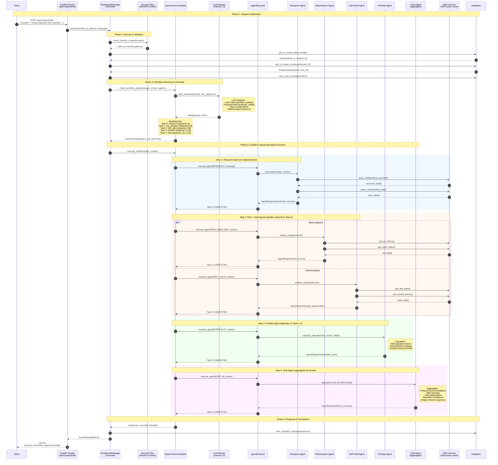
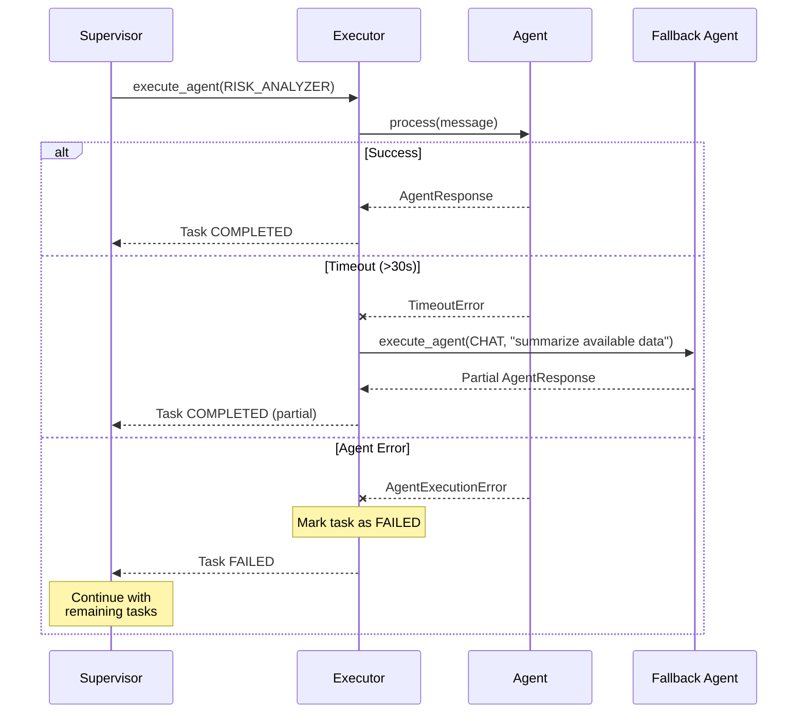

# Complex Multi-Agent Workflow Sequence Diagram

This document illustrates the sequence of operations when a user sends a complex request that requires coordination across multiple specialized AI agents.

## Example Scenario

**User Request:** "Create a balanced DeFi portfolio with $10,000, optimize for yield while managing risk"

This request triggers a complex workflow involving:
- **Research Agent**: Protocol discovery
- **Risk Analyzer Agent**: Risk assessment
- **DeFi Yield Agent**: Yield optimization
- **Portfolio Agent**: Allocation strategy
- **Chat Agent**: Final aggregation

---

## High-Level Architecture

```
┌─────────────┐     ┌─────────────────┐     ┌─────────────────────────┐
│   Client    │────▶│  FastAPI Router │────▶│  SendGuestMessage Cmd   │
└─────────────┘     └─────────────────┘     └───────────┬─────────────┘
                                                        │
                                                        ▼
                    ┌───────────────────────────────────────────────┐
                    │         SupervisorCoordinator                  │
                    │  ┌─────────────────────────────────────────┐  │
                    │  │  LLM Planning (Gemini/DeepInfra)        │  │
                    │  │  - Analyzes user intent                 │  │
                    │  │  - Creates WorkflowPlan                 │  │
                    │  │  - Determines agent dependencies        │  │
                    │  └─────────────────────────────────────────┘  │
                    └───────────────────┬───────────────────────────┘
                                        │
                    ┌───────────────────▼───────────────────┐
                    │         Agent Executor                 │
                    │  ┌─────┐ ┌─────┐ ┌─────┐ ┌─────┐     │
                    │  │Rsrch│ │Risk │ │Yield│ │Port │ ... │
                    │  └─────┘ └─────┘ └─────┘ └─────┘     │
                    └───────────────────────────────────────┘
```

---

## Detailed Sequence Diagram



---

## WorkflowPlan Data Structure

```json
{
  "tasks": [
    {
      "agent_type": "research",
      "task_description": "Find top DeFi protocols with highest TVL and best yields",
      "depends_on": [],
      "status": "completed",
      "execution_time_ms": 3200
    },
    {
      "agent_type": "risk_analyzer",
      "task_description": "Assess smart contract risks and protocol stability",
      "depends_on": [0],
      "status": "completed",
      "execution_time_ms": 2800
    },
    {
      "agent_type": "defi_yield",
      "task_description": "Analyze current APY rates and reward opportunities",
      "depends_on": [0],
      "status": "completed",
      "execution_time_ms": 2500
    },
    {
      "agent_type": "portfolio",
      "task_description": "Create optimal allocation balancing risk and yield",
      "depends_on": [1, 2],
      "status": "completed",
      "execution_time_ms": 1800
    },
    {
      "agent_type": "chat",
      "task_description": "Aggregate results into coherent recommendation",
      "depends_on": [0, 1, 2, 3],
      "status": "completed",
      "execution_time_ms": 1500
    }
  ],
  "execution_order": [0, 1, 2, 3, 4],
  "estimated_time_seconds": 50
}
```

---

## Agent Types Reference

### Core Agents (12)
| Agent | Purpose | Example Trigger |
|-------|---------|-----------------|
| `chat` | General conversation, off-topic handling | "Hello", "What can you do?" |
| `knowledge` | Educational content, Anvil features | "What is DeFi?", "How does staking work?" |
| `hunter_ai` | Market sentiment, price predictions | "BTC price prediction", "Market sentiment" |
| `research` | Protocol analysis, deep research | "Analyze Aave protocol" |
| `execution` | Transaction execution (Privy wallet) | "Swap 100 USDC for ETH" |
| `risk_analyzer` | Risk assessment, scoring | "Risk of lending on Compound" |
| `portfolio` | Portfolio optimization | "Optimize my portfolio" |
| `tax_optimizer` | Tax-loss harvesting | "Tax implications of selling" |
| `defi_yield` | Yield farming, APY analysis | "Best stablecoin yields" |
| `security_auditor` | Smart contract security | "Is this contract safe?" |
| `gas_optimizer` | Gas fee optimization | "Best time to transact" |
| `guest_auth` | Auth prompts for restricted features | (Auto-triggered for guests) |

### Enterprise Agents (8)
| Agent | Purpose |
|-------|---------|
| `compliance_monitor` | AML/KYC, regulatory compliance |
| `multisig_coordinator` | Multi-sig treasury management |
| `alert_monitoring` | Real-time alerts, anomaly detection |
| `crisis_manager` | Emergency response, circuit breaker |
| `bridge_crosschain` | L2, cross-chain operations |
| `lending_borrowing` | Leverage, collateral optimization |
| `nft_asset_manager` | NFT portfolio, valuation |
| `dao_governance` | Voting, proposals, delegation |

---

## Dependency Graph Visualization

```
                    ┌─────────────────┐
                    │   User Request  │
                    └────────┬────────┘
                             │
                             ▼
                    ┌─────────────────┐
                    │  Task 0:        │
                    │  RESEARCH       │ ◀── No dependencies
                    │  (3.2s)         │
                    └────────┬────────┘
                             │
              ┌──────────────┼──────────────┐
              │              │              │
              ▼              │              ▼
     ┌─────────────────┐    │     ┌─────────────────┐
     │  Task 1:        │    │     │  Task 2:        │
     │  RISK_ANALYZER  │◀───┴────▶│  DEFI_YIELD     │  Parallel execution
     │  (2.8s)         │          │  (2.5s)         │
     └────────┬────────┘          └────────┬────────┘
              │                            │
              └──────────────┬─────────────┘
                             │
                             ▼
                    ┌─────────────────┐
                    │  Task 3:        │
                    │  PORTFOLIO      │ ◀── Depends on [1,2]
                    │  (1.8s)         │
                    └────────┬────────┘
                             │
                             ▼
                    ┌─────────────────┐
                    │  Task 4:        │
                    │  CHAT           │ ◀── Aggregator (depends on all)
                    │  (1.5s)         │
                    └────────┬────────┘
                             │
                             ▼
                    ┌─────────────────┐
                    │  Final Response │
                    │  Total: ~11.8s  │
                    └─────────────────┘
```

---

## Error Handling Flow



---

## MCP Server Integration

The agents communicate with external data sources through MCP (Model Context Protocol) servers:

```
┌─────────────────────────────────────────────────────────────┐
│                     Agent Executor                           │
└─────────────────────────┬───────────────────────────────────┘
                          │
    ┌─────────────────────┼─────────────────────┐
    │                     │                     │
    ▼                     ▼                     ▼
┌─────────┐         ┌─────────┐          ┌─────────┐
│DeFiLlama│         │  Aave   │          │CoinGecko│
│Port 8082│         │Port 8085│          │Port 8084│
├─────────┤         ├─────────┤          ├─────────┤
│• TVL    │         │• Rates  │          │• Prices │
│• Proto  │         │• Health │          │• Markets│
│• Yields │         │• Reserve│          │• OHLCV  │
└─────────┘         └─────────┘          └─────────┘
    │                     │                     │
    └─────────────────────┼─────────────────────┘
                          │
                          ▼
              ┌───────────────────────┐
              │    Response Data      │
              │  (aggregated sources) │
              └───────────────────────┘
```

**Available MCP Servers:**
- Port 8081: 1inch DEX Aggregator
- Port 8082: DeFiLlama Analytics
- Port 8083: The Graph Subgraphs
- Port 8084: CoinGecko Market Data
- Port 8085: Aave Lending Protocol
- Port 8086: Portfolio Tracker
- Port 8087: Perplexity Research
- Port 8088: Morpho Lending
- Port 8089: Curve Finance
- Port 8090: Hyperliquid Perps
- Port 8091: LayerZero Bridge

---

## Response Structure

```json
{
  "routing": {
    "handler": "agent_squad_supervisor",
    "intent": "complex_workflow",
    "confidence": 0.95,
    "language": "en",
    "workflow_type": "multi_agent"
  },
  "enrichment": {
    "agents_used": ["research", "risk_analyzer", "defi_yield", "portfolio", "chat"],
    "execution_time_ms": 11800,
    "task_count": 5,
    "parallel_execution": true
  },
  "agent_message": {
    "content": "Based on my analysis of the DeFi ecosystem...\n\n**Recommended Portfolio Allocation:**\n- 40% Aave USDC lending (5.2% APY, Low Risk)\n- 30% Curve 3pool (8.1% APY, Medium Risk)\n- 20% GMX GLP (15% APY, Higher Risk)\n- 10% Reserve for gas/opportunities\n\n**Risk Assessment:**...",
    "sources": [
      {"type": "mcp_server", "name": "DeFiLlama", "data_type": "protocol_tvl"},
      {"type": "mcp_server", "name": "Aave", "data_type": "lending_rates"},
      {"type": "api", "name": "CoinGecko", "data_type": "price_data"}
    ]
  }
}
```

---

## Performance Metrics

| Metric | Single Agent | Multi-Agent (5) |
|--------|--------------|-----------------|
| Avg Response Time | 2-4s | 8-15s |
| LLM Calls | 1 | 2 (plan + aggregate) |
| MCP Queries | 1-3 | 5-12 |
| Parallel Efficiency | N/A | 40-60% time saved |

---

## Related Documentation

- [Agent Squad Architecture](./adr-002-agent-squad-llm-consolidation.md)
- [Prompt Injection Prevention](./prompt-injection-architecture.md)
- [Intent Detection](./INTENT_DETECTION_FIX_ANALYSIS.md)
- [Messaging System](./messaging-system-architecture.md)
