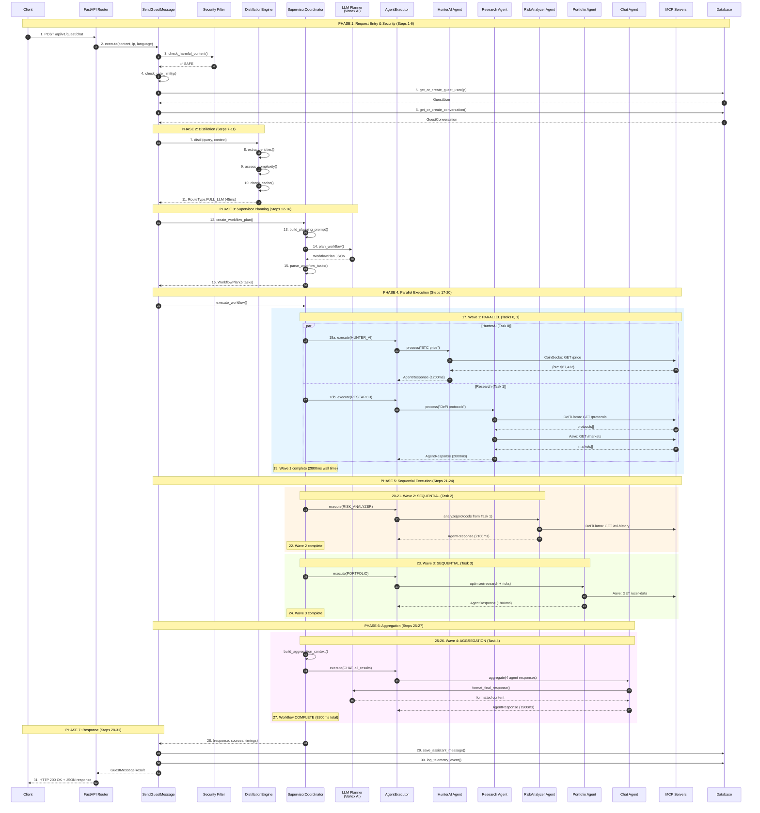

# Complete End-to-End Multi-Agent Workflow

## Real Case: "What's the BTC price and create a DeFi portfolio with $5000"

This document shows the complete numbered flow for a compound query that requires:
- **Price data** (Hunter AI agent)
- **Protocol research** (Research agent)
- **Risk analysis** (Risk Analyzer agent)  
- **Portfolio optimization** (Portfolio agent)
- **Response aggregation** (Chat agent)

---

## System Components

```
┌─────────────────────────────────────────────────────────────────────────────┐
│                              PRESENTATION LAYER                              │
│  ┌─────────────────────────────────────────────────────────────────────┐    │
│  │  FastAPI Router: POST /api/v1/guest/chat                            │    │
│  └─────────────────────────────────────────────────────────────────────┘    │
└─────────────────────────────────────────────────────────────────────────────┘
                                      │
                                      ▼
┌─────────────────────────────────────────────────────────────────────────────┐
│                              APPLICATION LAYER                               │
│  ┌─────────────────────────────────────────────────────────────────────┐    │
│  │  SendGuestMessage Command                                            │    │
│  │  ├── Security Filter (harmful content detection)                    │    │
│  │  ├── Rate Limiter (5000/hour, 10000/day)                           │    │
│  │  └── Guest User/Conversation Management                             │    │
│  └─────────────────────────────────────────────────────────────────────┘    │
└─────────────────────────────────────────────────────────────────────────────┘
                                      │
                                      ▼
┌─────────────────────────────────────────────────────────────────────────────┐
│                                DOMAIN LAYER                                  │
│  ┌──────────────────────┐  ┌──────────────────────────────────────────┐    │
│  │  DistillationEngine  │  │  SupervisorCoordinator                    │    │
│  │  ├── IntentClassifier│  │  ├── LLM Planner (Gemini 2.0 Flash)      │    │
│  │  ├── EntityExtractor │  │  ├── WorkflowPlan Builder                │    │
│  │  ├── CacheManager    │  │  ├── Parallel Task Executor              │    │
│  │  └── Router          │  │  └── Result Aggregator                   │    │
│  └──────────────────────┘  └──────────────────────────────────────────┘    │
│                                      │                                      │
│  ┌──────────────────────────────────────────────────────────────────────┐  │
│  │                         Agent Executor                                │  │
│  │  ┌────────┐ ┌────────┐ ┌────────┐ ┌──────────┐ ┌────────┐           │  │
│  │  │HunterAI│ │Research│ │  Risk  │ │Portfolio │ │  Chat  │  ...      │  │
│  │  └────────┘ └────────┘ └────────┘ └──────────┘ └────────┘           │  │
│  └──────────────────────────────────────────────────────────────────────┘  │
└─────────────────────────────────────────────────────────────────────────────┘
                                      │
                                      ▼
┌─────────────────────────────────────────────────────────────────────────────┐
│                            INFRASTRUCTURE LAYER                              │
│  ┌─────────────┐  ┌─────────────┐  ┌─────────────┐  ┌─────────────┐        │
│  │  LLM Gateway │  │ MCP Servers │  │  Database   │  │    Redis    │        │
│  │  (Vertex AI) │  │ (11 servers)│  │ (PostgreSQL)│  │   (Cache)   │        │
│  └─────────────┘  └─────────────┘  └─────────────┘  └─────────────┘        │
└─────────────────────────────────────────────────────────────────────────────┘
```

---

## Numbered Step-by-Step Flow

```
┌─────────────────────────────────────────────────────────────────────────────┐
│ USER REQUEST: "What's the BTC price and create a DeFi portfolio with $5000" │
└─────────────────────────────────────────────────────────────────────────────┘
```

### Phase 1: Request Entry & Security (Steps 1-6)

```
Step 1 ──────────────────────────────────────────────────────────────────────
│ CLIENT → FastAPI Router
│ POST /api/v1/guest/chat
│ Body: {"content": "What's the BTC price and create a DeFi portfolio with $5000", "language": "en"}
│ Headers: X-Forwarded-For: 192.168.1.100
└────────────────────────────────────────────────────────────────────────────

Step 2 ──────────────────────────────────────────────────────────────────────
│ Router → SendGuestMessage.execute()
│ Injects: guest_repository, distillation_engine, supervisor_coordinator
└────────────────────────────────────────────────────────────────────────────

Step 3 ──────────────────────────────────────────────────────────────────────
│ SECURITY FILTER: Check harmful content patterns
│ Patterns checked:
│   ✗ "avoid KYC", "bypass", "hack", "steal"
│   ✗ "ignore your policy", "jailbreak", "DAN mode"
│   ✗ "money laundering", "illegal", "scam"
│ Result: ✅ SAFE (no harmful patterns detected)
└────────────────────────────────────────────────────────────────────────────

Step 4 ──────────────────────────────────────────────────────────────────────
│ RATE LIMITER: Check IP limits
│ IP: 192.168.1.100
│ Messages this hour: 5 / 5000 limit
│ Messages today: 12 / 10000 limit
│ Result: ✅ ALLOWED
└────────────────────────────────────────────────────────────────────────────

Step 5 ──────────────────────────────────────────────────────────────────────
│ DATABASE: Get or create guest user
│ Query: SELECT * FROM guest_users WHERE ip_address = '192.168.1.100'
│ Result: GuestUser(id=uuid, ip='192.168.1.100', created_at=...)
└────────────────────────────────────────────────────────────────────────────

Step 6 ──────────────────────────────────────────────────────────────────────
│ DATABASE: Get or create conversation
│ Query: SELECT * FROM guest_conversations WHERE user_id = ? AND status = 'active'
│ Result: GuestConversation(id=uuid, user_id=uuid)
│ 
│ DATABASE: Save user message
│ INSERT INTO guest_messages (conversation_id, role, content, ...)
└────────────────────────────────────────────────────────────────────────────
```

### Phase 2: Distillation Engine (Steps 7-11)

```
Step 7 ──────────────────────────────────────────────────────────────────────
│ DISTILLATION ENGINE: Start processing
│ Input: "What's the BTC price and create a DeFi portfolio with $5000"
│ Timer: Start (for telemetry)
└────────────────────────────────────────────────────────────────────────────

Step 8 ──────────────────────────────────────────────────────────────────────
│ ENTITY EXTRACTOR: Extract tokens, protocols, amounts
│ Extracted:
│   tokens: ["BTC", "bitcoin"]
│   protocols: []
│   amounts: ["$5000", "5000"]
│   chains: []
└────────────────────────────────────────────────────────────────────────────

Step 9 ──────────────────────────────────────────────────────────────────────
│ COMPLEXITY ASSESSOR: Determine query complexity
│ Word count: 12 words
│ Multiple intents detected: YES (price + portfolio)
│ Result: ComplexityLevel.COMPLEX
└────────────────────────────────────────────────────────────────────────────

Step 10 ─────────────────────────────────────────────────────────────────────
│ CACHE MANAGER: Check for cached response
│ Cache key: distill:v2:a3f8c2e1d4b7...
│ Exact match: ❌ MISS
│ Semantic match: ❌ MISS
│ Result: No cache hit
└────────────────────────────────────────────────────────────────────────────

Step 11 ─────────────────────────────────────────────────────────────────────
│ DISTILLATION ROUTER: Route decision
│ Complexity: COMPLEX
│ Has entities: YES
│ Cache hit: NO
│ Decision: RouteType.FULL_LLM → Send to SupervisorCoordinator
│ 
│ Distillation timing: 45ms
└────────────────────────────────────────────────────────────────────────────
```

### Phase 3: Supervisor Planning (Steps 12-16)

```
Step 12 ─────────────────────────────────────────────────────────────────────
│ SUPERVISOR COORDINATOR: create_workflow_plan()
│ Available agents: [chat, hunter_ai, research, risk_analyzer, portfolio, 
│                    defi_yield, execution, security_auditor, ...]
└────────────────────────────────────────────────────────────────────────────

Step 13 ─────────────────────────────────────────────────────────────────────
│ LLM PLANNER: Build planning prompt
│ Model: Gemini 2.0 Flash (Vertex AI)
│ 
│ Prompt includes:
│ - User request analysis
│ - Available agents and capabilities
│ - Routing rules and examples
│ - Dependency planning instructions
└────────────────────────────────────────────────────────────────────────────

Step 14 ─────────────────────────────────────────────────────────────────────
│ LLM PLANNER: Call LLM for workflow planning
│ 
│ Request → Vertex AI API
│ Response (JSON):
│ {
│   "tasks": [
│     {"agent_type": "hunter_ai", "task_description": "Get BTC price", "depends_on": []},
│     {"agent_type": "research", "task_description": "Find top DeFi protocols", "depends_on": []},
│     {"agent_type": "risk_analyzer", "task_description": "Assess protocol risks", "depends_on": [1]},
│     {"agent_type": "portfolio", "task_description": "Create $5000 allocation", "depends_on": [1, 2]},
│     {"agent_type": "chat", "task_description": "Aggregate results", "depends_on": [0, 1, 2, 3]}
│   ]
│ }
│ 
│ Planning time: 850ms
└────────────────────────────────────────────────────────────────────────────

Step 15 ─────────────────────────────────────────────────────────────────────
│ WORKFLOW PLAN BUILDER: Parse LLM response
│ 
│ WorkflowPlan:
│ ┌─────────────────────────────────────────────────────────────────────┐
│ │ Task 0: HUNTER_AI    │ "Get BTC price"           │ depends: []     │
│ │ Task 1: RESEARCH     │ "Find top DeFi protocols" │ depends: []     │
│ │ Task 2: RISK_ANALYZER│ "Assess protocol risks"   │ depends: [1]    │
│ │ Task 3: PORTFOLIO    │ "Create $5000 allocation" │ depends: [1, 2] │
│ │ Task 4: CHAT         │ "Aggregate results"       │ depends: [0-3]  │
│ └─────────────────────────────────────────────────────────────────────┘
│ 
│ Execution order: [0, 1, 2, 3, 4]
│ Estimated time: 50 seconds
└────────────────────────────────────────────────────────────────────────────

Step 16 ─────────────────────────────────────────────────────────────────────
│ DEPENDENCY GRAPH ANALYSIS:
│ 
│         ┌───────────────┐     ┌───────────────┐
│         │ Task 0:       │     │ Task 1:       │
│         │ HUNTER_AI     │     │ RESEARCH      │  ← PARALLEL (no deps)
│         │ (BTC price)   │     │ (protocols)   │
│         └───────┬───────┘     └───────┬───────┘
│                 │                     │
│                 │                     ▼
│                 │             ┌───────────────┐
│                 │             │ Task 2:       │
│                 │             │ RISK_ANALYZER │  ← SEQUENTIAL (needs Task 1)
│                 │             │ (risk scores) │
│                 │             └───────┬───────┘
│                 │                     │
│                 │                     ▼
│                 │             ┌───────────────┐
│                 │             │ Task 3:       │
│                 │             │ PORTFOLIO     │  ← SEQUENTIAL (needs 1, 2)
│                 │             │ (allocation)  │
│                 │             └───────┬───────┘
│                 │                     │
│                 └──────────┬──────────┘
│                            ▼
│                    ┌───────────────┐
│                    │ Task 4: CHAT  │  ← FINAL AGGREGATOR (needs all)
│                    │ (summary)     │
│                    └───────────────┘
└────────────────────────────────────────────────────────────────────────────
```

### Phase 4: Parallel Agent Execution (Steps 17-20)

```
Step 17 ─────────────────────────────────────────────────────────────────────
│ EXECUTOR: Start parallel execution wave 1
│ Ready tasks: [Task 0 (HUNTER_AI), Task 1 (RESEARCH)]
│ 
│ ⚡ asyncio.gather() - Execute in parallel
└────────────────────────────────────────────────────────────────────────────

Step 18a ────────────────────────────────────────────────────────────────────
│ HUNTER_AI AGENT: Execute (parallel)
│ 
│ Input: "Get current BTC price"
│ 
│ Tools called:
│   1. CoinGecko MCP (port 8084): GET /simple/price?ids=bitcoin
│      Response: {"bitcoin": {"usd": 67432.50, "usd_24h_change": 2.3}}
│   
│   2. LLM Gateway (Vertex AI): Format response
│      Prompt: "Format BTC price data for user..."
│ 
│ Output: AgentResponse(
│   content="Bitcoin (BTC) is currently trading at $67,432.50 USD, up 2.3% in 24h",
│   sources=[{type: "api", name: "CoinGecko", data_type: "price"}],
│   tools_used=["coingecko_api", "llm_gateway"]
│ )
│ 
│ Execution time: 1,200ms
│ Status: ✅ COMPLETED
└────────────────────────────────────────────────────────────────────────────

Step 18b ────────────────────────────────────────────────────────────────────
│ RESEARCH AGENT: Execute (parallel)
│ 
│ Input: "Find top DeFi protocols for portfolio"
│ 
│ Tools called:
│   1. DeFiLlama MCP (port 8082): GET /protocols
│      Response: [{name: "Aave", tvl: 12.5B}, {name: "Lido", tvl: 28B}, ...]
│   
│   2. Aave MCP (port 8085): GET /markets
│      Response: [{asset: "USDC", apy: 5.2%}, {asset: "ETH", apy: 3.1%}, ...]
│   
│   3. LLM Gateway (Vertex AI): Analyze protocols
│      Prompt: "Analyze top DeFi protocols..."
│ 
│ Output: AgentResponse(
│   content="Top protocols by TVL: 1) Lido ($28B) - Liquid staking...",
│   sources=[{type: "mcp_server", name: "DeFiLlama"}, {type: "mcp_server", name: "Aave"}],
│   tools_used=["defillama_api", "aave_api", "llm_gateway"]
│ )
│ 
│ Execution time: 2,800ms
│ Status: ✅ COMPLETED
└────────────────────────────────────────────────────────────────────────────

Step 19 ─────────────────────────────────────────────────────────────────────
│ WAVE 1 COMPLETE
│ 
│ Completed: [Task 0 (HUNTER_AI), Task 1 (RESEARCH)]
│ Wall time: 2,800ms (parallel execution saved ~1,200ms)
│ 
│ Check ready tasks for wave 2...
│ Task 2 (RISK_ANALYZER): depends_on [1] → ✅ Ready (Task 1 complete)
│ Task 3 (PORTFOLIO): depends_on [1, 2] → ❌ Not ready (Task 2 pending)
│ Task 4 (CHAT): depends_on [0-3] → ❌ Not ready
└────────────────────────────────────────────────────────────────────────────

Step 20 ─────────────────────────────────────────────────────────────────────
│ EXECUTOR: Wave 2 - Sequential execution
│ Ready tasks: [Task 2 (RISK_ANALYZER)]
│ 
│ Single task - execute directly (no parallel)
└────────────────────────────────────────────────────────────────────────────
```

### Phase 5: Sequential Agent Execution (Steps 21-24)

```
Step 21 ─────────────────────────────────────────────────────────────────────
│ RISK_ANALYZER AGENT: Execute (sequential)
│ 
│ Input: Protocols from Task 1 (RESEARCH)
│ Context: ["Aave", "Lido", "Compound", "Curve"]
│ 
│ Tools called:
│   1. DeFiLlama MCP: GET /protocol/{name}/tvl-history
│      Analysis: TVL stability over 30 days
│   
│   2. Knowledge Base: Smart contract audit status
│      Query: "audit status for Aave, Lido, Compound"
│   
│   3. LLM Gateway (Vertex AI): Risk scoring
│      Prompt: "Assess risks for these protocols..."
│ 
│ Output: AgentResponse(
│   content="Risk Analysis:\n- Aave: LOW (audited, $12.5B TVL)\n- Lido: LOW...",
│   sources=[{type: "mcp_server", name: "DeFiLlama"}, {type: "knowledge_base"}],
│   tools_used=["defillama_api", "knowledge_base", "llm_gateway"]
│ )
│ 
│ Execution time: 2,100ms
│ Status: ✅ COMPLETED
└────────────────────────────────────────────────────────────────────────────

Step 22 ─────────────────────────────────────────────────────────────────────
│ WAVE 2 COMPLETE
│ 
│ Completed: [Task 0, Task 1, Task 2]
│ 
│ Check ready tasks for wave 3...
│ Task 3 (PORTFOLIO): depends_on [1, 2] → ✅ Ready (both complete)
│ Task 4 (CHAT): depends_on [0-3] → ❌ Not ready (Task 3 pending)
└────────────────────────────────────────────────────────────────────────────

Step 23 ─────────────────────────────────────────────────────────────────────
│ PORTFOLIO AGENT: Execute (sequential)
│ 
│ Input: Research (Task 1) + Risk scores (Task 2)
│ Budget: $5,000
│ 
│ Tools called:
│   1. Aave MCP (port 8085): GET /user-data (simulated)
│      Current yields and rates
│   
│   2. LLM Gateway (Vertex AI): Portfolio optimization
│      Prompt: "Create optimal allocation with $5000 across..."
│      Considers: Risk scores, APY, diversification
│ 
│ Output: AgentResponse(
│   content="Recommended Portfolio ($5,000):\n- 40% Aave USDC ($2,000) - 5.2% APY\n...",
│   sources=[{type: "mcp_server", name: "Aave"}],
│   tools_used=["aave_api", "llm_gateway"]
│ )
│ 
│ Execution time: 1,800ms
│ Status: ✅ COMPLETED
└────────────────────────────────────────────────────────────────────────────

Step 24 ─────────────────────────────────────────────────────────────────────
│ WAVE 3 COMPLETE
│ 
│ Completed: [Task 0, Task 1, Task 2, Task 3]
│ 
│ Check ready tasks for wave 4 (final)...
│ Task 4 (CHAT): depends_on [0-3] → ✅ Ready (all complete)
└────────────────────────────────────────────────────────────────────────────
```

### Phase 6: Aggregation (Steps 25-27)

```
Step 25 ─────────────────────────────────────────────────────────────────────
│ CHAT AGENT (AGGREGATOR): Execute
│ 
│ Input: Results from all previous agents
│ 
│ Aggregation context built:
│ ┌─────────────────────────────────────────────────────────────────────┐
│ │ Results from hunter_ai:                                             │
│ │ Bitcoin (BTC) is currently trading at $67,432.50 USD, up 2.3%...   │
│ │                                                                     │
│ │ Results from research:                                              │
│ │ Top protocols by TVL: 1) Lido ($28B) - Liquid staking...           │
│ │                                                                     │
│ │ Results from risk_analyzer:                                         │
│ │ Risk Analysis: - Aave: LOW (audited, $12.5B TVL)...                │
│ │                                                                     │
│ │ Results from portfolio:                                             │
│ │ Recommended Portfolio ($5,000): - 40% Aave USDC ($2,000)...        │
│ └─────────────────────────────────────────────────────────────────────┘
│ 
│ Task: "Aggregate and summarize results, remove duplicates, single disclaimer"
└────────────────────────────────────────────────────────────────────────────

Step 26 ─────────────────────────────────────────────────────────────────────
│ CHAT AGENT: LLM call for aggregation
│ 
│ LLM Gateway (Vertex AI):
│ Prompt: "Combine these agent responses into one coherent answer..."
│ 
│ Output: AgentResponse(
│   content="## Current Market & Portfolio Recommendation\n\n
│            **Bitcoin Price:** $67,432.50 USD (+2.3% 24h)\n\n
│            **Recommended DeFi Portfolio ($5,000):**\n
│            | Protocol | Allocation | Amount | APY | Risk |\n
│            |----------|------------|--------|-----|------|\n
│            | Aave USDC | 40% | $2,000 | 5.2% | Low |\n
│            | Lido stETH | 30% | $1,500 | 4.1% | Low |\n
│            | Curve 3pool | 20% | $1,000 | 8.3% | Medium |\n
│            | Reserve | 10% | $500 | - | - |\n\n
│            **Expected Annual Yield:** ~$280 (5.6% avg)\n\n
│            *Disclaimer: This is educational information...*",
│   sources=[...aggregated from all agents...],
│   tools_used=["llm_gateway"]
│ )
│ 
│ Execution time: 1,500ms
│ Status: ✅ COMPLETED
└────────────────────────────────────────────────────────────────────────────

Step 27 ─────────────────────────────────────────────────────────────────────
│ WORKFLOW COMPLETE
│ 
│ All tasks: ✅ COMPLETED
│ Failed tasks: 0
│ 
│ Timing Summary:
│ ┌─────────────────────────────────────────────────────────────────────┐
│ │ Wave 1 (parallel):                                                  │
│ │   - HUNTER_AI: 1,200ms                                             │
│ │   - RESEARCH: 2,800ms                                              │
│ │   Wall time: 2,800ms (saved 1,200ms)                               │
│ │                                                                     │
│ │ Wave 2 (sequential):                                                │
│ │   - RISK_ANALYZER: 2,100ms                                         │
│ │                                                                     │
│ │ Wave 3 (sequential):                                                │
│ │   - PORTFOLIO: 1,800ms                                             │
│ │                                                                     │
│ │ Wave 4 (aggregation):                                               │
│ │   - CHAT: 1,500ms                                                  │
│ │                                                                     │
│ │ TOTAL WORKFLOW: 8,200ms                                            │
│ │ (Sequential would be: 9,400ms - saved 13% with parallelization)    │
│ └─────────────────────────────────────────────────────────────────────┘
└────────────────────────────────────────────────────────────────────────────
```

### Phase 7: Response (Steps 28-31)

```
Step 28 ─────────────────────────────────────────────────────────────────────
│ COLLECT SOURCES: Aggregate from all agents
│ 
│ Sources:
│ [
│   {type: "api", name: "CoinGecko", data_type: "price"},
│   {type: "mcp_server", name: "DeFiLlama", data_type: "protocol_tvl"},
│   {type: "mcp_server", name: "Aave", data_type: "lending_rates"},
│   {type: "knowledge_base", data_type: "audit_status"}
│ ]
└────────────────────────────────────────────────────────────────────────────

Step 29 ─────────────────────────────────────────────────────────────────────
│ DATABASE: Save assistant message
│ 
│ INSERT INTO guest_messages (
│   conversation_id, role, content, intent, handler, 
│   confidence, language, metadata
│ )
│ VALUES (
│   uuid, 'assistant', '## Current Market & Portfolio...', 
│   'COMPLEX_WORKFLOW', 'agent_squad_supervisor',
│   0.95, 'en', {...agent_timings, sources...}
│ )
└────────────────────────────────────────────────────────────────────────────

Step 30 ─────────────────────────────────────────────────────────────────────
│ TELEMETRY: Log analytics event
│ 
│ Event: message_sent
│ Data: {
│   handler: "agent_squad_supervisor",
│   workflow_type: "multi_agent",
│   agents_used: ["hunter_ai", "research", "risk_analyzer", "portfolio", "chat"],
│   total_time_ms: 8200,
│   distillation_time_ms: 45,
│   planning_time_ms: 850,
│   parallel_savings_ms: 1200
│ }
└────────────────────────────────────────────────────────────────────────────

Step 31 ─────────────────────────────────────────────────────────────────────
│ RESPONSE: Return to client
│ 
│ HTTP 200 OK
│ 
│ {
│   "routing": {
│     "handler": "agent_squad_supervisor",
│     "intent": "COMPLEX_WORKFLOW",
│     "confidence": 0.95,
│     "language": "en",
│     "workflow_type": "multi_agent"
│   },
│   "enrichment": {
│     "agents_used": ["hunter_ai", "research", "risk_analyzer", "portfolio", "chat"],
│     "execution_time_ms": 8200,
│     "task_count": 5,
│     "parallel_execution": true,
│     "agent_timings": [
│       {"agent_type": "distillation", "execution_time_ms": 45},
│       {"agent_type": "hunter_ai", "execution_time_ms": 1200},
│       {"agent_type": "research", "execution_time_ms": 2800},
│       {"agent_type": "risk_analyzer", "execution_time_ms": 2100},
│       {"agent_type": "portfolio", "execution_time_ms": 1800},
│       {"agent_type": "chat", "execution_time_ms": 1500}
│     ]
│   },
│   "agent_message": {
│     "content": "## Current Market & Portfolio Recommendation\n\n...",
│     "sources": [...]
│   }
│ }
└────────────────────────────────────────────────────────────────────────────
```

---

## Complete Mermaid Sequence Diagram



---

## Timing Breakdown

| Phase | Component | Time (ms) | Notes |
|-------|-----------|-----------|-------|
| 1-6 | Security + DB | 50 | Fast path checks |
| 7-11 | **Distillation** | 45 | Entity extraction, cache check |
| 12-16 | **Supervisor Planning** | 850 | LLM call for workflow |
| 17-19 | **Wave 1 (Parallel)** | 2,800 | Hunter + Research |
| 20-22 | **Wave 2 (Sequential)** | 2,100 | Risk Analyzer |
| 23-24 | **Wave 3 (Sequential)** | 1,800 | Portfolio |
| 25-27 | **Wave 4 (Aggregation)** | 1,500 | Chat aggregator |
| 28-31 | Response + DB | 55 | Save + return |
| **TOTAL** | | **~9,200ms** | |

### Parallelization Savings

```
Sequential execution: 1,200 + 2,800 + 2,100 + 1,800 + 1,500 = 9,400ms
Parallel execution:   max(1,200, 2,800) + 2,100 + 1,800 + 1,500 = 8,200ms
                      ─────────────────
                      Saved: 1,200ms (13%)
```

---

## Agent Reference

### Core Agents Used in This Workflow

| Agent | Role | Data Sources | Avg Time |
|-------|------|--------------|----------|
| `hunter_ai` | Price data, sentiment | CoinGecko, RSS feeds | 1-2s |
| `research` | Protocol analysis | DeFiLlama, Aave, The Graph | 2-4s |
| `risk_analyzer` | Risk scoring | DeFiLlama, Knowledge Base | 2-3s |
| `portfolio` | Allocation optimization | Aave, internal calculations | 1-2s |
| `chat` | Aggregation, formatting | LLM Gateway | 1-2s |

### MCP Servers Used

| Port | Server | Data Type |
|------|--------|-----------|
| 8082 | DeFiLlama | Protocol TVL, yields |
| 8084 | CoinGecko | Token prices, market data |
| 8085 | Aave | Lending rates, positions |

---

## Error Handling

```
┌─────────────────────────────────────────────────────────────────────────────┐
│ If any agent fails:                                                         │
│                                                                             │
│ 1. Task marked as FAILED with error message                                 │
│ 2. Dependent tasks check if they can proceed with partial data              │
│ 3. Chat aggregator handles missing data gracefully                          │
│ 4. Response includes warning about incomplete data                          │
│                                                                             │
│ Example: If RISK_ANALYZER fails (timeout)                                   │
│ - PORTFOLIO proceeds with only RESEARCH data                                │
│ - CHAT aggregates available results + adds caveat                           │
│ - Response: "Note: Risk analysis unavailable, proceed with caution"         │
└─────────────────────────────────────────────────────────────────────────────┘
```

---

## Related Documentation

- [Distillation Engine](../../../src/app/domain/services/distillation/engine.py)
- [Supervisor Coordinator](../../../src/app/domain/services/agent_squad/supervisor_coordinator.py)
- [Agent Types](../../../src/app/domain/enums/agent_type.py)
- [Send Guest Message](../../../src/app/application/guest/commands/send_guest_message.py)
