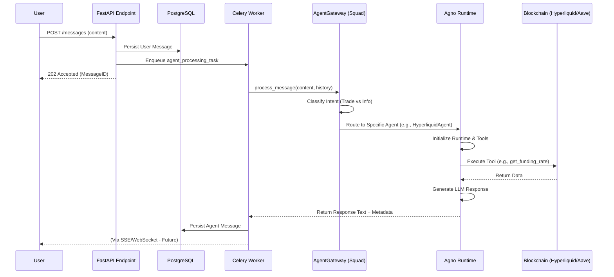

# Chat Feature & Agent Orchestration Specification

**Status**: DRAFT
**Owner**: CTO
**Date**: 2025-11-27

---

## 1. Executive Summary
This document specifies the end-to-end implementation of the **DeFi Multi-Agents Chat**. The system uses a **"Manager & Workers"** architecture:
- **The Manager (Router)**: `Agent Squad` (libs/agent-squad) responsible for intent classification and session context.
- **The Workers (Runtime)**: `Agno` (libs/agno) agents responsible for execution, RAG, and Blockchain interaction.
- **The Backbone**: `Celery` + `Redis` for asynchronous processing and reliability.

## 2. Architecture Flow



---

## 3. Application Layer (The API & Interactors)

### 3.1 Endpoints
- **`POST /api/v1/chat/conversations/{id}/messages`**
    - **Input**: `{ content: str }`
    - **Output**: `{ id: UUID, status: "processing", created_at: timestamp }`
    - **Logic**: Validates auth, loads conversation, persists user message, triggers Celery task.

- **`GET /api/v1/chat/conversations/{id}/messages`**
    - **Output**: List of messages (User + Agent).
    - **Logic**: Polling endpoint for MVP to check for agent replies.

### 3.2 Domain Entities
- **`Message`**: Enhanced with `status` (PENDING, PROCESSING, COMPLETED, FAILED) and `metadata` (for tool outputs/transaction payloads).

---

## 4. Infrastructure: The "Manager" (Agent Squad)

### 4.1 `AgentGatewayImpl`
A domain adapter implementing `AgentGateway`.
- **Responsibility**: Initialize `AgentSquad` orchestrator.
- **Storage**: Map `SQLChatStorage` to our `ConversationRepository`.
- **Configuration**:
    ```python
    # Intent Classifier Configuration
    classifiers = [
        DeFiIntentClassifier(
            intents=["trade_perp", "trade_spot", "lend_assets", "market_info"],
            model="gpt-4-turbo"
        )
    ]
    ```

---

## 5. Infrastructure: The "Workers" (Agno Agents)

We will implement specialized agents using `libs/agno`.

### 5.1 Hyperliquid Agent (Perps)
- **Role**: Trading Perpetual Futures on Hyperliquid L1.
- **Tools (MCP/Native)**:
    - `hl_get_positions(wallet)`: Fetch open positions.
    - `hl_get_funding(coin)`: Fetch current funding rates.
    - `hl_create_order(coin, is_buy, sz, limit_px)`: **Construct** an unsigned order payload.
- **Security**: The agent **NEVER** signs transactions. It returns a structured transaction payload (TOON/JSON) that the frontend uses to prompt the user's wallet.

### 5.2 Aave Agent (Lending)
- **Role**: Lending and Borrowing on Aave V3 (Arbitrum/Base).
- **Tools**:
    - `aave_get_user_data(wallet)`: Health factor, total collateral, total debt.
    - `aave_get_reserve_data(asset)`: Supply APY, Variable Borrow APY.
    - `aave_tx_supply(asset, amount)`: Construct `supply` calldata.

### 5.3 Research Agent (Market Data)
- **Role**: General market intelligence.
- **Tools**:
    - `defillama_tvl(protocol)`: Fetch TVL history.
    - `tavily_search(query)`: Web search for news.
    - `1inch_quote(src, dst, amount)`: Spot swap quotes.

---

## 6. Background Processing (Celery)

### 6.1 Task: `process_agent_response`
- **Trigger**: Called after User Message persistence.
- **Logic**:
    1.  **Hydrate Context**: Fetch last N messages using `ContextSerializer` (TOON format).
    2.  **Orchestrate**: Call `AgentGateway.process(content, context)`.
    3.  **Handle Tools**: If Agent returns a Transaction Payload, format it into a special `MessageMetadata` block.
    4.  **Persist**: Save the resulting Agent Message to DB.
    5.  **Notify**: (Future) Push to Redis PubSub for WebSocket delivery.

---

## 7. Integrations & Protocols

### 7.1 Hyperliquid (Python SDK)
We will build a custom `HyperliquidService` in `src/app/infrastructure/external/hyperliquid/`.
- **Authentication**: Read-only (Info API) requires no keys. Write (Exchange API) requires constructing EIP-712 signatures for the frontend.
- **Optimization**: Use `msgpack` for HLP API responses if available, or standard JSON.

### 7.2 Aave (Web3.py)
We will build `AaveService` in `src/app/infrastructure/external/aave/`.
- **RPC**: Use Alchemy/Infura (configured in `config.toml`).
- **ABIs**: Minimal ABIs for `Pool` and `PoolDataProvider` contracts.

---

## 8. Implementation Roadmap

### Phase 1: Core Pipeline (The Skeleton)
- [ ] **Entities**: Add `status` and `metadata` fields to `Message` table.
- [ ] **Celery**: Implement basic `process_agent_response` that simply echoes input.
- [ ] **API**: Wire up `POST /messages` to trigger Celery.

### Phase 2: The Manager (Squad)
- [ ] **Adapter**: Implement `AgentGatewayImpl` using `libs/agent-squad`.
- [ ] **Storage**: Implement `AnvilChatStorage` adapter.
- [ ] **Classifier**: Basic Intent Classification (Trade vs Chat).

### Phase 3: The Workers (Agno + Integrations)
- [ ] **Services**: Implement `HyperliquidService` and `AaveService` (Read-only first).
- [ ] **Tools**: Wrap services into Agno `Tools`.
- [ ] **Agents**: Configure `HyperliquidAgent` and `AaveAgent` in Agno.
- [ ] **Wiring**: Register Agents with Squad Router.

### Phase 4: Transaction Capability
- [ ] **Payloads**: Implement "Transaction Construction" tools.
- [ ] **Frontend Format**: Define standard JSON schema for passing unsigned TXs to client.
