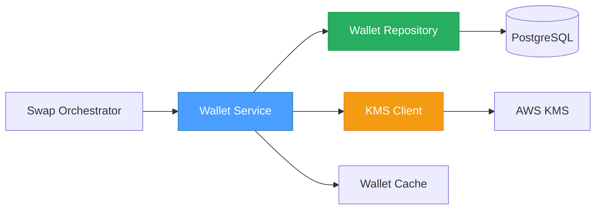
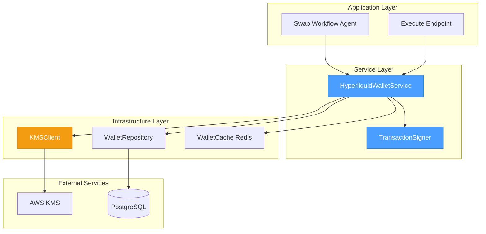
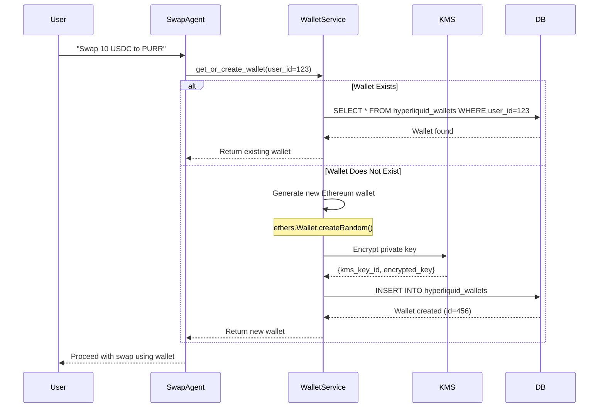
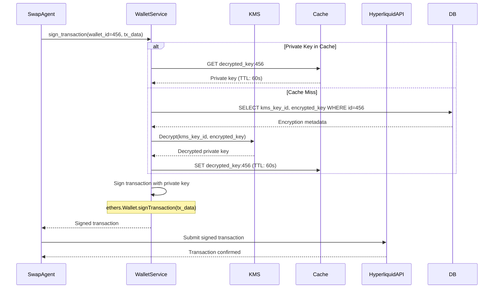
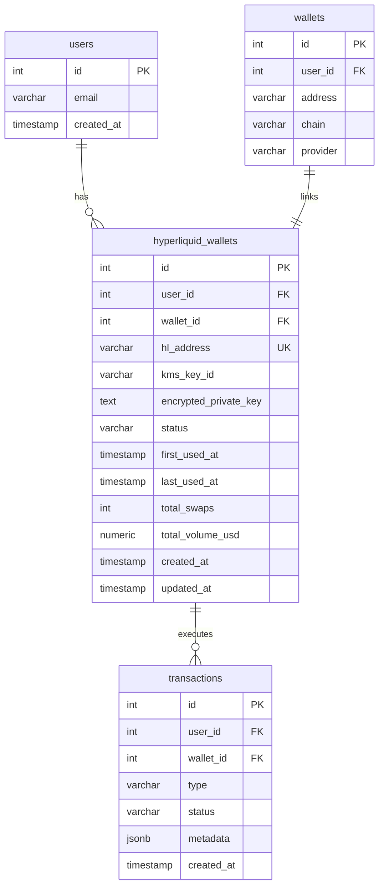

# 01 - Hyperliquid Wallet Management Specification

## 📋 Overview

### Purpose

This specification defines the wallet generation, storage, and lifecycle management system for Hyperliquid trading. Each user requires a dedicated Ethereum-compatible wallet to interact with Hyperliquid's Spot and Perps exchanges via their API.

### Scope

- **Ethereum wallet generation**: Create new wallets using ethers.js
- **AWS KMS integration**: Secure private key encryption/decryption
- **Database persistence**: Store wallet metadata and encrypted keys
- **Transaction signing**: Sign Hyperliquid API requests with user wallets
- **Wallet lifecycle**: Generation, activation, suspension, archival
- **Caching strategy**: Optimize wallet retrieval performance

### Key Objectives

1. ✅ Generate secure Ethereum wallets for users on demand
2. ✅ Protect private keys using AWS KMS envelope encryption
3. ✅ Enable server-side transaction signing (no frontend exposure)
4. ✅ Support one-wallet-per-user model (simplicity over complexity)
5. ✅ Provide audit trail for all wallet operations
6. ✅ Maintain high performance (< 100ms wallet retrieval)

### Component Relationships



---

## 🏗️ Architecture Design

### System Architecture



### Wallet Generation Flow



### Transaction Signing Flow



---

## 💾 Database Schema

### `hyperliquid_wallets` Table

```sql
CREATE TABLE hyperliquid_wallets (
    -- Primary Identity
    id SERIAL PRIMARY KEY,
    user_id INTEGER NOT NULL REFERENCES users(id) ON DELETE CASCADE,
    wallet_id INTEGER NOT NULL REFERENCES wallets(id) ON DELETE CASCADE,

    -- Hyperliquid-specific Data
    hl_address VARCHAR(42) NOT NULL UNIQUE,  -- Ethereum address (0x...)
    kms_key_id VARCHAR(255) NOT NULL,        -- AWS KMS key identifier
    encrypted_private_key TEXT NOT NULL,      -- AES-256 encrypted key
    derivation_path VARCHAR(100),             -- Optional: HD wallet path

    -- Status Management
    status VARCHAR(20) DEFAULT 'active',
    -- Status values: 'active', 'suspended', 'archived'

    -- Usage Tracking
    first_used_at TIMESTAMP,                 -- First swap timestamp
    last_used_at TIMESTAMP,                  -- Most recent swap
    total_swaps INTEGER DEFAULT 0,            -- Number of swaps executed
    total_volume_usd NUMERIC(20,2) DEFAULT 0, -- Cumulative volume

    -- Audit Timestamps
    created_at TIMESTAMP DEFAULT CURRENT_TIMESTAMP,
    updated_at TIMESTAMP DEFAULT CURRENT_TIMESTAMP,

    -- Constraints
    CONSTRAINT unique_user_hl_wallet UNIQUE(user_id),
    CONSTRAINT valid_status CHECK (status IN ('active', 'suspended', 'archived')),
    CONSTRAINT valid_address CHECK (hl_address ~ '^0x[a-fA-F0-9]{40}$')
);

-- Performance Indexes
CREATE INDEX idx_hl_wallets_user_id ON hyperliquid_wallets(user_id);
CREATE INDEX idx_hl_wallets_address ON hyperliquid_wallets(hl_address);
CREATE INDEX idx_hl_wallets_status ON hyperliquid_wallets(status);
CREATE INDEX idx_hl_wallets_last_used ON hyperliquid_wallets(last_used_at DESC);

-- Update trigger for updated_at
CREATE TRIGGER update_hl_wallets_updated_at
    BEFORE UPDATE ON hyperliquid_wallets
    FOR EACH ROW
    EXECUTE FUNCTION update_updated_at_column();
```

### Entity-Relationship Diagram



---

## 🔧 Implementation Details

### Core Service: `HyperliquidWalletService`

```python
# src/app/application/services/hyperliquid_wallet_service.py
from decimal import Decimal
from typing import Optional
from dataclasses import dataclass
from datetime import datetime, UTC

from eth_account import Account
from eth_typing import HexStr
from web3 import Web3


@dataclass
class HyperliquidWallet:
    """Domain model for Hyperliquid wallet."""
    id: int
    user_id: int
    wallet_id: int
    hl_address: str
    kms_key_id: str
    encrypted_private_key: str
    status: str
    first_used_at: Optional[datetime]
    last_used_at: Optional[datetime]
    total_swaps: int
    total_volume_usd: Decimal
    created_at: datetime
    updated_at: datetime


class HyperliquidWalletService:
    """
    Service for managing Hyperliquid wallets.

    Responsibilities:
    - Generate new Ethereum wallets
    - Encrypt/decrypt private keys via AWS KMS
    - Store wallet metadata in database
    - Sign transactions for Hyperliquid API
    - Manage wallet lifecycle (suspend, archive)
    """

    def __init__(
        self,
        wallet_repository: "WalletRepository",
        kms_client: "KMSClient",
        cache_client: "RedisClient",
    ):
        self._repository = wallet_repository
        self._kms = kms_client
        self._cache = cache_client
        self._cache_ttl = 60  # seconds

    async def get_or_create_wallet(
        self,
        user_id: int,
        wallet_id: int,
    ) -> HyperliquidWallet:
        """
        Get existing wallet or create new one for user.

        Args:
            user_id: User identifier
            wallet_id: Associated Privy wallet ID

        Returns:
            HyperliquidWallet instance

        Raises:
            WalletCreationError: If wallet generation fails
            KMSEncryptionError: If key encryption fails
        """
        # Check if wallet exists
        existing = await self._repository.get_by_user_id(user_id)
        if existing:
            return existing

        # Generate new wallet
        return await self.generate_wallet(user_id, wallet_id)

    async def generate_wallet(
        self,
        user_id: int,
        wallet_id: int,
    ) -> HyperliquidWallet:
        """
        Generate new Ethereum wallet and store securely.

        Process:
        1. Generate random Ethereum wallet (ethers.js equivalent)
        2. Encrypt private key with AWS KMS
        3. Store wallet metadata in database
        4. Return wallet instance

        Args:
            user_id: User identifier
            wallet_id: Associated Privy wallet ID

        Returns:
            Newly created HyperliquidWallet

        Raises:
            WalletCreationError: If generation fails
            KMSEncryptionError: If encryption fails
        """
        # Generate Ethereum wallet (equivalent to ethers.Wallet.createRandom())
        account = Account.create()
        private_key = account.key.hex()
        address = account.address

        # Encrypt private key with KMS
        kms_key_id, encrypted_key = await self._kms.encrypt_private_key(
            private_key=private_key,
            context={
                "user_id": str(user_id),
                "wallet_type": "hyperliquid",
                "created_at": datetime.now(UTC).isoformat(),
            }
        )

        # Store in database
        wallet = await self._repository.create(
            user_id=user_id,
            wallet_id=wallet_id,
            hl_address=address,
            kms_key_id=kms_key_id,
            encrypted_private_key=encrypted_key,
        )

        # Audit log
        await self._log_wallet_operation(
            operation="generate",
            user_id=user_id,
            wallet_id=wallet.id,
            address=address,
        )

        return wallet

    async def sign_transaction(
        self,
        wallet_id: int,
        tx_data: dict,
    ) -> str:
        """
        Sign Hyperliquid transaction with user's private key.

        Args:
            wallet_id: Hyperliquid wallet identifier
            tx_data: Transaction data to sign

        Returns:
            Hex-encoded signature

        Raises:
            WalletNotFoundError: If wallet doesn't exist
            KMSDecryptionError: If key decryption fails
            SigningError: If signature generation fails
        """
        # Get wallet metadata
        wallet = await self._repository.get_by_id(wallet_id)
        if not wallet:
            raise WalletNotFoundError(f"Wallet {wallet_id} not found")

        if wallet.status != "active":
            raise WalletSuspendedError(f"Wallet {wallet_id} is {wallet.status}")

        # Get decrypted private key (with caching)
        private_key = await self._get_decrypted_private_key(wallet)

        # Sign transaction
        account = Account.from_key(private_key)
        signature = account.sign_message(tx_data)

        # Update usage stats
        await self._update_wallet_usage(wallet_id)

        return signature.signature.hex()

    async def _get_decrypted_private_key(
        self,
        wallet: HyperliquidWallet,
    ) -> str:
        """
        Get decrypted private key with Redis caching.

        Cache key format: "hl_wallet_key:{wallet_id}"
        TTL: 60 seconds

        Args:
            wallet: HyperliquidWallet instance

        Returns:
            Decrypted private key (hex string)
        """
        cache_key = f"hl_wallet_key:{wallet.id}"

        # Try cache first
        cached_key = await self._cache.get(cache_key)
        if cached_key:
            return cached_key

        # Decrypt with KMS
        private_key = await self._kms.decrypt_private_key(
            kms_key_id=wallet.kms_key_id,
            encrypted_key=wallet.encrypted_private_key,
            context={
                "user_id": str(wallet.user_id),
                "wallet_type": "hyperliquid",
            }
        )

        # Cache for short duration
        await self._cache.set(
            key=cache_key,
            value=private_key,
            ttl=self._cache_ttl,
        )

        return private_key

    async def _update_wallet_usage(self, wallet_id: int) -> None:
        """Update last_used_at timestamp for wallet."""
        await self._repository.update(
            wallet_id=wallet_id,
            last_used_at=datetime.now(UTC),
        )

    async def suspend_wallet(
        self,
        wallet_id: int,
        reason: str,
    ) -> None:
        """
        Suspend wallet (security incident, user request).

        Args:
            wallet_id: Wallet to suspend
            reason: Suspension reason for audit log
        """
        await self._repository.update(
            wallet_id=wallet_id,
            status="suspended",
        )

        await self._log_wallet_operation(
            operation="suspend",
            wallet_id=wallet_id,
            metadata={"reason": reason},
        )

    async def _log_wallet_operation(
        self,
        operation: str,
        user_id: Optional[int] = None,
        wallet_id: Optional[int] = None,
        address: Optional[str] = None,
        metadata: Optional[dict] = None,
    ) -> None:
        """
        Log wallet operation to audit trail.

        IMPORTANT: Never log private keys or sensitive data.
        """
        # Implementation: Write to audit_logs table or CloudWatch
        pass
```

### AWS KMS Client

```python
# src/app/infrastructure/adapters/aws/kms_client.py
import base64
from typing import Tuple, Dict, Optional
import boto3
from botocore.exceptions import ClientError


class KMSClient:
    """
    AWS KMS client for private key encryption/decryption.

    Uses envelope encryption:
    1. Generate data key from KMS
    2. Encrypt private key with data key (AES-256)
    3. Store encrypted data key (not plain data key)
    4. For decryption, decrypt data key with KMS, then decrypt private key
    """

    def __init__(
        self,
        kms_key_alias: str = "alias/hyperliquid-wallets",
        region: str = "us-east-1",
    ):
        self._client = boto3.client("kms", region_name=region)
        self._key_alias = kms_key_alias

    async def encrypt_private_key(
        self,
        private_key: str,
        context: Dict[str, str],
    ) -> Tuple[str, str]:
        """
        Encrypt private key using AWS KMS.

        Args:
            private_key: Raw private key (hex string)
            context: Encryption context for audit

        Returns:
            Tuple of (kms_key_id, encrypted_private_key_base64)

        Raises:
            KMSEncryptionError: If encryption fails
        """
        try:
            # Encrypt with KMS
            response = self._client.encrypt(
                KeyId=self._key_alias,
                Plaintext=private_key.encode("utf-8"),
                EncryptionContext=context,
            )

            # Extract ciphertext and key ID
            encrypted_key = base64.b64encode(response["CiphertextBlob"]).decode("utf-8")
            kms_key_id = response["KeyId"]

            return kms_key_id, encrypted_key

        except ClientError as e:
            raise KMSEncryptionError(f"KMS encryption failed: {e}") from e

    async def decrypt_private_key(
        self,
        kms_key_id: str,
        encrypted_key: str,
        context: Dict[str, str],
    ) -> str:
        """
        Decrypt private key using AWS KMS.

        Args:
            kms_key_id: KMS key identifier
            encrypted_key: Base64-encoded encrypted key
            context: Encryption context (must match encryption)

        Returns:
            Decrypted private key (hex string)

        Raises:
            KMSDecryptionError: If decryption fails
        """
        try:
            # Decode base64
            ciphertext = base64.b64decode(encrypted_key)

            # Decrypt with KMS
            response = self._client.decrypt(
                CiphertextBlob=ciphertext,
                EncryptionContext=context,
            )

            # Extract plaintext
            private_key = response["Plaintext"].decode("utf-8")

            return private_key

        except ClientError as e:
            raise KMSDecryptionError(f"KMS decryption failed: {e}") from e

    async def rotate_key(self, old_kms_key_id: str) -> str:
        """
        Rotate KMS key (90-day policy).

        Args:
            old_kms_key_id: Current KMS key ID

        Returns:
            New KMS key ID
        """
        # Implementation: Create new key, re-encrypt all wallets
        pass


class KMSEncryptionError(Exception):
    """Raised when KMS encryption fails."""
    pass


class KMSDecryptionError(Exception):
    """Raised when KMS decryption fails."""
    pass
```

### Wallet Repository

```python
# src/app/infrastructure/persistence_sqla/repositories/hyperliquid_wallet_repository.py
from typing import Optional
from sqlalchemy import select, update
from sqlalchemy.ext.asyncio import AsyncSession

from app.domain.entities.hyperliquid_wallet import HyperliquidWallet


class HyperliquidWalletRepository:
    """Repository for Hyperliquid wallet persistence."""

    def __init__(self, session: AsyncSession):
        self._session = session

    async def create(
        self,
        user_id: int,
        wallet_id: int,
        hl_address: str,
        kms_key_id: str,
        encrypted_private_key: str,
    ) -> HyperliquidWallet:
        """Create new Hyperliquid wallet."""
        stmt = insert(hyperliquid_wallets).values(
            user_id=user_id,
            wallet_id=wallet_id,
            hl_address=hl_address,
            kms_key_id=kms_key_id,
            encrypted_private_key=encrypted_private_key,
            status="active",
        ).returning(hyperliquid_wallets)

        result = await self._session.execute(stmt)
        await self._session.commit()

        return result.scalar_one()

    async def get_by_user_id(self, user_id: int) -> Optional[HyperliquidWallet]:
        """Get wallet by user ID."""
        stmt = select(hyperliquid_wallets).where(
            hyperliquid_wallets.c.user_id == user_id
        )

        result = await self._session.execute(stmt)
        return result.scalar_one_or_none()

    async def get_by_id(self, wallet_id: int) -> Optional[HyperliquidWallet]:
        """Get wallet by ID."""
        stmt = select(hyperliquid_wallets).where(
            hyperliquid_wallets.c.id == wallet_id
        )

        result = await self._session.execute(stmt)
        return result.scalar_one_or_none()

    async def update(self, wallet_id: int, **kwargs) -> None:
        """Update wallet fields."""
        stmt = update(hyperliquid_wallets).where(
            hyperliquid_wallets.c.id == wallet_id
        ).values(**kwargs)

        await self._session.execute(stmt)
        await self._session.commit()
```

---

## 🧪 Test Cases

### Unit Tests

```python
# tests/unit/services/test_hyperliquid_wallet_service.py
import pytest
from unittest.mock import AsyncMock, MagicMock
from decimal import Decimal

from app.application.services.hyperliquid_wallet_service import (
    HyperliquidWalletService,
    HyperliquidWallet,
)


@pytest.fixture
def wallet_service():
    """Create wallet service with mocked dependencies."""
    repository = AsyncMock()
    kms_client = AsyncMock()
    cache_client = AsyncMock()

    return HyperliquidWalletService(
        wallet_repository=repository,
        kms_client=kms_client,
        cache_client=cache_client,
    )


@pytest.mark.asyncio
async def test_generate_wallet_creates_valid_ethereum_address(wallet_service):
    """Test that generated wallet has valid Ethereum address format."""
    # Arrange
    user_id = 123
    wallet_id = 456
    wallet_service._kms.encrypt_private_key = AsyncMock(
        return_value=("kms-key-123", "encrypted-key-base64")
    )
    wallet_service._repository.create = AsyncMock(
        return_value=HyperliquidWallet(
            id=1,
            user_id=user_id,
            wallet_id=wallet_id,
            hl_address="0x1234567890abcdef1234567890abcdef12345678",
            kms_key_id="kms-key-123",
            encrypted_private_key="encrypted-key-base64",
            status="active",
            first_used_at=None,
            last_used_at=None,
            total_swaps=0,
            total_volume_usd=Decimal("0"),
            created_at=datetime.now(UTC),
            updated_at=datetime.now(UTC),
        )
    )

    # Act
    wallet = await wallet_service.generate_wallet(user_id, wallet_id)

    # Assert
    assert wallet.hl_address.startswith("0x")
    assert len(wallet.hl_address) == 42
    assert wallet.status == "active"
    wallet_service._kms.encrypt_private_key.assert_called_once()


@pytest.mark.asyncio
async def test_get_or_create_wallet_returns_existing(wallet_service):
    """Test that get_or_create returns existing wallet without creating new."""
    # Arrange
    user_id = 123
    existing_wallet = HyperliquidWallet(
        id=1,
        user_id=user_id,
        wallet_id=456,
        hl_address="0xexisting...",
        kms_key_id="kms-key-123",
        encrypted_private_key="encrypted-key",
        status="active",
        first_used_at=None,
        last_used_at=None,
        total_swaps=0,
        total_volume_usd=Decimal("0"),
        created_at=datetime.now(UTC),
        updated_at=datetime.now(UTC),
    )
    wallet_service._repository.get_by_user_id = AsyncMock(return_value=existing_wallet)

    # Act
    wallet = await wallet_service.get_or_create_wallet(user_id, 456)

    # Assert
    assert wallet.id == existing_wallet.id
    assert wallet.hl_address == existing_wallet.hl_address
    wallet_service._repository.create.assert_not_called()


@pytest.mark.asyncio
async def test_sign_transaction_produces_valid_signature(wallet_service):
    """Test that transaction signing produces valid signature."""
    # Arrange
    wallet = HyperliquidWallet(...)
    wallet_service._repository.get_by_id = AsyncMock(return_value=wallet)
    wallet_service._get_decrypted_private_key = AsyncMock(
        return_value="0xprivatekey123..."
    )

    tx_data = {"action": "spotOrder", "amount": "10.0"}

    # Act
    signature = await wallet_service.sign_transaction(wallet.id, tx_data)

    # Assert
    assert signature.startswith("0x")
    assert len(signature) == 132  # 66 bytes * 2 hex chars
    wallet_service._repository.update.assert_called_once()  # last_used_at update


@pytest.mark.asyncio
async def test_kms_encryption_decryption_round_trip():
    """Test that KMS encrypt->decrypt returns original key."""
    # Arrange
    kms_client = KMSClient(kms_key_alias="alias/test")
    original_key = "0x1234567890abcdef1234567890abcdef12345678"
    context = {"user_id": "123", "wallet_type": "hyperliquid"}

    # Act
    kms_key_id, encrypted_key = await kms_client.encrypt_private_key(
        private_key=original_key,
        context=context,
    )
    decrypted_key = await kms_client.decrypt_private_key(
        kms_key_id=kms_key_id,
        encrypted_key=encrypted_key,
        context=context,
    )

    # Assert
    assert decrypted_key == original_key


@pytest.mark.asyncio
async def test_wallet_retrieval_uses_cache(wallet_service):
    """Test that decrypted keys are cached."""
    # Arrange
    wallet = HyperliquidWallet(...)
    wallet_service._cache.get = AsyncMock(return_value="cached-key-123")

    # Act
    key = await wallet_service._get_decrypted_private_key(wallet)

    # Assert
    assert key == "cached-key-123"
    wallet_service._kms.decrypt_private_key.assert_not_called()
```

### Integration Tests

```python
# tests/integration/test_wallet_service_integration.py
import pytest
from decimal import Decimal

from app.application.services.hyperliquid_wallet_service import HyperliquidWalletService
from tests.factories import UserFactory


@pytest.mark.integration
@pytest.mark.asyncio
async def test_create_wallet_end_to_end(db_session, kms_client, redis_client):
    """Test complete wallet creation flow with real dependencies."""
    # Arrange
    user = UserFactory.create()
    service = HyperliquidWalletService(
        wallet_repository=WalletRepository(db_session),
        kms_client=kms_client,
        cache_client=redis_client,
    )

    # Act
    wallet = await service.generate_wallet(user.id, user.wallets[0].id)

    # Assert
    assert wallet.id is not None
    assert wallet.hl_address.startswith("0x")

    # Verify database persistence
    db_wallet = await db_session.execute(
        select(hyperliquid_wallets).where(hyperliquid_wallets.c.id == wallet.id)
    )
    assert db_wallet is not None

    # Verify KMS encryption (cannot decrypt without proper context)
    with pytest.raises(KMSDecryptionError):
        await kms_client.decrypt_private_key(
            kms_key_id=wallet.kms_key_id,
            encrypted_key=wallet.encrypted_private_key,
            context={"invalid": "context"},
        )
```

---

## 🔐 Security Considerations

### Private Key Protection

1. **Never log private keys**: Ensure logging filters redact sensitive data
2. **KMS encryption context**: Include user_id, wallet_type for audit trail
3. **Cache TTL**: Limit decrypted key cache to 60 seconds
4. **Memory cleanup**: Explicitly clear private keys from memory after use

```python
# Example: Secure memory cleanup
import gc

private_key = await self._get_decrypted_private_key(wallet)
try:
    signature = sign_transaction(private_key, tx_data)
finally:
    # Overwrite variable
    private_key = None
    # Force garbage collection
    gc.collect()
```

### AWS KMS Configuration

**IAM Policy for Backend Service**:
```json
{
  "Version": "2012-10-17",
  "Statement": [
    {
      "Effect": "Allow",
      "Action": [
        "kms:Decrypt",
        "kms:Encrypt",
        "kms:GenerateDataKey"
      ],
      "Resource": "arn:aws:kms:us-east-1:ACCOUNT_ID:key/KEY_ID",
      "Condition": {
        "StringEquals": {
          "kms:EncryptionContext:wallet_type": "hyperliquid"
        }
      }
    }
  ]
}
```

### Key Rotation Policy

- **Rotation frequency**: Every 90 days
- **Process**:
  1. Create new KMS key
  2. For each wallet: Decrypt with old key → Encrypt with new key
  3. Update `kms_key_id` in database
  4. Disable old KMS key (do not delete for audit)

### Audit Logging

**Log all wallet operations**:
- Wallet generation (who, when, address)
- Transaction signing (wallet_id, tx_hash, timestamp)
- Wallet suspension (reason, operator)
- Key rotation events

**Example audit log entry**:
```json
{
  "timestamp": "2026-02-04T10:30:00Z",
  "operation": "wallet_generate",
  "user_id": 123,
  "wallet_id": 456,
  "hl_address": "0x1234...5678",
  "ip_address": "192.168.1.100",
  "user_agent": "Hunter-AI-Backend/1.0"
}
```

---

## 📊 Performance Benchmarks

### Target SLAs

| Operation | Target | Acceptable | Unacceptable |
|-----------|--------|------------|--------------|
| Wallet generation | < 100ms | < 500ms | > 1s |
| Wallet retrieval (cache hit) | < 10ms | < 50ms | > 100ms |
| Wallet retrieval (cache miss) | < 100ms | < 300ms | > 500ms |
| Transaction signing (cached key) | < 50ms | < 200ms | > 500ms |
| KMS encryption | < 50ms | < 200ms | > 500ms |
| KMS decryption | < 50ms | < 200ms | > 500ms |

### Optimization Strategies

1. **Redis caching**: Cache decrypted keys for 60 seconds
2. **Connection pooling**: Reuse database connections
3. **Batch operations**: Generate multiple wallets in parallel if needed
4. **Lazy loading**: Only decrypt keys when signing required

### Cost Analysis

**Per wallet per month**:
- KMS operations (10 swaps/month): $0.001
- Database storage: $0.0001
- Redis cache: $0.0001
- **Total**: ~$0.0012 per active wallet per month

**At scale** (10,000 active users):
- Monthly KMS costs: $10
- Database storage: $1
- Redis cache: $1
- **Total**: ~$12/month

---

## 🔗 References

### Related Code Files

- **Swap Workflow Agent**: `src/app/infrastructure/adapters/agent_squad/agents/workflows/swap_workflow_agent.py:331-1630`
- **Transaction Entity**: `src/app/domain/entities/transaction.py`
- **Existing Wallet System**: `src/app/infrastructure/persistence_sqla/mappings/wallet.py`

### External Documentation

- **Hyperliquid API**: https://hyperliquid.gitbook.io/hyperliquid-docs/for-developers/api
- **AWS KMS Envelope Encryption**: https://docs.aws.amazon.com/kms/latest/developerguide/concepts.html#enveloping
- **ethers.js Wallet**: https://docs.ethers.org/v6/api/wallet/

### Related Specifications

- [02_LIFI_BRIDGE_EXECUTION_SPEC.md](./02_LIFI_BRIDGE_EXECUTION_SPEC.md) - Uses wallets for signing
- [06_END_TO_END_INTEGRATION_SPEC.md](./06_END_TO_END_INTEGRATION_SPEC.md) - Orchestrates wallet usage

---

## ✅ Implementation Checklist

- [ ] Create `hyperliquid_wallets` table migration
- [ ] Implement `HyperliquidWalletService`
- [ ] Implement `KMSClient` with envelope encryption
- [ ] Implement `HyperliquidWalletRepository`
- [ ] Add Redis caching for decrypted keys
- [ ] Write unit tests (8 test cases)
- [ ] Write integration tests (2 test scenarios)
- [ ] Configure AWS KMS key and IAM policies
- [ ] Set up audit logging
- [ ] Add monitoring dashboards (wallet generation rate, KMS latency)
- [ ] Document key rotation procedure
- [ ] Security review and penetration testing

---

**Document Version**: 1.0
**Last Updated**: 2026-02-04
**Status**: ✅ Ready for Implementation
**Estimated Implementation Time**: 4 hours
