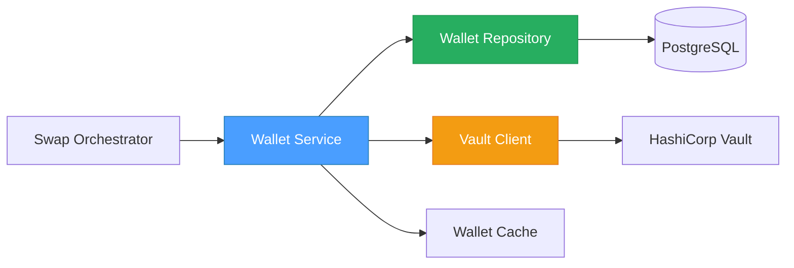
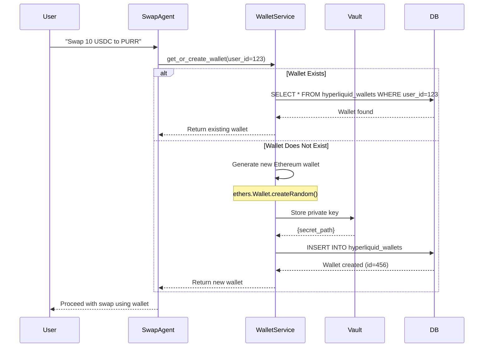
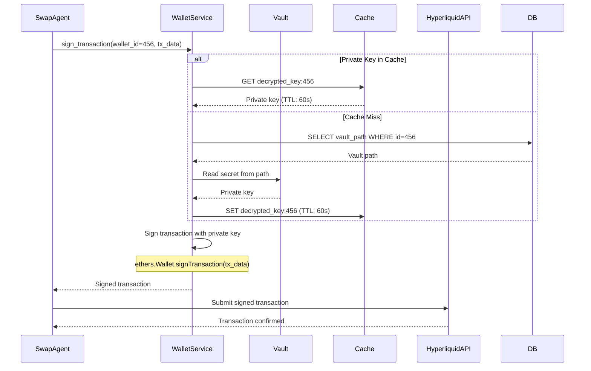
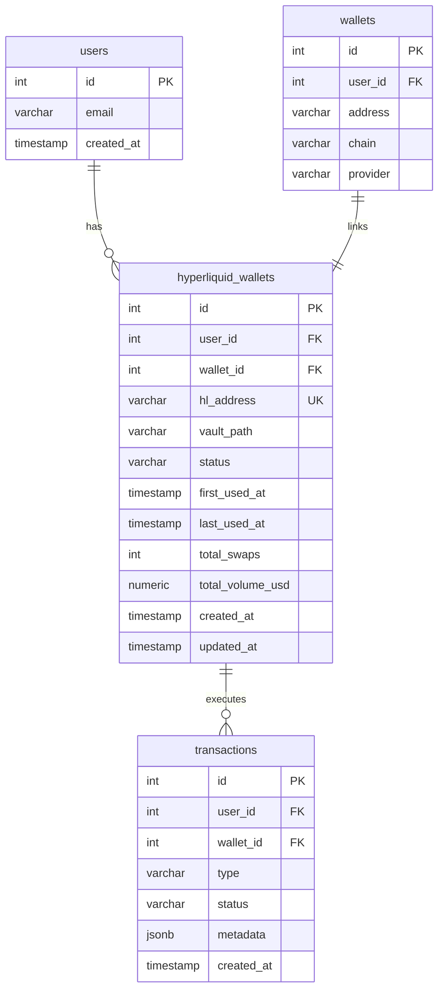

# 01 - Hyperliquid Wallet Management Specification

## 📋 Overview

### Purpose

This specification defines the wallet generation, storage, and lifecycle management system for Hyperliquid trading. Each user requires a dedicated Ethereum-compatible wallet to interact with Hyperliquid's Spot and Perps exchanges via their API.

### Scope

- **Ethereum wallet generation**: Create new wallets using ethers.js
- **HashiCorp Vault integration**: Secure private key encryption/decryption
- **Database persistence**: Store wallet metadata and encrypted keys
- **Transaction signing**: Sign Hyperliquid API requests with user wallets
- **Wallet lifecycle**: Generation, activation, suspension, archival
- **Caching strategy**: Optimize wallet retrieval performance

### Key Objectives

1. ✅ Generate secure Ethereum wallets for users on demand
2. ✅ Protect private keys using HashiCorp Vault
3. ✅ Enable server-side transaction signing (no frontend exposure)
4. ✅ Support one-wallet-per-user model (simplicity over complexity)
5. ✅ Provide audit trail for all wallet operations
6. ✅ Maintain high performance (< 100ms wallet retrieval)

### Component Relationships



---

## 🏗️ Architecture Design

### System Architecture


### Wallet Generation Flow



### Transaction Signing Flow



---

## 🚀 HashiCorp Vault Setup

### Local Development Setup (2 minutes)

#### 1. Install Vault

```bash
# MacOS
brew install vault

# Ubuntu/Debian  
wget https://releases.hashicorp.com/vault/1.17.0/vault_1.17.0_linux_amd64.zip
unzip vault_1.17.0_linux_amd64.zip
sudo mv vault /usr/local/bin/

# Verify
vault --version
```

#### 2. Start Vault DEV Mode (Terminal 1)

```bash
# SUPERSIMPLE - 1 command
vault server -dev

# Output:
# ==> Vault server configuration:
# API Address: http://127.0.0.1:8200
# Root Token: hvs.ey... (COPY THIS!)
# Unseal Key: xxxx.xxxx... (COPY THIS!)
```

#### 3. Configure Client (Terminal 2)

```bash
export VAULT_ADDR='http://127.0.0.1:8200'
export VAULT_TOKEN='hvs.ey...'  # The root token from step 2
vault status  # ✅ Should show "Active"
```

#### 4. Create Secret Engine for Hyperliquid

```bash
# Enable KV v2 secrets engine
vault secrets enable -path=hyperliquid kv-v2

# Test: Store a private key
vault kv put hyperliquid/user123 \
  private_key="0xabc123privatekey..."

# Verify
vault kv get hyperliquid/user123
```

### Production Setup

For production, use:
- **Vault Enterprise** or **HCP Vault** (managed service)
- **Auto-unseal** with cloud KMS (AWS KMS, GCP KMS, Azure Key Vault)
- **HA mode** with Consul or Raft storage
- **TLS everywhere**
- **AppRole authentication** for backend services

---

## 💾 Database Schema

### `hyperliquid_wallets` Table

```sql
CREATE TABLE hyperliquid_wallets (
    -- Primary Identity
    id SERIAL PRIMARY KEY,
    user_id INTEGER NOT NULL REFERENCES users(id) ON DELETE CASCADE,
    wallet_id INTEGER NOT NULL REFERENCES wallets(id) ON DELETE CASCADE,

    -- Hyperliquid-specific Data
    hl_address VARCHAR(42) NOT NULL UNIQUE,  -- Ethereum address (0x...)
    vault_path VARCHAR(255) NOT NULL,         -- HashiCorp Vault secret path

    -- Status Management
    status VARCHAR(20) DEFAULT 'active',
    -- Status values: 'active', 'suspended', 'archived'

    -- Usage Tracking
    first_used_at TIMESTAMP,                 -- First swap timestamp
    last_used_at TIMESTAMP,                  -- Most recent swap
    total_swaps INTEGER DEFAULT 0,            -- Number of swaps executed
    total_volume_usd NUMERIC(20,2) DEFAULT 0, -- Cumulative volume

    -- Audit Timestamps
    created_at TIMESTAMP DEFAULT CURRENT_TIMESTAMP,
    updated_at TIMESTAMP DEFAULT CURRENT_TIMESTAMP,

    -- Constraints
    CONSTRAINT unique_user_hl_wallet UNIQUE(user_id),
    CONSTRAINT valid_status CHECK (status IN ('active', 'suspended', 'archived')),
    CONSTRAINT valid_address CHECK (hl_address ~ '^0x[a-fA-F0-9]{40}$')
);

-- Performance Indexes
CREATE INDEX idx_hl_wallets_user_id ON hyperliquid_wallets(user_id);
CREATE INDEX idx_hl_wallets_address ON hyperliquid_wallets(hl_address);
CREATE INDEX idx_hl_wallets_status ON hyperliquid_wallets(status);
CREATE INDEX idx_hl_wallets_last_used ON hyperliquid_wallets(last_used_at DESC);

-- Update trigger for updated_at
CREATE TRIGGER update_hl_wallets_updated_at
    BEFORE UPDATE ON hyperliquid_wallets
    FOR EACH ROW
    EXECUTE FUNCTION update_updated_at_column();
```

### Entity-Relationship Diagram



---

## 🔧 Implementation Details

### HashiCorp Vault Client

```python
# src/app/infrastructure/adapters/vault/vault_client.py
import logging
from typing import Optional, Dict
import hvac
from hvac.exceptions import VaultError

logger = logging.getLogger(__name__)


class VaultClient:
    """
    HashiCorp Vault client for private key storage.

    Uses KV v2 secrets engine for:
    - Storing encrypted private keys
    - Retrieving keys for transaction signing
    - Version history for audit trail
    """

    def __init__(
        self,
        vault_addr: str = "http://127.0.0.1:8200",
        vault_token: Optional[str] = None,
        mount_point: str = "hyperliquid",
    ):
        self._client = hvac.Client(
            url=vault_addr,
            token=vault_token,
        )
        self._mount_point = mount_point
        
        if not self._client.is_authenticated():
            raise VaultAuthenticationError("Vault authentication failed")

    async def store_private_key(
        self,
        user_id: int,
        private_key: str,
        metadata: Optional[Dict[str, str]] = None,
    ) -> str:
        """
        Store private key in Vault.

        Args:
            user_id: User identifier (used in path)
            private_key: Raw private key (hex string)
            metadata: Optional metadata for audit

        Returns:
            Vault secret path

        Raises:
            VaultStorageError: If storage fails
        """
        try:
            path = f"user_{user_id}"
            
            self._client.secrets.kv.v2.create_or_update_secret(
                mount_point=self._mount_point,
                path=path,
                secret={
                    "private_key": private_key,
                    "created_by": "hyperliquid_wallet_service",
                    **(metadata or {}),
                },
            )

            logger.info(f"Stored private key for user {user_id} at {self._mount_point}/{path}")
            return f"{self._mount_point}/{path}"

        except VaultError as e:
            logger.error(f"Failed to store private key: {e}")
            raise VaultStorageError(f"Vault storage failed: {e}") from e

    async def get_private_key(
        self,
        user_id: int,
    ) -> str:
        """
        Retrieve private key from Vault.

        Args:
            user_id: User identifier

        Returns:
            Decrypted private key (hex string)

        Raises:
            VaultRetrievalError: If retrieval fails
        """
        try:
            path = f"user_{user_id}"
            
            response = self._client.secrets.kv.v2.read_secret_version(
                mount_point=self._mount_point,
                path=path,
            )

            private_key = response["data"]["data"]["private_key"]
            return private_key

        except VaultError as e:
            logger.error(f"Failed to retrieve private key: {e}")
            raise VaultRetrievalError(f"Vault retrieval failed: {e}") from e

    async def delete_private_key(
        self,
        user_id: int,
    ) -> None:
        """
        Permanently delete private key (use with caution).

        Args:
            user_id: User identifier
        """
        try:
            path = f"user_{user_id}"
            
            # Soft delete (preserves versions)
            self._client.secrets.kv.v2.delete_latest_version_of_secret(
                mount_point=self._mount_point,
                path=path,
            )
            
            logger.warning(f"Deleted private key for user {user_id}")

        except VaultError as e:
            logger.error(f"Failed to delete private key: {e}")
            raise VaultDeletionError(f"Vault deletion failed: {e}") from e


class VaultAuthenticationError(Exception):
    """Raised when Vault authentication fails."""
    pass


class VaultStorageError(Exception):
    """Raised when Vault storage fails."""
    pass


class VaultRetrievalError(Exception):
    """Raised when Vault retrieval fails."""
    pass


class VaultDeletionError(Exception):
    """Raised when Vault deletion fails."""
    pass
```

### Core Service: `HyperliquidWalletService`

```python
# src/app/application/services/hyperliquid_wallet_service.py
from decimal import Decimal
from typing import Optional
from dataclasses import dataclass
from datetime import datetime, UTC

from eth_account import Account


@dataclass
class HyperliquidWallet:
    """Domain model for Hyperliquid wallet."""
    id: int
    user_id: int
    wallet_id: int
    hl_address: str
    vault_path: str
    status: str
    first_used_at: Optional[datetime]
    last_used_at: Optional[datetime]
    total_swaps: int
    total_volume_usd: Decimal
    created_at: datetime
    updated_at: datetime


class HyperliquidWalletService:
    """
    Service for managing Hyperliquid wallets.

    Responsibilities:
    - Generate new Ethereum wallets
    - Store/retrieve private keys via HashiCorp Vault
    - Store wallet metadata in database
    - Sign transactions for Hyperliquid API
    - Manage wallet lifecycle (suspend, archive)
    """

    def __init__(
        self,
        wallet_repository: "WalletRepository",
        vault_client: "VaultClient",
        cache_client: "RedisClient",
    ):
        self._repository = wallet_repository
        self._vault = vault_client
        self._cache = cache_client
        self._cache_ttl = 60  # seconds

    async def get_or_create_wallet(
        self,
        user_id: int,
        wallet_id: int,
    ) -> HyperliquidWallet:
        """
        Get existing wallet or create new one for user.

        Args:
            user_id: User identifier
            wallet_id: Associated Privy wallet ID

        Returns:
            HyperliquidWallet instance

        Raises:
            WalletCreationError: If wallet generation fails
            VaultStorageError: If key storage fails
        """
        # Check if wallet exists
        existing = await self._repository.get_by_user_id(user_id)
        if existing:
            return existing

        # Generate new wallet
        return await self.generate_wallet(user_id, wallet_id)

    async def generate_wallet(
        self,
        user_id: int,
        wallet_id: int,
    ) -> HyperliquidWallet:
        """
        Generate new Ethereum wallet and store securely.

        Process:
        1. Generate random Ethereum wallet
        2. Store private key in HashiCorp Vault
        3. Store wallet metadata in database
        4. Return wallet instance

        Args:
            user_id: User identifier
            wallet_id: Associated Privy wallet ID

        Returns:
            Newly created HyperliquidWallet

        Raises:
            WalletCreationError: If generation fails
            VaultStorageError: If storage fails
        """
        # Generate Ethereum wallet
        account = Account.create()
        private_key = account.key.hex()
        address = account.address

        # Store private key in Vault
        vault_path = await self._vault.store_private_key(
            user_id=user_id,
            private_key=private_key,
            metadata={
                "wallet_type": "hyperliquid",
                "created_at": datetime.now(UTC).isoformat(),
            }
        )

        # Store metadata in database
        wallet = await self._repository.create(
            user_id=user_id,
            wallet_id=wallet_id,
            hl_address=address,
            vault_path=vault_path,
        )

        # Audit log
        await self._log_wallet_operation(
            operation="generate",
            user_id=user_id,
            wallet_id=wallet.id,
            address=address,
        )

        return wallet

    async def sign_transaction(
        self,
        wallet_id: int,
        tx_data: dict,
    ) -> str:
        """
        Sign Hyperliquid transaction with user's private key.

        Args:
            wallet_id: Hyperliquid wallet identifier
            tx_data: Transaction data to sign

        Returns:
            Hex-encoded signature

        Raises:
            WalletNotFoundError: If wallet doesn't exist
            VaultRetrievalError: If key retrieval fails
            SigningError: If signature generation fails
        """
        # Get wallet metadata
        wallet = await self._repository.get_by_id(wallet_id)
        if not wallet:
            raise WalletNotFoundError(f"Wallet {wallet_id} not found")

        if wallet.status != "active":
            raise WalletSuspendedError(f"Wallet {wallet_id} is {wallet.status}")

        # Get private key (with caching)
        private_key = await self._get_private_key(wallet)

        # Sign transaction
        account = Account.from_key(private_key)
        signature = account.sign_message(tx_data)

        # Update usage stats
        await self._update_wallet_usage(wallet_id)

        return signature.signature.hex()

    async def _get_private_key(
        self,
        wallet: HyperliquidWallet,
    ) -> str:
        """
        Get private key with Redis caching.

        Cache key format: "hl_wallet_key:{wallet_id}"
        TTL: 60 seconds

        Args:
            wallet: HyperliquidWallet instance

        Returns:
            Private key (hex string)
        """
        cache_key = f"hl_wallet_key:{wallet.id}"

        # Try cache first
        cached_key = await self._cache.get(cache_key)
        if cached_key:
            return cached_key

        # Retrieve from Vault
        private_key = await self._vault.get_private_key(wallet.user_id)

        # Cache for short duration
        await self._cache.set(
            key=cache_key,
            value=private_key,
            ttl=self._cache_ttl,
        )

        return private_key

    async def _update_wallet_usage(self, wallet_id: int) -> None:
        """Update last_used_at timestamp for wallet."""
        await self._repository.update(
            wallet_id=wallet_id,
            last_used_at=datetime.now(UTC),
        )

    async def suspend_wallet(
        self,
        wallet_id: int,
        reason: str,
    ) -> None:
        """
        Suspend wallet (security incident, user request).

        Args:
            wallet_id: Wallet to suspend
            reason: Suspension reason for audit log
        """
        await self._repository.update(
            wallet_id=wallet_id,
            status="suspended",
        )

        await self._log_wallet_operation(
            operation="suspend",
            wallet_id=wallet_id,
            metadata={"reason": reason},
        )

    async def _log_wallet_operation(
        self,
        operation: str,
        user_id: Optional[int] = None,
        wallet_id: Optional[int] = None,
        address: Optional[str] = None,
        metadata: Optional[dict] = None,
    ) -> None:
        """
        Log wallet operation to audit trail.

        IMPORTANT: Never log private keys or sensitive data.
        """
        # Implementation: Write to audit_logs table
        pass
```

### Wallet Repository

```python
# src/app/infrastructure/persistence_sqla/repositories/hyperliquid_wallet_repository.py
from typing import Optional
from sqlalchemy import select, update, insert
from sqlalchemy.ext.asyncio import AsyncSession

from app.domain.entities.hyperliquid_wallet import HyperliquidWallet


class HyperliquidWalletRepository:
    """Repository for Hyperliquid wallet persistence."""

    def __init__(self, session: AsyncSession):
        self._session = session

    async def create(
        self,
        user_id: int,
        wallet_id: int,
        hl_address: str,
        vault_path: str,
    ) -> HyperliquidWallet:
        """Create new Hyperliquid wallet."""
        stmt = insert(hyperliquid_wallets).values(
            user_id=user_id,
            wallet_id=wallet_id,
            hl_address=hl_address,
            vault_path=vault_path,
            status="active",
        ).returning(hyperliquid_wallets)

        result = await self._session.execute(stmt)
        await self._session.commit()

        return result.scalar_one()

    async def get_by_user_id(self, user_id: int) -> Optional[HyperliquidWallet]:
        """Get wallet by user ID."""
        stmt = select(hyperliquid_wallets).where(
            hyperliquid_wallets.c.user_id == user_id
        )

        result = await self._session.execute(stmt)
        return result.scalar_one_or_none()

    async def get_by_id(self, wallet_id: int) -> Optional[HyperliquidWallet]:
        """Get wallet by ID."""
        stmt = select(hyperliquid_wallets).where(
            hyperliquid_wallets.c.id == wallet_id
        )

        result = await self._session.execute(stmt)
        return result.scalar_one_or_none()

    async def update(self, wallet_id: int, **kwargs) -> None:
        """Update wallet fields."""
        stmt = update(hyperliquid_wallets).where(
            hyperliquid_wallets.c.id == wallet_id
        ).values(**kwargs)

        await self._session.execute(stmt)
        await self._session.commit()
```

---

## 🔧 Configuration

### Environment Variables

```bash
# .env or config/local/.secrets.toml

# HashiCorp Vault Configuration
VAULT_ADDR=http://127.0.0.1:8200
VAULT_TOKEN=hvs.xxxxxxxxxxxxx
VAULT_MOUNT_POINT=hyperliquid

# For production, use AppRole auth instead of token:
# VAULT_ROLE_ID=xxxxxxxx-xxxx-xxxx-xxxx-xxxxxxxxxxxx
# VAULT_SECRET_ID=xxxxxxxx-xxxx-xxxx-xxxx-xxxxxxxxxxxx
```

### Vault Policy (Production)

```hcl
# hyperliquid-backend-policy.hcl

# Allow reading and writing to hyperliquid secrets
path "hyperliquid/data/*" {
  capabilities = ["create", "read", "update", "delete"]
}

# Allow listing secrets (for admin purposes)
path "hyperliquid/metadata/*" {
  capabilities = ["list", "read"]
}

# Deny deletion of metadata (preserve audit trail)
path "hyperliquid/metadata/*" {
  capabilities = ["delete"]
  denied_parameters = {}
}
```

---

## 🧪 Test Cases

### Unit Tests

```python
# tests/unit/services/test_hyperliquid_wallet_service.py
import pytest
from unittest.mock import AsyncMock, MagicMock
from decimal import Decimal
from datetime import datetime, UTC

from app.application.services.hyperliquid_wallet_service import (
    HyperliquidWalletService,
    HyperliquidWallet,
)


@pytest.fixture
def wallet_service():
    """Create wallet service with mocked dependencies."""
    repository = AsyncMock()
    vault_client = AsyncMock()
    cache_client = AsyncMock()

    return HyperliquidWalletService(
        wallet_repository=repository,
        vault_client=vault_client,
        cache_client=cache_client,
    )


@pytest.mark.asyncio
async def test_generate_wallet_creates_valid_ethereum_address(wallet_service):
    """Test that generated wallet has valid Ethereum address format."""
    # Arrange
    user_id = 123
    wallet_id = 456
    wallet_service._vault.store_private_key = AsyncMock(
        return_value="hyperliquid/user_123"
    )
    wallet_service._repository.create = AsyncMock(
        return_value=HyperliquidWallet(
            id=1,
            user_id=user_id,
            wallet_id=wallet_id,
            hl_address="0x1234567890abcdef1234567890abcdef12345678",
            vault_path="hyperliquid/user_123",
            status="active",
            first_used_at=None,
            last_used_at=None,
            total_swaps=0,
            total_volume_usd=Decimal("0"),
            created_at=datetime.now(UTC),
            updated_at=datetime.now(UTC),
        )
    )

    # Act
    wallet = await wallet_service.generate_wallet(user_id, wallet_id)

    # Assert
    assert wallet.hl_address.startswith("0x")
    assert len(wallet.hl_address) == 42
    assert wallet.status == "active"
    wallet_service._vault.store_private_key.assert_called_once()


@pytest.mark.asyncio
async def test_get_or_create_wallet_returns_existing(wallet_service):
    """Test that get_or_create returns existing wallet without creating new."""
    # Arrange
    user_id = 123
    existing_wallet = HyperliquidWallet(
        id=1,
        user_id=user_id,
        wallet_id=456,
        hl_address="0xexisting...",
        vault_path="hyperliquid/user_123",
        status="active",
        first_used_at=None,
        last_used_at=None,
        total_swaps=0,
        total_volume_usd=Decimal("0"),
        created_at=datetime.now(UTC),
        updated_at=datetime.now(UTC),
    )
    wallet_service._repository.get_by_user_id = AsyncMock(return_value=existing_wallet)

    # Act
    wallet = await wallet_service.get_or_create_wallet(user_id, 456)

    # Assert
    assert wallet.id == existing_wallet.id
    assert wallet.hl_address == existing_wallet.hl_address
    wallet_service._repository.create.assert_not_called()


@pytest.mark.asyncio
async def test_wallet_retrieval_uses_cache(wallet_service):
    """Test that private keys are cached."""
    # Arrange
    wallet = MagicMock()
    wallet.id = 1
    wallet.user_id = 123
    wallet_service._cache.get = AsyncMock(return_value="cached-key-123")

    # Act
    key = await wallet_service._get_private_key(wallet)

    # Assert
    assert key == "cached-key-123"
    wallet_service._vault.get_private_key.assert_not_called()
```

---

## 🔐 Security Considerations

### Private Key Protection

1. **Never log private keys**: Ensure logging filters redact sensitive data
2. **Vault encryption at rest**: Vault encrypts all data with AES-256-GCM
3. **Cache TTL**: Limit cached key lifetime to 60 seconds
4. **Memory cleanup**: Explicitly clear private keys from memory after use
5. **TLS everywhere**: Use HTTPS for Vault communication in production

```python
# Example: Secure memory cleanup
import gc

private_key = await self._get_private_key(wallet)
try:
    signature = sign_transaction(private_key, tx_data)
finally:
    # Overwrite variable
    private_key = None
    # Force garbage collection
    gc.collect()
```

### Vault Access Control

- Use **AppRole authentication** for backend services
- **Principle of least privilege**: Only allow read/write to specific paths
- **Audit logging enabled**: Track all secret access
- **Auto-seal on failure**: Vault auto-seals if it loses storage connectivity

---

## 📊 Performance Benchmarks

### Target SLAs

| Operation | Target | Acceptable | Unacceptable |
|-----------|--------|------------|--------------|
| Wallet generation | < 100ms | < 500ms | > 1s |
| Wallet retrieval (cache hit) | < 10ms | < 50ms | > 100ms |
| Wallet retrieval (cache miss) | < 100ms | < 300ms | > 500ms |
| Transaction signing (cached key) | < 50ms | < 200ms | > 500ms |
| Vault read | < 50ms | < 200ms | > 500ms |
| Vault write | < 100ms | < 300ms | > 500ms |

### Optimization Strategies

1. **Redis caching**: Cache retrieved keys for 60 seconds
2. **Connection pooling**: Reuse Vault connections
3. **Batch operations**: Generate multiple wallets in parallel if needed
4. **Lazy loading**: Only retrieve keys when signing required

---

## 🔗 References

### Related Code Files

- **Swap Workflow Agent**: `src/app/infrastructure/adapters/agent_squad/agents/workflows/swap_workflow_agent.py`
- **Transaction Entity**: `src/app/domain/entities/transaction.py`
- **Existing Wallet System**: `src/app/infrastructure/persistence_sqla/mappings/wallet.py`

### External Documentation

- **HashiCorp Vault**: https://developer.hashicorp.com/vault/docs
- **Vault KV v2**: https://developer.hashicorp.com/vault/docs/secrets/kv/kv-v2
- **hvac Python Client**: https://hvac.readthedocs.io/
- **Hyperliquid API**: https://hyperliquid.gitbook.io/hyperliquid-docs/for-developers/api

### Related Specifications

- [02_LIFI_BRIDGE_EXECUTION_SPEC.md](./02_LIFI_BRIDGE_EXECUTION_SPEC.md) - Uses wallets for signing
- [06_END_TO_END_INTEGRATION_SPEC.md](./06_END_TO_END_INTEGRATION_SPEC.md) - Orchestrates wallet usage

---

## ✅ Implementation Checklist

- [ ] Install HashiCorp Vault locally (`brew install vault` or download)
- [ ] Start Vault in dev mode for development
- [ ] Create `hyperliquid_wallets` table migration
- [ ] Implement `VaultClient` adapter
- [ ] Implement `HyperliquidWalletService`
- [ ] Implement `HyperliquidWalletRepository`
- [ ] Add Redis caching for private keys
- [ ] Add `hvac` to dependencies (`uv pip install hvac`)
- [ ] Write unit tests
- [ ] Write integration tests
- [ ] Configure Vault policy for production
- [ ] Set up audit logging
- [ ] Security review

---

**Document Version**: 2.0
**Last Updated**: 2026-02-02
**Status**: ✅ Ready for Implementation (HashiCorp Vault)
**Estimated Implementation Time**: 3 hours
