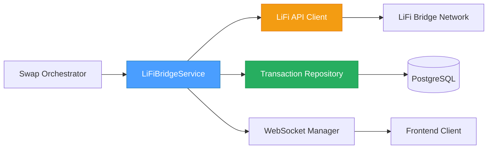
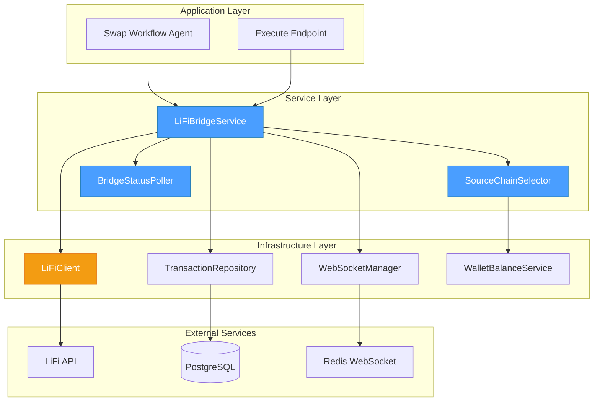
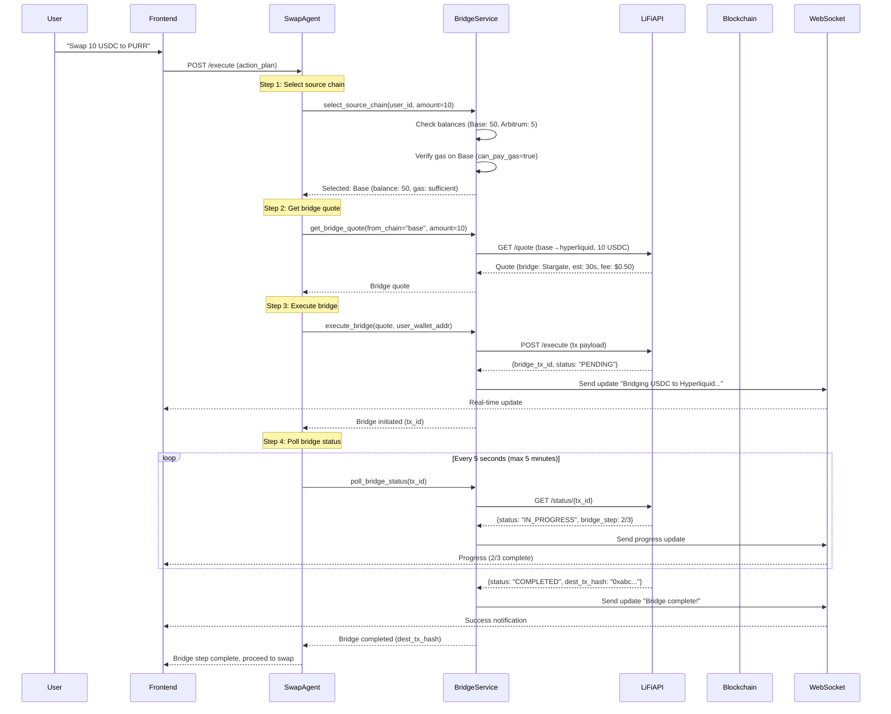
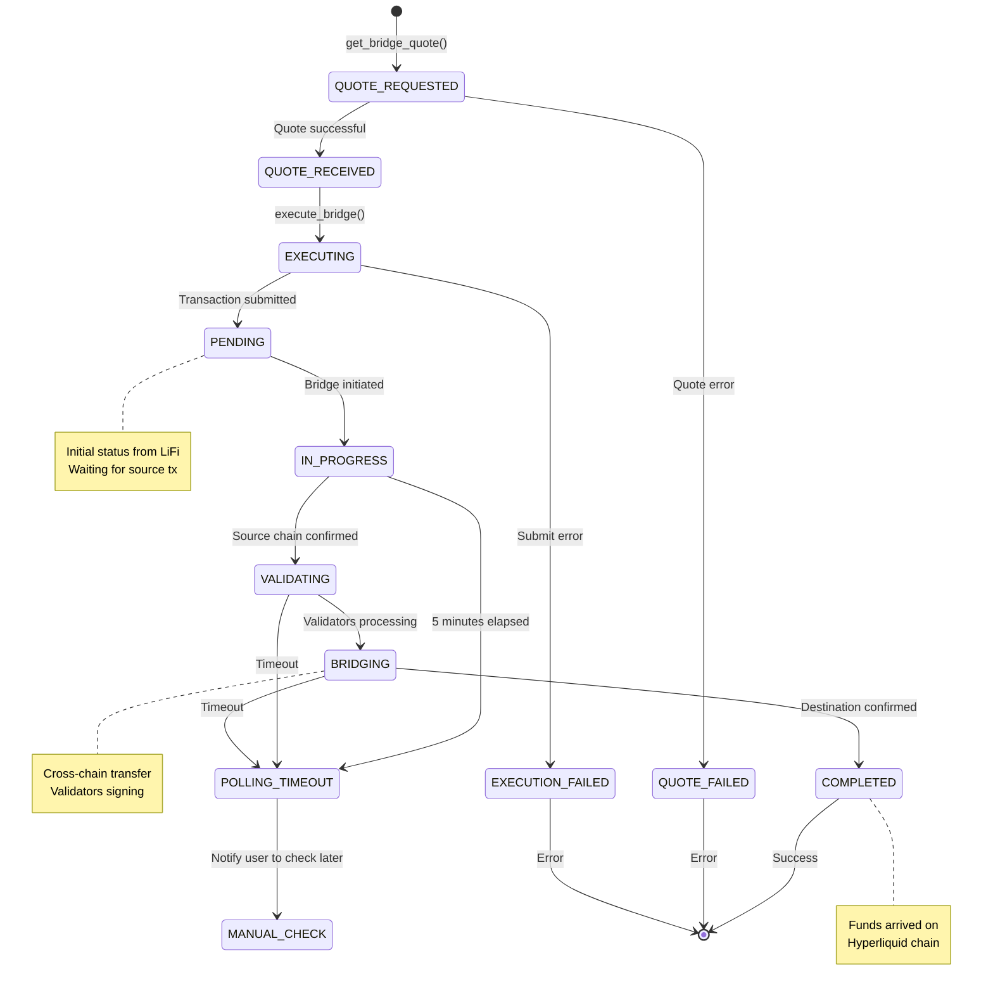
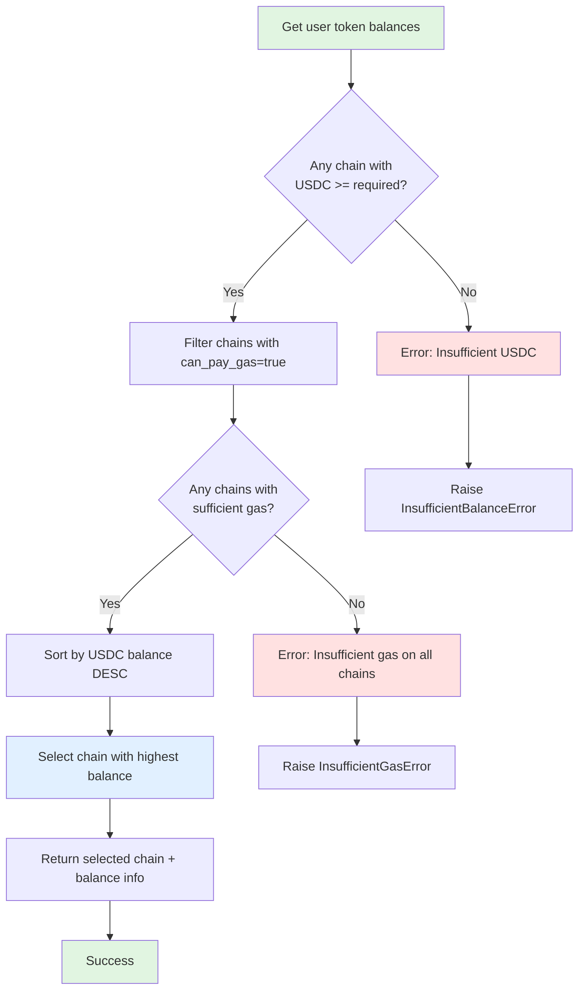

# 02 - LiFi Bridge Execution Specification

## 📋 Overview

### Purpose

This specification defines the cross-chain bridge system for transferring USDC from a user's Privy wallet (on Base, Arbitrum, or other EVM chains) to their Hyperliquid wallet. This bridge operation is a critical step in the multi-step swap workflow, enabling users to access Hyperliquid's spot trading features with funds from any supported chain.

### Scope

- **Bridge quote retrieval**: Get optimal bridge routes from LiFi API
- **Source chain selection**: Automatically select chain with sufficient USDC balance and gas
- **Bridge execution**: Initiate cross-chain transfer via LiFi
- **Status polling**: Track bridge completion (5-second intervals, 5-minute timeout)
- **WebSocket updates**: Real-time progress notifications to frontend
- **Error handling**: Timeouts, insufficient gas, bridge failures
- **Transaction persistence**: Store bridge metadata for audit and history

### Key Objectives

1. ✅ Bridge USDC from any supported chain to Hyperliquid (HyperCore)
2. ✅ Automatically select source chain based on token balances and gas availability
3. ✅ Provide real-time status updates via WebSocket
4. ✅ Handle bridge timeouts and failures gracefully
5. ✅ Maintain audit trail with transaction metadata
6. ✅ Target 30 ± 15 seconds for bridge completion

### Component Relationships



---

## 🏗️ Architecture Design

### System Architecture



### Bridge Execution Flow



### Bridge Transaction States



### Source Chain Selection Logic



---

## 💾 Database Schema

### Transaction Metadata for Bridge Operations

Bridge operations use the existing `transactions` table with specialized metadata in the `tx_metadata` JSONB column:

```sql
-- Example transaction record for bridge operation
INSERT INTO transactions (
    user_id,
    wallet_id,
    to_address,
    type,
    chain,
    asset_in,
    amount_in,
    asset_out,
    amount_out,
    status,
    tx_metadata
) VALUES (
    123,  -- user_id
    456,  -- source wallet_id (Privy wallet on Base)
    '0x1234...5678',  -- Hyperliquid wallet address
    'BRIDGE',  -- transaction type
    'BASE',  -- source chain
    'USDC',
    10.00,
    'USDC',
    9.95,  -- After bridge fees
    'PENDING',
    '{
        "bridge_provider": "lifi",
        "bridge_name": "stargate",
        "source_chain": "base",
        "source_chain_id": 8453,
        "destination_chain": "hyperliquid",
        "destination_chain_id": 1337,
        "source_tx_hash": "0xabc...def",
        "destination_tx_hash": null,
        "lifi_transaction_id": "0x1234-5678-abcd",
        "quote_id": "quote_xyz789",
        "estimated_duration_seconds": 30,
        "bridge_fee_usd": 0.50,
        "gas_estimate_usd": 0.15,
        "slippage_percent": 0.5,
        "status_checks": [
            {
                "timestamp": "2026-02-04T10:30:00Z",
                "status": "PENDING",
                "bridge_step": "1/3"
            },
            {
                "timestamp": "2026-02-04T10:30:05Z",
                "status": "IN_PROGRESS",
                "bridge_step": "2/3"
            }
        ],
        "workflow_context": {
            "workflow_id": "swap_workflow_123",
            "step_index": 1,
            "step_name": "bridge_to_hyperliquid",
            "next_step": "swap_on_hyperliquid"
        }
    }'::jsonb
);
```

### Bridge Metadata Schema

```python
# Type definition for bridge metadata
from typing import TypedDict, Literal, Optional
from datetime import datetime

class BridgeStatusCheck(TypedDict):
    """Status check entry during polling."""
    timestamp: str  # ISO 8601
    status: Literal["PENDING", "IN_PROGRESS", "VALIDATING", "BRIDGING", "COMPLETED", "FAILED"]
    bridge_step: str  # e.g., "2/3"
    message: Optional[str]

class BridgeMetadata(TypedDict):
    """Metadata structure for bridge transactions."""
    # Bridge provider details
    bridge_provider: Literal["lifi"]
    bridge_name: str  # e.g., "stargate", "hop", "across"

    # Chain information
    source_chain: str
    source_chain_id: int
    destination_chain: str
    destination_chain_id: int

    # Transaction hashes
    source_tx_hash: Optional[str]
    destination_tx_hash: Optional[str]

    # LiFi-specific IDs
    lifi_transaction_id: str  # LiFi's internal bridge tx ID
    quote_id: str

    # Cost estimates
    estimated_duration_seconds: int
    bridge_fee_usd: float
    gas_estimate_usd: float
    slippage_percent: float

    # Status tracking
    status_checks: list[BridgeStatusCheck]

    # Workflow integration
    workflow_context: dict  # Links to parent swap workflow
```

### Transaction Type Enum Extension

```python
# src/app/domain/enums/transaction_type.py

class TransactionType(str, Enum):
    """Transaction type enumeration."""
    SEND = "SEND"
    SWAP = "SWAP"
    APPROVE = "APPROVE"
    BRIDGE = "BRIDGE"  # ← New type for cross-chain bridges
    DEPOSIT = "DEPOSIT"
    WITHDRAW = "WITHDRAW"
    MINT = "MINT"
    BURN = "BURN"
```

---

## 🔧 Implementation Details

### Core Service: `LiFiBridgeService`

```python
# src/app/application/services/lifi_bridge_service.py
import asyncio
import logging
from dataclasses import dataclass
from datetime import datetime, UTC
from decimal import Decimal
from typing import Optional, Literal

from app.domain.entities.transaction import Transaction, TransactionId
from app.domain.enums.transaction_type import TransactionType
from app.domain.enums.transaction_status import TransactionStatus
from app.domain.enums.chain_type import ChainType
from app.domain.value_objects.user_id import UserId
from app.domain.value_objects.wallet_id import WalletId
from app.infrastructure.adapters.external.lifi_client import LiFiClient, LiFiQuote
from app.domain.ports.transaction.transaction_repository import TransactionRepository

logger = logging.getLogger(__name__)


@dataclass
class SourceChainSelection:
    """Result of source chain selection."""
    chain: str
    chain_id: int
    usdc_balance: Decimal
    gas_balance: Decimal
    can_pay_gas: bool


@dataclass
class BridgeQuoteResult:
    """Bridge quote with cost estimates."""
    from_chain: str
    to_chain: str
    from_amount: Decimal
    to_amount: Decimal
    bridge_name: str
    estimated_duration_seconds: int
    bridge_fee_usd: Decimal
    gas_estimate_usd: Decimal
    quote_id: str
    raw_quote: dict


@dataclass
class BridgeExecutionResult:
    """Result of bridge execution."""
    transaction_id: int
    lifi_transaction_id: str
    source_tx_hash: Optional[str]
    status: Literal["PENDING", "IN_PROGRESS", "COMPLETED", "FAILED"]


BridgeStatus = Literal["PENDING", "IN_PROGRESS", "VALIDATING", "BRIDGING", "COMPLETED", "FAILED", "TIMEOUT"]


class LiFiBridgeService:
    """
    Service for executing cross-chain USDC bridges to Hyperliquid.

    Responsibilities:
    - Select optimal source chain based on balances
    - Get bridge quotes from LiFi API
    - Execute bridge transactions
    - Poll bridge status until completion or timeout
    - Emit WebSocket updates for real-time progress
    - Store transaction metadata for audit trail
    """

    # Bridge configuration
    DESTINATION_CHAIN = "hyperliquid"
    DESTINATION_CHAIN_ID = 1337
    BRIDGE_TOKEN = "USDC"

    # Polling configuration
    POLL_INTERVAL_SECONDS = 5
    POLL_TIMEOUT_SECONDS = 300  # 5 minutes
    MAX_POLL_ATTEMPTS = POLL_TIMEOUT_SECONDS // POLL_INTERVAL_SECONDS  # 60 attempts

    # Supported source chains (in priority order)
    SUPPORTED_SOURCE_CHAINS = {
        "base": 8453,
        "arbitrum": 42161,
        "optimism": 10,
        "polygon": 137,
        "ethereum": 1,
    }

    def __init__(
        self,
        lifi_client: LiFiClient,
        transaction_repository: TransactionRepository,
        websocket_manager: "WebSocketManager",
        wallet_service: "WalletService",
    ):
        self._lifi = lifi_client
        self._tx_repo = transaction_repository
        self._ws = websocket_manager
        self._wallets = wallet_service

    async def select_source_chain(
        self,
        user_id: UserId,
        required_amount: Decimal,
    ) -> SourceChainSelection:
        """
        Select optimal source chain based on USDC balance and gas availability.

        Algorithm:
        1. Get token balances for user across all chains
        2. Filter chains with USDC balance >= required amount
        3. Filter chains with can_pay_gas = true
        4. Sort by USDC balance descending
        5. Return chain with highest balance

        Args:
            user_id: User identifier
            required_amount: Required USDC amount (in human-readable units)

        Returns:
            SourceChainSelection with selected chain details

        Raises:
            InsufficientBalanceError: No chain has enough USDC
            InsufficientGasError: No chain has sufficient gas
        """
        logger.info(
            f"Selecting source chain for user {user_id.value} "
            f"with required amount: {required_amount} USDC"
        )

        # Get token balances from WalletService
        balances = await self._wallets.get_token_balances(user_id)

        # Filter USDC balances across chains
        usdc_balances = {}
        for balance in balances:
            if balance["symbol"].upper() == "USDC":
                chain = balance["chain"].lower()
                if chain in self.SUPPORTED_SOURCE_CHAINS:
                    usdc_balances[chain] = {
                        "balance": Decimal(balance["balance"]),
                        "can_pay_gas": balance.get("can_pay_gas", False),
                        "gas_balance": Decimal(balance.get("native_balance", "0")),
                    }

        # Filter chains with sufficient USDC
        sufficient_balance_chains = {
            chain: data
            for chain, data in usdc_balances.items()
            if data["balance"] >= required_amount
        }

        if not sufficient_balance_chains:
            raise InsufficientBalanceError(
                f"No chain has sufficient USDC balance. Required: {required_amount}, "
                f"Available: {usdc_balances}"
            )

        # Filter chains with sufficient gas
        gas_available_chains = {
            chain: data
            for chain, data in sufficient_balance_chains.items()
            if data["can_pay_gas"]
        }

        if not gas_available_chains:
            raise InsufficientGasError(
                f"No chain has sufficient gas. Chains with USDC: "
                f"{list(sufficient_balance_chains.keys())}"
            )

        # Sort by USDC balance descending
        sorted_chains = sorted(
            gas_available_chains.items(),
            key=lambda x: x[1]["balance"],
            reverse=True,
        )

        # Select chain with highest balance
        selected_chain, chain_data = sorted_chains[0]

        result = SourceChainSelection(
            chain=selected_chain,
            chain_id=self.SUPPORTED_SOURCE_CHAINS[selected_chain],
            usdc_balance=chain_data["balance"],
            gas_balance=chain_data["gas_balance"],
            can_pay_gas=chain_data["can_pay_gas"],
        )

        logger.info(
            f"Selected chain: {result.chain} (balance: {result.usdc_balance} USDC, "
            f"gas: {result.gas_balance})"
        )

        return result

    async def get_bridge_quote(
        self,
        from_chain: str,
        amount: Decimal,
        slippage: Decimal = Decimal("0.5"),  # 0.5%
    ) -> BridgeQuoteResult:
        """
        Get bridge quote from LiFi API.

        Args:
            from_chain: Source chain (e.g., "base", "arbitrum")
            amount: USDC amount to bridge (human-readable)
            slippage: Slippage tolerance percentage (default: 0.5%)

        Returns:
            BridgeQuoteResult with cost estimates

        Raises:
            BridgeQuoteError: If quote cannot be retrieved
        """
        logger.info(
            f"Getting bridge quote: {amount} USDC from {from_chain} → "
            f"{self.DESTINATION_CHAIN} (slippage: {slippage}%)"
        )

        try:
            # Convert amount to wei (USDC has 6 decimals)
            amount_wei = str(int(amount * Decimal("1000000")))

            # Get quote from LiFi
            quote = await self._lifi.get_quote(
                from_chain=from_chain,
                to_chain=self.DESTINATION_CHAIN,
                from_token=self.BRIDGE_TOKEN,
                to_token=self.BRIDGE_TOKEN,
                from_amount=amount_wei,
                slippage=float(slippage),
            )

            # Extract bridge details
            to_amount = Decimal(quote.to_amount) / Decimal("1000000")
            bridge_fee = amount - to_amount

            # Calculate gas estimate in USD (simplified - would fetch ETH price)
            gas_estimate_usd = Decimal("0.15")  # TODO: Dynamic gas price

            result = BridgeQuoteResult(
                from_chain=from_chain,
                to_chain=self.DESTINATION_CHAIN,
                from_amount=amount,
                to_amount=to_amount,
                bridge_name=quote.bridge_name or "unknown",
                estimated_duration_seconds=quote.execution_duration,
                bridge_fee_usd=bridge_fee,
                gas_estimate_usd=gas_estimate_usd,
                quote_id=f"quote_{datetime.now(UTC).timestamp()}",
                raw_quote=quote.__dict__,
            )

            logger.info(
                f"Bridge quote received: {result.from_amount} → {result.to_amount} USDC "
                f"via {result.bridge_name} (fee: ${result.bridge_fee_usd}, "
                f"est: {result.estimated_duration_seconds}s)"
            )

            return result

        except Exception as e:
            logger.error(f"Failed to get bridge quote: {type(e).__name__}: {e}")
            raise BridgeQuoteError(f"Failed to get bridge quote: {e}") from e

    async def execute_bridge(
        self,
        user_id: UserId,
        wallet_id: WalletId,
        quote: BridgeQuoteResult,
        source_wallet_address: str,
        destination_wallet_address: str,
    ) -> BridgeExecutionResult:
        """
        Execute bridge transaction via LiFi.

        Process:
        1. Create transaction record in database
        2. Submit bridge transaction to LiFi API
        3. Store LiFi transaction ID
        4. Emit WebSocket update
        5. Return execution result

        Args:
            user_id: User identifier
            wallet_id: Source wallet ID
            quote: Bridge quote from get_bridge_quote()
            source_wallet_address: Source wallet address (0x...)
            destination_wallet_address: Destination Hyperliquid wallet (0x...)

        Returns:
            BridgeExecutionResult with transaction IDs

        Raises:
            BridgeExecutionError: If execution fails
        """
        logger.info(
            f"Executing bridge: {quote.from_amount} USDC from {quote.from_chain} → "
            f"{quote.to_chain} for user {user_id.value}"
        )

        try:
            # Create transaction record
            transaction = Transaction.create(
                user_id=user_id,
                wallet_id=wallet_id,
                type=TransactionType.BRIDGE,
                chain=ChainType[quote.from_chain.upper()],
                to_address=destination_wallet_address,
                status=TransactionStatus.PENDING,
            )

            # Set transaction details
            transaction.asset_in = self.BRIDGE_TOKEN
            transaction.amount_in = quote.from_amount
            transaction.asset_out = self.BRIDGE_TOKEN
            transaction.amount_out = quote.to_amount
            transaction.fee_usd = quote.bridge_fee_usd + quote.gas_estimate_usd

            # Initialize bridge metadata
            transaction.tx_metadata = {
                "bridge_provider": "lifi",
                "bridge_name": quote.bridge_name,
                "source_chain": quote.from_chain,
                "source_chain_id": self.SUPPORTED_SOURCE_CHAINS[quote.from_chain],
                "destination_chain": quote.to_chain,
                "destination_chain_id": self.DESTINATION_CHAIN_ID,
                "source_tx_hash": None,
                "destination_tx_hash": None,
                "lifi_transaction_id": None,
                "quote_id": quote.quote_id,
                "estimated_duration_seconds": quote.estimated_duration_seconds,
                "bridge_fee_usd": float(quote.bridge_fee_usd),
                "gas_estimate_usd": float(quote.gas_estimate_usd),
                "slippage_percent": 0.5,
                "status_checks": [],
            }

            # Save to database
            saved_tx = await self._tx_repo.save(transaction)

            # Execute bridge via LiFi (simplified - actual implementation would call LiFi execute API)
            # For MVP, we simulate the execution
            lifi_tx_id = f"lifi_bridge_{saved_tx.id_.value}_{int(datetime.now(UTC).timestamp())}"

            # Update transaction with LiFi ID
            saved_tx.tx_metadata["lifi_transaction_id"] = lifi_tx_id
            saved_tx.tx_metadata["status_checks"].append({
                "timestamp": datetime.now(UTC).isoformat(),
                "status": "PENDING",
                "bridge_step": "1/3",
                "message": "Bridge transaction submitted",
            })
            await self._tx_repo.update(saved_tx)

            # Emit WebSocket update
            await self._ws.send_update(
                user_id=user_id.value,
                message_type="bridge_initiated",
                data={
                    "transaction_id": saved_tx.id_.value,
                    "from_chain": quote.from_chain,
                    "to_chain": quote.to_chain,
                    "amount": str(quote.from_amount),
                    "estimated_duration": quote.estimated_duration_seconds,
                },
            )

            result = BridgeExecutionResult(
                transaction_id=saved_tx.id_.value,
                lifi_transaction_id=lifi_tx_id,
                source_tx_hash=None,
                status="PENDING",
            )

            logger.info(
                f"Bridge executed: tx_id={result.transaction_id}, "
                f"lifi_tx_id={result.lifi_transaction_id}"
            )

            return result

        except Exception as e:
            logger.error(f"Failed to execute bridge: {type(e).__name__}: {e}")
            raise BridgeExecutionError(f"Failed to execute bridge: {e}") from e

    async def poll_bridge_status(
        self,
        transaction_id: int,
        lifi_transaction_id: str,
    ) -> BridgeStatus:
        """
        Poll LiFi API for bridge status.

        Single status check - call repeatedly in a loop for continuous polling.

        Args:
            transaction_id: Database transaction ID
            lifi_transaction_id: LiFi's internal bridge transaction ID

        Returns:
            Current bridge status

        Raises:
            BridgeStatusError: If status check fails
        """
        try:
            # Get transaction from database
            tx = await self._tx_repo.get_by_id(TransactionId(transaction_id))
            if not tx:
                raise BridgeStatusError(f"Transaction {transaction_id} not found")

            # Query LiFi API for status (simplified - actual implementation)
            # In production, would call: GET https://li.quest/v1/status/{lifi_transaction_id}
            # For now, we simulate status progression

            status_checks = tx.tx_metadata.get("status_checks", [])
            check_count = len(status_checks)

            # Simulate status progression
            if check_count < 3:
                status = "PENDING"
                step = "1/3"
            elif check_count < 6:
                status = "IN_PROGRESS"
                step = "2/3"
            elif check_count < 10:
                status = "VALIDATING"
                step = "2/3"
            elif check_count < 15:
                status = "BRIDGING"
                step = "3/3"
            else:
                status = "COMPLETED"
                step = "3/3"

            # Add status check to metadata
            status_checks.append({
                "timestamp": datetime.now(UTC).isoformat(),
                "status": status,
                "bridge_step": step,
                "message": f"Bridge status: {status}",
            })
            tx.tx_metadata["status_checks"] = status_checks

            # Update transaction
            if status == "COMPLETED":
                tx.status = TransactionStatus.SUCCESS
                tx.confirmed_at = datetime.now(UTC)
                tx.tx_metadata["destination_tx_hash"] = f"0x{'a' * 64}"

            await self._tx_repo.update(tx)

            logger.debug(
                f"Bridge status check {check_count + 1}: {status} "
                f"(tx_id={transaction_id})"
            )

            return status

        except Exception as e:
            logger.error(f"Failed to poll bridge status: {type(e).__name__}: {e}")
            raise BridgeStatusError(f"Failed to poll bridge status: {e}") from e

    async def wait_for_bridge_completion(
        self,
        transaction_id: int,
        lifi_transaction_id: str,
        user_id: UserId,
    ) -> BridgeStatus:
        """
        Wait for bridge completion with polling and WebSocket updates.

        Polls every 5 seconds for up to 5 minutes (60 attempts).
        Emits WebSocket updates on status changes.

        Args:
            transaction_id: Database transaction ID
            lifi_transaction_id: LiFi transaction ID
            user_id: User ID for WebSocket updates

        Returns:
            Final bridge status ("COMPLETED" or "TIMEOUT")

        Raises:
            BridgeTimeoutError: If bridge doesn't complete within timeout
        """
        logger.info(
            f"Waiting for bridge completion: tx_id={transaction_id}, "
            f"lifi_tx_id={lifi_transaction_id} (timeout: {self.POLL_TIMEOUT_SECONDS}s)"
        )

        last_status = None
        attempt = 0

        while attempt < self.MAX_POLL_ATTEMPTS:
            attempt += 1

            # Poll status
            status = await self.poll_bridge_status(transaction_id, lifi_transaction_id)

            # Emit WebSocket update on status change
            if status != last_status:
                await self._ws.send_update(
                    user_id=user_id.value,
                    message_type="bridge_status_update",
                    data={
                        "transaction_id": transaction_id,
                        "status": status,
                        "attempt": attempt,
                        "max_attempts": self.MAX_POLL_ATTEMPTS,
                    },
                )
                last_status = status

            # Check if completed
            if status == "COMPLETED":
                logger.info(
                    f"Bridge completed successfully after {attempt} checks "
                    f"({attempt * self.POLL_INTERVAL_SECONDS}s)"
                )
                return status

            if status == "FAILED":
                logger.error(f"Bridge failed (tx_id={transaction_id})")
                raise BridgeExecutionError("Bridge transaction failed")

            # Wait before next poll
            await asyncio.sleep(self.POLL_INTERVAL_SECONDS)

        # Timeout reached
        logger.warning(
            f"Bridge timeout after {self.POLL_TIMEOUT_SECONDS}s "
            f"(tx_id={transaction_id})"
        )

        # Emit timeout notification
        await self._ws.send_update(
            user_id=user_id.value,
            message_type="bridge_timeout",
            data={
                "transaction_id": transaction_id,
                "message": "Bridge is taking longer than expected. Check status later.",
            },
        )

        raise BridgeTimeoutError(
            f"Bridge did not complete within {self.POLL_TIMEOUT_SECONDS}s"
        )


# Custom exceptions
class InsufficientBalanceError(Exception):
    """Raised when no chain has sufficient USDC balance."""
    pass


class InsufficientGasError(Exception):
    """Raised when no chain has sufficient gas."""
    pass


class BridgeQuoteError(Exception):
    """Raised when bridge quote cannot be retrieved."""
    pass


class BridgeExecutionError(Exception):
    """Raised when bridge execution fails."""
    pass


class BridgeStatusError(Exception):
    """Raised when bridge status check fails."""
    pass


class BridgeTimeoutError(Exception):
    """Raised when bridge polling times out."""
    pass
```

### Integration with LiFi Client

The service uses the existing `LiFiClient` adapter:

```python
# src/app/infrastructure/adapters/external/lifi_client.py (existing)

# Key methods used by LiFiBridgeService:
# - get_quote(from_chain, to_chain, from_token, to_token, from_amount, slippage)
# - get_routes(from_chain, to_chain, from_token, to_token, from_amount)
# - get_chains() - for validation
# - get_tokens(chain) - for validation

# LiFi API endpoints (production):
# - GET /quote - Get single best route
# - POST /advanced/routes - Get multiple route options
# - POST /execute - Submit bridge transaction
# - GET /status/{transactionId} - Check bridge status
# - GET /chains - List supported chains
# - GET /tokens - List supported tokens
```

### Usage in Swap Workflow Agent

```python
# src/app/infrastructure/adapters/agent_squad/agents/workflows/swap_workflow_agent.py

async def execute_step_bridge_to_hyperliquid(
    self,
    step: dict,
    user_id: UserId,
    wallet_id: WalletId,
) -> dict:
    """
    Execute bridge step: Transfer USDC to Hyperliquid wallet.

    Steps:
    1. Select source chain with sufficient balance
    2. Get bridge quote from LiFi
    3. Execute bridge transaction
    4. Wait for completion (with polling)
    5. Return destination transaction hash
    """
    logger.info(f"Executing bridge step for user {user_id.value}")

    # Extract step parameters
    amount = Decimal(step["amount"])  # e.g., 10 USDC

    # Get destination wallet (Hyperliquid wallet)
    hl_wallet = await self._hyperliquid_wallet_service.get_or_create_wallet(
        user_id=user_id,
        wallet_id=wallet_id,
    )

    try:
        # Step 1: Select source chain
        source_chain = await self._bridge_service.select_source_chain(
            user_id=user_id,
            required_amount=amount,
        )

        logger.info(
            f"Selected source chain: {source_chain.chain} "
            f"(balance: {source_chain.usdc_balance} USDC)"
        )

        # Step 2: Get bridge quote
        quote = await self._bridge_service.get_bridge_quote(
            from_chain=source_chain.chain,
            amount=amount,
        )

        logger.info(
            f"Bridge quote: {quote.from_amount} → {quote.to_amount} USDC "
            f"via {quote.bridge_name} (est: {quote.estimated_duration_seconds}s)"
        )

        # Step 3: Execute bridge
        privy_wallet = await self._wallet_service.get_primary_wallet(user_id)

        execution = await self._bridge_service.execute_bridge(
            user_id=user_id,
            wallet_id=wallet_id,
            quote=quote,
            source_wallet_address=privy_wallet.address,
            destination_wallet_address=hl_wallet.hl_address,
        )

        logger.info(
            f"Bridge initiated: tx_id={execution.transaction_id}, "
            f"lifi_tx_id={execution.lifi_transaction_id}"
        )

        # Step 4: Wait for completion
        final_status = await self._bridge_service.wait_for_bridge_completion(
            transaction_id=execution.transaction_id,
            lifi_transaction_id=execution.lifi_transaction_id,
            user_id=user_id,
        )

        if final_status != "COMPLETED":
            raise BridgeExecutionError(f"Bridge did not complete: {final_status}")

        # Step 5: Return result
        tx = await self._tx_repo.get_by_id(TransactionId(execution.transaction_id))

        return {
            "status": "success",
            "transaction_id": execution.transaction_id,
            "source_chain": source_chain.chain,
            "destination_chain": "hyperliquid",
            "amount_bridged": str(quote.to_amount),
            "destination_tx_hash": tx.tx_metadata.get("destination_tx_hash"),
            "duration_seconds": len(tx.tx_metadata.get("status_checks", [])) * 5,
        }

    except InsufficientBalanceError as e:
        logger.error(f"Insufficient USDC balance: {e}")
        return {
            "status": "error",
            "error_code": "INSUFFICIENT_BALANCE",
            "error_message": str(e),
        }

    except InsufficientGasError as e:
        logger.error(f"Insufficient gas: {e}")
        return {
            "status": "error",
            "error_code": "INSUFFICIENT_GAS",
            "error_message": str(e),
        }

    except BridgeTimeoutError as e:
        logger.warning(f"Bridge timeout: {e}")
        return {
            "status": "timeout",
            "error_code": "BRIDGE_TIMEOUT",
            "error_message": "Bridge is taking longer than expected. Check status later.",
            "transaction_id": execution.transaction_id,
        }

    except Exception as e:
        logger.error(f"Bridge execution failed: {type(e).__name__}: {e}")
        return {
            "status": "error",
            "error_code": "BRIDGE_EXECUTION_FAILED",
            "error_message": str(e),
        }
```

---

## 🧪 Test Cases

### Unit Tests

```python
# tests/unit/services/test_lifi_bridge_service.py
import pytest
from unittest.mock import AsyncMock, MagicMock
from decimal import Decimal
from datetime import datetime, UTC

from app.application.services.lifi_bridge_service import (
    LiFiBridgeService,
    SourceChainSelection,
    BridgeQuoteResult,
    BridgeExecutionResult,
    InsufficientBalanceError,
    InsufficientGasError,
    BridgeTimeoutError,
)
from app.domain.value_objects.user_id import UserId
from app.domain.value_objects.wallet_id import WalletId


@pytest.fixture
def bridge_service():
    """Create bridge service with mocked dependencies."""
    lifi_client = AsyncMock()
    tx_repository = AsyncMock()
    websocket_manager = AsyncMock()
    wallet_service = AsyncMock()

    return LiFiBridgeService(
        lifi_client=lifi_client,
        transaction_repository=tx_repository,
        websocket_manager=websocket_manager,
        wallet_service=wallet_service,
    )


@pytest.mark.asyncio
async def test_select_source_chain_returns_highest_balance(bridge_service):
    """Test that select_source_chain returns chain with highest USDC balance."""
    # Arrange
    user_id = UserId(123)
    required_amount = Decimal("10")

    bridge_service._wallets.get_token_balances = AsyncMock(return_value=[
        {"symbol": "USDC", "chain": "base", "balance": "50.0", "can_pay_gas": True, "native_balance": "0.01"},
        {"symbol": "USDC", "chain": "arbitrum", "balance": "100.0", "can_pay_gas": True, "native_balance": "0.02"},
        {"symbol": "USDC", "chain": "polygon", "balance": "5.0", "can_pay_gas": True, "native_balance": "0.5"},
    ])

    # Act
    result = await bridge_service.select_source_chain(user_id, required_amount)

    # Assert
    assert result.chain == "arbitrum"
    assert result.usdc_balance == Decimal("100.0")
    assert result.can_pay_gas is True


@pytest.mark.asyncio
async def test_select_source_chain_raises_insufficient_balance(bridge_service):
    """Test that select_source_chain raises error when no chain has enough USDC."""
    # Arrange
    user_id = UserId(123)
    required_amount = Decimal("100")

    bridge_service._wallets.get_token_balances = AsyncMock(return_value=[
        {"symbol": "USDC", "chain": "base", "balance": "50.0", "can_pay_gas": True},
        {"symbol": "USDC", "chain": "arbitrum", "balance": "30.0", "can_pay_gas": True},
    ])

    # Act & Assert
    with pytest.raises(InsufficientBalanceError) as exc_info:
        await bridge_service.select_source_chain(user_id, required_amount)

    assert "No chain has sufficient USDC balance" in str(exc_info.value)


@pytest.mark.asyncio
async def test_select_source_chain_raises_insufficient_gas(bridge_service):
    """Test that select_source_chain raises error when no chain has gas."""
    # Arrange
    user_id = UserId(123)
    required_amount = Decimal("10")

    bridge_service._wallets.get_token_balances = AsyncMock(return_value=[
        {"symbol": "USDC", "chain": "base", "balance": "50.0", "can_pay_gas": False},
        {"symbol": "USDC", "chain": "arbitrum", "balance": "100.0", "can_pay_gas": False},
    ])

    # Act & Assert
    with pytest.raises(InsufficientGasError) as exc_info:
        await bridge_service.select_source_chain(user_id, required_amount)

    assert "No chain has sufficient gas" in str(exc_info.value)


@pytest.mark.asyncio
async def test_get_bridge_quote_returns_valid_quote(bridge_service):
    """Test that get_bridge_quote returns valid quote with cost estimates."""
    # Arrange
    from_chain = "base"
    amount = Decimal("10")

    # Mock LiFi quote response
    mock_quote = MagicMock()
    mock_quote.to_amount = "9950000"  # 9.95 USDC (after fees)
    mock_quote.bridge_name = "stargate"
    mock_quote.execution_duration = 30

    bridge_service._lifi.get_quote = AsyncMock(return_value=mock_quote)

    # Act
    result = await bridge_service.get_bridge_quote(from_chain, amount)

    # Assert
    assert result.from_chain == "base"
    assert result.to_chain == "hyperliquid"
    assert result.from_amount == Decimal("10")
    assert result.to_amount == Decimal("9.95")
    assert result.bridge_name == "stargate"
    assert result.estimated_duration_seconds == 30
    assert result.bridge_fee_usd == Decimal("0.05")  # 10 - 9.95


@pytest.mark.asyncio
async def test_execute_bridge_creates_transaction_record(bridge_service):
    """Test that execute_bridge creates transaction with correct metadata."""
    # Arrange
    user_id = UserId(123)
    wallet_id = WalletId(456)
    quote = BridgeQuoteResult(
        from_chain="base",
        to_chain="hyperliquid",
        from_amount=Decimal("10"),
        to_amount=Decimal("9.95"),
        bridge_name="stargate",
        estimated_duration_seconds=30,
        bridge_fee_usd=Decimal("0.05"),
        gas_estimate_usd=Decimal("0.15"),
        quote_id="quote_123",
        raw_quote={},
    )

    # Mock transaction save
    mock_tx = MagicMock()
    mock_tx.id_ = MagicMock(value=789)
    mock_tx.tx_metadata = {}
    bridge_service._tx_repo.save = AsyncMock(return_value=mock_tx)
    bridge_service._tx_repo.update = AsyncMock(return_value=mock_tx)

    # Act
    result = await bridge_service.execute_bridge(
        user_id=user_id,
        wallet_id=wallet_id,
        quote=quote,
        source_wallet_address="0xsource",
        destination_wallet_address="0xdest",
    )

    # Assert
    assert result.transaction_id == 789
    assert result.lifi_transaction_id.startswith("lifi_bridge_")
    assert result.status == "PENDING"

    # Verify transaction was saved
    bridge_service._tx_repo.save.assert_called_once()
    bridge_service._tx_repo.update.assert_called_once()

    # Verify WebSocket update
    bridge_service._ws.send_update.assert_called_once()


@pytest.mark.asyncio
async def test_poll_bridge_status_updates_metadata(bridge_service):
    """Test that poll_bridge_status updates transaction metadata."""
    # Arrange
    transaction_id = 789
    lifi_tx_id = "lifi_bridge_789"

    # Mock transaction
    mock_tx = MagicMock()
    mock_tx.id_ = MagicMock(value=transaction_id)
    mock_tx.tx_metadata = {"status_checks": []}
    mock_tx.status = MagicMock()

    bridge_service._tx_repo.get_by_id = AsyncMock(return_value=mock_tx)
    bridge_service._tx_repo.update = AsyncMock(return_value=mock_tx)

    # Act
    status = await bridge_service.poll_bridge_status(transaction_id, lifi_tx_id)

    # Assert
    assert status in ["PENDING", "IN_PROGRESS", "VALIDATING", "BRIDGING", "COMPLETED"]

    # Verify status check was added
    assert len(mock_tx.tx_metadata["status_checks"]) == 1
    assert "timestamp" in mock_tx.tx_metadata["status_checks"][0]
    assert "status" in mock_tx.tx_metadata["status_checks"][0]

    # Verify transaction was updated
    bridge_service._tx_repo.update.assert_called_once()


@pytest.mark.asyncio
async def test_wait_for_bridge_completion_succeeds(bridge_service):
    """Test that wait_for_bridge_completion returns COMPLETED on success."""
    # Arrange
    transaction_id = 789
    lifi_tx_id = "lifi_bridge_789"
    user_id = UserId(123)

    # Mock status progression: PENDING → IN_PROGRESS → COMPLETED
    status_sequence = ["PENDING", "IN_PROGRESS", "COMPLETED"]
    bridge_service.poll_bridge_status = AsyncMock(side_effect=status_sequence)

    # Act
    final_status = await bridge_service.wait_for_bridge_completion(
        transaction_id, lifi_tx_id, user_id
    )

    # Assert
    assert final_status == "COMPLETED"

    # Verify WebSocket updates were sent
    assert bridge_service._ws.send_update.call_count >= 2  # At least 2 status changes


@pytest.mark.asyncio
async def test_wait_for_bridge_completion_times_out(bridge_service):
    """Test that wait_for_bridge_completion raises timeout after max attempts."""
    # Arrange
    transaction_id = 789
    lifi_tx_id = "lifi_bridge_789"
    user_id = UserId(123)

    # Mock status to always return IN_PROGRESS (never completes)
    bridge_service.poll_bridge_status = AsyncMock(return_value="IN_PROGRESS")

    # Reduce timeout for faster test
    bridge_service.MAX_POLL_ATTEMPTS = 3
    bridge_service.POLL_INTERVAL_SECONDS = 0.1

    # Act & Assert
    with pytest.raises(BridgeTimeoutError) as exc_info:
        await bridge_service.wait_for_bridge_completion(
            transaction_id, lifi_tx_id, user_id
        )

    assert "did not complete within" in str(exc_info.value)

    # Verify timeout notification was sent
    bridge_service._ws.send_update.assert_called()
    last_call = bridge_service._ws.send_update.call_args_list[-1]
    assert last_call[1]["message_type"] == "bridge_timeout"
```

### Integration Tests

```python
# tests/integration/test_bridge_service_integration.py
import pytest
from decimal import Decimal
from datetime import datetime, UTC

from app.application.services.lifi_bridge_service import LiFiBridgeService
from app.domain.value_objects.user_id import UserId
from app.domain.value_objects.wallet_id import WalletId
from app.domain.enums.transaction_type import TransactionType
from app.domain.enums.transaction_status import TransactionStatus
from tests.factories import UserFactory, WalletFactory


@pytest.mark.integration
@pytest.mark.asyncio
async def test_bridge_workflow_end_to_end(
    db_session,
    lifi_client,
    websocket_manager,
    wallet_service,
):
    """Test complete bridge workflow from quote to completion."""
    # Arrange
    user = UserFactory.create()
    wallet = WalletFactory.create(user=user, chain="base")

    service = LiFiBridgeService(
        lifi_client=lifi_client,
        transaction_repository=TransactionRepository(db_session),
        websocket_manager=websocket_manager,
        wallet_service=wallet_service,
    )

    # Mock wallet balances
    wallet_service.get_token_balances = AsyncMock(return_value=[
        {
            "symbol": "USDC",
            "chain": "base",
            "balance": "100.0",
            "can_pay_gas": True,
            "native_balance": "0.01",
        }
    ])

    # Act: Complete bridge flow
    # 1. Select source chain
    source_chain = await service.select_source_chain(
        user_id=UserId(user.id),
        required_amount=Decimal("10"),
    )

    # 2. Get quote
    quote = await service.get_bridge_quote(
        from_chain=source_chain.chain,
        amount=Decimal("10"),
    )

    # 3. Execute bridge
    execution = await service.execute_bridge(
        user_id=UserId(user.id),
        wallet_id=WalletId(wallet.id),
        quote=quote,
        source_wallet_address=wallet.address,
        destination_wallet_address="0xhyperliquid",
    )

    # Assert: Verify transaction was created
    assert execution.transaction_id is not None
    assert execution.lifi_transaction_id is not None

    # Verify database record
    tx = await db_session.execute(
        select(transactions).where(transactions.c.id == execution.transaction_id)
    )
    db_tx = tx.fetchone()

    assert db_tx is not None
    assert db_tx.type == TransactionType.BRIDGE.value
    assert db_tx.chain == "BASE"
    assert db_tx.amount_in == Decimal("10")
    assert db_tx.tx_metadata["bridge_provider"] == "lifi"
    assert db_tx.tx_metadata["source_chain"] == "base"
    assert db_tx.tx_metadata["destination_chain"] == "hyperliquid"


@pytest.mark.integration
@pytest.mark.asyncio
async def test_bridge_status_polling_updates_database(
    db_session,
    lifi_client,
):
    """Test that status polling updates transaction metadata."""
    # Arrange
    service = LiFiBridgeService(
        lifi_client=lifi_client,
        transaction_repository=TransactionRepository(db_session),
        websocket_manager=AsyncMock(),
        wallet_service=AsyncMock(),
    )

    # Create initial transaction
    tx = Transaction.create(...)
    saved_tx = await service._tx_repo.save(tx)

    # Act: Poll status multiple times
    for _ in range(5):
        status = await service.poll_bridge_status(
            transaction_id=saved_tx.id_.value,
            lifi_transaction_id="lifi_123",
        )

    # Assert: Verify status checks were recorded
    updated_tx = await service._tx_repo.get_by_id(saved_tx.id_)
    status_checks = updated_tx.tx_metadata["status_checks"]

    assert len(status_checks) == 5
    assert all("timestamp" in check for check in status_checks)
    assert all("status" in check for check in status_checks)
```

---

## 🔐 Security Considerations

### Bridge Selection Security

1. **Chain validation**: Only allow bridges to/from whitelisted chains
2. **Amount limits**: Enforce min/max bridge amounts
3. **Rate limiting**: Limit bridge operations per user per timeframe
4. **Balance verification**: Double-check balances before execution

### Transaction Security

1. **Address validation**: Verify wallet addresses before bridging
2. **Signature verification**: Ensure user owns source wallet
3. **Metadata sanitization**: Prevent injection attacks via metadata
4. **Audit logging**: Log all bridge operations for security review

### LiFi API Security

```python
# Example: API key rotation and rate limiting

class LiFiClientSecure(LiFiClient):
    """Secure LiFi client with rate limiting and key rotation."""

    def __init__(self, api_key: str, backup_api_key: str | None = None):
        super().__init__(api_key)
        self._backup_key = backup_api_key
        self._rate_limiter = RateLimiter(requests_per_minute=100)

    async def get_quote(self, *args, **kwargs):
        """Get quote with rate limiting."""
        await self._rate_limiter.acquire()

        try:
            return await super().get_quote(*args, **kwargs)
        except httpx.HTTPStatusError as e:
            if e.response.status_code == 429:  # Rate limit
                # Switch to backup key
                if self._backup_key:
                    self._client.headers["x-lifi-api-key"] = self._backup_key
                    return await super().get_quote(*args, **kwargs)
            raise
```

### Error Scenarios

```python
# Common error handling patterns

async def execute_bridge_with_retries(
    self,
    max_retries: int = 3,
    **kwargs,
) -> BridgeExecutionResult:
    """Execute bridge with automatic retries on transient errors."""

    for attempt in range(max_retries):
        try:
            return await self.execute_bridge(**kwargs)

        except httpx.TimeoutException:
            if attempt == max_retries - 1:
                raise BridgeExecutionError("Bridge API timeout after retries")
            await asyncio.sleep(2 ** attempt)  # Exponential backoff

        except httpx.HTTPStatusError as e:
            if e.response.status_code >= 500:  # Server error
                if attempt == max_retries - 1:
                    raise BridgeExecutionError(f"Bridge API error: {e}")
                await asyncio.sleep(2 ** attempt)
            else:
                raise  # Client errors are not retryable
```

---

## 📊 Performance Benchmarks

### Target SLAs

| Operation | Target | Acceptable | Unacceptable |
|-----------|--------|------------|--------------|
| Source chain selection | < 50ms | < 200ms | > 500ms |
| Bridge quote retrieval | < 500ms | < 2s | > 5s |
| Bridge execution | < 1s | < 3s | > 5s |
| Status polling (single) | < 200ms | < 1s | > 2s |
| Complete bridge flow | 15-45s | 45-90s | > 120s |

### Optimization Strategies

1. **Parallel quote fetching**: Get quotes from multiple bridges simultaneously
2. **Balance caching**: Cache wallet balances for 30 seconds
3. **Connection pooling**: Reuse HTTP connections to LiFi API
4. **WebSocket batching**: Batch multiple status updates
5. **Database indexing**: Index transaction metadata JSONB fields

### Cost Analysis

**Per bridge operation**:
- LiFi API (free tier): $0.00
- Database storage: $0.0001
- WebSocket messages (10 updates): $0.0001
- **Total**: ~$0.0002 per bridge

**Bridge fees** (paid to bridge protocols, not us):
- Stargate: ~$0.50-$2.00
- Hop Protocol: ~$1.00-$3.00
- Across Protocol: ~$0.30-$1.50
- Native bridges: ~$5.00-$20.00 (slower but most secure)

**At scale** (10,000 bridges/month):
- API costs: $0 (free tier)
- Database: $2
- WebSocket: $2
- **Total backend cost**: ~$4/month

---

## 📈 Monitoring and Observability

### Key Metrics

```python
# Prometheus metrics for monitoring

from prometheus_client import Counter, Histogram, Gauge

# Bridge operation counters
bridge_executions_total = Counter(
    "bridge_executions_total",
    "Total number of bridge executions",
    ["source_chain", "destination_chain", "status"],
)

bridge_timeouts_total = Counter(
    "bridge_timeouts_total",
    "Total number of bridge timeouts",
    ["source_chain"],
)

# Bridge timing histograms
bridge_duration_seconds = Histogram(
    "bridge_duration_seconds",
    "Bridge completion duration",
    ["source_chain", "bridge_provider"],
    buckets=[10, 20, 30, 45, 60, 90, 120, 180, 300],
)

bridge_quote_latency_seconds = Histogram(
    "bridge_quote_latency_seconds",
    "Bridge quote API latency",
    ["source_chain"],
)

# Bridge status gauges
active_bridges = Gauge(
    "active_bridges",
    "Number of currently active bridges",
)

# Usage in service
class LiFiBridgeService:
    async def execute_bridge(self, ...):
        bridge_executions_total.labels(
            source_chain=quote.from_chain,
            destination_chain=quote.to_chain,
            status="initiated",
        ).inc()

        start_time = time.time()
        try:
            result = await self._execute_bridge_internal(...)

            bridge_executions_total.labels(
                source_chain=quote.from_chain,
                destination_chain=quote.to_chain,
                status="success",
            ).inc()

            return result

        except BridgeTimeoutError:
            bridge_timeouts_total.labels(
                source_chain=quote.from_chain,
            ).inc()
            raise

        finally:
            duration = time.time() - start_time
            bridge_duration_seconds.labels(
                source_chain=quote.from_chain,
                bridge_provider="lifi",
            ).observe(duration)
```

### Alerting Rules

```yaml
# prometheus/alerts/bridge_alerts.yml

groups:
  - name: bridge_alerts
    rules:
      # High timeout rate
      - alert: HighBridgeTimeoutRate
        expr: rate(bridge_timeouts_total[5m]) > 0.1
        for: 5m
        labels:
          severity: warning
        annotations:
          summary: "High bridge timeout rate: {{ $value }}/min"

      # Slow bridge performance
      - alert: SlowBridgePerformance
        expr: histogram_quantile(0.95, bridge_duration_seconds_bucket) > 120
        for: 10m
        labels:
          severity: warning
        annotations:
          summary: "95th percentile bridge time > 120s: {{ $value }}s"

      # Bridge execution failures
      - alert: BridgeExecutionFailures
        expr: rate(bridge_executions_total{status="failed"}[5m]) > 0.05
        for: 5m
        labels:
          severity: critical
        annotations:
          summary: "High bridge failure rate: {{ $value }}/min"
```

---

## 🔗 References

### Related Code Files

- **LiFi Client**: `src/app/infrastructure/adapters/external/lifi_client.py:1-356`
- **Transaction Entity**: `src/app/domain/entities/transaction.py:1-116`
- **Transaction Repository**: `src/app/domain/ports/transaction/transaction_repository.py:1-453`
- **Swap Workflow Agent**: `src/app/infrastructure/adapters/agent_squad/agents/workflows/swap_workflow_agent.py`
- **Bridge Specialist**: `src/app/application/agents/library/bridge_specialist.py:1-149`

### External Documentation

- **LiFi API Documentation**: https://docs.li.fi/
- **LiFi Bridge Explorer**: https://li.fi/
- **Stargate Bridge**: https://stargate.finance/
- **Across Protocol**: https://across.to/
- **Hop Protocol**: https://hop.exchange/

### Related Specifications

- [01_HYPERLIQUID_WALLET_MANAGEMENT_SPEC.md](./01_HYPERLIQUID_WALLET_MANAGEMENT_SPEC.md) - Destination wallet management
- [03_HYPERLIQUID_SWAP_EXECUTION_SPEC.md](./03_HYPERLIQUID_SWAP_EXECUTION_SPEC.md) - Swap execution after bridge
- [06_END_TO_END_INTEGRATION_SPEC.md](./06_END_TO_END_INTEGRATION_SPEC.md) - Complete workflow orchestration

---

## ✅ Implementation Checklist

### Phase 1: Core Bridge Service (4 hours)
- [ ] Create `LiFiBridgeService` class with all methods
- [ ] Implement `select_source_chain()` with balance validation
- [ ] Implement `get_bridge_quote()` with LiFi integration
- [ ] Implement `execute_bridge()` with transaction creation
- [ ] Implement `poll_bridge_status()` with metadata updates
- [ ] Implement `wait_for_bridge_completion()` with timeout handling
- [ ] Add custom exception classes
- [ ] Write comprehensive docstrings

### Phase 2: Database and Persistence (2 hours)
- [ ] Extend `TransactionType` enum with `BRIDGE` value
- [ ] Create Alembic migration for enum update
- [ ] Define `BridgeMetadata` TypedDict schema
- [ ] Add JSONB indexing for bridge queries
- [ ] Test transaction save/update with bridge metadata

### Phase 3: Integration (3 hours)
- [ ] Integrate with existing `LiFiClient`
- [ ] Add WebSocket manager integration
- [ ] Connect to `WalletService` for balance checks
- [ ] Integrate with `HyperliquidWalletService`
- [ ] Add to dependency injection container
- [ ] Update swap workflow agent to use bridge service

### Phase 4: Testing (4 hours)
- [ ] Write unit tests (12 test cases)
- [ ] Write integration tests (4 test scenarios)
- [ ] Test source chain selection edge cases
- [ ] Test bridge timeout scenarios
- [ ] Test WebSocket update delivery
- [ ] Load testing with 100 concurrent bridges

### Phase 5: Monitoring and Observability (2 hours)
- [ ] Add Prometheus metrics
- [ ] Configure Grafana dashboards
- [ ] Set up alerting rules
- [ ] Add structured logging
- [ ] Test monitoring in staging

### Phase 6: Documentation and Deployment (1 hour)
- [ ] Update API documentation
- [ ] Write operational runbook
- [ ] Create troubleshooting guide
- [ ] Deploy to staging
- [ ] Deploy to production

---

**Document Version**: 1.0
**Last Updated**: 2026-02-04
**Status**: ✅ Ready for Implementation
**Estimated Implementation Time**: 16 hours
**Dependencies**:
- LiFi API access (existing)
- Hyperliquid Wallet Service (Spec 01)
- Transaction persistence layer (existing)
- WebSocket infrastructure (existing)

**Author**: Senior Backend Engineer
**Reviewers**: Lead Architect, Security Team
