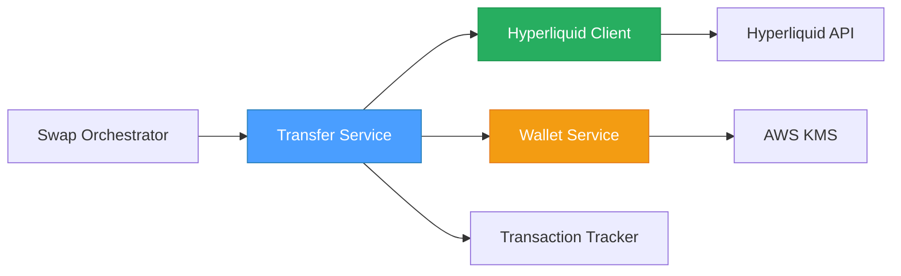
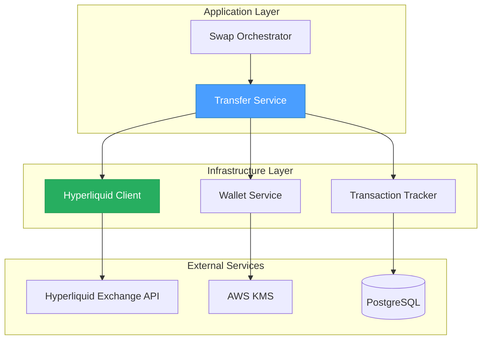
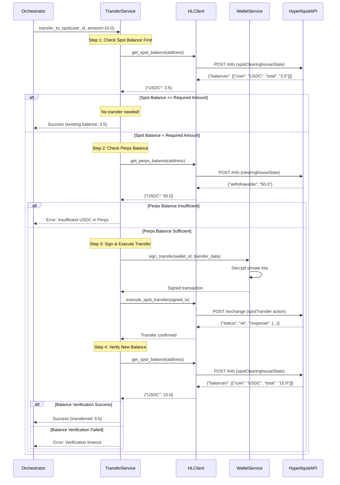
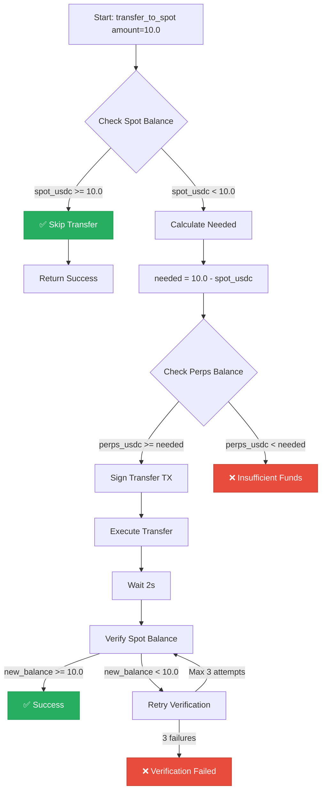

# 03 - Hyperliquid Spot Transfer Specification

## 📋 Overview

### Purpose

This specification defines the asset transfer system between Hyperliquid's Perps (Perpetuals) and Spot accounts. After bridging assets from external chains to Hyperliquid, funds land in the Perps account by default. To execute spot market swaps, users must first transfer assets from Perps to Spot.

### Scope

- **Perps balance verification**: Check available USDC in Perps account
- **Spot balance verification**: Check current USDC in Spot account
- **Internal transfer**: Move USDC from Perps → Spot
- **Transfer confirmation**: Verify successful balance update
- **Optimization**: Skip transfer if Spot balance sufficient
- **Error handling**: Handle insufficient balance, API failures

### Key Objectives

1. ✅ Efficiently transfer USDC from Perps to Spot account
2. ✅ Verify balances before and after transfer
3. ✅ Minimize unnecessary transfers (check Spot first)
4. ✅ Handle transfer failures gracefully
5. ✅ Support transaction tracking and audit trail
6. ✅ Maintain high performance (< 2 seconds per transfer)

### Component Relationships



---

## 🏗️ Architecture Design

### System Architecture



### Transfer Flow Sequence



### Balance Verification Logic



---

## 💾 Database Schema

No new tables required for this component. Transfers are tracked as steps within existing `transactions` and `transaction_steps` tables (see [05_TRANSACTION_CONFIRMATION_TRACKING_SPEC.md](./05_TRANSACTION_CONFIRMATION_TRACKING_SPEC.md)).

### Transaction Step Metadata

```json
{
  "step_type": "spot_transfer",
  "from_account": "perps",
  "to_account": "spot",
  "token": "USDC",
  "amount_requested": "10.0",
  "amount_transferred": "6.5",
  "initial_spot_balance": "3.5",
  "final_spot_balance": "10.0",
  "initial_perps_balance": "50.0",
  "final_perps_balance": "43.5",
  "transfer_skipped": false,
  "verification_attempts": 1,
  "hyperliquid_tx_hash": "0xabc...",
  "timestamp": "2026-02-04T10:30:00Z"
}
```

---

## 🔧 Implementation Details

### Core Service: `HyperliquidTransferService`

```python
# src/app/application/services/hyperliquid_transfer_service.py
from decimal import Decimal
from typing import Optional, Dict, Any
from dataclasses import dataclass
from datetime import datetime, UTC
import asyncio

from app.infrastructure.adapters.external.hyperliquid_client import HyperliquidClient
from app.application.services.hyperliquid_wallet_service import HyperliquidWalletService


@dataclass
class TransferResult:
    """Result of spot transfer operation."""
    success: bool
    amount_transferred: Decimal
    final_spot_balance: Decimal
    transfer_skipped: bool
    error_message: Optional[str] = None
    metadata: Optional[Dict[str, Any]] = None


class InsufficientBalanceError(Exception):
    """Raised when Perps balance is insufficient for transfer."""
    pass


class TransferVerificationError(Exception):
    """Raised when post-transfer balance verification fails."""
    pass


class HyperliquidTransferService:
    """
    Service for managing internal transfers between Perps and Spot accounts.

    Responsibilities:
    - Check Perps and Spot balances
    - Execute internal transfers (Perps → Spot)
    - Verify successful transfer completion
    - Optimize by skipping unnecessary transfers

    Key Features:
    - Checks Spot balance first (optimization)
    - Only transfers the exact amount needed
    - Verifies balance after transfer with tolerance
    - Handles API failures gracefully
    """

    # Constants
    TRANSFER_VERIFICATION_TOLERANCE = Decimal("0.01")  # 0.01 USDC tolerance
    TRANSFER_VERIFICATION_RETRIES = 3
    TRANSFER_VERIFICATION_DELAY = 2  # seconds between retries

    def __init__(
        self,
        hyperliquid_client: HyperliquidClient,
        wallet_service: HyperliquidWalletService,
    ):
        self._hl_client = hyperliquid_client
        self._wallet_service = wallet_service

    async def transfer_to_spot(
        self,
        user_id: int,
        wallet_id: int,
        amount_required: Decimal,
        token: str = "USDC",
    ) -> TransferResult:
        """
        Transfer assets from Perps to Spot account.

        Optimization: Checks Spot balance first and only transfers if needed.

        Args:
            user_id: User identifier
            wallet_id: Hyperliquid wallet ID
            amount_required: Minimum amount needed in Spot (USDC)
            token: Token to transfer (default: "USDC")

        Returns:
            TransferResult with details of operation

        Raises:
            InsufficientBalanceError: If Perps balance < amount needed
            TransferVerificationError: If post-transfer verification fails

        Example:
            >>> result = await service.transfer_to_spot(
            ...     user_id=123,
            ...     wallet_id=456,
            ...     amount_required=Decimal("10.0")
            ... )
            >>> if result.success:
            ...     print(f"Ready to swap! Spot balance: {result.final_spot_balance}")
        """
        # Get wallet address
        wallet = await self._wallet_service.get_or_create_wallet(user_id, wallet_id)
        hl_address = wallet.hl_address

        # Step 1: Check current Spot balance (optimization)
        spot_balance = await self.get_spot_balance(hl_address, token)

        if spot_balance >= amount_required:
            # No transfer needed!
            return TransferResult(
                success=True,
                amount_transferred=Decimal("0"),
                final_spot_balance=spot_balance,
                transfer_skipped=True,
                metadata={
                    "reason": "spot_balance_sufficient",
                    "spot_balance": str(spot_balance),
                    "amount_required": str(amount_required),
                }
            )

        # Step 2: Calculate amount to transfer
        amount_to_transfer = amount_required - spot_balance

        # Step 3: Check Perps balance
        perps_balance = await self.get_perps_balance(hl_address, token)

        if perps_balance < amount_to_transfer:
            raise InsufficientBalanceError(
                f"Insufficient {token} in Perps account. "
                f"Required: {amount_to_transfer}, Available: {perps_balance}"
            )

        # Step 4: Execute transfer
        await self._execute_transfer(
            wallet_id=wallet_id,
            hl_address=hl_address,
            amount=amount_to_transfer,
            token=token,
        )

        # Step 5: Verify transfer success
        new_spot_balance = await self._verify_transfer(
            hl_address=hl_address,
            expected_balance=amount_required,
            token=token,
        )

        return TransferResult(
            success=True,
            amount_transferred=amount_to_transfer,
            final_spot_balance=new_spot_balance,
            transfer_skipped=False,
            metadata={
                "initial_spot_balance": str(spot_balance),
                "initial_perps_balance": str(perps_balance),
                "final_spot_balance": str(new_spot_balance),
            }
        )

    async def get_perps_balance(
        self,
        hl_address: str,
        token: str = "USDC",
    ) -> Decimal:
        """
        Get current balance in Perps account.

        Args:
            hl_address: Hyperliquid wallet address (0x...)
            token: Token symbol (default: "USDC")

        Returns:
            Balance in Decimal (e.g., Decimal("50.5"))

        Example:
            >>> balance = await service.get_perps_balance("0x123...")
            >>> print(f"Perps USDC: {balance}")
        """
        balances = await self._hl_client.get_perps_balance(hl_address)
        return Decimal(str(balances.get(token, 0)))

    async def get_spot_balance(
        self,
        hl_address: str,
        token: str = "USDC",
    ) -> Decimal:
        """
        Get current balance in Spot account.

        Args:
            hl_address: Hyperliquid wallet address (0x...)
            token: Token symbol (default: "USDC")

        Returns:
            Balance in Decimal (e.g., Decimal("3.5"))

        Example:
            >>> balance = await service.get_spot_balance("0x123...")
            >>> print(f"Spot USDC: {balance}")
        """
        balances = await self._hl_client.get_spot_balance(hl_address)
        return Decimal(str(balances.get(token, 0)))

    async def _execute_transfer(
        self,
        wallet_id: int,
        hl_address: str,
        amount: Decimal,
        token: str,
    ) -> None:
        """
        Execute internal transfer via Hyperliquid API.

        Args:
            wallet_id: Hyperliquid wallet ID (for signing)
            hl_address: Hyperliquid wallet address
            amount: Amount to transfer (USDC)
            token: Token symbol

        Raises:
            TransferExecutionError: If API call fails
        """
        # Build transfer action payload
        transfer_action = {
            "type": "spotTransfer",
            "hyperliquidChain": "Mainnet",
            "signatureChainId": "0xa4b1",  # Arbitrum chain ID
            "isDeposit": True,  # Perps → Spot = deposit to Spot
            "usdcSize": str(amount),
        }

        # Sign the transaction with user's HL wallet
        signature = await self._wallet_service.sign_transaction(
            wallet_id=wallet_id,
            tx_data=transfer_action,
        )

        # Execute via Hyperliquid API
        response = await self._hl_client._client.post(
            "/exchange",
            json={
                "action": transfer_action,
                "nonce": int(datetime.now(UTC).timestamp() * 1000),
                "signature": signature,
                "vaultAddress": None,  # Not using vault
            }
        )
        response.raise_for_status()

        result = response.json()

        # Check for errors
        if result.get("status") != "ok":
            error_msg = result.get("response", {}).get("error", "Unknown error")
            raise TransferExecutionError(f"Transfer failed: {error_msg}")

    async def _verify_transfer(
        self,
        hl_address: str,
        expected_balance: Decimal,
        token: str,
    ) -> Decimal:
        """
        Verify that Spot balance reflects the transfer.

        Retries up to 3 times with 2-second delay between attempts.
        Allows small tolerance (0.01 USDC) for rounding differences.

        Args:
            hl_address: Hyperliquid wallet address
            expected_balance: Expected minimum balance after transfer
            token: Token symbol

        Returns:
            Actual Spot balance after transfer

        Raises:
            TransferVerificationError: If balance not updated after retries
        """
        for attempt in range(self.TRANSFER_VERIFICATION_RETRIES):
            if attempt > 0:
                # Wait before retry
                await asyncio.sleep(self.TRANSFER_VERIFICATION_DELAY)

            # Check current balance
            current_balance = await self.get_spot_balance(hl_address, token)

            # Allow small tolerance for rounding
            if current_balance >= (expected_balance - self.TRANSFER_VERIFICATION_TOLERANCE):
                return current_balance

        # All retries exhausted
        raise TransferVerificationError(
            f"Transfer verification failed after {self.TRANSFER_VERIFICATION_RETRIES} attempts. "
            f"Expected: {expected_balance}, Current: {current_balance}"
        )


class TransferExecutionError(Exception):
    """Raised when transfer execution fails."""
    pass
```

### Integration with Existing `HyperliquidClient`

The existing `HyperliquidClient` (lines 471-595) already implements the required balance methods:

```python
# src/app/infrastructure/adapters/external/hyperliquid_client.py:471-595

async def get_perps_balance(self, address: str) -> dict[str, float]:
    """Get user's Perps account balance."""
    # Already implemented - returns {"USDC": 100.5}

async def get_spot_balance(self, address: str) -> dict[str, float]:
    """Get user's Spot account balance."""
    # Already implemented - returns {"USDC": 50.0, "PURR": 10000.0}

async def get_all_balances(self, address: str) -> dict[str, dict[str, float]]:
    """Get complete Hyperliquid balances (Perps + Spot)."""
    # Already implemented - returns both accounts
```

**No changes needed to `HyperliquidClient`** - we reuse existing methods.

---

## 🔌 API Contract

### Hyperliquid Exchange API: `spotTransfer` Action

#### Request Format

```http
POST https://api.hyperliquid.xyz/exchange
Content-Type: application/json

{
  "action": {
    "type": "spotTransfer",
    "hyperliquidChain": "Mainnet",
    "signatureChainId": "0xa4b1",  // Arbitrum chain ID
    "isDeposit": true,  // true = Perps → Spot, false = Spot → Perps
    "usdcSize": "10.5"  // Amount to transfer (string for precision)
  },
  "nonce": 1738664400000,  // Unix timestamp in milliseconds
  "signature": "0xabc123...",  // EIP-712 signature
  "vaultAddress": null  // Not using vault (user wallet)
}
```

#### Response Format

**Success Response**:
```json
{
  "status": "ok",
  "response": {
    "type": "spotTransfer",
    "data": {
      "statuses": [
        {
          "status": "success"
        }
      ]
    }
  }
}
```

**Error Response**:
```json
{
  "status": "err",
  "response": {
    "error": "Insufficient balance in perps account"
  }
}
```

#### Error Codes

| Error Code | Description | Recovery Action |
|------------|-------------|-----------------|
| `insufficient_balance` | Not enough USDC in Perps | Show user Perps balance |
| `rate_limited` | Too many requests | Retry after 1 second |
| `invalid_signature` | Signature verification failed | Regenerate signature |
| `server_error` | Hyperliquid API error | Retry after 5 seconds |

---

## 🧪 Test Cases

### Unit Tests

```python
# tests/unit/services/test_hyperliquid_transfer_service.py
import pytest
from decimal import Decimal
from unittest.mock import AsyncMock, MagicMock

from app.application.services.hyperliquid_transfer_service import (
    HyperliquidTransferService,
    TransferResult,
    InsufficientBalanceError,
    TransferVerificationError,
)


@pytest.fixture
def transfer_service():
    """Create transfer service with mocked dependencies."""
    hl_client = AsyncMock()
    wallet_service = AsyncMock()

    return HyperliquidTransferService(
        hyperliquid_client=hl_client,
        wallet_service=wallet_service,
    )


@pytest.mark.asyncio
async def test_transfer_skipped_when_spot_balance_sufficient(transfer_service):
    """Test that transfer is skipped if Spot already has enough USDC."""
    # Arrange
    transfer_service._hl_client.get_spot_balance = AsyncMock(
        return_value={"USDC": 15.0}  # Already have 15 USDC
    )
    transfer_service._wallet_service.get_or_create_wallet = AsyncMock(
        return_value=MagicMock(hl_address="0x123...")
    )

    # Act
    result = await transfer_service.transfer_to_spot(
        user_id=123,
        wallet_id=456,
        amount_required=Decimal("10.0"),  # Need 10, have 15
    )

    # Assert
    assert result.success is True
    assert result.transfer_skipped is True
    assert result.amount_transferred == Decimal("0")
    assert result.final_spot_balance == Decimal("15.0")
    transfer_service._hl_client.get_perps_balance.assert_not_called()


@pytest.mark.asyncio
async def test_transfer_executes_only_needed_amount(transfer_service):
    """Test that only the exact amount needed is transferred."""
    # Arrange
    transfer_service._wallet_service.get_or_create_wallet = AsyncMock(
        return_value=MagicMock(hl_address="0x123...", id=456)
    )
    transfer_service._hl_client.get_spot_balance = AsyncMock(
        return_value={"USDC": 3.5}  # Have 3.5 USDC in Spot
    )
    transfer_service._hl_client.get_perps_balance = AsyncMock(
        return_value={"USDC": 50.0}  # Have 50 USDC in Perps
    )
    transfer_service._execute_transfer = AsyncMock()
    transfer_service._verify_transfer = AsyncMock(
        return_value=Decimal("10.0")
    )

    # Act
    result = await transfer_service.transfer_to_spot(
        user_id=123,
        wallet_id=456,
        amount_required=Decimal("10.0"),  # Need 10 total
    )

    # Assert
    assert result.success is True
    assert result.amount_transferred == Decimal("6.5")  # Only transfer difference
    assert result.final_spot_balance == Decimal("10.0")
    transfer_service._execute_transfer.assert_called_once_with(
        wallet_id=456,
        hl_address="0x123...",
        amount=Decimal("6.5"),
        token="USDC",
    )


@pytest.mark.asyncio
async def test_insufficient_perps_balance_raises_error(transfer_service):
    """Test that error is raised if Perps balance is insufficient."""
    # Arrange
    transfer_service._wallet_service.get_or_create_wallet = AsyncMock(
        return_value=MagicMock(hl_address="0x123...")
    )
    transfer_service._hl_client.get_spot_balance = AsyncMock(
        return_value={"USDC": 0.0}  # No USDC in Spot
    )
    transfer_service._hl_client.get_perps_balance = AsyncMock(
        return_value={"USDC": 5.0}  # Only 5 USDC in Perps
    )

    # Act & Assert
    with pytest.raises(InsufficientBalanceError) as exc_info:
        await transfer_service.transfer_to_spot(
            user_id=123,
            wallet_id=456,
            amount_required=Decimal("10.0"),  # Need 10, only have 5
        )

    assert "Insufficient USDC in Perps account" in str(exc_info.value)
    assert "Required: 10.0" in str(exc_info.value)
    assert "Available: 5.0" in str(exc_info.value)


@pytest.mark.asyncio
async def test_verification_retries_on_balance_mismatch(transfer_service):
    """Test that verification retries if balance not updated immediately."""
    # Arrange
    transfer_service._wallet_service.get_or_create_wallet = AsyncMock(
        return_value=MagicMock(hl_address="0x123...", id=456)
    )
    transfer_service._hl_client.get_spot_balance = AsyncMock(
        side_effect=[
            {"USDC": 0.0},      # Initial check
            {"USDC": 0.0},      # First verification (not updated yet)
            {"USDC": 0.0},      # Second verification (still not updated)
            {"USDC": 10.0},     # Third verification (success!)
        ]
    )
    transfer_service._hl_client.get_perps_balance = AsyncMock(
        return_value={"USDC": 50.0}
    )
    transfer_service._execute_transfer = AsyncMock()

    # Act
    result = await transfer_service.transfer_to_spot(
        user_id=123,
        wallet_id=456,
        amount_required=Decimal("10.0"),
    )

    # Assert
    assert result.success is True
    assert transfer_service._hl_client.get_spot_balance.call_count == 4


@pytest.mark.asyncio
async def test_verification_accepts_small_tolerance(transfer_service):
    """Test that small rounding differences are tolerated."""
    # Arrange
    transfer_service._wallet_service.get_or_create_wallet = AsyncMock(
        return_value=MagicMock(hl_address="0x123...", id=456)
    )
    transfer_service._hl_client.get_spot_balance = AsyncMock(
        side_effect=[
            {"USDC": 0.0},      # Initial check
            {"USDC": 9.995},    # Verification: 9.995 (within 0.01 tolerance)
        ]
    )
    transfer_service._hl_client.get_perps_balance = AsyncMock(
        return_value={"USDC": 50.0}
    )
    transfer_service._execute_transfer = AsyncMock()

    # Act
    result = await transfer_service.transfer_to_spot(
        user_id=123,
        wallet_id=456,
        amount_required=Decimal("10.0"),
    )

    # Assert
    assert result.success is True
    assert result.final_spot_balance == Decimal("9.995")  # Close enough!


@pytest.mark.asyncio
async def test_verification_failure_raises_error(transfer_service):
    """Test that error is raised if verification fails after all retries."""
    # Arrange
    transfer_service._wallet_service.get_or_create_wallet = AsyncMock(
        return_value=MagicMock(hl_address="0x123...", id=456)
    )
    transfer_service._hl_client.get_spot_balance = AsyncMock(
        side_effect=[
            {"USDC": 0.0},      # Initial check
            {"USDC": 0.0},      # Verification attempt 1
            {"USDC": 0.0},      # Verification attempt 2
            {"USDC": 0.0},      # Verification attempt 3 (all failed)
        ]
    )
    transfer_service._hl_client.get_perps_balance = AsyncMock(
        return_value={"USDC": 50.0}
    )
    transfer_service._execute_transfer = AsyncMock()

    # Act & Assert
    with pytest.raises(TransferVerificationError) as exc_info:
        await transfer_service.transfer_to_spot(
            user_id=123,
            wallet_id=456,
            amount_required=Decimal("10.0"),
        )

    assert "Transfer verification failed after 3 attempts" in str(exc_info.value)


@pytest.mark.asyncio
async def test_get_perps_balance_returns_decimal(transfer_service):
    """Test that Perps balance is returned as Decimal."""
    # Arrange
    transfer_service._hl_client.get_perps_balance = AsyncMock(
        return_value={"USDC": 50.5}
    )

    # Act
    balance = await transfer_service.get_perps_balance("0x123...")

    # Assert
    assert isinstance(balance, Decimal)
    assert balance == Decimal("50.5")


@pytest.mark.asyncio
async def test_get_spot_balance_returns_decimal(transfer_service):
    """Test that Spot balance is returned as Decimal."""
    # Arrange
    transfer_service._hl_client.get_spot_balance = AsyncMock(
        return_value={"USDC": 10.25}
    )

    # Act
    balance = await transfer_service.get_spot_balance("0x123...")

    # Assert
    assert isinstance(balance, Decimal)
    assert balance == Decimal("10.25")
```

### Integration Tests

```python
# tests/integration/test_transfer_service_integration.py
import pytest
from decimal import Decimal

from app.application.services.hyperliquid_transfer_service import HyperliquidTransferService
from tests.factories import UserFactory, WalletFactory


@pytest.mark.integration
@pytest.mark.asyncio
async def test_end_to_end_spot_transfer(
    db_session,
    hyperliquid_client,
    wallet_service,
):
    """Test complete transfer flow with real Hyperliquid testnet."""
    # Arrange
    user = UserFactory.create()
    wallet = WalletFactory.create(user_id=user.id)

    service = HyperliquidTransferService(
        hyperliquid_client=hyperliquid_client,
        wallet_service=wallet_service,
    )

    # Act
    result = await service.transfer_to_spot(
        user_id=user.id,
        wallet_id=wallet.id,
        amount_required=Decimal("10.0"),
    )

    # Assert
    assert result.success is True
    assert result.final_spot_balance >= Decimal("10.0")

    # Verify balance on Hyperliquid
    hl_wallet = await wallet_service.get_or_create_wallet(user.id, wallet.id)
    actual_balance = await service.get_spot_balance(hl_wallet.hl_address)
    assert actual_balance >= Decimal("10.0")


@pytest.mark.integration
@pytest.mark.asyncio
async def test_transfer_optimization_skips_unnecessary_transfer(
    hyperliquid_client,
    wallet_service,
):
    """Test that transfer is skipped when Spot balance is already sufficient."""
    # Arrange
    user = UserFactory.create()
    wallet = WalletFactory.create(user_id=user.id)

    service = HyperliquidTransferService(
        hyperliquid_client=hyperliquid_client,
        wallet_service=wallet_service,
    )

    # First transfer to get funds in Spot
    await service.transfer_to_spot(
        user_id=user.id,
        wallet_id=wallet.id,
        amount_required=Decimal("20.0"),
    )

    # Act: Request only 10 USDC (should skip)
    result = await service.transfer_to_spot(
        user_id=user.id,
        wallet_id=wallet.id,
        amount_required=Decimal("10.0"),
    )

    # Assert
    assert result.success is True
    assert result.transfer_skipped is True
    assert result.amount_transferred == Decimal("0")
```

---

## ⚡ Performance Benchmarks

### Target SLAs

| Operation | Target | Acceptable | Unacceptable |
|-----------|--------|------------|--------------|
| Get Perps balance | < 200ms | < 500ms | > 1s |
| Get Spot balance | < 200ms | < 500ms | > 1s |
| Execute transfer | < 1s | < 2s | > 5s |
| Verify transfer | < 500ms | < 1s | > 3s |
| **Total transfer operation** | **< 2s** | **< 3s** | **> 5s** |

### Optimization Strategies

#### 1. Check Spot Balance First
```python
# GOOD: Check Spot before Perps (saves API call)
spot_balance = await self.get_spot_balance(address)
if spot_balance >= amount_required:
    return TransferResult(transfer_skipped=True)

# BAD: Always check both accounts
perps_balance = await self.get_perps_balance(address)
spot_balance = await self.get_spot_balance(address)
```

#### 2. Parallel Balance Checks (When Needed)
```python
# When both checks are required, do them in parallel
perps_task = asyncio.create_task(self.get_perps_balance(address))
spot_task = asyncio.create_task(self.get_spot_balance(address))

perps_balance = await perps_task
spot_balance = await spot_task
```

#### 3. Caching Spot Balance (Optional)
```python
# Cache Spot balance for 30 seconds to avoid redundant checks
cache_key = f"hl_spot_balance:{address}:{token}"
cached = await redis.get(cache_key)
if cached:
    return Decimal(cached)

balance = await self._hl_client.get_spot_balance(address)
await redis.set(cache_key, str(balance), ex=30)
return balance
```

### Performance Testing

```python
# tests/performance/test_transfer_performance.py
import pytest
import time
from decimal import Decimal


@pytest.mark.performance
@pytest.mark.asyncio
async def test_transfer_completes_within_2_seconds(transfer_service):
    """Test that transfer operation completes within SLA."""
    start = time.time()

    result = await transfer_service.transfer_to_spot(
        user_id=123,
        wallet_id=456,
        amount_required=Decimal("10.0"),
    )

    elapsed = time.time() - start

    assert result.success is True
    assert elapsed < 2.0, f"Transfer took {elapsed:.2f}s (target: < 2s)"


@pytest.mark.performance
@pytest.mark.asyncio
async def test_spot_balance_check_completes_within_500ms(transfer_service):
    """Test that balance check is fast."""
    start = time.time()

    balance = await transfer_service.get_spot_balance("0x123...")

    elapsed = time.time() - start

    assert elapsed < 0.5, f"Balance check took {elapsed:.3f}s (target: < 500ms)"
```

---

## 🚨 Error Scenarios & Recovery

### Error Scenario 1: Insufficient Perps Balance

**Trigger**: User requests 10 USDC swap, but only has 5 USDC in Perps.

**Error Message**:
```
Insufficient USDC in Perps account. Required: 10.0, Available: 5.0
Suggestion: Bridge more USDC to Hyperliquid or reduce swap amount.
```

**Recovery Action**:
1. Show user their current Perps balance
2. Suggest bridging more funds
3. Allow user to modify swap amount

**Code**:
```python
try:
    result = await transfer_service.transfer_to_spot(
        user_id=user_id,
        wallet_id=wallet_id,
        amount_required=Decimal("10.0"),
    )
except InsufficientBalanceError as e:
    return {
        "error": "insufficient_balance",
        "message": str(e),
        "balances": {
            "perps_usdc": await transfer_service.get_perps_balance(hl_address),
            "spot_usdc": await transfer_service.get_spot_balance(hl_address),
        },
        "actions": ["bridge_more", "reduce_amount"]
    }
```

---

### Error Scenario 2: Transfer API Failure

**Trigger**: Hyperliquid API returns 500 error during transfer.

**Error Message**:
```
Transfer failed due to Hyperliquid API error. Please try again.
```

**Recovery Action**:
1. Wait 5 seconds
2. Retry transfer (max 2 retries)
3. If still fails, notify user and log error

**Code**:
```python
async def transfer_to_spot_with_retry(self, user_id, wallet_id, amount_required):
    """Transfer with automatic retry on API failure."""
    max_retries = 2

    for attempt in range(max_retries + 1):
        try:
            return await self.transfer_to_spot(user_id, wallet_id, amount_required)
        except TransferExecutionError as e:
            if attempt < max_retries:
                await asyncio.sleep(5)  # Wait before retry
                continue
            else:
                # All retries exhausted
                raise
```

---

### Error Scenario 3: Verification Timeout

**Trigger**: Transfer executed but Spot balance not updated after 3 retries.

**Error Message**:
```
Transfer submitted but verification timed out.
Your funds are safe. Please check your Spot balance in 1 minute.
```

**Recovery Action**:
1. Mark transaction as "pending_verification"
2. Schedule background job to recheck balance in 1 minute
3. Notify user when verification completes

**Code**:
```python
try:
    result = await transfer_service.transfer_to_spot(...)
except TransferVerificationError:
    # Schedule background verification
    await celery.send_task(
        "verify_spot_balance",
        args=[user_id, wallet_id, amount_required],
        countdown=60,  # Check in 1 minute
    )

    return {
        "status": "pending_verification",
        "message": "Transfer submitted. Verification in progress...",
    }
```

---

### Error Scenario 4: Rate Limiting

**Trigger**: Too many transfer requests in short time.

**Error Message**:
```
Rate limit exceeded. Please wait 10 seconds before trying again.
```

**Recovery Action**:
1. Wait 10 seconds
2. Retry automatically
3. Update user with countdown

**Code**:
```python
try:
    result = await transfer_service.transfer_to_spot(...)
except RateLimitError:
    await asyncio.sleep(10)
    # Retry
    result = await transfer_service.transfer_to_spot(...)
```

---

## 🔐 Security Considerations

### Private Key Protection

- **Never log private keys**: Transfer service never accesses raw keys
- **Use WalletService for signing**: All signing done through secure service
- **Audit all transfers**: Log user_id, amount, timestamp for every transfer

### Transaction Validation

```python
# Validate amount before transfer
def validate_transfer_amount(amount: Decimal) -> None:
    """Validate transfer amount is within reasonable bounds."""
    MIN_TRANSFER = Decimal("0.01")  # 0.01 USDC minimum
    MAX_TRANSFER = Decimal("100000")  # 100k USDC maximum

    if amount < MIN_TRANSFER:
        raise ValueError(f"Transfer amount too small: {amount}")

    if amount > MAX_TRANSFER:
        raise ValueError(f"Transfer amount too large: {amount}")
```

### Rate Limiting

```python
# Limit transfers per user per minute
from redis import Redis

async def check_transfer_rate_limit(user_id: int) -> bool:
    """Check if user has exceeded transfer rate limit."""
    redis = Redis()
    key = f"transfer_rate_limit:{user_id}"

    count = await redis.incr(key)
    if count == 1:
        await redis.expire(key, 60)  # 1 minute window

    MAX_TRANSFERS_PER_MINUTE = 10

    if count > MAX_TRANSFERS_PER_MINUTE:
        raise RateLimitError("Too many transfer requests")

    return True
```

---

## 🔗 References

### Related Code Files

- **Hyperliquid Client**: `src/app/infrastructure/adapters/external/hyperliquid_client.py:471-595`
- **Wallet Service**: `src/app/application/services/hyperliquid_wallet_service.py` (from [01_HYPERLIQUID_WALLET_MANAGEMENT_SPEC.md](./01_HYPERLIQUID_WALLET_MANAGEMENT_SPEC.md))
- **Swap Workflow Agent**: `src/app/infrastructure/adapters/agent_squad/agents/workflows/swap_workflow_agent.py:331-1630`

### External Documentation

- **Hyperliquid API**: https://hyperliquid.gitbook.io/hyperliquid-docs/for-developers/api
- **Spot Transfer Action**: https://hyperliquid.gitbook.io/hyperliquid-docs/for-developers/api/exchange-endpoint#spot-transfer

### Related Specifications

- [01_HYPERLIQUID_WALLET_MANAGEMENT_SPEC.md](./01_HYPERLIQUID_WALLET_MANAGEMENT_SPEC.md) - Wallet generation and signing
- [04_HYPERLIQUID_SPOT_SWAP_SPEC.md](./04_HYPERLIQUID_SPOT_SWAP_SPEC.md) - Uses transferred funds for swaps
- [05_TRANSACTION_CONFIRMATION_TRACKING_SPEC.md](./05_TRANSACTION_CONFIRMATION_TRACKING_SPEC.md) - Tracks transfer steps
- [06_END_TO_END_INTEGRATION_SPEC.md](./06_END_TO_END_INTEGRATION_SPEC.md) - Orchestrates full workflow

---

## ✅ Implementation Checklist

- [ ] Implement `HyperliquidTransferService` with all methods
- [ ] Add `transfer_to_spot` method with optimization logic
- [ ] Implement `_execute_transfer` with Hyperliquid API integration
- [ ] Implement `_verify_transfer` with retry logic
- [ ] Add balance check methods (`get_perps_balance`, `get_spot_balance`)
- [ ] Write unit tests (9 test cases)
- [ ] Write integration tests (2 test scenarios)
- [ ] Add performance tests (target: < 2s)
- [ ] Implement error handling for all failure modes
- [ ] Add rate limiting for transfer requests
- [ ] Set up monitoring dashboards (transfer latency, success rate)
- [ ] Document transfer limits and constraints
- [ ] Security review and validation

---

**Document Version**: 1.0
**Last Updated**: 2026-02-04
**Status**: ✅ Ready for Implementation
**Estimated Implementation Time**: 3 hours
