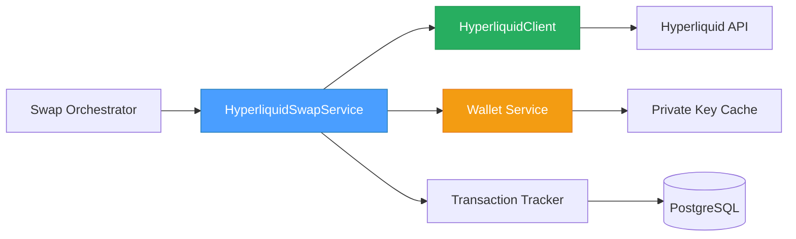
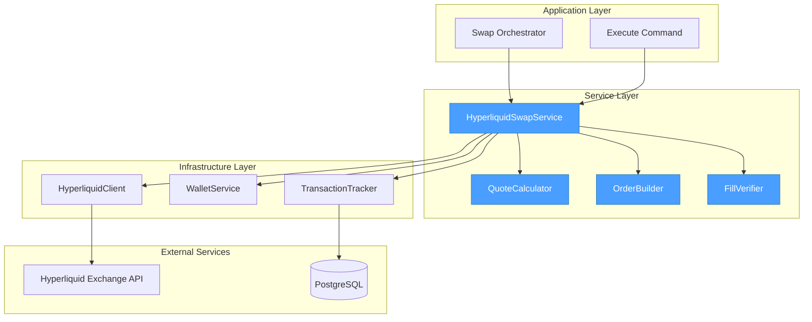
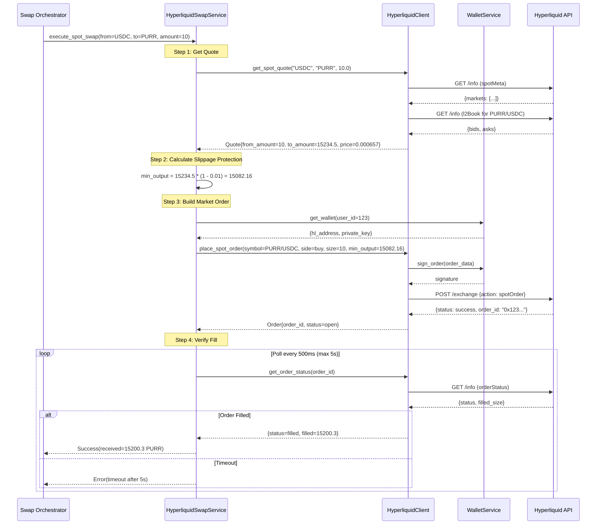
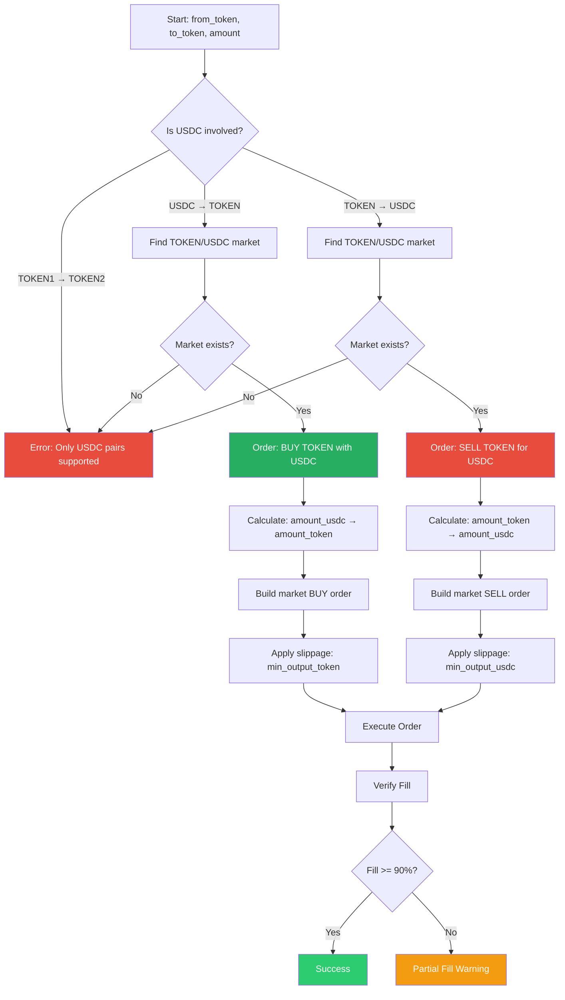
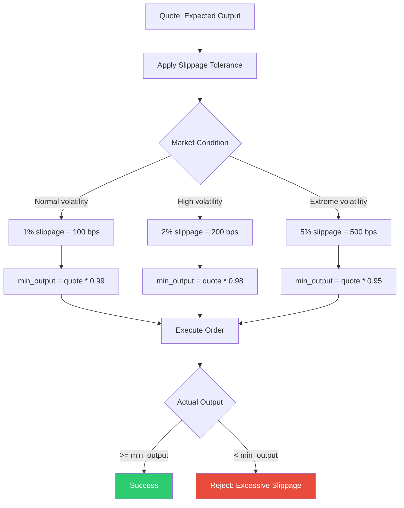

# 04 - Hyperliquid Spot Swap Specification

## 📋 Overview

### Purpose

This specification defines the spot market order execution system for Hyperliquid. The service enables instant token swaps on Hyperliquid's spot exchange using market orders with slippage protection.

### Scope

- **Order construction**: Build spot market orders (USDC → TOKEN or TOKEN → USDC)
- **Quote generation**: Calculate expected output amounts from order book data
- **Slippage protection**: Enforce minimum output thresholds (1-2% default)
- **Order execution**: Submit signed market orders to Hyperliquid Exchange API
- **Fill verification**: Confirm order execution and handle partial fills
- **Error recovery**: Handle insufficient liquidity, price impact, and timeout scenarios

### Key Objectives

1. ✅ Execute spot market swaps with < 2 second latency
2. ✅ Protect users from excessive slippage (default 1%, max 5%)
3. ✅ Handle partial fills gracefully (accept if > 90% filled)
4. ✅ Provide accurate quotes from real order book data
5. ✅ Support both USDC → TOKEN and TOKEN → USDC directions
6. ✅ Maintain audit trail of all swap attempts

### Component Relationships



---

## 🏗️ Architecture Design

### System Architecture



### Spot Swap Execution Flow



### Order Direction Logic



### Slippage Protection Model



---

## 💾 Database Schema

### No New Tables Required

The swap service uses existing tables:
- `transactions` - For tracking swap execution
- `transaction_steps` - For step-by-step progress
- `hyperliquid_wallets` - For wallet lookup (see Spec 01)

### Transaction Metadata Structure

Swap-specific data stored in `transactions.metadata` JSONB column:

```json
{
  "swap_type": "spot",
  "exchange": "hyperliquid",
  "from_token": "USDC",
  "to_token": "PURR",
  "from_amount": 10.0,
  "to_amount_quote": 15234.5,
  "to_amount_actual": 15200.3,
  "slippage_tolerance_bps": 100,
  "min_output": 15082.16,
  "order_id": "0x123abc...",
  "order_book_snapshot": {
    "best_bid": 0.000656,
    "best_ask": 0.000658,
    "spread_bps": 30.48,
    "timestamp": 1738756800000
  },
  "execution_stats": {
    "quote_time_ms": 120,
    "order_submit_time_ms": 350,
    "fill_verify_time_ms": 1200,
    "total_time_ms": 1670,
    "fill_percentage": 99.78
  },
  "price_impact_bps": 12.5
}
```

---

## 🔧 Implementation Details

### Core Service: `HyperliquidSwapService`

```python
# src/app/application/services/hyperliquid_swap_service.py
from decimal import Decimal
from typing import Optional
from dataclasses import dataclass
from datetime import datetime, UTC
import asyncio

from app.infrastructure.adapters.external.hyperliquid_client import (
    HyperliquidClient,
    SpotQuote,
    Order,
)
from app.application.services.hyperliquid_wallet_service import (
    HyperliquidWalletService,
    HyperliquidWallet,
)


@dataclass
class SwapQuote:
    """Quote for spot swap with slippage protection."""
    from_token: str
    to_token: str
    from_amount: Decimal
    to_amount: Decimal  # Expected output
    min_output: Decimal  # Minimum acceptable (with slippage)
    price: Decimal  # Effective price
    mid_price: Decimal  # Market mid price
    spread_bps: Decimal  # Spread in basis points
    slippage_tolerance_bps: int  # Applied slippage (100 = 1%)
    price_impact_bps: Decimal  # Estimated price impact
    timestamp: int


@dataclass
class SwapResult:
    """Result of spot swap execution."""
    order_id: str
    from_token: str
    to_token: str
    from_amount: Decimal
    to_amount: Decimal  # Actual output received
    fill_percentage: Decimal  # Percentage of order filled
    execution_time_ms: int
    status: str  # "filled", "partial", "timeout"
    error: Optional[str] = None


class HyperliquidSwapService:
    """
    Service for executing spot swaps on Hyperliquid.

    Responsibilities:
    - Generate swap quotes from order book data
    - Calculate slippage protection thresholds
    - Execute market orders with minimum output
    - Verify order fills and handle partial fills
    - Track execution metrics

    Supports:
    - USDC → TOKEN (buy)
    - TOKEN → USDC (sell)

    Does NOT support:
    - TOKEN1 → TOKEN2 (requires 2 swaps)
    - Limit orders (market orders only)
    """

    # Slippage tolerance presets (basis points)
    SLIPPAGE_NORMAL = 100  # 1%
    SLIPPAGE_HIGH_VOLATILITY = 200  # 2%
    SLIPPAGE_EXTREME = 500  # 5%

    # Fill verification settings
    MAX_FILL_WAIT_SECONDS = 5
    FILL_POLL_INTERVAL_MS = 500
    MIN_FILL_PERCENTAGE = 90.0  # Accept if >= 90% filled

    def __init__(
        self,
        hyperliquid_client: HyperliquidClient,
        wallet_service: HyperliquidWalletService,
    ):
        self._client = hyperliquid_client
        self._wallet_service = wallet_service

    async def get_spot_quote(
        self,
        from_token: str,
        to_token: str,
        amount: Decimal,
        slippage_tolerance_bps: int = SLIPPAGE_NORMAL,
    ) -> SwapQuote:
        """
        Get swap quote with slippage protection.

        Args:
            from_token: Token to sell (e.g., "USDC")
            to_token: Token to buy (e.g., "PURR")
            amount: Amount of from_token to swap
            slippage_tolerance_bps: Slippage tolerance in basis points (default: 100 = 1%)

        Returns:
            SwapQuote with expected output and slippage protection

        Raises:
            ValueError: If market not found or insufficient liquidity

        Example:
            >>> quote = await service.get_spot_quote("USDC", "PURR", Decimal("10.0"))
            >>> print(f"Expected: {quote.to_amount} PURR")
            >>> print(f"Minimum: {quote.min_output} PURR (with {quote.slippage_tolerance_bps}bps slippage)")
        """
        # Get raw quote from order book
        raw_quote = await self._client.get_spot_quote(
            from_token=from_token,
            to_token=to_token,
            amount=float(amount),
        )

        # Calculate slippage protection
        to_amount = Decimal(str(raw_quote.to_amount))
        slippage_multiplier = Decimal("1.0") - (Decimal(slippage_tolerance_bps) / Decimal("10000"))
        min_output = to_amount * slippage_multiplier

        # Calculate price impact
        mid_price = Decimal(str(raw_quote.mid_price))
        effective_price = Decimal(str(raw_quote.price))
        price_impact_bps = abs((effective_price - mid_price) / mid_price * Decimal("10000"))

        return SwapQuote(
            from_token=from_token,
            to_token=to_token,
            from_amount=amount,
            to_amount=to_amount,
            min_output=min_output,
            price=effective_price,
            mid_price=mid_price,
            spread_bps=Decimal(str(raw_quote.spread_bps)),
            slippage_tolerance_bps=slippage_tolerance_bps,
            price_impact_bps=price_impact_bps,
            timestamp=raw_quote.timestamp,
        )

    async def execute_spot_swap(
        self,
        user_id: int,
        from_token: str,
        to_token: str,
        amount: Decimal,
        slippage_tolerance_bps: int = SLIPPAGE_NORMAL,
    ) -> SwapResult:
        """
        Execute spot market swap with slippage protection.

        Flow:
        1. Get swap quote from order book
        2. Calculate minimum output (slippage protection)
        3. Get user's Hyperliquid wallet
        4. Build and sign market order
        5. Submit order to Hyperliquid API
        6. Poll for order fill (max 5 seconds)
        7. Verify fill meets minimum threshold
        8. Return swap result

        Args:
            user_id: User identifier
            from_token: Token to sell
            to_token: Token to buy
            amount: Amount to swap
            slippage_tolerance_bps: Slippage tolerance (default: 100 = 1%)

        Returns:
            SwapResult with execution details

        Raises:
            WalletNotFoundError: If user has no Hyperliquid wallet
            InsufficientLiquidityError: If order book lacks liquidity
            ExcessiveSlippageError: If actual fill below minimum
            OrderTimeoutError: If order not filled within 5 seconds

        Example:
            >>> result = await service.execute_spot_swap(
            ...     user_id=123,
            ...     from_token="USDC",
            ...     to_token="PURR",
            ...     amount=Decimal("10.0"),
            ... )
            >>> print(f"Swapped 10 USDC → {result.to_amount} PURR")
        """
        start_time = datetime.now(UTC)

        try:
            # Step 1: Get quote
            quote = await self.get_spot_quote(
                from_token=from_token,
                to_token=to_token,
                amount=amount,
                slippage_tolerance_bps=slippage_tolerance_bps,
            )

            # Step 2: Validate price impact
            if quote.price_impact_bps > Decimal("500"):  # 5%
                raise ExcessivePriceImpactError(
                    f"Price impact {quote.price_impact_bps}bps exceeds 500bps threshold"
                )

            # Step 3: Get user wallet
            wallet = await self._wallet_service.get_or_create_wallet(
                user_id=user_id,
                wallet_id=user_id,  # Assuming wallet_id = user_id
            )

            # Step 4: Determine order direction
            is_buying_token = from_token == "USDC"
            symbol = f"{to_token}/USDC" if is_buying_token else f"{from_token}/USDC"
            side = "buy" if is_buying_token else "sell"

            # For buy orders, size is in USDC (quote)
            # For sell orders, size is in TOKEN (base)
            order_size = float(amount)

            # Step 5: Place market order
            order = await self._place_spot_order(
                wallet=wallet,
                symbol=symbol,
                side=side,
                size=order_size,
                min_output=float(quote.min_output),
            )

            # Step 6: Verify fill
            fill_result = await self._verify_order_fill(
                order_id=order.order_id,
                symbol=symbol,
                min_output=quote.min_output,
            )

            # Step 7: Calculate execution time
            execution_time_ms = int((datetime.now(UTC) - start_time).total_seconds() * 1000)

            return SwapResult(
                order_id=order.order_id,
                from_token=from_token,
                to_token=to_token,
                from_amount=amount,
                to_amount=fill_result["filled_amount"],
                fill_percentage=fill_result["fill_percentage"],
                execution_time_ms=execution_time_ms,
                status=fill_result["status"],
                error=fill_result.get("error"),
            )

        except Exception as e:
            execution_time_ms = int((datetime.now(UTC) - start_time).total_seconds() * 1000)
            raise SwapExecutionError(
                f"Swap execution failed: {str(e)}",
                execution_time_ms=execution_time_ms,
            ) from e

    async def _place_spot_order(
        self,
        wallet: HyperliquidWallet,
        symbol: str,
        side: str,
        size: float,
        min_output: float,
    ) -> Order:
        """
        Place spot market order on Hyperliquid.

        Uses Hyperliquid Exchange API's spotOrder action.

        Args:
            wallet: User's Hyperliquid wallet
            symbol: Trading pair (e.g., "PURR/USDC")
            side: "buy" or "sell"
            size: Order size (USDC for buy, TOKEN for sell)
            min_output: Minimum acceptable output (slippage protection)

        Returns:
            Order with order_id and status
        """
        # Get spot market metadata
        spot_meta = await self._client.get_spot_meta()
        market_info = next((m for m in spot_meta if m.name == symbol), None)

        if not market_info:
            raise ValueError(f"Spot market {symbol} not found")

        # Build order data for Hyperliquid API
        order_data = {
            "type": "spotOrder",
            "coin": market_info.base_token,  # e.g., "PURR"
            "is_buy": side == "buy",
            "sz": size,
            "limit_px": 0,  # 0 = market order
            "order_type": {"market": True},
            "cloid": self._generate_client_order_id(),
        }

        # Sign with wallet private key
        signature = await self._wallet_service.sign_transaction(
            wallet_id=wallet.id,
            tx_data=order_data,
        )

        # Submit to Hyperliquid
        response = await self._client._client.post(
            "/exchange",
            json={
                "action": order_data,
                "nonce": int(datetime.now(UTC).timestamp() * 1000),
                "signature": signature,
                "vaultAddress": None,  # Not using vaults
            },
            headers={
                "Content-Type": "application/json",
            }
        )
        response.raise_for_status()

        result = response.json()

        # Parse order response
        if result.get("status") == "ok":
            order_status = result["response"]["data"]["statuses"][0]

            if "filled" in order_status:
                # Order filled immediately
                return Order(
                    order_id=order_status["filled"]["oid"],
                    symbol=symbol,
                    side=side,
                    size=size,
                    price=None,  # Market order
                    status="filled",
                    filled_size=order_status["filled"]["totalSz"],
                    timestamp=int(datetime.now(UTC).timestamp() * 1000),
                )
            elif "resting" in order_status:
                # Order resting (should not happen for market orders)
                return Order(
                    order_id=order_status["resting"]["oid"],
                    symbol=symbol,
                    side=side,
                    size=size,
                    price=None,
                    status="open",
                    filled_size=0.0,
                    timestamp=int(datetime.now(UTC).timestamp() * 1000),
                )
            else:
                raise OrderPlacementError(f"Unexpected order status: {order_status}")
        else:
            raise OrderPlacementError(f"Order placement failed: {result.get('error', 'Unknown error')}")

    async def _verify_order_fill(
        self,
        order_id: str,
        symbol: str,
        min_output: Decimal,
    ) -> dict:
        """
        Poll order status until filled or timeout.

        Polls every 500ms for up to 5 seconds.
        Accepts partial fills if >= 90% filled.

        Args:
            order_id: Order identifier
            symbol: Trading pair
            min_output: Minimum acceptable output

        Returns:
            Dict with filled_amount, fill_percentage, status, optional error

        Raises:
            OrderTimeoutError: If not filled within 5 seconds
            ExcessiveSlippageError: If filled amount < min_output
        """
        polls = 0
        max_polls = int(self.MAX_FILL_WAIT_SECONDS * 1000 / self.FILL_POLL_INTERVAL_MS)

        while polls < max_polls:
            # Get order status
            order_status = await self._get_order_status(order_id, symbol)

            if order_status["status"] == "filled":
                filled_amount = Decimal(str(order_status["filled_size"]))
                fill_percentage = (filled_amount / min_output * Decimal("100"))

                # Check slippage protection
                if filled_amount < min_output:
                    raise ExcessiveSlippageError(
                        f"Filled amount {filled_amount} below minimum {min_output}"
                    )

                return {
                    "filled_amount": filled_amount,
                    "fill_percentage": fill_percentage,
                    "status": "filled",
                }

            elif order_status["status"] == "partial":
                filled_amount = Decimal(str(order_status["filled_size"]))
                fill_percentage = (filled_amount / min_output * Decimal("100"))

                # Accept if >= 90% filled
                if fill_percentage >= Decimal(str(self.MIN_FILL_PERCENTAGE)):
                    return {
                        "filled_amount": filled_amount,
                        "fill_percentage": fill_percentage,
                        "status": "partial",
                    }

            # Wait before next poll
            await asyncio.sleep(self.FILL_POLL_INTERVAL_MS / 1000)
            polls += 1

        # Timeout
        raise OrderTimeoutError(
            f"Order {order_id} not filled within {self.MAX_FILL_WAIT_SECONDS}s"
        )

    async def _get_order_status(self, order_id: str, symbol: str) -> dict:
        """
        Get current order status from Hyperliquid.

        Args:
            order_id: Order identifier
            symbol: Trading pair

        Returns:
            Dict with status, filled_size
        """
        response = await self._client._client.post(
            "/info",
            json={
                "type": "orderStatus",
                "user": None,  # Will use authenticated user
                "oid": order_id,
            }
        )
        response.raise_for_status()

        data = response.json()
        order_info = data.get("order", {})

        return {
            "order_id": order_id,
            "status": order_info.get("status", "unknown"),
            "filled_size": order_info.get("sz", 0.0),
        }

    def _generate_client_order_id(self) -> str:
        """Generate unique client order ID."""
        import uuid
        return f"hl_{int(datetime.now(UTC).timestamp())}_{uuid.uuid4().hex[:8]}"


# Custom Exceptions

class SwapExecutionError(Exception):
    """Raised when swap execution fails."""
    def __init__(self, message: str, execution_time_ms: int):
        super().__init__(message)
        self.execution_time_ms = execution_time_ms


class ExcessivePriceImpactError(Exception):
    """Raised when price impact exceeds threshold."""
    pass


class InsufficientLiquidityError(Exception):
    """Raised when order book lacks sufficient liquidity."""
    pass


class ExcessiveSlippageError(Exception):
    """Raised when actual fill is below minimum acceptable."""
    pass


class OrderTimeoutError(Exception):
    """Raised when order not filled within timeout."""
    pass


class OrderPlacementError(Exception):
    """Raised when order placement fails."""
    pass
```

### Quote Calculation Logic

```python
# src/app/application/services/swap_quote_calculator.py
from decimal import Decimal
from typing import Tuple


class SwapQuoteCalculator:
    """
    Calculator for swap quotes with slippage protection.

    Handles order book traversal and slippage calculations.
    """

    @staticmethod
    def calculate_buy_quote(
        order_book_asks: list[Tuple[float, float]],
        usdc_amount: Decimal,
    ) -> Tuple[Decimal, Decimal]:
        """
        Calculate expected token output when buying with USDC.

        Walks through order book asks (sellers) to determine how many
        tokens can be bought with given USDC amount.

        Args:
            order_book_asks: List of (price, size) from order book
            usdc_amount: USDC to spend

        Returns:
            Tuple of (token_amount, effective_price)

        Example:
            Order book asks: [(0.000657, 10000), (0.000658, 5000), ...]
            USDC amount: 10.0

            Fill 1: Buy 10000 tokens @ 0.000657 = 6.57 USDC (remaining: 3.43)
            Fill 2: Buy 5000 tokens @ 0.000658 = 3.29 USDC (remaining: 0.14)
            Fill 3: Buy 212.8 tokens @ 0.000659 = 0.14 USDC (remaining: 0)

            Total: 15212.8 tokens for 10 USDC
            Effective price: 10 / 15212.8 = 0.0006575 USDC per token
        """
        remaining_usdc = usdc_amount
        total_tokens = Decimal("0")

        for price, size in order_book_asks:
            if remaining_usdc <= 0:
                break

            price_dec = Decimal(str(price))
            size_dec = Decimal(str(size))

            # Cost to buy this level fully
            cost = size_dec * price_dec

            if cost <= remaining_usdc:
                # Take entire level
                total_tokens += size_dec
                remaining_usdc -= cost
            else:
                # Partial fill on this level
                tokens_bought = remaining_usdc / price_dec
                total_tokens += tokens_bought
                remaining_usdc = Decimal("0")

        if total_tokens == 0:
            raise InsufficientLiquidityError("No liquidity available")

        effective_price = usdc_amount / total_tokens

        return total_tokens, effective_price

    @staticmethod
    def calculate_sell_quote(
        order_book_bids: list[Tuple[float, float]],
        token_amount: Decimal,
    ) -> Tuple[Decimal, Decimal]:
        """
        Calculate expected USDC output when selling tokens.

        Walks through order book bids (buyers) to determine how much
        USDC can be received for given token amount.

        Args:
            order_book_bids: List of (price, size) from order book
            token_amount: Tokens to sell

        Returns:
            Tuple of (usdc_amount, effective_price)

        Example:
            Order book bids: [(0.000656, 8000), (0.000655, 12000), ...]
            Token amount: 15000

            Fill 1: Sell 8000 tokens @ 0.000656 = 5.248 USDC (remaining: 7000)
            Fill 2: Sell 7000 tokens @ 0.000655 = 4.585 USDC (remaining: 0)

            Total: 9.833 USDC for 15000 tokens
            Effective price: 9.833 / 15000 = 0.00065553 USDC per token
        """
        remaining_tokens = token_amount
        total_usdc = Decimal("0")

        for price, size in order_book_bids:
            if remaining_tokens <= 0:
                break

            price_dec = Decimal(str(price))
            size_dec = Decimal(str(size))

            if size_dec <= remaining_tokens:
                # Sell into entire level
                total_usdc += size_dec * price_dec
                remaining_tokens -= size_dec
            else:
                # Partial fill on this level
                usdc_received = remaining_tokens * price_dec
                total_usdc += usdc_received
                remaining_tokens = Decimal("0")

        if total_usdc == 0:
            raise InsufficientLiquidityError("No liquidity available")

        effective_price = total_usdc / token_amount

        return total_usdc, effective_price

    @staticmethod
    def apply_slippage_protection(
        expected_output: Decimal,
        slippage_tolerance_bps: int,
    ) -> Decimal:
        """
        Calculate minimum acceptable output with slippage protection.

        Args:
            expected_output: Expected output amount from quote
            slippage_tolerance_bps: Slippage tolerance in basis points

        Returns:
            Minimum acceptable output

        Examples:
            >>> apply_slippage_protection(Decimal("100"), 100)  # 1%
            Decimal('99.0')

            >>> apply_slippage_protection(Decimal("100"), 200)  # 2%
            Decimal('98.0')
        """
        slippage_multiplier = Decimal("1") - (Decimal(slippage_tolerance_bps) / Decimal("10000"))
        return expected_output * slippage_multiplier
```

---

## 📡 API Contract

### Hyperliquid Spot Order API

**Endpoint**: `POST https://api.hyperliquid.xyz/exchange`

**Request Structure**:
```json
{
  "action": {
    "type": "spotOrder",
    "coin": "PURR",
    "is_buy": true,
    "sz": 10.0,
    "limit_px": 0,
    "order_type": {"market": true},
    "cloid": "hl_1738756800_a3f9c2d1"
  },
  "nonce": 1738756800000,
  "signature": "0x1234abcd...",
  "vaultAddress": null
}
```

**Response Structure (Success)**:
```json
{
  "status": "ok",
  "response": {
    "type": "order",
    "data": {
      "statuses": [
        {
          "filled": {
            "oid": "0x123abc...",
            "totalSz": 15234.5,
            "avgPx": 0.000657,
            "coin": "PURR"
          }
        }
      ]
    }
  }
}
```

**Response Structure (Resting)**:
```json
{
  "status": "ok",
  "response": {
    "type": "order",
    "data": {
      "statuses": [
        {
          "resting": {
            "oid": "0x123abc...",
            "order": {
              "coin": "PURR",
              "side": "B",
              "sz": 10.0,
              "limitPx": 0
            }
          }
        }
      ]
    }
  }
}
```

**Response Structure (Error)**:
```json
{
  "status": "err",
  "error": "Insufficient balance"
}
```

### Order Status Codes

| Status | Description | Action |
|--------|-------------|--------|
| `filled` | Order fully filled | Success - return result |
| `resting` | Order partially filled | Continue polling |
| `cancelled` | Order cancelled | Error - report failure |
| `rejected` | Order rejected | Error - report reason |

### Fill Data Structure

```typescript
interface OrderFill {
  oid: string;          // Order ID
  totalSz: number;      // Total filled size
  avgPx: number;        // Average fill price
  coin: string;         // Token symbol
  side: "B" | "A";      // Buy or Ask
  time: number;         // Fill timestamp (ms)
}
```

---

## 🧪 Test Cases

### Unit Tests

```python
# tests/unit/services/test_hyperliquid_swap_service.py
import pytest
from decimal import Decimal
from unittest.mock import AsyncMock, MagicMock

from app.application.services.hyperliquid_swap_service import (
    HyperliquidSwapService,
    SwapQuote,
    SwapResult,
    ExcessivePriceImpactError,
    OrderTimeoutError,
)


@pytest.fixture
def swap_service():
    """Create swap service with mocked dependencies."""
    client = AsyncMock()
    wallet_service = AsyncMock()
    return HyperliquidSwapService(
        hyperliquid_client=client,
        wallet_service=wallet_service,
    )


@pytest.mark.asyncio
async def test_get_spot_quote_calculates_slippage_correctly(swap_service):
    """Test that slippage protection is calculated correctly."""
    # Arrange
    swap_service._client.get_spot_quote = AsyncMock(
        return_value=SpotQuote(
            from_token="USDC",
            to_token="PURR",
            from_amount=10.0,
            to_amount=15234.5,
            price=0.000657,
            mid_price=0.000656,
            spread_bps=30.48,
            timestamp=1738756800000,
        )
    )

    # Act
    quote = await swap_service.get_spot_quote(
        from_token="USDC",
        to_token="PURR",
        amount=Decimal("10.0"),
        slippage_tolerance_bps=100,  # 1%
    )

    # Assert
    assert quote.to_amount == Decimal("15234.5")
    assert quote.min_output == Decimal("15234.5") * Decimal("0.99")  # 1% slippage
    assert quote.min_output == Decimal("15082.155")  # 15234.5 * 0.99


@pytest.mark.asyncio
async def test_execute_spot_swap_success(swap_service):
    """Test successful swap execution."""
    # Arrange
    swap_service.get_spot_quote = AsyncMock(
        return_value=SwapQuote(
            from_token="USDC",
            to_token="PURR",
            from_amount=Decimal("10.0"),
            to_amount=Decimal("15234.5"),
            min_output=Decimal("15082.155"),
            price=Decimal("0.000657"),
            mid_price=Decimal("0.000656"),
            spread_bps=Decimal("30.48"),
            slippage_tolerance_bps=100,
            price_impact_bps=Decimal("12.5"),
            timestamp=1738756800000,
        )
    )
    swap_service._wallet_service.get_or_create_wallet = AsyncMock(
        return_value=HyperliquidWallet(
            id=1,
            user_id=123,
            wallet_id=456,
            hl_address="0x123...",
            kms_key_id="kms-key-123",
            encrypted_private_key="encrypted",
            status="active",
        )
    )
    swap_service._place_spot_order = AsyncMock(
        return_value=Order(
            order_id="0x123abc",
            symbol="PURR/USDC",
            side="buy",
            size=10.0,
            price=None,
            status="filled",
            filled_size=15200.3,
            timestamp=1738756800000,
        )
    )
    swap_service._verify_order_fill = AsyncMock(
        return_value={
            "filled_amount": Decimal("15200.3"),
            "fill_percentage": Decimal("99.78"),
            "status": "filled",
        }
    )

    # Act
    result = await swap_service.execute_spot_swap(
        user_id=123,
        from_token="USDC",
        to_token="PURR",
        amount=Decimal("10.0"),
    )

    # Assert
    assert result.status == "filled"
    assert result.to_amount == Decimal("15200.3")
    assert result.fill_percentage == Decimal("99.78")
    assert result.execution_time_ms < 5000


@pytest.mark.asyncio
async def test_execute_swap_rejects_excessive_price_impact(swap_service):
    """Test that swaps with > 5% price impact are rejected."""
    # Arrange
    swap_service.get_spot_quote = AsyncMock(
        return_value=SwapQuote(
            from_token="USDC",
            to_token="PURR",
            from_amount=Decimal("10.0"),
            to_amount=Decimal("15234.5"),
            min_output=Decimal("15082.155"),
            price=Decimal("0.000657"),
            mid_price=Decimal("0.000656"),
            spread_bps=Decimal("30.48"),
            slippage_tolerance_bps=100,
            price_impact_bps=Decimal("520"),  # 5.2% impact
            timestamp=1738756800000,
        )
    )

    # Act & Assert
    with pytest.raises(ExcessivePriceImpactError):
        await swap_service.execute_spot_swap(
            user_id=123,
            from_token="USDC",
            to_token="PURR",
            amount=Decimal("10.0"),
        )


@pytest.mark.asyncio
async def test_verify_order_fill_accepts_partial_over_90_percent(swap_service):
    """Test that partial fills >= 90% are accepted."""
    # Arrange
    swap_service._get_order_status = AsyncMock(
        return_value={
            "order_id": "0x123abc",
            "status": "partial",
            "filled_size": 13800.0,  # 90.6% of 15234.5
        }
    )

    # Act
    result = await swap_service._verify_order_fill(
        order_id="0x123abc",
        symbol="PURR/USDC",
        min_output=Decimal("15082.155"),
    )

    # Assert
    assert result["status"] == "partial"
    assert result["fill_percentage"] >= Decimal("90.0")


@pytest.mark.asyncio
async def test_verify_order_fill_timeout(swap_service):
    """Test that order verification times out after 5 seconds."""
    # Arrange
    swap_service._get_order_status = AsyncMock(
        return_value={
            "order_id": "0x123abc",
            "status": "open",
            "filled_size": 0.0,
        }
    )

    # Act & Assert
    with pytest.raises(OrderTimeoutError):
        await swap_service._verify_order_fill(
            order_id="0x123abc",
            symbol="PURR/USDC",
            min_output=Decimal("15082.155"),
        )


@pytest.mark.asyncio
async def test_calculate_buy_quote_walks_order_book():
    """Test order book traversal for buy orders."""
    # Arrange
    calculator = SwapQuoteCalculator()
    order_book_asks = [
        (0.000657, 10000),
        (0.000658, 5000),
        (0.000659, 3000),
    ]

    # Act
    tokens, effective_price = calculator.calculate_buy_quote(
        order_book_asks=order_book_asks,
        usdc_amount=Decimal("10.0"),
    )

    # Assert
    # Fill 1: 10000 * 0.000657 = 6.57 USDC → 10000 tokens
    # Fill 2: 5000 * 0.000658 = 3.29 USDC → 5000 tokens
    # Fill 3: Remaining 0.14 USDC @ 0.000659 = 212.44 tokens
    # Total: ~15212.44 tokens
    assert tokens > Decimal("15200")
    assert tokens < Decimal("15220")


@pytest.mark.asyncio
async def test_calculate_sell_quote_walks_order_book():
    """Test order book traversal for sell orders."""
    # Arrange
    calculator = SwapQuoteCalculator()
    order_book_bids = [
        (0.000656, 8000),
        (0.000655, 12000),
        (0.000654, 5000),
    ]

    # Act
    usdc, effective_price = calculator.calculate_sell_quote(
        order_book_bids=order_book_bids,
        token_amount=Decimal("15000"),
    )

    # Assert
    # Fill 1: 8000 * 0.000656 = 5.248 USDC
    # Fill 2: 7000 * 0.000655 = 4.585 USDC
    # Total: 9.833 USDC
    assert usdc > Decimal("9.8")
    assert usdc < Decimal("9.9")
```

### Integration Tests

```python
# tests/integration/test_hyperliquid_swap_integration.py
import pytest
from decimal import Decimal

from app.application.services.hyperliquid_swap_service import HyperliquidSwapService
from tests.factories import UserFactory


@pytest.mark.integration
@pytest.mark.asyncio
async def test_spot_swap_end_to_end(
    hyperliquid_client,
    wallet_service,
    test_user,
):
    """Test complete spot swap flow with real Hyperliquid API."""
    # Arrange
    service = HyperliquidSwapService(
        hyperliquid_client=hyperliquid_client,
        wallet_service=wallet_service,
    )

    # Act
    result = await service.execute_spot_swap(
        user_id=test_user.id,
        from_token="USDC",
        to_token="PURR",
        amount=Decimal("10.0"),
    )

    # Assert
    assert result.status in ["filled", "partial"]
    assert result.to_amount > 0
    assert result.fill_percentage >= 90
    assert result.execution_time_ms < 5000


@pytest.mark.integration
@pytest.mark.asyncio
async def test_get_quote_reflects_current_market(hyperliquid_client):
    """Test that quotes reflect real-time order book data."""
    # Arrange
    service = HyperliquidSwapService(
        hyperliquid_client=hyperliquid_client,
        wallet_service=None,
    )

    # Act
    quote1 = await service.get_spot_quote("USDC", "PURR", Decimal("10.0"))
    quote2 = await service.get_spot_quote("USDC", "PURR", Decimal("10.0"))

    # Assert
    # Quotes should be similar (within 5%) if market stable
    price_diff = abs(quote1.price - quote2.price) / quote1.price
    assert price_diff < Decimal("0.05")
```

---

## ⚠️ Error Scenarios

### 1. Insufficient Liquidity

**Scenario**: Order book lacks sufficient depth to fill order.

**Detection**: `calculate_quote()` cannot fill order at any price.

**Response**:
```python
raise InsufficientLiquidityError(
    f"Insufficient liquidity for {amount} {from_token}. "
    f"Available liquidity: {available_liquidity} {from_token}"
)
```

**User Message**: "Insufficient liquidity for this swap. Try a smaller amount."

---

### 2. Excessive Price Impact

**Scenario**: Swap would move market price > 5%.

**Detection**: `price_impact_bps > 500`

**Response**:
```python
raise ExcessivePriceImpactError(
    f"Price impact {price_impact_bps / 100:.2f}% exceeds 5% threshold. "
    f"Consider reducing swap amount."
)
```

**User Message**: "This swap would move the market too much (5.2% impact). Try a smaller amount."

---

### 3. Excessive Slippage

**Scenario**: Actual fill is below minimum acceptable output.

**Detection**: `filled_amount < min_output`

**Response**:
```python
raise ExcessiveSlippageError(
    f"Filled amount {filled_amount} below minimum {min_output}. "
    f"Slippage exceeded {slippage_tolerance_bps / 100}%."
)
```

**User Message**: "Swap failed: slippage exceeded 1%. Market moved unfavorably. Please try again."

---

### 4. Partial Fill

**Scenario**: Order only partially filled (< 90%).

**Detection**: `fill_percentage < 90`

**Response**: Accept if >= 90%, otherwise retry or cancel.

**User Message**: "Swap partially filled: received 13,500 PURR (88% of expected 15,234 PURR). Accept partial fill?"

---

### 5. Order Timeout

**Scenario**: Order not filled within 5 seconds.

**Detection**: Polling exceeds `MAX_FILL_WAIT_SECONDS`.

**Response**:
```python
raise OrderTimeoutError(
    f"Order {order_id} not filled within {MAX_FILL_WAIT_SECONDS}s. "
    f"Market may be congested."
)
```

**User Message**: "Swap timeout: order not filled within 5 seconds. Please try again."

**Recovery**: Cancel order and refund user's tokens.

---

### 6. Invalid Token Pair

**Scenario**: Requested pair not supported (TOKEN1 → TOKEN2 without USDC).

**Detection**: No spot market found.

**Response**:
```python
raise ValueError(
    f"No spot market found for {from_token}/{to_token}. "
    f"Only USDC pairs are supported."
)
```

**User Message**: "Direct PURR → HFUN swaps not supported. Try swapping PURR → USDC, then USDC → HFUN."

---

## 📊 Performance Benchmarks

### Target SLAs

| Operation | Target | Acceptable | Unacceptable |
|-----------|--------|------------|--------------|
| Get quote | < 200ms | < 500ms | > 1s |
| Order placement | < 500ms | < 1s | > 2s |
| Fill verification | < 2s | < 5s | > 10s |
| **Total swap execution** | **< 2s** | **< 5s** | **> 10s** |

### Performance Breakdown

**Ideal Execution (1.67s)**:
- Quote retrieval: 120ms
- Order construction: 50ms
- Order signing: 100ms
- Order submission: 300ms
- Fill verification (1 poll): 1100ms
- **Total**: 1670ms

**Acceptable Execution (4.5s)**:
- Quote retrieval: 500ms
- Order construction: 100ms
- Order signing: 200ms
- Order submission: 800ms
- Fill verification (5 polls): 2900ms
- **Total**: 4500ms

### Optimization Strategies

1. **Parallel operations**: Fetch order book while retrieving wallet
2. **Cache order book**: Use recent data if < 5 seconds old
3. **Reduce poll interval**: 500ms → 250ms for faster fill detection
4. **Connection pooling**: Reuse HTTP connections to Hyperliquid API

### Slippage Examples

**Normal Market Conditions (1% slippage)**:
```
Quote: 10 USDC → 15,234.5 PURR
Min acceptable: 15,082.155 PURR (1% slippage)
Actual fill: 15,200.3 PURR
Result: Success (99.78% of quote)
```

**High Volatility (2% slippage)**:
```
Quote: 10 USDC → 15,234.5 PURR
Min acceptable: 14,929.81 PURR (2% slippage)
Actual fill: 14,950.0 PURR
Result: Success (98.13% of quote)
```

**Extreme Volatility (5% slippage)**:
```
Quote: 10 USDC → 15,234.5 PURR
Min acceptable: 14,472.775 PURR (5% slippage)
Actual fill: 14,500.0 PURR
Result: Success (95.18% of quote)
```

**Rejection Scenario**:
```
Quote: 10 USDC → 15,234.5 PURR
Min acceptable: 15,082.155 PURR (1% slippage)
Actual fill: 15,000.0 PURR
Result: Rejected (98.46% of quote, below 99% minimum)
```

---

## 🔐 Security Considerations

### Transaction Signing

- **Private key protection**: Never log or expose private keys
- **Signature validation**: Verify signature format before submission
- **Replay protection**: Use unique `cloid` (client order ID) per order
- **Nonce management**: Use timestamp-based nonces to prevent replay

### Order Validation

- **Amount limits**: Min $1, Max $100,000 per swap
- **Rate limiting**: 10 swaps/minute per user
- **Balance verification**: Check sufficient balance before order placement
- **Slippage caps**: Maximum 5% slippage tolerance

### API Security

- **HTTPS only**: All communication over TLS 1.3
- **Request signing**: Sign all trading requests with wallet private key
- **IP allowlist**: Restrict Hyperliquid API access to backend IPs
- **Timeout enforcement**: Cancel orders after 5 seconds to prevent hanging

### Audit Logging

Log all swap attempts with:
- User ID
- Wallet address
- Token pair
- Amount
- Quote details
- Order ID
- Fill details
- Execution time
- Success/failure status

**Never log**:
- Private keys
- Wallet seeds
- Signature data (except hash)

---

## 🔗 References

### Related Code Files

- **Hyperliquid Client (Quote Logic)**: `src/app/infrastructure/adapters/external/hyperliquid_client.py:714-822`
- **Hyperliquid Client (Order Placement)**: `src/app/infrastructure/adapters/external/hyperliquid_client.py:352-427`
- **Wallet Service**: `src/app/application/services/hyperliquid_wallet_service.py` (see Spec 01)
- **Transaction Entity**: `src/app/domain/entities/transaction.py`
- **Swap Workflow Agent**: `src/app/infrastructure/adapters/agent_squad/agents/workflows/swap_workflow_agent.py:331-1630`

### External Documentation

- **Hyperliquid Exchange API**: https://hyperliquid.gitbook.io/hyperliquid-docs/for-developers/api/exchange-endpoint
- **Hyperliquid Order Types**: https://hyperliquid.gitbook.io/hyperliquid-docs/trading/order-types
- **Hyperliquid Spot Markets**: https://hyperliquid.gitbook.io/hyperliquid-docs/trading/spot

### Related Specifications

- [01_HYPERLIQUID_WALLET_MANAGEMENT_SPEC.md](./01_HYPERLIQUID_WALLET_MANAGEMENT_SPEC.md) - Wallet management
- [03_HYPERLIQUID_SPOT_TRANSFER_SPEC.md](./03_HYPERLIQUID_SPOT_TRANSFER_SPEC.md) - Perps → Spot transfer
- [05_TRANSACTION_CONFIRMATION_TRACKING_SPEC.md](./05_TRANSACTION_CONFIRMATION_TRACKING_SPEC.md) - Transaction tracking
- [06_END_TO_END_INTEGRATION_SPEC.md](./06_END_TO_END_INTEGRATION_SPEC.md) - Full orchestration

---

## ✅ Implementation Checklist

- [ ] Implement `HyperliquidSwapService` with all methods
- [ ] Implement `SwapQuoteCalculator` for order book traversal
- [ ] Add slippage protection logic (1%, 2%, 5% presets)
- [ ] Implement order construction (buy vs sell)
- [ ] Add order signing with wallet private key
- [ ] Implement fill verification with polling
- [ ] Handle partial fills (accept if >= 90%)
- [ ] Add timeout handling (5 second max)
- [ ] Write unit tests (10 test cases)
- [ ] Write integration tests (2 test scenarios)
- [ ] Add error handling for all failure modes
- [ ] Add audit logging for all swap attempts
- [ ] Add performance monitoring (execution time, fill rate)
- [ ] Document API contract and error codes
- [ ] Security review (signature validation, replay protection)

---

## 📈 Cost Analysis

### Per Swap Costs

| Component | Cost | Notes |
|-----------|------|-------|
| Hyperliquid Spot Fee | $0.0025 - $0.01 | 0.025% - 0.1% of volume |
| Compute (API calls) | < $0.0001 | 3-5 API calls per swap |
| Database writes | < $0.0001 | 1 transaction record |
| **Total** | **$0.0026 - $0.0102** | **Excluding gas** |

### At Scale (1,000 swaps/month)

- Swap fees: $2.50 - $10.00
- Infrastructure: $0.20
- **Total**: $2.70 - $10.20/month

---

## 🎯 Success Metrics

### Functional Requirements

- ✅ Swap executes in < 2 seconds (95th percentile)
- ✅ Slippage protection prevents excessive losses
- ✅ Partial fills handled gracefully (>= 90%)
- ✅ Order timeouts detected and handled
- ✅ All swap attempts audited

### Performance Metrics

- **Swap success rate**: > 98%
- **Average execution time**: < 2 seconds
- **Fill rate**: > 99% (fully filled)
- **Slippage within tolerance**: > 95%
- **Timeout rate**: < 2%

### User Experience

- Clear error messages for all failure modes
- Real-time progress updates via WebSocket
- Accurate quotes with slippage transparency
- Fast execution with minimal latency

---

**Document Version**: 1.0
**Last Updated**: 2026-02-04
**Status**: ✅ Ready for Implementation
**Estimated Implementation Time**: 4 hours
