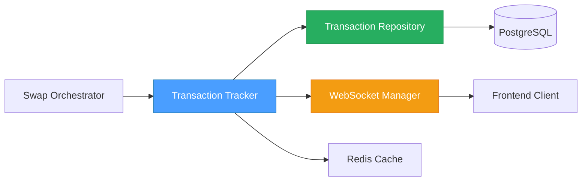
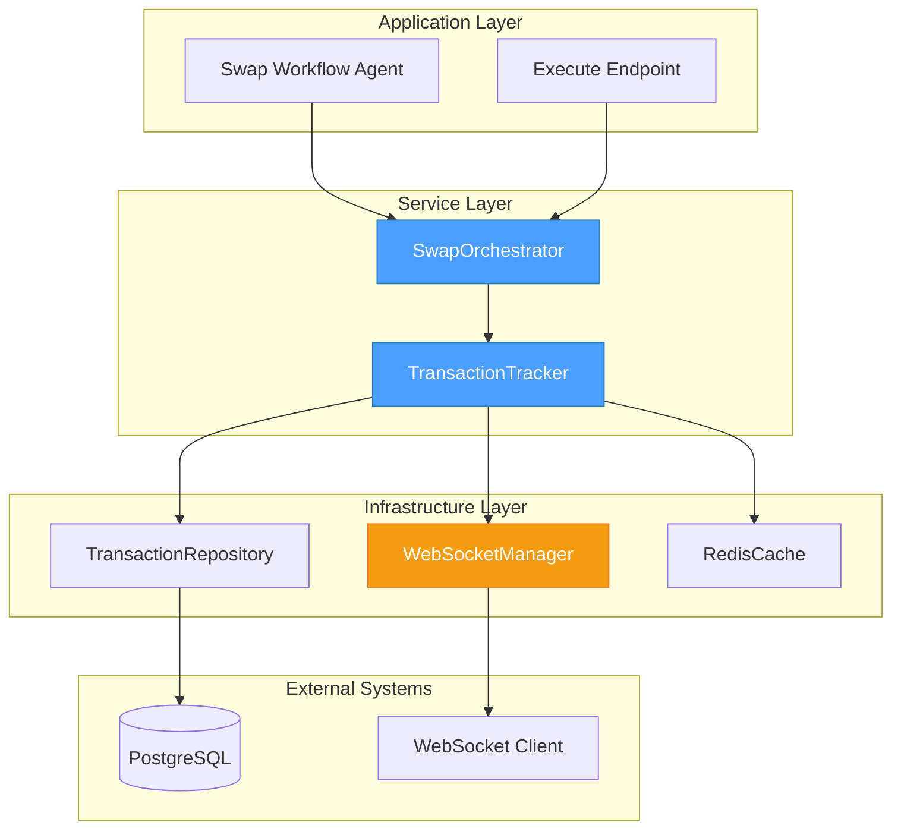
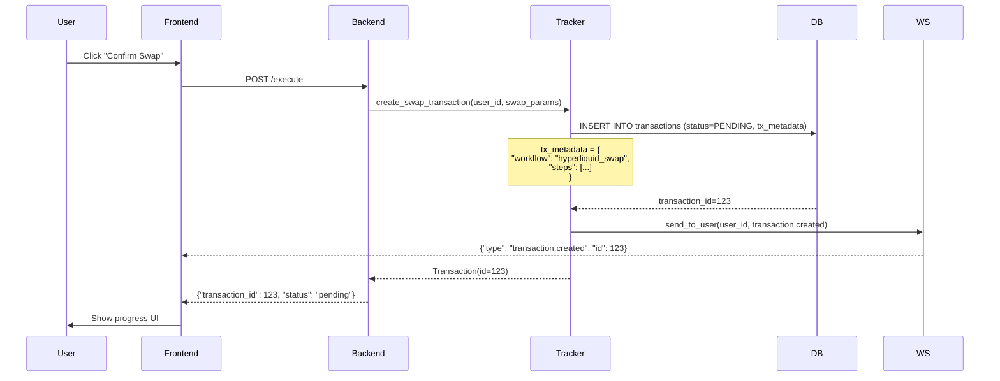
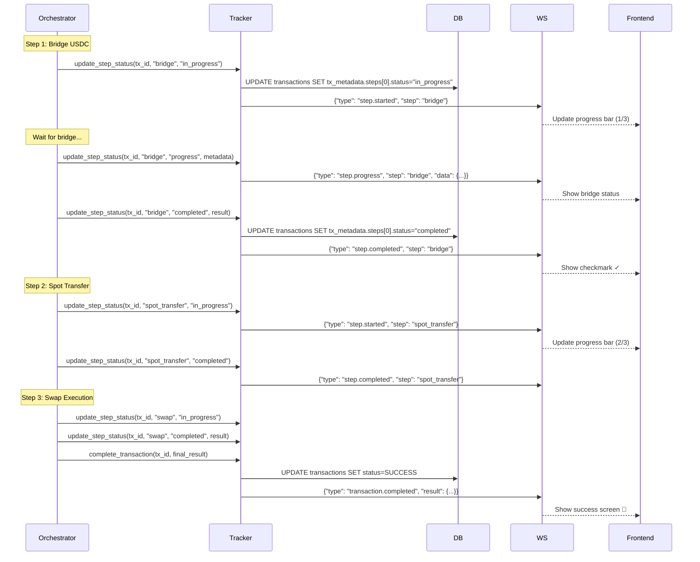
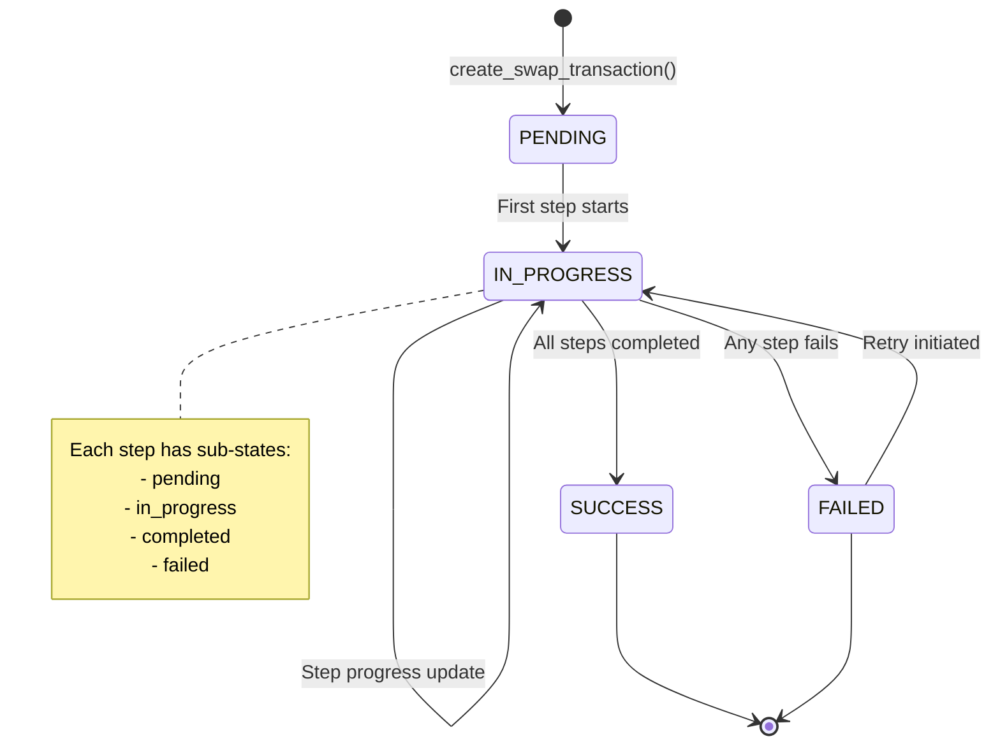
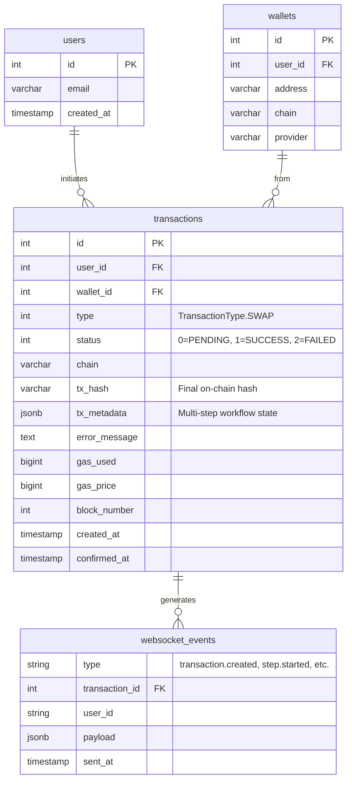

# 05 - Transaction Confirmation Tracking Specification

## 📋 Overview

### Purpose

This specification defines the transaction tracking and confirmation system for multi-step swap workflows. The system monitors all transaction stages (bridge, transfer, swap), provides real-time WebSocket updates to the frontend, and maintains a comprehensive audit trail in the database.

### Scope

- **Transaction creation**: Initialize tracking for multi-step workflows
- **Step tracking**: Monitor each step's progress (pending → in_progress → completed/failed)
- **WebSocket notifications**: Real-time updates to frontend during execution
- **State persistence**: Store complete transaction history in PostgreSQL
- **Error recovery**: Handle failures, retries, and partial completions
- **Status queries**: Retrieve transaction and step status on demand

### Key Objectives

1. ✅ Track all swap workflow steps in a single transaction record
2. ✅ Provide real-time progress updates via WebSocket
3. ✅ Enable frontend to display step-by-step progress UI
4. ✅ Support error recovery and retry mechanisms
5. ✅ Maintain complete audit trail for debugging and analytics
6. ✅ Query transaction status without polling database excessively

### Component Relationships



---

## 🏗️ Architecture Design

### System Architecture



### Transaction Creation Flow



### Multi-Step Execution Flow



### State Machine



---

## 💾 Database Schema

### Using Existing `transactions` Table

The existing `transactions` table already supports multi-step tracking via the `tx_metadata` JSONB column. No new tables required!

**Relevant Schema** (from `src/app/infrastructure/persistence_sqla/mappings/transaction.py`):

```sql
-- Core transaction fields
id INTEGER PRIMARY KEY
user_id INTEGER REFERENCES users(id)
wallet_id INTEGER REFERENCES wallets(id)
type INTEGER  -- TransactionType.SWAP
status INTEGER  -- TransactionStatus: 0=PENDING, 1=SUCCESS, 2=FAILED
chain VARCHAR  -- ChainType enum
tx_hash VARCHAR(66)  -- Final on-chain hash (after swap completes)
created_at TIMESTAMP
confirmed_at TIMESTAMP

-- Multi-step tracking (THIS IS KEY!)
tx_metadata JSONB  -- Stores complete workflow state

-- Error tracking
error_message TEXT

-- Analytics fields
gas_used BIGINT
gas_price BIGINT
block_number INTEGER
```

### `tx_metadata` JSONB Structure

```json
{
  "workflow": "hyperliquid_swap",
  "workflow_version": "1.0",
  "total_steps": 3,
  "current_step_index": 0,
  "steps": [
    {
      "step_id": "bridge",
      "step_name": "Bridge USDC",
      "step_index": 0,
      "status": "completed",
      "started_at": "2026-02-04T10:30:00Z",
      "completed_at": "2026-02-04T10:30:45Z",
      "duration_seconds": 45.2,
      "data": {
        "provider": "lifi",
        "from_chain": "base",
        "to_chain": "arbitrum",
        "from_address": "0xuser...",
        "to_address": "0xhyperliquid...",
        "amount": "10.0",
        "asset": "USDC",
        "bridge_tx_hash": "0xlifi...",
        "bridge_status": "DONE",
        "estimated_time_seconds": 30
      },
      "error": null
    },
    {
      "step_id": "spot_transfer",
      "step_name": "Transfer to Spot",
      "step_index": 1,
      "status": "completed",
      "started_at": "2026-02-04T10:30:46Z",
      "completed_at": "2026-02-04T10:30:48Z",
      "duration_seconds": 2.1,
      "data": {
        "provider": "hyperliquid",
        "from_account": "perps",
        "to_account": "spot",
        "amount": "9.95",
        "asset": "USDC",
        "hl_tx_hash": "0xhl...",
        "balance_before": "0.00",
        "balance_after": "9.95"
      },
      "error": null
    },
    {
      "step_id": "swap",
      "step_name": "Swap USDC → PURR",
      "step_index": 2,
      "status": "in_progress",
      "started_at": "2026-02-04T10:30:49Z",
      "completed_at": null,
      "duration_seconds": null,
      "data": {
        "provider": "hyperliquid",
        "from_asset": "USDC",
        "to_asset": "PURR",
        "from_amount": "9.95",
        "expected_to_amount": "15.2",
        "slippage_bps": 100,
        "order_id": "hl_order_xyz",
        "order_status": "pending"
      },
      "error": null
    }
  ],
  "summary": {
    "from_token": "USDC",
    "to_token": "PURR",
    "from_amount": "10.0",
    "to_amount": null,
    "from_chain": "base",
    "to_chain": "hyperliquid",
    "total_fees_usd": "0.05",
    "estimated_duration_seconds": 90,
    "actual_duration_seconds": null
  },
  "retries": [],
  "notifications_sent": [
    {"type": "transaction.created", "timestamp": "2026-02-04T10:30:00Z"},
    {"type": "step.started", "step": "bridge", "timestamp": "2026-02-04T10:30:00Z"},
    {"type": "step.completed", "step": "bridge", "timestamp": "2026-02-04T10:30:45Z"}
  ]
}
```

### Metadata Fields Explanation

| Field Path | Type | Purpose | Example |
|------------|------|---------|---------|
| `workflow` | string | Workflow type identifier | `"hyperliquid_swap"` |
| `workflow_version` | string | Version for schema evolution | `"1.0"` |
| `total_steps` | integer | Total number of steps | `3` |
| `current_step_index` | integer | Currently executing step (0-based) | `2` |
| `steps[]` | array | Array of step objects | See below |
| `steps[].step_id` | string | Unique step identifier | `"bridge"`, `"swap"` |
| `steps[].step_name` | string | Human-readable step name | `"Bridge USDC"` |
| `steps[].status` | string | Step status | `"pending"`, `"in_progress"`, `"completed"`, `"failed"` |
| `steps[].data` | object | Step-specific execution data | Provider details, amounts, hashes |
| `steps[].error` | object | Error details if failed | `{"code": "BRIDGE_TIMEOUT", "message": "..."}` |
| `summary` | object | High-level workflow summary | User-facing summary data |
| `retries[]` | array | Retry history | Track retry attempts |
| `notifications_sent[]` | array | WebSocket notification log | Prevent duplicate sends |

### Entity-Relationship Diagram



---

## 🔧 Implementation Details

### Core Service: `TransactionTracker`

```python
# src/app/application/services/transaction_tracker.py
from dataclasses import dataclass
from datetime import datetime, UTC
from decimal import Decimal
from typing import Any, Optional
import logging

from app.domain.entities.transaction import Transaction, TransactionId
from app.domain.enums.transaction_status import TransactionStatus
from app.domain.enums.transaction_type import TransactionType
from app.domain.value_objects.user_id import UserId
from app.domain.entities.wallet import WalletId
from app.infrastructure.websocket.event_broadcaster import GraphEventBroadcaster

logger = logging.getLogger(__name__)


@dataclass
class SwapWorkflowParams:
    """Parameters for creating a swap workflow transaction."""
    user_id: UserId
    wallet_id: WalletId
    from_token: str
    to_token: str
    from_amount: Decimal
    from_chain: str
    to_chain: str
    steps: list[dict[str, Any]]  # List of step definitions
    estimated_duration_seconds: int


@dataclass
class StepUpdateParams:
    """Parameters for updating a step's status."""
    step_id: str
    status: str  # "pending", "in_progress", "completed", "failed"
    data: Optional[dict[str, Any]] = None
    error: Optional[dict[str, Any]] = None


class TransactionTracker:
    """
    Service for tracking multi-step transaction workflows.

    Responsibilities:
    - Create transaction records with multi-step metadata
    - Update step status and execution data
    - Send WebSocket notifications to frontend
    - Query transaction and step status
    - Handle error recovery and retries

    WebSocket Event Types:
    - transaction.created: New transaction initiated
    - step.started: Step execution began
    - step.progress: Step progress update (e.g., bridge polling)
    - step.completed: Step finished successfully
    - step.failed: Step failed with error
    - transaction.completed: All steps completed
    - transaction.failed: Workflow failed (unrecoverable)
    """

    def __init__(
        self,
        transaction_repository: "TransactionRepository",
        websocket_broadcaster: GraphEventBroadcaster,
        cache_client: "RedisClient",
    ):
        self._repository = transaction_repository
        self._ws = websocket_broadcaster
        self._cache = cache_client

    async def create_swap_transaction(
        self,
        params: SwapWorkflowParams,
    ) -> Transaction:
        """
        Create a new swap transaction with multi-step workflow tracking.

        Args:
            params: Swap workflow parameters

        Returns:
            Created Transaction entity with tx_metadata populated

        Raises:
            TransactionCreationError: If creation fails
        """
        # Build tx_metadata structure
        tx_metadata = {
            "workflow": "hyperliquid_swap",
            "workflow_version": "1.0",
            "total_steps": len(params.steps),
            "current_step_index": 0,
            "steps": [
                {
                    "step_id": step["step_id"],
                    "step_name": step["step_name"],
                    "step_index": idx,
                    "status": "pending",
                    "started_at": None,
                    "completed_at": None,
                    "duration_seconds": None,
                    "data": step.get("initial_data", {}),
                    "error": None,
                }
                for idx, step in enumerate(params.steps)
            ],
            "summary": {
                "from_token": params.from_token,
                "to_token": params.to_token,
                "from_amount": str(params.from_amount),
                "to_amount": None,
                "from_chain": params.from_chain,
                "to_chain": params.to_chain,
                "total_fees_usd": None,
                "estimated_duration_seconds": params.estimated_duration_seconds,
                "actual_duration_seconds": None,
            },
            "retries": [],
            "notifications_sent": [],
        }

        # Create transaction entity
        transaction = Transaction.create(
            user_id=params.user_id,
            wallet_id=params.wallet_id,
            type=TransactionType.SWAP,
            chain=params.from_chain,  # Starting chain
            status=TransactionStatus.PENDING,
        )

        # Set swap-specific fields
        transaction.asset_in = params.from_token
        transaction.amount_in = params.from_amount
        transaction.asset_out = params.to_token
        transaction.tx_metadata = tx_metadata

        # Persist to database
        transaction = await self._repository.create(transaction)

        # Send WebSocket notification
        await self.notify_transaction_created(transaction)

        # Cache transaction ID for quick lookups
        await self._cache_transaction(transaction)

        logger.info(
            f"Created swap transaction: id={transaction.id_.value}, "
            f"user={params.user_id.value}, "
            f"workflow={params.from_token}→{params.to_token}"
        )

        return transaction

    async def update_step_status(
        self,
        transaction_id: TransactionId,
        step_update: StepUpdateParams,
    ) -> Transaction:
        """
        Update a step's status and execution data.

        Args:
            transaction_id: Transaction identifier
            step_update: Step update parameters

        Returns:
            Updated Transaction entity

        Raises:
            TransactionNotFoundError: If transaction doesn't exist
            InvalidStepError: If step_id doesn't exist in workflow
        """
        # Retrieve transaction
        transaction = await self._repository.get_by_id(transaction_id)
        if not transaction:
            raise TransactionNotFoundError(f"Transaction {transaction_id.value} not found")

        # Find step in metadata
        steps = transaction.tx_metadata["steps"]
        step_index = next(
            (i for i, s in enumerate(steps) if s["step_id"] == step_update.step_id),
            None
        )

        if step_index is None:
            raise InvalidStepError(
                f"Step '{step_update.step_id}' not found in transaction {transaction_id.value}"
            )

        step = steps[step_index]

        # Update step status
        old_status = step["status"]
        step["status"] = step_update.status

        # Update timestamps
        now = datetime.now(UTC).isoformat()
        if step_update.status == "in_progress" and not step["started_at"]:
            step["started_at"] = now

        if step_update.status in ("completed", "failed"):
            step["completed_at"] = now
            if step["started_at"]:
                started = datetime.fromisoformat(step["started_at"])
                completed = datetime.fromisoformat(step["completed_at"])
                step["duration_seconds"] = (completed - started).total_seconds()

        # Merge step data
        if step_update.data:
            step["data"].update(step_update.data)

        # Set error if failed
        if step_update.error:
            step["error"] = step_update.error

        # Update current step index
        if step_update.status == "in_progress":
            transaction.tx_metadata["current_step_index"] = step_index

        # Update transaction status if needed
        if step_update.status == "failed":
            transaction.status = TransactionStatus.FAILED
            transaction.error_message = step_update.error.get("message") if step_update.error else None

        # Check if all steps completed
        if all(s["status"] == "completed" for s in steps):
            await self._complete_transaction(transaction)

        # Persist changes
        transaction = await self._repository.update(transaction)

        # Send WebSocket notification
        await self.notify_step_update(transaction, step_update, old_status)

        logger.info(
            f"Updated step: tx_id={transaction_id.value}, "
            f"step={step_update.step_id}, "
            f"status={old_status}→{step_update.status}"
        )

        return transaction

    async def update_step_progress(
        self,
        transaction_id: TransactionId,
        step_id: str,
        progress_data: dict[str, Any],
    ) -> Transaction:
        """
        Update step progress without changing status (e.g., bridge polling updates).

        Args:
            transaction_id: Transaction identifier
            step_id: Step identifier
            progress_data: Progress metadata (e.g., {"bridge_status": "PENDING", "elapsed": 15})

        Returns:
            Updated Transaction entity
        """
        transaction = await self._repository.get_by_id(transaction_id)
        if not transaction:
            raise TransactionNotFoundError(f"Transaction {transaction_id.value} not found")

        # Find and update step data
        steps = transaction.tx_metadata["steps"]
        step = next((s for s in steps if s["step_id"] == step_id), None)

        if step:
            step["data"].update(progress_data)
            transaction = await self._repository.update(transaction)

            # Send progress notification
            await self.notify_step_progress(transaction, step_id, progress_data)

        return transaction

    async def complete_transaction(
        self,
        transaction_id: TransactionId,
        final_result: dict[str, Any],
    ) -> Transaction:
        """
        Mark transaction as completed with final results.

        Args:
            transaction_id: Transaction identifier
            final_result: Final swap results (amounts, fees, tx_hash, etc.)

        Returns:
            Completed Transaction entity
        """
        transaction = await self._repository.get_by_id(transaction_id)
        if not transaction:
            raise TransactionNotFoundError(f"Transaction {transaction_id.value} not found")

        await self._complete_transaction(transaction, final_result)
        transaction = await self._repository.update(transaction)

        await self.notify_transaction_completed(transaction)

        logger.info(f"Completed transaction: id={transaction_id.value}")

        return transaction

    async def fail_transaction(
        self,
        transaction_id: TransactionId,
        error_message: str,
        error_code: Optional[str] = None,
    ) -> Transaction:
        """
        Mark transaction as failed.

        Args:
            transaction_id: Transaction identifier
            error_message: Human-readable error message
            error_code: Machine-readable error code (optional)

        Returns:
            Failed Transaction entity
        """
        transaction = await self._repository.get_by_id(transaction_id)
        if not transaction:
            raise TransactionNotFoundError(f"Transaction {transaction_id.value} not found")

        transaction.status = TransactionStatus.FAILED
        transaction.error_message = error_message
        transaction.confirmed_at = datetime.now(UTC)

        transaction = await self._repository.update(transaction)

        await self.notify_transaction_failed(transaction, error_code)

        logger.error(
            f"Failed transaction: id={transaction_id.value}, error={error_message}"
        )

        return transaction

    async def get_transaction_status(
        self,
        transaction_id: TransactionId,
    ) -> dict[str, Any]:
        """
        Get complete transaction status including all steps.

        Args:
            transaction_id: Transaction identifier

        Returns:
            Status dictionary with transaction and step details
        """
        # Check cache first
        cache_key = f"tx_status:{transaction_id.value}"
        cached = await self._cache.get(cache_key)
        if cached:
            return cached

        # Fetch from database
        transaction = await self._repository.get_by_id(transaction_id)
        if not transaction:
            raise TransactionNotFoundError(f"Transaction {transaction_id.value} not found")

        status = {
            "transaction_id": transaction.id_.value,
            "status": transaction.status.name,
            "created_at": transaction.created_at.value.isoformat(),
            "confirmed_at": transaction.confirmed_at.isoformat() if transaction.confirmed_at else None,
            "workflow": transaction.tx_metadata.get("workflow"),
            "current_step_index": transaction.tx_metadata.get("current_step_index"),
            "total_steps": transaction.tx_metadata.get("total_steps"),
            "steps": transaction.tx_metadata.get("steps", []),
            "summary": transaction.tx_metadata.get("summary", {}),
            "error_message": transaction.error_message,
        }

        # Cache for 10 seconds (short TTL for active transactions)
        await self._cache.set(cache_key, status, ttl=10)

        return status

    # ==================== WebSocket Notifications ====================

    async def notify_transaction_created(self, transaction: Transaction) -> None:
        """Send transaction.created WebSocket event."""
        await self._send_notification(
            transaction=transaction,
            event_type="transaction.created",
            payload={
                "transaction_id": transaction.id_.value,
                "workflow": transaction.tx_metadata["workflow"],
                "total_steps": transaction.tx_metadata["total_steps"],
                "summary": transaction.tx_metadata["summary"],
            },
        )

    async def notify_step_update(
        self,
        transaction: Transaction,
        step_update: StepUpdateParams,
        old_status: str,
    ) -> None:
        """Send step status update WebSocket event."""
        # Determine event type
        if step_update.status == "in_progress":
            event_type = "step.started"
        elif step_update.status == "completed":
            event_type = "step.completed"
        elif step_update.status == "failed":
            event_type = "step.failed"
        else:
            return  # No notification for other statuses

        # Find step details
        step = next(
            (s for s in transaction.tx_metadata["steps"] if s["step_id"] == step_update.step_id),
            None
        )

        if not step:
            return

        await self._send_notification(
            transaction=transaction,
            event_type=event_type,
            payload={
                "transaction_id": transaction.id_.value,
                "step_id": step_update.step_id,
                "step_name": step["step_name"],
                "step_index": step["step_index"],
                "status": step_update.status,
                "data": step_update.data or step["data"],
                "error": step_update.error,
                "duration_seconds": step.get("duration_seconds"),
            },
        )

    async def notify_step_progress(
        self,
        transaction: Transaction,
        step_id: str,
        progress_data: dict[str, Any],
    ) -> None:
        """Send step.progress WebSocket event."""
        step = next(
            (s for s in transaction.tx_metadata["steps"] if s["step_id"] == step_id),
            None
        )

        if not step:
            return

        await self._send_notification(
            transaction=transaction,
            event_type="step.progress",
            payload={
                "transaction_id": transaction.id_.value,
                "step_id": step_id,
                "step_name": step["step_name"],
                "progress_data": progress_data,
            },
        )

    async def notify_transaction_completed(self, transaction: Transaction) -> None:
        """Send transaction.completed WebSocket event."""
        await self._send_notification(
            transaction=transaction,
            event_type="transaction.completed",
            payload={
                "transaction_id": transaction.id_.value,
                "summary": transaction.tx_metadata["summary"],
                "total_duration_seconds": transaction.tx_metadata["summary"].get("actual_duration_seconds"),
                "tx_hash": transaction.tx_hash,
            },
        )

    async def notify_transaction_failed(
        self,
        transaction: Transaction,
        error_code: Optional[str] = None,
    ) -> None:
        """Send transaction.failed WebSocket event."""
        await self._send_notification(
            transaction=transaction,
            event_type="transaction.failed",
            payload={
                "transaction_id": transaction.id_.value,
                "error_message": transaction.error_message,
                "error_code": error_code,
                "failed_step": self._get_failed_step(transaction),
            },
        )

    async def _send_notification(
        self,
        transaction: Transaction,
        event_type: str,
        payload: dict[str, Any],
    ) -> None:
        """
        Send WebSocket notification to user.

        Args:
            transaction: Transaction entity
            event_type: Event type (e.g., "step.started")
            payload: Event payload
        """
        try:
            # Send via WebSocket broadcaster
            await self._ws.broadcast_to_user(
                user_id=transaction.user_id.value,
                event_type=event_type,
                data=payload,
            )

            # Log notification in tx_metadata
            notification = {
                "type": event_type,
                "timestamp": datetime.now(UTC).isoformat(),
            }
            transaction.tx_metadata["notifications_sent"].append(notification)

        except Exception as e:
            logger.error(
                f"Failed to send WebSocket notification: tx_id={transaction.id_.value}, "
                f"event={event_type}, error={e}",
                exc_info=True,
            )

    # ==================== Internal Helpers ====================

    async def _complete_transaction(
        self,
        transaction: Transaction,
        final_result: Optional[dict[str, Any]] = None,
    ) -> None:
        """Mark transaction as completed and update summary."""
        transaction.status = TransactionStatus.SUCCESS
        transaction.confirmed_at = datetime.now(UTC)

        # Calculate total duration
        created = transaction.created_at.value
        completed = transaction.confirmed_at
        duration = (completed - created).total_seconds()
        transaction.tx_metadata["summary"]["actual_duration_seconds"] = duration

        # Update summary with final results
        if final_result:
            transaction.tx_metadata["summary"].update(final_result)
            transaction.amount_out = final_result.get("to_amount")
            transaction.fee = final_result.get("total_fees")
            transaction.tx_hash = final_result.get("tx_hash")

    def _get_failed_step(self, transaction: Transaction) -> Optional[dict[str, Any]]:
        """Get the first failed step from transaction metadata."""
        steps = transaction.tx_metadata.get("steps", [])
        failed_step = next((s for s in steps if s["status"] == "failed"), None)

        if failed_step:
            return {
                "step_id": failed_step["step_id"],
                "step_name": failed_step["step_name"],
                "error": failed_step.get("error"),
            }

        return None

    async def _cache_transaction(self, transaction: Transaction) -> None:
        """Cache transaction for quick lookups."""
        cache_key = f"tx:{transaction.id_.value}"
        await self._cache.set(
            key=cache_key,
            value={
                "id": transaction.id_.value,
                "user_id": transaction.user_id.value,
                "status": transaction.status.name,
            },
            ttl=300,  # 5 minutes
        )


class TransactionNotFoundError(Exception):
    """Raised when transaction doesn't exist."""
    pass


class InvalidStepError(Exception):
    """Raised when step_id is invalid."""
    pass


class TransactionCreationError(Exception):
    """Raised when transaction creation fails."""
    pass
```

---

## 🌐 WebSocket Protocol

### Event Types

#### 1. `transaction.created`

**Sent when**: New transaction initiated

```json
{
  "type": "transaction.created",
  "data": {
    "transaction_id": 123,
    "workflow": "hyperliquid_swap",
    "total_steps": 3,
    "summary": {
      "from_token": "USDC",
      "to_token": "PURR",
      "from_amount": "10.0",
      "from_chain": "base",
      "to_chain": "hyperliquid"
    }
  },
  "timestamp": 1707046200.0
}
```

#### 2. `step.started`

**Sent when**: Step execution begins

```json
{
  "type": "step.started",
  "data": {
    "transaction_id": 123,
    "step_id": "bridge",
    "step_name": "Bridge USDC",
    "step_index": 0,
    "status": "in_progress",
    "data": {
      "provider": "lifi",
      "from_chain": "base",
      "to_chain": "arbitrum",
      "amount": "10.0"
    }
  },
  "timestamp": 1707046201.0
}
```

#### 3. `step.progress`

**Sent when**: Step progress update (e.g., bridge polling)

```json
{
  "type": "step.progress",
  "data": {
    "transaction_id": 123,
    "step_id": "bridge",
    "step_name": "Bridge USDC",
    "progress_data": {
      "bridge_status": "PENDING",
      "elapsed_seconds": 15,
      "estimated_remaining_seconds": 15
    }
  },
  "timestamp": 1707046216.0
}
```

#### 4. `step.completed`

**Sent when**: Step finishes successfully

```json
{
  "type": "step.completed",
  "data": {
    "transaction_id": 123,
    "step_id": "bridge",
    "step_name": "Bridge USDC",
    "step_index": 0,
    "status": "completed",
    "data": {
      "provider": "lifi",
      "bridge_tx_hash": "0xlifi...",
      "bridge_status": "DONE",
      "amount_received": "9.95"
    },
    "duration_seconds": 45.2
  },
  "timestamp": 1707046245.0
}
```

#### 5. `step.failed`

**Sent when**: Step fails with error

```json
{
  "type": "step.failed",
  "data": {
    "transaction_id": 123,
    "step_id": "bridge",
    "step_name": "Bridge USDC",
    "step_index": 0,
    "status": "failed",
    "error": {
      "code": "BRIDGE_TIMEOUT",
      "message": "Bridge transaction timed out after 5 minutes",
      "recoverable": true
    },
    "duration_seconds": 300.0
  },
  "timestamp": 1707046500.0
}
```

#### 6. `transaction.completed`

**Sent when**: All steps completed successfully

```json
{
  "type": "transaction.completed",
  "data": {
    "transaction_id": 123,
    "summary": {
      "from_token": "USDC",
      "to_token": "PURR",
      "from_amount": "10.0",
      "to_amount": "15.2",
      "total_fees_usd": "0.05",
      "actual_duration_seconds": 52.3
    },
    "tx_hash": "0xfinal...",
    "total_duration_seconds": 52.3
  },
  "timestamp": 1707046252.0
}
```

#### 7. `transaction.failed`

**Sent when**: Transaction fails (unrecoverable)

```json
{
  "type": "transaction.failed",
  "data": {
    "transaction_id": 123,
    "error_message": "Insufficient balance on destination chain",
    "error_code": "INSUFFICIENT_BALANCE",
    "failed_step": {
      "step_id": "swap",
      "step_name": "Swap USDC → PURR",
      "error": {
        "code": "INSUFFICIENT_BALANCE",
        "message": "Spot account has 0.0 USDC, need 9.95 USDC"
      }
    }
  },
  "timestamp": 1707046300.0
}
```

### Authentication

WebSocket connections must be authenticated using the existing connection manager:

```python
# Client connects to WebSocket
ws://api.example.com/ws/transactions

# Connection includes JWT token in query params or headers
?token=eyJhbGciOiJIUzI1NiIs...

# Server validates token and registers connection
await connection_manager.connect(
    websocket=websocket,
    user_id=user_id,
    session_id=session_id,
)
```

### Subscription Pattern

Frontend subscribes to user-specific channel automatically on connection:

```python
# Backend sends notifications to user-specific channel
channel = f"user:{user_id}:events"
await redis.publish(channel, json.dumps(event))

# Connection manager routes to all user's WebSocket connections
```

---

## 🧪 Test Cases

### Unit Tests

```python
# tests/unit/services/test_transaction_tracker.py
import pytest
from unittest.mock import AsyncMock, MagicMock
from decimal import Decimal
from datetime import datetime, UTC

from app.application.services.transaction_tracker import (
    TransactionTracker,
    SwapWorkflowParams,
    StepUpdateParams,
)
from app.domain.entities.transaction import Transaction
from app.domain.enums.transaction_status import TransactionStatus


@pytest.fixture
def tracker():
    """Create transaction tracker with mocked dependencies."""
    repository = AsyncMock()
    websocket_broadcaster = AsyncMock()
    cache_client = AsyncMock()

    return TransactionTracker(
        transaction_repository=repository,
        websocket_broadcaster=websocket_broadcaster,
        cache_client=cache_client,
    )


@pytest.mark.asyncio
async def test_create_swap_transaction_initializes_metadata(tracker):
    """Test that create_swap_transaction builds correct tx_metadata structure."""
    # Arrange
    params = SwapWorkflowParams(
        user_id=UserId(123),
        wallet_id=WalletId(456),
        from_token="USDC",
        to_token="PURR",
        from_amount=Decimal("10.0"),
        from_chain="base",
        to_chain="hyperliquid",
        steps=[
            {"step_id": "bridge", "step_name": "Bridge USDC"},
            {"step_id": "spot_transfer", "step_name": "Transfer to Spot"},
            {"step_id": "swap", "step_name": "Swap USDC → PURR"},
        ],
        estimated_duration_seconds=90,
    )

    tracker._repository.create = AsyncMock(return_value=Transaction(...))

    # Act
    transaction = await tracker.create_swap_transaction(params)

    # Assert
    assert transaction.tx_metadata["workflow"] == "hyperliquid_swap"
    assert transaction.tx_metadata["total_steps"] == 3
    assert len(transaction.tx_metadata["steps"]) == 3
    assert transaction.tx_metadata["steps"][0]["step_id"] == "bridge"
    assert transaction.tx_metadata["steps"][0]["status"] == "pending"
    assert transaction.status == TransactionStatus.PENDING
    tracker._ws.broadcast_to_user.assert_called_once()


@pytest.mark.asyncio
async def test_update_step_status_to_in_progress_sets_timestamp(tracker):
    """Test that updating step to in_progress sets started_at timestamp."""
    # Arrange
    transaction = Transaction(...)
    transaction.tx_metadata = {
        "steps": [
            {"step_id": "bridge", "status": "pending", "started_at": None}
        ]
    }
    tracker._repository.get_by_id = AsyncMock(return_value=transaction)
    tracker._repository.update = AsyncMock(return_value=transaction)

    step_update = StepUpdateParams(
        step_id="bridge",
        status="in_progress",
    )

    # Act
    await tracker.update_step_status(TransactionId(123), step_update)

    # Assert
    step = transaction.tx_metadata["steps"][0]
    assert step["status"] == "in_progress"
    assert step["started_at"] is not None
    tracker._ws.broadcast_to_user.assert_called_once()


@pytest.mark.asyncio
async def test_update_step_status_to_completed_calculates_duration(tracker):
    """Test that completing step calculates duration_seconds."""
    # Arrange
    started = datetime.now(UTC)
    transaction = Transaction(...)
    transaction.tx_metadata = {
        "steps": [
            {
                "step_id": "bridge",
                "status": "in_progress",
                "started_at": started.isoformat(),
                "completed_at": None,
                "duration_seconds": None,
            }
        ]
    }
    tracker._repository.get_by_id = AsyncMock(return_value=transaction)
    tracker._repository.update = AsyncMock(return_value=transaction)

    step_update = StepUpdateParams(
        step_id="bridge",
        status="completed",
        data={"bridge_tx_hash": "0xabc..."},
    )

    # Act
    await tracker.update_step_status(TransactionId(123), step_update)

    # Assert
    step = transaction.tx_metadata["steps"][0]
    assert step["status"] == "completed"
    assert step["completed_at"] is not None
    assert step["duration_seconds"] > 0


@pytest.mark.asyncio
async def test_update_step_status_failed_marks_transaction_failed(tracker):
    """Test that failing a step marks entire transaction as failed."""
    # Arrange
    transaction = Transaction(...)
    transaction.tx_metadata = {
        "steps": [
            {"step_id": "bridge", "status": "in_progress"}
        ]
    }
    tracker._repository.get_by_id = AsyncMock(return_value=transaction)
    tracker._repository.update = AsyncMock(return_value=transaction)

    step_update = StepUpdateParams(
        step_id="bridge",
        status="failed",
        error={"code": "BRIDGE_TIMEOUT", "message": "Bridge timed out"},
    )

    # Act
    await tracker.update_step_status(TransactionId(123), step_update)

    # Assert
    assert transaction.status == TransactionStatus.FAILED
    assert transaction.error_message == "Bridge timed out"
    tracker._ws.broadcast_to_user.assert_called_once()


@pytest.mark.asyncio
async def test_all_steps_completed_triggers_transaction_completion(tracker):
    """Test that completing all steps triggers complete_transaction."""
    # Arrange
    transaction = Transaction(...)
    transaction.tx_metadata = {
        "steps": [
            {"step_id": "step1", "status": "completed"},
            {"step_id": "step2", "status": "in_progress"},
        ]
    }
    tracker._repository.get_by_id = AsyncMock(return_value=transaction)
    tracker._repository.update = AsyncMock(return_value=transaction)

    step_update = StepUpdateParams(
        step_id="step2",
        status="completed",
    )

    # Act
    await tracker.update_step_status(TransactionId(123), step_update)

    # Assert
    assert transaction.status == TransactionStatus.SUCCESS
    assert transaction.confirmed_at is not None


@pytest.mark.asyncio
async def test_update_step_progress_sends_progress_notification(tracker):
    """Test that update_step_progress sends step.progress event."""
    # Arrange
    transaction = Transaction(...)
    transaction.tx_metadata = {
        "steps": [
            {"step_id": "bridge", "status": "in_progress", "data": {}}
        ]
    }
    tracker._repository.get_by_id = AsyncMock(return_value=transaction)
    tracker._repository.update = AsyncMock(return_value=transaction)

    # Act
    await tracker.update_step_progress(
        TransactionId(123),
        "bridge",
        {"bridge_status": "PENDING", "elapsed_seconds": 15},
    )

    # Assert
    step = transaction.tx_metadata["steps"][0]
    assert step["data"]["bridge_status"] == "PENDING"
    tracker._ws.broadcast_to_user.assert_called_once()
    call_args = tracker._ws.broadcast_to_user.call_args
    assert call_args[1]["event_type"] == "step.progress"
```

### Integration Tests

```python
# tests/integration/test_transaction_tracker_integration.py
import pytest
from decimal import Decimal

from app.application.services.transaction_tracker import (
    TransactionTracker,
    SwapWorkflowParams,
    StepUpdateParams,
)
from tests.factories import UserFactory, WalletFactory


@pytest.mark.integration
@pytest.mark.asyncio
async def test_complete_swap_workflow_end_to_end(
    db_session,
    websocket_broadcaster,
    redis_client,
):
    """Test complete swap workflow from creation to completion."""
    # Arrange
    user = UserFactory.create()
    wallet = WalletFactory.create(user_id=user.id)

    tracker = TransactionTracker(
        transaction_repository=TransactionRepository(db_session),
        websocket_broadcaster=websocket_broadcaster,
        cache_client=redis_client,
    )

    params = SwapWorkflowParams(
        user_id=user.id,
        wallet_id=wallet.id,
        from_token="USDC",
        to_token="PURR",
        from_amount=Decimal("10.0"),
        from_chain="base",
        to_chain="hyperliquid",
        steps=[
            {"step_id": "bridge", "step_name": "Bridge USDC"},
            {"step_id": "swap", "step_name": "Swap USDC → PURR"},
        ],
        estimated_duration_seconds=60,
    )

    # Act - Create transaction
    transaction = await tracker.create_swap_transaction(params)
    assert transaction.id_.value > 0

    # Act - Complete step 1: bridge
    await tracker.update_step_status(
        transaction.id_,
        StepUpdateParams(
            step_id="bridge",
            status="in_progress",
        ),
    )

    await tracker.update_step_progress(
        transaction.id_,
        "bridge",
        {"bridge_status": "PENDING"},
    )

    await tracker.update_step_status(
        transaction.id_,
        StepUpdateParams(
            step_id="bridge",
            status="completed",
            data={"bridge_tx_hash": "0xabc..."},
        ),
    )

    # Act - Complete step 2: swap
    await tracker.update_step_status(
        transaction.id_,
        StepUpdateParams(
            step_id="swap",
            status="in_progress",
        ),
    )

    await tracker.update_step_status(
        transaction.id_,
        StepUpdateParams(
            step_id="swap",
            status="completed",
            data={"to_amount": "15.2", "tx_hash": "0xfinal..."},
        ),
    )

    # Assert - Transaction completed
    final_tx = await tracker._repository.get_by_id(transaction.id_)
    assert final_tx.status == TransactionStatus.SUCCESS
    assert final_tx.confirmed_at is not None
    assert final_tx.tx_metadata["steps"][0]["status"] == "completed"
    assert final_tx.tx_metadata["steps"][1]["status"] == "completed"

    # Assert - WebSocket notifications sent
    assert len(websocket_broadcaster.sent_events) >= 6  # created + 2*(started + completed)
```

---

## 🔄 Error Recovery

### Retry Strategy

When a step fails with a recoverable error:

```python
async def retry_failed_step(
    self,
    transaction_id: TransactionId,
    step_id: str,
    max_retries: int = 3,
) -> Transaction:
    """
    Retry a failed step with exponential backoff.

    Args:
        transaction_id: Transaction identifier
        step_id: Step to retry
        max_retries: Maximum retry attempts

    Returns:
        Updated Transaction entity

    Raises:
        MaxRetriesExceededError: If max retries reached
    """
    transaction = await self._repository.get_by_id(transaction_id)

    # Get retry count
    retries = transaction.tx_metadata.get("retries", [])
    step_retries = [r for r in retries if r["step_id"] == step_id]

    if len(step_retries) >= max_retries:
        raise MaxRetriesExceededError(
            f"Step '{step_id}' exceeded max retries ({max_retries})"
        )

    # Log retry attempt
    retry_entry = {
        "step_id": step_id,
        "attempt": len(step_retries) + 1,
        "timestamp": datetime.now(UTC).isoformat(),
    }
    retries.append(retry_entry)
    transaction.tx_metadata["retries"] = retries

    # Reset step to pending
    steps = transaction.tx_metadata["steps"]
    step = next((s for s in steps if s["step_id"] == step_id), None)
    if step:
        step["status"] = "pending"
        step["error"] = None
        step["started_at"] = None
        step["completed_at"] = None

    # Update transaction status back to PENDING if it was FAILED
    if transaction.status == TransactionStatus.FAILED:
        transaction.status = TransactionStatus.PENDING
        transaction.error_message = None

    transaction = await self._repository.update(transaction)

    # Notify retry
    await self._ws.broadcast_to_user(
        user_id=transaction.user_id.value,
        event_type="step.retry",
        data={
            "transaction_id": transaction_id.value,
            "step_id": step_id,
            "attempt": len(step_retries) + 1,
            "max_attempts": max_retries,
        },
    )

    logger.info(
        f"Retrying step: tx_id={transaction_id.value}, "
        f"step={step_id}, attempt={len(step_retries) + 1}/{max_retries}"
    )

    return transaction
```

### Recoverable Errors

| Error Code | Recoverable? | Retry Strategy | Max Retries |
|------------|--------------|----------------|-------------|
| `BRIDGE_TIMEOUT` | Yes | Exponential backoff (5s, 10s, 20s) | 3 |
| `INSUFFICIENT_BALANCE` | No | Fail immediately | 0 |
| `NETWORK_ERROR` | Yes | Fixed interval (10s) | 5 |
| `SLIPPAGE_EXCEEDED` | Yes | Retry with higher slippage | 2 |
| `ORDER_NOT_FILLED` | Yes | Retry after 5s | 3 |
| `API_RATE_LIMIT` | Yes | Exponential backoff (30s, 60s) | 2 |
| `UNKNOWN_ERROR` | No | Fail immediately | 0 |

### Rollback Procedures

For partial completions (e.g., bridge succeeded but swap failed):

```python
async def rollback_transaction(
    self,
    transaction_id: TransactionId,
    rollback_reason: str,
) -> Transaction:
    """
    Rollback transaction to previous state.

    NOTE: Only metadata rollback is supported. On-chain transactions
    cannot be reversed. User must be notified to manually recover funds.

    Args:
        transaction_id: Transaction identifier
        rollback_reason: Reason for rollback

    Returns:
        Rolled back Transaction entity
    """
    transaction = await self._repository.get_by_id(transaction_id)

    # Mark transaction as failed with rollback reason
    transaction.status = TransactionStatus.FAILED
    transaction.error_message = f"Rollback: {rollback_reason}"

    # Find last completed step
    steps = transaction.tx_metadata["steps"]
    completed_steps = [s for s in steps if s["status"] == "completed"]

    if completed_steps:
        # Add rollback instructions to metadata
        transaction.tx_metadata["rollback"] = {
            "reason": rollback_reason,
            "completed_steps": [s["step_id"] for s in completed_steps],
            "manual_recovery_required": True,
            "instructions": self._get_rollback_instructions(completed_steps),
        }

    transaction = await self._repository.update(transaction)

    # Notify user
    await self._ws.broadcast_to_user(
        user_id=transaction.user_id.value,
        event_type="transaction.rollback",
        data={
            "transaction_id": transaction_id.value,
            "reason": rollback_reason,
            "manual_recovery_required": True,
            "instructions": transaction.tx_metadata["rollback"]["instructions"],
        },
    )

    return transaction


def _get_rollback_instructions(self, completed_steps: list[dict]) -> list[str]:
    """Generate user-facing rollback instructions."""
    instructions = []

    for step in completed_steps:
        if step["step_id"] == "bridge":
            instructions.append(
                f"Bridge completed: {step['data']['amount']} {step['data']['asset']} "
                f"transferred to Hyperliquid wallet {step['data']['to_address']}. "
                f"You can manually withdraw these funds."
            )
        elif step["step_id"] == "spot_transfer":
            instructions.append(
                f"Spot transfer completed: {step['data']['amount']} {step['data']['asset']} "
                f"in your Hyperliquid Spot account. You can manually trade or withdraw."
            )

    return instructions
```

---

## 📊 Performance & Monitoring

### Target SLAs

| Operation | Target | Acceptable | Unacceptable |
|-----------|--------|------------|--------------|
| Create transaction | < 50ms | < 200ms | > 500ms |
| Update step status | < 30ms | < 100ms | > 200ms |
| WebSocket notification delivery | < 100ms | < 500ms | > 1s |
| Status query (cached) | < 10ms | < 50ms | > 100ms |
| Status query (db) | < 50ms | < 200ms | > 500ms |

### Monitoring Metrics

```python
# Prometheus metrics (example)
from prometheus_client import Counter, Histogram

transaction_created_total = Counter(
    'transaction_created_total',
    'Total transactions created',
    ['workflow_type']
)

step_duration_seconds = Histogram(
    'step_duration_seconds',
    'Step execution duration',
    ['step_id', 'status']
)

websocket_notification_sent_total = Counter(
    'websocket_notification_sent_total',
    'Total WebSocket notifications sent',
    ['event_type', 'success']
)

transaction_completed_total = Counter(
    'transaction_completed_total',
    'Total transactions completed',
    ['status']
)
```

### Logging

```python
# Structured logging example
logger.info(
    "Step completed",
    extra={
        "transaction_id": transaction_id.value,
        "step_id": step_id,
        "step_index": step_index,
        "duration_seconds": duration,
        "user_id": user_id.value,
        "workflow": "hyperliquid_swap",
    }
)
```

---

## 🔗 References

### Related Code Files

- **Transaction Entity**: `/home/ubuntu/anvil_backend/src/app/domain/entities/transaction.py:1-116`
- **Transaction Mapping**: `/home/ubuntu/anvil_backend/src/app/infrastructure/persistence_sqla/mappings/transaction.py:1-116`
- **WebSocket Manager**: `/home/ubuntu/anvil_backend/src/app/presentation/http/websocket/connection_manager.py:1-346`
- **Event Broadcaster**: `/home/ubuntu/anvil_backend/src/app/infrastructure/websocket/event_broadcaster.py:1-360`
- **Swap Workflow Agent**: `src/app/infrastructure/adapters/agent_squad/agents/workflows/swap_workflow_agent.py:331-1630`

### External Documentation

- **WebSocket Protocol**: https://developer.mozilla.org/en-US/docs/Web/API/WebSockets_API
- **Redis Pub/Sub**: https://redis.io/docs/manual/pubsub/
- **PostgreSQL JSONB**: https://www.postgresql.org/docs/current/datatype-json.html

### Related Specifications

- [01_HYPERLIQUID_WALLET_MANAGEMENT_SPEC.md](./01_HYPERLIQUID_WALLET_MANAGEMENT_SPEC.md) - Wallet generation and signing
- [02_LIFI_BRIDGE_EXECUTION_SPEC.md](./02_LIFI_BRIDGE_EXECUTION_SPEC.md) - Bridge execution (Step 1)
- [03_HYPERLIQUID_SPOT_TRANSFER_SPEC.md](./03_HYPERLIQUID_SPOT_TRANSFER_SPEC.md) - Spot transfer (Step 2)
- [04_HYPERLIQUID_SPOT_SWAP_SPEC.md](./04_HYPERLIQUID_SPOT_SWAP_SPEC.md) - Swap execution (Step 3)
- [06_END_TO_END_INTEGRATION_SPEC.md](./06_END_TO_END_INTEGRATION_SPEC.md) - Complete orchestration

---

## ✅ Implementation Checklist

- [ ] Implement `TransactionTracker` service class
- [ ] Add WebSocket notification methods
- [ ] Implement step status update logic with timestamps
- [ ] Add transaction completion detection (all steps done)
- [ ] Implement error recovery and retry logic
- [ ] Add status query methods with caching
- [ ] Write unit tests (8 test cases)
- [ ] Write integration tests (2 scenarios)
- [ ] Add Prometheus metrics
- [ ] Add structured logging
- [ ] Document WebSocket event schema
- [ ] Test with frontend integration
- [ ] Performance testing (target < 100ms notification delivery)
- [ ] Load testing (1000 concurrent transactions)

---

**Document Version**: 1.0
**Last Updated**: 2026-02-04
**Status**: ✅ Ready for Implementation
**Estimated Implementation Time**: 4 hours
**Dependencies**: Existing `transactions` table, WebSocket infrastructure

---

## 📈 Example: Complete Workflow Metadata

### After Successful Completion

```json
{
  "workflow": "hyperliquid_swap",
  "workflow_version": "1.0",
  "total_steps": 3,
  "current_step_index": 2,
  "steps": [
    {
      "step_id": "bridge",
      "step_name": "Bridge USDC from Base to Arbitrum",
      "step_index": 0,
      "status": "completed",
      "started_at": "2026-02-04T10:30:00.000Z",
      "completed_at": "2026-02-04T10:30:45.234Z",
      "duration_seconds": 45.234,
      "data": {
        "provider": "lifi",
        "from_chain": "base",
        "to_chain": "arbitrum",
        "from_address": "0xuser123...",
        "to_address": "0xhyperliquid456...",
        "amount": "10.0",
        "asset": "USDC",
        "bridge_tx_hash": "0xlifi789...",
        "bridge_status": "DONE",
        "estimated_time_seconds": 30,
        "actual_time_seconds": 45.234,
        "lifi_route_id": "route_abc123"
      },
      "error": null
    },
    {
      "step_id": "spot_transfer",
      "step_name": "Transfer USDC to Spot Account",
      "step_index": 1,
      "status": "completed",
      "started_at": "2026-02-04T10:30:46.000Z",
      "completed_at": "2026-02-04T10:30:48.123Z",
      "duration_seconds": 2.123,
      "data": {
        "provider": "hyperliquid",
        "from_account": "perps",
        "to_account": "spot",
        "amount": "9.95",
        "asset": "USDC",
        "hl_tx_hash": "0xhl_transfer_xyz...",
        "balance_before": "0.00",
        "balance_after": "9.95",
        "fee": "0.00"
      },
      "error": null
    },
    {
      "step_id": "swap",
      "step_name": "Swap USDC → PURR on Hyperliquid Spot",
      "step_index": 2,
      "status": "completed",
      "started_at": "2026-02-04T10:30:49.000Z",
      "completed_at": "2026-02-04T10:30:51.567Z",
      "duration_seconds": 2.567,
      "data": {
        "provider": "hyperliquid",
        "from_asset": "USDC",
        "to_asset": "PURR",
        "from_amount": "9.95",
        "to_amount": "15.234",
        "slippage_bps": 100,
        "order_id": "hl_order_xyz789",
        "order_status": "filled",
        "fill_price": "0.6531",
        "tx_hash": "0xhl_swap_final...",
        "fee_usdc": "0.00995"
      },
      "error": null
    }
  ],
  "summary": {
    "from_token": "USDC",
    "to_token": "PURR",
    "from_amount": "10.0",
    "to_amount": "15.234",
    "from_chain": "base",
    "to_chain": "hyperliquid",
    "total_fees_usd": "0.05995",
    "estimated_duration_seconds": 90,
    "actual_duration_seconds": 51.567
  },
  "retries": [],
  "notifications_sent": [
    {"type": "transaction.created", "timestamp": "2026-02-04T10:30:00.000Z"},
    {"type": "step.started", "step": "bridge", "timestamp": "2026-02-04T10:30:00.100Z"},
    {"type": "step.progress", "step": "bridge", "timestamp": "2026-02-04T10:30:15.000Z"},
    {"type": "step.progress", "step": "bridge", "timestamp": "2026-02-04T10:30:30.000Z"},
    {"type": "step.completed", "step": "bridge", "timestamp": "2026-02-04T10:30:45.234Z"},
    {"type": "step.started", "step": "spot_transfer", "timestamp": "2026-02-04T10:30:46.000Z"},
    {"type": "step.completed", "step": "spot_transfer", "timestamp": "2026-02-04T10:30:48.123Z"},
    {"type": "step.started", "step": "swap", "timestamp": "2026-02-04T10:30:49.000Z"},
    {"type": "step.completed", "step": "swap", "timestamp": "2026-02-04T10:30:51.567Z"},
    {"type": "transaction.completed", "timestamp": "2026-02-04T10:30:51.600Z"}
  ]
}
```

### After Partial Failure (Bridge succeeded, Swap failed)

```json
{
  "workflow": "hyperliquid_swap",
  "workflow_version": "1.0",
  "total_steps": 3,
  "current_step_index": 2,
  "steps": [
    {
      "step_id": "bridge",
      "step_name": "Bridge USDC from Base to Arbitrum",
      "step_index": 0,
      "status": "completed",
      "started_at": "2026-02-04T10:30:00.000Z",
      "completed_at": "2026-02-04T10:30:45.234Z",
      "duration_seconds": 45.234,
      "data": {
        "provider": "lifi",
        "amount": "10.0",
        "asset": "USDC",
        "bridge_tx_hash": "0xlifi789..."
      },
      "error": null
    },
    {
      "step_id": "spot_transfer",
      "step_name": "Transfer USDC to Spot Account",
      "step_index": 1,
      "status": "completed",
      "started_at": "2026-02-04T10:30:46.000Z",
      "completed_at": "2026-02-04T10:30:48.123Z",
      "duration_seconds": 2.123,
      "data": {
        "provider": "hyperliquid",
        "amount": "9.95",
        "asset": "USDC"
      },
      "error": null
    },
    {
      "step_id": "swap",
      "step_name": "Swap USDC → PURR on Hyperliquid Spot",
      "step_index": 2,
      "status": "failed",
      "started_at": "2026-02-04T10:30:49.000Z",
      "completed_at": "2026-02-04T10:30:51.000Z",
      "duration_seconds": 2.0,
      "data": {
        "provider": "hyperliquid",
        "from_asset": "USDC",
        "to_asset": "PURR",
        "from_amount": "9.95",
        "order_id": "hl_order_xyz789",
        "order_status": "rejected"
      },
      "error": {
        "code": "INSUFFICIENT_LIQUIDITY",
        "message": "Insufficient liquidity for PURR: available 5.0 PURR, requested 15.2 PURR",
        "recoverable": false,
        "user_message": "Not enough PURR tokens available in the market. Please try a smaller amount or wait for more liquidity."
      }
    }
  ],
  "summary": {
    "from_token": "USDC",
    "to_token": "PURR",
    "from_amount": "10.0",
    "to_amount": null,
    "from_chain": "base",
    "to_chain": "hyperliquid",
    "total_fees_usd": "0.05",
    "estimated_duration_seconds": 90,
    "actual_duration_seconds": null
  },
  "retries": [],
  "rollback": {
    "reason": "Swap failed: Insufficient liquidity",
    "completed_steps": ["bridge", "spot_transfer"],
    "manual_recovery_required": true,
    "instructions": [
      "Bridge completed: 9.95 USDC transferred to Hyperliquid wallet 0xhyperliquid456... You can manually withdraw these funds.",
      "Spot transfer completed: 9.95 USDC in your Hyperliquid Spot account. You can manually trade or withdraw."
    ]
  },
  "notifications_sent": [
    {"type": "transaction.created", "timestamp": "2026-02-04T10:30:00.000Z"},
    {"type": "step.started", "step": "bridge", "timestamp": "2026-02-04T10:30:00.100Z"},
    {"type": "step.completed", "step": "bridge", "timestamp": "2026-02-04T10:30:45.234Z"},
    {"type": "step.started", "step": "spot_transfer", "timestamp": "2026-02-04T10:30:46.000Z"},
    {"type": "step.completed", "step": "spot_transfer", "timestamp": "2026-02-04T10:30:48.123Z"},
    {"type": "step.started", "step": "swap", "timestamp": "2026-02-04T10:30:49.000Z"},
    {"type": "step.failed", "step": "swap", "timestamp": "2026-02-04T10:30:51.000Z"},
    {"type": "transaction.failed", "timestamp": "2026-02-04T10:30:51.100Z"}
  ]
}
```

---

**End of Specification**
