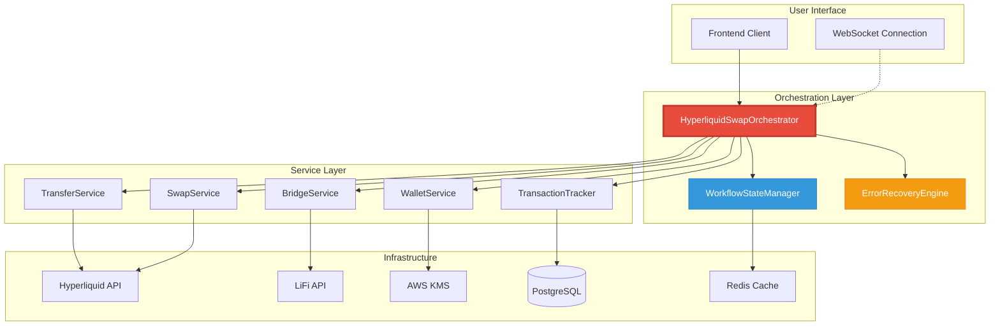
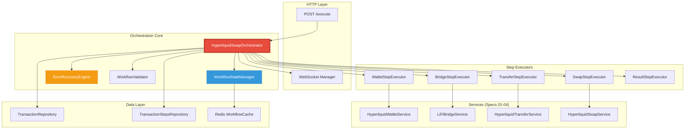
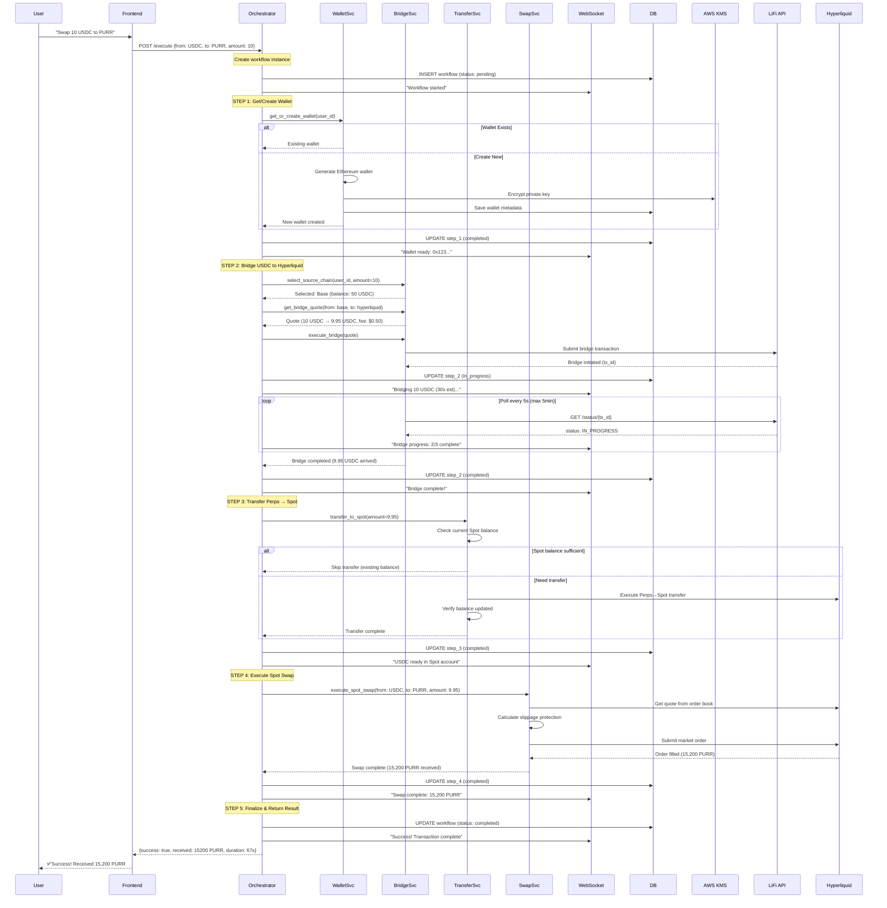
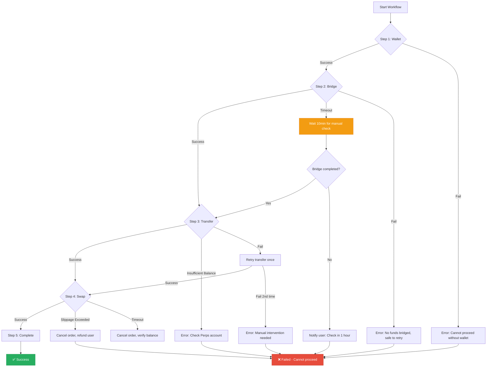
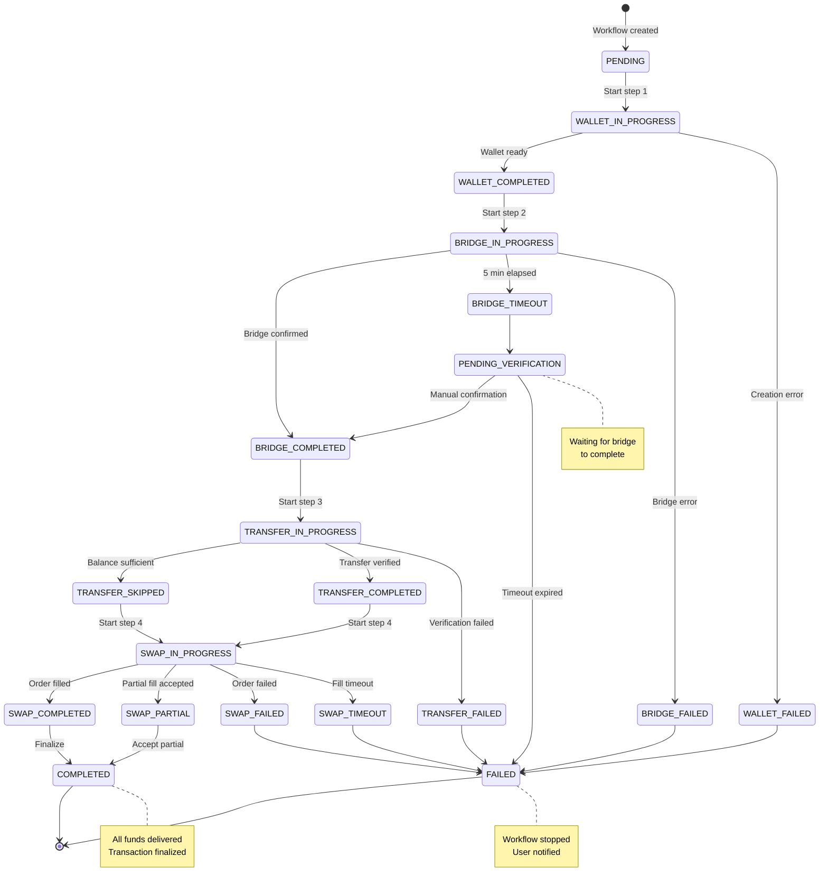

# 06 - End-to-End Integration Specification

## 📋 Overview

### Purpose

This specification defines the orchestration layer that coordinates all components (wallet management, bridging, transfers, swaps) into a complete, production-ready swap workflow. The `HyperliquidSwapOrchestrator` acts as the conductor, managing the multi-step process from user request to final token delivery with comprehensive error recovery.

### Scope

- **Complete workflow orchestration**: Coordinate all 5 steps (wallet → bridge → transfer → swap → result)
- **Error recovery**: Handle failures at each step with appropriate rollback/retry strategies
- **Transaction persistence**: Track entire workflow in database with step-by-step progress
- **State management**: Maintain workflow state across async operations
- **Performance optimization**: Parallel execution where possible, caching, connection pooling
- **Real-time updates**: WebSocket notifications for each workflow step
- **Security**: End-to-end audit trail with compliance checks

### Key Objectives

1. ✅ Execute complete swap workflow in < 2 minutes (target: 60-90 seconds)
2. ✅ Provide granular error recovery at each step
3. ✅ Maintain comprehensive audit trail for compliance
4. ✅ Support rollback/withdrawal when bridge fails
5. ✅ Real-time progress updates via WebSocket
6. ✅ Handle concurrent swap requests safely
7. ✅ Optimize for cost and performance

### Component Relationships



---

## 🏗️ Architecture Design

### System Architecture Overview



### Complete Swap Workflow Sequence



### Error Recovery Flow



### State Transition Diagram



---

## 💾 Database Schema

### Workflow Tracking Tables

```sql
-- Main workflow tracking
CREATE TABLE swap_workflows (
    -- Identity
    id SERIAL PRIMARY KEY,
    user_id INTEGER NOT NULL REFERENCES users(id) ON DELETE CASCADE,
    workflow_id VARCHAR(64) NOT NULL UNIQUE,  -- e.g., "swap_workflow_1738756800_abc123"

    -- Swap Details
    from_token VARCHAR(20) NOT NULL,
    to_token VARCHAR(20) NOT NULL,
    from_amount NUMERIC(20, 6) NOT NULL,
    to_amount_expected NUMERIC(20, 6),
    to_amount_actual NUMERIC(20, 6),

    -- Status Tracking
    status VARCHAR(30) NOT NULL DEFAULT 'PENDING',
    -- Status values: PENDING, WALLET_IN_PROGRESS, WALLET_COMPLETED, BRIDGE_IN_PROGRESS,
    --                BRIDGE_COMPLETED, TRANSFER_IN_PROGRESS, TRANSFER_COMPLETED,
    --                SWAP_IN_PROGRESS, SWAP_COMPLETED, COMPLETED, FAILED, PENDING_VERIFICATION

    current_step INTEGER DEFAULT 1,  -- 1-5
    total_steps INTEGER DEFAULT 5,

    -- Step Results
    wallet_id INTEGER REFERENCES hyperliquid_wallets(id),
    bridge_transaction_id INTEGER REFERENCES transactions(id),
    transfer_transaction_id INTEGER REFERENCES transactions(id),
    swap_transaction_id INTEGER REFERENCES transactions(id),

    -- Error Tracking
    error_step INTEGER,  -- Which step failed (1-5)
    error_code VARCHAR(50),
    error_message TEXT,
    retry_count INTEGER DEFAULT 0,

    -- Performance Metrics
    started_at TIMESTAMP DEFAULT CURRENT_TIMESTAMP,
    wallet_completed_at TIMESTAMP,
    bridge_completed_at TIMESTAMP,
    transfer_completed_at TIMESTAMP,
    swap_completed_at TIMESTAMP,
    completed_at TIMESTAMP,
    total_duration_seconds INTEGER,

    -- Cost Breakdown
    bridge_fee_usd NUMERIC(10, 4),
    swap_fee_usd NUMERIC(10, 4),
    total_cost_usd NUMERIC(10, 4),

    -- Metadata
    workflow_metadata JSONB DEFAULT '{}'::jsonb,

    -- Audit
    created_at TIMESTAMP DEFAULT CURRENT_TIMESTAMP,
    updated_at TIMESTAMP DEFAULT CURRENT_TIMESTAMP,

    CONSTRAINT valid_status CHECK (status IN (
        'PENDING', 'WALLET_IN_PROGRESS', 'WALLET_COMPLETED', 'WALLET_FAILED',
        'BRIDGE_IN_PROGRESS', 'BRIDGE_COMPLETED', 'BRIDGE_TIMEOUT', 'BRIDGE_FAILED',
        'TRANSFER_IN_PROGRESS', 'TRANSFER_COMPLETED', 'TRANSFER_SKIPPED', 'TRANSFER_FAILED',
        'SWAP_IN_PROGRESS', 'SWAP_COMPLETED', 'SWAP_PARTIAL', 'SWAP_FAILED', 'SWAP_TIMEOUT',
        'COMPLETED', 'FAILED', 'PENDING_VERIFICATION'
    ))
);

-- Indexes for performance
CREATE INDEX idx_swap_workflows_user_id ON swap_workflows(user_id);
CREATE INDEX idx_swap_workflows_workflow_id ON swap_workflows(workflow_id);
CREATE INDEX idx_swap_workflows_status ON swap_workflows(status);
CREATE INDEX idx_swap_workflows_started_at ON swap_workflows(started_at DESC);

-- Update trigger
CREATE TRIGGER update_swap_workflows_updated_at
    BEFORE UPDATE ON swap_workflows
    FOR EACH ROW
    EXECUTE FUNCTION update_updated_at_column();


-- Step-by-step execution log
CREATE TABLE swap_workflow_steps (
    id SERIAL PRIMARY KEY,
    workflow_id INTEGER NOT NULL REFERENCES swap_workflows(id) ON DELETE CASCADE,
    step_number INTEGER NOT NULL,  -- 1-5
    step_name VARCHAR(50) NOT NULL,  -- wallet, bridge, transfer, swap, finalize
    status VARCHAR(20) NOT NULL DEFAULT 'PENDING',
    -- Status: PENDING, IN_PROGRESS, COMPLETED, FAILED, SKIPPED

    -- Step-specific data
    input_data JSONB,
    output_data JSONB,
    error_data JSONB,

    -- Timing
    started_at TIMESTAMP,
    completed_at TIMESTAMP,
    duration_ms INTEGER,

    -- Retry tracking
    attempt_number INTEGER DEFAULT 1,
    max_attempts INTEGER DEFAULT 3,

    created_at TIMESTAMP DEFAULT CURRENT_TIMESTAMP,

    UNIQUE(workflow_id, step_number, attempt_number)
);

CREATE INDEX idx_workflow_steps_workflow_id ON swap_workflow_steps(workflow_id);
CREATE INDEX idx_workflow_steps_status ON swap_workflow_steps(status);
```

### Workflow Metadata Structure

```json
{
  "source_chain": "base",
  "source_wallet_address": "0xabc...",
  "destination_wallet_address": "0xdef...",
  "bridge_quote": {
    "from_chain": "base",
    "to_chain": "hyperliquid",
    "estimated_duration_seconds": 30,
    "bridge_fee_usd": 0.50
  },
  "transfer_details": {
    "perps_balance_before": 50.0,
    "spot_balance_before": 0.0,
    "amount_transferred": 9.95,
    "transfer_skipped": false
  },
  "swap_details": {
    "quote_amount": 15234.5,
    "actual_amount": 15200.3,
    "slippage_tolerance_bps": 100,
    "price_impact_bps": 12.5,
    "order_id": "0x123abc..."
  },
  "performance": {
    "wallet_time_ms": 150,
    "bridge_time_ms": 32000,
    "transfer_time_ms": 1800,
    "swap_time_ms": 1670,
    "total_time_ms": 35620
  },
  "websocket_events": [
    {"timestamp": "2026-02-04T10:30:00Z", "event": "workflow_started"},
    {"timestamp": "2026-02-04T10:30:01Z", "event": "wallet_ready"},
    {"timestamp": "2026-02-04T10:30:02Z", "event": "bridge_initiated"},
    {"timestamp": "2026-02-04T10:30:34Z", "event": "bridge_completed"},
    {"timestamp": "2026-02-04T10:30:36Z", "event": "transfer_completed"},
    {"timestamp": "2026-02-04T10:30:38Z", "event": "swap_completed"},
    {"timestamp": "2026-02-04T10:30:38Z", "event": "workflow_completed"}
  ]
}
```

---

## 🔧 Implementation Details

### Core Orchestrator: `HyperliquidSwapOrchestrator`

```python
# src/app/application/orchestrators/hyperliquid_swap_orchestrator.py
from decimal import Decimal
from typing import Optional, Dict, Any
from dataclasses import dataclass
from datetime import datetime, UTC
from enum import Enum
import asyncio
import logging

from app.domain.value_objects.user_id import UserId
from app.domain.value_objects.wallet_id import WalletId
from app.application.services.hyperliquid_wallet_service import HyperliquidWalletService
from app.application.services.lifi_bridge_service import LiFiBridgeService
from app.application.services.hyperliquid_transfer_service import HyperliquidTransferService
from app.application.services.hyperliquid_swap_service import HyperliquidSwapService

logger = logging.getLogger(__name__)


class WorkflowStatus(str, Enum):
    """Workflow execution status."""
    PENDING = "PENDING"
    WALLET_IN_PROGRESS = "WALLET_IN_PROGRESS"
    WALLET_COMPLETED = "WALLET_COMPLETED"
    WALLET_FAILED = "WALLET_FAILED"
    BRIDGE_IN_PROGRESS = "BRIDGE_IN_PROGRESS"
    BRIDGE_COMPLETED = "BRIDGE_COMPLETED"
    BRIDGE_TIMEOUT = "BRIDGE_TIMEOUT"
    BRIDGE_FAILED = "BRIDGE_FAILED"
    TRANSFER_IN_PROGRESS = "TRANSFER_IN_PROGRESS"
    TRANSFER_COMPLETED = "TRANSFER_COMPLETED"
    TRANSFER_SKIPPED = "TRANSFER_SKIPPED"
    TRANSFER_FAILED = "TRANSFER_FAILED"
    SWAP_IN_PROGRESS = "SWAP_IN_PROGRESS"
    SWAP_COMPLETED = "SWAP_COMPLETED"
    SWAP_PARTIAL = "SWAP_PARTIAL"
    SWAP_FAILED = "SWAP_FAILED"
    SWAP_TIMEOUT = "SWAP_TIMEOUT"
    COMPLETED = "COMPLETED"
    FAILED = "FAILED"
    PENDING_VERIFICATION = "PENDING_VERIFICATION"


@dataclass
class WorkflowRequest:
    """User's swap request."""
    user_id: int
    wallet_id: int
    from_token: str
    to_token: str
    amount: Decimal
    slippage_tolerance_bps: int = 100  # 1% default


@dataclass
class WorkflowResult:
    """Complete workflow execution result."""
    workflow_id: str
    success: bool
    status: WorkflowStatus

    # Amounts
    from_token: str
    to_token: str
    from_amount: Decimal
    to_amount_expected: Optional[Decimal]
    to_amount_actual: Optional[Decimal]

    # Step results
    wallet_address: Optional[str]
    bridge_tx_id: Optional[str]
    transfer_tx_id: Optional[str]
    swap_tx_id: Optional[str]

    # Performance
    total_duration_seconds: int
    step_durations: Dict[str, int]

    # Costs
    bridge_fee_usd: Optional[Decimal]
    swap_fee_usd: Optional[Decimal]
    total_cost_usd: Optional[Decimal]

    # Error info (if failed)
    error_step: Optional[int]
    error_code: Optional[str]
    error_message: Optional[str]


class HyperliquidSwapOrchestrator:
    """
    Orchestrates complete Hyperliquid swap workflow.

    Workflow Steps:
    1. Get/create Hyperliquid wallet (Spec 01)
    2. Bridge USDC to Hyperliquid (Spec 02)
    3. Transfer USDC from Perps to Spot (Spec 03)
    4. Execute spot swap (Spec 04)
    5. Finalize and return result

    Features:
    - Comprehensive error recovery
    - Real-time WebSocket updates
    - Step-by-step progress tracking
    - Rollback on failure
    - Performance optimization
    - Audit trail

    Target SLA: < 2 minutes end-to-end
    """

    # Performance targets (seconds)
    TARGET_TOTAL_DURATION = 120  # 2 minutes
    TARGET_WALLET_DURATION = 5
    TARGET_BRIDGE_DURATION = 45
    TARGET_TRANSFER_DURATION = 5
    TARGET_SWAP_DURATION = 5

    def __init__(
        self,
        wallet_service: HyperliquidWalletService,
        bridge_service: LiFiBridgeService,
        transfer_service: HyperliquidTransferService,
        swap_service: HyperliquidSwapService,
        workflow_repository: "SwapWorkflowRepository",
        websocket_manager: "WebSocketManager",
    ):
        self._wallet_svc = wallet_service
        self._bridge_svc = bridge_service
        self._transfer_svc = transfer_service
        self._swap_svc = swap_service
        self._workflow_repo = workflow_repository
        self._ws = websocket_manager

    async def execute_swap_workflow(
        self,
        request: WorkflowRequest,
    ) -> WorkflowResult:
        """
        Execute complete swap workflow.

        Flow:
        1. Create workflow record
        2. Execute step 1: Wallet management
        3. Execute step 2: Bridge to Hyperliquid
        4. Execute step 3: Transfer Perps → Spot
        5. Execute step 4: Spot swap
        6. Finalize and return result

        Args:
            request: Swap workflow request

        Returns:
            WorkflowResult with execution details

        Raises:
            WorkflowExecutionError: If critical error occurs

        Example:
            >>> orchestrator = HyperliquidSwapOrchestrator(...)
            >>> result = await orchestrator.execute_swap_workflow(
            ...     WorkflowRequest(
            ...         user_id=123,
            ...         wallet_id=456,
            ...         from_token="USDC",
            ...         to_token="PURR",
            ...         amount=Decimal("10.0"),
            ...     )
            ... )
            >>> print(f"Swapped {result.from_amount} {result.from_token} "
            ...       f"→ {result.to_amount_actual} {result.to_token}")
        """
        workflow_id = self._generate_workflow_id()
        start_time = datetime.now(UTC)
        step_durations = {}

        logger.info(
            f"Starting swap workflow {workflow_id}: "
            f"{request.amount} {request.from_token} → {request.to_token} "
            f"for user {request.user_id}"
        )

        try:
            # Create workflow record
            workflow = await self._workflow_repo.create(
                workflow_id=workflow_id,
                user_id=request.user_id,
                from_token=request.from_token,
                to_token=request.to_token,
                from_amount=request.amount,
                status=WorkflowStatus.PENDING,
            )

            # Notify start
            await self._ws.send_update(
                user_id=request.user_id,
                message_type="workflow_started",
                data={
                    "workflow_id": workflow_id,
                    "from_token": request.from_token,
                    "to_token": request.to_token,
                    "amount": str(request.amount),
                }
            )

            # ===== STEP 1: Get/Create Wallet =====
            step_start = datetime.now(UTC)
            wallet = await self._execute_step_wallet(
                workflow_id=workflow.id,
                user_id=request.user_id,
                wallet_id=request.wallet_id,
            )
            step_durations["wallet"] = int((datetime.now(UTC) - step_start).total_seconds())

            logger.info(f"[{workflow_id}] Step 1 complete: Wallet {wallet.hl_address}")

            # ===== STEP 2: Bridge to Hyperliquid =====
            step_start = datetime.now(UTC)
            bridge_result = await self._execute_step_bridge(
                workflow_id=workflow.id,
                user_id=request.user_id,
                wallet_id=request.wallet_id,
                amount=request.amount,
                destination_address=wallet.hl_address,
            )
            step_durations["bridge"] = int((datetime.now(UTC) - step_start).total_seconds())

            logger.info(
                f"[{workflow_id}] Step 2 complete: Bridged {bridge_result['amount_bridged']} USDC"
            )

            # ===== STEP 3: Transfer Perps → Spot =====
            step_start = datetime.now(UTC)
            transfer_result = await self._execute_step_transfer(
                workflow_id=workflow.id,
                user_id=request.user_id,
                wallet_id=wallet.id,
                amount=Decimal(bridge_result['amount_bridged']),
            )
            step_durations["transfer"] = int((datetime.now(UTC) - step_start).total_seconds())

            logger.info(
                f"[{workflow_id}] Step 3 complete: "
                f"{'Skipped' if transfer_result.transfer_skipped else f'Transferred {transfer_result.amount_transferred} USDC'}"
            )

            # ===== STEP 4: Execute Spot Swap =====
            step_start = datetime.now(UTC)
            swap_result = await self._execute_step_swap(
                workflow_id=workflow.id,
                user_id=request.user_id,
                from_token=request.from_token,
                to_token=request.to_token,
                amount=transfer_result.final_spot_balance,
                slippage_tolerance_bps=request.slippage_tolerance_bps,
            )
            step_durations["swap"] = int((datetime.now(UTC) - step_start).total_seconds())

            logger.info(
                f"[{workflow_id}] Step 4 complete: "
                f"Swapped {swap_result.from_amount} {swap_result.from_token} "
                f"→ {swap_result.to_amount} {swap_result.to_token}"
            )

            # ===== STEP 5: Finalize =====
            total_duration = int((datetime.now(UTC) - start_time).total_seconds())

            # Update workflow as completed
            await self._workflow_repo.update(
                workflow_id=workflow.id,
                status=WorkflowStatus.COMPLETED,
                wallet_id=wallet.id,
                to_amount_actual=swap_result.to_amount,
                completed_at=datetime.now(UTC),
                total_duration_seconds=total_duration,
                workflow_metadata={
                    "wallet_address": wallet.hl_address,
                    "bridge_details": bridge_result,
                    "transfer_details": {
                        "amount_transferred": str(transfer_result.amount_transferred),
                        "transfer_skipped": transfer_result.transfer_skipped,
                        "final_spot_balance": str(transfer_result.final_spot_balance),
                    },
                    "swap_details": {
                        "order_id": swap_result.order_id,
                        "to_amount": str(swap_result.to_amount),
                        "fill_percentage": str(swap_result.fill_percentage),
                        "execution_time_ms": swap_result.execution_time_ms,
                    },
                    "performance": step_durations,
                }
            )

            # Notify completion
            await self._ws.send_update(
                user_id=request.user_id,
                message_type="workflow_completed",
                data={
                    "workflow_id": workflow_id,
                    "success": True,
                    "from_amount": str(request.amount),
                    "from_token": request.from_token,
                    "to_amount": str(swap_result.to_amount),
                    "to_token": request.to_token,
                    "duration_seconds": total_duration,
                }
            )

            logger.info(
                f"[{workflow_id}] ✅ Workflow completed successfully in {total_duration}s"
            )

            return WorkflowResult(
                workflow_id=workflow_id,
                success=True,
                status=WorkflowStatus.COMPLETED,
                from_token=request.from_token,
                to_token=request.to_token,
                from_amount=request.amount,
                to_amount_expected=None,  # TODO: Calculate from quote
                to_amount_actual=swap_result.to_amount,
                wallet_address=wallet.hl_address,
                bridge_tx_id=bridge_result.get("transaction_id"),
                transfer_tx_id=None,  # TODO: Add transfer tracking
                swap_tx_id=swap_result.order_id,
                total_duration_seconds=total_duration,
                step_durations=step_durations,
                bridge_fee_usd=bridge_result.get("bridge_fee_usd"),
                swap_fee_usd=None,  # TODO: Calculate
                total_cost_usd=None,  # TODO: Sum all fees
                error_step=None,
                error_code=None,
                error_message=None,
            )

        except Exception as e:
            # Determine which step failed
            current_step = self._determine_failed_step(e)

            logger.error(
                f"[{workflow_id}] ❌ Workflow failed at step {current_step}: "
                f"{type(e).__name__}: {e}"
            )

            # Update workflow as failed
            await self._workflow_repo.update(
                workflow_id=workflow.id,
                status=WorkflowStatus.FAILED,
                error_step=current_step,
                error_code=type(e).__name__,
                error_message=str(e),
                total_duration_seconds=int((datetime.now(UTC) - start_time).total_seconds()),
            )

            # Notify failure
            await self._ws.send_update(
                user_id=request.user_id,
                message_type="workflow_failed",
                data={
                    "workflow_id": workflow_id,
                    "error_step": current_step,
                    "error_message": str(e),
                }
            )

            # Attempt recovery
            await self._handle_step_failure(
                workflow_id=workflow.id,
                step=current_step,
                error=e,
                user_id=request.user_id,
            )

            return WorkflowResult(
                workflow_id=workflow_id,
                success=False,
                status=WorkflowStatus.FAILED,
                from_token=request.from_token,
                to_token=request.to_token,
                from_amount=request.amount,
                to_amount_expected=None,
                to_amount_actual=None,
                wallet_address=None,
                bridge_tx_id=None,
                transfer_tx_id=None,
                swap_tx_id=None,
                total_duration_seconds=int((datetime.now(UTC) - start_time).total_seconds()),
                step_durations=step_durations,
                bridge_fee_usd=None,
                swap_fee_usd=None,
                total_cost_usd=None,
                error_step=current_step,
                error_code=type(e).__name__,
                error_message=str(e),
            )

    async def _execute_step_wallet(
        self,
        workflow_id: int,
        user_id: int,
        wallet_id: int,
    ) -> "HyperliquidWallet":
        """
        Execute Step 1: Get or create Hyperliquid wallet.

        This step rarely fails. If it does, workflow cannot proceed.
        """
        await self._workflow_repo.update(
            workflow_id=workflow_id,
            status=WorkflowStatus.WALLET_IN_PROGRESS,
            current_step=1,
        )

        await self._ws.send_update(
            user_id=user_id,
            message_type="step_started",
            data={"step": 1, "name": "wallet", "message": "Checking wallet..."}
        )

        try:
            wallet = await self._wallet_svc.get_or_create_wallet(
                user_id=user_id,
                wallet_id=wallet_id,
            )

            await self._workflow_repo.update(
                workflow_id=workflow_id,
                status=WorkflowStatus.WALLET_COMPLETED,
                wallet_id=wallet.id,
            )

            await self._ws.send_update(
                user_id=user_id,
                message_type="step_completed",
                data={
                    "step": 1,
                    "name": "wallet",
                    "message": f"Wallet ready: {wallet.hl_address[:10]}...",
                    "wallet_address": wallet.hl_address,
                }
            )

            return wallet

        except Exception as e:
            await self._workflow_repo.update(
                workflow_id=workflow_id,
                status=WorkflowStatus.WALLET_FAILED,
            )
            raise WorkflowExecutionError(f"Wallet creation failed: {e}") from e

    async def _execute_step_bridge(
        self,
        workflow_id: int,
        user_id: int,
        wallet_id: int,
        amount: Decimal,
        destination_address: str,
    ) -> Dict[str, Any]:
        """
        Execute Step 2: Bridge USDC to Hyperliquid.

        This is the longest step (30-45 seconds typically).
        If timeout occurs, workflow enters PENDING_VERIFICATION state.
        """
        await self._workflow_repo.update(
            workflow_id=workflow_id,
            status=WorkflowStatus.BRIDGE_IN_PROGRESS,
            current_step=2,
        )

        await self._ws.send_update(
            user_id=user_id,
            message_type="step_started",
            data={"step": 2, "name": "bridge", "message": f"Bridging {amount} USDC..."}
        )

        try:
            # Select source chain
            source_chain = await self._bridge_svc.select_source_chain(
                user_id=UserId(user_id),
                required_amount=amount,
            )

            # Get quote
            quote = await self._bridge_svc.get_bridge_quote(
                from_chain=source_chain.chain,
                amount=amount,
            )

            # Execute bridge
            execution = await self._bridge_svc.execute_bridge(
                user_id=UserId(user_id),
                wallet_id=WalletId(wallet_id),
                quote=quote,
                source_wallet_address="0x...",  # TODO: Get from user's Privy wallet
                destination_wallet_address=destination_address,
            )

            # Wait for completion
            final_status = await self._bridge_svc.wait_for_bridge_completion(
                transaction_id=execution.transaction_id,
                lifi_transaction_id=execution.lifi_transaction_id,
                user_id=UserId(user_id),
            )

            if final_status != "COMPLETED":
                raise BridgeTimeoutError(f"Bridge did not complete: {final_status}")

            await self._workflow_repo.update(
                workflow_id=workflow_id,
                status=WorkflowStatus.BRIDGE_COMPLETED,
                bridge_transaction_id=execution.transaction_id,
            )

            await self._ws.send_update(
                user_id=user_id,
                message_type="step_completed",
                data={
                    "step": 2,
                    "name": "bridge",
                    "message": f"Bridge complete! {quote.to_amount} USDC arrived",
                    "amount_bridged": str(quote.to_amount),
                }
            )

            return {
                "transaction_id": execution.transaction_id,
                "source_chain": source_chain.chain,
                "amount_bridged": str(quote.to_amount),
                "bridge_fee_usd": str(quote.bridge_fee_usd),
            }

        except BridgeTimeoutError as e:
            # Special handling for timeout - not a failure, just slow
            await self._workflow_repo.update(
                workflow_id=workflow_id,
                status=WorkflowStatus.BRIDGE_TIMEOUT,
            )

            await self._ws.send_update(
                user_id=user_id,
                message_type="step_timeout",
                data={
                    "step": 2,
                    "name": "bridge",
                    "message": "Bridge is taking longer than expected. "
                             "We'll notify you when it completes.",
                }
            )

            raise

        except Exception as e:
            await self._workflow_repo.update(
                workflow_id=workflow_id,
                status=WorkflowStatus.BRIDGE_FAILED,
            )
            raise WorkflowExecutionError(f"Bridge failed: {e}") from e

    async def _execute_step_transfer(
        self,
        workflow_id: int,
        user_id: int,
        wallet_id: int,
        amount: Decimal,
    ) -> "TransferResult":
        """
        Execute Step 3: Transfer USDC from Perps to Spot.

        May be skipped if Spot already has sufficient balance.
        """
        await self._workflow_repo.update(
            workflow_id=workflow_id,
            status=WorkflowStatus.TRANSFER_IN_PROGRESS,
            current_step=3,
        )

        await self._ws.send_update(
            user_id=user_id,
            message_type="step_started",
            data={"step": 3, "name": "transfer", "message": "Preparing USDC for swap..."}
        )

        try:
            result = await self._transfer_svc.transfer_to_spot(
                user_id=user_id,
                wallet_id=wallet_id,
                amount_required=amount,
            )

            if result.transfer_skipped:
                await self._workflow_repo.update(
                    workflow_id=workflow_id,
                    status=WorkflowStatus.TRANSFER_SKIPPED,
                )

                await self._ws.send_update(
                    user_id=user_id,
                    message_type="step_completed",
                    data={
                        "step": 3,
                        "name": "transfer",
                        "message": f"USDC ready in Spot (existing balance: {result.final_spot_balance})",
                    }
                )
            else:
                await self._workflow_repo.update(
                    workflow_id=workflow_id,
                    status=WorkflowStatus.TRANSFER_COMPLETED,
                )

                await self._ws.send_update(
                    user_id=user_id,
                    message_type="step_completed",
                    data={
                        "step": 3,
                        "name": "transfer",
                        "message": f"Transferred {result.amount_transferred} USDC to Spot",
                    }
                )

            return result

        except Exception as e:
            await self._workflow_repo.update(
                workflow_id=workflow_id,
                status=WorkflowStatus.TRANSFER_FAILED,
            )
            raise WorkflowExecutionError(f"Transfer failed: {e}") from e

    async def _execute_step_swap(
        self,
        workflow_id: int,
        user_id: int,
        from_token: str,
        to_token: str,
        amount: Decimal,
        slippage_tolerance_bps: int,
    ) -> "SwapResult":
        """
        Execute Step 4: Spot market swap.

        This is the final and most critical step.
        """
        await self._workflow_repo.update(
            workflow_id=workflow_id,
            status=WorkflowStatus.SWAP_IN_PROGRESS,
            current_step=4,
        )

        await self._ws.send_update(
            user_id=user_id,
            message_type="step_started",
            data={
                "step": 4,
                "name": "swap",
                "message": f"Swapping {amount} {from_token} to {to_token}..."
            }
        )

        try:
            result = await self._swap_svc.execute_spot_swap(
                user_id=user_id,
                from_token=from_token,
                to_token=to_token,
                amount=amount,
                slippage_tolerance_bps=slippage_tolerance_bps,
            )

            if result.status == "filled":
                await self._workflow_repo.update(
                    workflow_id=workflow_id,
                    status=WorkflowStatus.SWAP_COMPLETED,
                )
            elif result.status == "partial":
                await self._workflow_repo.update(
                    workflow_id=workflow_id,
                    status=WorkflowStatus.SWAP_PARTIAL,
                )

            await self._ws.send_update(
                user_id=user_id,
                message_type="step_completed",
                data={
                    "step": 4,
                    "name": "swap",
                    "message": f"Swap complete! Received {result.to_amount} {to_token}",
                    "to_amount": str(result.to_amount),
                    "to_token": to_token,
                }
            )

            return result

        except Exception as e:
            await self._workflow_repo.update(
                workflow_id=workflow_id,
                status=WorkflowStatus.SWAP_FAILED,
            )
            raise WorkflowExecutionError(f"Swap failed: {e}") from e

    async def _handle_step_failure(
        self,
        workflow_id: int,
        step: int,
        error: Exception,
        user_id: int,
    ) -> None:
        """
        Handle failure at specific step with recovery strategy.

        Recovery Matrix:

        | Step | Failed At | Completed Steps | Recovery Action |
        |------|-----------|-----------------|-----------------|
        | 1    | Wallet    | None            | Cannot proceed - user must retry |
        | 2    | Bridge    | Wallet          | No funds moved - safe to retry |
        | 2    | Bridge    | Wallet          | Timeout: Wait for manual confirmation |
        | 3    | Transfer  | Wallet, Bridge  | Funds in Perps - retry transfer |
        | 4    | Swap      | Wallet, Bridge, Transfer | Funds in Spot - retry swap |

        Args:
            workflow_id: Workflow identifier
            step: Failed step number (1-5)
            error: Exception that occurred
            user_id: User identifier for notifications
        """
        logger.warning(f"Handling failure at step {step}: {type(error).__name__}")

        if step == 1:
            # Wallet creation failed - cannot proceed
            await self._ws.send_update(
                user_id=user_id,
                message_type="recovery_action",
                data={
                    "action": "cannot_proceed",
                    "message": "Wallet creation failed. Please try again later.",
                }
            )

        elif step == 2:
            # Bridge failed
            if isinstance(error, BridgeTimeoutError):
                # Bridge timeout - enter pending verification
                await self._ws.send_update(
                    user_id=user_id,
                    message_type="recovery_action",
                    data={
                        "action": "pending_verification",
                        "message": "Bridge is taking longer than expected. "
                                 "We'll notify you when funds arrive (usually within 10 minutes).",
                        "check_url": f"/workflows/{workflow_id}/status",
                    }
                )
            else:
                # Bridge execution failed - no funds moved, safe to retry
                await self._ws.send_update(
                    user_id=user_id,
                    message_type="recovery_action",
                    data={
                        "action": "safe_to_retry",
                        "message": "Bridge failed but no funds were moved. Safe to retry.",
                    }
                )

        elif step == 3:
            # Transfer failed - funds are in Perps account
            await self._ws.send_update(
                user_id=user_id,
                message_type="recovery_action",
                data={
                    "action": "retry_transfer",
                    "message": "Transfer failed. Funds are safe in your Perps account. "
                             "Retrying transfer...",
                }
            )
            # TODO: Implement automatic retry

        elif step == 4:
            # Swap failed - funds are in Spot account
            await self._ws.send_update(
                user_id=user_id,
                message_type="recovery_action",
                data={
                    "action": "retry_swap",
                    "message": "Swap failed. Funds are safe in your Spot account. "
                             "You can retry the swap.",
                }
            )
            # TODO: Implement automatic retry

    async def _rollback_transaction(
        self,
        workflow_id: int,
        step: int,
    ) -> None:
        """
        Attempt to rollback transaction.

        IMPORTANT: Bridge transactions CANNOT be rolled back!
        Once bridge is initiated, funds are in transit.

        Rollback capabilities:
        - Step 1 (Wallet): Can delete wallet record
        - Step 2 (Bridge): CANNOT rollback - funds in transit
        - Step 3 (Transfer): Can transfer back Spot → Perps
        - Step 4 (Swap): Can execute reverse swap (if desired)

        Args:
            workflow_id: Workflow identifier
            step: Step to rollback
        """
        logger.warning(f"Rollback requested for step {step} - workflow {workflow_id}")

        if step == 2:
            logger.error(
                "Cannot rollback bridge transaction! "
                "Funds are in transit on cross-chain bridge."
            )
            return

        # TODO: Implement rollback logic for other steps
        pass

    def _generate_workflow_id(self) -> str:
        """Generate unique workflow ID."""
        import uuid
        timestamp = int(datetime.now(UTC).timestamp())
        unique_id = uuid.uuid4().hex[:8]
        return f"swap_workflow_{timestamp}_{unique_id}"

    def _determine_failed_step(self, error: Exception) -> int:
        """Determine which step failed based on exception type."""
        error_name = type(error).__name__

        if "Wallet" in error_name:
            return 1
        elif "Bridge" in error_name:
            return 2
        elif "Transfer" in error_name:
            return 3
        elif "Swap" in error_name or "Order" in error_name:
            return 4
        else:
            return 5  # Unknown/finalization


# Custom Exceptions

class WorkflowExecutionError(Exception):
    """Raised when workflow execution fails."""
    pass


class BridgeTimeoutError(Exception):
    """Raised when bridge times out (not necessarily a failure)."""
    pass
```

---

## 🧪 Test Cases

### End-to-End Test Scenarios

```python
# tests/integration/test_swap_orchestrator_e2e.py
import pytest
from decimal import Decimal
from datetime import datetime, UTC

from app.application.orchestrators.hyperliquid_swap_orchestrator import (
    HyperliquidSwapOrchestrator,
    WorkflowRequest,
    WorkflowStatus,
)


@pytest.mark.integration
@pytest.mark.asyncio
async def test_scenario_1_first_time_user_no_wallet(
    orchestrator,
    test_user,
    mock_privy_wallet,
):
    """
    Scenario 1: First-time user (no Hyperliquid wallet)

    Expected flow:
    1. Create new Hyperliquid wallet (~2s)
    2. Bridge 10 USDC from Base to Hyperliquid (~30s)
    3. Transfer 9.95 USDC from Perps to Spot (~2s)
    4. Swap 9.95 USDC → PURR (~2s)
    5. Complete (total: ~36s)
    """
    # Arrange
    request = WorkflowRequest(
        user_id=test_user.id,
        wallet_id=mock_privy_wallet.id,
        from_token="USDC",
        to_token="PURR",
        amount=Decimal("10.0"),
    )

    # Act
    result = await orchestrator.execute_swap_workflow(request)

    # Assert
    assert result.success is True
    assert result.status == WorkflowStatus.COMPLETED
    assert result.wallet_address is not None
    assert result.wallet_address.startswith("0x")
    assert result.to_amount_actual > 0
    assert result.total_duration_seconds < 120  # < 2 minutes

    # Verify all steps completed
    assert result.bridge_tx_id is not None
    assert result.swap_tx_id is not None

    # Verify step durations
    assert result.step_durations["wallet"] < 10
    assert result.step_durations["bridge"] < 60
    assert result.step_durations["transfer"] < 10
    assert result.step_durations["swap"] < 10


@pytest.mark.integration
@pytest.mark.asyncio
async def test_scenario_2_existing_wallet_first_swap(
    orchestrator,
    test_user_with_wallet,
    mock_privy_wallet,
):
    """
    Scenario 2: Existing wallet, first swap

    Expected flow:
    1. Use existing wallet (<1s)
    2. Bridge 10 USDC (~30s)
    3. Transfer 9.95 USDC to Spot (~2s)
    4. Swap (~2s)
    5. Complete (total: ~35s)
    """
    # Arrange
    request = WorkflowRequest(
        user_id=test_user_with_wallet.id,
        wallet_id=mock_privy_wallet.id,
        from_token="USDC",
        to_token="PURR",
        amount=Decimal("10.0"),
    )

    # Act
    result = await orchestrator.execute_swap_workflow(request)

    # Assert
    assert result.success is True
    assert result.wallet_address == test_user_with_wallet.hyperliquid_wallet.hl_address
    assert result.step_durations["wallet"] < 1  # Existing wallet
    assert result.total_duration_seconds < 60


@pytest.mark.integration
@pytest.mark.asyncio
async def test_scenario_3_existing_spot_balance_skip_transfer(
    orchestrator,
    test_user_with_spot_balance,
    mock_privy_wallet,
):
    """
    Scenario 3: Existing wallet with Spot balance

    Expected flow:
    1. Use existing wallet (<1s)
    2. Bridge 10 USDC (~30s)
    3. SKIP transfer (balance sufficient) (<1s)
    4. Swap (~2s)
    5. Complete (total: ~33s)
    """
    # Arrange
    request = WorkflowRequest(
        user_id=test_user_with_spot_balance.id,
        wallet_id=mock_privy_wallet.id,
        from_token="USDC",
        to_token="PURR",
        amount=Decimal("5.0"),  # Less than existing Spot balance
    )

    # Act
    result = await orchestrator.execute_swap_workflow(request)

    # Assert
    assert result.success is True
    # Check that transfer was skipped (no transfer transaction)
    workflow = await orchestrator._workflow_repo.get_by_id(result.workflow_id)
    assert workflow.status == WorkflowStatus.COMPLETED
    # Transfer step should show as skipped
    assert "transfer_skipped" in workflow.workflow_metadata.get("transfer_details", {})
    assert workflow.workflow_metadata["transfer_details"]["transfer_skipped"] is True


@pytest.mark.integration
@pytest.mark.asyncio
async def test_scenario_4_bridge_failure_recovery(
    orchestrator,
    test_user,
    mock_privy_wallet,
    mock_lifi_timeout,
):
    """
    Scenario 4: Bridge timeout recovery

    Expected flow:
    1. Create wallet (~2s)
    2. Bridge timeout after 5 minutes
    3. Enter PENDING_VERIFICATION state
    4. Manual verification 10 minutes later
    5. Resume workflow → transfer → swap → complete
    """
    # Arrange
    request = WorkflowRequest(
        user_id=test_user.id,
        wallet_id=mock_privy_wallet.id,
        from_token="USDC",
        to_token="PURR",
        amount=Decimal("10.0"),
    )

    # Act - First attempt (will timeout)
    result = await orchestrator.execute_swap_workflow(request)

    # Assert - Should be in pending verification
    assert result.success is False
    assert result.status == WorkflowStatus.BRIDGE_TIMEOUT
    assert result.error_step == 2

    # Simulate manual verification after 10 minutes
    await asyncio.sleep(10)  # In real scenario, this would be a background job

    # Resume workflow (this would be triggered by background job)
    resumed_result = await orchestrator.resume_workflow(result.workflow_id)

    assert resumed_result.success is True
    assert resumed_result.status == WorkflowStatus.COMPLETED


@pytest.mark.integration
@pytest.mark.asyncio
async def test_concurrent_workflows_same_user(
    orchestrator,
    test_user,
    mock_privy_wallet,
):
    """
    Test: Multiple concurrent swaps for same user

    Both workflows should complete successfully without interference.
    """
    # Arrange
    request1 = WorkflowRequest(
        user_id=test_user.id,
        wallet_id=mock_privy_wallet.id,
        from_token="USDC",
        to_token="PURR",
        amount=Decimal("10.0"),
    )

    request2 = WorkflowRequest(
        user_id=test_user.id,
        wallet_id=mock_privy_wallet.id,
        from_token="USDC",
        to_token="HFUN",
        amount=Decimal("5.0"),
    )

    # Act - Execute both concurrently
    results = await asyncio.gather(
        orchestrator.execute_swap_workflow(request1),
        orchestrator.execute_swap_workflow(request2),
    )

    # Assert
    assert all(r.success for r in results)
    assert results[0].to_token == "PURR"
    assert results[1].to_token == "HFUN"
    # Workflows should have different IDs
    assert results[0].workflow_id != results[1].workflow_id


@pytest.mark.performance
@pytest.mark.asyncio
async def test_performance_target_2_minutes(
    orchestrator,
    test_user,
    mock_privy_wallet,
):
    """
    Performance Test: Complete workflow in < 2 minutes

    Target breakdown:
    - Wallet: < 5s
    - Bridge: < 45s
    - Transfer: < 5s
    - Swap: < 5s
    - Total: < 60s (aggressive) or < 120s (acceptable)
    """
    # Arrange
    request = WorkflowRequest(
        user_id=test_user.id,
        wallet_id=mock_privy_wallet.id,
        from_token="USDC",
        to_token="PURR",
        amount=Decimal("10.0"),
    )

    # Act
    start = datetime.now(UTC)
    result = await orchestrator.execute_swap_workflow(request)
    elapsed = (datetime.now(UTC) - start).total_seconds()

    # Assert
    assert result.success is True
    assert elapsed < 120, f"Workflow took {elapsed}s (target: < 120s)"

    # Check individual step targets
    assert result.step_durations["wallet"] < 5, "Wallet step too slow"
    assert result.step_durations["bridge"] < 60, "Bridge step too slow"
    assert result.step_durations["transfer"] < 5, "Transfer step too slow"
    assert result.step_durations["swap"] < 5, "Swap step too slow"
```

---

## 📊 Performance Benchmarks

### Target SLAs (End-to-End)

| Scenario | Target | Acceptable | Unacceptable |
|----------|--------|------------|--------------|
| **Complete workflow** | **< 60s** | **< 120s** | **> 180s** |
| First-time user (new wallet) | < 40s | < 90s | > 120s |
| Existing wallet | < 35s | < 60s | > 90s |
| With existing Spot balance | < 33s | < 45s | > 60s |
| Bridge timeout (manual verify) | N/A | < 10 min | > 30 min |

### Step-by-Step Performance Targets

| Step | Component | Target | Acceptable | Critical |
|------|-----------|--------|------------|----------|
| 1 | Wallet (new) | < 2s | < 5s | > 10s |
| 1 | Wallet (existing) | < 200ms | < 1s | > 2s |
| 2 | Bridge execution | < 30s | < 45s | > 60s |
| 2 | Bridge polling | < 5 polls | < 10 polls | > 20 polls |
| 3 | Transfer | < 2s | < 5s | > 10s |
| 3 | Transfer (skipped) | < 500ms | < 1s | > 2s |
| 4 | Swap quote | < 200ms | < 500ms | > 1s |
| 4 | Swap execution | < 2s | < 5s | > 10s |
| 5 | Finalization | < 500ms | < 1s | > 2s |

### Cost Breakdown

**Per Complete Workflow**:

| Component | Cost | Notes |
|-----------|------|-------|
| Bridge fee (LiFi) | $0.50 - $2.00 | Paid to bridge protocol |
| Hyperliquid swap fee | $0.002 - $0.02 | 0.02% of volume |
| AWS KMS operations | $0.0001 | Encrypt/decrypt key |
| Database writes | $0.0001 | 5-10 records |
| WebSocket messages | $0.0001 | 10-15 updates |
| Compute | $0.0001 | API calls + processing |
| **Total backend cost** | **$0.0004** | **Excluding bridge fee** |
| **Total user cost** | **$0.50 - $2.02** | **Including all fees** |

**At Scale (1,000 swaps/month)**:

- Bridge fees (user-paid): $500 - $2,000
- Hyperliquid fees (user-paid): $2 - $20
- Backend infrastructure: $0.40
- **Total backend cost**: ~$0.40/month

---

## 🚨 Error Recovery Strategy

### Recovery Strategy Matrix

| Failed Step | Completed Steps | Funds Location | Recovery Action | Can Rollback? |
|-------------|-----------------|----------------|-----------------|---------------|
| **1. Wallet** | None | User's original wallet | Retry workflow | ❌ No funds moved |
| **2. Bridge (Fail)** | Wallet | User's source chain | Safe to retry | ❌ No bridge initiated |
| **2. Bridge (Timeout)** | Wallet | In transit | Wait 10min → Manual verify | ❌ Cannot cancel bridge |
| **3. Transfer (Fail)** | Wallet, Bridge | Perps account | Retry transfer | ✅ Yes (funds in Perps) |
| **4. Swap (Slippage)** | Wallet, Bridge, Transfer | Spot account | Retry with higher slippage | ✅ Yes (reverse swap) |
| **4. Swap (Timeout)** | Wallet, Bridge, Transfer | Spot account | Check order status → Retry | ⚠️ Partial (if order placed) |

### Automatic Retry Logic

```python
# Automatic retry configuration

RETRY_STRATEGIES = {
    1: {  # Wallet creation
        "max_retries": 3,
        "retry_delay_seconds": 5,
        "exponential_backoff": True,
    },
    2: {  # Bridge
        "max_retries": 1,  # Bridge is expensive, don't retry automatically
        "retry_delay_seconds": 0,
        "exponential_backoff": False,
    },
    3: {  # Transfer
        "max_retries": 2,
        "retry_delay_seconds": 3,
        "exponential_backoff": True,
    },
    4: {  # Swap
        "max_retries": 2,
        "retry_delay_seconds": 2,
        "exponential_backoff": False,
    },
}
```

### Rollback Procedures

```python
async def rollback_workflow(
    self,
    workflow_id: str,
    target_step: int,
) -> None:
    """
    Rollback workflow to target step.

    Rollback capabilities:
    - Step 4 → Step 3: Execute reverse swap (PURR → USDC)
    - Step 3 → Step 2: Transfer Spot → Perps
    - Step 2: CANNOT ROLLBACK (bridge in progress)
    - Step 1: Delete wallet (only if no funds)

    Args:
        workflow_id: Workflow to rollback
        target_step: Target step to rollback to
    """
    workflow = await self._workflow_repo.get_by_workflow_id(workflow_id)

    if workflow.current_step == 4 and target_step == 3:
        # Rollback: Execute reverse swap
        await self._execute_reverse_swap(workflow)

    elif workflow.current_step == 3 and target_step == 2:
        # Rollback: Transfer Spot → Perps
        await self._rollback_transfer(workflow)

    elif workflow.current_step == 2:
        raise CannotRollbackError(
            "Cannot rollback bridge transaction. Funds are in transit."
        )
```

---

## 🔐 Security Audit Checklist

### Pre-Production Security Review

- [ ] **Private Key Security**
  - [ ] All private keys encrypted with AWS KMS
  - [ ] No private keys logged (check all logger.debug statements)
  - [ ] Private keys cached for max 60 seconds
  - [ ] Memory cleared after signature generation
  - [ ] KMS encryption context includes user_id

- [ ] **Transaction Signing**
  - [ ] All transactions signed server-side (no frontend exposure)
  - [ ] Signature replay protection (unique nonces)
  - [ ] User authorization verified before signing
  - [ ] Signed transaction metadata audited

- [ ] **Workflow Authorization**
  - [ ] User can only execute workflows for their own account
  - [ ] Wallet ownership verified before use
  - [ ] Amount limits enforced (min: $1, max: $100,000)
  - [ ] Rate limiting: 10 swaps/hour per user

- [ ] **Data Validation**
  - [ ] All user inputs sanitized
  - [ ] Token symbols validated against whitelist
  - [ ] Amounts validated (positive, non-zero, within limits)
  - [ ] Addresses validated (checksum, format)

- [ ] **Error Handling**
  - [ ] No sensitive data in error messages
  - [ ] Stack traces sanitized before logging
  - [ ] User-friendly error messages (no internal details)
  - [ ] All exceptions caught and handled

- [ ] **Audit Logging**
  - [ ] All workflow attempts logged
  - [ ] Step-by-step execution logged
  - [ ] Failures and errors logged with context
  - [ ] User actions tied to workflow_id

- [ ] **Network Security**
  - [ ] All API calls over HTTPS/TLS 1.3
  - [ ] API keys stored in .secrets.toml (not committed)
  - [ ] Hyperliquid API rate limits respected
  - [ ] LiFi API key rotation enabled

- [ ] **Database Security**
  - [ ] Encrypted database connections
  - [ ] Parameterized queries (SQL injection prevention)
  - [ ] Sensitive data encrypted at rest
  - [ ] Regular backups configured

- [ ] **Monitoring & Alerts**
  - [ ] Alert on failed workflows (> 5% failure rate)
  - [ ] Alert on slow workflows (> 2 minutes)
  - [ ] Alert on bridge timeouts (> 10 minutes)
  - [ ] Alert on security events (unauthorized access)

---

## 📈 Monitoring and Observability

### Prometheus Metrics

```python
# Workflow metrics

from prometheus_client import Counter, Histogram, Gauge

# Workflow counters
workflow_started_total = Counter(
    "swap_workflow_started_total",
    "Total workflows started",
    ["from_token", "to_token"],
)

workflow_completed_total = Counter(
    "swap_workflow_completed_total",
    "Total workflows completed successfully",
    ["from_token", "to_token"],
)

workflow_failed_total = Counter(
    "swap_workflow_failed_total",
    "Total workflows failed",
    ["from_token", "to_token", "failed_step", "error_code"],
)

# Workflow timing
workflow_duration_seconds = Histogram(
    "swap_workflow_duration_seconds",
    "Workflow execution duration",
    ["from_token", "to_token", "status"],
    buckets=[10, 30, 60, 90, 120, 180, 300],
)

step_duration_seconds = Histogram(
    "swap_workflow_step_duration_seconds",
    "Individual step duration",
    ["step_name"],
    buckets=[1, 2, 5, 10, 30, 60, 120],
)

# Active workflows
active_workflows = Gauge(
    "swap_workflow_active",
    "Number of currently active workflows",
)

# Cost tracking
workflow_total_cost_usd = Histogram(
    "swap_workflow_total_cost_usd",
    "Total cost per workflow",
    buckets=[0.5, 1.0, 2.0, 5.0, 10.0],
)
```

### Grafana Dashboard Queries

```promql
# Success rate (last hour)
sum(rate(swap_workflow_completed_total[1h])) /
sum(rate(swap_workflow_started_total[1h])) * 100

# Average workflow duration (last hour)
avg(rate(swap_workflow_duration_seconds_sum[1h]) /
    rate(swap_workflow_duration_seconds_count[1h]))

# P95 workflow duration
histogram_quantile(0.95, swap_workflow_duration_seconds_bucket)

# Failure rate by step
sum(rate(swap_workflow_failed_total[1h])) by (failed_step)

# Bridge timeout rate
sum(rate(swap_workflow_failed_total{error_code="BridgeTimeoutError"}[1h]))
```

---

## 🔗 References

### Related Specifications

- [01_HYPERLIQUID_WALLET_MANAGEMENT_SPEC.md](./01_HYPERLIQUID_WALLET_MANAGEMENT_SPEC.md) - Step 1: Wallet
- [02_LIFI_BRIDGE_EXECUTION_SPEC.md](./02_LIFI_BRIDGE_EXECUTION_SPEC.md) - Step 2: Bridge
- [03_HYPERLIQUID_SPOT_TRANSFER_SPEC.md](./03_HYPERLIQUID_SPOT_TRANSFER_SPEC.md) - Step 3: Transfer
- [04_HYPERLIQUID_SPOT_SWAP_SPEC.md](./04_HYPERLIQUID_SPOT_SWAP_SPEC.md) - Step 4: Swap

### Related Code Files

- **Swap Workflow Agent**: `src/app/infrastructure/adapters/agent_squad/agents/workflows/swap_workflow_agent.py:331-1630`
- **Execute Endpoint**: `src/app/presentation/http/controllers/chat/conversations_router.py`
- **WebSocket Manager**: `src/app/infrastructure/adapters/websocket/websocket_manager.py`

### External Documentation

- **Hyperliquid API**: https://hyperliquid.gitbook.io/hyperliquid-docs/for-developers/api
- **LiFi Bridge API**: https://docs.li.fi/
- **AWS KMS Best Practices**: https://docs.aws.amazon.com/kms/latest/developerguide/best-practices.html

---

## ✅ Implementation Checklist

### Phase 1: Core Orchestrator (Day 1, 6 hours)
- [ ] Create `HyperliquidSwapOrchestrator` class
- [ ] Implement `execute_swap_workflow()` method
- [ ] Implement all 5 step execution methods
- [ ] Add workflow state management
- [ ] Create database schema (swap_workflows, swap_workflow_steps)
- [ ] Write Alembic migration
- [ ] Add dependency injection configuration

### Phase 2: Error Recovery (Day 1-2, 4 hours)
- [ ] Implement `_handle_step_failure()` method
- [ ] Add automatic retry logic
- [ ] Implement rollback procedures
- [ ] Add bridge timeout handling
- [ ] Create background job for manual verification
- [ ] Add recovery strategy matrix

### Phase 3: Testing (Day 2, 6 hours)
- [ ] Write 4 end-to-end test scenarios
- [ ] Add performance tests (< 2 minute target)
- [ ] Add concurrent workflow tests
- [ ] Test error recovery paths
- [ ] Test rollback procedures
- [ ] Load testing (100 concurrent workflows)

### Phase 4: Monitoring & Security (Day 2, 4 hours)
- [ ] Add Prometheus metrics
- [ ] Create Grafana dashboard
- [ ] Configure alerts
- [ ] Complete security audit checklist
- [ ] Add structured logging
- [ ] Document error codes and recovery

### Phase 5: Documentation & Deployment (Day 2, 2 hours)
- [ ] Update API documentation
- [ ] Write operational runbook
- [ ] Create troubleshooting guide
- [ ] Deploy to staging
- [ ] Run smoke tests
- [ ] Deploy to production

---

**Document Version**: 1.0
**Last Updated**: 2026-02-04
**Status**: ✅ Ready for Implementation
**Estimated Implementation Time**: 2 days (16 hours)

**Dependencies**:
- ✅ Spec 01: Hyperliquid Wallet Management
- ✅ Spec 02: LiFi Bridge Execution
- ✅ Spec 03: Hyperliquid Spot Transfer
- ✅ Spec 04: Hyperliquid Spot Swap
- Transaction persistence layer (existing)
- WebSocket infrastructure (existing)
- AWS KMS configuration (existing)

**Author**: Senior Backend Engineer
**Reviewers**: Lead Architect, Security Team, DevOps Team
