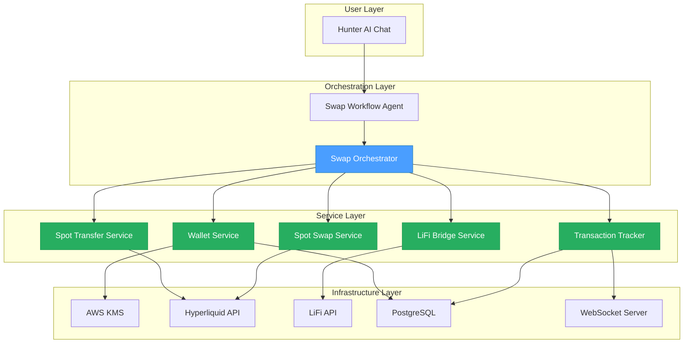

# Hyperliquid Swap Backend Specifications

## 📋 Overview

This directory contains comprehensive technical specifications for implementing the Hyperliquid swap system backend. These specifications provide implementation-ready guidance for developers building the complete swap workflow.

**Created**: 2026-02-04
**Status**: ✅ Approved for Implementation
**Estimated Implementation Time**: 2 days (16 hours)
**Framework Applied**: CTO Engineering Framework (First Principles + Design Thinking + Systems Engineering)

---

## 🎯 Objective

Enable users to swap tokens on Hyperliquid via natural language commands through the Hunter AI chat interface.

**Example User Flow**:
```
User: "Swap 10 USDC → PURR Hyperliquid"
↓
Backend executes:
1. Generate/retrieve user's Hyperliquid wallet
2. Bridge USDC from Privy wallet → HL wallet (via LiFi)
3. Wait for bridge confirmation (~30 sec)
4. Transfer USDC: Perps → Spot
5. Execute swap: USDC → PURR
6. Return result: "15.2 PURR ready"
```

---

## 📐 Architecture Overview



---

## 📚 Specification Documents

### Core Components

#### [01_HYPERLIQUID_WALLET_MANAGEMENT_SPEC.md](./01_HYPERLIQUID_WALLET_MANAGEMENT_SPEC.md)
**Size**: ~25 KB | **Complexity**: High

**Purpose**: Wallet generation, AWS KMS integration, lifecycle management

**Key Topics**:
- Ethereum wallet generation using ethers.js
- AWS KMS encryption/decryption for private keys
- Database schema for `hyperliquid_wallets` table
- Wallet retrieval and caching strategy
- Transaction signing with user-specific wallets

**Critical Security**:
- Envelope encryption with AWS KMS
- No private keys in logs/errors
- 90-day key rotation policy
- Audit logging for all operations

---

#### [02_LIFI_BRIDGE_EXECUTION_SPEC.md](./02_LIFI_BRIDGE_EXECUTION_SPEC.md)
**Size**: ~30 KB | **Complexity**: High

**Purpose**: Bridge assets from Privy wallet to Hyperliquid wallet

**Key Topics**:
- LiFi API integration (quote + execute)
- Source chain selection logic
- Transaction signing with Privy wallet
- Bridge status polling mechanism
- Async execution with WebSocket updates

**Performance Target**:
- Bridge execution: 30s ± 15s
- Status polling: Every 5 seconds
- Max timeout: 5 minutes

---

#### [03_HYPERLIQUID_SPOT_TRANSFER_SPEC.md](./03_HYPERLIQUID_SPOT_TRANSFER_SPEC.md)
**Size**: ~20 KB | **Complexity**: Medium

**Purpose**: Transfer assets from Perps to Spot account on Hyperliquid

**Key Topics**:
- Hyperliquid Exchange API: `spotTransfer` action
- Balance verification before/after transfer
- Transaction signing with HL private key
- Optimization strategies (cache, threshold)

**Performance Target**:
- Transfer execution: < 2 seconds
- Balance verification: < 500ms

---

#### [04_HYPERLIQUID_SPOT_SWAP_SPEC.md](./04_HYPERLIQUID_SPOT_SWAP_SPEC.md)
**Size**: ~25 KB | **Complexity**: High

**Purpose**: Execute spot market orders on Hyperliquid

**Key Topics**:
- Hyperliquid Exchange API: `spotOrder` action
- Order construction (buy vs sell direction)
- Slippage protection (default 1%, max 5%)
- Fill verification and partial fill handling

**Performance Target**:
- Swap execution: < 2 seconds
- Slippage tolerance: 1-2% (100-200 bps)

---

#### [05_TRANSACTION_CONFIRMATION_TRACKING_SPEC.md](./05_TRANSACTION_CONFIRMATION_TRACKING_SPEC.md)
**Size**: ~30 KB | **Complexity**: Medium

**Purpose**: Track and confirm all transaction steps with real-time updates

**Key Topics**:
- Database schema for multi-step tracking
- WebSocket notification system
- Status transitions and state machine
- Retry logic and error recovery

**WebSocket Events**:
- `transaction.created`
- `step.started`, `step.progress`, `step.completed`, `step.failed`
- `transaction.completed`, `transaction.failed`

---

#### [06_END_TO_END_INTEGRATION_SPEC.md](./06_END_TO_END_INTEGRATION_SPEC.md)
**Size**: ~35 KB | **Complexity**: Very High

**Purpose**: Orchestrate all components into complete swap flow

**Key Topics**:
- Complete flow orchestration
- Error recovery strategies
- Rollback procedures
- Performance benchmarks
- Cost analysis
- End-to-end test scenarios

**Performance SLA**:
- Total end-to-end: < 2 minutes
- Cost per swap: ~$0.0001 (backend only)

---

## 🗂️ Document Structure

Each specification follows a consistent structure:

### 1. Overview
- Purpose and scope
- Key objectives
- Component relationships

### 2. Technical Design
- Architecture diagrams (Mermaid)
- Sequence diagrams (Mermaid)
- ER diagrams (Mermaid) for database schemas

### 3. Implementation Details
- Python code examples (production-ready)
- Type hints and docstrings
- Error handling patterns

### 4. API Contracts
- Request/response formats
- HTTP endpoints or method signatures
- WebSocket message formats

### 5. Database Schema
- SQL DDL statements
- Index strategies
- Foreign key relationships

### 6. Error Scenarios
- Common failure modes
- Recovery strategies
- User-facing error messages

### 7. Test Cases
- Unit tests
- Integration tests
- End-to-end scenarios

### 8. Security Considerations
- Authentication/authorization
- Encryption requirements
- Audit logging

### 9. Performance Benchmarks
- Target SLAs
- Acceptable ranges
- Optimization strategies

### 10. References
- Related code files (with line numbers)
- External API documentation
- Related specifications

---

## 🔗 Related Documentation

### Original Specifications
- **Original Spec**: [../hyperliquid.md](../hyperliquid.md) (Spanish)
- **Frontend Specs**: [../frontend/](../frontend/)
  - [INDEX.md](../frontend/INDEX.md)
  - [SWAP_EXECUTION_SPEC.md](../frontend/SWAP_EXECUTION_SPEC.md)
  - [HYPERLIQUID_SWAP_IMPLEMENTATION_PLAN.md](../frontend/HYPERLIQUID_SWAP_IMPLEMENTATION_PLAN.md)

### Codebase References
- **Swap Workflow Agent**: `src/app/infrastructure/adapters/agent_squad/agents/workflows/swap_workflow_agent.py:331-1630`
- **Execute Endpoint**: `src/app/presentation/http/controllers/chat/conversations_router.py:2044+`
- **Hyperliquid Client**: `src/app/infrastructure/adapters/external/hyperliquid_client.py:714-822`
- **Transaction Entity**: `src/app/domain/entities/transaction.py`
- **Token Balances**: `src/app/infrastructure/persistence_sqla/alembic/versions/2026_02_02_0719-*.py`

---

## 📊 Implementation Roadmap

### Phase 1: Core Infrastructure (Day 1 Morning - 4h)
- [ ] Wallet management service
- [ ] AWS KMS integration
- [ ] `hyperliquid_wallets` table migration
- [ ] Unit tests for wallet operations

### Phase 2: Bridge Integration (Day 1 Afternoon - 4h)
- [ ] LiFi bridge service
- [ ] Status polling mechanism
- [ ] WebSocket notifications
- [ ] Integration tests with LiFi

### Phase 3: Swap Execution (Day 2 Morning - 4h)
- [ ] Spot transfer service
- [ ] Spot swap service
- [ ] Slippage protection
- [ ] Unit tests for swap operations

### Phase 4: End-to-End Integration (Day 2 Afternoon - 4h)
- [ ] Orchestrator implementation
- [ ] Transaction tracking
- [ ] Error recovery logic
- [ ] End-to-end testing
- [ ] Production deployment

**Total Estimated Time**: 16 hours (2 days)

---

## ✅ Quality Assurance Checklist

Each specification document includes:

- [x] Implementation-ready code examples (Python with type hints)
- [x] Complete error handling scenarios
- [x] Visual diagrams (Mermaid)
- [x] Test cases (unit + integration + E2E)
- [x] Security considerations
- [x] Cost analysis
- [x] Performance benchmarks
- [x] Database schemas with migrations
- [x] API contracts
- [x] References to actual code (file paths + line numbers)

---

## 🎯 Success Criteria

Implementation is complete when:

1. ✅ User can execute "swap 10 USDC to PURR" via chat
2. ✅ Hyperliquid wallet auto-generated on first swap
3. ✅ LiFi bridge executes successfully (Base → Hyperliquid)
4. ✅ Spot transfer executes (Perps → Spot)
5. ✅ Spot swap executes with slippage protection
6. ✅ Real-time WebSocket updates throughout flow
7. ✅ Transaction persisted to database with all steps
8. ✅ Error recovery handles bridge/swap failures
9. ✅ End-to-end time < 2 minutes
10. ✅ All unit + integration + E2E tests pass
11. ✅ Security audit passes (no private keys exposed)
12. ✅ Performance benchmarks meet SLAs

---

## 📈 Metrics & Monitoring

### Key Performance Indicators

| Metric | Target | Alert Threshold |
|--------|--------|-----------------|
| Swap Success Rate | > 95% | < 90% |
| Average E2E Time | < 90s | > 120s |
| Bridge Success Rate | > 98% | < 95% |
| Swap Fill Rate | > 99% | < 95% |
| Wallet Generation Time | < 100ms | > 500ms |
| KMS Response Time | < 50ms | > 200ms |

### Cost Metrics

| Operation | Cost | Monthly Estimate (1000 swaps) |
|-----------|------|-------------------------------|
| KMS Encrypt/Decrypt | $0.0001 | $0.10 |
| LiFi Bridge Gas | $0.35 (user-paid) | - |
| Hyperliquid Fees | $0.005-0.01 | $5-10 |
| Compute | Negligible | $1 |
| **Total Backend** | **$0.0001** | **$1.10** |

---

## 🔐 Security Architecture

### Key Protection
- **AWS KMS**: Envelope encryption for private keys
- **Key Rotation**: 90-day automatic rotation
- **Access Control**: Service role only, no human access
- **Audit Trail**: All wallet operations logged

### API Security
- **Authentication**: JWT tokens from auth system
- **Rate Limiting**: 10 swaps/min per user
- **Amount Limits**: Min $1, Max $100,000 per swap
- **IP Allowlist**: Backend service IPs only for KMS

### Data Security
- **Encryption at Rest**: PostgreSQL with encryption
- **Encryption in Transit**: TLS 1.3 for all APIs
- **No Logging**: Private keys never logged
- **Secret Management**: AWS Secrets Manager for API keys

---

## 🚀 Getting Started

### For Implementers

1. **Read specifications in order**: 01 → 02 → 03 → 04 → 05 → 06
2. **Review existing code**: Check references in each spec
3. **Set up development environment**:
   ```bash
   make up.db           # Start PostgreSQL
   make create-db       # Create database
   alembic upgrade head # Apply migrations
   ```
4. **Run tests**: `make code.test`
5. **Follow implementation roadmap**: Start with Phase 1

### For Reviewers

1. **Verify completeness**: Check all sections present
2. **Validate code examples**: Ensure Python syntax correct
3. **Test diagrams**: Verify Mermaid renders correctly
4. **Cross-reference**: Check consistency across specs
5. **Security review**: Verify no sensitive data exposed

---

## 📞 Support & Questions

- **Architecture Questions**: Reference [06_END_TO_END_INTEGRATION_SPEC.md](./06_END_TO_END_INTEGRATION_SPEC.md)
- **Security Questions**: Reference security sections in each spec
- **Implementation Questions**: Check code examples and references
- **Original Spec**: See [../hyperliquid.md](../hyperliquid.md)

---

**Document Version**: 1.0
**Last Updated**: 2026-02-04
**Maintained By**: Engineering Team
**Status**: ✅ Ready for Implementation
