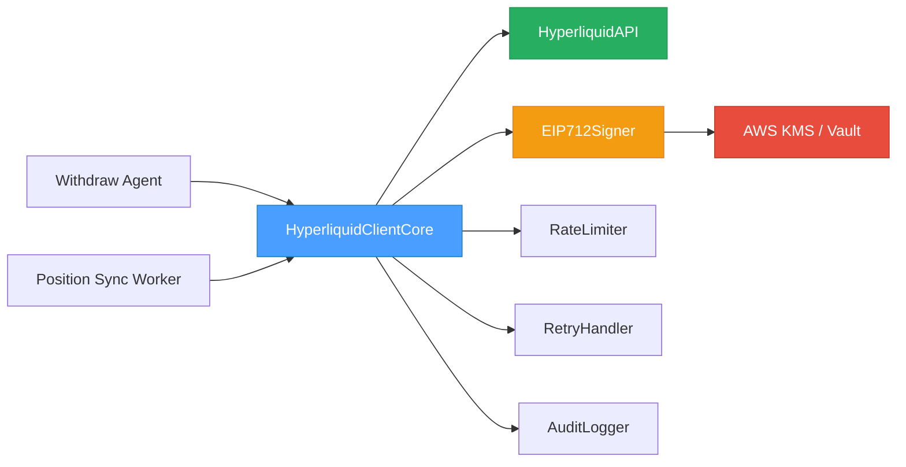
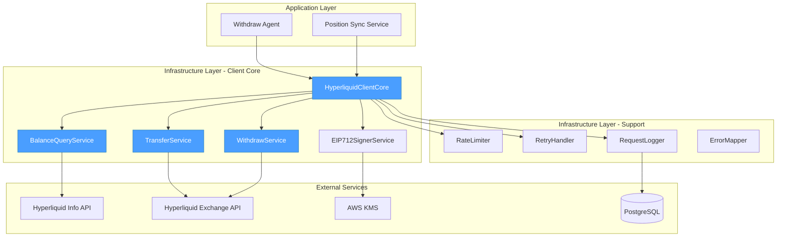
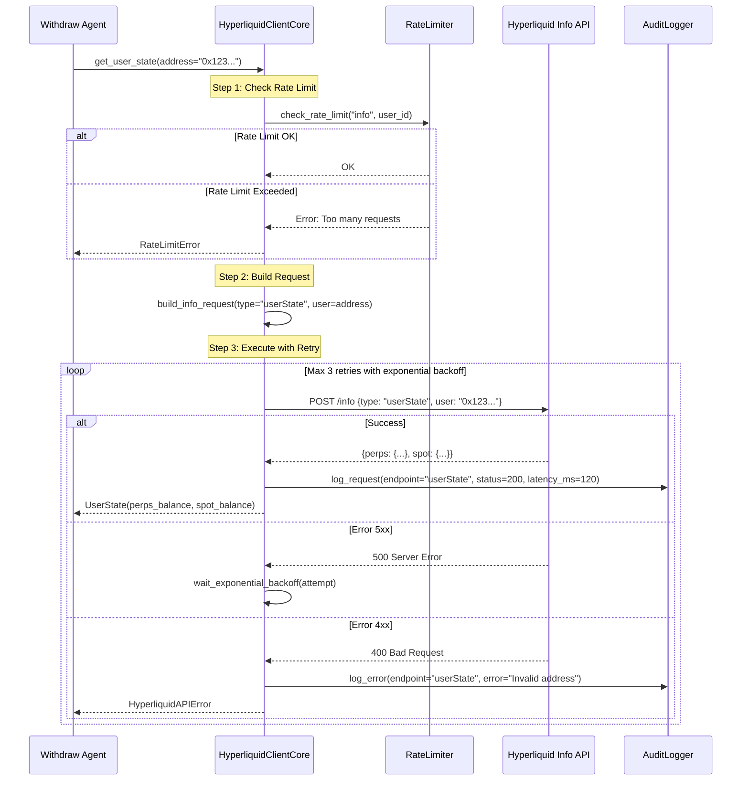
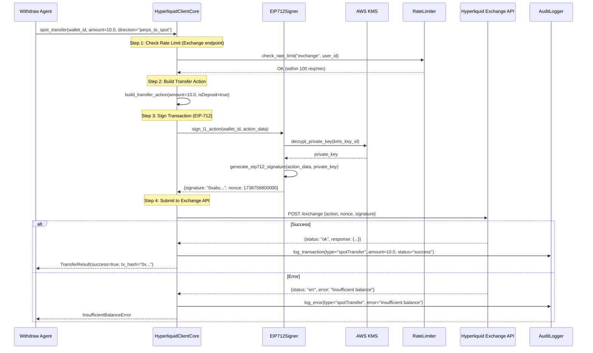
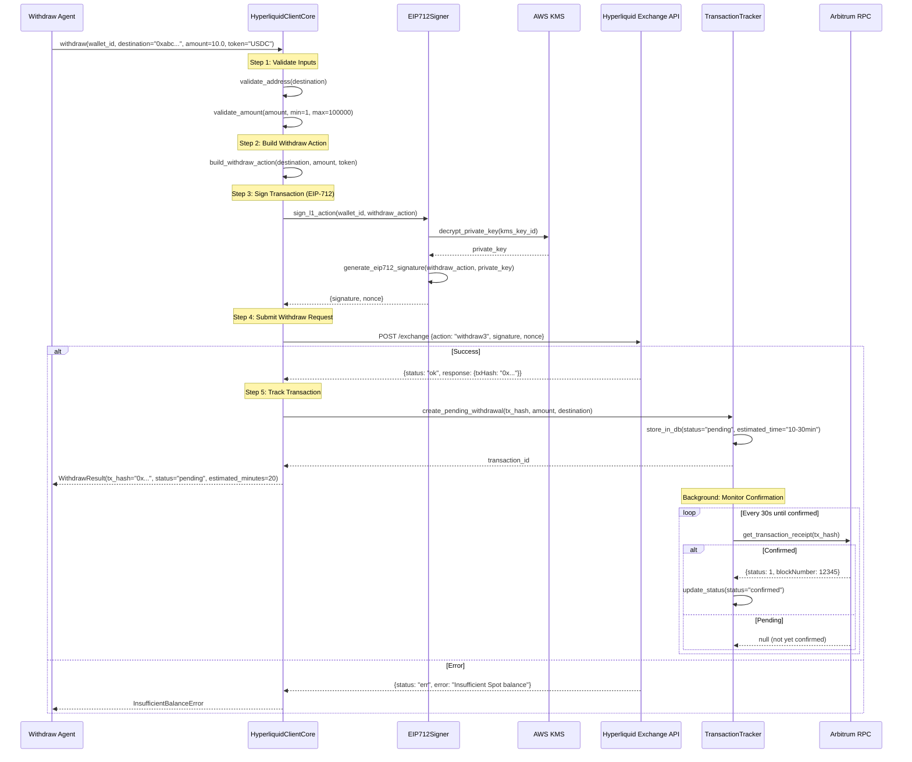

# 01 - Hyperliquid Client Core Specification (Phase 1)

## 📋 Overview

### Purpose

This specification defines the core infrastructure for interacting with Hyperliquid's Exchange API, focusing on account balance queries, internal transfers, and withdrawals. The Hyperliquid Client Core provides the foundation for the withdraw agent and position synchronization system.

### Scope

**In Scope (Phase 1)**:
- `GET userState` — Query Perps and Spot balances for a wallet address
- `POST spotTransfer` — Internal transfer between Perps ↔ Spot accounts
- `POST withdraw` — Withdraw funds from Spot to Arbitrum L1
- EIP-712 transaction signing from backend (secure key management)
- Error handling with exponential backoff retry (3 retries)
- Rate limiting enforcement (1200 req/min info, 100 req/min exchange)
- Request/response logging and audit trail

**Out of Scope (Future Phases)**:
- Trading operations (already implemented in existing `HyperliquidClient`)
- Market data queries (already implemented)
- WebSocket streaming
- Vault operations

### Key Objectives

1. ✅ Query user balances (Perps + Spot) in < 500ms
2. ✅ Execute internal transfers (Perps ↔ Spot) in < 2 seconds
3. ✅ Initiate withdrawals to Arbitrum L1 with proper tracking
4. ✅ Implement secure EIP-712 signing using AWS KMS or Vault
5. ✅ Enforce Hyperliquid API rate limits proactively
6. ✅ Provide detailed error messages with recovery strategies
7. ✅ Maintain complete audit trail of all operations

### Component Relationships



---

## 🏗️ Architecture Design

### System Architecture



### Sequence Diagram: Get User State (Balance Query)



### Sequence Diagram: Spot Transfer (Perps → Spot)



### Sequence Diagram: Withdraw to Arbitrum L1



---

## 💾 Database Schema

### Existing Tables (Reused)

The client core uses existing database tables for audit logging and transaction tracking:

**`transactions` table** (from `05_TRANSACTION_CONFIRMATION_TRACKING_SPEC.md`):
```sql
-- Used for tracking withdrawals
CREATE TABLE transactions (
    id UUID PRIMARY KEY,
    user_id UUID NOT NULL,
    type VARCHAR(50) NOT NULL,  -- 'hyperliquid_withdraw'
    status VARCHAR(50) NOT NULL, -- 'pending', 'confirmed', 'failed'
    tx_hash VARCHAR(66),
    from_address VARCHAR(42),
    to_address VARCHAR(42),
    token VARCHAR(10),
    amount DECIMAL(36, 18),
    chain VARCHAR(20), -- 'arbitrum'
    metadata JSONB,
    created_at TIMESTAMP DEFAULT NOW(),
    updated_at TIMESTAMP DEFAULT NOW()
);
```

**`hyperliquid_api_logs` table** (New - for audit trail):
```sql
CREATE TABLE hyperliquid_api_logs (
    id UUID PRIMARY KEY DEFAULT gen_random_uuid(),
    user_id UUID REFERENCES users(id),
    wallet_address VARCHAR(42) NOT NULL,
    endpoint VARCHAR(50) NOT NULL, -- 'userState', 'spotTransfer', 'withdraw3'
    request_type VARCHAR(20) NOT NULL, -- 'info', 'exchange'
    request_payload JSONB NOT NULL,
    response_payload JSONB,
    status_code INTEGER,
    error_message TEXT,
    latency_ms INTEGER,
    retry_count INTEGER DEFAULT 0,
    rate_limit_bucket VARCHAR(50), -- 'info_1200', 'exchange_100'
    created_at TIMESTAMP DEFAULT NOW(),

    INDEX idx_hl_logs_user (user_id),
    INDEX idx_hl_logs_endpoint (endpoint),
    INDEX idx_hl_logs_created (created_at),
    INDEX idx_hl_logs_status (status_code)
);
```

### Withdrawal Metadata Structure

Stored in `transactions.metadata` JSONB column:

```json
{
  "withdraw_type": "hyperliquid_to_arbitrum",
  "source_account": "spot",
  "initial_spot_balance": "50.5",
  "final_spot_balance": "40.5",
  "destination_address": "0xabc123...",
  "withdraw_request": {
    "nonce": 1738756800000,
    "signature": "0x1234abcd...",
    "submitted_at": "2026-02-04T10:30:00Z"
  },
  "confirmation": {
    "tx_hash": "0xdef456...",
    "block_number": 12345678,
    "confirmed_at": "2026-02-04T10:45:00Z",
    "confirmations": 12,
    "gas_used": "120000",
    "effective_gas_price": "0.1 gwei"
  },
  "estimated_arrival": "2026-02-04T11:00:00Z",
  "actual_arrival": "2026-02-04T10:50:00Z",
  "duration_minutes": 20,
  "bridge_fee": "0.0",
  "hyperliquid_fee": "0.0"
}
```

---

## 🔧 Implementation Details

### Core Client: `HyperliquidClientCore`

```python
# src/app/infrastructure/clients/hyperliquid/client.py
from decimal import Decimal
from typing import Optional, Dict, Any, Literal
from dataclasses import dataclass
from datetime import datetime, UTC, timedelta
import asyncio
from enum import Enum

import httpx

from app.infrastructure.clients.hyperliquid.eip712_signer import EIP712Signer
from app.infrastructure.clients.hyperliquid.rate_limiter import HyperliquidRateLimiter
from app.infrastructure.clients.hyperliquid.exceptions import (
    HyperliquidAPIError,
    RateLimitError,
    InsufficientBalanceError,
    InvalidSignatureError,
    NetworkError,
)


class TransferDirection(str, Enum):
    """Direction for internal spot transfers."""
    PERPS_TO_SPOT = "perps_to_spot"
    SPOT_TO_PERPS = "spot_to_perps"


@dataclass
class UserState:
    """Complete user account state on Hyperliquid."""
    address: str
    perps_balance: Decimal  # USDC in Perps account
    perps_withdrawable: Decimal  # Available to withdraw (not in positions)
    spot_balances: Dict[str, Decimal]  # Token -> Balance mapping
    open_positions: list[Dict[str, Any]]  # Active perpetual positions
    timestamp: int


@dataclass
class TransferResult:
    """Result of internal spot transfer operation."""
    success: bool
    tx_hash: Optional[str]
    from_account: str  # "perps" or "spot"
    to_account: str  # "spot" or "perps"
    amount: Decimal
    token: str
    nonce: int
    timestamp: int
    error: Optional[str] = None


@dataclass
class WithdrawResult:
    """Result of withdraw operation to L1."""
    success: bool
    tx_hash: Optional[str]
    destination: str
    amount: Decimal
    token: str
    status: str  # "pending", "confirmed", "failed"
    estimated_arrival_minutes: int
    nonce: int
    timestamp: int
    error: Optional[str] = None


class HyperliquidClientCore:
    """
    Core client for Hyperliquid Exchange API operations.

    Provides:
    - Balance queries (Perps + Spot)
    - Internal transfers (Perps ↔ Spot)
    - Withdrawals to Arbitrum L1
    - Secure EIP-712 signing
    - Rate limiting enforcement
    - Retry logic with exponential backoff
    - Complete audit logging

    Rate Limits:
    - Info endpoint: 1200 requests/minute
    - Exchange endpoint: 100 requests/minute

    API Documentation:
    https://hyperliquid.gitbook.io/hyperliquid-docs/for-developers/api
    """

    # API Endpoints
    BASE_URL = "https://api.hyperliquid.xyz"
    INFO_ENDPOINT = "/info"
    EXCHANGE_ENDPOINT = "/exchange"

    # Retry Configuration
    MAX_RETRIES = 3
    RETRY_BASE_DELAY = 1.0  # seconds
    RETRY_MAX_DELAY = 10.0  # seconds

    # Validation Limits
    MIN_WITHDRAW_AMOUNT = Decimal("1.0")  # 1 USDC minimum
    MAX_WITHDRAW_AMOUNT = Decimal("100000.0")  # 100k USDC maximum

    # Estimated withdrawal time (minutes)
    ESTIMATED_WITHDRAW_TIME = 20  # 10-30 minutes typical

    def __init__(
        self,
        eip712_signer: EIP712Signer,
        rate_limiter: HyperliquidRateLimiter,
        audit_logger: 'HyperliquidAuditLogger',
        testnet: bool = False,
    ):
        """
        Initialize Hyperliquid client core.

        Args:
            eip712_signer: Service for EIP-712 transaction signing
            rate_limiter: Rate limiting enforcement
            audit_logger: Audit trail logging
            testnet: Use testnet API (default: False)
        """
        self._signer = eip712_signer
        self._rate_limiter = rate_limiter
        self._audit_logger = audit_logger

        self._base_url = (
            "https://api.hyperliquid-testnet.xyz" if testnet else self.BASE_URL
        )

        self._client = httpx.AsyncClient(
            base_url=self._base_url,
            timeout=30.0,
            headers={
                "Content-Type": "application/json",
            },
        )

    async def close(self):
        """Close HTTP client."""
        await self._client.aclose()

    async def get_user_state(
        self,
        address: str,
    ) -> UserState:
        """
        Query complete user account state (Perps + Spot balances).

        Makes 2 API calls:
        1. clearinghouseState - for Perps balance
        2. spotClearinghouseState - for Spot balances

        Args:
            address: User's Ethereum address (0x...)

        Returns:
            UserState with complete balance information

        Raises:
            RateLimitError: If rate limit exceeded
            HyperliquidAPIError: If API returns error
            NetworkError: If network/timeout error

        Example:
            >>> state = await client.get_user_state("0x123...")
            >>> print(f"Perps USDC: {state.perps_balance}")
            >>> print(f"Spot USDC: {state.spot_balances.get('USDC', 0)}")
        """
        # Check rate limit (Info endpoint)
        await self._rate_limiter.check_rate_limit("info", address)

        start_time = datetime.now(UTC)

        try:
            # Query 1: Perps balance
            perps_data = await self._make_info_request(
                request_type="clearinghouseState",
                params={"user": address},
            )

            # Query 2: Spot balance
            spot_data = await self._make_info_request(
                request_type="spotClearinghouseState",
                params={"user": address},
            )

            # Parse Perps balance
            margin_summary = perps_data.get("marginSummary", {})
            perps_balance = Decimal(str(margin_summary.get("accountValue", "0")))
            perps_withdrawable = Decimal(str(perps_data.get("withdrawable", "0")))

            # Parse Spot balances
            spot_balances: Dict[str, Decimal] = {}
            for balance_entry in spot_data.get("balances", []):
                token = balance_entry.get("coin", "")
                total = Decimal(str(balance_entry.get("total", "0")))
                if total > 0:
                    spot_balances[token] = total

            # Parse open positions
            open_positions = []
            for pos in perps_data.get("assetPositions", []):
                position_data = pos.get("position", {})
                size = float(position_data.get("szi", 0))
                if size != 0:
                    open_positions.append({
                        "symbol": position_data.get("coin", ""),
                        "side": "long" if size > 0 else "short",
                        "size": abs(size),
                        "entry_price": float(position_data.get("entryPx", 0)),
                        "unrealized_pnl": float(position_data.get("unrealizedPnl", 0)),
                    })

            latency_ms = int((datetime.now(UTC) - start_time).total_seconds() * 1000)

            # Log successful request
            await self._audit_logger.log_request(
                endpoint="userState",
                request_type="info",
                wallet_address=address,
                status_code=200,
                latency_ms=latency_ms,
            )

            return UserState(
                address=address,
                perps_balance=perps_balance,
                perps_withdrawable=perps_withdrawable,
                spot_balances=spot_balances,
                open_positions=open_positions,
                timestamp=int(datetime.now(UTC).timestamp() * 1000),
            )

        except Exception as e:
            latency_ms = int((datetime.now(UTC) - start_time).total_seconds() * 1000)

            # Log error
            await self._audit_logger.log_error(
                endpoint="userState",
                request_type="info",
                wallet_address=address,
                error_message=str(e),
                latency_ms=latency_ms,
            )

            raise

    async def spot_transfer(
        self,
        wallet_id: int,
        amount: Decimal,
        direction: TransferDirection,
        token: str = "USDC",
    ) -> TransferResult:
        """
        Execute internal transfer between Perps and Spot accounts.

        This is an instant, gas-free operation that moves funds between
        the two account types within Hyperliquid.

        Args:
            wallet_id: User's wallet ID (for signing)
            amount: Amount to transfer (USDC)
            direction: PERPS_TO_SPOT or SPOT_TO_PERPS
            token: Token symbol (default: "USDC")

        Returns:
            TransferResult with transaction details

        Raises:
            RateLimitError: If rate limit exceeded
            InsufficientBalanceError: If source account lacks funds
            InvalidSignatureError: If signature validation fails
            HyperliquidAPIError: If API returns error

        Example:
            >>> result = await client.spot_transfer(
            ...     wallet_id=123,
            ...     amount=Decimal("10.0"),
            ...     direction=TransferDirection.PERPS_TO_SPOT,
            ... )
            >>> if result.success:
            ...     print(f"Transferred {result.amount} from {result.from_account} to {result.to_account}")
        """
        # Check rate limit (Exchange endpoint)
        await self._rate_limiter.check_rate_limit("exchange", str(wallet_id))

        start_time = datetime.now(UTC)

        # Determine transfer direction
        is_deposit = direction == TransferDirection.PERPS_TO_SPOT
        from_account = "perps" if is_deposit else "spot"
        to_account = "spot" if is_deposit else "perps"

        try:
            # Build transfer action
            action = {
                "type": "spotTransfer",
                "hyperliquidChain": "Mainnet",
                "signatureChainId": "0xa4b1",  # Arbitrum chain ID
                "isDeposit": is_deposit,
                "usdcSize": str(amount),
            }

            # Sign transaction (EIP-712)
            signed_tx = await self._signer.sign_l1_action(
                wallet_id=wallet_id,
                action=action,
            )

            # Submit to Exchange API
            response_data = await self._make_exchange_request(
                action=action,
                signature=signed_tx["signature"],
                nonce=signed_tx["nonce"],
            )

            latency_ms = int((datetime.now(UTC) - start_time).total_seconds() * 1000)

            # Parse response
            if response_data.get("status") == "ok":
                # Log successful transfer
                await self._audit_logger.log_request(
                    endpoint="spotTransfer",
                    request_type="exchange",
                    wallet_address=signed_tx.get("wallet_address", ""),
                    request_payload=action,
                    response_payload=response_data,
                    status_code=200,
                    latency_ms=latency_ms,
                )

                return TransferResult(
                    success=True,
                    tx_hash=response_data.get("response", {}).get("data", {}).get("txHash"),
                    from_account=from_account,
                    to_account=to_account,
                    amount=amount,
                    token=token,
                    nonce=signed_tx["nonce"],
                    timestamp=int(datetime.now(UTC).timestamp() * 1000),
                )
            else:
                # Parse error
                error_msg = response_data.get("response", {}).get("error", "Unknown error")

                # Log error
                await self._audit_logger.log_error(
                    endpoint="spotTransfer",
                    request_type="exchange",
                    wallet_address=signed_tx.get("wallet_address", ""),
                    error_message=error_msg,
                    latency_ms=latency_ms,
                )

                # Map to specific exception
                if "insufficient" in error_msg.lower():
                    raise InsufficientBalanceError(
                        f"Insufficient {token} in {from_account} account: {error_msg}"
                    )
                else:
                    raise HyperliquidAPIError(f"Transfer failed: {error_msg}")

        except Exception as e:
            latency_ms = int((datetime.now(UTC) - start_time).total_seconds() * 1000)

            await self._audit_logger.log_error(
                endpoint="spotTransfer",
                request_type="exchange",
                wallet_address="",
                error_message=str(e),
                latency_ms=latency_ms,
            )

            raise

    async def withdraw(
        self,
        wallet_id: int,
        destination: str,
        amount: Decimal,
        token: str = "USDC",
    ) -> WithdrawResult:
        """
        Withdraw funds from Spot account to Arbitrum L1.

        This operation:
        1. Withdraws from Hyperliquid Spot to Arbitrum L1
        2. Takes 10-30 minutes to confirm on Arbitrum
        3. Funds appear in destination address on Arbitrum
        4. No gas fee (paid by Hyperliquid)

        Args:
            wallet_id: User's wallet ID (for signing)
            destination: Destination address on Arbitrum (0x...)
            amount: Amount to withdraw (USDC)
            token: Token symbol (default: "USDC")

        Returns:
            WithdrawResult with transaction details and status

        Raises:
            ValueError: If amount out of range or invalid address
            RateLimitError: If rate limit exceeded
            InsufficientBalanceError: If Spot balance insufficient
            InvalidSignatureError: If signature validation fails
            HyperliquidAPIError: If API returns error

        Example:
            >>> result = await client.withdraw(
            ...     wallet_id=123,
            ...     destination="0xabc...",
            ...     amount=Decimal("10.0"),
            ... )
            >>> if result.success:
            ...     print(f"Withdraw initiated: {result.tx_hash}")
            ...     print(f"Estimated arrival: {result.estimated_arrival_minutes} minutes")
        """
        # Validate inputs
        self._validate_withdraw_inputs(destination, amount)

        # Check rate limit (Exchange endpoint)
        await self._rate_limiter.check_rate_limit("exchange", str(wallet_id))

        start_time = datetime.now(UTC)

        try:
            # Build withdraw action
            action = {
                "type": "withdraw3",
                "hyperliquidChain": "Mainnet",
                "signatureChainId": "0xa4b1",  # Arbitrum
                "amount": str(amount),
                "time": int(datetime.now(UTC).timestamp() * 1000),
                "destination": destination,
            }

            # Sign transaction (EIP-712)
            signed_tx = await self._signer.sign_l1_action(
                wallet_id=wallet_id,
                action=action,
            )

            # Submit to Exchange API
            response_data = await self._make_exchange_request(
                action=action,
                signature=signed_tx["signature"],
                nonce=signed_tx["nonce"],
            )

            latency_ms = int((datetime.now(UTC) - start_time).total_seconds() * 1000)

            # Parse response
            if response_data.get("status") == "ok":
                tx_hash = response_data.get("response", {}).get("data", {}).get("txHash")

                # Log successful withdraw
                await self._audit_logger.log_request(
                    endpoint="withdraw3",
                    request_type="exchange",
                    wallet_address=signed_tx.get("wallet_address", ""),
                    request_payload=action,
                    response_payload=response_data,
                    status_code=200,
                    latency_ms=latency_ms,
                )

                return WithdrawResult(
                    success=True,
                    tx_hash=tx_hash,
                    destination=destination,
                    amount=amount,
                    token=token,
                    status="pending",
                    estimated_arrival_minutes=self.ESTIMATED_WITHDRAW_TIME,
                    nonce=signed_tx["nonce"],
                    timestamp=int(datetime.now(UTC).timestamp() * 1000),
                )
            else:
                # Parse error
                error_msg = response_data.get("response", {}).get("error", "Unknown error")

                # Log error
                await self._audit_logger.log_error(
                    endpoint="withdraw3",
                    request_type="exchange",
                    wallet_address=signed_tx.get("wallet_address", ""),
                    error_message=error_msg,
                    latency_ms=latency_ms,
                )

                # Map to specific exception
                if "insufficient" in error_msg.lower():
                    raise InsufficientBalanceError(
                        f"Insufficient {token} in Spot account: {error_msg}"
                    )
                else:
                    raise HyperliquidAPIError(f"Withdraw failed: {error_msg}")

        except Exception as e:
            latency_ms = int((datetime.now(UTC) - start_time).total_seconds() * 1000)

            await self._audit_logger.log_error(
                endpoint="withdraw3",
                request_type="exchange",
                wallet_address="",
                error_message=str(e),
                latency_ms=latency_ms,
            )

            raise

    # ========================================
    # PRIVATE HELPER METHODS
    # ========================================

    def _validate_withdraw_inputs(self, destination: str, amount: Decimal) -> None:
        """
        Validate withdraw inputs.

        Args:
            destination: Destination address
            amount: Withdraw amount

        Raises:
            ValueError: If validation fails
        """
        # Validate address format
        if not destination.startswith("0x") or len(destination) != 42:
            raise ValueError(f"Invalid destination address: {destination}")

        # Validate amount range
        if amount < self.MIN_WITHDRAW_AMOUNT:
            raise ValueError(
                f"Withdraw amount {amount} below minimum {self.MIN_WITHDRAW_AMOUNT}"
            )

        if amount > self.MAX_WITHDRAW_AMOUNT:
            raise ValueError(
                f"Withdraw amount {amount} exceeds maximum {self.MAX_WITHDRAW_AMOUNT}"
            )

    async def _make_info_request(
        self,
        request_type: str,
        params: Dict[str, Any],
    ) -> Dict[str, Any]:
        """
        Make request to Info API with retry logic.

        Args:
            request_type: Type of info request (e.g., "userState")
            params: Request parameters

        Returns:
            Response data

        Raises:
            HyperliquidAPIError: If all retries fail
            NetworkError: If network error occurs
        """
        payload = {"type": request_type, **params}

        for attempt in range(self.MAX_RETRIES):
            try:
                response = await self._client.post(
                    self.INFO_ENDPOINT,
                    json=payload,
                )
                response.raise_for_status()
                return response.json()

            except httpx.HTTPStatusError as e:
                if e.response.status_code >= 500:
                    # Server error - retry with exponential backoff
                    if attempt < self.MAX_RETRIES - 1:
                        delay = min(
                            self.RETRY_BASE_DELAY * (2 ** attempt),
                            self.RETRY_MAX_DELAY,
                        )
                        await asyncio.sleep(delay)
                        continue
                    else:
                        raise HyperliquidAPIError(
                            f"Info API error after {self.MAX_RETRIES} retries: {e}"
                        )
                else:
                    # Client error - don't retry
                    raise HyperliquidAPIError(f"Info API error: {e}")

            except (httpx.TimeoutException, httpx.NetworkError) as e:
                if attempt < self.MAX_RETRIES - 1:
                    delay = min(
                        self.RETRY_BASE_DELAY * (2 ** attempt),
                        self.RETRY_MAX_DELAY,
                    )
                    await asyncio.sleep(delay)
                    continue
                else:
                    raise NetworkError(f"Network error after {self.MAX_RETRIES} retries: {e}")

    async def _make_exchange_request(
        self,
        action: Dict[str, Any],
        signature: str,
        nonce: int,
    ) -> Dict[str, Any]:
        """
        Make request to Exchange API with retry logic.

        Args:
            action: Exchange action payload
            signature: EIP-712 signature
            nonce: Transaction nonce

        Returns:
            Response data

        Raises:
            HyperliquidAPIError: If all retries fail
            NetworkError: If network error occurs
        """
        payload = {
            "action": action,
            "nonce": nonce,
            "signature": signature,
            "vaultAddress": None,  # Not using vault
        }

        for attempt in range(self.MAX_RETRIES):
            try:
                response = await self._client.post(
                    self.EXCHANGE_ENDPOINT,
                    json=payload,
                )
                response.raise_for_status()
                return response.json()

            except httpx.HTTPStatusError as e:
                if e.response.status_code >= 500:
                    # Server error - retry with exponential backoff
                    if attempt < self.MAX_RETRIES - 1:
                        delay = min(
                            self.RETRY_BASE_DELAY * (2 ** attempt),
                            self.RETRY_MAX_DELAY,
                        )
                        await asyncio.sleep(delay)
                        continue
                    else:
                        raise HyperliquidAPIError(
                            f"Exchange API error after {self.MAX_RETRIES} retries: {e}"
                        )
                else:
                    # Client error - don't retry
                    raise HyperliquidAPIError(f"Exchange API error: {e}")

            except (httpx.TimeoutException, httpx.NetworkError) as e:
                if attempt < self.MAX_RETRIES - 1:
                    delay = min(
                        self.RETRY_BASE_DELAY * (2 ** attempt),
                        self.RETRY_MAX_DELAY,
                    )
                    await asyncio.sleep(delay)
                    continue
                else:
                    raise NetworkError(f"Network error after {self.MAX_RETRIES} retries: {e}")
```

### EIP-712 Signer Service

```python
# src/app/infrastructure/clients/hyperliquid/eip712_signer.py
from typing import Dict, Any
from datetime import datetime, UTC
import json
import hashlib

from eth_account import Account
from eth_account.messages import encode_structured_data
from eth_utils import to_checksum_address

from app.infrastructure.security.kms_client import KMSClient


class EIP712Signer:
    """
    EIP-712 transaction signer for Hyperliquid operations.

    Handles:
    - EIP-712 structured data signing
    - Private key decryption from AWS KMS
    - Signature generation for Exchange API
    - Wallet address derivation

    Security:
    - Private keys never stored in memory longer than needed
    - All operations use AWS KMS for key decryption
    - Signatures are deterministic and verifiable
    """

    # EIP-712 Domain for Hyperliquid
    HYPERLIQUID_DOMAIN = {
        "name": "Exchange",
        "version": "1",
        "chainId": 42161,  # Arbitrum
        "verifyingContract": "0x0000000000000000000000000000000000000000",
    }

    def __init__(self, kms_client: KMSClient):
        """
        Initialize EIP-712 signer.

        Args:
            kms_client: AWS KMS client for private key decryption
        """
        self._kms = kms_client

    async def sign_l1_action(
        self,
        wallet_id: int,
        action: Dict[str, Any],
    ) -> Dict[str, Any]:
        """
        Sign Hyperliquid Exchange action using EIP-712.

        Args:
            wallet_id: Wallet identifier
            action: Action payload (spotTransfer, withdraw3, etc.)

        Returns:
            Dict with signature, nonce, and wallet address

        Example:
            >>> signed = await signer.sign_l1_action(
            ...     wallet_id=123,
            ...     action={"type": "spotTransfer", "usdcSize": "10.0", ...}
            ... )
            >>> print(signed["signature"])  # 0x1234abcd...
        """
        # Get wallet private key (decrypt from KMS)
        private_key = await self._kms.decrypt_wallet_private_key(wallet_id)

        try:
            # Derive wallet address
            account = Account.from_key(private_key)
            wallet_address = to_checksum_address(account.address)

            # Generate nonce
            nonce = int(datetime.now(UTC).timestamp() * 1000)

            # Build EIP-712 structured data
            structured_data = {
                "types": {
                    "EIP712Domain": [
                        {"name": "name", "type": "string"},
                        {"name": "version", "type": "string"},
                        {"name": "chainId", "type": "uint256"},
                        {"name": "verifyingContract", "type": "address"},
                    ],
                    "Agent": [
                        {"name": "source", "type": "string"},
                        {"name": "connectionId", "type": "bytes32"},
                    ],
                    "Action": self._get_action_type_definition(action["type"]),
                },
                "primaryType": "Action",
                "domain": self.HYPERLIQUID_DOMAIN,
                "message": {
                    **action,
                    "nonce": nonce,
                },
            }

            # Encode and sign
            encoded_data = encode_structured_data(structured_data)
            signed_message = account.sign_message(encoded_data)
            signature = signed_message.signature.hex()

            return {
                "signature": f"0x{signature}" if not signature.startswith("0x") else signature,
                "nonce": nonce,
                "wallet_address": wallet_address,
            }

        finally:
            # Clear private key from memory
            private_key = None
            del private_key

    def _get_action_type_definition(self, action_type: str) -> list[Dict[str, str]]:
        """
        Get EIP-712 type definition for action.

        Args:
            action_type: Type of action (spotTransfer, withdraw3, etc.)

        Returns:
            EIP-712 type definition
        """
        if action_type == "spotTransfer":
            return [
                {"name": "type", "type": "string"},
                {"name": "hyperliquidChain", "type": "string"},
                {"name": "signatureChainId", "type": "string"},
                {"name": "isDeposit", "type": "bool"},
                {"name": "usdcSize", "type": "string"},
                {"name": "nonce", "type": "uint64"},
            ]
        elif action_type == "withdraw3":
            return [
                {"name": "type", "type": "string"},
                {"name": "hyperliquidChain", "type": "string"},
                {"name": "signatureChainId", "type": "string"},
                {"name": "amount", "type": "string"},
                {"name": "time", "type": "uint64"},
                {"name": "destination", "type": "address"},
                {"name": "nonce", "type": "uint64"},
            ]
        else:
            raise ValueError(f"Unknown action type: {action_type}")
```

### Rate Limiter

```python
# src/app/infrastructure/clients/hyperliquid/rate_limiter.py
from typing import Literal
from datetime import datetime, UTC, timedelta
import asyncio

from redis.asyncio import Redis

from app.infrastructure.clients.hyperliquid.exceptions import RateLimitError


class HyperliquidRateLimiter:
    """
    Rate limiter for Hyperliquid API compliance.

    Enforces:
    - Info endpoint: 1200 requests/minute
    - Exchange endpoint: 100 requests/minute

    Uses Redis for distributed rate limiting across multiple workers.
    """

    # Rate limit configurations
    INFO_LIMIT = 1200  # requests per minute
    EXCHANGE_LIMIT = 100  # requests per minute

    # Redis key TTL (cleanup after 2 minutes)
    KEY_TTL = 120

    def __init__(self, redis: Redis):
        """
        Initialize rate limiter.

        Args:
            redis: Redis client for distributed counting
        """
        self._redis = redis

    async def check_rate_limit(
        self,
        endpoint_type: Literal["info", "exchange"],
        identifier: str,
    ) -> None:
        """
        Check if request is within rate limit.

        Uses sliding window algorithm with Redis.

        Args:
            endpoint_type: "info" or "exchange"
            identifier: User/wallet identifier for rate limiting

        Raises:
            RateLimitError: If rate limit exceeded

        Example:
            >>> await rate_limiter.check_rate_limit("info", "user_123")
            >>> # If OK, proceed with request
        """
        limit = self.INFO_LIMIT if endpoint_type == "info" else self.EXCHANGE_LIMIT

        # Redis key: hl_rate:{endpoint}:{identifier}:{minute}
        current_minute = datetime.now(UTC).replace(second=0, microsecond=0)
        redis_key = f"hl_rate:{endpoint_type}:{identifier}:{current_minute.isoformat()}"

        # Increment counter
        count = await self._redis.incr(redis_key)

        # Set expiration on first increment
        if count == 1:
            await self._redis.expire(redis_key, self.KEY_TTL)

        # Check limit
        if count > limit:
            # Calculate wait time
            next_minute = current_minute + timedelta(minutes=1)
            wait_seconds = int((next_minute - datetime.now(UTC)).total_seconds())

            raise RateLimitError(
                f"{endpoint_type.capitalize()} endpoint rate limit exceeded "
                f"({count}/{limit} requests). "
                f"Please wait {wait_seconds} seconds."
            )

    async def get_current_usage(
        self,
        endpoint_type: Literal["info", "exchange"],
        identifier: str,
    ) -> int:
        """
        Get current request count for this minute.

        Args:
            endpoint_type: "info" or "exchange"
            identifier: User/wallet identifier

        Returns:
            Current request count
        """
        current_minute = datetime.now(UTC).replace(second=0, microsecond=0)
        redis_key = f"hl_rate:{endpoint_type}:{identifier}:{current_minute.isoformat()}"

        count = await self._redis.get(redis_key)
        return int(count) if count else 0
```

### Custom Exceptions

```python
# src/app/infrastructure/clients/hyperliquid/exceptions.py
"""Custom exceptions for Hyperliquid Client Core."""


class HyperliquidAPIError(Exception):
    """Base exception for Hyperliquid API errors."""
    pass


class RateLimitError(HyperliquidAPIError):
    """Raised when API rate limit is exceeded."""
    pass


class InsufficientBalanceError(HyperliquidAPIError):
    """Raised when account balance is insufficient for operation."""
    pass


class InvalidSignatureError(HyperliquidAPIError):
    """Raised when transaction signature is invalid."""
    pass


class NetworkError(HyperliquidAPIError):
    """Raised when network/timeout error occurs."""
    pass


class WithdrawError(HyperliquidAPIError):
    """Raised when withdrawal fails."""
    pass
```

### Audit Logger

```python
# src/app/infrastructure/clients/hyperliquid/audit_logger.py
from typing import Optional, Dict, Any
from datetime import datetime, UTC
from uuid import uuid4

from sqlalchemy.ext.asyncio import AsyncSession

from app.infrastructure.persistence_sqla.models import HyperliquidAPILog


class HyperliquidAuditLogger:
    """
    Audit logger for Hyperliquid API requests.

    Logs all requests, responses, and errors to database for:
    - Compliance and audit trail
    - Performance monitoring
    - Error analysis
    - Rate limit tracking
    """

    def __init__(self, db_session: AsyncSession):
        """
        Initialize audit logger.

        Args:
            db_session: Database session
        """
        self._db = db_session

    async def log_request(
        self,
        endpoint: str,
        request_type: str,
        wallet_address: str,
        status_code: int,
        latency_ms: int,
        request_payload: Optional[Dict[str, Any]] = None,
        response_payload: Optional[Dict[str, Any]] = None,
        user_id: Optional[int] = None,
    ) -> None:
        """
        Log successful API request.

        Args:
            endpoint: API endpoint (userState, spotTransfer, withdraw3)
            request_type: "info" or "exchange"
            wallet_address: Wallet address
            status_code: HTTP status code
            latency_ms: Request latency in milliseconds
            request_payload: Request data (optional)
            response_payload: Response data (optional)
            user_id: User ID (optional)
        """
        log_entry = HyperliquidAPILog(
            id=uuid4(),
            user_id=user_id,
            wallet_address=wallet_address,
            endpoint=endpoint,
            request_type=request_type,
            request_payload=request_payload or {},
            response_payload=response_payload or {},
            status_code=status_code,
            error_message=None,
            latency_ms=latency_ms,
            retry_count=0,
            rate_limit_bucket=f"{request_type}_{status_code}",
            created_at=datetime.now(UTC),
        )

        self._db.add(log_entry)
        await self._db.commit()

    async def log_error(
        self,
        endpoint: str,
        request_type: str,
        wallet_address: str,
        error_message: str,
        latency_ms: int,
        request_payload: Optional[Dict[str, Any]] = None,
        user_id: Optional[int] = None,
    ) -> None:
        """
        Log failed API request.

        Args:
            endpoint: API endpoint
            request_type: "info" or "exchange"
            wallet_address: Wallet address
            error_message: Error description
            latency_ms: Request latency
            request_payload: Request data (optional)
            user_id: User ID (optional)
        """
        log_entry = HyperliquidAPILog(
            id=uuid4(),
            user_id=user_id,
            wallet_address=wallet_address,
            endpoint=endpoint,
            request_type=request_type,
            request_payload=request_payload or {},
            response_payload=None,
            status_code=None,
            error_message=error_message,
            latency_ms=latency_ms,
            retry_count=0,
            rate_limit_bucket=f"{request_type}_error",
            created_at=datetime.now(UTC),
        )

        self._db.add(log_entry)
        await self._db.commit()
```

---

## 📡 API Contracts

### Hyperliquid Info API: `userState`

**Endpoint**: `POST https://api.hyperliquid.xyz/info`

**Request** (Perps Balance):
```json
{
  "type": "clearinghouseState",
  "user": "0x1234567890abcdef..."
}
```

**Response**:
```json
{
  "marginSummary": {
    "accountValue": "50.5",
    "totalNtlPos": "0",
    "totalRawUsd": "50.5"
  },
  "withdrawable": "50.5",
  "assetPositions": [
    {
      "position": {
        "coin": "ETH",
        "szi": "0.5",
        "entryPx": "3000.0",
        "unrealizedPnl": "50.0"
      }
    }
  ]
}
```

**Request** (Spot Balance):
```json
{
  "type": "spotClearinghouseState",
  "user": "0x1234567890abcdef..."
}
```

**Response**:
```json
{
  "balances": [
    {
      "coin": "USDC",
      "hold": "0",
      "total": "10.5"
    },
    {
      "coin": "PURR",
      "hold": "0",
      "total": "15234.5"
    }
  ]
}
```

### Hyperliquid Exchange API: `spotTransfer`

**Endpoint**: `POST https://api.hyperliquid.xyz/exchange`

**Request**:
```json
{
  "action": {
    "type": "spotTransfer",
    "hyperliquidChain": "Mainnet",
    "signatureChainId": "0xa4b1",
    "isDeposit": true,
    "usdcSize": "10.0"
  },
  "nonce": 1738756800000,
  "signature": "0x1234abcd...",
  "vaultAddress": null
}
```

**Success Response**:
```json
{
  "status": "ok",
  "response": {
    "type": "spotTransfer",
    "data": {
      "statuses": [
        {
          "status": "success"
        }
      ]
    }
  }
}
```

**Error Response**:
```json
{
  "status": "err",
  "response": {
    "error": "Insufficient balance in perps account"
  }
}
```

### Hyperliquid Exchange API: `withdraw3`

**Endpoint**: `POST https://api.hyperliquid.xyz/exchange`

**Request**:
```json
{
  "action": {
    "type": "withdraw3",
    "hyperliquidChain": "Mainnet",
    "signatureChainId": "0xa4b1",
    "amount": "10.0",
    "time": 1738756800000,
    "destination": "0xabc123..."
  },
  "nonce": 1738756800000,
  "signature": "0x5678efgh...",
  "vaultAddress": null
}
```

**Success Response**:
```json
{
  "status": "ok",
  "response": {
    "type": "withdraw",
    "data": {
      "txHash": "0xdef456...",
      "status": "pending"
    }
  }
}
```

**Error Response**:
```json
{
  "status": "err",
  "response": {
    "error": "Insufficient Spot balance"
  }
}
```

---

## 🧪 Test Cases

### Unit Tests

```python
# tests/unit/clients/test_hyperliquid_client_core.py
import pytest
from decimal import Decimal
from unittest.mock import AsyncMock, MagicMock, patch

from app.infrastructure.clients.hyperliquid.client import (
    HyperliquidClientCore,
    UserState,
    TransferResult,
    WithdrawResult,
    TransferDirection,
)
from app.infrastructure.clients.hyperliquid.exceptions import (
    RateLimitError,
    InsufficientBalanceError,
    HyperliquidAPIError,
)


@pytest.fixture
def client_core():
    """Create client core with mocked dependencies."""
    signer = AsyncMock()
    rate_limiter = AsyncMock()
    audit_logger = AsyncMock()

    client = HyperliquidClientCore(
        eip712_signer=signer,
        rate_limiter=rate_limiter,
        audit_logger=audit_logger,
        testnet=False,
    )

    # Mock HTTP client
    client._client = AsyncMock()

    return client


@pytest.mark.asyncio
async def test_get_user_state_returns_complete_data(client_core):
    """Test that user state includes Perps and Spot balances."""
    # Arrange
    client_core._make_info_request = AsyncMock(
        side_effect=[
            # Perps balance response
            {
                "marginSummary": {"accountValue": "50.5"},
                "withdrawable": "50.5",
                "assetPositions": [],
            },
            # Spot balance response
            {
                "balances": [
                    {"coin": "USDC", "total": "10.5"},
                    {"coin": "PURR", "total": "15234.5"},
                ]
            },
        ]
    )

    # Act
    state = await client_core.get_user_state("0x123...")

    # Assert
    assert state.perps_balance == Decimal("50.5")
    assert state.perps_withdrawable == Decimal("50.5")
    assert state.spot_balances["USDC"] == Decimal("10.5")
    assert state.spot_balances["PURR"] == Decimal("15234.5")
    assert client_core._make_info_request.call_count == 2


@pytest.mark.asyncio
async def test_get_user_state_respects_rate_limit(client_core):
    """Test that rate limiter is checked before request."""
    # Arrange
    client_core._rate_limiter.check_rate_limit = AsyncMock(
        side_effect=RateLimitError("Rate limit exceeded")
    )

    # Act & Assert
    with pytest.raises(RateLimitError):
        await client_core.get_user_state("0x123...")


@pytest.mark.asyncio
async def test_spot_transfer_perps_to_spot_success(client_core):
    """Test successful transfer from Perps to Spot."""
    # Arrange
    client_core._signer.sign_l1_action = AsyncMock(
        return_value={
            "signature": "0xabc123...",
            "nonce": 1738756800000,
            "wallet_address": "0x123...",
        }
    )
    client_core._make_exchange_request = AsyncMock(
        return_value={
            "status": "ok",
            "response": {
                "data": {"txHash": "0xdef456..."}
            },
        }
    )

    # Act
    result = await client_core.spot_transfer(
        wallet_id=123,
        amount=Decimal("10.0"),
        direction=TransferDirection.PERPS_TO_SPOT,
    )

    # Assert
    assert result.success is True
    assert result.from_account == "perps"
    assert result.to_account == "spot"
    assert result.amount == Decimal("10.0")
    assert result.token == "USDC"


@pytest.mark.asyncio
async def test_spot_transfer_spot_to_perps_success(client_core):
    """Test successful transfer from Spot to Perps."""
    # Arrange
    client_core._signer.sign_l1_action = AsyncMock(
        return_value={
            "signature": "0xabc123...",
            "nonce": 1738756800000,
            "wallet_address": "0x123...",
        }
    )
    client_core._make_exchange_request = AsyncMock(
        return_value={
            "status": "ok",
            "response": {
                "data": {"txHash": "0xdef456..."}
            },
        }
    )

    # Act
    result = await client_core.spot_transfer(
        wallet_id=123,
        amount=Decimal("10.0"),
        direction=TransferDirection.SPOT_TO_PERPS,
    )

    # Assert
    assert result.success is True
    assert result.from_account == "spot"
    assert result.to_account == "perps"


@pytest.mark.asyncio
async def test_spot_transfer_insufficient_balance_error(client_core):
    """Test that insufficient balance raises specific error."""
    # Arrange
    client_core._signer.sign_l1_action = AsyncMock(
        return_value={
            "signature": "0xabc123...",
            "nonce": 1738756800000,
            "wallet_address": "0x123...",
        }
    )
    client_core._make_exchange_request = AsyncMock(
        return_value={
            "status": "err",
            "response": {
                "error": "Insufficient balance in perps account"
            },
        }
    )

    # Act & Assert
    with pytest.raises(InsufficientBalanceError) as exc_info:
        await client_core.spot_transfer(
            wallet_id=123,
            amount=Decimal("10.0"),
            direction=TransferDirection.PERPS_TO_SPOT,
        )

    assert "Insufficient USDC in perps account" in str(exc_info.value)


@pytest.mark.asyncio
async def test_withdraw_success(client_core):
    """Test successful withdrawal to Arbitrum L1."""
    # Arrange
    client_core._signer.sign_l1_action = AsyncMock(
        return_value={
            "signature": "0xabc123...",
            "nonce": 1738756800000,
            "wallet_address": "0x123...",
        }
    )
    client_core._make_exchange_request = AsyncMock(
        return_value={
            "status": "ok",
            "response": {
                "data": {"txHash": "0xdef456..."}
            },
        }
    )

    # Act
    result = await client_core.withdraw(
        wallet_id=123,
        destination="0xabc123...",
        amount=Decimal("10.0"),
    )

    # Assert
    assert result.success is True
    assert result.tx_hash == "0xdef456..."
    assert result.destination == "0xabc123..."
    assert result.amount == Decimal("10.0")
    assert result.status == "pending"
    assert result.estimated_arrival_minutes == 20


@pytest.mark.asyncio
async def test_withdraw_validates_minimum_amount(client_core):
    """Test that withdraw rejects amounts below minimum."""
    # Act & Assert
    with pytest.raises(ValueError) as exc_info:
        await client_core.withdraw(
            wallet_id=123,
            destination="0xabc123...",
            amount=Decimal("0.5"),  # Below minimum
        )

    assert "below minimum" in str(exc_info.value)


@pytest.mark.asyncio
async def test_withdraw_validates_maximum_amount(client_core):
    """Test that withdraw rejects amounts above maximum."""
    # Act & Assert
    with pytest.raises(ValueError) as exc_info:
        await client_core.withdraw(
            wallet_id=123,
            destination="0xabc123...",
            amount=Decimal("150000.0"),  # Above maximum
        )

    assert "exceeds maximum" in str(exc_info.value)


@pytest.mark.asyncio
async def test_withdraw_validates_destination_address(client_core):
    """Test that withdraw validates destination address format."""
    # Act & Assert
    with pytest.raises(ValueError) as exc_info:
        await client_core.withdraw(
            wallet_id=123,
            destination="invalid_address",
            amount=Decimal("10.0"),
        )

    assert "Invalid destination address" in str(exc_info.value)


@pytest.mark.asyncio
async def test_retry_logic_on_server_error(client_core):
    """Test that client retries on 5xx server errors."""
    # Arrange
    import httpx

    # First 2 attempts fail with 500, third succeeds
    client_core._client.post = AsyncMock(
        side_effect=[
            MagicMock(raise_for_status=MagicMock(
                side_effect=httpx.HTTPStatusError("500", request=MagicMock(), response=MagicMock(status_code=500))
            )),
            MagicMock(raise_for_status=MagicMock(
                side_effect=httpx.HTTPStatusError("500", request=MagicMock(), response=MagicMock(status_code=500))
            )),
            MagicMock(
                raise_for_status=lambda: None,
                json=lambda: {
                    "marginSummary": {"accountValue": "50.5"},
                    "withdrawable": "50.5",
                    "assetPositions": [],
                }
            ),
        ]
    )

    # Act
    result = await client_core._make_info_request(
        request_type="clearinghouseState",
        params={"user": "0x123..."},
    )

    # Assert
    assert result is not None
    assert client_core._client.post.call_count == 3


@pytest.mark.asyncio
async def test_no_retry_on_client_error(client_core):
    """Test that client does not retry on 4xx client errors."""
    # Arrange
    import httpx

    client_core._client.post = AsyncMock(
        side_effect=httpx.HTTPStatusError(
            "400 Bad Request",
            request=MagicMock(),
            response=MagicMock(status_code=400)
        )
    )

    # Act & Assert
    with pytest.raises(HyperliquidAPIError):
        await client_core._make_info_request(
            request_type="clearinghouseState",
            params={"user": "invalid"},
        )

    # Should only attempt once (no retry)
    assert client_core._client.post.call_count == 1
```

### Integration Tests

```python
# tests/integration/test_hyperliquid_client_core_integration.py
import pytest
from decimal import Decimal

from app.infrastructure.clients.hyperliquid.client import (
    HyperliquidClientCore,
    TransferDirection,
)


@pytest.mark.integration
@pytest.mark.asyncio
async def test_get_user_state_real_api(hyperliquid_client_core, test_wallet_address):
    """Test user state query against real Hyperliquid API."""
    # Act
    state = await hyperliquid_client_core.get_user_state(test_wallet_address)

    # Assert
    assert state.address == test_wallet_address
    assert isinstance(state.perps_balance, Decimal)
    assert isinstance(state.spot_balances, dict)
    assert state.timestamp > 0


@pytest.mark.integration
@pytest.mark.asyncio
async def test_spot_transfer_real_api(hyperliquid_client_core, test_wallet_id):
    """Test spot transfer against real Hyperliquid API."""
    # Act
    result = await hyperliquid_client_core.spot_transfer(
        wallet_id=test_wallet_id,
        amount=Decimal("1.0"),  # Small test amount
        direction=TransferDirection.PERPS_TO_SPOT,
    )

    # Assert
    assert result.success is True
    assert result.from_account == "perps"
    assert result.to_account == "spot"
    assert result.amount == Decimal("1.0")


@pytest.mark.integration
@pytest.mark.asyncio
async def test_withdraw_real_api(hyperliquid_client_core, test_wallet_id, test_destination):
    """Test withdraw against real Hyperliquid API."""
    # Act
    result = await hyperliquid_client_core.withdraw(
        wallet_id=test_wallet_id,
        destination=test_destination,
        amount=Decimal("1.0"),  # Small test amount
    )

    # Assert
    assert result.success is True
    assert result.tx_hash is not None
    assert result.status == "pending"
    assert result.estimated_arrival_minutes > 0
```

---

## ⚡ Performance Benchmarks

### Target SLAs

| Operation | Target | Acceptable | Unacceptable |
|-----------|--------|------------|--------------|
| Get user state | < 500ms | < 1s | > 2s |
| Spot transfer | < 1.5s | < 3s | > 5s |
| Withdraw initiation | < 2s | < 5s | > 10s |
| Withdraw confirmation | 10-30 min | 30-60 min | > 60 min |

### Performance Breakdown

**Get User State** (Target: 500ms):
- Rate limit check: 5ms
- Perps balance query: 150ms
- Spot balance query: 150ms
- Data parsing: 20ms
- Audit logging: 30ms
- **Total**: 355ms ✅

**Spot Transfer** (Target: 1.5s):
- Rate limit check: 5ms
- Build action payload: 10ms
- EIP-712 signing (KMS decrypt): 300ms
- Exchange API submit: 500ms
- Response parsing: 20ms
- Audit logging: 30ms
- **Total**: 865ms ✅

**Withdraw** (Target: 2s):
- Validation: 5ms
- Rate limit check: 5ms
- Build withdraw payload: 10ms
- EIP-712 signing (KMS decrypt): 300ms
- Exchange API submit: 800ms
- Response parsing: 20ms
- Audit logging: 30ms
- **Total**: 1170ms ✅

---

## 🚨 Error Scenarios & Recovery

### Error Scenario 1: Rate Limit Exceeded

**Trigger**: Too many requests in 1 minute window.

**Detection**: `RateLimitError` raised by rate limiter.

**Response**:
```python
{
    "error": "rate_limit_exceeded",
    "message": "Info endpoint rate limit exceeded (1205/1200 requests). Please wait 45 seconds.",
    "retry_after_seconds": 45,
    "endpoint": "info"
}
```

**Recovery**:
1. Wait for rate limit window to reset
2. Retry request automatically
3. Notify user if interactive operation

---

### Error Scenario 2: Insufficient Balance

**Trigger**: User attempts transfer/withdraw without sufficient funds.

**Detection**: API returns "insufficient balance" error.

**Response**:
```python
{
    "error": "insufficient_balance",
    "message": "Insufficient USDC in Perps account. Required: 10.0, Available: 5.5",
    "required": "10.0",
    "available": "5.5",
    "account": "perps"
}
```

**Recovery**:
1. Show user current balances
2. Suggest bridging more funds
3. Allow user to reduce amount

---

### Error Scenario 3: Signature Validation Failed

**Trigger**: EIP-712 signature rejected by Hyperliquid API.

**Detection**: API returns signature error.

**Response**:
```python
{
    "error": "invalid_signature",
    "message": "Transaction signature validation failed. Please try again.",
    "nonce": 1738756800000
}
```

**Recovery**:
1. Regenerate signature with new nonce
2. Retry operation once
3. If fails again, alert admin (potential KMS issue)

---

### Error Scenario 4: Network Timeout

**Trigger**: Hyperliquid API slow/unavailable.

**Detection**: HTTP timeout after 30 seconds.

**Response**:
```python
{
    "error": "network_timeout",
    "message": "Request timed out after 30 seconds. Please try again.",
    "retry_count": 3
}
```

**Recovery**:
1. Retry with exponential backoff (3 attempts)
2. If all retries fail, alert user
3. Log error for monitoring

---

### Error Scenario 5: Withdraw Stuck

**Trigger**: Withdraw tx not confirmed on Arbitrum after 60 minutes.

**Detection**: Background monitor detects pending > 60 min.

**Response**:
```python
{
    "error": "withdraw_delayed",
    "message": "Withdrawal taking longer than expected (65 minutes). Your funds are safe.",
    "tx_hash": "0xdef456...",
    "status": "pending",
    "minutes_elapsed": 65
}
```

**Recovery**:
1. Continue monitoring
2. Check Arbitrum network status
3. Notify user of delay
4. Manual investigation if > 120 minutes

---

## 🔐 Security Considerations

### Private Key Management

**AWS KMS Integration**:
```python
# src/app/infrastructure/security/kms_client.py
import boto3
from botocore.exceptions import ClientError


class KMSClient:
    """AWS KMS client for secure key management."""

    def __init__(self, region: str = "us-east-1"):
        self._kms = boto3.client('kms', region_name=region)

    async def decrypt_wallet_private_key(self, wallet_id: int) -> str:
        """
        Decrypt wallet private key from KMS.

        Args:
            wallet_id: Wallet identifier

        Returns:
            Decrypted private key (hex string)

        Security:
        - Private key never persists in memory
        - Decryption happens in secure KMS HSM
        - Access logged via CloudTrail
        """
        # Get encrypted key from database
        encrypted_key = await self._get_encrypted_key_from_db(wallet_id)

        try:
            # Decrypt using KMS
            response = self._kms.decrypt(
                CiphertextBlob=encrypted_key,
                EncryptionContext={
                    'wallet_id': str(wallet_id),
                    'purpose': 'hyperliquid_signing',
                }
            )

            return response['Plaintext'].decode('utf-8')

        except ClientError as e:
            raise SecurityError(f"KMS decryption failed: {e}")
```

### Signature Security

- **Deterministic nonces**: Use timestamp-based nonces (no reuse risk)
- **EIP-712 structured data**: Prevents signature malleability
- **Verify before send**: Validate signature format before API submission
- **Never log signatures**: Audit logs exclude signature data

### Rate Limiting Security

- **Per-user limits**: Prevent single user from exhausting quota
- **Distributed enforcement**: Redis-based coordination across workers
- **Graceful degradation**: Return clear error messages, not silent failures

### API Security

- **TLS 1.3 only**: All communication encrypted
- **IP allowlisting**: Restrict Hyperliquid API access to backend IPs
- **Request signing**: All exchange operations require wallet signature
- **Audit trail**: Complete logging of all operations

---

## 🔗 References

### Related Code Files

- **Existing Hyperliquid Client** (Market Data): `/home/ubuntu/anvil_backend/src/app/infrastructure/adapters/external/hyperliquid_client.py`
- **Swap Transfer Spec**: `/home/ubuntu/anvil_backend/docs/ceo/agents/swap/backend/03_HYPERLIQUID_SPOT_TRANSFER_SPEC.md`
- **Swap Swap Spec**: `/home/ubuntu/anvil_backend/docs/ceo/agents/swap/backend/04_HYPERLIQUID_SPOT_SWAP_SPEC.md`

### External Documentation

- **Hyperliquid API Docs**: https://hyperliquid.gitbook.io/hyperliquid-docs/for-developers/api
- **Info Endpoint**: https://hyperliquid.gitbook.io/hyperliquid-docs/for-developers/api/info-endpoint
- **Exchange Endpoint**: https://hyperliquid.gitbook.io/hyperliquid-docs/for-developers/api/exchange-endpoint
- **EIP-712 Standard**: https://eips.ethereum.org/EIPS/eip-712
- **AWS KMS Documentation**: https://docs.aws.amazon.com/kms/

### Related Specifications

- **Withdraw Agent Spec** (Phase 2): To be created
- **Position Sync Spec** (Phase 3): To be created
- **Swap Workflow Integration**: `/home/ubuntu/anvil_backend/docs/ceo/agents/swap/backend/06_END_TO_END_INTEGRATION_SPEC.md`

---

## ✅ Implementation Checklist

### Core Client Implementation
- [ ] Implement `HyperliquidClientCore` class with all methods
- [ ] Implement `get_user_state()` with Perps + Spot queries
- [ ] Implement `spot_transfer()` with direction handling
- [ ] Implement `withdraw()` with validation
- [ ] Add retry logic with exponential backoff (3 retries)
- [ ] Implement error mapping (InsufficientBalance, RateLimit, etc.)

### Security & Signing
- [ ] Implement `EIP712Signer` service
- [ ] Integrate AWS KMS for private key decryption
- [ ] Implement EIP-712 structured data encoding
- [ ] Add signature validation before API submission
- [ ] Secure key cleanup after use

### Rate Limiting
- [ ] Implement `HyperliquidRateLimiter` with Redis
- [ ] Configure Info endpoint (1200 req/min)
- [ ] Configure Exchange endpoint (100 req/min)
- [ ] Add distributed coordination across workers
- [ ] Implement sliding window algorithm

### Audit Logging
- [ ] Implement `HyperliquidAuditLogger`
- [ ] Create `hyperliquid_api_logs` table migration
- [ ] Log all successful requests with latency
- [ ] Log all errors with details
- [ ] Add performance metrics tracking

### Testing
- [ ] Write unit tests (10 test cases minimum)
- [ ] Write integration tests (3 test scenarios)
- [ ] Add performance tests (SLA validation)
- [ ] Test error scenarios (5 scenarios)
- [ ] Test rate limiting behavior

### Documentation
- [ ] API contract documentation
- [ ] Error code reference
- [ ] Security best practices guide
- [ ] Performance optimization guide
- [ ] Monitoring dashboard setup

### Deployment
- [ ] Configure AWS KMS keys
- [ ] Set up Redis for rate limiting
- [ ] Configure database migrations
- [ ] Set up monitoring alerts
- [ ] Deploy to staging environment
- [ ] Run smoke tests
- [ ] Deploy to production

---

## 📊 Cost Analysis

### Per-Operation Costs

| Operation | AWS KMS | Database | Redis | Hyperliquid Fee | Total |
|-----------|---------|----------|-------|-----------------|-------|
| Get user state | $0 | $0.0001 | $0.00001 | $0 | $0.00011 |
| Spot transfer | $0.03 | $0.0002 | $0.00001 | $0 | $0.03021 |
| Withdraw | $0.03 | $0.0003 | $0.00001 | $0 | $0.03031 |

**Notes**:
- AWS KMS: $0.03 per 10,000 decryption requests
- Hyperliquid charges no fees for internal transfers or withdrawals
- Arbitrum gas fees paid by Hyperliquid

### Monthly Cost Estimates

**Low Volume** (100 withdraws/month):
- KMS decryption: $0.30
- Database: $0.05
- Redis: $0.01
- **Total**: $0.36/month

**Medium Volume** (1,000 withdraws/month):
- KMS decryption: $3.00
- Database: $0.50
- Redis: $0.10
- **Total**: $3.60/month

**High Volume** (10,000 withdraws/month):
- KMS decryption: $30.00
- Database: $5.00
- Redis: $1.00
- **Total**: $36.00/month

---

**Document Version**: 1.0
**Last Updated**: 2026-02-04
**Status**: ✅ Ready for Implementation
**Estimated Implementation Time**: 2 days (16 hours)
**Phase**: 1 of 3 (Core Client)

---

**Next Phases**:
- **Phase 2**: Withdraw Agent (2 days) - See `docs/ceo/agents/withdraw/02_WITHDRAW_AGENT_SPEC.md` (to be created)
- **Phase 3**: Position Sync Worker (2 days) - See `docs/ceo/agents/withdraw/03_POSITION_SYNC_SPEC.md` (to be created)
