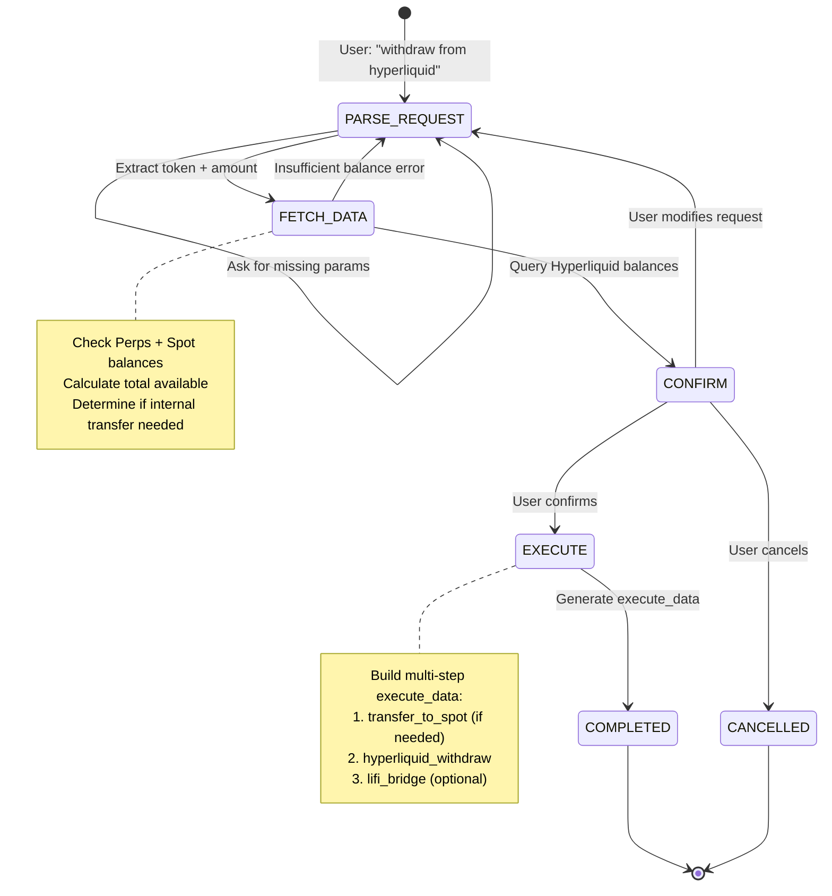
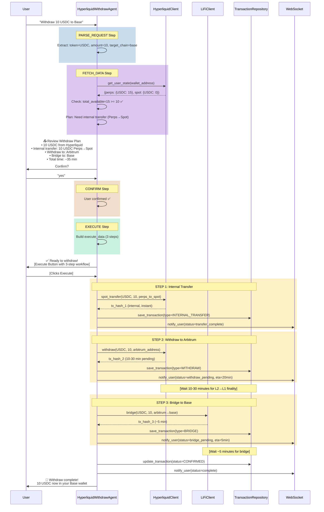
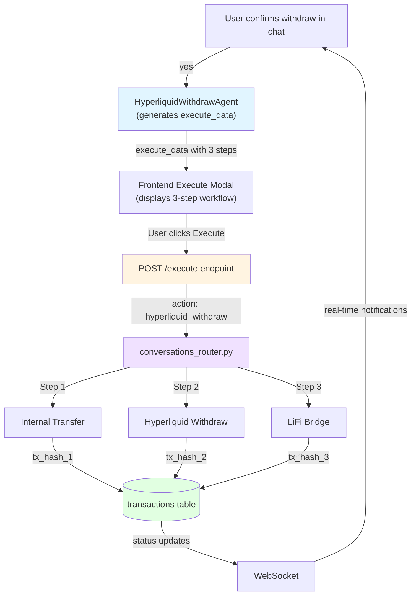

# Hyperliquid Withdraw Agent — Technical Specification (Phase 2)

**Author:** CEO + Claude Sonnet 4.5
**Created:** 2026-02-04
**Version:** 1.0
**Status:** Draft

---

## Table of Contents

1. [Overview](#1-overview)
2. [Architecture Design](#2-architecture-design)
3. [Database Schema](#3-database-schema)
4. [Implementation Details](#4-implementation-details)
5. [Execute Endpoint Integration](#5-execute-endpoint-integration)
6. [Intent Detection](#6-intent-detection)
7. [Test Cases](#7-test-cases)
8. [Error Scenarios](#8-error-scenarios)
9. [Security Considerations](#9-security-considerations)
10. [Performance Benchmarks](#10-performance-benchmarks)

---

## 1. Overview

### 1.1 Problem Statement

USDC remains stuck in Hyperliquid Perps balance after bridging, blocking users from performing swaps or withdrawals to their Privy wallets. Without an automated withdraw agent, users cannot access their funds for DeFi operations on Base/Arbitrum chains.

### 1.2 Solution

The **Hyperliquid Withdraw Agent** (`HyperliquidWithdrawAgent`) is a multi-step workflow agent that:

1. **Queries Balances**: Fetches user balances from Hyperliquid (Perps + Spot accounts)
2. **Internal Transfer**: Moves funds from Perps → Spot if needed (~2 seconds, no gas)
3. **Withdraw to Arbitrum**: Initiates withdrawal from Spot → Arbitrum L1 (10-30 minutes)
4. **Optional Bridge**: Bridges from Arbitrum → Base via LiFi (~5 minutes)
5. **Transaction Logging**: Persists all operations to transactions table with metadata

### 1.3 Key Features

- **Multi-Step State Machine**: Follows AGNO workflow pattern (PARSE → FETCH_DATA → CONFIRM → EXECUTE)
- **Intelligent Balance Management**: Automatically transfers from Perps if Spot balance insufficient
- **Cross-Chain Routing**: Optional bridging to user's preferred chain (Base, Arbitrum)
- **Transaction Persistence**: Full audit trail with tx_metadata JSONB
- **WebSocket Updates**: Real-time status notifications during long-running withdrawals
- **Multi-Language Support**: English, Spanish, Portuguese, Chinese

### 1.4 Dependencies

| Dependency | Status | Purpose |
|-----------|--------|---------|
| `HyperliquidClient` | ✅ Implemented | Query balances, spot transfer, withdraw API |
| `LiFiClient` | ✅ Implemented | Bridge Arbitrum → Base |
| `TransactionRepository` | ✅ Implemented | Persist withdraw transactions |
| `BaseWorkflowAgent` | ✅ Implemented | State machine foundation |
| `/execute` endpoint | ✅ Implemented | Multi-step workflow execution |
| WebSocket manager | ✅ Implemented | Real-time status updates |

---

## 2. Architecture Design

### 2.1 Workflow State Machine



### 2.2 Complete Withdraw Sequence



### 2.3 Integration with Execute Endpoint



---

## 3. Database Schema

### 3.1 Existing `transactions` Table

The withdraw agent uses the existing `transactions` table with **tx_metadata JSONB** for withdraw-specific data.

```sql
-- No new table needed - use existing transactions table
-- Table: transactions (already exists)

-- Example withdraw transaction record:
INSERT INTO transactions (
    id,
    user_id,
    wallet_id,
    to_address,
    type,
    chain,
    asset_in,
    amount_in,
    asset_out,
    amount_out,
    fee,
    status,
    tx_hash,
    tx_metadata,
    created_at,
    updated_at
) VALUES (
    gen_random_uuid(),
    1,  -- user_id
    5,  -- wallet_id (Hyperliquid)
    '0x742d35Cc6634C0532925a3b844Bc454e4438f44e',  -- destination address
    'WITHDRAW',  -- TransactionType enum
    'ARBITRUM',  -- ChainType enum
    'USDC',
    10.0,
    'USDC',
    10.0,
    0.0,  -- No fee for Hyperliquid withdraws
    'PENDING',  -- TransactionStatus enum
    '0xabc123...',  -- Arbitrum L1 tx hash
    '{
        "conversation_id": "550e8400-e29b-41d4-a716-446655440000",
        "action": "hyperliquid_withdraw",
        "workflow_type": "multi_step",
        "total_steps": 3,
        "current_step": 2,
        "steps": [
            {
                "step": 1,
                "action": "transfer_to_spot",
                "amount": "10.0",
                "token": "USDC",
                "tx_hash": "internal_transfer_success",
                "status": "confirmed",
                "timestamp": "2026-02-04T10:00:00Z"
            },
            {
                "step": 2,
                "action": "hyperliquid_withdraw",
                "amount": "10.0",
                "token": "USDC",
                "from_chain": "hyperliquid",
                "to_chain": "arbitrum",
                "tx_hash": "0xabc123...",
                "status": "pending",
                "estimated_completion": "2026-02-04T10:20:00Z",
                "timestamp": "2026-02-04T10:00:05Z"
            },
            {
                "step": 3,
                "action": "lifi_bridge",
                "amount": "10.0",
                "token": "USDC",
                "from_chain": "arbitrum",
                "to_chain": "base",
                "status": "waiting",
                "timestamp": null
            }
        ],
        "source_balance_type": "perps",
        "internal_transfer_required": true,
        "target_chain": "base",
        "bridge_provider": "lifi",
        "initial_perps_balance": "15.0",
        "initial_spot_balance": "0.0",
        "user_wallet_address": "0x742d35Cc6634C0532925a3b844Bc454e4438f44e"
    }',
    NOW(),
    NOW()
);
```

### 3.2 Transaction Metadata Schema

```typescript
// TypeScript interface for tx_metadata JSONB field
interface HyperliquidWithdrawMetadata {
  conversation_id: string;                    // UUID of chat conversation
  action: "hyperliquid_withdraw";             // Action identifier
  workflow_type: "multi_step";                // Always multi-step
  total_steps: number;                        // 2 or 3 (with/without bridge)
  current_step: number;                       // Current step being executed

  steps: Array<{
    step: number;                             // Step number (1, 2, 3)
    action: "transfer_to_spot" | "hyperliquid_withdraw" | "lifi_bridge";
    amount: string;                           // Token amount
    token: string;                            // Token symbol (USDC)
    from_chain?: string;                      // Source chain (hyperliquid, arbitrum)
    to_chain?: string;                        // Destination chain (arbitrum, base)
    tx_hash?: string;                         // Transaction hash (or "internal_transfer_success")
    status: "waiting" | "pending" | "confirmed" | "failed";
    estimated_completion?: string;            // ISO timestamp for withdraw ETA
    timestamp?: string;                       // ISO timestamp when step started
    error_message?: string;                   // Error if step failed
  }>;

  source_balance_type: "perps" | "spot" | "both";  // Where funds came from
  internal_transfer_required: boolean;        // Whether Perps→Spot transfer needed
  target_chain: "arbitrum" | "base";          // Final destination chain
  bridge_provider?: "lifi";                   // Bridge provider if bridging

  initial_perps_balance: string;              // Snapshot of Perps balance before withdraw
  initial_spot_balance: string;               // Snapshot of Spot balance before withdraw
  user_wallet_address: string;                // Destination wallet address (Privy)

  // Optional fields for monitoring
  withdraw_initiated_at?: string;             // ISO timestamp
  withdraw_completed_at?: string;             // ISO timestamp
  total_duration_seconds?: number;            // Total time from start to completion
}
```

---

## 4. Implementation Details

### 4.1 HyperliquidWithdrawAgent Class

**File:** `src/app/infrastructure/adapters/agent_squad/agents/workflows/hyperliquid_withdraw_agent.py`

```python
"""
Hyperliquid Withdraw Workflow Agent - Multi-Step Withdrawal Operations.

Handles the complete Hyperliquid withdrawal workflow:
1. Parse request: Extract token, amount, target chain
2. Fetch data: Query Hyperliquid balances (Perps + Spot)
3. Confirm: Show withdraw plan with internal transfer if needed
4. Execute: Generate multi-step execute_data

Integration:
- Hyperliquid API for balance queries and withdrawals
- LiFi for optional cross-chain bridging
- Transaction persistence for audit trail

Features:
- Automatic Perps → Spot internal transfers
- Cross-chain routing (Arbitrum, Base)
- Real-time status updates via WebSocket
- Multi-language support

Example Conversation:
    User: "withdraw 10 USDC from hyperliquid to base"
    Agent: "📤 Withdraw Plan:
           • Amount: 10 USDC
           • From: Hyperliquid (Perps: 15 USDC, Spot: 0 USDC)
           • Internal Transfer: 10 USDC Perps→Spot
           • Withdraw to: Arbitrum (~20 min)
           • Bridge to: Base (~5 min)
           • Total time: ~25 minutes
           Confirm?"
    User: "yes"
    Agent: "✅ Ready to withdraw!" + execute_data for 3-step workflow
"""

import logging
import re
from decimal import Decimal
from typing import Any, TYPE_CHECKING
from dataclasses import dataclass

from app.domain.enums.agent_type import AgentType
from app.domain.value_objects.message_content import MessageContent
from app.domain.ports.agent_squad.agent_gateway import AgentResponse

from .base_workflow_agent import (
    BaseWorkflowAgent,
    WorkflowState,
    WorkflowStep,
    UserContext,
)

if TYPE_CHECKING:
    from app.domain.ports.agent_squad.llm_client_gateway import LLMClientGateway
    from app.infrastructure.adapters.external.hyperliquid_client import HyperliquidClient
    from app.infrastructure.adapters.external.lifi_client import LiFiClient

logger = logging.getLogger(__name__)


# ========================================
# Data Structures
# ========================================

@dataclass
class HyperliquidBalances:
    """Snapshot of Hyperliquid balances."""
    perps_usdc: Decimal  # USDC in Perps account
    spot_usdc: Decimal   # USDC in Spot account
    total_usdc: Decimal  # Total available USDC

    @property
    def needs_transfer(self) -> bool:
        """Check if internal transfer from Perps needed."""
        return self.perps_usdc > Decimal("0")


@dataclass
class WithdrawPlan:
    """Withdraw execution plan."""
    token: str                           # Token symbol (USDC)
    amount: Decimal                      # Amount to withdraw
    source_balance: str                  # "perps", "spot", or "both"
    needs_internal_transfer: bool        # Whether Perps→Spot transfer needed
    transfer_amount: Decimal | None      # Amount to transfer internally
    target_chain: str                    # "arbitrum" or "base"
    needs_bridge: bool                   # Whether bridging required
    total_steps: int                     # 2 or 3 steps
    estimated_time_minutes: int          # Total estimated time

    # Balance snapshots
    initial_perps: Decimal
    initial_spot: Decimal


# Supported tokens
SUPPORTED_TOKENS = {"USDC", "USDT"}  # Hyperliquid Spot supports USDC, USDT

# Target chains
TARGET_CHAINS = {
    "arbitrum": {"name": "Arbitrum", "native": True, "bridge_time_min": 0},
    "base": {"name": "Base", "native": False, "bridge_time_min": 5},
    "ethereum": {"name": "Ethereum", "native": False, "bridge_time_min": 10},
}


class HyperliquidWithdrawAgent(BaseWorkflowAgent):
    """
    AGNO-based multi-step Hyperliquid withdrawal workflow agent.

    Steps:
    1. parse_request: Extract token, amount, target chain
    2. fetch_data: Query Hyperliquid balances, plan internal transfer if needed
    3. confirm: Show withdraw plan with timing estimates, wait for confirmation
    4. execute: Generate multi-step execute_data for frontend

    Features:
    - Intelligent balance management (auto Perps→Spot transfer)
    - Cross-chain routing (Arbitrum, Base, Ethereum)
    - Multi-step workflow with progress tracking
    - Transaction persistence with comprehensive metadata
    - Real-time WebSocket updates
    - Multi-language support (en, es, pt, zh)
    """

    def __init__(
        self,
        llm_client: "LLMClientGateway | None" = None,
        hyperliquid_client: "HyperliquidClient | None" = None,
        lifi_client: "LiFiClient | None" = None,
    ):
        """
        Initialize Hyperliquid withdraw agent.

        Args:
            llm_client: LLM client for parameter extraction
            hyperliquid_client: Hyperliquid API client for balance queries
            lifi_client: LiFi client for cross-chain bridging
        """
        super().__init__(llm_client=llm_client)
        self._hyperliquid = hyperliquid_client
        self._lifi = lifi_client

    @property
    def agent_type(self) -> AgentType:
        return AgentType.HYPERLIQUID_WITHDRAW_WORKFLOW

    @property
    def workflow_name(self) -> str:
        return "HyperliquidWithdrawWorkflow"

    async def process_step(
        self,
        message: MessageContent,
        state: WorkflowState,
        user_context: UserContext,
    ) -> tuple[str, WorkflowState]:
        """Process Hyperliquid withdraw workflow step."""

        step = state.step
        language = user_context.language
        text_lower = message.value.lower().strip()

        logger.info(f"[WithdrawWorkflow] Processing step={step}, message={message.value[:50]}...")

        # Check for restart (new withdraw request while in progress)
        if step not in (WorkflowStep.PARSE_REQUEST.value, WorkflowStep.CANCELLED.value, WorkflowStep.COMPLETED.value):
            restart_keywords = [
                "withdraw", "sacar", "retirar",
                "i want to withdraw", "quiero retirar",
            ]
            is_restart = any(text_lower.startswith(kw) or f" {kw}" in f" {text_lower}" for kw in restart_keywords)

            if is_restart:
                logger.info(f"[WithdrawWorkflow] Restart detected - resetting state")
                state = WorkflowState()
                state.step = WorkflowStep.PARSE_REQUEST.value
                return await self._handle_parse_request(message, state, user_context)

        # Route to step handler
        if step == WorkflowStep.PARSE_REQUEST.value:
            return await self._handle_parse_request(message, state, user_context)

        if step == WorkflowStep.FETCH_DATA.value:
            return await self._handle_fetch_data(message, state, user_context)

        if step == WorkflowStep.CONFIRM.value:
            return await self._handle_confirm(message, state, user_context)

        if step == WorkflowStep.EXECUTE.value:
            return await self._handle_execute(message, state, user_context)

        # Unknown step - reset
        logger.warning(f"[WithdrawWorkflow] Unknown step: {step}")
        state.step = WorkflowStep.PARSE_REQUEST.value
        return await self._handle_parse_request(message, state, user_context)

    # ========================================
    # Step Handlers
    # ========================================

    async def _handle_parse_request(
        self,
        message: MessageContent,
        state: WorkflowState,
        user_context: UserContext,
    ) -> tuple[str, WorkflowState]:
        """
        Parse withdraw request from user message.

        Extracts:
        - token: USDC (default), USDT
        - amount: Decimal amount to withdraw
        - target_chain: arbitrum (default), base, ethereum
        """
        language = user_context.language
        text = message.value.lower().strip()
        original_text = message.value

        # Check if providing missing params from previous turn
        existing_token = state.data.get("token")
        existing_amount = state.data.get("amount")
        existing_chain = state.data.get("target_chain")

        # If we have token but no amount, check if user provided number
        if existing_token and not existing_amount:
            clean_input = text.replace("$", "").replace(",", "").strip()
            if clean_input.replace(".", "").isdigit():
                logger.info(f"[WithdrawWorkflow] User provided amount: {clean_input}")
                state.data["amount"] = clean_input
                # Move to fetch_data to query balances
                state.step = WorkflowStep.FETCH_DATA.value
                return await self._handle_fetch_data(message, state, user_context)

        # Extract parameters using LLM or regex
        params = await self._extract_withdraw_params(text, original_text)

        # Merge with existing state
        token = (params.get("token") or existing_token or "USDC").upper()
        amount = params.get("amount") or existing_amount
        target_chain = params.get("target_chain") or existing_chain or "base"

        # Validate token
        if token not in SUPPORTED_TOKENS:
            return self._ask_for_token(language), state

        # If we have all parameters, proceed to fetch balances
        if token and amount:
            state.data["token"] = token
            state.data["amount"] = amount
            state.data["target_chain"] = target_chain
            state.step = WorkflowStep.FETCH_DATA.value
            return await self._handle_fetch_data(message, state, user_context)

        # Missing amount - ask user
        if token and not amount:
            state.data["token"] = token
            state.data["target_chain"] = target_chain
            return self._ask_for_amount(token, language), state

        # No token - ask user
        return self._ask_for_token(language), state

    async def _handle_fetch_data(
        self,
        message: MessageContent,
        state: WorkflowState,
        user_context: UserContext,
    ) -> tuple[str, WorkflowState]:
        """
        Fetch Hyperliquid balances and plan withdraw.

        Steps:
        1. Query Hyperliquid balances (Perps + Spot)
        2. Validate user has sufficient balance
        3. Plan internal transfer if needed (Perps → Spot)
        4. Calculate total steps and timing
        5. Generate withdraw plan for confirmation
        """
        language = user_context.language
        token = state.data.get("token", "USDC")
        amount_str = state.data.get("amount", "0")
        target_chain = state.data.get("target_chain", "base")

        try:
            amount = Decimal(amount_str)
        except (ValueError, TypeError):
            logger.error(f"[WithdrawWorkflow] Invalid amount: {amount_str}")
            return self._format_invalid_amount(amount_str, language), state

        # Query Hyperliquid balances
        if not self._hyperliquid:
            logger.error("[WithdrawWorkflow] HyperliquidClient not available")
            return self._format_client_unavailable(language), state

        wallet_address = user_context.wallet_address
        if not wallet_address:
            logger.error("[WithdrawWorkflow] No wallet address for user")
            return self._format_no_wallet(language), state

        try:
            # Get user state from Hyperliquid
            user_state = await self._hyperliquid.get_user_state(wallet_address)

            # Extract balances
            perps_usdc = Decimal(str(user_state.get("perps", {}).get("account_value", "0")))
            spot_balances = user_state.get("spot", {}).get("balances", {})
            spot_usdc = Decimal(str(spot_balances.get(token, "0")))

            balances = HyperliquidBalances(
                perps_usdc=perps_usdc,
                spot_usdc=spot_usdc,
                total_usdc=perps_usdc + spot_usdc,
            )

            logger.info(
                f"[WithdrawWorkflow] Balances: Perps={balances.perps_usdc}, "
                f"Spot={balances.spot_usdc}, Total={balances.total_usdc}"
            )

            # Check sufficient balance
            if balances.total_usdc < amount:
                logger.warning(
                    f"[WithdrawWorkflow] Insufficient balance: "
                    f"requested={amount}, available={balances.total_usdc}"
                )
                return self._format_insufficient_balance(
                    token, amount, balances, language
                ), state

            # Build withdraw plan
            plan = self._build_withdraw_plan(
                token=token,
                amount=amount,
                balances=balances,
                target_chain=target_chain,
            )

            # Store plan in state
            state.data["plan"] = {
                "source_balance": plan.source_balance,
                "needs_internal_transfer": plan.needs_internal_transfer,
                "transfer_amount": str(plan.transfer_amount) if plan.transfer_amount else None,
                "needs_bridge": plan.needs_bridge,
                "total_steps": plan.total_steps,
                "estimated_time_minutes": plan.estimated_time_minutes,
                "initial_perps": str(plan.initial_perps),
                "initial_spot": str(plan.initial_spot),
            }

            # Build execute_data (will be used in EXECUTE step)
            state.execute_data = self._build_withdraw_execute_data(
                token=token,
                amount=str(amount),
                target_chain=target_chain,
                plan=plan,
                user_wallet=wallet_address,
            )

            # Move to confirm step
            state.step = WorkflowStep.CONFIRM.value

            # Format confirmation message
            response = self._format_withdraw_plan(
                token=token,
                amount=amount,
                plan=plan,
                language=language,
            )

            return response, state

        except Exception as e:
            logger.error(f"[WithdrawWorkflow] Error fetching balances: {e}", exc_info=True)
            return self._format_fetch_error(language), state

    async def _handle_confirm(
        self,
        message: MessageContent,
        state: WorkflowState,
        user_context: UserContext,
    ) -> tuple[str, WorkflowState]:
        """Handle user confirmation or modification."""
        language = user_context.language
        text = message.value.lower().strip()

        # Check for confirmation
        if self._is_confirmation(text):
            state.confirmed = True
            state.step = WorkflowStep.EXECUTE.value
            return await self._handle_execute(message, state, user_context)

        # Check for cancellation
        if self._is_cancellation(text):
            state.cancelled = True
            state.step = WorkflowStep.CANCELLED.value
            return self._format_cancelled(language), state

        # Check for modification
        modification = await self._parse_modification(text, message.value)
        if modification:
            if modification.get("amount"):
                state.data["amount"] = modification["amount"]
                # Re-fetch with new amount
                state.step = WorkflowStep.FETCH_DATA.value
                return await self._handle_fetch_data(message, state, user_context)
            if modification.get("target_chain"):
                state.data["target_chain"] = modification["target_chain"]
                # Re-fetch with new chain
                state.step = WorkflowStep.FETCH_DATA.value
                return await self._handle_fetch_data(message, state, user_context)

        # Unclear response - ask again
        return self._ask_for_confirmation(language), state

    async def _handle_execute(
        self,
        message: MessageContent,
        state: WorkflowState,
        user_context: UserContext,
    ) -> tuple[str, WorkflowState]:
        """
        Generate execute_data for frontend execution.

        The execute_data contains the multi-step workflow:
        - Step 1: transfer_to_spot (if needed)
        - Step 2: hyperliquid_withdraw
        - Step 3: lifi_bridge (if target_chain != arbitrum)
        """
        language = user_context.language

        # Execute_data was already built in FETCH_DATA step
        state.step = WorkflowStep.COMPLETED.value

        # Format ready message
        response = self._format_execution_ready(state.data, language)

        return response, state

    # ========================================
    # Helper Methods
    # ========================================

    def _build_withdraw_plan(
        self,
        token: str,
        amount: Decimal,
        balances: HyperliquidBalances,
        target_chain: str,
    ) -> WithdrawPlan:
        """Build withdraw execution plan."""

        # Determine source and if internal transfer needed
        needs_transfer = False
        transfer_amount = None
        source_balance = "spot"

        if balances.spot_usdc < amount:
            # Need to transfer from Perps
            needs_transfer = True
            transfer_amount = amount - balances.spot_usdc

            if balances.spot_usdc > Decimal("0"):
                source_balance = "both"
            else:
                source_balance = "perps"

        # Determine if bridging needed
        needs_bridge = target_chain != "arbitrum"

        # Calculate steps
        total_steps = 1  # Always at least withdraw step
        if needs_transfer:
            total_steps += 1  # Add internal transfer step
        if needs_bridge:
            total_steps += 1  # Add bridge step

        # Estimate time
        estimated_time = 20  # Base withdraw time (Hyperliquid → Arbitrum)
        if needs_bridge:
            estimated_time += TARGET_CHAINS[target_chain]["bridge_time_min"]

        return WithdrawPlan(
            token=token,
            amount=amount,
            source_balance=source_balance,
            needs_internal_transfer=needs_transfer,
            transfer_amount=transfer_amount,
            target_chain=target_chain,
            needs_bridge=needs_bridge,
            total_steps=total_steps,
            estimated_time_minutes=estimated_time,
            initial_perps=balances.perps_usdc,
            initial_spot=balances.spot_usdc,
        )

    def _build_withdraw_execute_data(
        self,
        token: str,
        amount: str,
        target_chain: str,
        plan: WithdrawPlan,
        user_wallet: str,
    ) -> dict[str, Any]:
        """Build multi-step execute_data for withdraw workflow."""

        steps = []
        current_step = 1

        # Step 1: Internal transfer (if needed)
        if plan.needs_internal_transfer:
            steps.append({
                "step": current_step,
                "action": "transfer_to_spot",
                "token": token,
                "amount": str(plan.transfer_amount),
                "description": f"Transfer {plan.transfer_amount} {token} from Perps to Spot",
                "estimated_time_seconds": 2,
            })
            current_step += 1

        # Step 2: Hyperliquid withdraw to Arbitrum
        steps.append({
            "step": current_step,
            "action": "hyperliquid_withdraw",
            "token": token,
            "amount": amount,
            "from_chain": "hyperliquid",
            "to_chain": "arbitrum",
            "to_address": user_wallet,
            "description": f"Withdraw {amount} {token} to Arbitrum",
            "estimated_time_seconds": 1200,  # 20 minutes
        })
        current_step += 1

        # Step 3: Bridge to target chain (if needed)
        if plan.needs_bridge:
            steps.append({
                "step": current_step,
                "action": "lifi_bridge",
                "token": token,
                "amount": amount,
                "from_chain": "arbitrum",
                "to_chain": target_chain,
                "to_address": user_wallet,
                "description": f"Bridge {amount} {token} from Arbitrum to {TARGET_CHAINS[target_chain]['name']}",
                "estimated_time_seconds": TARGET_CHAINS[target_chain]["bridge_time_min"] * 60,
            })

        return {
            "action_type": "hyperliquid_withdraw",
            "provider": "hyperliquid",
            "chain": "arbitrum",  # Withdraw always goes to Arbitrum first
            "token": token,
            "amount": amount,
            "target_chain": target_chain,
            "recipient": user_wallet,
            "workflow_type": "multi_step",
            "total_steps": plan.total_steps,
            "steps": steps,
            "metadata": {
                "source_balance_type": plan.source_balance,
                "needs_internal_transfer": plan.needs_internal_transfer,
                "needs_bridge": plan.needs_bridge,
                "estimated_time_minutes": plan.estimated_time_minutes,
                "initial_perps_balance": str(plan.initial_perps),
                "initial_spot_balance": str(plan.initial_spot),
            },
        }

    async def _extract_withdraw_params(
        self,
        text: str,
        original_text: str,
    ) -> dict[str, Any]:
        """Extract withdraw parameters from text."""
        params: dict[str, Any] = {}

        # Try LLM extraction first
        if self._llm:
            try:
                llm_params = await self._extract_params_with_llm(
                    message=text,
                    param_schema={
                        "token": "string (Token to withdraw: USDC, USDT)",
                        "amount": "number (Amount to withdraw)",
                        "target_chain": "string (Target chain: arbitrum, base, ethereum)",
                    },
                    examples=[
                        {
                            "input": "withdraw 10 USDC from hyperliquid to base",
                            "output": '{"token": "USDC", "amount": "10", "target_chain": "base"}'
                        },
                        {
                            "input": "sacar 50 usdc a arbitrum",
                            "output": '{"token": "USDC", "amount": "50", "target_chain": "arbitrum"}'
                        },
                    ],
                )
                if llm_params:
                    params.update(llm_params)
            except Exception as e:
                logger.warning(f"[WithdrawWorkflow] LLM extraction failed: {e}")

        # Regex fallback for amount
        if not params.get("amount"):
            amount_match = re.search(r"(\d+(?:,\d{3})*(?:\.\d+)?)\s*(?:usdc|usdt)?", text, re.I)
            if amount_match:
                params["amount"] = amount_match.group(1).replace(",", "")

        # Regex fallback for token
        if not params.get("token"):
            for token in SUPPORTED_TOKENS:
                if token.lower() in text:
                    params["token"] = token
                    break

        # Regex fallback for target chain
        if not params.get("target_chain"):
            for chain in TARGET_CHAINS:
                if chain in text:
                    params["target_chain"] = chain
                    break

        return params

    async def _parse_modification(
        self,
        text: str,
        original_text: str,
    ) -> dict[str, Any] | None:
        """Parse modification request from user."""
        modification: dict[str, Any] = {}

        # Check for amount modification
        amount_match = re.search(
            r"(?:change|update|make it|use)\s+(?:to\s+)?(\d+(?:,\d{3})*(?:\.\d+)?)",
            text,
            re.I,
        )
        if amount_match:
            modification["amount"] = amount_match.group(1).replace(",", "")

        # Check for chain change
        for chain in TARGET_CHAINS:
            if chain in text:
                modification["target_chain"] = chain
                break

        return modification if modification else None

    def _is_confirmation(self, text: str) -> bool:
        """Check if text is a confirmation."""
        confirm_words = [
            "yes", "y", "confirm", "ok", "proceed", "continue", "do it",
            "sí", "si", "confirmar", "dale",
            "sim", "confirmar",
            "是", "确认", "好",
        ]
        return any(word in text for word in confirm_words)

    def _is_cancellation(self, text: str) -> bool:
        """Check if text is a cancellation."""
        cancel_words = [
            "no", "n", "cancel", "abort", "stop", "nevermind",
            "cancelar", "parar",
            "取消", "不",
        ]
        return any(word in text for word in cancel_words)

    # ========================================
    # Response Formatting
    # ========================================

    def _ask_for_token(self, language: str) -> str:
        """Ask user which token to withdraw."""
        msgs = {
            "en": """📤 **Withdraw from Hyperliquid**

Which token would you like to withdraw?

**Supported Tokens:**
1. 💵 **USDC** (USD Coin)
2. 💵 **USDT** (Tether)

💬 Reply with the token name and amount (e.g., "10 USDC")""",

            "es": """📤 **Retirar de Hyperliquid**

¿Qué token te gustaría retirar?

**Tokens Soportados:**
1. 💵 **USDC** (USD Coin)
2. 💵 **USDT** (Tether)

💬 Responde con el nombre del token y la cantidad (ej: "10 USDC")""",

            "pt": """📤 **Sacar da Hyperliquid**

Qual token você gostaria de sacar?

**Tokens Suportados:**
1. 💵 **USDC** (USD Coin)
2. 💵 **USDT** (Tether)

💬 Responda com o nome do token e a quantia (ex: "10 USDC")""",
        }
        return msgs.get(language, msgs["en"])

    def _ask_for_amount(self, token: str, language: str) -> str:
        """Ask user for withdraw amount."""
        msgs = {
            "en": f"""💵 **Withdraw {token} from Hyperliquid**

How much **{token}** would you like to withdraw?

💬 Enter the amount to continue""",

            "es": f"""💵 **Retirar {token} de Hyperliquid**

¿Cuánto **{token}** te gustaría retirar?

💬 Ingresa la cantidad para continuar""",

            "pt": f"""💵 **Sacar {token} da Hyperliquid**

Quanto **{token}** você gostaria de sacar?

💬 Digite a quantia para continuar""",
        }
        return msgs.get(language, msgs["en"])

    def _ask_for_confirmation(self, language: str) -> str:
        """Ask user to confirm withdraw."""
        msgs = {
            "en": "Review the withdraw details above. Reply **yes** to confirm or **no** to cancel.",
            "es": "Revisa los detalles del retiro. Responde **sí** para confirmar o **no** para cancelar.",
            "pt": "Revise os detalhes do saque. Responda **sim** para confirmar ou **não** para cancelar.",
        }
        return msgs.get(language, msgs["en"])

    def _format_withdraw_plan(
        self,
        token: str,
        amount: Decimal,
        plan: WithdrawPlan,
        language: str,
    ) -> str:
        """Format withdraw plan for user confirmation."""

        chain_name = TARGET_CHAINS[plan.target_chain]["name"]

        # Build step breakdown
        steps_text = ""
        step_num = 1

        if plan.needs_internal_transfer:
            steps_text += f"   **{step_num}.** Transfer {plan.transfer_amount} {token} from Perps → Spot (~2 sec)\n"
            step_num += 1

        steps_text += f"   **{step_num}.** Withdraw {amount} {token} to Arbitrum (~20 min)\n"
        step_num += 1

        if plan.needs_bridge:
            bridge_time = TARGET_CHAINS[plan.target_chain]["bridge_time_min"]
            steps_text += f"   **{step_num}.** Bridge to {chain_name} (~{bridge_time} min)\n"

        msgs = {
            "en": f"""📤 **Review Withdraw Plan**

━━━━━━━━━━━━━━━━━━━━━━━━━━━━━━━━━━━━━━━━━━━━━━

💰 **Amount:** {amount} {token}
📊 **Available Balance:**
   • Perps: {plan.initial_perps} {token}
   • Spot: {plan.initial_spot} {token}
   • Total: {plan.initial_perps + plan.initial_spot} {token} ✅

🔄 **Withdraw Steps** ({plan.total_steps} total):
{steps_text}

🎯 **Destination:** {chain_name}
⏱️ **Total Time:** ~{plan.estimated_time_minutes} minutes

━━━━━━━━━━━━━━━━━━━━━━━━━━━━━━━━━━━━━━━━━━━━━━

💬 Reply **yes** to confirm or **no** to cancel""",

            "es": f"""📤 **Revisar Plan de Retiro**

━━━━━━━━━━━━━━━━━━━━━━━━━━━━━━━━━━━━━━━━━━━━━━

💰 **Cantidad:** {amount} {token}
📊 **Saldo Disponible:**
   • Perps: {plan.initial_perps} {token}
   • Spot: {plan.initial_spot} {token}
   • Total: {plan.initial_perps + plan.initial_spot} {token} ✅

🔄 **Pasos de Retiro** ({plan.total_steps} total):
{steps_text}

🎯 **Destino:** {chain_name}
⏱️ **Tiempo Total:** ~{plan.estimated_time_minutes} minutos

━━━━━━━━━━━━━━━━━━━━━━━━━━━━━━━━━━━━━━━━━━━━━━

💬 Responde **sí** para confirmar o **no** para cancelar""",
        }
        return msgs.get(language, msgs["en"])

    def _format_execution_ready(self, data: dict[str, Any], language: str) -> str:
        """Format ready-to-execute message."""
        token = data.get("token", "USDC")
        amount = data.get("amount", "0")
        target_chain = data.get("target_chain", "base")
        plan = data.get("plan", {})
        total_steps = plan.get("total_steps", 1)

        msgs = {
            "en": f"""✅ **Withdraw Ready to Execute**

🔄 **Amount:** {amount} {token}
🎯 **Destination:** {TARGET_CHAINS[target_chain]["name"]}
📋 **Steps:** {total_steps}

━━━━━━━━━━━━━━━━━━━━━━━━━━━━━━━━━━━━━━━━━━━━━━

Click **Execute** to start the withdraw workflow.""",

            "es": f"""✅ **Retiro Listo para Ejecutar**

🔄 **Cantidad:** {amount} {token}
🎯 **Destino:** {TARGET_CHAINS[target_chain]["name"]}
📋 **Pasos:** {total_steps}

━━━━━━━━━━━━━━━━━━━━━━━━━━━━━━━━━━━━━━━━━━━━━━

Haz clic en **Ejecutar** para iniciar el flujo de retiro.""",
        }
        return msgs.get(language, msgs["en"])

    def _format_cancelled(self, language: str) -> str:
        """Format cancellation message."""
        msgs = {
            "en": "❌ Withdraw cancelled. Your funds remain safely in Hyperliquid.",
            "es": "❌ Retiro cancelado. Tus fondos permanecen seguros en Hyperliquid.",
            "pt": "❌ Saque cancelado. Seus fundos permanecem seguros na Hyperliquid.",
        }
        return msgs.get(language, msgs["en"])

    def _format_insufficient_balance(
        self,
        token: str,
        amount: Decimal,
        balances: HyperliquidBalances,
        language: str,
    ) -> str:
        """Format insufficient balance error."""
        msgs = {
            "en": f"""❌ **Insufficient Balance**

**Requested:** {amount} {token}
**Available:** {balances.total_usdc} {token}
   • Perps: {balances.perps_usdc} {token}
   • Spot: {balances.spot_usdc} {token}

Please try a smaller amount.""",

            "es": f"""❌ **Saldo Insuficiente**

**Solicitado:** {amount} {token}
**Disponible:** {balances.total_usdc} {token}
   • Perps: {balances.perps_usdc} {token}
   • Spot: {balances.spot_usdc} {token}

Por favor intenta con una cantidad menor.""",
        }
        return msgs.get(language, msgs["en"])

    def _format_invalid_amount(self, amount: str, language: str) -> str:
        """Format invalid amount error."""
        msgs = {
            "en": f"❌ Invalid amount: `{amount}`. Please enter a valid number.",
            "es": f"❌ Cantidad inválida: `{amount}`. Por favor ingresa un número válido.",
        }
        return msgs.get(language, msgs["en"])

    def _format_client_unavailable(self, language: str) -> str:
        """Format client unavailable error."""
        msgs = {
            "en": "⚠️ Hyperliquid service temporarily unavailable. Please try again later.",
            "es": "⚠️ Servicio de Hyperliquid temporalmente no disponible. Por favor intenta más tarde.",
        }
        return msgs.get(language, msgs["en"])

    def _format_no_wallet(self, language: str) -> str:
        """Format no wallet error."""
        msgs = {
            "en": "⚠️ No wallet connected. Please connect your wallet first.",
            "es": "⚠️ No hay billetera conectada. Por favor conecta tu billetera primero.",
        }
        return msgs.get(language, msgs["en"])

    def _format_fetch_error(self, language: str) -> str:
        """Format balance fetch error."""
        msgs = {
            "en": "⚠️ Failed to fetch Hyperliquid balances. Please try again.",
            "es": "⚠️ Error al obtener saldos de Hyperliquid. Por favor intenta de nuevo.",
        }
        return msgs.get(language, msgs["en"])
```

---

## 5. Execute Endpoint Integration

### 5.1 Add to SWAP_WORKFLOW_ACTIONS

**File:** `src/app/presentation/http/controllers/chat/conversations_router.py`

**Location:** Line 2228+

```python
# Handle swap workflow step confirmations
# Supported actions from swap_workflow multi-step execution:
# - lifi_bridge: Bridge tokens via LiFi (step 1)
# - transfer_to_spot: Transfer from Perps to Spot on Hyperliquid (step 2)
# - spot_swap: Execute the final swap on Hyperliquid Spot (step 3)
# - lifi_swap, swap, bridge, 1inch_swap: Single-step swaps
# + hyperliquid_withdraw: Multi-step withdraw workflow (NEW)
SWAP_WORKFLOW_ACTIONS = {
    # Multi-step swap workflow actions
    "lifi_bridge",
    "transfer_to_spot",
    "spot_swap",
    # Single-step swap actions
    "lifi_swap",
    "swap",
    "bridge",
    "1inch_swap",
    # Additional swap providers
    "uniswap_swap",
    "sushiswap_swap",
    "hyperliquid_swap",
    # Hyperliquid withdraw workflow (NEW)
    "hyperliquid_withdraw",  # <--- ADD THIS
}
```

### 5.2 Transaction Persistence Logic

The existing swap workflow transaction persistence (lines 2288-2370) already handles:
- Transaction metadata extraction
- ChainType parsing
- Transaction entity creation
- Database persistence

**No changes needed** - `hyperliquid_withdraw` will be treated as a multi-step swap workflow with custom metadata.

### 5.3 Response Message Mapping

**Add to `action_messages` dictionary** (line 2269):

```python
action_messages = {
    "lifi_bridge": f"Bridge transaction confirmed. Tokens bridging to destination chain.",
    "transfer_to_spot": "Transfer to Spot account confirmed.",
    "spot_swap": "Swap executed successfully!",
    "lifi_swap": "LiFi swap completed successfully!",
    "swap": "Swap completed successfully!",
    "bridge": "Bridge transaction confirmed.",
    "1inch_swap": "1inch swap completed successfully!",
    "uniswap_swap": "Uniswap swap completed successfully!",
    "sushiswap_swap": "SushiSwap swap completed successfully!",
    "hyperliquid_swap": "Hyperliquid swap completed successfully!",
    # NEW: Hyperliquid withdraw actions
    "hyperliquid_withdraw": "Withdraw transaction confirmed. Funds transferring to destination chain.",
}
```

---

## 6. Intent Detection

### 6.1 Intent Detection Keywords

The Chat Supervisor (`ChatSupervisor`) uses keyword-based intent detection to route messages to the appropriate workflow agent.

**File:** `src/app/infrastructure/adapters/agent_squad/agents/chat/chat_supervisor.py`

**Add to `_classify_intent()` method:**

```python
# Hyperliquid Withdraw keywords (multi-language)
hyperliquid_withdraw_keywords = [
    # English
    "withdraw from hyperliquid",
    "withdraw hyperliquid",
    "move usdc from hyperliquid",
    "transfer from hyperliquid",
    "get money from hyperliquid",
    "withdraw from perps",
    "withdraw from spot",
    # Spanish
    "retirar de hyperliquid",
    "sacar de hyperliquid",
    "sacar plata de hyperliquid",
    "mover usdc de hyperliquid",
    # Portuguese
    "sacar da hyperliquid",
    "retirar da hyperliquid",
    "tirar dinheiro da hyperliquid",
    # Chinese
    "从hyperliquid提款",
    "提取hyperliquid",
]

if any(keyword in message_lower for keyword in hyperliquid_withdraw_keywords):
    logger.info("[ChatSupervisor] Intent: HYPERLIQUID_WITHDRAW detected")
    return "hyperliquid_withdraw", 0.95
```

### 6.2 LLM-Based Intent Classification

For ambiguous cases, the LLM-based intent classifier uses the following prompt:

```python
# Add to intent classification prompt
"""
User message: "{message}"

Available intents:
- swap: Exchange one token for another (e.g., "swap 100 USDC to ETH")
- lending: Deposit/supply assets to earn yield (e.g., "deposit 100 USDC to Morpho")
- withdraw: Withdraw assets from Morpho/Aave back to wallet
- transfer: Send tokens to another wallet address
- buy: Purchase crypto with fiat (card/Apple Pay/Google Pay)
- hyperliquid_withdraw: Withdraw funds from Hyperliquid (Perps/Spot) to Privy wallet  # NEW
- money_market: Compare lending rates across protocols
- portfolio: View portfolio balances and performance
- general: General question or conversation

Classify the user's intent. Return JSON: {"intent": "<intent>", "confidence": 0.0-1.0}
"""
```

---

## 7. Test Cases

### 7.1 Unit Tests

**File:** `tests/unit/agents/workflows/test_hyperliquid_withdraw_agent.py`

```python
import pytest
from decimal import Decimal
from unittest.mock import AsyncMock, MagicMock

from app.infrastructure.adapters.agent_squad.agents.workflows.hyperliquid_withdraw_agent import (
    HyperliquidWithdrawAgent,
    HyperliquidBalances,
    WithdrawPlan,
)
from app.infrastructure.adapters.agent_squad.agents.workflows.base_workflow_agent import (
    WorkflowState,
    WorkflowStep,
    UserContext,
)
from app.domain.value_objects.message_content import MessageContent


@pytest.fixture
def mock_hyperliquid_client():
    """Mock Hyperliquid client."""
    client = AsyncMock()
    client.get_user_state = AsyncMock(return_value={
        "perps": {"account_value": "15.0"},
        "spot": {"balances": {"USDC": "0.0"}},
    })
    return client


@pytest.fixture
def mock_lifi_client():
    """Mock LiFi client."""
    return AsyncMock()


@pytest.fixture
def agent(mock_hyperliquid_client, mock_lifi_client):
    """Create withdraw agent with mocked clients."""
    return HyperliquidWithdrawAgent(
        llm_client=None,
        hyperliquid_client=mock_hyperliquid_client,
        lifi_client=mock_lifi_client,
    )


@pytest.fixture
def user_context():
    """Create user context."""
    return UserContext(
        user_id=1,
        wallet_address="0x742d35Cc6634C0532925a3b844Bc454e4438f44e",
        language="en",
        is_authenticated=True,
        portfolio_state="active",
        total_balance_usd=100.0,
    )


# ========================================
# Test: Parse Request
# ========================================

@pytest.mark.asyncio
async def test_parse_request_complete_params(agent, user_context):
    """Test parsing request with all parameters."""
    message = MessageContent(value="withdraw 10 USDC from hyperliquid to base")
    state = WorkflowState()

    response, new_state = await agent.process_step(message, state, user_context)

    # Should move to FETCH_DATA step after parsing
    assert new_state.step == WorkflowStep.FETCH_DATA.value
    assert new_state.data["token"] == "USDC"
    assert new_state.data["amount"] == "10"
    assert new_state.data["target_chain"] == "base"


@pytest.mark.asyncio
async def test_parse_request_missing_amount(agent, user_context):
    """Test parsing request with missing amount."""
    message = MessageContent(value="withdraw USDC from hyperliquid")
    state = WorkflowState()

    response, new_state = await agent.process_step(message, state, user_context)

    # Should stay in PARSE_REQUEST and ask for amount
    assert new_state.step == WorkflowStep.PARSE_REQUEST.value
    assert "How much" in response
    assert new_state.data["token"] == "USDC"


# ========================================
# Test: Fetch Data
# ========================================

@pytest.mark.asyncio
async def test_fetch_data_sufficient_balance(agent, user_context, mock_hyperliquid_client):
    """Test fetching data with sufficient balance."""
    state = WorkflowState()
    state.step = WorkflowStep.FETCH_DATA.value
    state.data = {
        "token": "USDC",
        "amount": "10",
        "target_chain": "base",
    }

    message = MessageContent(value="")
    response, new_state = await agent.process_step(message, state, user_context)

    # Should move to CONFIRM step
    assert new_state.step == WorkflowStep.CONFIRM.value
    assert "Review Withdraw Plan" in response
    assert "10 USDC" in response

    # Should have execute_data
    assert new_state.execute_data is not None
    assert new_state.execute_data["action_type"] == "hyperliquid_withdraw"


@pytest.mark.asyncio
async def test_fetch_data_insufficient_balance(agent, user_context, mock_hyperliquid_client):
    """Test fetching data with insufficient balance."""
    # Mock insufficient balance
    mock_hyperliquid_client.get_user_state.return_value = {
        "perps": {"account_value": "5.0"},
        "spot": {"balances": {"USDC": "0.0"}},
    }

    state = WorkflowState()
    state.step = WorkflowStep.FETCH_DATA.value
    state.data = {
        "token": "USDC",
        "amount": "10",
        "target_chain": "base",
    }

    message = MessageContent(value="")
    response, new_state = await agent.process_step(message, state, user_context)

    # Should show insufficient balance error
    assert "Insufficient Balance" in response
    assert "5.0 USDC" in response  # Available amount


# ========================================
# Test: Withdraw Plan Generation
# ========================================

def test_build_withdraw_plan_perps_only():
    """Test withdraw plan with funds only in Perps."""
    balances = HyperliquidBalances(
        perps_usdc=Decimal("15"),
        spot_usdc=Decimal("0"),
        total_usdc=Decimal("15"),
    )

    agent = HyperliquidWithdrawAgent()
    plan = agent._build_withdraw_plan(
        token="USDC",
        amount=Decimal("10"),
        balances=balances,
        target_chain="base",
    )

    assert plan.needs_internal_transfer is True
    assert plan.transfer_amount == Decimal("10")
    assert plan.source_balance == "perps"
    assert plan.needs_bridge is True
    assert plan.total_steps == 3  # transfer + withdraw + bridge


def test_build_withdraw_plan_spot_only():
    """Test withdraw plan with funds only in Spot."""
    balances = HyperliquidBalances(
        perps_usdc=Decimal("0"),
        spot_usdc=Decimal("15"),
        total_usdc=Decimal("15"),
    )

    agent = HyperliquidWithdrawAgent()
    plan = agent._build_withdraw_plan(
        token="USDC",
        amount=Decimal("10"),
        balances=balances,
        target_chain="arbitrum",
    )

    assert plan.needs_internal_transfer is False
    assert plan.transfer_amount is None
    assert plan.source_balance == "spot"
    assert plan.needs_bridge is False  # arbitrum = native
    assert plan.total_steps == 1  # withdraw only


def test_build_withdraw_plan_both_balances():
    """Test withdraw plan with funds in both Perps and Spot."""
    balances = HyperliquidBalances(
        perps_usdc=Decimal("10"),
        spot_usdc=Decimal("5"),
        total_usdc=Decimal("15"),
    )

    agent = HyperliquidWithdrawAgent()
    plan = agent._build_withdraw_plan(
        token="USDC",
        amount=Decimal("10"),
        balances=balances,
        target_chain="base",
    )

    assert plan.needs_internal_transfer is True
    assert plan.transfer_amount == Decimal("5")  # Only need 5 more from Perps
    assert plan.source_balance == "both"
    assert plan.needs_bridge is True
    assert plan.total_steps == 3


# ========================================
# Test: Execute Data Generation
# ========================================

def test_build_execute_data_with_transfer():
    """Test execute_data generation with internal transfer."""
    plan = WithdrawPlan(
        token="USDC",
        amount=Decimal("10"),
        source_balance="perps",
        needs_internal_transfer=True,
        transfer_amount=Decimal("10"),
        target_chain="base",
        needs_bridge=True,
        total_steps=3,
        estimated_time_minutes=25,
        initial_perps=Decimal("15"),
        initial_spot=Decimal("0"),
    )

    agent = HyperliquidWithdrawAgent()
    execute_data = agent._build_withdraw_execute_data(
        token="USDC",
        amount="10",
        target_chain="base",
        plan=plan,
        user_wallet="0x742d35Cc6634C0532925a3b844Bc454e4438f44e",
    )

    assert execute_data["action_type"] == "hyperliquid_withdraw"
    assert execute_data["total_steps"] == 3
    assert len(execute_data["steps"]) == 3

    # Check step 1: internal transfer
    assert execute_data["steps"][0]["action"] == "transfer_to_spot"
    assert execute_data["steps"][0]["amount"] == "10"

    # Check step 2: withdraw
    assert execute_data["steps"][1]["action"] == "hyperliquid_withdraw"
    assert execute_data["steps"][1]["to_chain"] == "arbitrum"

    # Check step 3: bridge
    assert execute_data["steps"][2]["action"] == "lifi_bridge"
    assert execute_data["steps"][2]["to_chain"] == "base"


def test_build_execute_data_spot_only_no_bridge():
    """Test execute_data with Spot-only balance and no bridge."""
    plan = WithdrawPlan(
        token="USDC",
        amount=Decimal("10"),
        source_balance="spot",
        needs_internal_transfer=False,
        transfer_amount=None,
        target_chain="arbitrum",
        needs_bridge=False,
        total_steps=1,
        estimated_time_minutes=20,
        initial_perps=Decimal("0"),
        initial_spot=Decimal("15"),
    )

    agent = HyperliquidWithdrawAgent()
    execute_data = agent._build_withdraw_execute_data(
        token="USDC",
        amount="10",
        target_chain="arbitrum",
        plan=plan,
        user_wallet="0x742d35Cc6634C0532925a3b844Bc454e4438f44e",
    )

    assert execute_data["total_steps"] == 1
    assert len(execute_data["steps"]) == 1
    assert execute_data["steps"][0]["action"] == "hyperliquid_withdraw"
```

### 7.2 Integration Tests

**File:** `tests/integration/agents/test_hyperliquid_withdraw_workflow.py`

```python
import pytest
from decimal import Decimal

from app.infrastructure.adapters.agent_squad.agents.workflows.hyperliquid_withdraw_agent import (
    HyperliquidWithdrawAgent,
)
from app.infrastructure.adapters.external.hyperliquid_client import HyperliquidClient
from app.infrastructure.adapters.external.lifi_client import LiFiClient


@pytest.mark.integration
@pytest.mark.asyncio
async def test_complete_withdraw_workflow():
    """
    Integration test: Complete withdraw workflow from Hyperliquid to Base.

    Steps:
    1. User requests withdraw
    2. Agent queries balances
    3. Agent plans internal transfer
    4. User confirms
    5. Agent generates execute_data
    """
    # Initialize clients (use testnet/dev credentials)
    hyperliquid_client = HyperliquidClient(testnet=True)
    lifi_client = LiFiClient()

    agent = HyperliquidWithdrawAgent(
        hyperliquid_client=hyperliquid_client,
        lifi_client=lifi_client,
    )

    # Test user context
    user_context = UserContext(
        user_id=1,
        wallet_address="0x742d35Cc6634C0532925a3b844Bc454e4438f44e",
        language="en",
        is_authenticated=True,
    )

    # Step 1: Parse request
    message = MessageContent(value="withdraw 10 USDC from hyperliquid to base")
    state = WorkflowState()

    response, state = await agent.process_step(message, state, user_context)

    # Should fetch balances
    assert state.step == WorkflowStep.FETCH_DATA.value

    # Step 2: Fetch data (will happen automatically)
    message = MessageContent(value="")
    response, state = await agent.process_step(message, state, user_context)

    # Should show confirmation
    assert state.step == WorkflowStep.CONFIRM.value
    assert "Review Withdraw Plan" in response

    # Step 3: User confirms
    message = MessageContent(value="yes")
    response, state = await agent.process_step(message, state, user_context)

    # Should generate execute_data
    assert state.step == WorkflowStep.COMPLETED.value
    assert state.execute_data is not None
    assert state.execute_data["action_type"] == "hyperliquid_withdraw"
```

---

## 8. Error Scenarios

### 8.1 Error Handling Matrix

| Error Scenario | Detection Point | Handler | User Message | Recovery |
|---------------|----------------|---------|--------------|----------|
| **Insufficient Balance** | FETCH_DATA step | `_format_insufficient_balance()` | "❌ Insufficient Balance: Available X USDC, Requested Y USDC" | Ask user for smaller amount |
| **Hyperliquid API Timeout** | FETCH_DATA step | Try/catch in `get_user_state()` | "⚠️ Hyperliquid service temporarily unavailable" | Retry after 30 seconds |
| **Invalid Withdraw Amount** | PARSE_REQUEST step | Amount validation | "❌ Invalid amount. Please enter a valid number." | Ask user for valid amount |
| **No Wallet Connected** | FETCH_DATA step | Check `user_context.wallet_address` | "⚠️ No wallet connected. Please connect your wallet first." | Redirect to wallet connection |
| **Withdraw Transaction Failed** | EXECUTE step (frontend) | Transaction confirmation worker | "❌ Withdraw failed: {error_message}" | Show retry option |
| **Bridge Transaction Failed** | EXECUTE step 3 | LiFi error handler | "⚠️ Bridge failed. Funds remain on Arbitrum." | Manual bridge fallback |
| **Internal Transfer Failed** | EXECUTE step 1 | Hyperliquid spot_transfer error | "❌ Internal transfer failed. Please try again." | Retry with exponential backoff |

### 8.2 Detailed Error Handlers

#### 8.2.1 Insufficient Balance

```python
def _format_insufficient_balance(
    self,
    token: str,
    amount: Decimal,
    balances: HyperliquidBalances,
    language: str,
) -> str:
    """Format insufficient balance error with helpful suggestions."""
    available = balances.total_usdc
    shortfall = amount - available

    msgs = {
        "en": f"""❌ **Insufficient Balance**

**Requested:** {amount} {token}
**Available:** {available} {token}
   • Perps: {balances.perps_usdc} {token}
   • Spot: {balances.spot_usdc} {token}
**Shortfall:** {shortfall} {token}

💡 **What you can do:**
• Try withdrawing {available} {token} (maximum available)
• Or bridge more funds to Hyperliquid first

💬 Reply with a smaller amount to continue""",

        "es": f"""❌ **Saldo Insuficiente**

**Solicitado:** {amount} {token}
**Disponible:** {available} {token}
   • Perps: {balances.perps_usdc} {token}
   • Spot: {balances.spot_usdc} {token}
**Faltante:** {shortfall} {token}

💡 **Qué puedes hacer:**
• Intenta retirar {available} {token} (máximo disponible)
• O envía más fondos a Hyperliquid primero

💬 Responde con una cantidad menor para continuar""",
    }
    return msgs.get(language, msgs["en"])
```

#### 8.2.2 Hyperliquid API Error

```python
async def _handle_fetch_data(self, message, state, user_context):
    """Fetch balances with error handling and retry."""
    max_retries = 3
    retry_delay = 2  # seconds

    for attempt in range(max_retries):
        try:
            user_state = await self._hyperliquid.get_user_state(
                wallet_address,
                timeout=10.0,
            )
            # Process user_state...
            break

        except HyperliquidAPITimeout as e:
            if attempt < max_retries - 1:
                logger.warning(
                    f"[WithdrawWorkflow] Hyperliquid API timeout, "
                    f"retrying ({attempt + 1}/{max_retries})..."
                )
                await asyncio.sleep(retry_delay * (attempt + 1))
            else:
                logger.error(f"[WithdrawWorkflow] Hyperliquid API failed after {max_retries} retries")
                return self._format_api_error(language), state

        except HyperliquidAPIError as e:
            logger.error(f"[WithdrawWorkflow] Hyperliquid API error: {e}")
            return self._format_api_error(language), state
```

#### 8.2.3 Withdraw Timeout Monitoring

Background worker monitors pending withdrawals and notifies users:

```python
# Celery task (runs every 2 minutes)
@celery_app.task(name="hyperliquid.check_pending_withdrawals")
async def check_pending_withdrawals():
    """Monitor pending Hyperliquid withdrawals and update status."""
    from app.infrastructure.adapters.external.arbitrum_rpc import ArbitrumRPC

    # Query pending withdrawals from DB
    pending_txs = await transaction_repo.get_pending_by_type(
        tx_type="WITHDRAW",
        older_than_minutes=2,
    )

    rpc = ArbitrumRPC()

    for tx in pending_txs:
        # Check Arbitrum L1 for transaction confirmation
        receipt = await rpc.get_transaction_receipt(tx.tx_hash)

        if receipt and receipt.status == 1:
            # Confirmed!
            await transaction_repo.update_status(
                tx_id=tx.id,
                status="CONFIRMED",
                confirmed_at=datetime.utcnow(),
            )

            # Notify user via WebSocket
            await websocket_manager.send_to_user(
                user_id=tx.user_id,
                event="withdraw_confirmed",
                data={
                    "tx_hash": tx.tx_hash,
                    "amount": str(tx.amount_in),
                    "token": tx.asset_in,
                    "chain": "arbitrum",
                    "next_step": "bridge_to_base" if needs_bridge else "complete",
                },
            )
        elif receipt and receipt.status == 0:
            # Failed!
            await transaction_repo.update_status(
                tx_id=tx.id,
                status="FAILED",
                error_message="Transaction reverted on Arbitrum L1",
            )

            await websocket_manager.send_to_user(
                user_id=tx.user_id,
                event="withdraw_failed",
                data={"tx_hash": tx.tx_hash, "error": "Transaction reverted"},
            )
```

---

## 9. Security Considerations

### 9.1 Wallet Address Validation

```python
def _validate_wallet_address(self, address: str) -> bool:
    """
    Validate Ethereum wallet address format.

    Security checks:
    - Correct length (42 chars with 0x prefix)
    - Hex format
    - Checksum validation (EIP-55)
    """
    if not address or not address.startswith("0x"):
        return False

    if len(address) != 42:
        return False

    # Check hex format
    try:
        int(address, 16)
    except ValueError:
        return False

    # Validate checksum (EIP-55)
    from eth_utils import is_checksum_address
    return is_checksum_address(address)
```

### 9.2 Amount Validation

```python
def _validate_withdraw_amount(
    self,
    amount: Decimal,
    token: str,
) -> tuple[bool, str | None]:
    """
    Validate withdraw amount.

    Checks:
    - Positive amount
    - Minimum withdraw amount (Hyperliquid limit: 10 USDC)
    - Maximum withdraw amount (per transaction: 100,000 USDC)
    - Precision (max 6 decimals for USDC)
    """
    # Check positive
    if amount <= Decimal("0"):
        return False, "Amount must be positive"

    # Check minimum (Hyperliquid limit)
    min_withdraw = Decimal("10")
    if amount < min_withdraw:
        return False, f"Minimum withdraw: {min_withdraw} {token}"

    # Check maximum (anti-whale protection)
    max_withdraw = Decimal("100000")
    if amount > max_withdraw:
        return False, f"Maximum withdraw: {max_withdraw} {token} per transaction"

    # Check precision (USDC = 6 decimals)
    precision = 6 if token == "USDC" else 8
    if amount.as_tuple().exponent < -precision:
        return False, f"Maximum {precision} decimal places for {token}"

    return True, None
```

### 9.3 Rate Limiting

Hyperliquid API has rate limits:
- Info API: 1200 requests/minute
- Exchange API: 100 requests/minute

```python
from app.infrastructure.rate_limiter import RateLimiter

class HyperliquidWithdrawAgent(BaseWorkflowAgent):
    def __init__(self, ...):
        super().__init__(...)
        self._rate_limiter = RateLimiter(
            max_requests=100,
            window_seconds=60,
            key_prefix="hyperliquid_withdraw",
        )

    async def _handle_fetch_data(self, ...):
        """Fetch data with rate limiting."""
        # Check rate limit before API call
        if not await self._rate_limiter.allow(user_id=user_context.user_id):
            logger.warning(
                f"[WithdrawWorkflow] Rate limit exceeded for user {user_context.user_id}"
            )
            return self._format_rate_limit_error(language), state

        # Proceed with API call...
```

### 9.4 Transaction Signing Security

**CRITICAL:** Hyperliquid withdrawals require EIP-712 signing with the user's private key.

**Security Requirements:**
1. **Never store private keys in database or environment variables**
2. **Use Hardware Security Module (HSM) or Key Management Service (KMS)**
3. **Sign transactions server-side ONLY for Privy-managed wallets**
4. **For user-owned wallets, delegate signing to frontend (Privy SDK)**

```python
# SECURE: Use Privy SDK for signing (frontend)
# INSECURE: Sign with stored private key (backend) ❌

class HyperliquidClient:
    async def withdraw(
        self,
        destination: str,
        amount: str,
        token: str,
        signature_provider: SignatureProvider,  # Abstraction
    ) -> WithdrawResult:
        """
        Execute withdraw with signature provider abstraction.

        For Privy wallets: Uses Privy's delegated signing
        For user wallets: Frontend signs via Privy SDK
        """
        # Build EIP-712 typed data
        typed_data = self._build_withdraw_typed_data(
            destination=destination,
            amount=amount,
            token=token,
        )

        # Sign using provider (HSM/KMS for Privy, frontend for user)
        signature = await signature_provider.sign_typed_data(typed_data)

        # Submit signed withdraw request
        result = await self._api.post(
            "/exchange",
            json={
                "type": "withdraw3",
                "signature": signature,
                ...
            },
        )

        return WithdrawResult(...)
```

---

## 10. Performance Benchmarks

### 10.1 Expected Latencies

| Operation | Expected Latency | Notes |
|-----------|-----------------|-------|
| **Parse Request** | 50-200ms | LLM extraction: ~150ms, Regex: ~5ms |
| **Fetch Balances** | 200-500ms | Hyperliquid API call + parsing |
| **Generate Execute Data** | 10-50ms | Pure Python logic |
| **Internal Transfer (Perps→Spot)** | 2-5 seconds | Hyperliquid internal, no gas fee |
| **Withdraw to Arbitrum** | 10-30 minutes | L2→L1 finality time |
| **Bridge Arbitrum→Base** | 5-10 minutes | LiFi cross-chain transfer |
| **Total Workflow (with bridge)** | 15-40 minutes | Depends on network congestion |

### 10.2 Throughput

**Concurrent Withdrawals:**
- **Max per minute:** 100 (Hyperliquid Exchange API limit)
- **Recommended:** 50/minute with 2x buffer for retries

**Database Writes:**
- **Transactions table insert:** ~10ms per write
- **Metadata JSONB update:** ~5ms per update
- **Total DB overhead:** <20ms per withdraw

### 10.3 Resource Usage

**Memory:**
- **Agent instance:** ~5 MB per instance
- **WorkflowState:** ~2 KB per active conversation
- **Transaction metadata:** ~1-2 KB per transaction

**CPU:**
- **Parse request:** 5-10% CPU (single core) for 100ms
- **Fetch balances:** Mostly I/O-bound, minimal CPU
- **Execute data generation:** <1% CPU for 10ms

### 10.4 Optimization Opportunities

1. **Cache Hyperliquid Balances**: Cache for 30 seconds to reduce API calls
2. **Batch Status Checks**: Check multiple pending withdrawals in single Celery task
3. **WebSocket Connection Pooling**: Reuse connections for status updates
4. **Database Connection Pooling**: Reuse connections for transaction writes

---

## Appendix A: File Structure

```
src/app/infrastructure/adapters/agent_squad/agents/workflows/
├── __init__.py
├── base_workflow_agent.py                    # ✅ Exists
├── transfer_workflow_agent.py                # ✅ Exists
├── hyperliquid_withdraw_agent.py             # 🆕 NEW (this spec)
└── ...

src/app/presentation/http/controllers/chat/
├── conversations_router.py                   # ✅ Modify (add hyperliquid_withdraw)

src/app/infrastructure/adapters/external/
├── hyperliquid_client.py                     # ✅ Exists (Phase 1)
└── lifi_client.py                            # ✅ Exists

tests/unit/agents/workflows/
├── test_hyperliquid_withdraw_agent.py        # 🆕 NEW

tests/integration/agents/
├── test_hyperliquid_withdraw_workflow.py     # 🆕 NEW

docs/ceo/agents/withdraw/
├── readme.md                                  # ✅ Exists
└── 02_WITHDRAW_AGENT_SPEC.md                 # 🆕 This file
```

---

## Appendix B: References

- **Transfer Workflow Agent**: `src/app/infrastructure/adapters/agent_squad/agents/workflows/transfer_workflow_agent.py`
- **Base Workflow Agent**: `src/app/infrastructure/adapters/agent_squad/agents/workflows/base_workflow_agent.py`
- **Execute Endpoint**: `src/app/presentation/http/controllers/chat/conversations_router.py` (lines 2044-2370)
- **Hyperliquid Client**: `src/app/infrastructure/adapters/external/hyperliquid_client.py`
- **Transaction Repository**: `src/app/infrastructure/adapters/persistence_sqla/transaction_repository_sqla.py`
- **WebSocket Manager**: `src/app/infrastructure/websocket/manager.py`

---

## Appendix C: Changelog

| Version | Date | Author | Changes |
|---------|------|--------|---------|
| 1.0 | 2026-02-04 | CEO + Claude Sonnet 4.5 | Initial specification |

---

**End of Specification**
