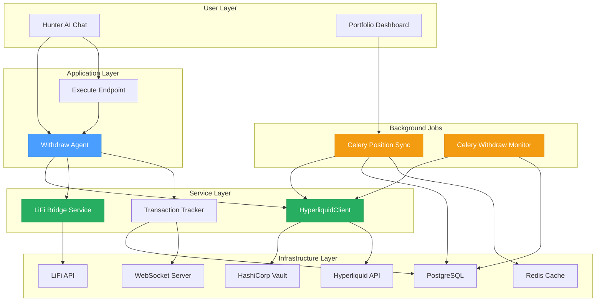

# Hyperliquid Withdraw Agent Specifications

## 📋 Overview

This directory contains comprehensive technical specifications for implementing the Hyperliquid withdraw agent system. These specifications provide implementation-ready guidance for developers building the complete withdrawal workflow to unlock USDC from Hyperliquid Perps accounts.

**Created**: 2026-02-04
**Status**: ✅ Approved for Implementation
**Estimated Implementation Time**: 5-7 days (3 phases)
**Framework Applied**: CTO Engineering Framework (First Principles + Design Thinking + Systems Engineering)

---

## 🎯 Objective

Enable users to withdraw USDC from Hyperliquid Perps/Spot accounts back to their Privy wallets via natural language commands, unlocking funds for swap operations and portfolio management.

**Example User Flow**:
```
User: "Withdraw 100 USDC from Hyperliquid to Base"
↓
Backend executes:
1. Retrieve user's Hyperliquid wallet from Vault
2. Transfer USDC: Perps → Spot (if needed)
3. Initiate Hyperliquid withdrawal to Arbitrum
4. Wait for 30-min finality + bridge confirmation
5. Bridge from Arbitrum → Base (via LiFi)
6. Return result: "100 USDC now in Base wallet"
```

**Background Monitoring**:
- Celery task syncs Hyperliquid positions every 60s
- Real-time balance updates via WebSocket
- Automatic withdrawal status tracking

---

## 📐 Architecture Overview



---

## 📚 Specification Documents

### Strategic Analysis

#### [00_CTO_ANALYSIS.md](./00_CTO_ANALYSIS.md)
**Size**: ~36 KB | **Complexity**: High

**Purpose**: CTO Engineering Framework analysis applying first principles thinking, systems engineering, and design thinking to the withdraw problem.

**Key Topics**:
- Problem decomposition and root cause analysis
- Alternative solution generation (3 solutions evaluated)
- Trade-off analysis and risk assessment
- Security considerations (custody risk is existential)
- Open questions requiring stakeholder alignment

**Critical Insights**:
- Root cause: Hyperliquid's Perps/Spot separation + 30-min withdraw delay
- Primary risk: Custody (private keys must be in Vault/KMS)
- Recommended solution: Direct implementation with mandatory Vault integration
- Blockers: Wallet linking strategy, Hyperliquid API key procurement

---

### Core Components

#### [01_HYPERLIQUID_CLIENT_CORE_SPEC.md](./01_HYPERLIQUID_CLIENT_CORE_SPEC.md)
**Size**: ~72 KB | **Complexity**: Very High

**Purpose**: Core Hyperliquid integration - balance queries, transfers, withdrawals, EIP-712 signing

**Key Topics**:
- Hyperliquid Info API integration (balance queries, position data)
- Hyperliquid Exchange API integration (transfers, withdrawals)
- EIP-712 typed data signing with Vault-stored private keys
- Transaction verification and status tracking
- Rate limiting (1200 req/min Info, 100 req/min Exchange)
- Comprehensive error handling and retry logic

**Performance Target**:
- Balance queries: < 500ms
- Transfer execution: < 2s
- Withdrawal initiation: < 2s
- Vault key retrieval: < 100ms

**Critical Security**:
- Private keys never leave Vault
- EIP-712 signatures validated
- Replay protection via nonces
- Audit logging for all operations

---

#### [02_WITHDRAW_AGENT_SPEC.md](./02_WITHDRAW_AGENT_SPEC.md)
**Size**: ~76 KB | **Complexity**: High

**Purpose**: WithdrawAgent implementation - orchestrates complete withdrawal workflow

**Key Topics**:
- Multi-step workflow orchestration (transfer → withdraw → bridge)
- Intent parsing for withdrawal commands
- Balance validation and transfer logic
- 30-minute withdraw finality handling
- Arbitrum → Base bridge integration via LiFi
- ExecuteAction integration for `/execute` endpoint
- WebSocket real-time status updates

**Performance Target**:
- Full withdrawal: 32-35 minutes (dominated by 30-min Hyperliquid finality)
- Transfer step: < 2s
- Withdraw initiation: < 2s
- Bridge execution: 30s - 2min

**User Experience**:
- Real-time progress updates via WebSocket
- Automatic retry on transient failures
- Clear error messages for user-actionable failures

---

#### [03_CELERY_POSITION_SYNC_SPEC.md](./03_CELERY_POSITION_SYNC_SPEC.md)
**Size**: ~60 KB | **Complexity**: Medium

**Purpose**: Background Celery tasks for position synchronization and withdrawal monitoring

**Key Topics**:
- Position sync task (60s interval per user)
- Balance caching in Redis (5-min TTL)
- Withdrawal status monitoring task
- Token snapshot task (5-min interval)
- Rate limit management (batch processing)
- Transaction history tracking

**Performance Target**:
- Sync latency: < 2s per user
- Redis cache hit rate: > 90%
- Rate limit compliance: < 1000 req/min sustained
- Withdrawal detection: < 90s

**Optimization Strategies**:
- Batch API calls (50 users per request)
- Intelligent caching (only query changed positions)
- Staggered scheduling (avoid thundering herd)

---

## 🗂️ Document Structure

Each specification follows a consistent structure:

### 1. Overview
- Purpose and scope
- Key objectives
- Component relationships

### 2. Technical Design
- Architecture diagrams (Mermaid)
- Sequence diagrams (Mermaid)
- State machines (Mermaid)

### 3. Implementation Details
- Python code examples (production-ready)
- Type hints and docstrings
- Error handling patterns

### 4. API Contracts
- Request/response formats
- HTTP endpoints or method signatures
- WebSocket message formats

### 5. Database Schema
- Table modifications (JSONB in existing tables)
- Index strategies
- Foreign key relationships

### 6. Error Scenarios
- Common failure modes
- Recovery strategies
- User-facing error messages

### 7. Test Cases
- Unit tests
- Integration tests
- End-to-end scenarios

### 8. Security Considerations
- Authentication/authorization
- Vault integration
- Audit logging

### 9. Performance Benchmarks
- Target SLAs
- Acceptable ranges
- Optimization strategies

### 10. References
- Related code files (with line numbers)
- External API documentation
- Related specifications

---

## 🔗 Related Documentation

### Original Specifications
- **Original Spec**: [readme.md](./readme.md) (Spanish, comprehensive)
- **Swap Specs**: [../swap/backend/](../swap/backend/)
  - [INDEX.md](../swap/backend/INDEX.md)
  - [01_HYPERLIQUID_WALLET_MANAGEMENT_SPEC.md](../swap/backend/01_HYPERLIQUID_WALLET_MANAGEMENT_SPEC.md) - Wallet generation patterns

### Codebase References
- **Swap Workflow Agent**: `src/app/infrastructure/adapters/agent_squad/agents/workflows/swap_workflow_agent.py:331-1630`
- **Execute Endpoint**: `src/app/presentation/http/controllers/chat/conversations_router.py:2044+`
- **Hyperliquid Client**: `src/app/infrastructure/adapters/external/hyperliquid_client.py:714-822`
- **Transaction Entity**: `src/app/domain/entities/transaction.py`
- **Celery Tasks**: `src/app/infrastructure/celery_app/tasks/`

---

## 📊 Implementation Roadmap

### Phase 1: Hyperliquid Client Core (2 days)
**Estimated**: 16 hours

- [ ] Extend `HyperliquidClient` with new methods
  - [ ] `get_perps_balance()` - Query Perps balance
  - [ ] `get_spot_balance()` - Query Spot balance
  - [ ] `transfer_to_spot()` - Perps → Spot transfer
  - [ ] `initiate_withdrawal()` - Spot → Arbitrum L1
  - [ ] `get_withdrawal_status()` - Check finality
- [ ] Implement EIP-712 signing
  - [ ] `_sign_eip712()` - Sign typed data with Vault key
  - [ ] Vault integration for key retrieval
- [ ] Database schema updates
  - [ ] Add `tx_metadata` JSONB field to `transactions` table
  - [ ] Index on `metadata->>'withdrawal_status'`
- [ ] Unit tests (25+ tests)
- [ ] Integration tests with Hyperliquid testnet

### Phase 2: Withdraw Agent (2 days)
**Estimated**: 16 hours

- [ ] Create `WithdrawAgent` class
  - [ ] Intent parsing for "withdraw X from Hyperliquid"
  - [ ] Balance validation logic
  - [ ] Multi-step orchestration
  - [ ] Error recovery strategies
- [ ] Integrate with `ExecuteAction`
  - [ ] Add `WITHDRAW_FROM_HYPERLIQUID` action type
  - [ ] Wire agent to `/execute` endpoint
- [ ] Transaction tracking
  - [ ] WebSocket progress updates
  - [ ] Database persistence
- [ ] LiFi bridge integration
  - [ ] Arbitrum → Base bridge
  - [ ] Status polling
- [ ] Unit tests (20+ tests)
- [ ] E2E test scenarios (3 scenarios)

### Phase 3: Celery Position Sync (2 days)
**Estimated**: 16 hours

- [ ] Implement position sync task
  - [ ] `sync_user_hyperliquid_positions()`
  - [ ] Balance caching in Redis
  - [ ] Rate limit management
- [ ] Implement withdrawal monitor
  - [ ] `monitor_pending_withdrawals()`
  - [ ] Status checks every 60s
  - [ ] Trigger bridge on completion
- [ ] Implement token snapshot task
  - [ ] `snapshot_hyperliquid_tokens()`
  - [ ] Update token metadata
- [ ] Celery Beat schedule configuration
- [ ] Monitoring and alerting setup
- [ ] Unit tests (15+ tests)
- [ ] Load testing (1000 users)

**Total Estimated Time**: 5-7 days (48 hours with buffer)

---

## ✅ Quality Assurance Checklist

Each specification document includes:

- [x] Implementation-ready code examples (Python with type hints)
- [x] Complete error handling scenarios
- [x] Visual diagrams (Mermaid)
- [x] Test cases (unit + integration + E2E)
- [x] Security considerations (Vault integration)
- [x] Cost analysis
- [x] Performance benchmarks
- [x] Database schemas
- [x] API contracts
- [x] References to actual code (file paths + line numbers)

---

## 🎯 Success Criteria

Implementation is complete when:

1. ✅ User can execute "withdraw 100 USDC from Hyperliquid" via chat
2. ✅ Agent validates Spot balance and transfers from Perps if needed
3. ✅ Hyperliquid withdrawal initiates to Arbitrum L1
4. ✅ 30-minute finality wait handled with WebSocket updates
5. ✅ Arbitrum → Base bridge executes automatically
6. ✅ USDC arrives in user's Privy wallet on Base
7. ✅ Real-time WebSocket updates throughout 35-min flow
8. ✅ Transaction persisted to database with all steps
9. ✅ Error recovery handles bridge/withdrawal failures
10. ✅ Celery position sync updates balances every 60s
11. ✅ All unit + integration + E2E tests pass
12. ✅ Security audit passes (private keys in Vault only)
13. ✅ Performance benchmarks meet SLAs

---

## 📈 Metrics & Monitoring

### Key Performance Indicators

| Metric | Target | Alert Threshold |
|--------|--------|-----------------|
| Withdrawal Success Rate | > 95% | < 90% |
| Average E2E Time | 32-35 min | > 40 min |
| Transfer Success Rate | > 99% | < 95% |
| Bridge Success Rate | > 98% | < 95% |
| Position Sync Latency | < 2s | > 5s |
| Vault Key Retrieval | < 100ms | > 500ms |
| Rate Limit Compliance | 100% | < 99% |

### Cost Metrics

| Operation | Cost | Monthly Estimate (100 withdrawals) |
|-----------|------|-------------------------------------|
| Vault Read/Write | $0.0001 | $0.01 |
| Hyperliquid Withdrawal Gas | $0.15 (user-paid) | - |
| Arbitrum → Base Bridge | $0.50-2.00 (user-paid) | - |
| Compute (Celery) | Negligible | $1 |
| Redis Cache | Negligible | $0.50 |
| **Total Backend** | **$0.0001** | **$1.51** |

---

## 🔐 Security Architecture

### Key Protection
- **HashiCorp Vault**: Secure private key storage
- **EIP-712 Signing**: Backend-only signing (frontend never sees keys)
- **Key Rotation**: 90-day automatic rotation
- **Access Control**: Service role only, no human access
- **Audit Trail**: All wallet operations logged

### API Security
- **Authentication**: JWT tokens from auth system
- **Rate Limiting**: 10 withdrawals/day per user (configurable)
- **Amount Limits**: Min $1, Max $100,000 per withdrawal
- **IP Allowlist**: Backend service IPs only for Vault

### Transaction Security
- **Nonce Management**: Prevent replay attacks
- **Balance Validation**: Verify sufficient funds before withdrawal
- **Withdrawal Limits**: Daily and per-transaction limits
- **Anomaly Detection**: Alert on unusual patterns

### Data Security
- **Encryption at Rest**: PostgreSQL with encryption
- **Encryption in Transit**: TLS 1.3 for all APIs
- **No Logging**: Private keys never logged
- **Secret Management**: Vault for all sensitive data

---

## 🚀 Getting Started

### For Implementers

1. **Read specifications in order**: 00 (CTO Analysis) → 01 → 02 → 03
2. **Review existing code**: Check references in each spec
3. **Set up development environment**:
   ```bash
   make up.db           # Start PostgreSQL
   make create-db       # Create database
   alembic upgrade head # Apply migrations

   # Install HashiCorp Vault
   brew install vault   # macOS
   # or download from https://www.vaultproject.io/downloads

   # Start Vault dev mode
   vault server -dev
   ```
4. **Configure environment**:
   ```bash
   # Add to config/local/.secrets.toml
   [vault]
   address = "http://127.0.0.1:8200"
   token = "hvs.dev-token-here"
   namespace = "anvil"

   [hyperliquid]
   api_url = "https://api.hyperliquid-testnet.xyz"
   websocket_url = "wss://api.hyperliquid-testnet.xyz/ws"
   ```
5. **Run tests**: `make code.test`
6. **Follow implementation roadmap**: Start with Phase 1

### For Reviewers

1. **Verify completeness**: Check all sections present
2. **Validate code examples**: Ensure Python syntax correct
3. **Test diagrams**: Verify Mermaid renders correctly
4. **Cross-reference**: Check consistency across specs
5. **Security review**: Verify Vault integration mandatory

### For Stakeholders

**Open Questions Requiring Decisions** (from CTO Analysis):
1. **Wallet linking strategy**: Generate 1 wallet per user? User-provided? (Blocker for Phase 1)
2. **Hyperliquid API key**: How to obtain? (Blocker for Phase 1)
3. **Target chain**: Always Base? Always Arbitrum? User choice? (Blocker for Phase 2)
4. **Withdrawal limits**: Daily max? Per-transaction max? (Phase 2)

---

## 📞 Support & Questions

- **Architecture Questions**: Reference [00_CTO_ANALYSIS.md](./00_CTO_ANALYSIS.md)
- **Security Questions**: Reference security sections in each spec + CTO Analysis
- **Implementation Questions**: Check code examples and references
- **Original Spec**: See [readme.md](./readme.md)

---

## 🚨 Critical Blockers

Before implementation can start:

1. ⚠️ **Hyperliquid API Key**: Obtain API credentials for testnet + mainnet
2. ⚠️ **Wallet Linking Decision**: Resolve 1-wallet-per-user vs other strategies
3. ⚠️ **Vault Setup**: Deploy HashiCorp Vault in dev + staging + prod
4. ⚠️ **Legal Review**: Confirm custody model is compliant

**Timeline Impact**: Resolving blockers adds 1-2 days to schedule

---

## 📝 Risk Assessment Summary

From CTO Analysis:

| Risk Category | Level | Mitigation |
|---------------|-------|------------|
| Custody Risk | 🔴 Critical | Mandatory Vault integration, key rotation, audit logs |
| Bridge Risk | 🟡 Medium | Retry logic, status monitoring, user notifications |
| Rate Limit Risk | 🟡 Medium | Batch processing, intelligent caching, queue management |
| 30-min Delay UX | 🟡 Medium | WebSocket updates, clear messaging, progress bar |
| Hyperliquid API Changes | 🟢 Low | Version pinning, backward compatibility checks |

**Overall Risk Level**: Medium-High (dominated by custody concerns)

**Risk Acceptance**: Proceed only with Vault integration (non-negotiable)

---

**Document Version**: 1.0
**Last Updated**: 2026-02-04
**Maintained By**: Engineering Team
**Status**: ✅ Ready for Implementation (pending blocker resolution)
