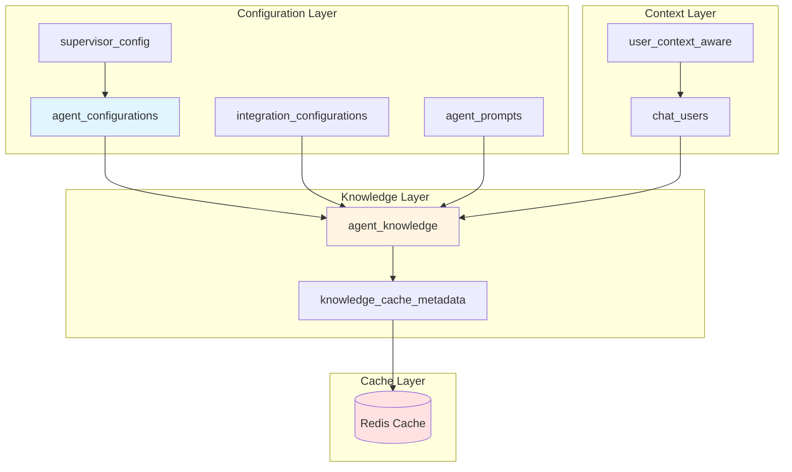
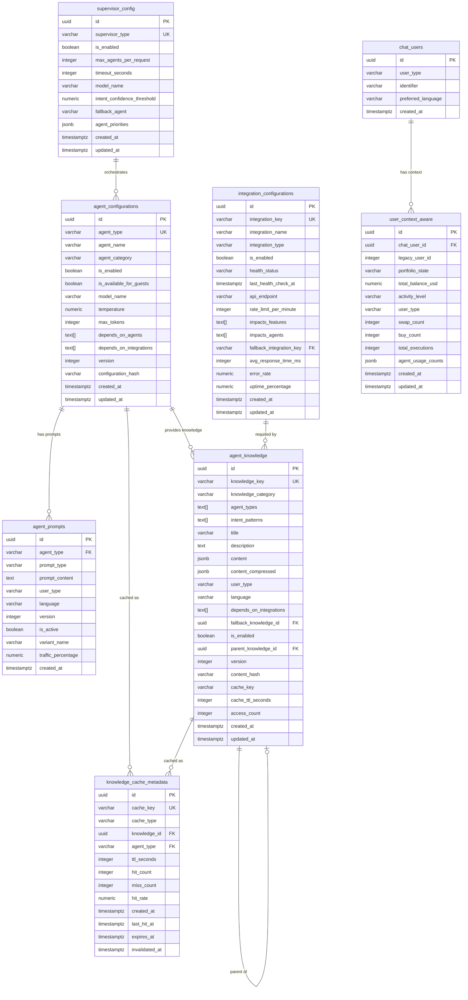
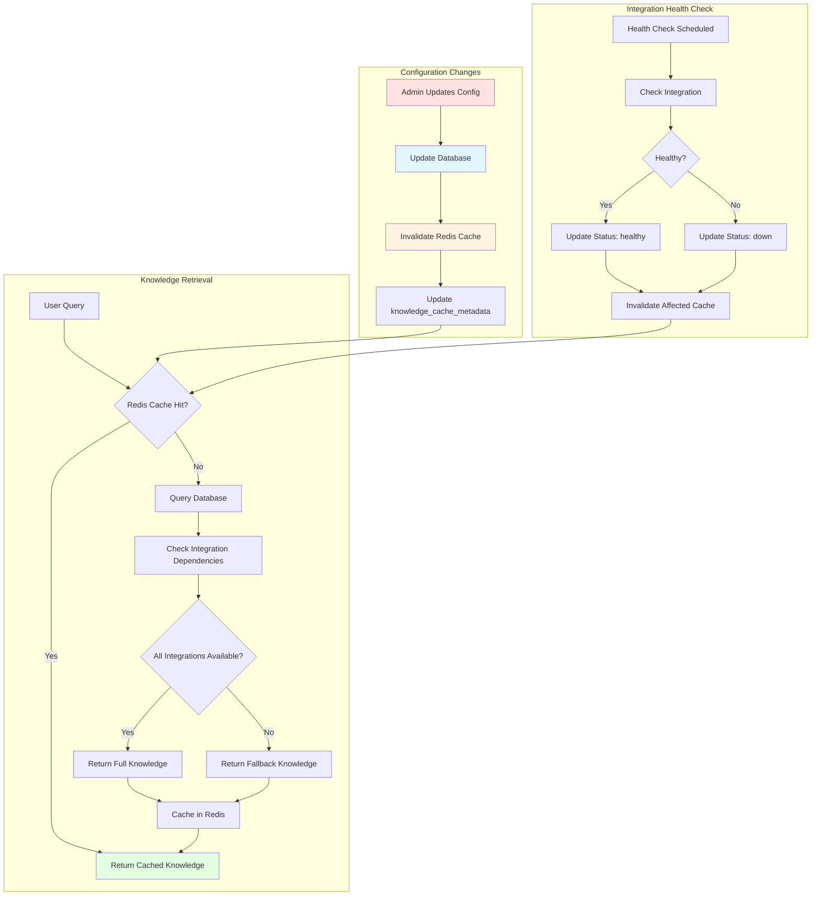

# AI Brain Module: Database Schema Architecture

**Version:** 1.0.0  
**Date:** 2026-01-26  
**Status:** Design Specification  
**Author:** Database Architect (Claude Sonnet 4.5)

---

## Executive Summary

The **AI Brain** is a centralized knowledge and configuration management system that controls how agents respond to users based on feature availability, integration status, and user context. This document specifies the database architecture that enables dynamic, configuration-driven agent behavior.

**Key Objectives:**
1. **Dynamic Knowledge Management**: Agents access real-time knowledge based on enabled features
2. **Integration-Driven Responses**: Agent knowledge reflects integration availability (1inch, Hyperliquid, Morpho)
3. **Context-Aware Delivery**: Different knowledge for guest vs authenticated users
4. **Configuration Versioning**: Track changes to agent configurations over time
5. **Redis Cache Layer**: High-performance knowledge delivery with cache invalidation

---

## Table of Contents

1. [System Context & Requirements](#system-context--requirements)
2. [Current State Analysis](#current-state-analysis)
3. [Database Schema Design](#database-schema-design)
4. [Redis Cache Architecture](#redis-cache-architecture)
5. [Access Control Design](#access-control-design)
6. [Migration Strategy](#migration-strategy)
7. [Performance Considerations](#performance-considerations)
8. [Risk Assessment](#risk-assessment)

---

## System Context & Requirements

### Problem Statement

**Current Issue:**
- Agent knowledge is stored in static JSON files (`anvil_knowledge/features/*.json`)
- When swap functionality is disabled, agents still reference swap capabilities in responses
- No dynamic relationship between feature availability and agent knowledge
- Integration status (1inch enabled/disabled) doesn't impact agent responses
- Knowledge is loaded from filesystem on every request (performance bottleneck)

**Business Impact:**
- Users receive misleading information about unavailable features
- Agents cannot adapt responses based on integration health
- No ability to A/B test different knowledge configurations
- Performance degradation with filesystem I/O on every request

### Requirements

#### Functional Requirements

**FR-1: Dynamic Knowledge Selection**
- Agents MUST access knowledge based on enabled features
- When swap is disabled → agents MUST NOT mention swap capabilities
- When 1inch integration is down → agents MUST offer alternative swap providers

**FR-2: Integration-Aware Responses**
- Knowledge MUST reflect integration availability
- Swap knowledge MUST include only enabled providers (1inch, Hyperliquid, UniswapX)
- Lending knowledge MUST adapt if Morpho integration is unavailable

**FR-3: Context-Aware Knowledge**
- Guest users: Basic knowledge without execution capabilities
- Authenticated users: Full knowledge including execution workflows
- Premium users: Advanced features (ULTRA, enterprise agents)

**FR-4: Configuration Versioning**
- Track all configuration changes with timestamp and author
- Ability to rollback to previous configurations
- Audit trail for compliance

**FR-5: Cache Performance**
- Knowledge queries MUST complete in <50ms (p95)
- Redis cache for frequently accessed knowledge
- Cache invalidation on configuration changes

#### Non-Functional Requirements

**NFR-1: Performance**
- Knowledge retrieval: <50ms (p95), <100ms (p99)
- Cache hit rate: >90%
- Database query response: <20ms

**NFR-2: Scalability**
- Support 100+ agent types
- Handle 1M+ knowledge queries per hour
- Scale to 10M+ users

**NFR-3: Reliability**
- 99.9% uptime for knowledge retrieval
- Graceful degradation if cache unavailable
- Automatic cache warming on startup

**NFR-4: Security**
- Role-based access control (RBAC)
- Audit logging for all configuration changes
- Encrypted sensitive configuration data

---

## Current State Analysis

### Existing Tables

#### user_context_aware
**Purpose:** Pre-computed user context for context-aware agent responses  
**Status:** ✅ Production-ready  
**Location:** `src/app/infrastructure/persistence_sqla/mappings/user_context.py`

**Key Fields:**
- `chat_user_id` (UUID) - Foreign key to chat_users
- `portfolio_state` (enum) - empty, starter, active, whale
- `activity_level` (enum) - new, active, inactive, reactivated
- `user_type` (enum) - new_user, casual, trader, yield_farmer, power_user
- `total_executions` (int) - Swap/buy/lending counts
- `wallet_total_usd` (decimal) - Portfolio value
- `agent_usage_counts` (jsonb) - Agent usage tracking

**Integration Points:**
- Used by `KnowledgeInjector` to determine user context
- Updated by Celery task periodically
- Indexed for fast user lookup

#### chat_users
**Purpose:** Unified user table for guest and authenticated users  
**Status:** ✅ Production-ready  
**Location:** `src/app/infrastructure/persistence_sqla/mappings/chat_unified.py`

**Key Fields:**
- `id` (UUID) - Primary key
- `user_type` (string) - guest, authenticated, premium
- `identifier` (string) - IP for guest, privy_id for authenticated
- `preferred_language` (string) - Language preference

#### agent_squad configuration (TOML)
**Purpose:** Agent configuration from TOML files  
**Status:** ✅ Production-ready  
**Location:** `src/app/setup/config/agent_squad.py`

**Key Settings:**
```python
class ExternalAPIsConfig:
    enable_1inch: bool = True
    enable_hyperliquid: bool = True
    enable_morpho: bool = True
    enable_uniswap: bool = True
    # ... etc
```

**Limitation:** TOML-based configuration requires code deployment to change

### Existing Knowledge System

#### JSON Knowledge Files
**Location:** `anvil_knowledge/features/*.json`

**Files:**
- `swap.json` - Swap feature knowledge (Hyperliquid-only now)
- `hunter_ai.json` - Hunter AI capabilities
- `ultra.json` - ULTRA arbitrage features
- `lending_morpho.json` - Morpho lending knowledge
- `portfolio.json`, `wallet.json`, `gas_optimizer.json`, `risk_analyzer.json`

**Knowledge Injector**
**Location:** `src/app/application/chat/services/knowledge_injector.py`

**Current Flow:**
```
User Query → Intent Detection → KnowledgeInjector.get_knowledge_for_intent()
→ Load JSON from filesystem → Format for LLM → Agent Response
```

**Limitations:**
1. **Static Knowledge**: No awareness of feature enablement
2. **Filesystem I/O**: Performance bottleneck (no caching)
3. **No Versioning**: Can't track knowledge changes
4. **No A/B Testing**: Can't test different knowledge variants

---

## Database Schema Design

### Architecture Overview



### Schema: agent_configurations

**Purpose:** Master configuration table for all agent settings

```sql
CREATE TABLE agent_configurations (
    -- Primary key
    id UUID PRIMARY KEY DEFAULT gen_random_uuid(),
    
    -- Agent identification
    agent_type VARCHAR(50) NOT NULL UNIQUE,  -- 'chat', 'knowledge', 'hunter_ai', 'swap_workflow', etc.
    agent_name VARCHAR(100) NOT NULL,  -- Display name
    agent_category VARCHAR(50) NOT NULL,  -- 'core', 'enterprise', 'advanced'
    
    -- Feature toggles
    is_enabled BOOLEAN NOT NULL DEFAULT TRUE,
    is_available_for_guests BOOLEAN NOT NULL DEFAULT TRUE,
    is_available_for_authenticated BOOLEAN NOT NULL DEFAULT TRUE,
    is_available_for_premium BOOLEAN NOT NULL DEFAULT TRUE,
    
    -- LLM configuration
    model_name VARCHAR(100) NOT NULL DEFAULT 'gemini-2.0-flash',
    temperature NUMERIC(3,2) NOT NULL DEFAULT 0.7,
    max_tokens INTEGER NOT NULL DEFAULT 1000,
    
    -- Behavioral settings
    fallback_agent VARCHAR(50) NULL,  -- Agent to use if this fails
    requires_wallet BOOLEAN NOT NULL DEFAULT FALSE,
    requires_execution_capability BOOLEAN NOT NULL DEFAULT FALSE,
    
    -- Dependencies (array of agent_types this agent depends on)
    depends_on_agents TEXT[] DEFAULT '{}',
    depends_on_integrations TEXT[] DEFAULT '{}',  -- ['1inch', 'morpho', 'hyperliquid']
    
    -- Metadata
    description TEXT,
    tags TEXT[] DEFAULT '{}',
    priority INTEGER NOT NULL DEFAULT 100,  -- Routing priority (higher = more important)
    
    -- Configuration versioning
    version INTEGER NOT NULL DEFAULT 1,
    configuration_hash VARCHAR(64),  -- SHA-256 of configuration for change detection
    
    -- Audit fields
    created_at TIMESTAMPTZ NOT NULL DEFAULT CURRENT_TIMESTAMP,
    updated_at TIMESTAMPTZ NOT NULL DEFAULT CURRENT_TIMESTAMP,
    created_by VARCHAR(100),
    updated_by VARCHAR(100),
    
    -- Constraints
    CONSTRAINT valid_agent_category CHECK (
        agent_category IN ('core', 'enterprise', 'advanced', 'workflow')
    ),
    CONSTRAINT valid_temperature CHECK (temperature >= 0.0 AND temperature <= 2.0),
    CONSTRAINT valid_max_tokens CHECK (max_tokens > 0 AND max_tokens <= 100000)
);

-- Indexes
CREATE INDEX idx_agent_configs_enabled ON agent_configurations(is_enabled) WHERE is_enabled = TRUE;
CREATE INDEX idx_agent_configs_category ON agent_configurations(agent_category);
CREATE INDEX idx_agent_configs_priority ON agent_configurations(priority DESC);
CREATE INDEX idx_agent_configs_updated ON agent_configurations(updated_at DESC);

-- GIN index for array searches
CREATE INDEX idx_agent_configs_depends_integrations ON agent_configurations 
    USING gin(depends_on_integrations);

COMMENT ON TABLE agent_configurations IS 'Master configuration table for all AI agents';
COMMENT ON COLUMN agent_configurations.agent_type IS 'Unique identifier matching AgentType enum';
COMMENT ON COLUMN agent_configurations.depends_on_integrations IS 'Integration requirements (e.g., swap requires 1inch)';
COMMENT ON COLUMN agent_configurations.configuration_hash IS 'SHA-256 hash for detecting configuration changes';
```

### Schema: agent_prompts

**Purpose:** System prompts with versioning and A/B testing support

```sql
CREATE TABLE agent_prompts (
    -- Primary key
    id UUID PRIMARY KEY DEFAULT gen_random_uuid(),
    
    -- Agent reference
    agent_type VARCHAR(50) NOT NULL,
    FOREIGN KEY (agent_type) REFERENCES agent_configurations(agent_type) ON DELETE CASCADE,
    
    -- Prompt type
    prompt_type VARCHAR(50) NOT NULL,  -- 'system', 'user', 'supervisor'
    
    -- Prompt content
    prompt_content TEXT NOT NULL,
    prompt_content_compressed TEXT,  -- Token-compressed version
    estimated_tokens INTEGER,
    
    -- Context targeting
    user_type VARCHAR(20),  -- 'guest', 'authenticated', 'premium', NULL (all)
    language VARCHAR(5) DEFAULT 'en',
    
    -- Version control
    version INTEGER NOT NULL DEFAULT 1,
    is_active BOOLEAN NOT NULL DEFAULT TRUE,
    
    -- A/B Testing
    variant_name VARCHAR(50) DEFAULT 'default',  -- 'default', 'variant_a', 'variant_b'
    traffic_percentage NUMERIC(5,2) DEFAULT 100.00,  -- % of traffic for this variant
    
    -- Performance tracking
    avg_response_time_ms INTEGER,
    success_rate NUMERIC(5,2),
    user_satisfaction_score NUMERIC(3,2),  -- 1-5 rating
    
    -- Metadata
    description TEXT,
    tags TEXT[] DEFAULT '{}',
    
    -- Audit fields
    created_at TIMESTAMPTZ NOT NULL DEFAULT CURRENT_TIMESTAMP,
    updated_at TIMESTAMPTZ NOT NULL DEFAULT CURRENT_TIMESTAMP,
    created_by VARCHAR(100),
    activated_at TIMESTAMPTZ,
    deactivated_at TIMESTAMPTZ,
    
    -- Constraints
    CONSTRAINT valid_prompt_type CHECK (
        prompt_type IN ('system', 'user', 'supervisor', 'knowledge_base')
    ),
    CONSTRAINT valid_user_type CHECK (
        user_type IS NULL OR user_type IN ('guest', 'authenticated', 'premium')
    ),
    CONSTRAINT valid_traffic_percentage CHECK (
        traffic_percentage >= 0 AND traffic_percentage <= 100
    ),
    CONSTRAINT unique_active_prompt UNIQUE (agent_type, prompt_type, user_type, variant_name, is_active)
        WHERE is_active = TRUE
);

-- Indexes
CREATE INDEX idx_agent_prompts_agent ON agent_prompts(agent_type, prompt_type, is_active);
CREATE INDEX idx_agent_prompts_variant ON agent_prompts(variant_name, is_active);
CREATE INDEX idx_agent_prompts_performance ON agent_prompts(success_rate DESC, avg_response_time_ms ASC);

COMMENT ON TABLE agent_prompts IS 'System prompts with versioning and A/B testing';
COMMENT ON COLUMN agent_prompts.variant_name IS 'A/B test variant identifier';
COMMENT ON COLUMN agent_prompts.traffic_percentage IS 'Percentage of traffic routed to this variant';
```

### Schema: agent_knowledge

**Purpose:** Dynamic knowledge entries with integration dependencies

```sql
CREATE TABLE agent_knowledge (
    -- Primary key
    id UUID PRIMARY KEY DEFAULT gen_random_uuid(),
    
    -- Knowledge identification
    knowledge_key VARCHAR(100) NOT NULL,  -- 'swap_overview', 'hunter_ai_sentiment', etc.
    knowledge_category VARCHAR(50) NOT NULL,  -- 'feature', 'integration', 'protocol', 'general'
    
    -- Agent associations (can be shared across multiple agents)
    agent_types TEXT[] NOT NULL,  -- ['knowledge', 'chat', 'swap_workflow']
    
    -- Intent mapping
    intent_patterns TEXT[] DEFAULT '{}',  -- ['SWAP', 'HUNTER_SENTIMENT']
    
    -- Knowledge content
    title VARCHAR(255) NOT NULL,
    description TEXT,
    content JSONB NOT NULL,  -- Structured knowledge data (replaces JSON files)
    content_compressed JSONB,  -- Token-compressed version
    
    -- Context targeting
    user_type VARCHAR(20),  -- 'guest', 'authenticated', 'premium', NULL (all)
    language VARCHAR(5) DEFAULT 'en',
    
    -- Integration dependencies
    depends_on_integrations TEXT[] DEFAULT '{}',  -- ['1inch', 'hyperliquid', 'morpho']
    fallback_knowledge_id UUID,  -- Knowledge to use if dependencies unavailable
    FOREIGN KEY (fallback_knowledge_id) REFERENCES agent_knowledge(id) ON DELETE SET NULL,
    
    -- Feature flags
    is_enabled BOOLEAN NOT NULL DEFAULT TRUE,
    requires_feature_enabled VARCHAR(50),  -- 'swap', 'lending', 'ultra'
    
    -- Hierarchical structure
    parent_knowledge_id UUID,
    FOREIGN KEY (parent_knowledge_id) REFERENCES agent_knowledge(id) ON DELETE CASCADE,
    display_order INTEGER DEFAULT 0,
    
    -- Version control
    version INTEGER NOT NULL DEFAULT 1,
    content_hash VARCHAR(64),  -- SHA-256 of content for change detection
    
    -- Redis cache metadata
    cache_key VARCHAR(255),  -- Redis key pattern
    cache_ttl_seconds INTEGER DEFAULT 3600,  -- 1 hour default
    
    -- Performance tracking
    access_count INTEGER DEFAULT 0,
    last_accessed_at TIMESTAMPTZ,
    avg_retrieval_time_ms INTEGER,
    
    -- Metadata
    tags TEXT[] DEFAULT '{}',
    priority INTEGER NOT NULL DEFAULT 100,
    
    -- Audit fields
    created_at TIMESTAMPTZ NOT NULL DEFAULT CURRENT_TIMESTAMP,
    updated_at TIMESTAMPTZ NOT NULL DEFAULT CURRENT_TIMESTAMP,
    created_by VARCHAR(100),
    updated_by VARCHAR(100),
    
    -- Constraints
    CONSTRAINT valid_knowledge_category CHECK (
        knowledge_category IN ('feature', 'integration', 'protocol', 'general', 'error_message')
    ),
    CONSTRAINT valid_user_type_knowledge CHECK (
        user_type IS NULL OR user_type IN ('guest', 'authenticated', 'premium')
    ),
    CONSTRAINT unique_knowledge_key UNIQUE (knowledge_key, user_type, language)
);

-- Indexes
CREATE INDEX idx_knowledge_enabled ON agent_knowledge(is_enabled) WHERE is_enabled = TRUE;
CREATE INDEX idx_knowledge_category ON agent_knowledge(knowledge_category, is_enabled);
CREATE INDEX idx_knowledge_priority ON agent_knowledge(priority DESC);
CREATE INDEX idx_knowledge_access ON agent_knowledge(access_count DESC);
CREATE INDEX idx_knowledge_cache_key ON agent_knowledge(cache_key);
CREATE INDEX idx_knowledge_parent ON agent_knowledge(parent_knowledge_id);

-- GIN indexes for array searches
CREATE INDEX idx_knowledge_agent_types ON agent_knowledge USING gin(agent_types);
CREATE INDEX idx_knowledge_integrations ON agent_knowledge USING gin(depends_on_integrations);
CREATE INDEX idx_knowledge_intents ON agent_knowledge USING gin(intent_patterns);

-- Full-text search on knowledge content
CREATE INDEX idx_knowledge_fts ON agent_knowledge 
    USING gin(to_tsvector('english', title || ' ' || coalesce(description, '')));

COMMENT ON TABLE agent_knowledge IS 'Dynamic agent knowledge with integration dependencies';
COMMENT ON COLUMN agent_knowledge.content IS 'Structured JSON knowledge (replaces static JSON files)';
COMMENT ON COLUMN agent_knowledge.depends_on_integrations IS 'Required integrations for this knowledge';
COMMENT ON COLUMN agent_knowledge.fallback_knowledge_id IS 'Alternative knowledge if dependencies unavailable';
```

### Schema: integration_configurations

**Purpose:** External integration availability and health status

```sql
CREATE TABLE integration_configurations (
    -- Primary key
    id UUID PRIMARY KEY DEFAULT gen_random_uuid(),
    
    -- Integration identification
    integration_key VARCHAR(50) NOT NULL UNIQUE,  -- '1inch', 'hyperliquid', 'morpho', 'coingecko'
    integration_name VARCHAR(100) NOT NULL,
    integration_type VARCHAR(50) NOT NULL,  -- 'dex_aggregator', 'exchange', 'lending', 'data_provider'
    
    -- Feature flags
    is_enabled BOOLEAN NOT NULL DEFAULT TRUE,
    is_available_for_guests BOOLEAN NOT NULL DEFAULT TRUE,
    is_available_for_authenticated BOOLEAN NOT NULL DEFAULT TRUE,
    is_available_for_premium BOOLEAN NOT NULL DEFAULT TRUE,
    
    -- Health status
    health_status VARCHAR(20) NOT NULL DEFAULT 'healthy',  -- 'healthy', 'degraded', 'down'
    last_health_check_at TIMESTAMPTZ,
    health_check_error TEXT,
    
    -- Configuration
    api_endpoint VARCHAR(500),
    api_key_required BOOLEAN NOT NULL DEFAULT FALSE,
    rate_limit_per_minute INTEGER,
    timeout_seconds INTEGER DEFAULT 30,
    
    -- Feature impact (which features depend on this integration)
    impacts_features TEXT[] DEFAULT '{}',  -- ['swap', 'lending', 'portfolio']
    impacts_agents TEXT[] DEFAULT '{}',  -- ['swap_workflow', 'lending_workflow']
    
    -- Fallback configuration
    fallback_integration_key VARCHAR(50),
    FOREIGN KEY (fallback_integration_key) REFERENCES integration_configurations(integration_key) 
        ON DELETE SET NULL,
    
    -- Performance metrics
    avg_response_time_ms INTEGER,
    error_rate NUMERIC(5,2),  -- Percentage
    uptime_percentage NUMERIC(5,2),  -- Last 24 hours
    
    -- Metadata
    description TEXT,
    documentation_url VARCHAR(500),
    tags TEXT[] DEFAULT '{}',
    priority INTEGER NOT NULL DEFAULT 100,
    
    -- Audit fields
    created_at TIMESTAMPTZ NOT NULL DEFAULT CURRENT_TIMESTAMP,
    updated_at TIMESTAMPTZ NOT NULL DEFAULT CURRENT_TIMESTAMP,
    created_by VARCHAR(100),
    updated_by VARCHAR(100),
    
    -- Constraints
    CONSTRAINT valid_health_status CHECK (
        health_status IN ('healthy', 'degraded', 'down', 'maintenance')
    ),
    CONSTRAINT valid_integration_type CHECK (
        integration_type IN ('dex_aggregator', 'exchange', 'lending', 'data_provider', 'bridge', 'wallet')
    )
);

-- Indexes
CREATE INDEX idx_integrations_enabled ON integration_configurations(is_enabled) 
    WHERE is_enabled = TRUE;
CREATE INDEX idx_integrations_health ON integration_configurations(health_status);
CREATE INDEX idx_integrations_type ON integration_configurations(integration_type, is_enabled);
CREATE INDEX idx_integrations_priority ON integration_configurations(priority DESC);

-- GIN indexes for array searches
CREATE INDEX idx_integrations_features ON integration_configurations USING gin(impacts_features);
CREATE INDEX idx_integrations_agents ON integration_configurations USING gin(impacts_agents);

COMMENT ON TABLE integration_configurations IS 'External integration health and availability';
COMMENT ON COLUMN integration_configurations.health_status IS 'Real-time health status from circuit breaker';
COMMENT ON COLUMN integration_configurations.impacts_features IS 'Features that depend on this integration';
```

### Schema: supervisor_config

**Purpose:** Supervisor-level orchestration settings

```sql
CREATE TABLE supervisor_config (
    -- Primary key
    id UUID PRIMARY KEY DEFAULT gen_random_uuid(),
    
    -- Supervisor identification
    supervisor_type VARCHAR(50) NOT NULL UNIQUE,  -- 'authenticated', 'guest', 'premium'
    
    -- Configuration
    is_enabled BOOLEAN NOT NULL DEFAULT TRUE,
    max_agents_per_request INTEGER NOT NULL DEFAULT 5,
    timeout_seconds INTEGER NOT NULL DEFAULT 120,
    
    -- Model configuration
    model_name VARCHAR(100) NOT NULL DEFAULT 'gemini-2.0-flash',
    temperature NUMERIC(3,2) NOT NULL DEFAULT 0.7,
    max_tokens INTEGER NOT NULL DEFAULT 2000,
    
    -- Routing rules
    intent_confidence_threshold NUMERIC(3,2) DEFAULT 0.85,
    fallback_agent VARCHAR(50) DEFAULT 'chat',
    max_context_messages INTEGER DEFAULT 10,
    
    -- Agent priority overrides (JSONB for flexibility)
    agent_priorities JSONB DEFAULT '{}',  -- {"swap_workflow": 200, "hunter_ai": 180}
    
    -- Feature toggles
    enable_intent_classification BOOLEAN NOT NULL DEFAULT TRUE,
    enable_multi_agent_coordination BOOLEAN NOT NULL DEFAULT TRUE,
    enable_context_preservation BOOLEAN NOT NULL DEFAULT TRUE,
    
    -- Performance settings
    max_concurrent_agents INTEGER DEFAULT 3,
    routing_timeout_seconds INTEGER DEFAULT 5,
    
    -- Metadata
    description TEXT,
    
    -- Audit fields
    created_at TIMESTAMPTZ NOT NULL DEFAULT CURRENT_TIMESTAMP,
    updated_at TIMESTAMPTZ NOT NULL DEFAULT CURRENT_TIMESTAMP,
    created_by VARCHAR(100),
    updated_by VARCHAR(100),
    
    -- Constraints
    CONSTRAINT valid_supervisor_type CHECK (
        supervisor_type IN ('authenticated', 'guest', 'premium', 'enterprise')
    ),
    CONSTRAINT valid_intent_threshold CHECK (
        intent_confidence_threshold >= 0.0 AND intent_confidence_threshold <= 1.0
    )
);

-- Indexes
CREATE INDEX idx_supervisor_enabled ON supervisor_config(is_enabled) WHERE is_enabled = TRUE;
CREATE INDEX idx_supervisor_type ON supervisor_config(supervisor_type);

COMMENT ON TABLE supervisor_config IS 'Supervisor orchestration configuration';
COMMENT ON COLUMN supervisor_config.agent_priorities IS 'Agent routing priority overrides (JSON)';
```

### Schema: knowledge_cache_metadata

**Purpose:** Redis cache tracking and invalidation management

```sql
CREATE TABLE knowledge_cache_metadata (
    -- Primary key
    id UUID PRIMARY KEY DEFAULT gen_random_uuid(),
    
    -- Cache identification
    cache_key VARCHAR(255) NOT NULL UNIQUE,
    cache_type VARCHAR(50) NOT NULL,  -- 'agent_knowledge', 'agent_config', 'integration_status'
    
    -- References
    knowledge_id UUID,
    FOREIGN KEY (knowledge_id) REFERENCES agent_knowledge(id) ON DELETE CASCADE,
    agent_type VARCHAR(50),
    FOREIGN KEY (agent_type) REFERENCES agent_configurations(agent_type) ON DELETE CASCADE,
    
    -- Cache configuration
    ttl_seconds INTEGER NOT NULL DEFAULT 3600,
    compression_enabled BOOLEAN NOT NULL DEFAULT TRUE,
    
    -- Cache statistics
    hit_count INTEGER DEFAULT 0,
    miss_count INTEGER DEFAULT 0,
    hit_rate NUMERIC(5,2) GENERATED ALWAYS AS (
        CASE 
            WHEN (hit_count + miss_count) = 0 THEN 0
            ELSE ROUND((hit_count::NUMERIC / (hit_count + miss_count)) * 100, 2)
        END
    ) STORED,
    
    -- Cache lifecycle
    created_at TIMESTAMPTZ NOT NULL DEFAULT CURRENT_TIMESTAMP,
    last_hit_at TIMESTAMPTZ,
    last_miss_at TIMESTAMPTZ,
    last_warmed_at TIMESTAMPTZ,
    expires_at TIMESTAMPTZ,
    
    -- Cache invalidation
    invalidated_at TIMESTAMPTZ,
    invalidation_reason TEXT,
    auto_invalidate_on_config_change BOOLEAN NOT NULL DEFAULT TRUE,
    
    -- Performance metrics
    avg_retrieval_time_ms INTEGER,
    last_retrieval_time_ms INTEGER,
    
    -- Metadata
    tags TEXT[] DEFAULT '{}',
    
    -- Constraints
    CONSTRAINT valid_cache_type CHECK (
        cache_type IN ('agent_knowledge', 'agent_config', 'integration_status', 'user_context')
    )
);

-- Indexes
CREATE INDEX idx_cache_meta_key ON knowledge_cache_metadata(cache_key);
CREATE INDEX idx_cache_meta_type ON knowledge_cache_metadata(cache_type);
CREATE INDEX idx_cache_meta_knowledge ON knowledge_cache_metadata(knowledge_id);
CREATE INDEX idx_cache_meta_agent ON knowledge_cache_metadata(agent_type);
CREATE INDEX idx_cache_meta_hit_rate ON knowledge_cache_metadata(hit_rate DESC);
CREATE INDEX idx_cache_meta_expires ON knowledge_cache_metadata(expires_at);

COMMENT ON TABLE knowledge_cache_metadata IS 'Redis cache tracking and performance metrics';
COMMENT ON COLUMN knowledge_cache_metadata.hit_rate IS 'Computed cache hit rate percentage';
```

---

## Redis Cache Architecture

### Cache Key Structure

**Pattern:** `ai_brain:{component}:{identifier}:{context}`

#### Knowledge Cache Keys
```
ai_brain:knowledge:{knowledge_key}:{user_type}:{language}
Examples:
- ai_brain:knowledge:swap_overview:guest:en
- ai_brain:knowledge:hunter_ai_sentiment:authenticated:es
- ai_brain:knowledge:lending_morpho:premium:en
```

#### Agent Configuration Cache Keys
```
ai_brain:config:agent:{agent_type}
Examples:
- ai_brain:config:agent:knowledge
- ai_brain:config:agent:swap_workflow
- ai_brain:config:agent:hunter_ai
```

#### Integration Status Cache Keys
```
ai_brain:integration:{integration_key}:status
Examples:
- ai_brain:integration:1inch:status
- ai_brain:integration:hyperliquid:status
- ai_brain:integration:morpho:status
```

#### Supervisor Configuration Cache Keys
```
ai_brain:supervisor:{supervisor_type}:config
Examples:
- ai_brain:supervisor:authenticated:config
- ai_brain:supervisor:guest:config
```

### Cache Data Structures

#### 1. Knowledge Entry Cache (Redis Hash)
```redis
HSET ai_brain:knowledge:swap_overview:guest:en
    "id" "uuid-value"
    "title" "Token Swap Overview"
    "content" '{"feature_name": "Token Swap", ...}'
    "content_compressed" '{"feature": "Swap", ...}'
    "version" "1"
    "updated_at" "2026-01-26T00:00:00Z"
    "depends_on_integrations" '["hyperliquid"]'
    "is_enabled" "true"
EXPIRE ai_brain:knowledge:swap_overview:guest:en 3600
```

#### 2. Agent Configuration Cache (Redis Hash)
```redis
HSET ai_brain:config:agent:knowledge
    "agent_type" "knowledge"
    "is_enabled" "true"
    "is_available_for_guests" "true"
    "model_name" "gemini-2.0-flash"
    "temperature" "0.5"
    "max_tokens" "1500"
    "depends_on_integrations" '[]'
    "version" "1"
EXPIRE ai_brain:config:agent:knowledge 7200
```

#### 3. Integration Status Cache (Redis Hash)
```redis
HSET ai_brain:integration:hyperliquid:status
    "is_enabled" "true"
    "health_status" "healthy"
    "last_health_check_at" "2026-01-26T00:00:00Z"
    "avg_response_time_ms" "45"
    "error_rate" "0.01"
    "impacts_features" '["swap"]'
EXPIRE ai_brain:integration:hyperliquid:status 300
```

### Cache Invalidation Strategy

#### 1. Event-Driven Invalidation
```python
# When agent configuration changes
await redis.delete(f"ai_brain:config:agent:{agent_type}")
await db.execute("""
    UPDATE knowledge_cache_metadata 
    SET invalidated_at = NOW(), invalidation_reason = 'config_change'
    WHERE agent_type = :agent_type AND auto_invalidate_on_config_change = TRUE
""", {"agent_type": agent_type})

# Invalidate related knowledge
await redis.delete(f"ai_brain:knowledge:*:{agent_type}:*")
```

#### 2. TTL-Based Expiration
- **Agent Configs**: 2 hours (7200s)
- **Knowledge Entries**: 1 hour (3600s)
- **Integration Status**: 5 minutes (300s) - frequent health checks
- **User Context**: 30 minutes (1800s)

#### 3. Cache Warming on Startup
```python
async def warm_cache_on_startup():
    """Pre-load frequently accessed data into Redis"""
    # 1. Load all enabled agent configurations
    agents = await db.fetch_all("SELECT * FROM agent_configurations WHERE is_enabled = TRUE")
    for agent in agents:
        await redis.hset(f"ai_brain:config:agent:{agent.agent_type}", mapping=agent)
    
    # 2. Load top 100 most accessed knowledge entries
    knowledge = await db.fetch_all("""
        SELECT * FROM agent_knowledge 
        WHERE is_enabled = TRUE 
        ORDER BY access_count DESC 
        LIMIT 100
    """)
    for k in knowledge:
        cache_key = f"ai_brain:knowledge:{k.knowledge_key}:{k.user_type}:{k.language}"
        await redis.hset(cache_key, mapping=k)
    
    # 3. Load all integration statuses
    integrations = await db.fetch_all("""
        SELECT * FROM integration_configurations WHERE is_enabled = TRUE
    """)
    for integration in integrations:
        await redis.hset(f"ai_brain:integration:{integration.integration_key}:status", 
                        mapping=integration)
```

### Cache Performance Metrics

#### Real-Time Metrics (Redis)
```redis
# Cache hit/miss counters
INCR ai_brain:metrics:cache_hits
INCR ai_brain:metrics:cache_misses

# Track cache hit rate per component
HINCRBY ai_brain:metrics:hit_rate knowledge 1
HINCRBY ai_brain:metrics:miss_rate knowledge 1
```

#### Database Metrics
```sql
-- Update cache metadata on hit/miss
UPDATE knowledge_cache_metadata
SET hit_count = hit_count + 1,
    last_hit_at = CURRENT_TIMESTAMP
WHERE cache_key = :cache_key;
```

---

## Access Control Design

### Role-Based Access Control (RBAC)

#### Roles

**1. Guest**
- **Read Access**: Basic knowledge entries marked `is_available_for_guests = TRUE`
- **Restrictions**: No execution workflows, no premium features
- **Rate Limiting**: 20 requests/hour

**2. Authenticated User**
- **Read Access**: All knowledge except premium features
- **Write Access**: None (read-only)
- **Execution**: Can execute swaps, lending, portfolio actions

**3. Premium User**
- **Read Access**: All knowledge including ULTRA, enterprise features
- **Write Access**: None (read-only)
- **Execution**: Full execution capabilities

**4. Admin**
- **Read Access**: All tables
- **Write Access**: agent_configurations, agent_prompts, agent_knowledge, integration_configurations
- **Audit**: All changes logged

**5. Supervisor (System)**
- **Read Access**: All tables
- **Write Access**: knowledge_cache_metadata (cache metrics)
- **Execution**: Orchestration and routing decisions

### Access Control Implementation

#### Database Views for Access Control

```sql
-- View: agent_knowledge_guest
-- Purpose: Knowledge entries accessible to guest users
CREATE VIEW agent_knowledge_guest AS
SELECT 
    id, knowledge_key, title, description, content, user_type, language,
    intent_patterns, agent_types, is_enabled
FROM agent_knowledge
WHERE is_enabled = TRUE
  AND (user_type IS NULL OR user_type = 'guest');

COMMENT ON VIEW agent_knowledge_guest IS 'Guest-accessible knowledge entries';

-- View: agent_knowledge_authenticated
-- Purpose: Knowledge entries accessible to authenticated users
CREATE VIEW agent_knowledge_authenticated AS
SELECT 
    id, knowledge_key, title, description, content, content_compressed,
    user_type, language, intent_patterns, agent_types, is_enabled,
    depends_on_integrations
FROM agent_knowledge
WHERE is_enabled = TRUE
  AND (user_type IS NULL OR user_type IN ('guest', 'authenticated'));

COMMENT ON VIEW agent_knowledge_authenticated IS 'Authenticated user knowledge entries';

-- View: agent_configurations_active
-- Purpose: Enabled agent configurations
CREATE VIEW agent_configurations_active AS
SELECT 
    agent_type, agent_name, agent_category, is_enabled,
    is_available_for_guests, is_available_for_authenticated, is_available_for_premium,
    model_name, temperature, max_tokens, depends_on_integrations
FROM agent_configurations
WHERE is_enabled = TRUE;

COMMENT ON VIEW agent_configurations_active IS 'Active agent configurations';
```

#### Row-Level Security (RLS) Policies

```sql
-- Enable RLS on sensitive tables
ALTER TABLE agent_configurations ENABLE ROW LEVEL SECURITY;
ALTER TABLE agent_prompts ENABLE ROW LEVEL SECURITY;
ALTER TABLE agent_knowledge ENABLE ROW LEVEL SECURITY;

-- Policy: Guests can only read guest-accessible knowledge
CREATE POLICY guest_knowledge_read ON agent_knowledge
    FOR SELECT
    TO guest_role
    USING (
        is_enabled = TRUE AND 
        (user_type IS NULL OR user_type = 'guest')
    );

-- Policy: Authenticated users can read guest + authenticated knowledge
CREATE POLICY authenticated_knowledge_read ON agent_knowledge
    FOR SELECT
    TO authenticated_role
    USING (
        is_enabled = TRUE AND 
        (user_type IS NULL OR user_type IN ('guest', 'authenticated'))
    );

-- Policy: Premium users can read all knowledge
CREATE POLICY premium_knowledge_read ON agent_knowledge
    FOR SELECT
    TO premium_role
    USING (is_enabled = TRUE);

-- Policy: Admins can modify configurations
CREATE POLICY admin_config_write ON agent_configurations
    FOR ALL
    TO admin_role
    USING (TRUE)
    WITH CHECK (TRUE);
```

### Redis Access Control

#### Redis ACL Configuration
```redis
# Guest role: Read-only access to guest knowledge
ACL SETUSER guest_role on >guest_password ~ai_brain:knowledge:*:guest:* +get +hget +hgetall -@all

# Authenticated role: Read access to authenticated knowledge
ACL SETUSER authenticated_role on >auth_password ~ai_brain:knowledge:*:authenticated:* ~ai_brain:knowledge:*:guest:* +get +hget +hgetall -@all

# System role: Full access for cache management
ACL SETUSER system_role on >system_password ~ai_brain:* +@all
```

---

## Migration Strategy

### Phase 1: Schema Deployment (Week 1)

**Objective:** Deploy new database tables without disrupting existing system

**Steps:**
1. **Create New Tables**
   ```bash
   # Create migration
   alembic revision --autogenerate -m "add_ai_brain_tables"
   
   # Review and adjust migration
   # Apply migration to dev environment
   alembic upgrade head
   ```

2. **Validate Schema**
   ```sql
   -- Verify tables exist
   SELECT table_name FROM information_schema.tables 
   WHERE table_schema = 'public' 
   AND table_name LIKE 'agent_%' OR table_name LIKE 'integration_%';
   
   -- Verify indexes
   SELECT indexname FROM pg_indexes WHERE tablename LIKE 'agent_%';
   ```

3. **Seed Initial Data**
   ```python
   # Script: seed_ai_brain_data.py
   async def seed_agent_configurations():
       """Seed agent_configurations from TOML config"""
       config = load_agent_squad_config()
       for agent_name, agent_config in config.agents:
           await db.execute("""
               INSERT INTO agent_configurations (
                   agent_type, agent_name, agent_category, 
                   is_enabled, model_name, temperature, max_tokens
               ) VALUES (:agent_type, :agent_name, :category, :enabled, :model, :temp, :tokens)
           """, {
               "agent_type": agent_name,
               "agent_name": agent_name.replace("_", " ").title(),
               "category": "core",  # Determine from agent metadata
               "enabled": agent_config.enabled,
               "model": agent_config.model,
               "temp": agent_config.temperature,
               "tokens": agent_config.max_tokens
           })
   ```

### Phase 2: Data Migration (Week 2)

**Objective:** Migrate JSON knowledge files to database

**Steps:**
1. **JSON to Database Migration Script**
   ```python
   # Script: migrate_knowledge_json_to_db.py
   import json
   from pathlib import Path
   
   async def migrate_knowledge_files():
       """Migrate anvil_knowledge/features/*.json to agent_knowledge table"""
       knowledge_dir = Path("anvil_knowledge/features")
       
       for json_file in knowledge_dir.glob("*.json"):
           with open(json_file, 'r') as f:
               knowledge_data = json.load(f)
           
           knowledge_key = json_file.stem  # e.g., 'swap', 'hunter_ai'
           
           # Determine agent associations
           agent_types = determine_agents_for_knowledge(knowledge_key)
           
           # Determine integration dependencies
           depends_on = extract_integration_dependencies(knowledge_data)
           
           await db.execute("""
               INSERT INTO agent_knowledge (
                   knowledge_key, knowledge_category, agent_types, 
                   title, description, content, depends_on_integrations,
                   user_type, language, is_enabled
               ) VALUES (
                   :key, :category, :agents, :title, :desc, :content, 
                   :depends, :user_type, :language, TRUE
               )
           """, {
               "key": knowledge_key,
               "category": "feature",
               "agents": agent_types,
               "title": knowledge_data.get("feature_name", knowledge_key),
               "desc": knowledge_data.get("description", ""),
               "content": json.dumps(knowledge_data),
               "depends": depends_on,
               "user_type": None,  # Available for all by default
               "language": "en"
           })
   
   def determine_agents_for_knowledge(knowledge_key: str) -> list[str]:
       """Map knowledge to relevant agents"""
       mapping = {
           "swap": ["knowledge", "chat", "swap_workflow"],
           "hunter_ai": ["knowledge", "chat", "hunter_ai"],
           "ultra": ["knowledge", "chat", "research"],
           "lending_morpho": ["knowledge", "chat", "lending_workflow"],
           "portfolio": ["knowledge", "portfolio", "wallet"],
           "wallet": ["knowledge", "wallet"],
           # ... etc
       }
       return mapping.get(knowledge_key, ["knowledge", "chat"])
   
   def extract_integration_dependencies(knowledge_data: dict) -> list[str]:
       """Extract integration dependencies from knowledge content"""
       depends = []
       
       # Check for explicit integration mentions
       content_str = json.dumps(knowledge_data).lower()
       
       if "1inch" in content_str:
           depends.append("1inch")
       if "hyperliquid" in content_str:
           depends.append("hyperliquid")
       if "morpho" in content_str:
           depends.append("morpho")
       if "uniswap" in content_str:
           depends.append("uniswap")
       
       return depends
   ```

2. **Verify Migration**
   ```sql
   -- Check migrated knowledge entries
   SELECT knowledge_key, agent_types, depends_on_integrations, is_enabled
   FROM agent_knowledge
   ORDER BY knowledge_key;
   
   -- Verify content integrity
   SELECT knowledge_key, 
          jsonb_typeof(content) as content_type,
          jsonb_object_keys(content) as keys
   FROM agent_knowledge;
   ```

### Phase 3: Integration with Existing Code (Week 3)

**Objective:** Update KnowledgeInjector to use database instead of JSON files

**Steps:**
1. **Create Database Repository**
   ```python
   # File: src/app/infrastructure/adapters/knowledge_repository_sqla.py
   
   from app.domain.ports.knowledge_repository import KnowledgeRepository
   
   class KnowledgeRepositorySQLA(KnowledgeRepository):
       """SQLAlchemy implementation of knowledge repository"""
       
       async def get_knowledge_for_intent(
           self,
           user_query: str,
           detected_intent: str,
           user_type: str = "user"
       ) -> dict[str, Any]:
           """Get relevant knowledge from database"""
           
           # 1. Check Redis cache first
           cache_key = f"ai_brain:knowledge:{detected_intent}:{user_type}:en"
           cached = await self._redis.hgetall(cache_key)
           if cached:
               await self._update_cache_metrics(cache_key, hit=True)
               return json.loads(cached["content"])
           
           # 2. Query database
           result = await self._db.fetch_one("""
               SELECT content, content_compressed
               FROM agent_knowledge
               WHERE :intent = ANY(intent_patterns)
                 AND is_enabled = TRUE
                 AND (user_type IS NULL OR user_type = :user_type)
               ORDER BY priority DESC
               LIMIT 1
           """, {"intent": detected_intent, "user_type": user_type})
           
           if not result:
               await self._update_cache_metrics(cache_key, hit=False)
               return {}
           
           # 3. Cache result
           knowledge = json.loads(result["content_compressed"] or result["content"])
           await self._redis.hset(cache_key, mapping={"content": json.dumps(knowledge)})
           await self._redis.expire(cache_key, 3600)
           
           # 4. Update access metrics
           await self._update_access_metrics(detected_intent)
           
           return knowledge
   ```

2. **Update KnowledgeInjector**
   ```python
   # File: src/app/application/chat/services/knowledge_injector.py
   
   class KnowledgeInjector:
       def __init__(
           self, 
           knowledge_repository: KnowledgeRepository,
           redis_client: Redis
       ):
           self._repository = knowledge_repository
           self._redis = redis_client
       
       async def get_knowledge_for_intent(
           self,
           user_query: str,
           detected_intent: str,
           user_type: str = "user"
       ) -> dict[str, Any]:
           """Get knowledge from database instead of JSON files"""
           return await self._repository.get_knowledge_for_intent(
               user_query=user_query,
               detected_intent=detected_intent,
               user_type=user_type
           )
   ```

3. **Update Dependency Injection**
   ```python
   # File: src/app/setup/ioc/chat.py
   
   @container.provider(scope=Scope.REQUEST)
   async def provide_knowledge_injector(
       db: AsyncDatabase = Provide[provide_database],
       redis: Redis = Provide[provide_redis]
   ) -> KnowledgeInjector:
       repository = KnowledgeRepositorySQLA(db, redis)
       return KnowledgeInjector(repository, redis)
   ```

### Phase 4: Feature Flag Rollout (Week 4)

**Objective:** Gradual rollout with feature flag

**Steps:**
1. **Add Feature Flag**
   ```python
   # config/local/.secrets.toml
   [feature_flags]
   use_database_knowledge = false  # Start with false
   ```

2. **Conditional Logic**
   ```python
   class KnowledgeInjector:
       async def get_knowledge_for_intent(self, ...):
           if self._config.feature_flags.use_database_knowledge:
               # Use database
               return await self._repository.get_knowledge_for_intent(...)
           else:
               # Use existing JSON file logic (fallback)
               return self._load_json_knowledge(...)
   ```

3. **Gradual Rollout**
   - Day 1-2: Internal testing (10% of traffic)
   - Day 3-4: Beta users (25% of traffic)
   - Day 5-6: All authenticated users (50% of traffic)
   - Day 7: Full rollout (100% of traffic)

### Phase 5: Integration-Aware Responses (Week 5)

**Objective:** Enable dynamic knowledge based on integration status

**Steps:**
1. **Integration Health Checker**
   ```python
   # File: src/app/infrastructure/monitoring/integration_health.py
   
   class IntegrationHealthChecker:
       async def check_integration_health(self, integration_key: str) -> str:
           """Check integration health and update database"""
           try:
               # Perform health check
               if integration_key == "hyperliquid":
                   await self._hyperliquid_client.get_spot_meta()
               elif integration_key == "1inch":
                   await self._oneinch_client.get_health()
               
               # Update database
               await self._db.execute("""
                   UPDATE integration_configurations
                   SET health_status = 'healthy',
                       last_health_check_at = NOW()
                   WHERE integration_key = :key
               """, {"key": integration_key})
               
               # Invalidate cache
               await self._redis.delete(f"ai_brain:integration:{integration_key}:status")
               
               return "healthy"
           
           except Exception as e:
               # Mark as down
               await self._db.execute("""
                   UPDATE integration_configurations
                   SET health_status = 'down',
                       health_check_error = :error,
                       last_health_check_at = NOW()
                   WHERE integration_key = :key
               """, {"key": integration_key, "error": str(e)})
               
               return "down"
   ```

2. **Dynamic Knowledge Selection**
   ```python
   class KnowledgeRepository:
       async def get_knowledge_for_intent_with_integrations(
           self,
           detected_intent: str,
           user_type: str
       ) -> dict[str, Any]:
           """Get knowledge filtered by available integrations"""
           
           # 1. Get enabled integrations
           enabled_integrations = await self._get_enabled_integrations()
           
           # 2. Query knowledge with integration filter
           result = await self._db.fetch_one("""
               SELECT content
               FROM agent_knowledge
               WHERE :intent = ANY(intent_patterns)
                 AND is_enabled = TRUE
                 AND (user_type IS NULL OR user_type = :user_type)
                 AND (
                     depends_on_integrations = '{}' OR
                     depends_on_integrations && :enabled_integrations
                 )
               ORDER BY priority DESC
               LIMIT 1
           """, {
               "intent": detected_intent, 
               "user_type": user_type,
               "enabled_integrations": enabled_integrations
           })
           
           return json.loads(result["content"]) if result else {}
   ```

### Rollback Plan

**If issues arise during migration:**

1. **Immediate Rollback**
   ```python
   # Set feature flag to false
   use_database_knowledge = false
   
   # System reverts to JSON files immediately
   ```

2. **Database Rollback**
   ```bash
   # Rollback to previous migration
   alembic downgrade -1
   
   # Verify rollback
   alembic current
   ```

3. **Cache Flush**
   ```redis
   # Clear AI Brain cache
   redis-cli --scan --pattern "ai_brain:*" | xargs redis-cli del
   ```

---

## Performance Considerations

### Query Optimization

#### 1. Knowledge Retrieval Performance

**Target:** <20ms for database query, <50ms end-to-end (with cache)

**Optimized Query:**
```sql
-- Optimized knowledge retrieval with composite index
SELECT content_compressed
FROM agent_knowledge
WHERE 
    is_enabled = TRUE
    AND :intent = ANY(intent_patterns)
    AND (user_type IS NULL OR user_type = :user_type)
    AND language = :language
ORDER BY priority DESC
LIMIT 1;

-- Performance: ~5-15ms with proper indexes
```

**Index Strategy:**
```sql
-- Composite index for common query pattern
CREATE INDEX idx_knowledge_lookup ON agent_knowledge(
    is_enabled, 
    language, 
    user_type, 
    priority DESC
) WHERE is_enabled = TRUE;

-- GIN index for intent pattern matching
CREATE INDEX idx_knowledge_intents_gin ON agent_knowledge 
    USING gin(intent_patterns);
```

#### 2. Cache Hit Rate Optimization

**Target:** >90% cache hit rate

**Strategies:**
1. **Aggressive Cache Warming**
   - Pre-load top 100 most accessed knowledge entries on startup
   - Warm cache after configuration changes

2. **Longer TTLs for Stable Data**
   - Agent configurations: 2 hours (changes infrequently)
   - Knowledge entries: 1 hour
   - Integration status: 5 minutes (changes frequently)

3. **Cache-Aside Pattern**
   ```python
   async def get_knowledge_cached(key: str) -> dict:
       # 1. Try cache
       cached = await redis.get(key)
       if cached:
           return json.loads(cached)
       
       # 2. Query database
       result = await db.fetch_one("SELECT content FROM agent_knowledge WHERE ...")
       
       # 3. Cache result
       await redis.setex(key, 3600, json.dumps(result))
       
       return result
   ```

### Database Connection Pooling

```python
# config/database.py
DATABASE_POOL_CONFIG = {
    "min_size": 10,  # Minimum connections
    "max_size": 50,  # Maximum connections
    "max_queries": 50000,  # Recycle after N queries
    "max_inactive_connection_lifetime": 300,  # 5 minutes
}
```

### Monitoring & Alerting

#### Key Metrics

1. **Knowledge Retrieval Latency**
   - p50: <10ms
   - p95: <50ms
   - p99: <100ms

2. **Cache Hit Rate**
   - Target: >90%
   - Alert if: <80% for 5 minutes

3. **Database Query Performance**
   - Slow query threshold: >100ms
   - Alert if: >10 slow queries per minute

4. **Integration Health**
   - Health check interval: 1 minute
   - Alert if: integration down for >5 minutes

#### Monitoring Queries

```sql
-- Slow knowledge queries
SELECT 
    knowledge_key,
    avg_retrieval_time_ms,
    access_count,
    updated_at
FROM agent_knowledge
WHERE avg_retrieval_time_ms > 100
ORDER BY avg_retrieval_time_ms DESC
LIMIT 20;

-- Cache performance by category
SELECT 
    cache_type,
    AVG(hit_rate) as avg_hit_rate,
    SUM(hit_count) as total_hits,
    SUM(miss_count) as total_misses
FROM knowledge_cache_metadata
GROUP BY cache_type;

-- Integration health summary
SELECT 
    integration_key,
    health_status,
    last_health_check_at,
    error_rate,
    uptime_percentage
FROM integration_configurations
ORDER BY priority DESC;
```

---

## Risk Assessment

### Technical Risks

#### 1. Migration Data Loss
**Risk:** Data corruption during JSON-to-database migration  
**Severity:** High  
**Probability:** Low  
**Mitigation:**
- Full database backup before migration
- Dry-run migration on staging environment
- Keep JSON files as backup during transition period (3 months)
- Automated data validation comparing JSON vs database

**Rollback:** Revert to JSON files via feature flag (instant)

#### 2. Cache Inconsistency
**Risk:** Stale cache data after configuration changes  
**Severity:** Medium  
**Probability:** Medium  
**Mitigation:**
- Event-driven cache invalidation
- Auto-invalidation flag in `knowledge_cache_metadata`
- Health check endpoint to detect stale cache
- Manual cache flush endpoint for emergencies

**Monitoring:**
```python
# Alert if cache and database are out of sync
async def detect_cache_staleness():
    db_version = await db.fetch_val("SELECT version FROM agent_knowledge WHERE ...")
    cache_version = await redis.hget("ai_brain:knowledge:...", "version")
    
    if db_version != cache_version:
        alert("Cache staleness detected")
```

#### 3. Performance Degradation
**Risk:** Slower responses due to database queries  
**Severity:** High  
**Probability:** Low  
**Mitigation:**
- Aggressive caching (90%+ hit rate target)
- Database connection pooling
- Query optimization with proper indexes
- Load testing before production deployment

**Rollback:** Feature flag to JSON files (instant)

#### 4. Database Schema Evolution
**Risk:** Future schema changes break existing code  
**Severity:** Medium  
**Probability:** Medium  
**Mitigation:**
- Alembic migrations for schema versioning
- Backward-compatible schema changes
- Deprecation period for breaking changes
- Automated migration testing

### Operational Risks

#### 1. Configuration Mistakes
**Risk:** Admin accidentally disables critical agent  
**Severity:** High  
**Probability:** Medium  
**Mitigation:**
- Admin UI with confirmation dialogs
- Audit logging of all configuration changes
- Version control for configurations
- Ability to revert to previous version (1-click rollback)

**Monitoring:**
```sql
-- Alert on critical agent disabled
SELECT agent_type, updated_at, updated_by
FROM agent_configurations
WHERE agent_type IN ('chat', 'knowledge', 'swap_workflow')
  AND is_enabled = FALSE;
```

#### 2. Integration Failures
**Risk:** Integration goes down, agents provide incorrect information  
**Severity:** High  
**Probability:** Medium  
**Mitigation:**
- Real-time health checks (1-minute interval)
- Circuit breaker pattern for integrations
- Fallback knowledge entries
- Automatic failover to alternative integrations

**Example:**
```python
# If Hyperliquid is down, fallback to 1inch for swap knowledge
if integration_status["hyperliquid"]["health"] == "down":
    knowledge = await get_fallback_knowledge("swap_overview", fallback_integration="1inch")
```

#### 3. Redis Unavailability
**Risk:** Redis down → no caching → database overload  
**Severity:** High  
**Probability:** Low  
**Mitigation:**
- Redis cluster with replication
- Graceful degradation: serve from database if Redis unavailable
- Connection pooling and retry logic
- Circuit breaker for Redis

**Degradation Mode:**
```python
async def get_knowledge_with_fallback(key: str):
    try:
        # Try cache
        return await get_from_redis(key)
    except RedisError:
        logger.warning("Redis unavailable, falling back to database")
        # Serve directly from database (slower but functional)
        return await get_from_database(key)
```

### Security Risks

#### 1. Unauthorized Configuration Changes
**Risk:** Attacker modifies agent configurations  
**Severity:** Critical  
**Probability:** Low  
**Mitigation:**
- Row-level security (RLS) policies
- Admin-only access to configuration tables
- Audit logging of all changes
- Multi-factor authentication for admin users

#### 2. Sensitive Data Exposure
**Risk:** Knowledge entries contain sensitive information  
**Severity:** Medium  
**Probability:** Low  
**Mitigation:**
- Encrypt sensitive configuration data at rest
- Access control via views and RLS
- Regular security audits
- No PII in knowledge entries

#### 3. Cache Poisoning
**Risk:** Attacker injects malicious data into Redis cache  
**Severity:** High  
**Probability:** Very Low  
**Mitigation:**
- Redis ACLs (access control lists)
- Network isolation (Redis not public)
- Cache entry validation before serving
- TTL expiration to limit impact

---

## Appendix A: Entity Relationship Diagram



---

## Appendix B: Configuration Flow Diagram



---

## Appendix C: Sample Data

### Sample Agent Configuration

```sql
INSERT INTO agent_configurations (
    agent_type, agent_name, agent_category,
    is_enabled, is_available_for_guests, is_available_for_authenticated,
    model_name, temperature, max_tokens,
    depends_on_agents, depends_on_integrations,
    description, priority
) VALUES (
    'swap_workflow',
    'Swap Workflow Agent',
    'workflow',
    TRUE, FALSE, TRUE,
    'gemini-2.0-flash', 0.7, 1500,
    ARRAY['knowledge', 'risk_analyzer'],
    ARRAY['hyperliquid', '1inch'],
    'Executes token swap workflows with real-time quotes',
    200
);
```

### Sample Agent Knowledge

```sql
INSERT INTO agent_knowledge (
    knowledge_key, knowledge_category, agent_types,
    intent_patterns, title, description, content,
    user_type, language, depends_on_integrations,
    is_enabled, cache_key, cache_ttl_seconds
) VALUES (
    'swap_overview',
    'feature',
    ARRAY['knowledge', 'chat', 'swap_workflow'],
    ARRAY['SWAP', 'EXCHANGE', 'TRADE'],
    'Token Swap Overview',
    'Execute instant token swaps with Hyperliquid',
    '{
        "feature_name": "Token Swap",
        "description": "Execute instant token swaps on Hyperliquid Spot exchange",
        "supported_provider": {
            "name": "Hyperliquid Spot",
            "chain": "Hyperliquid L1",
            "gas_fees": "ZERO"
        },
        "supported_tokens": ["USDC", "PURR", "TRUMP", "PEPE", "MOG"]
    }',
    NULL,
    'en',
    ARRAY['hyperliquid'],
    TRUE,
    'ai_brain:knowledge:swap_overview:*:en',
    3600
);
```

### Sample Integration Configuration

```sql
INSERT INTO integration_configurations (
    integration_key, integration_name, integration_type,
    is_enabled, is_available_for_guests, is_available_for_authenticated,
    health_status, api_endpoint,
    rate_limit_per_minute, timeout_seconds,
    impacts_features, impacts_agents,
    description, priority
) VALUES (
    'hyperliquid',
    'Hyperliquid Spot Exchange',
    'exchange',
    TRUE, FALSE, TRUE,
    'healthy', 'https://api.hyperliquid.xyz',
    60, 30,
    ARRAY['swap', 'trading'],
    ARRAY['swap_workflow'],
    'High-performance spot exchange with zero gas fees',
    200
);
```

---

## Appendix D: Implementation Checklist

### Database Schema
- [ ] Create `agent_configurations` table
- [ ] Create `agent_prompts` table
- [ ] Create `agent_knowledge` table
- [ ] Create `integration_configurations` table
- [ ] Create `supervisor_config` table
- [ ] Create `knowledge_cache_metadata` table
- [ ] Create all indexes
- [ ] Create views for access control
- [ ] Enable row-level security (RLS)
- [ ] Create RLS policies

### Data Migration
- [ ] Backup existing JSON files
- [ ] Write migration script (JSON → Database)
- [ ] Seed `agent_configurations` from TOML
- [ ] Migrate knowledge files to `agent_knowledge`
- [ ] Seed `integration_configurations`
- [ ] Validate migrated data
- [ ] Run migration on staging
- [ ] Run migration on production

### Code Integration
- [ ] Create `KnowledgeRepository` interface
- [ ] Implement `KnowledgeRepositorySQLA`
- [ ] Update `KnowledgeInjector` to use repository
- [ ] Add Redis caching layer
- [ ] Implement cache invalidation
- [ ] Add feature flag for gradual rollout
- [ ] Update dependency injection
- [ ] Write unit tests
- [ ] Write integration tests
- [ ] Load testing

### Redis Cache
- [ ] Design cache key structure
- [ ] Implement cache warming on startup
- [ ] Add cache invalidation logic
- [ ] Configure Redis ACLs
- [ ] Add cache metrics tracking
- [ ] Implement graceful degradation

### Monitoring & Alerting
- [ ] Add performance metrics
- [ ] Add cache hit rate metrics
- [ ] Add integration health checks
- [ ] Configure alerts for slow queries
- [ ] Configure alerts for low cache hit rate
- [ ] Configure alerts for integration failures

### Documentation
- [ ] Update API documentation
- [ ] Create admin guide for configuration management
- [ ] Write runbook for common operations
- [ ] Document rollback procedures
- [ ] Create architecture diagrams

### Testing
- [ ] Unit tests for repository
- [ ] Integration tests for knowledge retrieval
- [ ] Load tests (1M requests/hour)
- [ ] Cache invalidation tests
- [ ] Failover tests (Redis down)
- [ ] Integration health check tests

### Deployment
- [ ] Deploy schema to staging
- [ ] Run data migration on staging
- [ ] Validate staging
- [ ] Deploy to production (10% traffic)
- [ ] Monitor metrics for 24 hours
- [ ] Increase to 50% traffic
- [ ] Full rollout (100% traffic)

---

**END OF DOCUMENT**

**Next Steps:**
1. Review and approve schema design
2. Create Alembic migrations
3. Begin Phase 1: Schema deployment
4. Schedule weekly progress reviews

**Questions? Contact:**
- Database Architect: Claude Sonnet 4.5
- DevOps: [DevOps Team]
- Product: [Product Manager]
