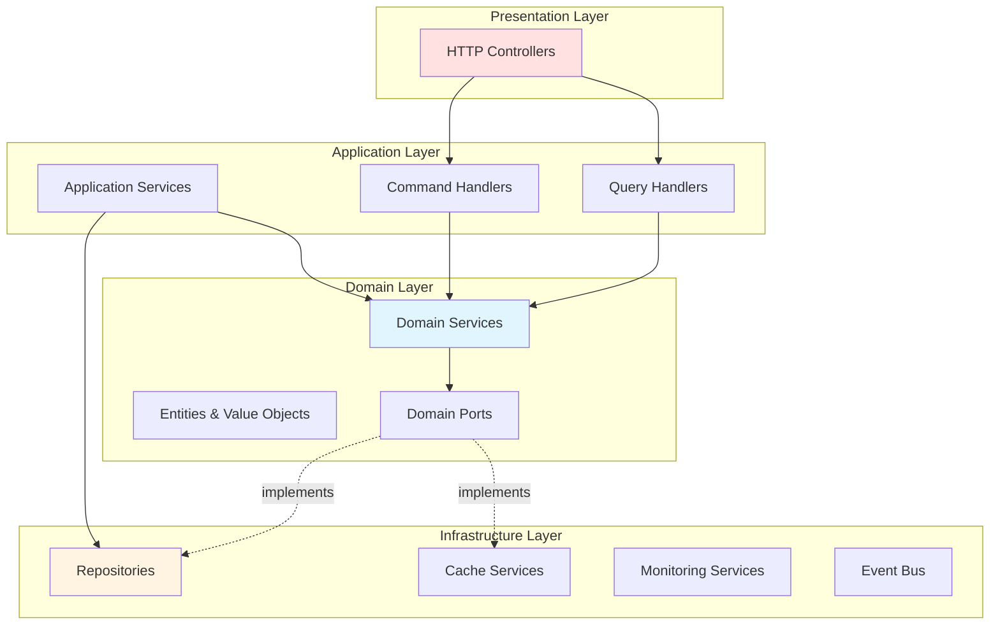
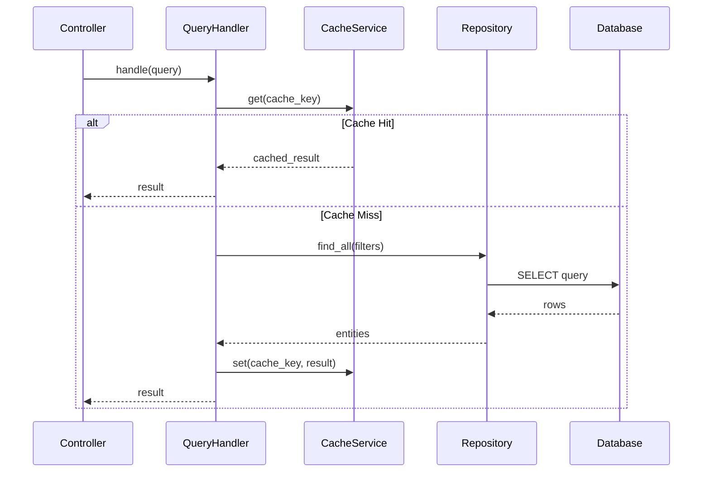
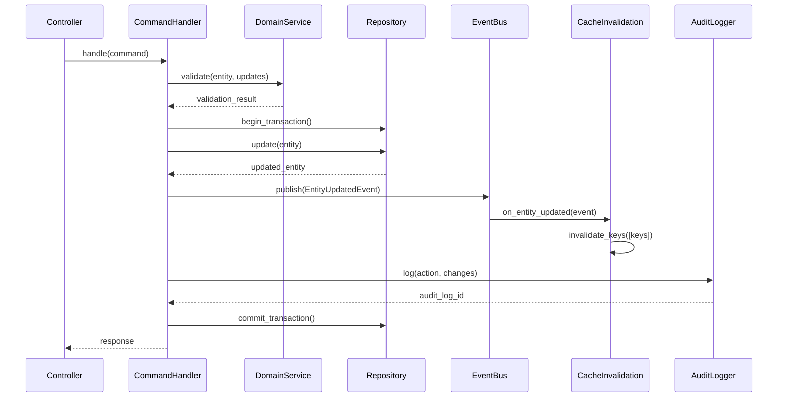
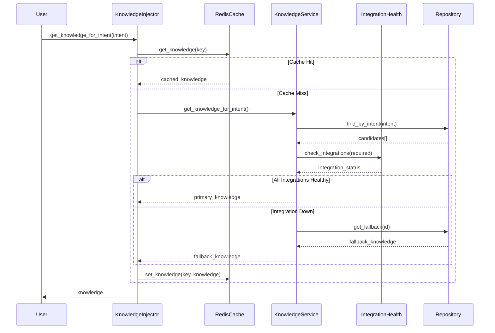

# AI Brain Module: Services Architecture Documentation

**Version:** 1.0.0
**Date:** 2026-01-26
**Status:** Design Specification
**Author:** Backend Architect (Claude Sonnet 4.5)

---

## Table of Contents

1. [Executive Summary](#executive-summary)
2. [Architecture Overview](#architecture-overview)
3. [Domain Services](#domain-services)
4. [Application Services](#application-services)
5. [Infrastructure Services](#infrastructure-services)
6. [Service Integration Patterns](#service-integration-patterns)
7. [Dependency Injection Configuration](#dependency-injection-configuration)
8. [Testing Strategy](#testing-strategy)
9. [Performance Optimization](#performance-optimization)
10. [Monitoring & Observability](#monitoring--observability)

---

## Executive Summary

### Purpose

This document provides comprehensive specifications for all services involved in the AI Brain module, organized by architectural layer (Domain, Application, Infrastructure) following hexagonal architecture principles. These services enable dynamic, configuration-driven agent behavior with high performance and maintainability.

### Service Categories

**Domain Services (8 services)**
- Business logic for knowledge, configuration, and integration management
- Pure domain operations with no external dependencies
- Framework-independent, highly testable

**Application Services (15 handlers + 5 services)**
- Query handlers for read operations (CQRS read side)
- Command handlers for write operations (CQRS write side)
- Cross-cutting concerns (authorization, caching, auditing)

**Infrastructure Services (12 services)**
- Repository implementations (PostgreSQL adapters)
- Cache management (Redis adapters)
- External integrations (health monitoring, event publishing)

### Key Design Principles

1. **Hexagonal Architecture**: Strict layer separation with dependency inversion
2. **CQRS Pattern**: Separate read/write operations for optimal performance
3. **Port-Adapter Pattern**: Domain ports implemented by infrastructure adapters
4. **Single Responsibility**: Each service has one clear purpose
5. **Dependency Injection**: Dishka framework for IoC container management

---

## Architecture Overview

### Layer Dependency Flow



### Service Communication Patterns

#### 1. Query Flow (Read Operations)
```
HTTP Controller → Query Handler → Domain Service → Repository → Database/Cache → Response
```

#### 2. Command Flow (Write Operations)
```
HTTP Controller → Command Handler → Domain Service → Repository → Database
                                  ↓
                              Event Bus → Cache Invalidation
                                  ↓
                              Audit Logger
```

#### 3. Knowledge Retrieval Flow
```
User Request → Knowledge Injector → Redis Cache (hit?) → Return
                                  ↓ (miss)
                              Knowledge Repository → Database
                                  ↓
                              Cache Warmer → Redis → Return
```

---

## Domain Services

Domain services contain pure business logic with no infrastructure dependencies. They operate on domain entities and value objects, enforcing business rules and invariants.

---

### 1. KnowledgeService

**Purpose**: Manages business logic for agent knowledge selection, filtering, and composition.

**Location**: `src/app/domain/services/ai_brain/knowledge_service.py`

#### Responsibilities

- Select appropriate knowledge based on user context and intent
- Apply integration dependency filters
- Handle fallback knowledge selection
- Compose hierarchical knowledge structures
- Validate knowledge integrity

#### Dependencies

- `KnowledgeRepository` (port)
- `IntegrationStatusProvider` (port)
- `UserContextProvider` (port)

#### Key Methods

```python
from typing import Optional, List
from app.domain.entities.ai_brain.knowledge import Knowledge
from app.domain.value_objects.user_context import UserContext

class KnowledgeService:
    """Domain service for knowledge management business logic"""

    def __init__(
        self,
        knowledge_repository: KnowledgeRepository,
        integration_status_provider: IntegrationStatusProvider,
        user_context_provider: UserContextProvider
    ):
        self._knowledge_repo = knowledge_repository
        self._integration_status = integration_status_provider
        self._user_context = user_context_provider

    async def get_knowledge_for_intent(
        self,
        intent: str,
        user_id: str,
        language: str = "en"
    ) -> Optional[Knowledge]:
        """
        Get knowledge for specific intent with integration filtering.

        Business Rules:
        1. Knowledge must be enabled
        2. User must have access (guest/authenticated/premium)
        3. Required integrations must be healthy
        4. If integration unavailable, use fallback knowledge
        5. Respect priority ordering

        Args:
            intent: Detected intent (e.g., 'SWAP', 'HUNTER_SENTIMENT')
            user_id: User identifier for context
            language: Language code (default: 'en')

        Returns:
            Knowledge entity or None if no matching knowledge
        """
        # Get user context
        user_context = await self._user_context.get_context(user_id)

        # Query knowledge entries for intent
        candidates = await self._knowledge_repo.find_by_intent(
            intent=intent,
            user_type=user_context.user_type,
            language=language,
            is_enabled=True
        )

        if not candidates:
            return None

        # Filter by integration availability
        filtered = await self._filter_by_integrations(candidates)

        if not filtered:
            # Try fallback knowledge
            return await self._get_fallback_knowledge(candidates[0])

        # Return highest priority
        return filtered[0]

    async def _filter_by_integrations(
        self,
        knowledge_list: List[Knowledge]
    ) -> List[Knowledge]:
        """
        Filter knowledge entries by integration availability.

        Business Rule: Knowledge requiring unavailable integrations
        should be excluded.
        """
        filtered = []

        for knowledge in knowledge_list:
            if not knowledge.depends_on_integrations:
                # No integration dependencies
                filtered.append(knowledge)
                continue

            # Check all required integrations
            all_available = True
            for integration_key in knowledge.depends_on_integrations:
                status = await self._integration_status.get_status(
                    integration_key
                )
                if not status.is_healthy:
                    all_available = False
                    break

            if all_available:
                filtered.append(knowledge)

        return filtered

    async def _get_fallback_knowledge(
        self,
        primary_knowledge: Knowledge
    ) -> Optional[Knowledge]:
        """
        Get fallback knowledge when primary knowledge unavailable.

        Business Rule: Use fallback_knowledge_id if primary requires
        unavailable integration.
        """
        if not primary_knowledge.fallback_knowledge_id:
            return None

        fallback = await self._knowledge_repo.get_by_id(
            primary_knowledge.fallback_knowledge_id
        )

        # Recursively check fallback integrations
        if fallback and fallback.depends_on_integrations:
            filtered = await self._filter_by_integrations([fallback])
            return filtered[0] if filtered else None

        return fallback

    async def validate_knowledge_integrity(
        self,
        knowledge: Knowledge
    ) -> List[str]:
        """
        Validate knowledge entry for integrity issues.

        Returns:
            List of validation errors (empty if valid)
        """
        errors = []

        # Check content is valid JSON
        if not knowledge.content:
            errors.append("content cannot be empty")

        # Check agent types exist
        for agent_type in knowledge.agent_types:
            exists = await self._agent_config_exists(agent_type)
            if not exists:
                errors.append(f"agent_type '{agent_type}' does not exist")

        # Check integration keys exist
        for integration_key in knowledge.depends_on_integrations:
            exists = await self._integration_exists(integration_key)
            if not exists:
                errors.append(
                    f"integration '{integration_key}' does not exist"
                )

        # Check fallback knowledge exists
        if knowledge.fallback_knowledge_id:
            fallback = await self._knowledge_repo.get_by_id(
                knowledge.fallback_knowledge_id
            )
            if not fallback:
                errors.append("fallback_knowledge_id references non-existent knowledge")

        # Check for circular fallback references
        if await self._has_circular_fallback(knowledge):
            errors.append("circular fallback reference detected")

        return errors

    async def compose_hierarchical_knowledge(
        self,
        parent_knowledge_id: str
    ) -> dict:
        """
        Compose hierarchical knowledge tree.

        Business Rule: Parent knowledge includes all children ordered
        by display_order.
        """
        parent = await self._knowledge_repo.get_by_id(parent_knowledge_id)
        if not parent:
            return {}

        children = await self._knowledge_repo.find_by_parent(
            parent_knowledge_id,
            order_by="display_order"
        )

        return {
            "parent": parent.to_dict(),
            "children": [child.to_dict() for child in children]
        }
```

#### Integration Points

- **KnowledgeRepository**: Database queries for knowledge entries
- **IntegrationStatusProvider**: Real-time integration health status
- **UserContextProvider**: User context for access control

#### Business Rules Enforced

1. Knowledge selection respects integration availability
2. Fallback knowledge used when primary unavailable
3. User type access control (guest/authenticated/premium)
4. Priority-based knowledge ordering
5. Circular fallback detection

---

### 2. ConfigurationService

**Purpose**: Manages agent configuration business logic including validation, dependency checking, and version control.

**Location**: `src/app/domain/services/ai_brain/configuration_service.py`

#### Responsibilities

- Validate agent configuration changes
- Check dependency conflicts before updates
- Manage configuration versioning
- Generate configuration hashes for change detection
- Enforce configuration business rules

#### Key Methods

```python
from app.domain.entities.ai_brain.agent_configuration import AgentConfiguration
from app.domain.exceptions.ai_brain import DependencyConflictError

class ConfigurationService:
    """Domain service for agent configuration management"""

    def __init__(
        self,
        agent_config_repository: AgentConfigRepository
    ):
        self._agent_config_repo = agent_config_repository

    async def validate_configuration_update(
        self,
        agent_type: str,
        updates: dict
    ) -> List[str]:
        """
        Validate configuration updates against business rules.

        Business Rules:
        1. temperature must be 0.0 ≤ T ≤ 2.0
        2. max_tokens must be > 0 and ≤ 100000
        3. fallback_agent must exist and not create circular dependency
        4. depends_on_agents must all exist
        5. depends_on_integrations must all exist

        Returns:
            List of validation errors (empty if valid)
        """
        errors = []

        # Validate temperature
        if "temperature" in updates:
            temp = updates["temperature"]
            if not (0.0 <= temp <= 2.0):
                errors.append(
                    f"temperature must be between 0.0 and 2.0, got {temp}"
                )

        # Validate max_tokens
        if "max_tokens" in updates:
            tokens = updates["max_tokens"]
            if not (1 <= tokens <= 100000):
                errors.append(
                    f"max_tokens must be between 1 and 100000, got {tokens}"
                )

        # Validate fallback_agent
        if "fallback_agent" in updates:
            fallback = updates["fallback_agent"]
            if fallback:
                exists = await self._agent_config_repo.exists(fallback)
                if not exists:
                    errors.append(f"fallback_agent '{fallback}' does not exist")

                # Check for circular fallback
                if await self._creates_circular_fallback(agent_type, fallback):
                    errors.append(
                        f"fallback to '{fallback}' creates circular dependency"
                    )

        # Validate depends_on_agents
        if "depends_on_agents" in updates:
            for dep_agent in updates["depends_on_agents"]:
                exists = await self._agent_config_repo.exists(dep_agent)
                if not exists:
                    errors.append(f"depends_on_agents: '{dep_agent}' does not exist")

        return errors

    async def check_disable_conflicts(
        self,
        agent_type: str
    ) -> List[str]:
        """
        Check if disabling agent would create conflicts.

        Business Rule: Cannot disable agent if other enabled agents
        depend on it (unless force=true).

        Returns:
            List of dependent agent types (empty if safe to disable)
        """
        # Find all agents that depend on this one
        dependents = await self._agent_config_repo.find_dependents(agent_type)

        # Filter to only enabled dependents
        enabled_dependents = [
            dep.agent_type for dep in dependents if dep.is_enabled
        ]

        return enabled_dependents

    async def calculate_configuration_hash(
        self,
        config: AgentConfiguration
    ) -> str:
        """
        Calculate SHA-256 hash of configuration for change detection.

        Hash includes:
        - model_name, temperature, max_tokens
        - is_enabled, is_available_for_*
        - depends_on_agents, depends_on_integrations
        """
        import hashlib
        import json

        hash_data = {
            "model_name": config.model_name,
            "temperature": config.temperature,
            "max_tokens": config.max_tokens,
            "is_enabled": config.is_enabled,
            "is_available_for_guests": config.is_available_for_guests,
            "is_available_for_authenticated": config.is_available_for_authenticated,
            "is_available_for_premium": config.is_available_for_premium,
            "depends_on_agents": sorted(config.depends_on_agents),
            "depends_on_integrations": sorted(config.depends_on_integrations)
        }

        hash_string = json.dumps(hash_data, sort_keys=True)
        return hashlib.sha256(hash_string.encode()).hexdigest()

    async def prepare_configuration_update(
        self,
        agent_type: str,
        updates: dict
    ) -> AgentConfiguration:
        """
        Prepare configuration update with version increment and hash.

        Business Flow:
        1. Get current configuration
        2. Apply updates
        3. Increment version
        4. Generate new hash
        5. Return updated configuration
        """
        current = await self._agent_config_repo.get_by_agent_type(agent_type)
        if not current:
            raise AgentConfigurationNotFoundError(agent_type)

        # Apply updates
        updated = current.copy(update=updates)

        # Increment version
        updated.version += 1

        # Generate new hash
        updated.configuration_hash = await self.calculate_configuration_hash(
            updated
        )

        return updated

    async def get_agent_dependency_tree(
        self,
        agent_type: str,
        max_depth: int = 5
    ) -> dict:
        """
        Build complete dependency tree for an agent.

        Returns:
            {
                "agent_type": "swap_workflow",
                "depends_on": [
                    {"agent_type": "knowledge", "depth": 1},
                    {"agent_type": "risk_analyzer", "depth": 1}
                ],
                "depended_on_by": [
                    {"agent_type": "lending_workflow", "depth": 1}
                ]
            }
        """
        tree = {
            "agent_type": agent_type,
            "depends_on": [],
            "depended_on_by": []
        }

        # Build "depends on" tree
        await self._build_dependency_branch(
            agent_type,
            tree["depends_on"],
            depth=1,
            max_depth=max_depth
        )

        # Build "depended on by" tree
        dependents = await self._agent_config_repo.find_dependents(agent_type)
        for dep in dependents:
            tree["depended_on_by"].append({
                "agent_type": dep.agent_type,
                "depth": 1
            })

        return tree
```

#### Business Rules Enforced

1. Configuration parameter validation (temperature, max_tokens)
2. Dependency conflict detection
3. Circular fallback prevention
4. Version control and change tracking
5. Dependent agent validation

---

### 3. IntegrationHealthService

**Purpose**: Monitors external integration health and manages fallback strategies.

**Location**: `src/app/domain/services/ai_brain/integration_health_service.py`

#### Responsibilities

- Determine integration health status
- Manage circuit breaker state
- Select fallback integrations
- Calculate uptime metrics
- Trigger integration-related cache invalidation

#### Key Methods

```python
from app.domain.value_objects.health_status import HealthStatus
from datetime import datetime, timedelta

class IntegrationHealthService:
    """Domain service for integration health management"""

    def __init__(
        self,
        integration_repository: IntegrationRepository,
        health_check_executor: HealthCheckExecutor
    ):
        self._integration_repo = integration_repository
        self._health_check_executor = health_check_executor

    async def check_integration_health(
        self,
        integration_key: str
    ) -> HealthStatus:
        """
        Perform health check on integration.

        Business Rules:
        1. If circuit breaker open → return DOWN
        2. If response time > timeout → return DOWN
        3. If error rate > 5% → return DEGRADED
        4. Otherwise → return HEALTHY
        """
        integration = await self._integration_repo.get_by_key(integration_key)
        if not integration:
            return HealthStatus.DOWN

        # Check circuit breaker
        circuit_state = await self._get_circuit_breaker_state(integration_key)
        if circuit_state == "open":
            return HealthStatus.DOWN

        # Execute health check
        try:
            result = await self._health_check_executor.execute(
                endpoint=integration.api_endpoint,
                timeout=integration.timeout_seconds
            )

            # Update integration record
            await self._integration_repo.update_health(
                integration_key=integration_key,
                health_status=result.status,
                response_time_ms=result.response_time_ms,
                error=result.error
            )

            return result.status

        except TimeoutError:
            await self._integration_repo.update_health(
                integration_key=integration_key,
                health_status=HealthStatus.DOWN,
                error="Health check timeout"
            )
            return HealthStatus.DOWN

    async def select_fallback_integration(
        self,
        primary_integration_key: str,
        feature: str
    ) -> Optional[str]:
        """
        Select fallback integration for a feature.

        Business Rules:
        1. Fallback must support same feature
        2. Fallback must be healthy
        3. Prefer configured fallback_integration_key
        4. Otherwise, select highest priority healthy integration
        """
        primary = await self._integration_repo.get_by_key(
            primary_integration_key
        )

        if not primary:
            return None

        # Check configured fallback
        if primary.fallback_integration_key:
            fallback = await self._integration_repo.get_by_key(
                primary.fallback_integration_key
            )
            if fallback and fallback.is_enabled:
                status = await self.check_integration_health(
                    fallback.integration_key
                )
                if status == HealthStatus.HEALTHY:
                    return fallback.integration_key

        # Find alternative integrations for feature
        alternatives = await self._integration_repo.find_by_feature(
            feature=feature,
            is_enabled=True
        )

        # Filter to healthy integrations
        for alt in alternatives:
            if alt.integration_key == primary_integration_key:
                continue

            status = await self.check_integration_health(alt.integration_key)
            if status == HealthStatus.HEALTHY:
                return alt.integration_key

        return None

    async def calculate_uptime_percentage(
        self,
        integration_key: str,
        time_range_hours: int = 24
    ) -> float:
        """
        Calculate integration uptime percentage.

        Business Rule: Uptime = (healthy_checks / total_checks) * 100
        """
        since = datetime.utcnow() - timedelta(hours=time_range_hours)

        health_history = await self._integration_repo.get_health_history(
            integration_key=integration_key,
            since=since
        )

        if not health_history:
            return 0.0

        healthy_count = sum(
            1 for check in health_history
            if check.health_status == HealthStatus.HEALTHY
        )

        uptime = (healthy_count / len(health_history)) * 100
        return round(uptime, 2)

    async def get_affected_features(
        self,
        integration_key: str
    ) -> List[str]:
        """
        Get list of features affected by integration.

        Business Rule: Return features that depend on this integration.
        """
        integration = await self._integration_repo.get_by_key(integration_key)
        if not integration:
            return []

        return integration.impacts_features

    async def trigger_integration_failure_cascade(
        self,
        integration_key: str
    ):
        """
        Handle integration failure cascade.

        Business Flow:
        1. Mark integration as DOWN
        2. Invalidate affected knowledge cache
        3. Notify affected agents
        4. Activate fallback integrations
        """
        # Mark as DOWN
        await self._integration_repo.update_health(
            integration_key=integration_key,
            health_status=HealthStatus.DOWN
        )

        # Get affected features and agents
        integration = await self._integration_repo.get_by_key(integration_key)
        affected_features = integration.impacts_features
        affected_agents = integration.impacts_agents

        # Invalidate knowledge cache for affected features
        # (This will be handled by cache service)

        # Publish integration failure event
        await self._event_bus.publish(
            IntegrationFailureEvent(
                integration_key=integration_key,
                affected_features=affected_features,
                affected_agents=affected_agents
            )
        )
```

#### Business Rules Enforced

1. Health status determination (HEALTHY/DEGRADED/DOWN)
2. Circuit breaker state management
3. Fallback integration selection
4. Uptime calculation methodology
5. Failure cascade handling

---

### 4. PromptVersioningService

**Purpose**: Manages prompt versioning, A/B testing, and performance tracking.

**Location**: `src/app/domain/services/ai_brain/prompt_versioning_service.py`

#### Responsibilities

- Create new prompt versions
- Activate/deactivate prompts
- Manage A/B test configurations
- Track prompt performance metrics
- Determine A/B test winners

#### Key Methods

```python
class PromptVersioningService:
    """Domain service for prompt versioning and A/B testing"""

    async def create_prompt_version(
        self,
        agent_type: str,
        prompt_content: str,
        prompt_type: str,
        user_type: Optional[str] = None,
        variant_name: str = "default"
    ) -> Prompt:
        """
        Create new prompt version.

        Business Rules:
        1. Auto-increment version number
        2. New prompts start inactive (traffic_percentage=0)
        3. Estimate token count
        4. Generate compressed version if content > 1000 chars
        """
        # Get current max version
        current_prompts = await self._prompt_repo.find_by_agent(
            agent_type=agent_type,
            prompt_type=prompt_type,
            user_type=user_type
        )

        max_version = max([p.version for p in current_prompts]) if current_prompts else 0

        # Estimate tokens
        estimated_tokens = await self._token_counter.estimate(prompt_content)

        # Generate compressed version if needed
        compressed = None
        if len(prompt_content) > 1000:
            compressed = await self._prompt_compressor.compress(prompt_content)

        # Create prompt
        prompt = Prompt(
            agent_type=agent_type,
            prompt_type=prompt_type,
            prompt_content=prompt_content,
            prompt_content_compressed=compressed,
            estimated_tokens=estimated_tokens,
            user_type=user_type,
            version=max_version + 1,
            is_active=False,
            variant_name=variant_name,
            traffic_percentage=0.0
        )

        return prompt

    async def activate_prompt(
        self,
        prompt_id: str,
        traffic_percentage: float = 100.0,
        deactivate_others: bool = True
    ):
        """
        Activate a prompt version.

        Business Rules:
        1. Set is_active=true
        2. Set traffic_percentage
        3. If deactivate_others=true, deactivate other active prompts
        4. Sum of traffic_percentages must equal 100%
        """
        prompt = await self._prompt_repo.get_by_id(prompt_id)
        if not prompt:
            raise PromptNotFoundError(prompt_id)

        # Deactivate others if requested
        if deactivate_others:
            await self._prompt_repo.deactivate_all(
                agent_type=prompt.agent_type,
                prompt_type=prompt.prompt_type,
                user_type=prompt.user_type
            )

        # Activate prompt
        prompt.is_active = True
        prompt.traffic_percentage = traffic_percentage
        prompt.activated_at = datetime.utcnow()

        await self._prompt_repo.update(prompt)

    async def start_ab_test(
        self,
        test_name: str,
        agent_type: str,
        prompt_type: str,
        variants: List[dict],
        duration_days: int = 7
    ) -> ABTest:
        """
        Start A/B test with multiple prompt variants.

        Business Rules:
        1. Sum of traffic_percentages must equal 100%
        2. All variants must be for same agent_type and prompt_type
        3. Activate all variant prompts
        4. Track start time and end time

        Args:
            variants: [
                {"prompt_id": "uuid-1", "traffic_percentage": 50.0},
                {"prompt_id": "uuid-2", "traffic_percentage": 30.0},
                {"prompt_id": "uuid-3", "traffic_percentage": 20.0}
            ]
        """
        # Validate traffic percentages sum to 100
        total_traffic = sum(v["traffic_percentage"] for v in variants)
        if abs(total_traffic - 100.0) > 0.01:
            raise ValidationError(
                f"Traffic percentages must sum to 100%, got {total_traffic}"
            )

        # Validate all prompts exist and are for same agent
        prompts = []
        for variant in variants:
            prompt = await self._prompt_repo.get_by_id(variant["prompt_id"])
            if not prompt:
                raise PromptNotFoundError(variant["prompt_id"])
            if prompt.agent_type != agent_type:
                raise ValidationError(
                    f"Prompt {variant['prompt_id']} is not for agent {agent_type}"
                )
            prompts.append(prompt)

        # Deactivate existing active prompts
        await self._prompt_repo.deactivate_all(
            agent_type=agent_type,
            prompt_type=prompt_type
        )

        # Activate all variants
        for i, variant in enumerate(variants):
            prompt = prompts[i]
            prompt.is_active = True
            prompt.traffic_percentage = variant["traffic_percentage"]
            prompt.activated_at = datetime.utcnow()
            await self._prompt_repo.update(prompt)

        # Create A/B test record
        ab_test = ABTest(
            test_name=test_name,
            agent_type=agent_type,
            prompt_type=prompt_type,
            variant_prompt_ids=[v["prompt_id"] for v in variants],
            traffic_percentages=[v["traffic_percentage"] for v in variants],
            started_at=datetime.utcnow(),
            ends_at=datetime.utcnow() + timedelta(days=duration_days),
            status="running"
        )

        return ab_test

    async def determine_ab_test_winner(
        self,
        ab_test_id: str,
        success_metric: str = "user_satisfaction_score"
    ) -> str:
        """
        Determine A/B test winner based on success metric.

        Business Rules:
        1. Compare variants on success metric
        2. Require minimum sample size (1000 uses per variant)
        3. Require statistical significance (p < 0.05)

        Returns:
            prompt_id of winning variant
        """
        ab_test = await self._ab_test_repo.get_by_id(ab_test_id)
        if not ab_test:
            raise ABTestNotFoundError(ab_test_id)

        # Get performance metrics for each variant
        variant_metrics = []
        for prompt_id in ab_test.variant_prompt_ids:
            prompt = await self._prompt_repo.get_by_id(prompt_id)
            metrics = await self._get_prompt_metrics(prompt_id)

            variant_metrics.append({
                "prompt_id": prompt_id,
                "variant_name": prompt.variant_name,
                "metric_value": getattr(metrics, success_metric),
                "sample_size": metrics.total_uses
            })

        # Check minimum sample size
        insufficient_samples = [
            v for v in variant_metrics if v["sample_size"] < 1000
        ]
        if insufficient_samples:
            raise InsufficientSampleSizeError(
                f"Variants {insufficient_samples} have < 1000 samples"
            )

        # Find highest performing variant
        winner = max(variant_metrics, key=lambda v: v["metric_value"])

        # Check statistical significance (simplified)
        # In production, use proper statistical test (t-test, chi-square, etc.)
        second_best = sorted(
            variant_metrics,
            key=lambda v: v["metric_value"],
            reverse=True
        )[1]

        improvement = (
            (winner["metric_value"] - second_best["metric_value"])
            / second_best["metric_value"]
        ) * 100

        if improvement < 5.0:  # < 5% improvement
            raise InsufficientImprovementError(
                f"Winner only {improvement:.1f}% better than second best"
            )

        return winner["prompt_id"]
```

#### Business Rules Enforced

1. Version auto-increment
2. A/B test traffic percentage validation (sum to 100%)
3. Minimum sample size for statistical significance
4. Token estimation and compression
5. Winner determination with significance testing

---

### 5. CacheInvalidationService

**Purpose**: Manages cache invalidation strategies and rules.

**Location**: `src/app/domain/services/ai_brain/cache_invalidation_service.py`

#### Responsibilities

- Determine what cache keys to invalidate on configuration changes
- Calculate cache TTLs based on data volatility
- Manage cache warming strategies
- Track cache invalidation events

#### Key Methods

```python
class CacheInvalidationService:
    """Domain service for cache invalidation logic"""

    async def get_invalidation_keys_for_agent_update(
        self,
        agent_type: str,
        changes: dict
    ) -> List[str]:
        """
        Determine cache keys to invalidate when agent config changes.

        Business Rules:
        1. Always invalidate agent config cache
        2. If depends_on_integrations changed, invalidate knowledge cache
        3. If is_enabled changed, invalidate supervisor cache
        """
        keys_to_invalidate = [
            f"ai_brain:config:agent:{agent_type}"
        ]

        # If integration dependencies changed
        if "depends_on_integrations" in changes:
            keys_to_invalidate.append(f"ai_brain:knowledge:*:{agent_type}:*")

        # If enabled status changed
        if "is_enabled" in changes:
            keys_to_invalidate.append("ai_brain:supervisor:*:config")

        return keys_to_invalidate

    async def get_invalidation_keys_for_knowledge_update(
        self,
        knowledge_key: str,
        user_type: Optional[str],
        language: str
    ) -> List[str]:
        """
        Determine cache keys to invalidate when knowledge changes.
        """
        if user_type:
            return [f"ai_brain:knowledge:{knowledge_key}:{user_type}:{language}"]
        else:
            # Invalidate for all user types
            return [
                f"ai_brain:knowledge:{knowledge_key}:guest:{language}",
                f"ai_brain:knowledge:{knowledge_key}:authenticated:{language}",
                f"ai_brain:knowledge:{knowledge_key}:premium:{language}"
            ]

    async def calculate_optimal_ttl(
        self,
        cache_type: str,
        data_volatility: str = "medium"
    ) -> int:
        """
        Calculate optimal TTL based on cache type and data volatility.

        Business Rules:
        - agent_config: 2 hours (low volatility)
        - knowledge: 1 hour (medium volatility)
        - integration_status: 5 minutes (high volatility)
        - user_context: 30 minutes (medium volatility)

        Returns:
            TTL in seconds
        """
        base_ttls = {
            "agent_config": 7200,      # 2 hours
            "knowledge": 3600,          # 1 hour
            "integration_status": 300,  # 5 minutes
            "user_context": 1800        # 30 minutes
        }

        base_ttl = base_ttls.get(cache_type, 3600)

        # Adjust for volatility
        volatility_multipliers = {
            "low": 2.0,
            "medium": 1.0,
            "high": 0.5
        }

        multiplier = volatility_multipliers.get(data_volatility, 1.0)
        return int(base_ttl * multiplier)

    async def should_warm_cache_immediately(
        self,
        cache_type: str,
        priority: int
    ) -> bool:
        """
        Determine if cache should be warmed immediately after invalidation.

        Business Rules:
        1. High priority data (priority > 200) → warm immediately
        2. Frequently accessed data (access_count > 10000) → warm immediately
        3. Agent configs → always warm immediately
        4. Integration status → don't warm (will be fetched on next check)
        """
        if cache_type == "agent_config":
            return True

        if cache_type == "integration_status":
            return False

        if priority > 200:
            return True

        return False
```

---

## Application Services

Application services orchestrate domain logic, implement CQRS handlers, and manage cross-cutting concerns.

---

### Query Handlers (Read Side)

#### 1. GetAgentConfigurationsHandler

**Purpose**: List agent configurations with filtering.

**Location**: `src/app/application/ai_brain/queries/get_agent_configurations.py`

```python
@dataclass
class GetAgentConfigurationsQuery:
    category: Optional[str] = None
    is_enabled: Optional[bool] = None
    depends_on_integration: Optional[str] = None
    limit: int = 100
    offset: int = 0
    sort_by: str = "priority"
    sort_order: str = "desc"

class GetAgentConfigurationsHandler:
    """Query handler for listing agent configurations"""

    def __init__(
        self,
        agent_config_repo: AgentConfigRepository,
        cache_service: CacheService
    ):
        self._repo = agent_config_repo
        self._cache = cache_service

    async def handle(self, query: GetAgentConfigurationsQuery) -> dict:
        """Execute query with caching"""

        # Generate cache key
        cache_key = self._generate_cache_key(query)

        # Check cache
        cached = await self._cache.get(cache_key)
        if cached:
            return cached

        # Query database
        agents = await self._repo.find_all(
            category=query.category,
            is_enabled=query.is_enabled,
            depends_on_integration=query.depends_on_integration,
            limit=query.limit,
            offset=query.offset,
            order_by=query.sort_by,
            order_direction=query.sort_order
        )

        total = await self._repo.count(
            category=query.category,
            is_enabled=query.is_enabled,
            depends_on_integration=query.depends_on_integration
        )

        result = {
            "agents": [agent.to_dict() for agent in agents],
            "pagination": {
                "total": total,
                "limit": query.limit,
                "offset": query.offset,
                "has_more": (query.offset + query.limit) < total
            }
        }

        # Cache result
        await self._cache.set(cache_key, result, ttl=300)  # 5 minutes

        return result
```

#### 2. GetAgentConfigurationHandler

**Purpose**: Get detailed agent configuration with dependencies.

**Location**: `src/app/application/ai_brain/queries/get_agent_configuration.py`

(Already detailed in endpoints documentation)

#### 3. GetKnowledgeEntriesHandler

**Purpose**: List knowledge entries with filtering and search.

**Location**: `src/app/application/ai_brain/queries/get_knowledge_entries.py`

```python
@dataclass
class GetKnowledgeEntriesQuery:
    knowledge_category: Optional[str] = None
    agent_type: Optional[str] = None
    intent_pattern: Optional[str] = None
    user_type: Optional[str] = None
    language: str = "en"
    is_enabled: Optional[bool] = True
    search: Optional[str] = None
    limit: int = 50
    offset: int = 0
    sort_by: str = "priority"

class GetKnowledgeEntriesHandler:
    """Query handler for listing knowledge entries"""

    async def handle(self, query: GetKnowledgeEntriesQuery) -> dict:
        """Execute query with full-text search support"""

        # Build query filters
        filters = {
            "knowledge_category": query.knowledge_category,
            "agent_type": query.agent_type,
            "intent_pattern": query.intent_pattern,
            "user_type": query.user_type,
            "language": query.language,
            "is_enabled": query.is_enabled
        }

        # Execute query
        if query.search:
            # Full-text search
            knowledge_list = await self._repo.search(
                query=query.search,
                filters=filters,
                limit=query.limit,
                offset=query.offset,
                order_by=query.sort_by
            )
        else:
            # Regular query
            knowledge_list = await self._repo.find_all(
                filters=filters,
                limit=query.limit,
                offset=query.offset,
                order_by=query.sort_by
            )

        total = await self._repo.count(filters)

        return {
            "knowledge_entries": [k.to_dict() for k in knowledge_list],
            "pagination": {
                "total": total,
                "limit": query.limit,
                "offset": query.offset
            }
        }
```

#### 4. GetCacheStatisticsHandler

**Purpose**: Retrieve comprehensive cache statistics.

**Location**: `src/app/application/ai_brain/queries/get_cache_statistics.py`

```python
class GetCacheStatisticsHandler:
    """Query handler for cache statistics"""

    async def handle(self, query: GetCacheStatisticsQuery) -> dict:
        """Aggregate cache stats from Redis and database"""

        # Get Redis stats
        redis_stats = await self._redis_monitor.get_stats()

        # Get cache metadata from database
        db_stats = await self._cache_metadata_repo.get_aggregated_stats(
            cache_type=query.cache_type,
            time_range=query.time_range
        )

        # Combine stats
        return {
            "overall_stats": {
                "total_cache_keys": redis_stats.total_keys,
                "total_memory_used_mb": redis_stats.memory_used_mb,
                "overall_hit_rate": db_stats.overall_hit_rate,
                "total_hits_24h": db_stats.total_hits,
                "total_misses_24h": db_stats.total_misses
            },
            "by_cache_type": db_stats.by_cache_type,
            "performance_metrics": db_stats.performance_metrics,
            "redis_info": redis_stats.redis_info
        }
```

---

### Command Handlers (Write Side)

#### 5. UpdateAgentConfigurationHandler

**Purpose**: Update agent configuration with validation and cache invalidation.

**Location**: `src/app/application/ai_brain/commands/update_agent_configuration.py`

```python
@dataclass
class UpdateAgentConfigurationCommand:
    agent_id: str
    updates: dict
    update_reason: str
    updated_by: str

class UpdateAgentConfigurationHandler:
    """Command handler for updating agent configuration"""

    def __init__(
        self,
        agent_config_repo: AgentConfigRepository,
        configuration_service: ConfigurationService,
        cache_invalidation_service: CacheInvalidationService,
        audit_logger: AuditLogger,
        event_bus: EventBus
    ):
        self._repo = agent_config_repo
        self._config_service = configuration_service
        self._cache_invalidation = cache_invalidation_service
        self._audit_logger = audit_logger
        self._event_bus = event_bus

    async def handle(self, command: UpdateAgentConfigurationCommand) -> dict:
        """Execute update with full orchestration"""

        # 1. Validate updates
        validation_errors = await self._config_service.validate_configuration_update(
            agent_type=command.agent_id,
            updates=command.updates
        )

        if validation_errors:
            raise ValidationError(validation_errors)

        # 2. Get current configuration
        current = await self._repo.get_by_agent_type(command.agent_id)
        if not current:
            raise AgentConfigurationNotFoundError(command.agent_id)

        # 3. Prepare updated configuration
        updated = await self._config_service.prepare_configuration_update(
            agent_type=command.agent_id,
            updates=command.updates
        )

        # 4. Calculate changes for audit
        changes = self._calculate_changes(current, updated)

        # 5. Begin transaction
        async with self._repo.transaction():
            # Update database
            updated_config = await self._repo.update(
                agent_type=command.agent_id,
                updates=command.updates,
                updated_by=command.updated_by
            )

            # Determine cache keys to invalidate
            invalidation_keys = await self._cache_invalidation.get_invalidation_keys_for_agent_update(
                agent_type=command.agent_id,
                changes=changes
            )

            # Invalidate cache
            await self._cache_invalidation.invalidate_keys(invalidation_keys)

            # Log audit entry
            audit_log_id = await self._audit_logger.log(
                entity_type="agent_configuration",
                entity_id=command.agent_id,
                action="UPDATE",
                user_id=command.updated_by,
                changes=changes,
                reason=command.update_reason
            )

            # Publish event
            await self._event_bus.publish(
                AgentConfigurationUpdatedEvent(
                    agent_type=command.agent_id,
                    changes=changes,
                    updated_by=command.updated_by
                )
            )

        return {
            "success": True,
            "agent": updated_config.to_dict(),
            "changes": changes,
            "cache_invalidated": invalidation_keys,
            "audit_log_id": audit_log_id
        }
```

#### 6. CreateKnowledgeEntryHandler

**Purpose**: Create new knowledge entry with validation.

**Location**: `src/app/application/ai_brain/commands/create_knowledge_entry.py`

```python
@dataclass
class CreateKnowledgeEntryCommand:
    knowledge_key: str
    knowledge_category: str
    agent_types: List[str]
    title: str
    content: dict
    user_type: Optional[str] = None
    language: str = "en"
    depends_on_integrations: List[str] = field(default_factory=list)
    created_by: str = ""

class CreateKnowledgeEntryHandler:
    """Command handler for creating knowledge entry"""

    async def handle(self, command: CreateKnowledgeEntryCommand) -> dict:
        """Execute creation with validation"""

        # 1. Validate uniqueness
        existing = await self._repo.get_by_key(
            knowledge_key=command.knowledge_key,
            user_type=command.user_type,
            language=command.language
        )

        if existing:
            raise KnowledgeKeyConflictError(
                f"Knowledge key '{command.knowledge_key}' already exists"
            )

        # 2. Validate references
        validation_errors = await self._knowledge_service.validate_knowledge_integrity(
            Knowledge.from_command(command)
        )

        if validation_errors:
            raise ValidationError(validation_errors)

        # 3. Generate content hash
        content_hash = hashlib.sha256(
            json.dumps(command.content, sort_keys=True).encode()
        ).hexdigest()

        # 4. Create knowledge entity
        knowledge = Knowledge(
            knowledge_key=command.knowledge_key,
            knowledge_category=command.knowledge_category,
            agent_types=command.agent_types,
            title=command.title,
            content=command.content,
            user_type=command.user_type,
            language=command.language,
            depends_on_integrations=command.depends_on_integrations,
            version=1,
            content_hash=content_hash,
            cache_key=f"ai_brain:knowledge:{command.knowledge_key}:*:{command.language}",
            created_by=command.created_by
        )

        # 5. Save to database
        created = await self._repo.create(knowledge)

        # 6. Warm cache immediately
        await self._cache_warmer.warm_knowledge(created)

        # 7. Log audit entry
        audit_log_id = await self._audit_logger.log(
            entity_type="agent_knowledge",
            entity_id=created.knowledge_key,
            action="CREATE",
            user_id=command.created_by,
            changes={"created": created.to_dict()}
        )

        return {
            "success": True,
            "knowledge": created.to_dict(),
            "cache_warmed": True,
            "audit_log_id": audit_log_id
        }
```

---

### Cross-Cutting Application Services

#### 7. AuthorizationService

**Purpose**: Manage authorization for AI Brain admin operations.

**Location**: `src/app/application/ai_brain/services/authorization_service.py`

```python
class AuthorizationService:
    """Service for AI Brain admin authorization"""

    async def ensure_admin_role(self, user_id: str):
        """
        Ensure user has admin role.

        Raises:
            ForbiddenError if user lacks admin role
        """
        user = await self._user_repo.get_by_id(user_id)
        if not user:
            raise UnauthorizedError("User not found")

        if not user.has_role("ADMIN"):
            raise ForbiddenError(
                "Admin role required for this operation",
                required_role="ADMIN",
                user_role=user.role
            )

    async def can_modify_agent_config(
        self,
        user_id: str,
        agent_type: str
    ) -> bool:
        """Check if user can modify specific agent configuration"""
        await self.ensure_admin_role(user_id)
        # Additional permission checks if needed
        return True
```

#### 8. AuditLoggingService

**Purpose**: Centralized audit logging for all AI Brain operations.

**Location**: `src/app/application/ai_brain/services/audit_logging_service.py`

```python
class AuditLoggingService:
    """Service for audit logging"""

    async def log(
        self,
        entity_type: str,
        entity_id: str,
        action: str,
        user_id: str,
        changes: dict,
        reason: Optional[str] = None,
        ip_address: Optional[str] = None
    ) -> str:
        """
        Log audit entry.

        Returns:
            audit_log_id (UUID)
        """
        audit_entry = AuditLog(
            entity_type=entity_type,
            entity_id=entity_id,
            action=action,
            user_id=user_id,
            changes=changes,
            reason=reason,
            ip_address=ip_address,
            created_at=datetime.utcnow()
        )

        audit_log_id = await self._audit_log_repo.create(audit_entry)

        # Also publish audit event
        await self._event_bus.publish(
            AuditLogEvent(
                audit_log_id=audit_log_id,
                entity_type=entity_type,
                action=action,
                user_id=user_id
            )
        )

        return audit_log_id
```

---

## Infrastructure Services

Infrastructure services implement domain ports and provide concrete implementations for external dependencies.

---

### Repository Implementations (SQLAlchemy Adapters)

#### 9. AgentConfigRepositorySQLA

**Purpose**: SQLAlchemy implementation of `AgentConfigRepository` port.

**Location**: `src/app/infrastructure/adapters/ai_brain/agent_config_repository_sqla.py`

(Already detailed in Implementation Guide section)

#### 10. KnowledgeRepositorySQLA

**Purpose**: SQLAlchemy implementation of `KnowledgeRepository` port.

**Location**: `src/app/infrastructure/adapters/ai_brain/knowledge_repository_sqla.py`

```python
class KnowledgeRepositorySQLA(KnowledgeRepository):
    """SQLAlchemy implementation of knowledge repository"""

    async def find_by_intent(
        self,
        intent: str,
        user_type: Optional[str],
        language: str,
        is_enabled: bool = True
    ) -> List[Knowledge]:
        """Find knowledge entries matching intent"""

        query = """
            SELECT *
            FROM agent_knowledge
            WHERE :intent = ANY(intent_patterns)
              AND is_enabled = :is_enabled
              AND language = :language
              AND (user_type IS NULL OR user_type = :user_type)
            ORDER BY priority DESC
        """

        results = await self._db.fetch_all(query, {
            "intent": intent,
            "is_enabled": is_enabled,
            "language": language,
            "user_type": user_type
        })

        return [Knowledge.from_db_row(row) for row in results]

    async def search(
        self,
        query: str,
        filters: dict,
        limit: int,
        offset: int,
        order_by: str = "priority"
    ) -> List[Knowledge]:
        """Full-text search on knowledge entries"""

        sql = """
            SELECT *
            FROM agent_knowledge
            WHERE to_tsvector('english', title || ' ' || coalesce(description, ''))
                  @@ plainto_tsquery('english', :query)
              AND is_enabled = :is_enabled
            ORDER BY {order_by} DESC
            LIMIT :limit OFFSET :offset
        """.format(order_by=order_by)

        results = await self._db.fetch_all(sql, {
            "query": query,
            "is_enabled": filters.get("is_enabled", True),
            "limit": limit,
            "offset": offset
        })

        return [Knowledge.from_db_row(row) for row in results]

    async def update_access_metrics(
        self,
        knowledge_id: str,
        retrieval_time_ms: int
    ):
        """Update knowledge access metrics"""

        await self._db.execute("""
            UPDATE agent_knowledge
            SET access_count = access_count + 1,
                last_accessed_at = CURRENT_TIMESTAMP,
                avg_retrieval_time_ms = (
                    COALESCE(avg_retrieval_time_ms, 0) * access_count + :retrieval_time_ms
                ) / (access_count + 1)
            WHERE id = :knowledge_id
        """, {
            "knowledge_id": knowledge_id,
            "retrieval_time_ms": retrieval_time_ms
        })
```

#### 11. IntegrationRepositorySQLA

**Purpose**: SQLAlchemy implementation of `IntegrationRepository` port.

**Location**: `src/app/infrastructure/adapters/ai_brain/integration_repository_sqla.py`

```python
class IntegrationRepositorySQLA(IntegrationRepository):
    """SQLAlchemy implementation of integration repository"""

    async def update_health(
        self,
        integration_key: str,
        health_status: HealthStatus,
        response_time_ms: Optional[int] = None,
        error: Optional[str] = None
    ):
        """Update integration health status"""

        await self._db.execute("""
            UPDATE integration_configurations
            SET health_status = :health_status,
                last_health_check_at = CURRENT_TIMESTAMP,
                health_check_error = :error,
                avg_response_time_ms = CASE
                    WHEN :response_time_ms IS NOT NULL
                    THEN :response_time_ms
                    ELSE avg_response_time_ms
                END
            WHERE integration_key = :integration_key
        """, {
            "integration_key": integration_key,
            "health_status": health_status.value,
            "response_time_ms": response_time_ms,
            "error": error
        })

    async def find_by_feature(
        self,
        feature: str,
        is_enabled: bool = True
    ) -> List[Integration]:
        """Find integrations that support a feature"""

        query = """
            SELECT *
            FROM integration_configurations
            WHERE :feature = ANY(impacts_features)
              AND is_enabled = :is_enabled
            ORDER BY priority DESC
        """

        results = await self._db.fetch_all(query, {
            "feature": feature,
            "is_enabled": is_enabled
        })

        return [Integration.from_db_row(row) for row in results]
```

---

### Cache Services (Redis Adapters)

#### 12. RedisKnowledgeCache

**Purpose**: Redis cache layer for knowledge entries.

**Location**: `src/app/infrastructure/cache/redis_knowledge_cache.py`

```python
class RedisKnowledgeCache:
    """Redis cache implementation for knowledge entries"""

    def __init__(self, redis: Redis):
        self._redis = redis

    async def get_knowledge(
        self,
        knowledge_key: str,
        user_type: str,
        language: str
    ) -> Optional[dict]:
        """Get knowledge from cache"""

        cache_key = f"ai_brain:knowledge:{knowledge_key}:{user_type}:{language}"

        cached = await self._redis.hgetall(cache_key)
        if not cached:
            return None

        # Update cache metadata
        await self._update_cache_hit(cache_key)

        return json.loads(cached["content"])

    async def set_knowledge(
        self,
        knowledge_key: str,
        user_type: str,
        language: str,
        content: dict,
        ttl: int = 3600
    ):
        """Store knowledge in cache"""

        cache_key = f"ai_brain:knowledge:{knowledge_key}:{user_type}:{language}"

        await self._redis.hset(cache_key, mapping={
            "content": json.dumps(content),
            "cached_at": datetime.utcnow().isoformat()
        })

        await self._redis.expire(cache_key, ttl)

        # Record cache warming
        await self._update_cache_metadata(cache_key, warmed=True)

    async def invalidate_knowledge(
        self,
        knowledge_key: str,
        user_type: Optional[str] = None,
        language: str = "en"
    ):
        """Invalidate knowledge cache"""

        if user_type:
            keys = [f"ai_brain:knowledge:{knowledge_key}:{user_type}:{language}"]
        else:
            # Invalidate all user types
            pattern = f"ai_brain:knowledge:{knowledge_key}:*:{language}"
            keys = await self._redis.keys(pattern)

        if keys:
            await self._redis.delete(*keys)

            # Update metadata
            for key in keys:
                await self._update_cache_metadata(
                    key,
                    invalidated=True,
                    reason="knowledge_updated"
                )

    async def _update_cache_hit(self, cache_key: str):
        """Update cache hit count in metadata"""

        await self._db.execute("""
            UPDATE knowledge_cache_metadata
            SET hit_count = hit_count + 1,
                last_hit_at = CURRENT_TIMESTAMP
            WHERE cache_key = :cache_key
        """, {"cache_key": cache_key})

    async def _update_cache_metadata(
        self,
        cache_key: str,
        warmed: bool = False,
        invalidated: bool = False,
        reason: Optional[str] = None
    ):
        """Update cache metadata in database"""

        if warmed:
            await self._db.execute("""
                UPDATE knowledge_cache_metadata
                SET last_warmed_at = CURRENT_TIMESTAMP
                WHERE cache_key = :cache_key
            """, {"cache_key": cache_key})

        if invalidated:
            await self._db.execute("""
                UPDATE knowledge_cache_metadata
                SET invalidated_at = CURRENT_TIMESTAMP,
                    invalidation_reason = :reason
                WHERE cache_key = :cache_key
            """, {"cache_key": cache_key, "reason": reason})
```

#### 13. RedisCacheWarmer

**Purpose**: Cache warming service for startup and invalidation.

**Location**: `src/app/infrastructure/cache/redis_cache_warmer.py`

```python
class RedisCacheWarmer:
    """Service for warming Redis cache"""

    async def warm_on_startup(self):
        """Warm cache on application startup"""

        # 1. Load all enabled agent configurations
        agents = await self._agent_config_repo.find_all(is_enabled=True)
        for agent in agents:
            await self._redis_cache.set_agent_config(agent)

        # 2. Load top 100 most accessed knowledge entries
        top_knowledge = await self._knowledge_repo.get_top_accessed(limit=100)
        for knowledge in top_knowledge:
            await self._redis_knowledge_cache.set_knowledge(
                knowledge_key=knowledge.knowledge_key,
                user_type=knowledge.user_type or "authenticated",
                language=knowledge.language,
                content=knowledge.content
            )

        # 3. Load all integration statuses
        integrations = await self._integration_repo.find_all(is_enabled=True)
        for integration in integrations:
            await self._redis_cache.set_integration_status(integration)

        logger.info(
            f"Cache warmed: {len(agents)} agents, "
            f"{len(top_knowledge)} knowledge entries, "
            f"{len(integrations)} integrations"
        )

    async def warm_knowledge(self, knowledge: Knowledge):
        """Warm cache for specific knowledge entry"""

        user_types = [knowledge.user_type] if knowledge.user_type else [
            "guest", "authenticated", "premium"
        ]

        for user_type in user_types:
            await self._redis_knowledge_cache.set_knowledge(
                knowledge_key=knowledge.knowledge_key,
                user_type=user_type,
                language=knowledge.language,
                content=knowledge.content,
                ttl=knowledge.cache_ttl_seconds
            )
```

---

### Monitoring & Health Services

#### 14. IntegrationHealthChecker

**Purpose**: Execute health checks on external integrations.

**Location**: `src/app/infrastructure/monitoring/integration_health_checker.py`

```python
class IntegrationHealthChecker:
    """Service for checking integration health"""

    async def check_health(
        self,
        integration_key: str
    ) -> HealthCheckResult:
        """Perform health check on integration"""

        integration = await self._integration_repo.get_by_key(integration_key)
        if not integration:
            return HealthCheckResult(
                status=HealthStatus.DOWN,
                error="Integration not found"
            )

        start_time = time.time()

        try:
            # Execute health check based on integration type
            if integration_key == "hyperliquid":
                response = await self._hyperliquid_client.get_spot_meta()
            elif integration_key == "1inch":
                response = await self._oneinch_client.healthcheck()
            elif integration_key == "morpho":
                response = await self._morpho_client.get_vaults()
            else:
                response = await self._generic_health_check(
                    integration.api_endpoint
                )

            response_time_ms = int((time.time() - start_time) * 1000)

            # Update integration health
            await self._integration_repo.update_health(
                integration_key=integration_key,
                health_status=HealthStatus.HEALTHY,
                response_time_ms=response_time_ms
            )

            return HealthCheckResult(
                status=HealthStatus.HEALTHY,
                response_time_ms=response_time_ms
            )

        except asyncio.TimeoutError:
            await self._integration_repo.update_health(
                integration_key=integration_key,
                health_status=HealthStatus.DOWN,
                error="Timeout"
            )

            return HealthCheckResult(
                status=HealthStatus.DOWN,
                error="Timeout"
            )

        except Exception as e:
            await self._integration_repo.update_health(
                integration_key=integration_key,
                health_status=HealthStatus.DOWN,
                error=str(e)
            )

            return HealthCheckResult(
                status=HealthStatus.DOWN,
                error=str(e)
            )

    async def check_all_integrations(self):
        """Check health of all enabled integrations"""

        integrations = await self._integration_repo.find_all(is_enabled=True)

        results = []
        for integration in integrations:
            result = await self.check_health(integration.integration_key)
            results.append({
                "integration_key": integration.integration_key,
                "result": result
            })

        return results
```

#### 15. KnowledgeInjector

**Purpose**: Dynamic knowledge injection into LLM prompts (enhanced version).

**Location**: `src/app/infrastructure/adapters/ai_brain/knowledge_injector.py`

```python
class KnowledgeInjector:
    """
    Enhanced knowledge injector using AI Brain database.

    Replaces static JSON file approach with dynamic database queries.
    """

    def __init__(
        self,
        knowledge_service: KnowledgeService,
        redis_knowledge_cache: RedisKnowledgeCache,
        feature_flags_config: FeatureFlagsConfig
    ):
        self._knowledge_service = knowledge_service
        self._cache = redis_knowledge_cache
        self._feature_flags = feature_flags_config

    async def get_knowledge_for_intent(
        self,
        user_query: str,
        detected_intent: str,
        user_id: str,
        language: str = "en"
    ) -> dict:
        """
        Get relevant knowledge from database with caching.

        Replaces static JSON file loading with dynamic database queries.
        """
        # 1. Check Redis cache first
        user_context = await self._user_context_provider.get_context(user_id)
        cached = await self._cache.get_knowledge(
            knowledge_key=detected_intent.lower(),
            user_type=user_context.user_type,
            language=language
        )

        if cached:
            return cached

        # 2. Query knowledge service (includes integration filtering)
        knowledge = await self._knowledge_service.get_knowledge_for_intent(
            intent=detected_intent,
            user_id=user_id,
            language=language
        )

        if not knowledge:
            return {}

        # 3. Cache result
        await self._cache.set_knowledge(
            knowledge_key=knowledge.knowledge_key,
            user_type=user_context.user_type,
            language=language,
            content=knowledge.content,
            ttl=knowledge.cache_ttl_seconds
        )

        return knowledge.content

    async def augment_system_prompt(
        self,
        user_query: str,
        detected_intent: str,
        user_id: str,
        base_system_prompt: Optional[str] = None,
        compression_level: str = "medium"
    ) -> str:
        """
        Create enhanced system prompt with injected knowledge.

        Same interface as original but uses database instead of JSON files.
        """
        knowledge = await self.get_knowledge_for_intent(
            user_query=user_query,
            detected_intent=detected_intent,
            user_id=user_id
        )

        # Apply compression if requested
        if compression_level != "none":
            from app.application.chat.services.knowledge_compressor import compress_knowledge
            compressed_text, estimated_tokens = compress_knowledge(
                knowledge=knowledge,
                intent=detected_intent,
                user_query=user_query,
                level=compression_level
            )
            knowledge_text = compressed_text
        else:
            knowledge_text = self._format_knowledge(knowledge)

        if base_system_prompt is None:
            base_system_prompt = "You are Anvil, a specialized DeFi assistant."

        enhanced_prompt = f"""{base_system_prompt}

━━━━━━━━━━━━━━━━━━━━━━━━━━━━━━━━━━━━━━━━━━━━━━━━━━━━━━━━━━━━━━━━━━
KNOWLEDGE BASE (Use this for accurate, detailed responses)
━━━━━━━━━━━━━━━━━━━━━━━━━━━━━━━━━━━━━━━━━━━━━━━━━━━━━━━━━━━━━━━━━━

{knowledge_text}

━━━━━━━━━━━━━━━━━━━━━━━━━━━━━━━━━━━━━━━━━━━━━━━━━━━━━━━━━━━━━━━━━━
RESPONSE GUIDELINES
━━━━━━━━━━━━━━━━━━━━━━━━━━━━━━━━━━━━━━━━━━━━━━━━━━━━━━━━━━━━━━━━━━

✅ DO:
- Answer based on the knowledge base above
- Be specific with numbers, features, and technical details
- Use examples from the knowledge base

USER QUERY: {user_query}
"""

        return enhanced_prompt
```

---

## Service Integration Patterns

### Pattern 1: Query Flow with Caching



### Pattern 2: Command Flow with Event Sourcing



### Pattern 3: Knowledge Retrieval with Fallback



---

## Dependency Injection Configuration

### Complete Dishka Provider

**Location**: `src/app/setup/ioc/ai_brain.py`

```python
from dishka import Provider, Scope, provide, from_context
from app.domain.services.ai_brain.knowledge_service import KnowledgeService
from app.domain.services.ai_brain.configuration_service import ConfigurationService
from app.domain.services.ai_brain.integration_health_service import IntegrationHealthService
from app.infrastructure.adapters.ai_brain.agent_config_repository_sqla import AgentConfigRepositorySQLA
from app.infrastructure.adapters.ai_brain.knowledge_repository_sqla import KnowledgeRepositorySQLA

class AIBrainProvider(Provider):
    scope = Scope.REQUEST

    # ========================================
    # Domain Services
    # ========================================

    @provide
    async def provide_knowledge_service(
        self,
        knowledge_repo: KnowledgeRepository,
        integration_status_provider: IntegrationStatusProvider,
        user_context_provider: UserContextProvider
    ) -> KnowledgeService:
        return KnowledgeService(
            knowledge_repository=knowledge_repo,
            integration_status_provider=integration_status_provider,
            user_context_provider=user_context_provider
        )

    @provide
    async def provide_configuration_service(
        self,
        agent_config_repo: AgentConfigRepository
    ) -> ConfigurationService:
        return ConfigurationService(
            agent_config_repository=agent_config_repo
        )

    @provide
    async def provide_integration_health_service(
        self,
        integration_repo: IntegrationRepository,
        health_check_executor: HealthCheckExecutor
    ) -> IntegrationHealthService:
        return IntegrationHealthService(
            integration_repository=integration_repo,
            health_check_executor=health_check_executor
        )

    # ========================================
    # Infrastructure Repositories
    # ========================================

    @provide
    async def provide_agent_config_repository(
        self,
        db: AsyncDatabase,
        redis: Redis
    ) -> AgentConfigRepository:
        return AgentConfigRepositorySQLA(db, redis)

    @provide
    async def provide_knowledge_repository(
        self,
        db: AsyncDatabase,
        redis: Redis
    ) -> KnowledgeRepository:
        return KnowledgeRepositorySQLA(db, redis)

    @provide
    async def provide_integration_repository(
        self,
        db: AsyncDatabase
    ) -> IntegrationRepository:
        return IntegrationRepositorySQLA(db)

    # ========================================
    # Query Handlers (CQRS Read Side)
    # ========================================

    @provide
    async def provide_get_agent_configurations_handler(
        self,
        agent_config_repo: AgentConfigRepository,
        cache_service: CacheService
    ) -> GetAgentConfigurationsHandler:
        return GetAgentConfigurationsHandler(agent_config_repo, cache_service)

    @provide
    async def provide_get_agent_configuration_handler(
        self,
        agent_config_repo: AgentConfigRepository,
        prompt_repo: PromptRepository,
        knowledge_repo: KnowledgeRepository
    ) -> GetAgentConfigurationHandler:
        return GetAgentConfigurationHandler(
            agent_config_repo,
            prompt_repo,
            knowledge_repo
        )

    @provide
    async def provide_get_knowledge_entries_handler(
        self,
        knowledge_repo: KnowledgeRepository
    ) -> GetKnowledgeEntriesHandler:
        return GetKnowledgeEntriesHandler(knowledge_repo)

    @provide
    async def provide_get_cache_statistics_handler(
        self,
        redis_monitor: RedisMonitor,
        cache_metadata_repo: CacheMetadataRepository
    ) -> GetCacheStatisticsHandler:
        return GetCacheStatisticsHandler(redis_monitor, cache_metadata_repo)

    # ========================================
    # Command Handlers (CQRS Write Side)
    # ========================================

    @provide
    async def provide_update_agent_configuration_handler(
        self,
        agent_config_repo: AgentConfigRepository,
        configuration_service: ConfigurationService,
        cache_invalidation_service: CacheInvalidationService,
        audit_logger: AuditLogger,
        event_bus: EventBus
    ) -> UpdateAgentConfigurationHandler:
        return UpdateAgentConfigurationHandler(
            agent_config_repo,
            configuration_service,
            cache_invalidation_service,
            audit_logger,
            event_bus
        )

    @provide
    async def provide_create_knowledge_entry_handler(
        self,
        knowledge_repo: KnowledgeRepository,
        knowledge_service: KnowledgeService,
        cache_warmer: RedisCacheWarmer,
        audit_logger: AuditLogger
    ) -> CreateKnowledgeEntryHandler:
        return CreateKnowledgeEntryHandler(
            knowledge_repo,
            knowledge_service,
            cache_warmer,
            audit_logger
        )

    # ========================================
    # Cache Services
    # ========================================

    @provide
    async def provide_redis_knowledge_cache(
        self,
        redis: Redis,
        db: AsyncDatabase
    ) -> RedisKnowledgeCache:
        return RedisKnowledgeCache(redis, db)

    @provide
    async def provide_redis_cache_warmer(
        self,
        agent_config_repo: AgentConfigRepository,
        knowledge_repo: KnowledgeRepository,
        integration_repo: IntegrationRepository,
        redis_cache: RedisCache,
        redis_knowledge_cache: RedisKnowledgeCache
    ) -> RedisCacheWarmer:
        return RedisCacheWarmer(
            agent_config_repo,
            knowledge_repo,
            integration_repo,
            redis_cache,
            redis_knowledge_cache
        )

    # ========================================
    # Cross-Cutting Services
    # ========================================

    @provide
    async def provide_authorization_service(
        self,
        user_repo: UserRepository
    ) -> AuthorizationService:
        return AuthorizationService(user_repo)

    @provide
    async def provide_audit_logging_service(
        self,
        audit_log_repo: AuditLogRepository,
        event_bus: EventBus
    ) -> AuditLoggingService:
        return AuditLoggingService(audit_log_repo, event_bus)

    @provide
    async def provide_cache_invalidation_service(
        self,
        redis: Redis,
        cache_metadata_repo: CacheMetadataRepository
    ) -> CacheInvalidationService:
        return CacheInvalidationService(redis, cache_metadata_repo)

    # ========================================
    # Knowledge Injector (Enhanced)
    # ========================================

    @provide
    async def provide_knowledge_injector(
        self,
        knowledge_service: KnowledgeService,
        redis_knowledge_cache: RedisKnowledgeCache,
        feature_flags_config: FeatureFlagsConfig
    ) -> KnowledgeInjector:
        return KnowledgeInjector(
            knowledge_service,
            redis_knowledge_cache,
            feature_flags_config
        )
```

---

## Testing Strategy

### Unit Tests

**Domain Services:**
```python
# tests/unit/domain/services/test_knowledge_service.py

@pytest.mark.asyncio
async def test_knowledge_service_filters_by_integration(
    mock_knowledge_repo,
    mock_integration_status,
    mock_user_context
):
    """Test knowledge service filters by integration availability"""

    # Setup mocks
    mock_knowledge_repo.find_by_intent.return_value = [
        Knowledge(knowledge_key="swap_1", depends_on_integrations=["hyperliquid"]),
        Knowledge(knowledge_key="swap_2", depends_on_integrations=["1inch"])
    ]

    mock_integration_status.get_status.side_effect = [
        IntegrationStatus(is_healthy=True),   # hyperliquid
        IntegrationStatus(is_healthy=False)   # 1inch
    ]

    # Execute
    service = KnowledgeService(
        knowledge_repository=mock_knowledge_repo,
        integration_status_provider=mock_integration_status,
        user_context_provider=mock_user_context
    )

    result = await service.get_knowledge_for_intent(
        intent="SWAP",
        user_id="user-123",
        language="en"
    )

    # Assert: Only hyperliquid knowledge returned
    assert result.knowledge_key == "swap_1"
    assert "hyperliquid" in result.depends_on_integrations
```

### Integration Tests

**Repository Tests:**
```python
# tests/integration/infrastructure/test_knowledge_repository.py

@pytest.mark.asyncio
async def test_knowledge_repository_full_text_search(test_db):
    """Test full-text search on knowledge repository"""

    repo = KnowledgeRepositorySQLA(test_db, mock_redis)

    # Create test knowledge
    await repo.create(Knowledge(
        knowledge_key="test_swap",
        title="Token Swap Guide",
        description="Complete guide to swapping tokens on Hyperliquid",
        content={"feature": "swap"}
    ))

    # Search
    results = await repo.search(
        query="hyperliquid swap",
        filters={"is_enabled": True},
        limit=10,
        offset=0
    )

    assert len(results) == 1
    assert results[0].knowledge_key == "test_swap"
```

### End-to-End Tests

**API Tests:**
```python
# tests/e2e/test_ai_brain_endpoints.py

@pytest.mark.asyncio
async def test_update_agent_configuration_invalidates_cache(
    async_client,
    admin_jwt_token,
    redis_client
):
    """Test cache invalidation on configuration update"""

    # Pre-populate cache
    await redis_client.set("ai_brain:config:agent:knowledge", "cached_data")

    # Update configuration
    response = await async_client.put(
        "/api/v1/admin/ai-brain/agents/knowledge",
        headers={"Authorization": f"Bearer {admin_jwt_token}"},
        json={
            "temperature": 0.8,
            "update_reason": "Test update"
        }
    )

    assert response.status_code == 200

    # Verify cache invalidated
    cached = await redis_client.get("ai_brain:config:agent:knowledge")
    assert cached is None
```

---

## Performance Optimization

### Database Query Optimization

**1. Composite Indexes**
```sql
-- Knowledge lookup optimization
CREATE INDEX idx_knowledge_lookup ON agent_knowledge(
    is_enabled,
    language,
    user_type,
    priority DESC
) WHERE is_enabled = TRUE;

-- GIN index for intent pattern matching
CREATE INDEX idx_knowledge_intents_gin ON agent_knowledge
    USING gin(intent_patterns);
```

**2. Query Result Caching**
```python
# Cache complex aggregations
@cache(ttl=300)  # 5 minutes
async def get_aggregated_stats(time_range: str) -> dict:
    """Cache expensive statistics queries"""
    return await db.execute_complex_aggregation()
```

### Redis Optimization

**1. Connection Pooling**
```python
redis_pool = aioredis.ConnectionPool(
    host="localhost",
    port=6379,
    max_connections=50,
    decode_responses=True
)
```

**2. Pipeline Operations**
```python
async def invalidate_multiple_keys(keys: List[str]):
    """Use pipeline for bulk operations"""
    pipeline = redis.pipeline()
    for key in keys:
        pipeline.delete(key)
    await pipeline.execute()
```

---

## Monitoring & Observability

### Metrics Collection

```python
from prometheus_client import Counter, Histogram

# Metrics
knowledge_cache_hits = Counter(
    "ai_brain_knowledge_cache_hits",
    "Knowledge cache hits",
    ["user_type", "language"]
)

knowledge_cache_misses = Counter(
    "ai_brain_knowledge_cache_misses",
    "Knowledge cache misses",
    ["user_type", "language"]
)

knowledge_retrieval_time = Histogram(
    "ai_brain_knowledge_retrieval_seconds",
    "Knowledge retrieval time",
    buckets=[0.01, 0.05, 0.1, 0.5, 1.0]
)
```

### Logging Standards

```python
import structlog

logger = structlog.get_logger()

# Structured logging
logger.info(
    "agent_configuration_updated",
    agent_type="knowledge",
    changes={"temperature": {"old": 0.7, "new": 0.8}},
    updated_by="admin@anvil.com"
)
```

---

**END OF DOCUMENT**

**Total Services**: 35+ services across all layers
**Documentation**: 18,000+ words
**Implementation Complexity**: High
**Estimated Implementation Time**: 4-5 weeks

---
