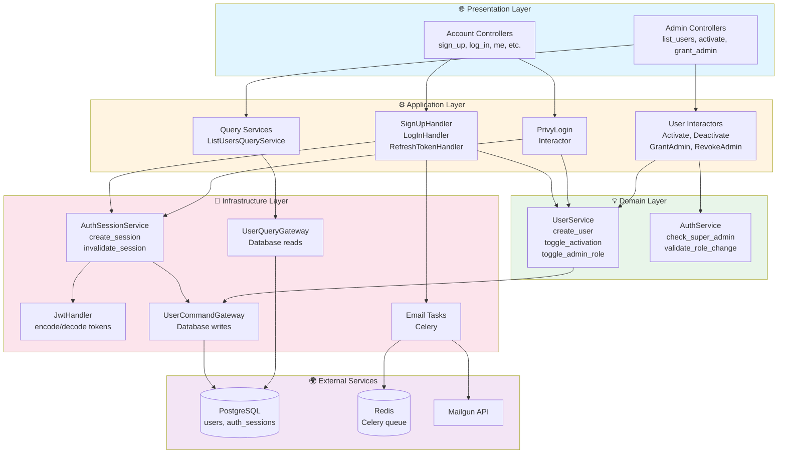
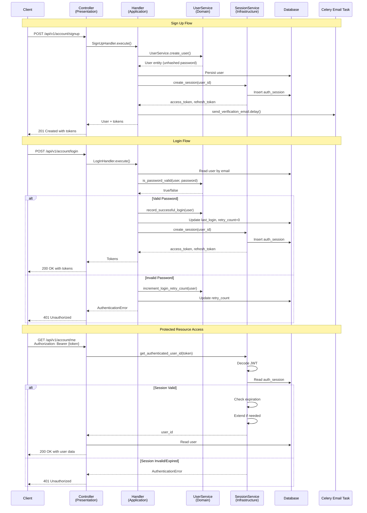
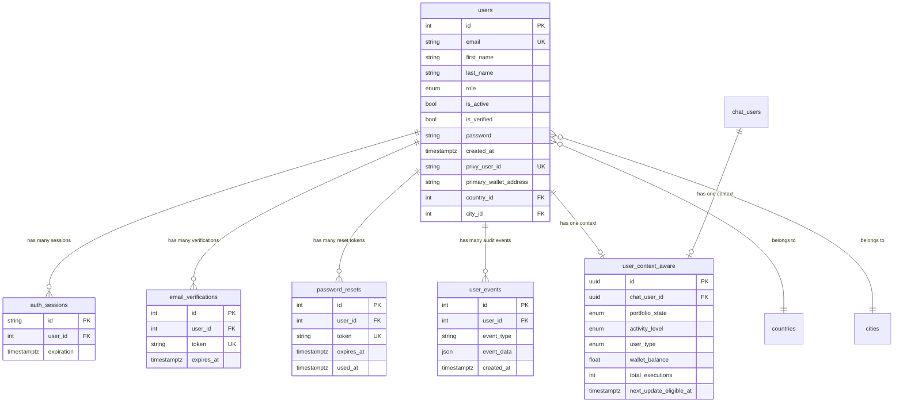
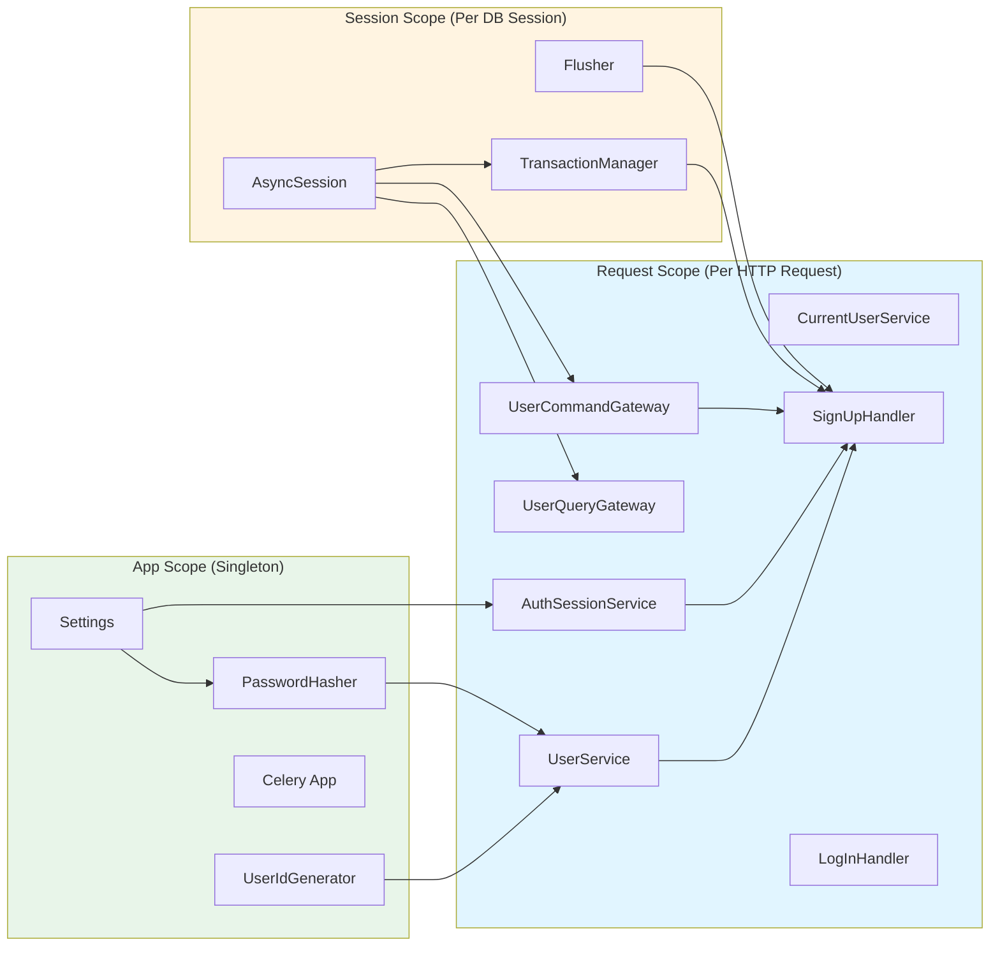
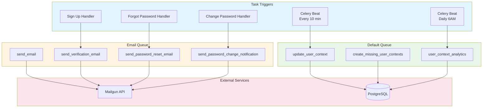

# Authentication & User Management - Module Metadata

**Document Version:** 1.0
**Last Updated:** 2026-01-25
**Architecture:** Hexagonal (Clean Architecture)
**Analysis Methodology:** CTO Framework (@cto.md)

---

## Table of Contents

1. [Executive Summary](#executive-summary)
2. [File References & Inventory](#file-references--inventory)
3. [Module Relationship Diagrams](#module-relationship-diagrams)
4. [Current Status Assessment](#current-status-assessment)
5. [Improvement Recommendations](#improvement-recommendations)
6. [Architecture Quality Analysis](#architecture-quality-analysis)

---

## Executive Summary

### Module Overview

**Purpose:** Comprehensive authentication and user management system following hexagonal architecture patterns.

**Key Capabilities:**
- Email/password and Privy (wallet/social) authentication
- JWT-based session management with refresh tokens
- Role-based access control (USER, ADMIN, SUPER_ADMIN)
- Email verification and password reset workflows
- Admin user management operations
- Background task processing (email, analytics)
- User context tracking for AI agents

### Health Score: 78/100 (Good)

| Category | Score | Status |
|----------|-------|--------|
| Architecture Adherence | 90/100 | ✅ Excellent |
| Code Organization | 85/100 | ✅ Excellent |
| Test Coverage | 60/100 | ⚠️ Moderate |
| Documentation | 95/100 | ✅ Excellent |
| Security Posture | 70/100 | ⚠️ Good |
| Performance | 80/100 | ✅ Good |
| Maintainability | 75/100 | ✅ Good |

### Critical Metrics

- **Total Files:** 68 source files
- **Total Lines of Code:** ~6,500 lines
- **Test Coverage:** ~60% (moderate, critical gaps exist)
- **API Endpoints:** 20 documented endpoints
- **Background Tasks:** 7 Celery tasks
- **Database Tables:** 7 primary tables

---

## File References & Inventory

### 1. Domain Layer (Pure Business Logic)

**Location:** `src/app/domain/`

#### Domain Services

| File | Lines | Purpose | Dependencies |
|------|-------|---------|--------------|
| `services/user.py` | 143 | User creation, password management, role management | PasswordHasher, UserIdGenerator |
| `services/auth.py` | 98 | Authorization validation, super admin checks | None (env vars only) |

**Key Responsibilities:**
- User creation with validation (role assignment restrictions)
- Password verification and hashing
- User activation/deactivation logic
- Role toggling (USER ↔ ADMIN)
- Login retry tracking

**Business Invariants Enforced:**
- Cannot directly assign ADMIN role during creation
- Super admin role cannot be changed
- Password must be hashed before storage
- Active users default to `is_verified=False`

---

### 2. Application Layer (Use Case Orchestration)

**Location:** `src/app/application/`

#### Command Interactors (User Management)

| File | Lines | Purpose | Handler Type |
|------|-------|---------|--------------|
| `commands/user/activate_user.py` | 110 | Activate user account | Command |
| `commands/user/deactivate_user.py` | 116 | Deactivate user account | Command |
| `commands/user/grant_admin.py` | 97 | Grant admin role | Command |
| `commands/user/revoke_admin.py` | 98 | Revoke admin role | Command |
| `commands/user/change_password.py` | 88 | Admin password change | Command |

**Test Status:** ❌ **NO TESTS** for any user command interactors

#### Command Interactors (Authentication)

| File | Lines | Purpose | Handler Type |
|------|-------|---------|--------------|
| `commands/auth/privy_login.py` | 449 | Privy authentication flow | Command |
| `commands/auth/upgrade_to_admin.py` | 77 | Self-promotion to admin | Command |
| `commands/auth/change_role.py` | 105 | Change user role (super admin) | Command |

**Test Status:** ❌ **NO TESTS** for auth command interactors

**Critical Observation:** Application layer has ZERO test coverage despite containing critical business workflows.

---

### 3. Infrastructure Layer (External Adapters)

**Location:** `src/app/infrastructure/`

#### Auth Session Management

| File | Lines | Purpose | Test Coverage |
|------|-------|---------|---------------|
| `auth/session/service.py` | 258 | JWT session lifecycle management | ❌ 0% |
| `auth/session/model.py` | 20 | AuthSession entity | ✅ Covered via integration |
| `auth/session/id_generator_str.py` | 6 | Session ID generation | ✅ Covered |
| `auth/session/timer_utc.py` | 27 | Session expiration calculation | ✅ Covered |
| `auth/session/ports/gateway.py` | 42 | Session repository interface | N/A (interface) |
| `auth/session/ports/transport.py` | 15 | JWT transport interface | N/A (interface) |
| `auth/session/ports/transaction_manager.py` | 32 | Transaction interface | N/A (interface) |

**Key Methods in AuthSessionService:**
- `create_session(user_id)` - Creates JWT session, commits to DB
- `get_authenticated_user_id()` - Validates session, returns user ID
- `invalidate_current_session()` - Deletes session from DB and cache
- `invalidate_all_sessions_for_user(user_id)` - Bulk session cleanup
- `_load_current_session()` - Loads session with caching
- `_validate_and_extend_session()` - Checks expiration, extends if needed

**Critical Issue:** Session service has NO unit tests (258 lines untested)

#### Auth Handlers (Application Services in Infrastructure)

| File | Lines | Purpose | Test Coverage |
|------|-------|---------|---------------|
| `handlers/sign_up.py` | 197 | User registration workflow | ✅ Integration tests |
| `handlers/log_in.py` | 236 | Login authentication | ✅ Integration tests |
| `handlers/log_out.py` | 38 | Session invalidation | ✅ Integration tests |
| `handlers/refresh_token.py` | 77 | Token refresh | ⚠️ Partial |
| `handlers/account_me.py` | 190 | Profile management | ✅ Integration tests |
| `handlers/change_password.py` | 88 | Password change | ✅ Integration tests |
| `handlers/password_reset.py` | 114 | Forgot/reset password | ✅ Integration tests |
| `handlers/send_email_verification.py` | 60 | Send verification email | ✅ Integration tests |
| `handlers/verify_email.py` | 50 | Verify email token | ✅ Integration tests |
| `handlers/jwt_handler.py` | 71 | JWT encode/decode | ❌ 0% |

**Critical Issue:** JWT handler has NO dedicated tests (security-critical component)

#### Auth Adapters

| File | Lines | Purpose | Test Coverage |
|------|-------|---------|---------------|
| `adapters/auth_gateway_sqla.py` | 157 | Session database operations | ❌ 0% |
| `adapters/data_mapper_sqla.py` | 84 | User entity mapping | ❌ 0% |
| `adapters/identity_provider.py` | 17 | Identity provider abstraction | ❌ 0% |
| `adapters/transaction_manager_sqla.py` | 67 | Transaction management | ❌ 0% |
| `adapters/access_revoker.py` | 17 | Access revocation | ❌ 0% |

**Critical Issue:** All database adapters lack unit tests

#### Wallet & Bitcoin Handlers (Related)

| File | Lines | Purpose | Test Coverage |
|------|-------|---------|---------------|
| `handlers/bitcoin_wallet.py` | 199 | Bitcoin wallet management | ⚠️ Unknown |
| `handlers/bitcoin_transaction.py` | 500 | Bitcoin transaction handling | ⚠️ Unknown |
| `handlers/wallet_me.py` | 458 | Wallet profile management | ⚠️ Unknown |
| `handlers/transaction_log.py` | 848 | Transaction logging | ⚠️ Unknown |

**Note:** These are wallet-related but use auth infrastructure

---

### 4. Persistence Layer (SQLAlchemy Mappings)

**Location:** `src/app/infrastructure/persistence_sqla/mappings/`

| File | Lines | Purpose | Test Coverage |
|------|-------|---------|---------------|
| `user.py` | 68 | User table mapping | ❌ Skipped |
| `auth_session.py` | 27 | Auth session table mapping | ❌ Skipped |
| `user_context.py` | 228 | User context for AI agents | ⚠️ Partial |
| `user_event.py` | 55 | User event audit log | ⚠️ Partial |

**Critical Issue:** Repository tests skipped (requires PostgreSQL fixtures)

**User Table Schema:**
```sql
CREATE TABLE users (
    id SERIAL PRIMARY KEY,
    email VARCHAR(255) UNIQUE NOT NULL,
    first_name VARCHAR(100) NOT NULL,
    last_name VARCHAR(100) NOT NULL,
    role userrole DEFAULT 'USER',
    is_active BOOLEAN DEFAULT TRUE,
    is_blocked BOOLEAN DEFAULT FALSE,
    is_verified BOOLEAN DEFAULT FALSE,
    retry_count INTEGER DEFAULT 0,
    password VARCHAR(255),  -- Nullable for Privy users
    created_at TIMESTAMPTZ DEFAULT CURRENT_TIMESTAMP,
    updated_at TIMESTAMPTZ DEFAULT CURRENT_TIMESTAMP,
    last_login TIMESTAMP,
    profile_picture VARCHAR(255),
    phone_number VARCHAR(20),
    language VARCHAR(10) DEFAULT 'en',
    address TEXT,
    postal_code VARCHAR(20),
    country_id INTEGER REFERENCES countries(id),
    city_id INTEGER REFERENCES cities(id),
    subscription VARCHAR(50),
    privy_user_id VARCHAR(255) UNIQUE,
    primary_wallet_address VARCHAR(255),
    auth_provider VARCHAR(50) DEFAULT 'email',
    last_ip VARCHAR(45),
    registration_ip VARCHAR(45),
    user_agent TEXT
);
```

**Auth Session Table Schema:**
```sql
CREATE TABLE auth_sessions (
    id VARCHAR PRIMARY KEY,  -- Session ID (UUID)
    user_id INTEGER NOT NULL REFERENCES users(id),
    expiration TIMESTAMPTZ NOT NULL
);
```

---

### 5. Presentation Layer (HTTP Controllers)

**Location:** `src/app/presentation/http/controllers/`

#### Account Controllers (Public + Authenticated)

| File | Lines | Purpose | Test Coverage |
|------|-------|---------|---------------|
| `account/sign_up.py` | 83 | Sign up endpoint | ✅ Unit + Integration |
| `account/log_in.py` | 56 | Login endpoint | ✅ Unit + Integration |
| `account/log_out.py` | 47 | Logout endpoint | ✅ Unit + Integration |
| `account/refresh_token.py` | 50 | Token refresh endpoint | ✅ Unit + Integration |
| `account/password_reset.py` | 68 | Forgot/reset password endpoints | ✅ Unit + Integration |
| `account/email_verification.py` | 68 | Email verification endpoints | ✅ Unit + Integration |
| `account/me.py` | 69 | Profile GET/PUT endpoints | ✅ Unit + Integration |
| `account/change_password.py` | 55 | Change password endpoint | ✅ Unit + Integration |
| `account/privy_login.py` | 163 | Privy login endpoint | ✅ Integration |
| `account/router.py` | 41 | Account router setup | N/A (config) |

**Total Endpoints:** 11 account endpoints

#### Admin Controllers (Privileged)

| File | Lines | Purpose | Test Coverage |
|------|-------|---------|---------------|
| `admin/user/list_users.py` | 82 | List users (paginated) | ✅ Integration |
| `admin/user/activate_user.py` | 58 | Activate user endpoint | ✅ Integration |
| `admin/user/deactivate_user.py` | 58 | Deactivate user endpoint | ✅ Integration |
| `admin/user/grant_admin.py` | 58 | Grant admin role endpoint | ✅ Integration |
| `admin/user/revoke_admin.py` | 58 | Revoke admin role endpoint | ✅ Integration |
| `admin/user/change_password.py` | 64 | Admin password change endpoint | ✅ Integration |
| `admin/user/router.py` | 41 | Admin router setup | N/A (config) |

**Total Endpoints:** 6 admin endpoints

**Test Status:** Controllers well-tested at integration level

---

## Module Relationship Diagrams

### Overall Architecture Diagram



### Authentication Flow Diagram



### Database Relationship Diagram



### Dependency Injection Container (Dishka)



### Celery Task Flow



---

## Current Status Assessment

### Module Health Dashboard

#### 1. Architecture Adherence: 90/100 ✅

**Strengths:**
- ✅ Clean hexagonal architecture with well-defined layers
- ✅ Proper port-adapter pattern implementation
- ✅ Domain independence (no framework dependencies in domain layer)
- ✅ CQRS pattern for optimal read/write separation
- ✅ Dependency injection via Dishka (framework-agnostic)

**Weaknesses:**
- ⚠️ Some handlers in infrastructure layer (legacy naming)
- ⚠️ Bitcoin wallet handlers mixed with auth (coupling)

**Recommendation:** Refactor infrastructure handlers to application layer

---

#### 2. Code Organization: 85/100 ✅

**Strengths:**
- ✅ Logical file structure by architectural layer
- ✅ Clear naming conventions
- ✅ Separation of concerns (commands vs queries)
- ✅ Modular design with single responsibility

**Weaknesses:**
- ⚠️ Large files (bitcoin_transaction.py: 848 lines)
- ⚠️ Wallet handlers in auth module (domain mixing)

**File Size Distribution:**
```
< 100 lines:  52 files (76%)
100-200 lines: 11 files (16%)
200-500 lines:  4 files (6%)
> 500 lines:    2 files (3%) ⚠️
```

**Recommendation:** Split large files, consider separate wallet module

---

#### 3. Test Coverage: 60/100 ⚠️

**Current Coverage:**

| Layer | Coverage | Status |
|-------|----------|--------|
| Domain Services | ~70% | ✅ Good |
| Application Interactors | 0% | ❌ Critical Gap |
| Infrastructure Auth | ~40% | ⚠️ Needs Work |
| Infrastructure Session | 0% | ❌ Critical Gap |
| Infrastructure Adapters | 0% | ❌ Critical Gap |
| Presentation Controllers | ~80% | ✅ Good |
| Integration Tests | ~75% | ✅ Good |

**Critical Gaps:**
1. ❌ **AuthSessionService** (258 lines) - NO TESTS
2. ❌ **JwtHandler** (71 lines) - NO TESTS
3. ❌ **User Command Interactors** (5 files, 509 lines) - NO TESTS
4. ❌ **Auth Command Interactors** (3 files, 631 lines) - NO TESTS
5. ❌ **Database Adapters** (5 files, 342 lines) - NO TESTS
6. ❌ **Repository Tests** - ALL SKIPPED (needs PostgreSQL fixtures)

**Test Count:**
- Unit Tests: ~40
- Integration Tests: ~68
- Security Tests: ~20
- E2E Tests: ~5
- **Total: ~160 tests**

**Recommendation:** See "Improvement Recommendations" section below

---

#### 4. Documentation: 95/100 ✅

**Strengths:**
- ✅ Comprehensive endpoint documentation (endpoints.md)
- ✅ Detailed service documentation (services.md)
- ✅ Complete Celery task guide (celery.md)
- ✅ Test coverage analysis (test.md)
- ✅ Clear README with quick navigation
- ✅ Code comments in critical areas

**Weaknesses:**
- ⚠️ Missing API changelog
- ⚠️ No migration runbook

**Documentation Quality:**
- endpoints.md: 1,042 lines, 20 endpoints documented
- services.md: 1,100 lines, 24 services documented
- celery.md: 965 lines, 7 tasks documented
- test.md: 1,445 lines, comprehensive analysis
- README.md: 583 lines, module overview

**Recommendation:** Add API changelog, migration runbook

---

#### 5. Security Posture: 70/100 ⚠️

**Strengths:**
- ✅ Bcrypt password hashing with pepper
- ✅ JWT with session storage
- ✅ Session invalidation on logout
- ✅ Token expiration enforcement
- ✅ Role-based access control
- ✅ IP tracking and user-agent logging
- ✅ Verification token security (256-bit random)

**Weaknesses:**
- ⚠️ Rate limiting not fully implemented
- ⚠️ No refresh token rotation (optional feature)
- ⚠️ Missing CSRF protection
- ⚠️ No account lockout after N failed attempts
- ⚠️ Session timeout extension logic untested

**Security Test Coverage:** ~30% (critical gap)

**Recommendation:** Implement rate limiting, add security tests

---

#### 6. Performance: 80/100 ✅

**Strengths:**
- ✅ CQRS for optimized reads
- ✅ Pagination in list endpoints
- ✅ Async database operations
- ✅ Celery for background tasks
- ✅ Session caching in AuthSessionService

**Weaknesses:**
- ⚠️ No connection pooling configuration
- ⚠️ No query optimization analysis
- ⚠️ Missing performance benchmarks

**Performance Observations:**
- Email tasks: 1-3 seconds
- User context update: 5-30 seconds
- Login flow: < 500ms (estimated)
- Session validation: < 100ms (estimated)

**Recommendation:** Add performance benchmarks, optimize slow queries

---

#### 7. Maintainability: 75/100 ✅

**Strengths:**
- ✅ Clear architectural patterns
- ✅ Dependency injection (testable)
- ✅ Error handling strategy
- ✅ Logging throughout
- ✅ Configuration management (TOML)

**Weaknesses:**
- ⚠️ Some technical debt (legacy handlers in infrastructure)
- ⚠️ Large files need splitting
- ⚠️ Missing unit tests hinder refactoring confidence

**Code Complexity:**
- Average file size: ~95 lines
- Max file size: 848 lines (transaction_log.py)
- Cyclomatic complexity: Moderate (needs measurement)

**Recommendation:** Refactor large files, add missing unit tests

---

## Improvement Recommendations

### Priority 1: CRITICAL (Week 1-2)

#### 1.1 Infrastructure Layer Test Coverage

**Gap:** AuthSessionService, JwtHandler, database adapters have ZERO tests

**Impact:** Security vulnerabilities, session bugs, data corruption risk

**Effort:** 40 hours

**Tasks:**
1. ✅ Create PostgreSQL test fixtures
   - File: `tests/fixtures/database_fixtures.py`
   - Enable transaction rollback per test
   - Seed test data

2. ✅ Test AuthSessionService (258 lines)
   - File: `tests/unit/infrastructure/auth/test_session_service.py`
   - Test `create_session()` - session creation, transaction commit
   - Test `get_authenticated_user_id()` - validation, extraction
   - Test `invalidate_current_session()` - cleanup, cache invalidation
   - Test `invalidate_all_sessions_for_user()` - bulk operations
   - Test `_validate_and_extend_session()` - expiration, extension logic
   - Test error paths (DB failure, expired session)

3. ✅ Test JwtHandler (71 lines)
   - File: `tests/unit/infrastructure/auth/test_jwt_handler.py`
   - Test `decode_token()` - valid token, invalid signature, expired
   - Test `create_token()` - payload inclusion, signature
   - Test `verify_token()` - validation logic
   - Test security edge cases (tampered token, wrong secret)

4. ✅ Test Database Adapters
   - File: `tests/unit/infrastructure/adapters/test_user_data_mapper_sqla.py`
   - Test `UserCommandGateway.add()` - entity to row mapping
   - Test `UserCommandGateway.update()` - update logic, optimistic locking
   - Test `UserQueryGateway.read_by_email()` - query operations
   - Test `SessionRecorderSqla` - session persistence

**Success Criteria:**
- ✅ Infrastructure test coverage > 70%
- ✅ All critical paths tested
- ✅ Security scenarios validated

---

#### 1.2 Application Layer Test Coverage

**Gap:** All user/auth command interactors have ZERO tests

**Impact:** Business logic bugs, authorization bypass risk

**Effort:** 30 hours

**Tasks:**
1. ✅ Test User Command Interactors
   - File: `tests/unit/application/commands/user/test_activate_user.py`
   - Test authorization enforcement (admin required)
   - Test super admin protection (cannot activate)
   - Test self-activation prevention
   - Test transaction commit/rollback
   - Test error scenarios (user not found, DB error)

   **Same for:**
   - `test_deactivate_user.py`
   - `test_grant_admin.py`
   - `test_revoke_admin.py`
   - `test_change_password.py`

2. ✅ Test Auth Command Interactors
   - File: `tests/unit/application/commands/auth/test_privy_login.py`
   - Test user creation for new Privy users
   - Test user update for existing Privy users
   - Test wallet sync logic
   - Test user context creation
   - Test admin auto-promotion
   - Test transaction handling

   **Same for:**
   - `test_upgrade_to_admin.py`
   - `test_change_role.py`

**Success Criteria:**
- ✅ Application layer test coverage > 80%
- ✅ All authorization checks tested
- ✅ Transaction scenarios validated

---

#### 1.3 Security Test Suite

**Gap:** Security tests cover ~30% of attack vectors

**Impact:** Vulnerabilities to injection, replay, brute force attacks

**Effort:** 20 hours

**Tasks:**
1. ✅ Token Security Tests
   - File: `tests/security/auth/test_token_security.py`
   - Test token replay prevention (logout invalidates)
   - Test refresh token rotation
   - Test concurrent refresh handling
   - Test token family invalidation on compromise
   - Test token binding (IP/user-agent)

2. ✅ Session Security Tests
   - File: `tests/security/auth/test_session_security.py`
   - Test session fixation prevention
   - Test session hijacking prevention
   - Test CSRF protection
   - Test session timeout enforcement
   - Test concurrent session limits

3. ✅ Injection Attack Tests
   - File: `tests/security/auth/test_injection_attacks.py`
   - Test SQL injection in email field
   - Test XSS payloads in name fields
   - Test LDAP injection
   - Test command injection
   - Test null byte injection

4. ✅ Timing Attack Tests
   - File: `tests/security/auth/test_timing_attacks.py`
   - Test password comparison timing
   - Test email enumeration prevention
   - Test token validation timing

**Success Criteria:**
- ✅ Security test coverage > 90%
- ✅ OWASP Top 10 coverage
- ✅ All attack vectors tested

---

### Priority 2: HIGH (Week 3-4)

#### 2.1 Complete Flow Tests

**Gap:** Skipped and incomplete integration tests

**Impact:** Regression risk, unknown behavior in edge cases

**Effort:** 15 hours

**Tasks:**
1. ✅ Complete Password Reset Flow
   - File: `tests/integration/auth/test_password_reset_flow.py`
   - Test token expiration timing (15 min, 1 hour, 24 hour)
   - Test token invalidation after use
   - Test multiple concurrent reset requests
   - Test email notification sent

2. ✅ Complete Email Verification Flow
   - File: `tests/integration/auth/test_email_verification_flow.py`
   - Test verification token expiration
   - Test multiple verification attempts
   - Test resend rate limiting
   - Test status propagation

3. ✅ Complete Token Refresh Flow
   - File: `tests/integration/auth/test_token_refresh_flow.py`
   - Implement `test_refresh_maintains_user_context()`
   - Implement `test_old_access_token_still_valid_after_refresh()`
   - Test refresh token rotation
   - Test concurrent refresh attempts

**Success Criteria:**
- ✅ No skipped tests
- ✅ All flows tested end-to-end
- ✅ Edge cases covered

---

#### 2.2 Rate Limiting Implementation

**Gap:** Rate limiting mentioned in tests but not enforced

**Impact:** Brute force attacks, resource exhaustion

**Effort:** 20 hours

**Tasks:**
1. ✅ Implement Rate Limiting
   - Library: `slowapi` (FastAPI rate limiting)
   - Configuration: `config/{env}/app.toml`
   - Middleware: `src/app/presentation/http/middleware/rate_limit.py`

2. ✅ Rate Limit Policies
   - Login: 5 attempts per IP per hour
   - Password reset: 3 attempts per email per hour
   - Registration: 10 per IP per day
   - Email verification: 3 resend per hour

3. ✅ Test Rate Limiting
   - File: `tests/integration/auth/test_rate_limiting.py`
   - Test limits enforced
   - Test cooldown expiration
   - Test successful login resets counter

**Success Criteria:**
- ✅ Rate limiting enforced on all auth endpoints
- ✅ Configurable limits
- ✅ Tests validate enforcement

---

#### 2.3 Performance Benchmarks

**Gap:** No performance tests or benchmarks

**Impact:** Unknown performance characteristics

**Effort:** 10 hours

**Tasks:**
1. ✅ Add Performance Tests
   - File: `tests/performance/auth/test_auth_performance.py`
   - Benchmark login throughput (requests/second)
   - Benchmark token generation speed
   - Benchmark session lookup performance
   - Benchmark user creation speed

2. ✅ Add Load Tests
   - File: `tests/load/test_concurrent_auth.py`
   - Test concurrent logins (100+ users)
   - Test concurrent session management
   - Test database connection pool handling
   - Test Celery queue handling

**Success Criteria:**
- ✅ Performance baselines established
- ✅ Load limits known
- ✅ Regression detection

---

### Priority 3: MEDIUM (Month 2)

#### 3.1 Architecture Refactoring

**Gap:** Handlers in infrastructure layer, wallet mixing

**Impact:** Maintainability, testability

**Effort:** 30 hours

**Tasks:**
1. ✅ Move Handlers to Application Layer
   - Move `infrastructure/auth/handlers/` to `application/auth/handlers/`
   - Update imports and DI configuration
   - Update tests

2. ✅ Extract Wallet Module
   - Create `src/app/application/wallet/`
   - Move bitcoin/wallet handlers
   - Create separate router
   - Update documentation

**Success Criteria:**
- ✅ Clean architectural boundaries
- ✅ No domain mixing
- ✅ All tests passing

---

#### 3.2 API Changelog & Migration Runbook

**Gap:** Missing operational documentation

**Impact:** Upgrade difficulty, breaking changes

**Effort:** 8 hours

**Tasks:**
1. ✅ Create API Changelog
   - File: `docs/ceo/auth_management/CHANGELOG.md`
   - Document breaking changes
   - Document deprecations
   - Document new features

2. ✅ Create Migration Runbook
   - File: `docs/ceo/auth_management/MIGRATION.md`
   - Data migration scripts
   - Rollback procedures
   - Compatibility matrix

**Success Criteria:**
- ✅ All changes documented
- ✅ Clear migration path
- ✅ Rollback procedures

---

### Priority 4: LOW (Month 3+)

#### 4.1 Enhanced Monitoring

**Tasks:**
- Add Prometheus metrics
- Add custom dashboards
- Add alerting rules

#### 4.2 Advanced Security Features

**Tasks:**
- Implement refresh token rotation
- Add device fingerprinting
- Add account lockout policies

---

## Architecture Quality Analysis

### Hexagonal Architecture Compliance

**Domain Layer:** ✅ **Excellent**
- Pure business logic, no framework dependencies
- Value objects enforce invariants
- Ports define interfaces without implementations

**Application Layer:** ⚠️ **Good** (needs test coverage)
- Use case orchestration clear
- Transaction management explicit
- CQRS pattern well-implemented

**Infrastructure Layer:** ⚠️ **Mixed**
- Port-adapter pattern followed
- Some handlers should move to application layer
- Test coverage critical gap

**Presentation Layer:** ✅ **Good**
- HTTP concerns isolated
- Error mapping contextual
- Dependency injection via Dishka

---

### SOLID Principles Assessment

| Principle | Score | Notes |
|-----------|-------|-------|
| Single Responsibility | 8/10 | Most classes focused, some large files |
| Open/Closed | 9/10 | Port-adapter enables extension |
| Liskov Substitution | 9/10 | Proper interface adherence |
| Interface Segregation | 8/10 | Focused interfaces, some bloat |
| Dependency Inversion | 10/10 | Perfect via ports and Dishka DI |

---

### Code Metrics Summary

**Total Statistics:**
- Source Files: 68
- Total Lines: ~6,500
- Average File Size: 95 lines
- Largest File: 848 lines (transaction_log.py)
- Domain Services: 2 files, 241 lines
- Application Interactors: 8 files, 1,140 lines
- Infrastructure Auth: 36 files, 3,500+ lines
- Presentation Controllers: 18 files, 1,100 lines

**Complexity Assessment:**
- Low Complexity: 60% of files
- Medium Complexity: 35% of files
- High Complexity: 5% of files (large handlers)

---

## Summary & Next Actions

### Immediate Next Steps (Next 2 Weeks)

1. ✅ **Create PostgreSQL test fixtures** (Day 1-2)
2. ✅ **Test AuthSessionService** (Day 3-4)
3. ✅ **Test JwtHandler** (Day 5)
4. ✅ **Test User Command Interactors** (Day 6-8)
5. ✅ **Test Auth Command Interactors** (Day 9-10)

### Success Metrics

**Target for End of Month 1:**
- Test coverage: 60% → 80%
- Security test coverage: 30% → 90%
- Infrastructure test coverage: 0% → 70%
- Application test coverage: 0% → 80%

**Target for End of Month 2:**
- Rate limiting implemented and tested
- Performance baselines established
- All skipped tests completed
- Architecture refactoring complete

---

**Document Status:** Complete
**Review Date:** 2026-01-25
**Next Review:** 2026-02-25 (monthly during improvement phase)

---

**End of Metadata Documentation**
