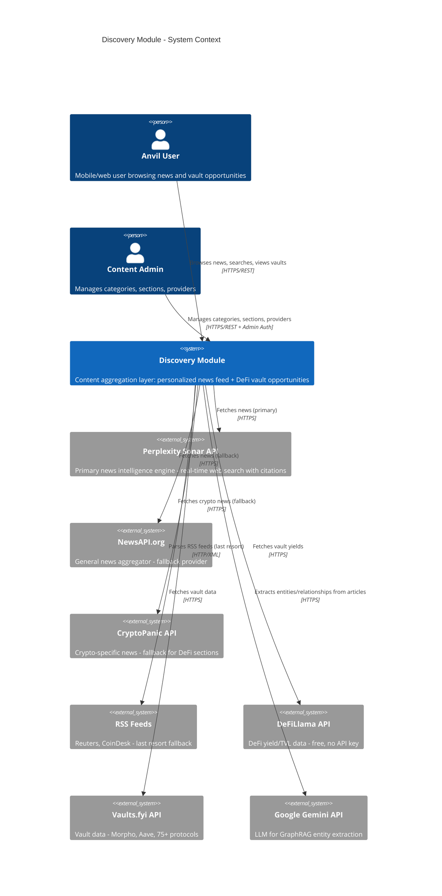
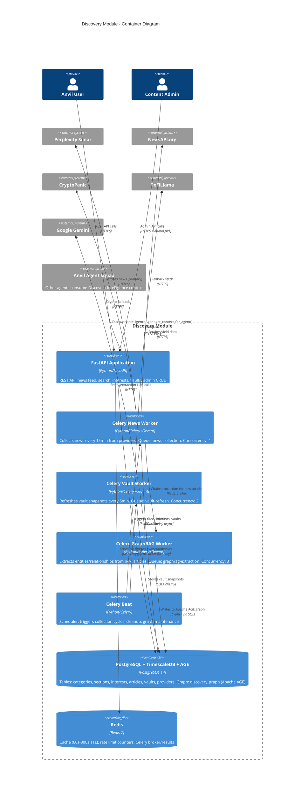
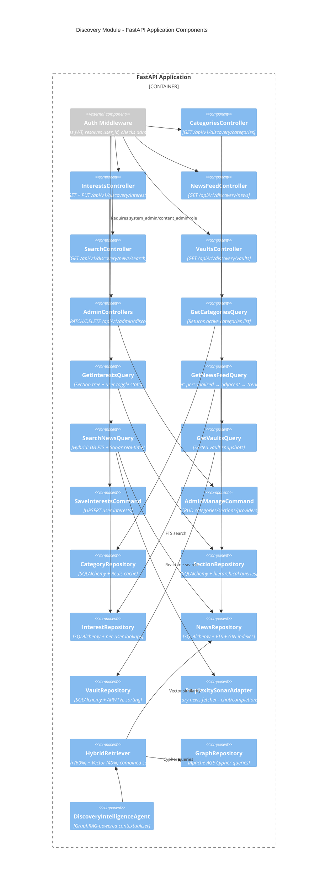
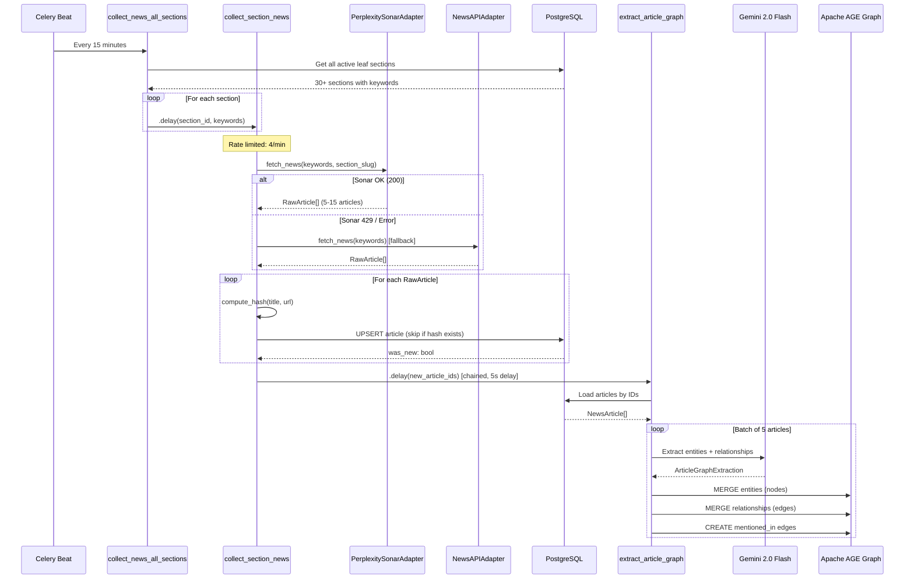
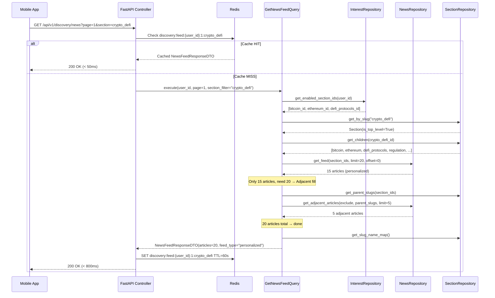
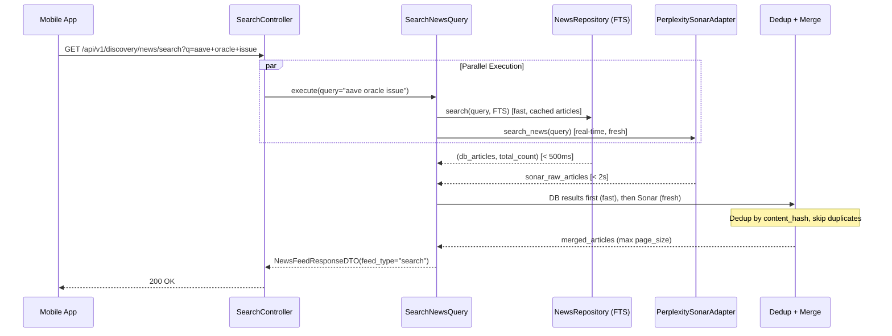
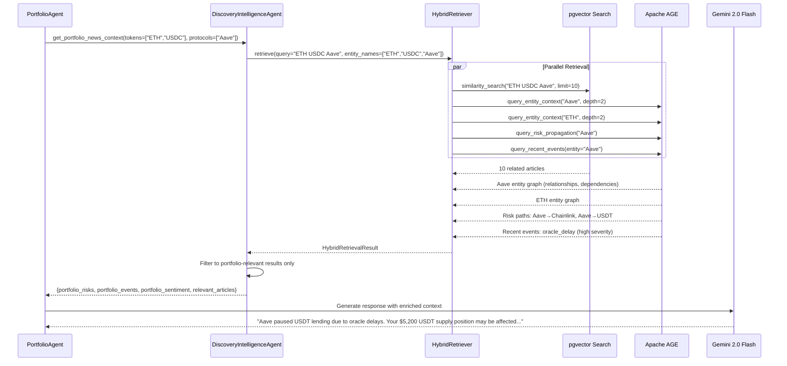

# Discovery Module — Document 2: C4 Model Diagrams

## Level 1: System Context

## Level 2: Container Diagram

## Level 3: Component Diagram (FastAPI Application)

## Level 4: Code Diagram — News Collection Flow

## Level 4: Code Diagram — User Feed Request

## Level 4: Code Diagram — Hybrid Search

## Level 4: Code Diagram — Discovery Intelligence Agent (Inter-Agent)

