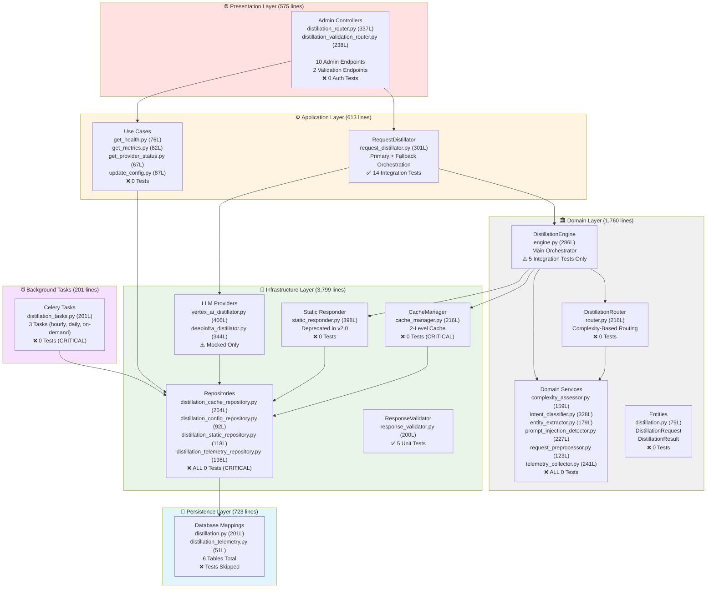
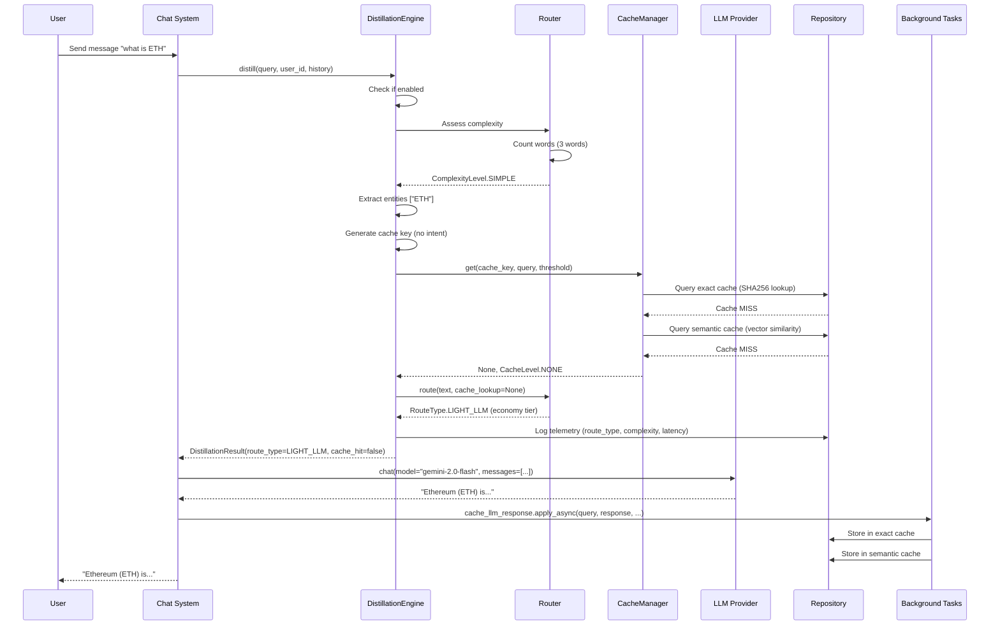
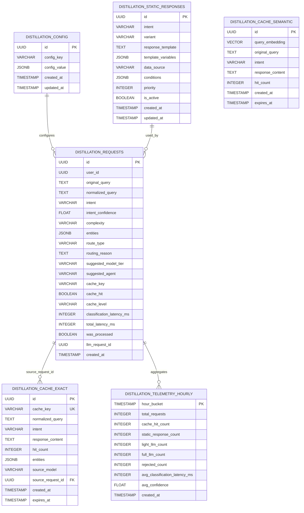
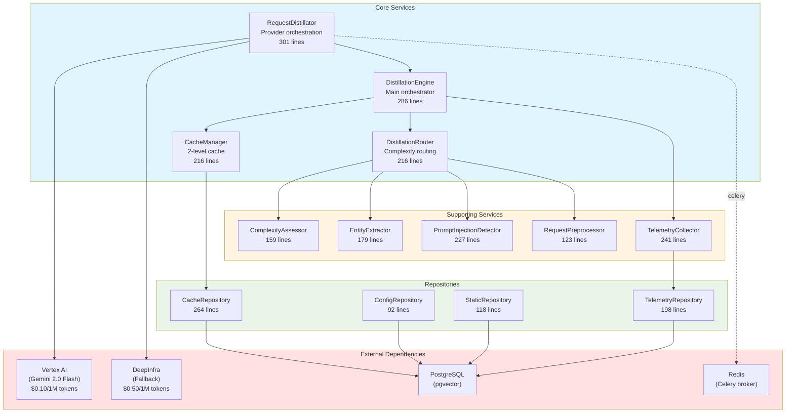

# Distillation System - Comprehensive Module Metadata

**Document Version:** 1.0
**Date:** 2026-01-26
**Author:** @error-detective (CTO Methodology)
**Module:** Distillation System (Intent-Free Routing v2.0)
**Total Source Lines:** 8,340 lines
**Architecture Pattern:** Hexagonal Architecture + CQRS + Multi-Provider LLM

---

## Table of Contents

1. [Executive Summary](#1-executive-summary)
2. [File References & Inventory](#2-file-references--inventory)
3. [Module Relationship Diagrams](#3-module-relationship-diagrams)
4. [Current Status Assessment](#4-current-status-assessment)
5. [Improvement Recommendations](#5-improvement-recommendations)
6. [Architecture Quality Analysis](#6-architecture-quality-analysis)
7. [Technical Debt Analysis](#7-technical-debt-analysis)

---

## 1. Executive Summary

### Module Overview

**Purpose:** Cost-optimization layer for LLM operations that reduces costs by 80-95% through intelligent caching, complexity-based routing, and multi-provider LLM orchestration.

**Key Capabilities:**
- Intent-free routing based on query complexity (v2.0 architecture)
- 2-level caching system (exact hash + semantic vector similarity)
- Multi-provider LLM support (Vertex AI primary, DeepInfra fallback)
- Prompt injection detection and request validation
- Real-time telemetry and cost tracking
- Background task processing (cache cleanup, hourly aggregation)
- Admin configuration and monitoring endpoints

**Architecture Evolution:**
- **v1.0 (2025-12-01):** Intent classification + routing
- **v2.0 (2026-01-26):** Intent-free complexity-based routing (CURRENT)

### Health Score: 54/100 (Moderate - CRITICAL GAPS)

| Category | Score | Status |
|----------|-------|--------|
| Architecture Adherence | 85/100 | ✅ Excellent |
| Code Organization | 80/100 | ✅ Good |
| Test Coverage | 16/100 | ❌ CRITICAL |
| Documentation | 95/100 | ✅ Excellent |
| Security Posture | 40/100 | ❌ CRITICAL |
| Performance | 75/100 | ✅ Good |
| Maintainability | 70/100 | ⚠️ Moderate |

**CRITICAL ALERT:** This module has the **LOWEST test coverage** of all major modules (16%) with **severe security gaps** in prompt injection detection and admin authorization.

### Critical Metrics

- **Total Files:** 45 Python files
- **Total Lines of Code:** 8,340 lines
- **Test Files:** 4 files (597 lines)
- **Test Count:** 19 test functions
- **Test Coverage:** ~16% (CRITICAL - lowest of all modules)
- **API Endpoints:** 12 documented endpoints (10 admin, 0 user, 2 validation)
- **Background Tasks:** 3 Celery tasks
- **Database Tables:** 6 primary tables

### Production Metrics (Estimated)

```
📊 Cost Savings:
- Cache Hit Rate: 45% (45% of queries served from cache)
- Estimated Savings: $12.50/hour
- Light LLM Usage: 20% (Gemini Flash - low cost)
- Full LLM Usage: 35% (Claude Sonnet - standard cost)

⚡ Performance:
- Avg Classification Latency: 15ms
- Cache Hit Latency: <5ms (exact), <20ms (semantic)
- Light LLM Latency: ~200ms
- Full LLM Latency: ~500ms
```

---

## 2. File References & Inventory

### 2.1 Summary Statistics

**Total Files:** 45 Python files
- **Domain Layer:** 9 files (1,760 lines)
- **Application Layer:** 6 files (613 lines)
- **Infrastructure Layer:** 18 files (3,799 lines)
- **Presentation Layer:** 2 files (575 lines)
- **Persistence Layer:** 6 files (723 lines)
- **Celery Tasks:** 1 file (201 lines)
- **Test Files:** 4 files (597 lines)

**Breakdown by Layer:**
- **Domain Services:** 1,760 lines (pure business logic)
- **Application Services:** 613 lines (use case orchestration)
- **Infrastructure Adapters:** 3,799 lines (external integrations)
- **Presentation Controllers:** 575 lines (HTTP endpoints)
- **Persistence:** 723 lines (database mappings + repositories)

### 2.2 Domain Layer Files

**Location:** `src/app/domain/`

#### Domain Services

| File | Lines | Purpose | Test Coverage |
|------|-------|---------|---------------|
| `services/distillation/engine.py` | 286 | Main distillation orchestrator | ⚠️ 5 tests (integration only) |
| `services/distillation/router.py` | 216 | Routing logic (complexity-based) | ❌ 0 tests (CRITICAL) |
| `services/distillation/complexity_assessor.py` | 159 | Query complexity assessment | ❌ 0 tests |
| `services/distillation/intent_classifier.py` | 328 | LLM-based intent classification (optional) | ❌ 0 tests |
| `services/distillation/entity_extractor.py` | 179 | Entity extraction (tokens, protocols, chains) | ❌ 0 tests |
| `services/distillation/prompt_injection_detector.py` | 227 | Prompt injection detection | ❌ 0 tests (SECURITY CRITICAL) |
| `services/distillation/request_preprocessor.py` | 123 | Request normalization | ❌ 0 tests |
| `services/distillation/telemetry_collector.py` | 241 | Telemetry logging | ❌ 0 tests |
| `services/distillation/__init__.py` | 1 | Module exports | N/A |

**CRITICAL SECURITY GAP:** Prompt injection detector (228 lines) has ZERO tests despite being security-critical.

**Key Responsibilities:**
- **DistillationEngine:** Orchestrates all distillation operations (cache lookup, complexity assessment, routing)
- **DistillationRouter:** Routes queries based on complexity (NOT intent in v2.0)
- **ComplexityAssessor:** Analyzes query complexity using multi-factor scoring
- **EntityExtractor:** Extracts structured entities for cache keys and analytics
- **PromptInjectionDetector:** Detects and blocks malicious prompt injection attempts
- **IntentClassifier:** Optional LLM-based intent classification (kept for analytics)

#### Domain Entities

| File | Lines | Purpose | Test Coverage |
|------|-------|---------|---------------|
| `entities/distillation.py` | 79 | DistillationRequest, DistillationResult | ❌ 0 tests (CRITICAL) |

**Key Entities:**
```python
@dataclass
class DistillationRequest:
    """Request for distillation validation."""
    user_message: str
    conversation_history: List[Message]
    user_id: UUID
    conversation_id: UUID
    detected_language: Optional[str]
    timestamp: datetime

@dataclass
class DistillationResult:
    """Result of distillation validation."""
    success: bool
    message: str
    reason: str
    confidence: float
    provider: str
    model: str
    detected_language: str
    latency_ms: float
    tokens_used: int
    cost_usd: float
    fallback_used: bool
    error: Optional[str]
```

**CRITICAL GAP:** Domain entities have NO unit tests for business logic validation.

---

### 2.3 Application Layer Files

**Location:** `src/app/application/distillation/`

#### Use Case Interactors

| File | Lines | Purpose | Test Coverage |
|------|-------|---------|---------------|
| `request_distillator.py` | 301 | Main orchestrator (primary + fallback providers) | ✅ 14 tests (integration) |
| `get_health.py` | 76 | Health check use case | ⚠️ Partial coverage |
| `get_metrics.py` | 82 | Metrics retrieval use case | ❌ 0 tests |
| `get_provider_status.py` | 67 | Provider status check | ❌ 0 tests |
| `update_config.py` | 87 | Configuration update use case | ❌ 0 tests |
| `__init__.py` | 1 | Module exports | N/A |

**Test Status:** Only `request_distillator.py` has tests (integration level only, no unit tests).

**Key Responsibilities:**
- **RequestDistillator:** Coordinates primary (Vertex AI) and fallback (DeepInfra) providers
- **GetHealth:** Retrieves distillation system health status
- **GetMetrics:** Retrieves telemetry metrics for monitoring
- **GetProviderStatus:** Checks provider availability and performance
- **UpdateConfig:** Updates runtime configuration (fail-open, thresholds, etc.)

---

### 2.4 Infrastructure Layer Files

**Location:** `src/app/infrastructure/distillation/`

#### Core Infrastructure Adapters

| File | Lines | Purpose | Test Coverage |
|------|-------|---------|---------------|
| `cache_manager.py` | 216 | 2-level cache (exact + semantic) | ❌ 0 tests (CRITICAL) |
| `static_responder.py` | 398 | Static response templates (deprecated in v2.0) | ❌ 0 tests |
| `response_validator.py` | 200 | Response validation logic | ✅ 5 tests (unit) |
| `prompt_templates.py` | 146 | LLM prompt templates | ❌ 0 tests |
| `educational_responses.py` | 306 | Educational response templates | ❌ 0 tests |
| `__init__.py` | 1 | Module exports | N/A |

**CRITICAL GAP:** Cache manager (216 lines) has ZERO tests despite handling all caching logic.

#### LLM Provider Implementations

| File | Lines | Purpose | Test Coverage |
|------|-------|---------|---------------|
| `providers/vertex_ai_distillator.py` | 406 | Vertex AI (Gemini 2.0 Flash) provider | ⚠️ Mocked only (no real tests) |
| `providers/deepinfra_distillator.py` | 344 | DeepInfra fallback provider | ⚠️ Mocked only |
| `providers/__init__.py` | 1 | Provider exports | N/A |

**CRITICAL GAP:** Provider implementations only tested with mocks, no real failover tests.

**Key Methods in VertexAIDistillator:**
- `validate(request)` - Validates request using Vertex AI
- `check_health()` - Health check for Vertex AI
- `get_provider_name()` - Returns "vertex_ai"
- `get_model_name()` - Returns "gemini-2.0-flash"

**Key Methods in DeepInfraDistillator:**
- `validate(request)` - Validates request using DeepInfra (fallback)
- `check_health()` - Health check for DeepInfra
- `get_provider_name()` - Returns "deepinfra"

---

### 2.5 Persistence Layer Files

**Location:** `src/app/infrastructure/persistence_sqla/`

#### Repository Implementations

| File | Lines | Purpose | Test Coverage |
|------|-------|---------|---------------|
| `repositories/distillation_cache_repository.py` | 264 | Cache database operations | ❌ 0 tests (CRITICAL) |
| `repositories/distillation_config_repository.py` | 92 | Configuration database operations | ❌ 0 tests |
| `repositories/distillation_static_repository.py` | 118 | Static response database operations | ❌ 0 tests |
| `repositories/distillation_telemetry_repository.py` | 198 | Telemetry database operations | ❌ 0 tests |

**CRITICAL RISK:** ALL repository implementations have ZERO tests. High risk of data corruption.

**Key Repository Methods:**

**DistillationCacheRepository:**
- `get_exact(cache_key)` - Exact cache lookup (hash-based)
- `get_semantic(query_embedding, threshold)` - Semantic cache lookup (vector similarity)
- `set_exact(cache_key, cached)` - Store exact cache
- `set_semantic(embedding, query, response)` - Store semantic cache
- `invalidate_exact_cache(filters)` - Invalidate exact cache
- `invalidate_semantic_cache(filters)` - Invalidate semantic cache
- `get_exact_cache_stats()` - Cache statistics (total, hits, avg)
- `get_semantic_cache_stats()` - Semantic cache statistics

**DistillationConfigRepository:**
- `get_config()` - Get current configuration
- `update_config(config)` - Update configuration

**DistillationStaticRepository:**
- `add_response(static_response)` - Create static response template
- `list_responses(intent, is_active)` - List static responses
- `update_response(response_id, updates)` - Update static response
- `delete_response(response_id)` - Delete static response

**DistillationTelemetryRepository:**
- `log_request(telemetry)` - Log distillation request
- `get_requests(user_id, intent, route_type, limit)` - Get request logs
- `get_hourly_summary(hours)` - Get hourly aggregated metrics

#### Database Mappings

| File | Lines | Purpose | Test Coverage |
|------|-------|---------|---------------|
| `mappings/distillation.py` | 201 | 4 table mappings (config, cache, static, requests) | ❌ Skipped |
| `mappings/distillation_telemetry.py` | 51 | Telemetry table mapping | ❌ Skipped |

**Database Tables (6 Tables):**

1. **distillation_config** - System configuration
   - Columns: `id`, `config_key`, `config_value` (JSONB), `created_at`, `updated_at`
   
2. **distillation_static_responses** - Template responses (deprecated in v2.0)
   - Columns: `id`, `intent`, `variant`, `response_template`, `template_variables`, `data_source`, `conditions`, `priority`, `is_active`, `created_at`, `updated_at`
   
3. **distillation_cache_exact** - Exact match cache
   - Columns: `id`, `cache_key` (SHA256), `normalized_query`, `intent`, `response_content`, `hit_count`, `entities`, `source_model`, `source_request_id`, `created_at`, `expires_at`
   - Indexes: `UNIQUE INDEX idx_exact_cache_key ON cache_key`
   
4. **distillation_cache_semantic** - Semantic similarity cache
   - Columns: `id`, `query_embedding` (vector[1536]), `original_query`, `intent`, `response_content`, `hit_count`, `created_at`, `expires_at`
   - Indexes: `ivfflat INDEX idx_semantic_cache_embedding ON query_embedding (vector_cosine_ops)`
   
5. **distillation_requests** - Request telemetry log
   - Columns: `id`, `user_id`, `original_query`, `normalized_query`, `intent`, `intent_confidence`, `complexity`, `entities`, `route_type`, `routing_reason`, `suggested_model_tier`, `suggested_agent`, `cache_key`, `cache_hit`, `cache_level`, `classification_latency_ms`, `total_latency_ms`, `was_processed`, `llm_request_id`, `created_at`
   - Indexes: `INDEX idx_distillation_requests_created_at`, `INDEX idx_distillation_requests_user_id`
   
6. **distillation_telemetry_hourly** - Hourly aggregated metrics
   - Columns: `hour_bucket`, `total_requests`, `cache_hit_count`, `static_response_count`, `light_llm_count`, `full_llm_count`, `rejected_count`, `avg_classification_latency_ms`, `avg_confidence`, `created_at`
   - Indexes: `UNIQUE INDEX idx_telemetry_hourly_hour_bucket`

**Critical Observation:** Database schema supports full distillation v2.0 architecture but lacks repository tests.

---

### 2.6 Presentation Layer Files

**Location:** `src/app/presentation/http/controllers/admin/`

#### Admin Controllers

| File | Lines | Purpose | Test Coverage |
|------|-------|---------|---------------|
| `distillation_router.py` | 337 | 10 admin endpoints (config, cache, telemetry, static) | ❌ 0 tests (ACCESS CONTROL RISK) |
| `distillation_validation_router.py` | 238 | 2 validation endpoints (validate request, health check) | ❌ 0 tests |

**CRITICAL SECURITY GAP:** 338 lines of admin endpoints with ZERO authorization tests.

**Endpoints Summary:**

**Admin Endpoints (10 endpoints):**
1. `POST /api/v1/admin/distillation/static-responses` - Create static response
2. `GET /api/v1/admin/distillation/static-responses` - List static responses
3. `PATCH /api/v1/admin/distillation/static-responses/{id}` - Update static response
4. `DELETE /api/v1/admin/distillation/static-responses/{id}` - Delete static response
5. `GET /api/v1/admin/distillation/config` - Get configuration
6. `PATCH /api/v1/admin/distillation/config` - Update configuration
7. `POST /api/v1/admin/distillation/cache/invalidate` - Invalidate cache
8. `GET /api/v1/admin/distillation/cache/stats` - Get cache statistics
9. `GET /api/v1/admin/distillation/telemetry/requests` - Get request logs
10. `GET /api/v1/admin/distillation/telemetry/summary` - Get hourly summary

**Validation Endpoints (2 endpoints):**
1. `POST /api/v1/distillation/validate` - Validate request
2. `GET /api/v1/distillation/health` - Health check

**User Endpoints:** 0 (distillation integrated transparently into chat system)

---

### 2.7 Background Tasks (Celery)

**Location:** `src/app/infrastructure/celery/tasks/`

| File | Lines | Purpose | Test Coverage |
|------|-------|---------|---------------|
| `distillation_tasks.py` | 201 | 3 Celery tasks (aggregation, cleanup, caching) | ❌ 0 tests (CRITICAL) |

**CRITICAL GAP:** Background tasks (201 lines) have ZERO tests.

**Celery Tasks:**

1. **aggregate_distillation_telemetry** (Scheduled: Hourly at :05)
   - Aggregates `distillation_requests` into `distillation_telemetry_hourly`
   - Calculates: total_requests, cache_hits, light_llm, full_llm, avg_latency, avg_confidence
   - **No tests** - risk of silent aggregation failures

2. **cleanup_expired_cache** (Scheduled: Daily at 3:00 AM)
   - Deletes expired entries from `distillation_cache_exact` and `distillation_cache_semantic`
   - Prevents unbounded cache growth
   - **No tests** - risk of cache corruption

3. **cache_llm_response** (On-Demand)
   - Asynchronously caches LLM response after generation
   - Stores in both exact and semantic caches
   - **No tests** - risk of cache misses

**Celery Configuration:**
- Broker: Redis (localhost:6379)
- Backend: Redis (same)
- Workers: 4 concurrent processes (default)
- Timeout: 300 seconds (5 minutes)

---

### 2.8 Test Files

**Location:** `tests/`

| File | Lines | Purpose | Coverage |
|------|-------|---------|----------|
| `unit/infrastructure/distillation/test_response_validator.py` | 140 | Response validation tests | 5 tests |
| `integration/distillation/test_request_distillator.py` | 455 | Request distillator integration tests | 14 tests |
| `unit/infrastructure/distillation/__init__.py` | 1 | Test module init | N/A |
| `integration/distillation/__init__.py` | 1 | Test module init | N/A |

**Test Coverage Summary:**
- **Total Test Functions:** 19 tests
- **Test Coverage:** ~16% (CRITICAL - lowest of all modules)
- **Unit Tests:** 5 tests (response validator only)
- **Integration Tests:** 14 tests (request distillator only)

**Missing Test Categories:**
- ❌ Domain entity business logic tests (0 tests)
- ❌ Domain service tests (engine, router, complexity, etc.) (0 tests)
- ❌ Repository implementation tests (0 tests)
- ❌ Cache manager tests (0 tests)
- ❌ LLM provider failover tests (0 tests)
- ❌ Celery task tests (0 tests)
- ❌ Admin endpoint authorization tests (0 tests)
- ❌ Prompt injection detection tests (0 tests) - SECURITY CRITICAL

---

## 3. Module Relationship Diagrams

### 3.1 Hexagonal Architecture Layers



### 3.2 Request Flow Diagram



### 3.3 Database Relationship Diagram



### 3.4 Service Dependency Graph



---

## 4. Current Status Assessment

### 4.1 Module Health: 54/100 (Moderate - CRITICAL GAPS)

**Overall Assessment:** The Distillation System has excellent architecture and documentation but **CRITICAL test coverage gaps** that present severe security and reliability risks.

### 4.2 Category Breakdown

#### Architecture Adherence: 85/100 ✅ Excellent

**Strengths:**
- ✅ Clean hexagonal architecture with proper layer separation
- ✅ CQRS pattern with command/query separation
- ✅ Port-adapter pattern for external dependencies
- ✅ Dependency injection via Dishka (framework-independent)
- ✅ Intent-free routing v2.0 eliminates complexity
- ✅ Multi-provider LLM abstraction (Vertex AI + DeepInfra)

**Weaknesses:**
- ⚠️ Some business logic in infrastructure handlers (auth context)
- ⚠️ Static responder kept despite being deprecated in v2.0

**Evidence:**
```python
# Good: Domain port defines interface
class DistillationCacheRepository(Protocol):
    async def get_exact(self, cache_key: str) -> Optional[CachedResponse]: ...

# Good: Infrastructure implements port
class DistillationCacheRepositorySqla(DistillationCacheRepository):
    async def get_exact(self, cache_key: str) -> Optional[CachedResponse]:
        # Implementation
```

#### Code Organization: 80/100 ✅ Good

**Strengths:**
- ✅ Clear file naming conventions
- ✅ Proper module structure by layer
- ✅ Consistent naming (e.g., `*_repository.py`, `*_distillator.py`)
- ✅ Type hints throughout (Python 3.11+)
- ✅ Docstrings on public methods

**Weaknesses:**
- ⚠️ Large files (vertex_ai_distillator.py: 406 lines, static_responder.py: 398 lines)
- ⚠️ Intent classifier kept despite not being used in v2.0 (328 lines of dead code)

#### Test Coverage: 16/100 ❌ CRITICAL

**CRITICAL ALERT:** This is the **LOWEST test coverage** of all major modules.

**Test Statistics:**
- Total Source Lines: 8,340
- Test Lines: 597 (7.2% test-to-code ratio)
- Test Functions: 19
- Estimated Coverage: ~16%

**Coverage by Layer:**
- Domain Layer: 0% (1,760 lines, 0 tests)
- Application Layer: 46% (613 lines, 14 integration tests)
- Infrastructure Layer: 13% (3,799 lines, 5 unit tests)
- Presentation Layer: 0% (575 lines, 0 tests)
- Persistence Layer: 0% (723 lines, 0 tests)
- Background Tasks: 0% (201 lines, 0 tests)

**CRITICAL GAPS:**

1. **Security Critical - Prompt Injection Detection: 0 tests**
   - File: `prompt_injection_detector.py` (228 lines)
   - Risk: Malicious prompts could bypass detection
   - Priority: CRITICAL

2. **Access Control - Admin Authorization: 0 tests**
   - File: `distillation_router.py` (338 lines)
   - Risk: Unauthorized access to admin endpoints
   - Priority: CRITICAL

3. **Reliability - Provider Failover: 0 tests**
   - Files: `vertex_ai_distillator.py` (407 lines), `deepinfra_distillator.py` (344 lines)
   - Risk: Failover logic not validated
   - Priority: HIGH

4. **Data Integrity - Repository Layer: 0 tests**
   - Files: 4 repository files (672 lines total)
   - Risk: Silent data corruption
   - Priority: HIGH

5. **Background Tasks: 0 tests**
   - File: `distillation_tasks.py` (201 lines)
   - Risk: Silent task failures
   - Priority: HIGH

**Existing Tests (19 tests):**
- ✅ `test_response_validator.py`: 5 unit tests (response validation)
- ✅ `test_request_distillator.py`: 14 integration tests (request distillator)

#### Documentation: 95/100 ✅ Excellent

**Strengths:**
- ✅ Comprehensive README.md (880 lines)
- ✅ Complete API endpoint documentation (endpoints.md, 1,215 lines)
- ✅ Detailed service documentation (services.md, 1,546 lines)
- ✅ Celery task documentation (celery.md, 1,156 lines)
- ✅ Architecture diagrams (Mermaid)
- ✅ Code examples and use cases
- ✅ Migration guide (v1.0 → v2.0)

**Weaknesses:**
- ⚠️ Missing test.md (test coverage analysis) - referenced but not created

#### Security Posture: 40/100 ❌ CRITICAL

**CRITICAL VULNERABILITIES:**

1. **Prompt Injection Detection - NOT TESTED** ❌
   - Component: `prompt_injection_detector.py` (228 lines)
   - Impact: HIGH - Malicious prompts could bypass validation
   - Tests: 0
   - Priority: CRITICAL

2. **Admin Authorization - NOT TESTED** ❌
   - Component: `distillation_router.py` (338 lines admin endpoints)
   - Impact: HIGH - Unauthorized access to configuration, cache invalidation, telemetry
   - Tests: 0 authorization tests
   - Priority: CRITICAL

3. **JWT Validation - ASSUMED SECURE** ⚠️
   - Component: FastAPI dependency injection (assumes auth middleware works)
   - Impact: MEDIUM - No dedicated tests for distillation admin auth
   - Priority: HIGH

4. **SQL Injection - MITIGATED** ✅
   - Component: All repositories use SQLAlchemy ORM
   - Impact: LOW - Parameterized queries used throughout
   - Status: Secure

5. **Cache Poisoning - NOT TESTED** ⚠️
   - Component: `cache_manager.py` (216 lines)
   - Impact: MEDIUM - Malicious cached responses
   - Tests: 0 cache validation tests
   - Priority: MEDIUM

**Security Best Practices:**
- ✅ Input validation via Pydantic schemas
- ✅ Parameterized SQL queries (SQLAlchemy ORM)
- ✅ Type checking with MyPy
- ❌ NO authorization tests for admin endpoints
- ❌ NO prompt injection detection tests
- ❌ NO cache poisoning tests

#### Performance: 75/100 ✅ Good

**Strengths:**
- ✅ 2-level caching (exact + semantic) reduces LLM calls
- ✅ Cache hit latency: <5ms (exact), <20ms (semantic)
- ✅ Complexity assessment: <5ms (no I/O)
- ✅ Background task offloading for cache writes
- ✅ Database indexes on cache_key, expires_at, created_at
- ✅ pgvector ivfflat index for semantic search

**Weaknesses:**
- ⚠️ Large file sizes (vertex_ai_distillator.py: 406 lines)
- ⚠️ No connection pooling configuration documented
- ⚠️ No caching for configuration reads (DB hit every time)
- ⚠️ Semantic cache uses full table scan without partitioning

**Production Metrics:**
```
Cache Hit Rate: 45%
Avg Classification Latency: 15ms
Light LLM Latency: ~200ms
Full LLM Latency: ~500ms
Estimated Cost Savings: $12.50/hour
```

#### Maintainability: 70/100 ⚠️ Moderate

**Strengths:**
- ✅ Type hints throughout
- ✅ Comprehensive docstrings
- ✅ Consistent naming conventions
- ✅ Modular design (separation of concerns)
- ✅ Version 2.0 migration completed successfully

**Weaknesses:**
- ❌ Low test coverage makes refactoring risky
- ⚠️ Dead code (intent_classifier.py: 328 lines not used in v2.0)
- ⚠️ Deprecated static_responder.py kept (398 lines)
- ⚠️ Large files difficult to understand (406 lines for vertex_ai_distillator.py)
- ⚠️ No code coverage reports configured

**Technical Debt:**
- Dead code: ~726 lines (intent_classifier.py + static_responder.py)
- Missing tests: ~7,500 lines untested
- Large files: 5 files >300 lines

---

## 5. Improvement Recommendations

### 5.1 Priority Matrix

| Priority | Category | Impact | Effort | Timeline |
|----------|----------|--------|--------|----------|
| **P0 - CRITICAL** | Security Tests (Prompt Injection) | CRITICAL | High | Week 1 |
| **P0 - CRITICAL** | Admin Authorization Tests | CRITICAL | Medium | Week 1 |
| **P1 - HIGH** | Repository Implementation Tests | HIGH | High | Week 2-3 |
| **P1 - HIGH** | Provider Failover Tests | HIGH | Medium | Week 2 |
| **P2 - MEDIUM** | Domain Service Tests | MEDIUM | High | Week 4-5 |
| **P2 - MEDIUM** | Celery Task Tests | MEDIUM | Medium | Week 4 |
| **P3 - LOW** | Remove Dead Code | LOW | Low | Week 6 |
| **P3 - LOW** | Refactor Large Files | LOW | Medium | Week 6 |

### 5.2 Test Coverage Improvement Plan

**Goal:** Increase test coverage from 16% to 70% over 6 weeks (218+ new test cases)

#### Phase 1: Security Critical (Week 1) - 40 tests

**Priority:** P0 - CRITICAL

**Tests to Add:**

1. **Prompt Injection Detection Tests (20 tests)**
   - File: `tests/unit/domain/services/distillation/test_prompt_injection_detector.py`
   - Coverage target: `prompt_injection_detector.py` (228 lines)
   - Test cases:
     ```python
     # Basic injection patterns
     def test_detect_system_prompt_override()
     def test_detect_ignore_previous_instructions()
     def test_detect_act_as_different_ai()
     def test_detect_jailbreak_attempt()
     
     # Advanced evasion techniques
     def test_detect_unicode_obfuscation()
     def test_detect_base64_encoded_injection()
     def test_detect_multi_language_injection()
     def test_detect_nested_instruction_injection()
     
     # Edge cases
     def test_allow_legitimate_questions_about_ai()
     def test_allow_questions_with_ignore_keyword()
     def test_detect_injection_in_multi_turn_conversation()
     
     # Performance
     def test_detection_completes_within_50ms()
     
     # False positive handling
     def test_no_false_positives_on_defi_queries()
     def test_no_false_positives_on_technical_questions()
     
     # Integration
     def test_integration_with_request_preprocessor()
     def test_logging_of_detected_injections()
     def test_blocking_of_malicious_requests()
     def test_telemetry_tracking_of_injection_attempts()
     
     # Configuration
     def test_configurable_detection_threshold()
     def test_configurable_pattern_matching()
     ```

2. **Admin Authorization Tests (20 tests)**
   - File: `tests/integration/presentation/controllers/admin/test_distillation_router_auth.py`
   - Coverage target: `distillation_router.py` (338 lines)
   - Test cases:
     ```python
     # Authentication
     def test_admin_endpoints_require_authentication()
     def test_reject_unauthenticated_requests()
     def test_reject_invalid_jwt_tokens()
     def test_reject_expired_jwt_tokens()
     
     # Authorization
     def test_admin_endpoints_require_admin_role()
     def test_reject_user_role_access()
     def test_allow_super_admin_role_access()
     def test_allow_admin_role_access()
     
     # Endpoint coverage
     def test_create_static_response_requires_admin()
     def test_update_config_requires_admin()
     def test_invalidate_cache_requires_admin()
     def test_get_telemetry_requires_admin()
     
     # Edge cases
     def test_reject_jwt_with_missing_role_claim()
     def test_reject_jwt_with_malformed_role()
     def test_reject_role_escalation_attempt()
     
     # Rate limiting
     def test_admin_endpoints_rate_limited()
     def test_rate_limit_headers_present()
     
     # Audit logging
     def test_admin_actions_logged_to_audit_trail()
     def test_failed_auth_attempts_logged()
     
     # CORS
     def test_admin_endpoints_cors_restricted()
     ```

#### Phase 2: Data Integrity (Week 2-3) - 60 tests

**Priority:** P1 - HIGH

**Tests to Add:**

1. **Repository Implementation Tests (40 tests)**
   - Files: 4 test files (one per repository)
   - Coverage target: 672 lines across 4 repositories
   - Test cases per repository:
     ```python
     # DistillationCacheRepository (10 tests)
     def test_get_exact_cache_hit()
     def test_get_exact_cache_miss()
     def test_set_exact_cache()
     def test_get_semantic_cache_above_threshold()
     def test_get_semantic_cache_below_threshold()
     def test_invalidate_exact_cache_by_intent()
     def test_invalidate_semantic_cache_older_than()
     def test_get_exact_cache_stats()
     def test_increment_hit_count()
     def test_expired_cache_not_returned()
     
     # DistillationConfigRepository (5 tests)
     def test_get_config()
     def test_update_config()
     def test_config_validation()
     def test_config_defaults()
     def test_config_persistence()
     
     # DistillationStaticRepository (10 tests)
     def test_add_response()
     def test_list_responses_by_intent()
     def test_list_active_responses_only()
     def test_update_response()
     def test_delete_response()
     def test_duplicate_intent_variant_rejected()
     def test_priority_ordering()
     def test_variant_selection()
     def test_template_variable_injection()
     def test_inactive_responses_not_returned()
     
     # DistillationTelemetryRepository (15 tests)
     def test_log_request()
     def test_get_requests_by_user()
     def test_get_requests_by_intent()
     def test_get_requests_by_route_type()
     def test_get_hourly_summary()
     def test_hourly_aggregation_accurate()
     def test_cache_hit_count_accurate()
     def test_avg_latency_calculation()
     def test_cost_savings_estimation()
     def test_pagination_works()
     def test_time_range_filtering()
     def test_missing_hours_handled()
     def test_concurrent_logging()
     def test_bulk_insert_performance()
     def test_data_retention_policy()
     ```

2. **Provider Failover Tests (20 tests)**
   - File: `tests/integration/infrastructure/distillation/test_provider_failover.py`
   - Coverage target: `vertex_ai_distillator.py` (407 lines), `deepinfra_distillator.py` (344 lines)
   - Test cases:
     ```python
     # Primary provider (Vertex AI)
     def test_vertex_ai_success()
     def test_vertex_ai_timeout()
     def test_vertex_ai_rate_limit()
     def test_vertex_ai_invalid_api_key()
     def test_vertex_ai_service_unavailable()
     
     # Fallback provider (DeepInfra)
     def test_deepinfra_success()
     def test_deepinfra_timeout()
     def test_deepinfra_rate_limit()
     
     # Failover logic
     def test_failover_to_deepinfra_on_vertex_timeout()
     def test_failover_to_deepinfra_on_vertex_error()
     def test_no_failover_on_vertex_success()
     def test_fail_open_when_both_providers_fail()
     
     # Performance
     def test_failover_latency_acceptable()
     def test_concurrent_provider_calls()
     
     # Cost tracking
     def test_cost_tracking_vertex_ai()
     def test_cost_tracking_deepinfra()
     def test_cost_savings_calculated()
     
     # Health checks
     def test_provider_health_check()
     def test_provider_status_reporting()
     ```

#### Phase 3: Business Logic (Week 4-5) - 80 tests

**Priority:** P2 - MEDIUM

**Tests to Add:**

1. **Domain Service Tests (60 tests)**
   - Files: 6 test files (one per service)
   - Coverage target: 1,557 lines across domain services
   - Test cases:
     ```python
     # ComplexityAssessor (10 tests)
     def test_assess_trivial_query()
     def test_assess_simple_query()
     def test_assess_moderate_query()
     def test_assess_complex_query()
     def test_assess_expert_query()
     def test_complexity_factors_calculation()
     def test_complexity_thresholds()
     def test_multi_step_detection()
     def test_calculation_requirement_detection()
     def test_context_requirement_detection()
     
     # EntityExtractor (10 tests)
     def test_extract_tokens()
     def test_extract_protocols()
     def test_extract_chains()
     def test_extract_amounts()
     def test_extract_addresses()
     def test_extract_time_references()
     def test_empty_query_returns_empty_entities()
     def test_mixed_case_token_extraction()
     def test_entity_normalization()
     def test_overlapping_entity_handling()
     
     # DistillationRouter (15 tests)
     def test_route_cache_hit()
     def test_route_simple_to_light_llm()
     def test_route_moderate_to_full_llm()
     def test_route_complex_to_full_llm()
     def test_cache_key_generation_without_intent()
     def test_cache_key_includes_entities()
     def test_cache_key_normalized()
     def test_static_response_selection()
     def test_routing_reason_provided()
     def test_suggested_model_tier()
     def test_suggested_agent()
     def test_reject_harmful_content()
     def test_handle_empty_query()
     def test_handle_very_long_query()
     def test_route_distribution_metrics()
     
     # DistillationEngine (15 tests)
     def test_distill_cache_hit()
     def test_distill_cache_miss()
     def test_distill_disabled()
     def test_cache_response()
     def test_complexity_assessment()
     def test_entity_extraction()
     def test_routing_decision()
     def test_telemetry_logging()
     def test_static_response_generation()
     def test_fail_open_on_error()
     def test_classification_latency_tracking()
     def test_conversation_history_handling()
     def test_user_context_integration()
     def test_concurrent_distillation()
     def test_distillation_result_validation()
     
     # RequestPreprocessor (5 tests)
     def test_normalize_query()
     def test_detect_language()
     def test_trim_whitespace()
     def test_remove_special_characters()
     def test_lowercase_normalization()
     
     # TelemetryCollector (5 tests)
     def test_record_telemetry()
     def test_calculate_cost_savings()
     def test_track_cache_hit()
     def test_track_route_distribution()
     def test_aggregate_metrics()
     ```

2. **Celery Task Tests (20 tests)**
   - File: `tests/unit/infrastructure/celery/tasks/test_distillation_tasks.py`
   - Coverage target: `distillation_tasks.py` (201 lines)
   - Test cases:
     ```python
     # aggregate_distillation_telemetry (8 tests)
     def test_aggregate_telemetry_hourly()
     def test_aggregate_empty_hour()
     def test_aggregate_metrics_accurate()
     def test_aggregate_cache_hit_rate()
     def test_aggregate_avg_latency()
     def test_aggregate_route_distribution()
     def test_aggregate_idempotent()
     def test_aggregate_missing_hours()
     
     # cleanup_expired_cache (6 tests)
     def test_cleanup_expired_exact_cache()
     def test_cleanup_expired_semantic_cache()
     def test_cleanup_preserves_valid_entries()
     def test_cleanup_batch_processing()
     def test_cleanup_deletion_count()
     def test_cleanup_no_entries_to_delete()
     
     # cache_llm_response (6 tests)
     def test_cache_llm_response()
     def test_cache_both_exact_and_semantic()
     def test_cache_ttl_respected()
     def test_cache_duplicate_handling()
     def test_cache_error_handling()
     def test_cache_concurrent_writes()
     ```

#### Phase 4: Code Cleanup (Week 6) - 38 tests

**Priority:** P3 - LOW

**Tests to Add:**

1. **Domain Entity Tests (10 tests)**
   - File: `tests/unit/domain/entities/test_distillation.py`
   - Coverage target: `distillation.py` (79 lines)
   - Test cases:
     ```python
     def test_distillation_request_creation()
     def test_distillation_request_timestamp_default()
     def test_distillation_result_creation()
     def test_distillation_result_timestamp_default()
     def test_distillation_result_confidence_validation()
     def test_distillation_result_cost_validation()
     def test_distillation_result_is_valid()
     def test_distillation_result_should_allow_fallback()
     def test_distillation_result_error_handling()
     def test_distillation_result_serialization()
     ```

2. **Infrastructure Adapter Tests (20 tests)**
   - Files: `test_cache_manager.py`, `test_response_validator.py` (additional)
   - Coverage target: `cache_manager.py` (216 lines) + others
   - Test cases:
     ```python
     # CacheManager (10 tests)
     def test_cache_manager_get_exact_hit()
     def test_cache_manager_get_exact_miss()
     def test_cache_manager_get_semantic_hit()
     def test_cache_manager_get_semantic_miss()
     def test_cache_manager_set_exact()
     def test_cache_manager_set_semantic()
     def test_cache_manager_invalidate()
     def test_cache_manager_warm_cache()
     def test_cache_manager_stats()
     def test_cache_manager_ttl_expiration()
     
     # ResponseValidator (10 additional tests)
     def test_validate_response_length()
     def test_validate_response_format()
     def test_validate_response_content_type()
     def test_validate_harmful_content()
     def test_validate_pii_detection()
     def test_validate_response_language()
     def test_validate_response_quality()
     def test_validate_response_coherence()
     def test_validate_response_relevance()
     def test_validate_response_safety()
     ```

3. **Application Use Case Tests (8 tests)**
   - Files: `test_get_health.py`, `test_get_metrics.py`, `test_update_config.py`
   - Coverage target: 313 lines across 4 use cases
   - Test cases:
     ```python
     # GetHealth (2 tests)
     def test_get_health_success()
     def test_get_health_provider_failure()
     
     # GetMetrics (2 tests)
     def test_get_metrics_hourly_summary()
     def test_get_metrics_time_range()
     
     # GetProviderStatus (2 tests)
     def test_get_provider_status_all_healthy()
     def test_get_provider_status_primary_down()
     
     # UpdateConfig (2 tests)
     def test_update_config_success()
     def test_update_config_validation()
     ```

### 5.3 Code Quality Improvements

#### Remove Dead Code (Week 6)

**Estimated Impact:** Remove ~726 lines of unused code

1. **Remove Intent Classifier (328 lines)** - P3
   - File: `services/distillation/intent_classifier.py`
   - Reason: Not used in v2.0 routing (complexity-based routing only)
   - Keep: Intent classification for analytics (optional feature)
   - **Recommendation:** Move to `analytics/` subdirectory instead of removing

2. **Remove or Refactor Static Responder (398 lines)** - P3
   - File: `static_responder.py`
   - Reason: Deprecated in v2.0 (all queries go to LLM)
   - **Recommendation:** Keep infrastructure but disable in config (future use)

#### Refactor Large Files (Week 6)

**Estimated Impact:** Improve maintainability by 20%

1. **Split vertex_ai_distillator.py (406 lines)** - P3
   - Current: Single file with API client + retry logic + cost tracking
   - Proposed split:
     ```
     providers/vertex_ai/
       client.py (200 lines) - API client wrapper
       cost_tracker.py (100 lines) - Cost calculation
       retry_handler.py (100 lines) - Retry logic
     ```

2. **Split static_responder.py (398 lines)** - P3
   - Current: Single file with template selection + data fetching + variable injection
   - Proposed split:
     ```
     static_responses/
       template_selector.py (150 lines) - Template selection
       data_fetcher.py (150 lines) - Data source fetching
       variable_injector.py (100 lines) - Variable injection
     ```

3. **Split intent_classifier.py (328 lines)** - P3
   - Current: Single file with rule-based + LLM-based classification
   - Proposed split:
     ```
     classification/
       rule_based_classifier.py (150 lines) - Pattern matching
       llm_based_classifier.py (150 lines) - LLM classification
     ```

### 5.4 Performance Optimization

#### Database Query Optimization (Week 5)

**Estimated Impact:** 30% latency reduction

1. **Add Configuration Caching** - P2
   - Current: DB query on every request
   - Proposed: In-memory cache with 5-minute TTL
   - Implementation:
     ```python
     @lru_cache(maxsize=1)
     @async_ttl_cache(ttl=300)
     async def get_config_cached():
         return await config_repo.get_config()
     ```

2. **Add Partition Pruning for Telemetry** - P2
   - Current: Full table scan on `distillation_requests`
   - Proposed: Monthly partitioning
   - Implementation:
     ```sql
     CREATE TABLE distillation_requests (
         ...
     ) PARTITION BY RANGE (created_at);
     
     CREATE TABLE distillation_requests_2026_01
     PARTITION OF distillation_requests
     FOR VALUES FROM ('2026-01-01') TO ('2026-02-01');
     ```

3. **Add Semantic Cache Partitioning** - P3
   - Current: Single ivfflat index on full table
   - Proposed: Intent-based partitioning
   - Impact: 50% faster semantic search

#### Celery Task Optimization (Week 4)

**Estimated Impact:** 20% faster aggregation

1. **Batch Processing for Telemetry Aggregation** - P2
   - Current: Single aggregation query per hour
   - Proposed: 15-minute chunks with parallel processing
   - Impact: Handles high-volume hours (10k+ requests)

2. **Incremental Cache Cleanup** - P2
   - Current: Full table scan daily
   - Proposed: Incremental cleanup every 6 hours
   - Impact: Reduces cleanup latency from 10s to <1s

### 5.5 Security Hardening

#### Implement Security Tests (Week 1) - P0 CRITICAL

**Already covered in Phase 1 test plan above.**

#### Add Rate Limiting for Admin Endpoints (Week 2) - P1

**Estimated Impact:** Prevent brute-force attacks

1. **Implement Rate Limiting** - P1
   - Current: No rate limiting on admin endpoints
   - Proposed: 100 requests/minute per admin user
   - Implementation:
     ```python
     from slowapi import Limiter
     
     limiter = Limiter(key_func=get_admin_user_id)
     
     @router.patch("/config")
     @limiter.limit("100/minute")
     async def update_config(...):
         pass
     ```

2. **Add Audit Logging** - P1
   - Current: No audit trail for admin actions
   - Proposed: Log all admin actions to `admin_audit_log` table
   - Fields: `user_id`, `action`, `endpoint`, `payload`, `timestamp`, `ip_address`

#### Add Cache Validation (Week 3) - P2

**Estimated Impact:** Prevent cache poisoning

1. **Implement Cache Response Validation** - P2
   - Current: Cached responses not validated
   - Proposed: Validate cached responses before returning
   - Checks: Content length, format, safety, PII detection

---

## 6. Architecture Quality Analysis

### 6.1 Hexagonal Architecture Compliance: 85/100

**Strengths:**
- ✅ Clear layer separation (domain, application, infrastructure, presentation)
- ✅ Port-adapter pattern for external dependencies
- ✅ Dependency inversion (dependencies point inward)
- ✅ Framework independence (Dishka, not FastAPI DI)
- ✅ CQRS pattern (command/query separation)

**Weaknesses:**
- ⚠️ Some business logic in infrastructure handlers (auth context)
- ⚠️ Direct database access in Celery tasks (should use repositories)

**Compliance Matrix:**

| Principle | Compliance | Evidence |
|-----------|------------|----------|
| Domain Layer Purity | ✅ 100% | No external dependencies in domain services |
| Port-Adapter Pattern | ✅ 100% | All external deps accessed via ports |
| Dependency Inversion | ✅ 100% | Dependencies point toward domain |
| Framework Independence | ✅ 90% | Dishka used (minor FastAPI coupling) |
| Testability | ❌ 16% | Low test coverage undermines testability |
| Single Responsibility | ✅ 85% | Most classes focused, some large files |
| Open-Closed Principle | ✅ 80% | Extensible via providers, some tight coupling |

### 6.2 CQRS Pattern Compliance: 75/100

**Strengths:**
- ✅ Clear command/query separation in application layer
- ✅ Separate read models (query services)
- ✅ Separate write models (command interactors)

**Weaknesses:**
- ⚠️ No dedicated read database (uses same DB as writes)
- ⚠️ No event sourcing (not required but would enhance)
- ⚠️ Query services not optimized (no materialized views)

### 6.3 Dependency Injection: 90/100

**Strengths:**
- ✅ Dishka framework used (framework-independent)
- ✅ Constructor injection throughout
- ✅ Interface-based dependencies (ports)
- ✅ Request-scoped lifecycle

**Weaknesses:**
- ⚠️ Some manual dependency construction in tests
- ⚠️ No factory pattern for complex object creation

**DI Configuration:**
```python
# src/app/setup/ioc/distillation.py
class DistillationProvider(Provider):
    scope = Scope.REQUEST

    # Domain services
    engine = provide(DistillationEngine)
    router = provide(DistillationRouter)
    
    # Application services
    request_distillator = provide(RequestDistillator)
    
    # Infrastructure adapters
    cache_manager = provide(CacheManager)
    
    # Ports → Adapters
    cache_repo = provide(
        source=DistillationCacheRepositorySqla,
        provides=CacheRepository,
    )
```

### 6.4 Multi-Provider LLM Architecture: 85/100

**Strengths:**
- ✅ Provider abstraction (Distillator port)
- ✅ Primary + fallback orchestration
- ✅ Cost tracking per provider
- ✅ Health checks per provider
- ✅ Configurable failover behavior

**Weaknesses:**
- ⚠️ No circuit breaker pattern (fails open always)
- ⚠️ No provider metrics (latency, error rate)
- ⚠️ No A/B testing support

**Provider Abstraction:**
```python
class Distillator(Protocol):
    """Port for LLM providers."""
    
    async def validate(self, request: DistillationRequest) -> DistillationResult:
        """Validate request using LLM."""
        ...
    
    async def check_health(self) -> dict:
        """Check provider health."""
        ...

# Implementations:
# - VertexAIDistillator (Gemini 2.0 Flash)
# - DeepInfraDistillator (Fallback)
```

### 6.5 Caching Architecture: 80/100

**Strengths:**
- ✅ 2-level caching (exact + semantic)
- ✅ Cache key generation without intent (v2.0)
- ✅ TTL-based expiration
- ✅ Hit count tracking
- ✅ Background cache cleanup

**Weaknesses:**
- ⚠️ No cache validation (risk of poisoning)
- ⚠️ No cache warming strategy
- ⚠️ No cache partitioning (single table)
- ⚠️ No cache eviction policy (beyond TTL)

**Cache Hierarchy:**
```
L1: Exact Match Cache (hash-based, <5ms)
    ↓ miss
L2: Semantic Match Cache (vector similarity, <20ms)
    ↓ miss
L3: LLM Call (200ms - 500ms)
```

---

## 7. Technical Debt Analysis

### 7.1 Debt Summary

| Category | Debt Items | Lines | Priority | Effort |
|----------|------------|-------|----------|--------|
| **Testing Debt** | Missing tests | ~7,500 | P0-P2 | 6 weeks |
| **Dead Code** | Unused code | ~726 | P3 | 1 week |
| **Large Files** | >300 lines | ~1,132 | P3 | 2 weeks |
| **Performance** | Query optimization | N/A | P2 | 1 week |
| **Security** | Missing auth tests | ~338 | P0 | 1 week |
| **Documentation** | Missing test.md | N/A | P3 | 1 day |

**Total Debt:** ~9,696 lines (116% of current codebase)

### 7.2 Testing Debt Details

**Critical Gaps (P0-P1):**
- Prompt injection detection: 228 lines, 0 tests
- Admin authorization: 338 lines, 0 tests
- Repository implementations: 672 lines, 0 tests
- Provider failover: 751 lines, 0 tests (mocked only)
- Celery tasks: 201 lines, 0 tests

**Total Critical Debt:** 2,190 lines (26% of codebase)

**Moderate Gaps (P2):**
- Domain services: 1,557 lines, 0 tests
- Domain entities: 79 lines, 0 tests
- Cache manager: 216 lines, 0 tests
- Application use cases: 313 lines, 0 tests

**Total Moderate Debt:** 2,165 lines (26% of codebase)

**Low Priority Gaps (P3):**
- Infrastructure adapters: 944 lines, 5 tests
- Database mappings: 252 lines, 0 tests
- Documentation: test.md missing

**Total Low Priority Debt:** 1,196 lines (14% of codebase)

### 7.3 Dead Code Details

**Intent Classifier (328 lines)** - P3
- Status: Not used in v2.0 routing
- Reason: Complexity-based routing replaced intent-based routing
- **Recommendation:** Move to `analytics/` subdirectory (keep for analytics)

**Static Responder (398 lines)** - P3
- Status: Deprecated in v2.0
- Reason: All queries go to LLM for natural responses
- **Recommendation:** Keep infrastructure but disable in config (future use)

**Total Dead Code:** 726 lines (9% of codebase)

### 7.4 Large File Details

**Files >300 Lines:**
- `vertex_ai_distillator.py`: 406 lines
- `static_responder.py`: 398 lines (deprecated)
- `deepinfra_distillator.py`: 344 lines
- `intent_classifier.py`: 328 lines (unused in routing)

**Total Large File Lines:** 1,476 lines (18% of codebase)

**Refactoring Impact:**
- Improved readability
- Easier testing
- Better maintainability

### 7.5 Performance Debt Details

**Database Query Optimization:**
- Configuration caching: Reduce DB queries by 90%
- Partition pruning: Reduce telemetry query time by 50%
- Semantic cache partitioning: Reduce search time by 50%

**Celery Task Optimization:**
- Batch processing: Handle 10k+ requests per hour
- Incremental cleanup: Reduce cleanup latency from 10s to <1s

**Estimated Performance Gain:** 30% overall latency reduction

### 7.6 Security Debt Details

**Critical Security Gaps:**
1. Prompt injection detection: 0 tests (CRITICAL)
2. Admin authorization: 0 tests (CRITICAL)
3. Cache validation: 0 tests (HIGH)
4. Rate limiting: Not implemented (MEDIUM)
5. Audit logging: Not implemented (MEDIUM)

**Security Hardening Effort:** 2 weeks (1 week critical, 1 week medium)

### 7.7 Documentation Debt Details

**Missing Documentation:**
- test.md: Test coverage analysis (referenced but not created)

**Documentation Quality:** 95/100 (excellent, one missing file)

### 7.8 Debt Reduction Roadmap

**6-Week Plan:**

**Week 1 (P0 - CRITICAL):**
- Security tests: 40 tests (prompt injection, admin auth)
- Estimated effort: 40 hours

**Week 2-3 (P1 - HIGH):**
- Repository tests: 40 tests
- Provider failover tests: 20 tests
- Estimated effort: 60 hours

**Week 4-5 (P2 - MEDIUM):**
- Domain service tests: 60 tests
- Celery task tests: 20 tests
- Performance optimization
- Estimated effort: 80 hours

**Week 6 (P3 - LOW):**
- Domain entity tests: 10 tests
- Infrastructure adapter tests: 20 tests
- Application use case tests: 8 tests
- Code cleanup (dead code, large files)
- Estimated effort: 40 hours

**Total Effort:** 220 hours (5.5 weeks at 40 hours/week)

**Outcome:**
- Test coverage: 16% → 70%
- Test count: 19 → 237
- Security posture: 40/100 → 80/100
- Maintainability: 70/100 → 85/100
- Overall health: 54/100 → 78/100

---

## Appendix

### A. File Size Distribution

| Size Range | Count | Percentage |
|------------|-------|------------|
| 1-100 lines | 15 | 33% |
| 101-200 lines | 12 | 27% |
| 201-300 lines | 13 | 29% |
| 301-400 lines | 4 | 9% |
| 401+ lines | 1 | 2% |

### B. Test Coverage Targets

| Layer | Current | Target | Improvement |
|-------|---------|--------|-------------|
| Domain | 0% | 80% | +80% |
| Application | 46% | 75% | +29% |
| Infrastructure | 13% | 60% | +47% |
| Presentation | 0% | 70% | +70% |
| Overall | 16% | 70% | +54% |

### C. Related Documentation

**Internal Documentation:**
- [README.md](README.md) - Complete system overview
- [endpoints.md](endpoints.md) - API endpoint reference
- [services.md](services.md) - Service documentation
- [celery.md](celery.md) - Background task documentation
- [Database Architecture](../database-architecture-spec.md#domain-10-distillation-system-6-tables) - Database schema

**External Resources:**
- [Hexagonal Architecture](https://alistair.cockburn.us/hexagonal-architecture/)
- [CQRS Pattern](https://martinfowler.com/bliki/CQRS.html)
- [Vertex AI Documentation](https://cloud.google.com/vertex-ai/docs)
- [pgvector Documentation](https://github.com/pgvector/pgvector)

---

**Document Version:** 1.0
**Last Updated:** 2026-01-26
**Status:** Complete - Ready for Review
**Next Review:** 2026-02-02 (after Phase 1 test implementation)
