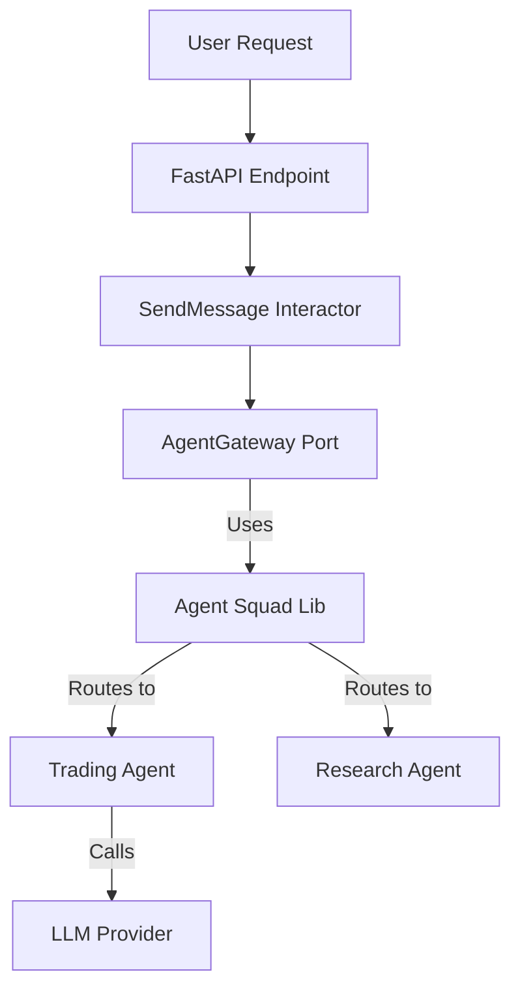

# Agent Squad Library Specification

## 1. Strategic Overview (CTO Perspective)
**Agent Squad** (formerly Multi-Agent Orchestrator) is our chosen framework for orchestrating complex, multi-turn conversations between specialized AI agents. In the context of **Anvil Backend**, this library will serve as the "brain" of our interaction layer, routing user intent to the correct specialized agent (e.g., Trading Agent vs. Research Agent).

Its dual support for Python and TypeScript aligns with our potential future needs for a unified mental model across backend (Python) and potential edge/frontend orchestrators (TS), though our primary implementation is Python.

## 2. Use Cases

### Primary: Intent Routing
- **Scenario**: A user asks "What's the APY for USDC on Aave, and can you swap 100 ETH for me?"
- **Execution**: Agent Squad classifies the intent. It might route the first part to a *Research Agent* and the second to a *Trading Agent* (or a Supervisor that coordinates both).

### Secondary: Context Preservation
- **Scenario**: User asks "Is that risky?" after receiving a trade suggestion.
- **Execution**: The orchestrator maintains the conversation history, allowing the *Risk Agent* to understand "that" refers to the previous trade suggestion.

### Tertiary: Supervisor Coordination
- **Scenario**: "Create a balanced portfolio for me."
- **Execution**: A *Supervisor Agent* breaks this down into tasks for *Research*, *Risk*, and *Allocation* agents, aggregating their outputs into a single coherent response.

## 3. Architecture & Integration

### System Fit
Agent Squad sits in the **Infrastructure Layer** as an adapter for our `AgentGateway` port.



### Key Components
- **Orchestrator**: The main entry point.
- **Classifiers**: Determine which agent should handle a request.
- **Agents**: Specialized workers (Bedrock, OpenAI, Lex).
- **Storage**: Persists conversation state (mapped to our `conversations` table).

## 4. Implementation Examples

### Basic Setup (Python)
```python
from agent_squad.orchestrator import AgentSquad
from agent_squad.agents import BedrockLLMAgent, BedrockLLMAgentOptions

# Initialize
orchestrator = AgentSquad()

# Add Trading Agent
trading_agent = BedrockLLMAgent(BedrockLLMAgentOptions(
    name="Trading Agent",
    description="Executes trades and swaps on DeFi protocols.",
    model_id="anthropic.claude-3-sonnet..."
))
orchestrator.add_agent(trading_agent)

# Routing
async def handle_message(user_input, user_id, session_id):
    response = await orchestrator.route_request(
        user_input,
        user_id,
        session_id
    )
    return response
```

## 5. Integration Strategy
1.  **Wrap**: Create a `AgentSquadGateway` class in `src/app/infrastructure/adapters/` that implements our domain's `AgentGateway` protocol.
2.  **Configure**: Load agent definitions (Trading, Risk, etc.) from our `AgentType` enum and system configuration.
3.  **Storage**: Implement a custom storage provider for Agent Squad that uses our `ConversationRepositorySqla` to keep data in our PostgreSQL DB.
