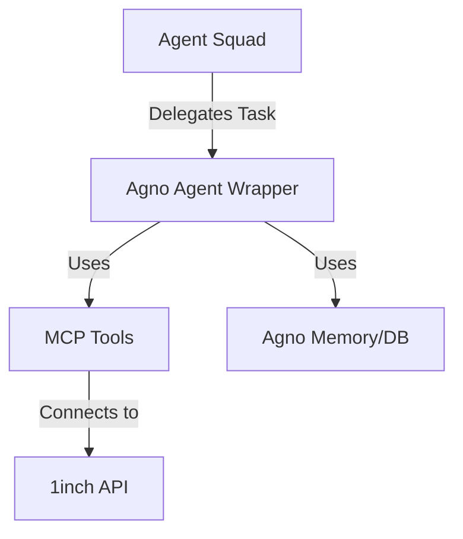

# Agno Library Specification

## 1. Strategic Overview (CTO Perspective)
**Agno** acts as our high-performance runtime and "AgentOS". While *Agent Squad* focuses on orchestration and routing, **Agno** provides the robust runtime environment, memory management, and tool abstraction (via MCP - Model Context Protocol) necessary for individual agents to function effectively at scale.

Its focus on performance (µs instantiation) and memory efficiency makes it ideal for high-frequency agent operations, such as real-time market monitoring or handling concurrent user sessions during market volatility.

## 2. Use Cases

### Primary: High-Performance Agent Runtime
- **Scenario**: 10,000 concurrent users querying market data.
- **Execution**: Agno provides the lightweight runtime containers for these agents, ensuring low latency and minimal memory footprint compared to heavier frameworks.

### Secondary: Tool Abstraction (MCP)
- **Scenario**: Integrating with 1inch, DeFiLlama, and internal APIs.
- **Execution**: Agno's MCP support allows us to wrap these external services as standard tools that agents can discover and use safely.

### Tertiary: Knowledge & RAG
- **Scenario**: "Analyze the whitepaper of Protocol X."
- **Execution**: Agno's built-in RAG capabilities (Knowledge) allow agents to ingest and query PDF/Text documents efficiently using vector stores.

## 3. Architecture & Integration

### System Fit
Agno serves as the **Execution Engine** within our Infrastructure layer. It complements Agent Squad.



### Key Components
- **Agent**: The core unit of work.
- **AgentOS**: The runtime environment (FastAPI based, though we use our own FastAPI, we can leverage Agno's patterns).
- **Tools**: Function calling abstractions.
- **Knowledge**: Vector database integration.

## 4. Implementation Examples

### Agent Definition with Tools
```python
from agno.agent import Agent
from agno.models.openai import OpenAIChat
from agno.tools.mcp import MCPTools

# Define a specialized DeFi Agent
defi_agent = Agent(
    name="DeFi Analyst",
    model=OpenAIChat(id="gpt-4-turbo"),
    tools=[MCPTools(url="http://localhost:8080/mcp/defi")], # Connecting to our internal DeFi MCP
    instructions="You are a DeFi expert. Use the tools to fetch live data.",
    markdown=True
)

# Execution
response = defi_agent.run("What is the current TVL of Uniswap?")
```

## 5. Integration Strategy
1.  **Hybrid Model**: Use *Agent Squad* for top-level user intent routing, but implement the specific agents (Trading, Research) using **Agno** for its superior tool handling and performance.
2.  **Tooling**: Expose our `DefiDataProvider` adapters as Agno-compatible tools or MCP servers.
3.  **Telemetry**: Leverage Agno's built-in telemetry to populate our `agent_executions` and `agent_tools_usage` tables.
